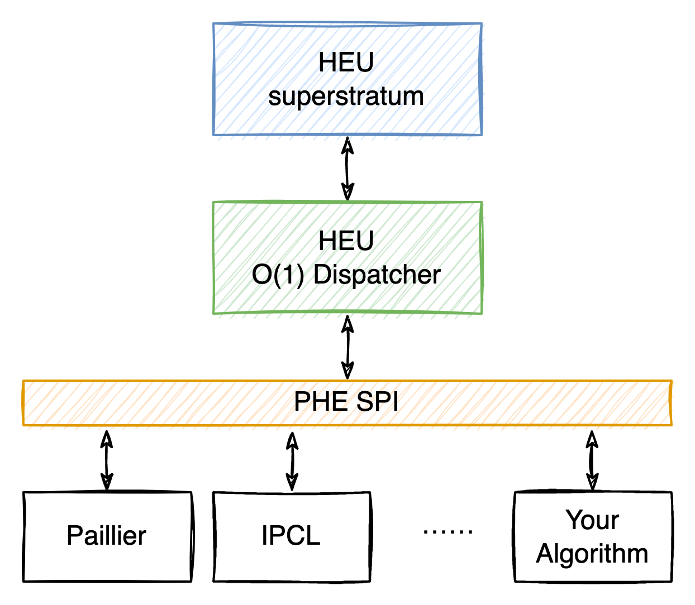

:target{#id1}

# Develop new algorithms

HEU supports adding customization PHE algorithms. After adding a new PHE algorithm, all upper-layer applications can seamlessly switch to the new algorithm, and users do not need to modify any business code.



HEU defines a set of Service Provider Interface (SPI), any algorithm which is conformed to the SPI definition can be connected to HEU. The algorithm complexity of HEU dispatcher is O(1), that is, the overhead of algorithm dispatching is independent of the type of underlying algorithms. You can easily add customization algorithms to HEU without worrying about burdening your HEU.

The following is an example of adding a new “Mock” algorithm into HEU to show how to develop and add a new PHE algorithm in HEU. The new algorithm’s code files should be placed in `heu/library/algorithms/`.

<Container type="admonition" title={"Some caveats"}>
  1. Developing a new algorithm requires implementing `Plaintext`, `Ciphertext`, `PublicKey`, `SecretKey`, `KeyGenerator`, `Encryptor`, `Decryptor` and \`\` Evaluator\`\`, a total of 8 classes. Please do not modify the class name, and all classes must be placed under `heu::lib::algorithms::your_algo` namespace, where `your_algo` should be replaced with the actual algorithm name, Otherwise it will fail to compile.
  2. SPI only specifies the public methods that must be implemented in these 8 classes. SPI does not restrict you from adding other methods and fields. You are free to add them according to the needs of your algorithm.
</Container>

:target{#id2}

## Define basic data structures

Generally speaking, the range space of PHE is relatively large, far beyond the range of C++ int128, so your algorithm needs to rely on a large integer arithmetic library. HEU SPI is not bound to any big integerarithmetic library, you can choose any suitable big integer library.

The next step is to define `Plaintext` and `Ciphertext` data structure.

:target{#plaintext}

### Define Plaintext

The SPI of `Plaintext class` is shown as follows:

<figure id="id14">
  <figcaption>
    heu/library/algorithms/clean\_template/plaintext.h
  </figcaption>

  ```C++
  #include "yacl/base/byte_container_view.h"

  #include "heu/library/algorithms/util/spi_traits.h"

  namespace heu::lib::algorithms::your_algo {

  class Plaintext {
   public:
    explicit Plaintext() = default;

    // Plaintext -> primitive type
    // T could be (u)int8/16/32/64/128
    template <typename T>
    T Get() const;

    // Set primitive value
    // T could be (u)int8/16/32/64/128
    template <typename T>
    void Set(T value);
    // Set big number by string
    void Set(const std::string &num, int radix);

    yacl::Buffer Serialize() const;
    void Deserialize(yacl::ByteContainerView buffer);

    std::string ToString() const;
    friend std::ostream &operator<<(std::ostream &os, const Plaintext &pt);
    std::string ToHexString() const;

    yacl::Buffer ToBytes(size_t byte_len, Endian endian = Endian::native) const;
    void ToBytes(unsigned char *buf, size_t buf_len,
                 Endian endian = Endian::native) const;

    size_t BitCount() const;

    Plaintext operator-() const;
    void NegateInplace();

    bool IsZero() const;      // [SPI: Critical]
    bool IsPositive() const;  // [SPI: Important]
    bool IsNegative() const;  // [SPI: Important]

    Plaintext operator+(const Plaintext &op2) const;
    Plaintext operator-(const Plaintext &op2) const;
    Plaintext operator*(const Plaintext &op2) const;
    Plaintext operator/(const Plaintext &op2) const;
    Plaintext operator%(const Plaintext &op2) const;
    Plaintext operator&(const Plaintext &op2) const;
    Plaintext operator|(const Plaintext &op2) const;
    Plaintext operator^(const Plaintext &op2) const;
    Plaintext operator<<(size_t op2) const;
    Plaintext operator>>(size_t op2) const;

    Plaintext operator+=(const Plaintext &op2);
    Plaintext operator-=(const Plaintext &op2);
    Plaintext operator*=(const Plaintext &op2);
    Plaintext operator/=(const Plaintext &op2);
    Plaintext operator%=(const Plaintext &op2);
    Plaintext operator&=(const Plaintext &op2);
    Plaintext operator|=(const Plaintext &op2);
    Plaintext operator^=(const Plaintext &op2);
    Plaintext operator<<=(size_t op2);
    Plaintext operator>>=(size_t op2);

    bool operator>(const Plaintext &other) const;
    bool operator<(const Plaintext &other) const;
    bool operator>=(const Plaintext &other) const;
    bool operator<=(const Plaintext &other) const;
    bool operator==(const Plaintext &other) const;
    bool operator!=(const Plaintext &other) const;

    // static helper functions //
    // Generates a uniformly distributed random number of "bit_size" size
    static void RandomExactBits(size_t bit_size, Plaintext *r);
    // Generates a uniformly distributed random number in [0, N)
    static void RandomLtN(const Plaintext &n, Plaintext *r);
  };

  }  // namespace heu::lib::algorithms::your_algo
  ```
</figure>

The `Plaintext class` has many public interfaces. This is because HEU is not bound to any large integer library, and all plaintext calculations rely on the Plaintext SPI. So you need to implement these interfaces one by one.

Here are some additional notes about the `ToBytes` method in SPI:

1. `ToBytes` functions similarly to the [python int.to\_bytes](https://docs.python.org/3/library/stdtypes.html#int.to_bytes) method.
2. About the difference between `ToBytes()` and `Serialize()` method: The `Serialize()` method is used to transfer data between different HEU instances, so the serialized bytes only need to be parsed by HEU itself, which could be very close to the Bignumber’s memory storage layout to maximize performance; However, the `ToBytes()` method is used to transfer data between HEU and other devices, so the byte format must be publicly known. At present, devices use the numpy byte format uniformly. And numpy internally calls the to\_bytes() method of Python built-in type int, so essentially `Plaintext` needs to implement a method similar to python int’s to\_bytes() to convert a big number into big/little endian storage with a specified byte size. Because of the existence of conversion, the performance of `ToBytes()` is generally lower than `serialize()`. Another difference is that `ToBytes()` is unidirectional and only needs to implement plaintext to bytes conversion, no need to implement reverse conversion.

:target{#ciphertext}

### Define Ciphertext

The SPI of `Ciphertext class` is shown as follows:

<figure id="id15">
  <figcaption>
    heu/library/algorithms/clean\_template/ciphertext.h
  </figcaption>

  ```C++
  #include <ostream>
  #include <string>

  #include "yacl/base/byte_container_view.h"

  namespace heu::lib::algorithms::your_algo {

  // SPI: Do not change class name.
  class Ciphertext {
   public:
    Ciphertext() = default;

    std::string ToString() const;
    friend std::ostream &operator<<(std::ostream &os, const Ciphertext &c);

    bool operator==(const Ciphertext &other) const;
    bool operator!=(const Ciphertext &other) const;

    yacl::Buffer Serialize() const;
    void Deserialize(yacl::ByteContainerView in);
  };

  }  // namespace heu::lib::algorithms::your_algo
  ```
</figure>

:target{#keys}

## Define keys

The next step is to define data structures related to Key, their SPIs are as follows:

`PublicKey class`：

<figure id="id16">
  <figcaption>
    heu/library/algorithms/clean\_template/public\_key.h
  </figcaption>

  ```C++
  #include "heu/library/algorithms/clean_template/plaintext.h"

  namespace heu::lib::algorithms::your_algo {

  class PublicKey {
   public:
    bool operator==(const PublicKey &other) const;
    bool operator!=(const PublicKey &other) const;

    std::string ToString() const;

    // Valid plaintext range: [max_int_, -max_int_]
    const Plaintext &PlaintextBound() const &;

    yacl::Buffer Serialize() const;
    void Deserialize(yacl::ByteContainerView in);
  };

  }  // namespace heu::lib::algorithms::your_algo
  ```
</figure>

`SecretKey class`：

<figure id="id17">
  <figcaption>
    heu/library/algorithms/clean\_template/secret\_key.h
  </figcaption>

  ```C++
  #include "yacl/base/byte_container_view.h"

  namespace heu::lib::algorithms::your_algo {

  class SecretKey {
   public:
    bool operator==(const SecretKey &other) const;
    bool operator!=(const SecretKey &other) const;

    std::string ToString() const;

    yacl::Buffer Serialize() const;
    void Deserialize(yacl::ByteContainerView in);
  };

  }  // namespace heu::lib::algorithms::your_algo
  ```
</figure>

`KeyGenerator class`：

<figure id="id18">
  <figcaption>
    heu/library/algorithms/clean\_template/key\_generator.h
  </figcaption>

  ```C++
  #include "heu/library/algorithms/clean_template/public_key.h"
  #include "heu/library/algorithms/clean_template/secret_key.h"

  namespace heu::lib::algorithms::your_algo {

  class KeyGenerator {
   public:
    // Generate PHE key pair
    static void Generate(int key_size, SecretKey* sk, PublicKey* pk);
    // Generate PHE key pair by default configs
    static void Generate(SecretKey* sk, PublicKey* pk);
  };

  }  // namespace heu::lib::algorithms::your_algo
  ```
</figure>

:target{#id3}

## Define manipulators

Once the basic data structure and public/private keys are defined, the next step is to define the manipulators, which are `Encryptor`, `Decryptor` and `Evaluator`. In order to support algorithms with different characteristics, HEU provides two distinct sets of SPIs, namely Scalar SPI and Vectorized SPI.

- Scalar SPI: Suitable for most algorithms, processing only one plaintext or ciphertext in one call.
- Vectorized SPI: Suitable for hardware-accelerated algorithms, such as GPU, where parallelism is required. Vectorized SPI implements a SIMD calling pattern, which allows for parallel optimization at algorithm implementation level.

You only need to implement one of the Scalar SPI and Vectorized SPI sets, and the HEU O(1) dispatcher will automatically decide which SPI set to call. Of course, it will be better if you implement both Scalar SPI and Vectorized SPI. At this time, the HEU O(1) dispatcher will switch between the two sets of SPI according to the usage scenario, and your algorithm will obtain the best performance.

<Container type="admonition" title={"The principle of HEU O(1) dispatcher supporting multiple SPIs"}>
  In order to better help developers understand the SPI handover mechanism, let’s introduce the principle of how the HEU O(1) Dispatcher detects whether the SPI is implemented.

  HEU O(1) Dispatcher uses the ‘std::experimental::is\_detected’ struct to check whether a class implements a method. Here’s how it works:

  ```C++
  #include <experimental/type_traits>

  // Check if T has a member function .Serialize()
  template <typename T>
  using kHasSerializeMethod = decltype(std::declval<T&>().Serialize());

  void foobar(const CLAZZ &obj) {
     if constexpr (std::experimental::is_detected_v<kHasSerializeMethod, CLAZZ>) {
         obj.Serialize();
     } else {
         obj.Other();
     }
  }
  ```
</Container>

:target{#scalar-spi}

### Scalar SPI only

If you only implement Scalar SPI, you need to implement the following interface:

`Encryptor class`：

<figure id="id19">
  <figcaption>
    heu/library/algorithms/clean\_template/scalar\_encryptor.h
  </figcaption>

  ```C++
  #include "heu/library/algorithms/clean_template/ciphertext.h"
  #include "heu/library/algorithms/clean_template/plaintext.h"
  #include "heu/library/algorithms/clean_template/public_key.h"

  namespace heu::lib::algorithms::your_algo {

  class Encryptor {
   public:
    explicit Encryptor(const PublicKey& pk);

    Ciphertext EncryptZero() const;
    Ciphertext Encrypt(const Plaintext& m) const;

    std::pair<Ciphertext, std::string> EncryptWithAudit(const Plaintext& m) const;
  };

  }  // namespace heu::lib::algorithms::your_algo
  ```
</figure>

Encryptor requires the implementation of a special `EncryptWithAudit` interface, because some institutions have special requirements, requiring all Secretflow behaviors to have post-audit capabilities, that is, all calculation processes can be restored. For PHE encryption, the random number used for encryption needs to be returned to caller for logging.

The audit string returned by `EncryptWithAudit` must contain at least three pieces of information: the plaintext, the ciphertext, and the random number used for encryption. There is no requirement for the format of the string, as long as it is parsable by program. It is better if the generated string is human-readable. You can see actual audit string samples by:

```C++
from heu import phe

kit = phe.setup(phe.SchemaType.ZPaillier, 2048)
print(kit.encryptor().encrypt_with_audit(kit.plaintext(1)))
```

`Decryptor class`：

<figure id="id20">
  <figcaption>
    heu/library/algorithms/clean\_template/scalar\_decryptor.h
  </figcaption>

  ```C++
  #include <utility>

  #include "heu/library/algorithms/clean_template/ciphertext.h"
  #include "heu/library/algorithms/clean_template/plaintext.h"
  #include "heu/library/algorithms/clean_template/public_key.h"
  #include "heu/library/algorithms/clean_template/secret_key.h"

  namespace heu::lib::algorithms::your_algo {

  class Decryptor {
   public:
    explicit Decryptor(const PublicKey& _, const SecretKey& sk);

    void Decrypt(const Ciphertext& ct, Plaintext* out) const;
    Plaintext Decrypt(const Ciphertext& ct) const;
  };

  }  // namespace heu::lib::algorithms::your_algo
  ```
</figure>

`Evaluator class`：

<figure id="id21">
  <figcaption>
    heu/library/algorithms/clean\_template/scalar\_evaluator.h
  </figcaption>

  ```C++
  #include "heu/library/algorithms/clean_template/ciphertext.h"
  #include "heu/library/algorithms/clean_template/plaintext.h"
  #include "heu/library/algorithms/clean_template/public_key.h"

  namespace heu::lib::algorithms::your_algo {

  class Evaluator {
   public:
    explicit Evaluator(const PublicKey& pk);

    void Randomize(Ciphertext* ct) const;

    Ciphertext Add(const Ciphertext& a, const Ciphertext& b) const;
    Ciphertext Add(const Ciphertext& a, const Plaintext& b) const;
    Ciphertext Add(const Plaintext& a, const Ciphertext& b) const;
    Plaintext Add(const Plaintext& a, const Plaintext& b) const;
    void AddInplace(Ciphertext* a, const Ciphertext& b) const;
    void AddInplace(Ciphertext* a, const Plaintext& b) const;
    void AddInplace(Plaintext* a, const Plaintext& b) const;

    Ciphertext Sub(const Ciphertext& a, const Ciphertext& b) const;
    Ciphertext Sub(const Ciphertext& a, const Plaintext& b) const;
    Ciphertext Sub(const Plaintext& a, const Ciphertext& b) const;
    Plaintext Sub(const Plaintext& a, const Plaintext& b) const;
    void SubInplace(Ciphertext* a, const Ciphertext& b) const;
    void SubInplace(Ciphertext* a, const Plaintext& p) const;
    void SubInplace(Plaintext* a, const Plaintext& b) const;

    Ciphertext Mul(const Ciphertext& a, const Plaintext& b) const;
    Ciphertext Mul(const Plaintext& a, const Ciphertext& b) const;
    Plaintext Mul(const Plaintext& a, const Plaintext& b) const;
    void MulInplace(Ciphertext* a, const Plaintext& b) const;
    void MulInplace(Plaintext* a, const Plaintext& b) const;

    // out = -a
    Ciphertext Negate(const Ciphertext& a) const;
    void NegateInplace(Ciphertext* a) const;
  };

  }  // namespace heu::lib::algorithms::your_algo
  ```
</figure>

:target{#vectorized-spi}

### Vectorized SPI only

The function of Vectorized SPI is the same as that of Scalar SPI. The change is the form of function parameters, from single plaintext/ciphertext object to plaintext/ciphertext object list.

When the algorithm only implements Vectorized SPI, the HEU O(1) Dispatcher will convert all operations into SIMD form calls, specifically:

- If user is performing a scalar calculation, the HEU O(1) Dispatcher will convert the argument to a length 1 list and then call the Vectorized SPI.
- If user is performing a matrix calculation, the HEU O(1) Dispatcher will split and convert the matrix into object pointer lists and then call Vectorized SPI.

Suppose that the user wants to perform element-wise operations on two matrices, such as element-wise addition, element-wise subtraction, and element-wise multiplication, the HEU O(1) Dispatcher will split the broadcast matrices elements into multiple equal parts, encapsulate each part into a list, and assign a thread to execute. The elements in a list are passed to the Vectorized SPI for execution at once, so that your algorithm can obtain a large enough concurrency space.


In the case of Matmul calculation, the HEU O(1) dispatcher converts the matrices into multiple lists by row or by column, and calls Vectorized SPI in parallel.


Vectorized SPI uses two types of `Span<T>` and `ConstSpan<T>` to pass parameters, among which:

- `Span<T>` represents a read-only array, each element is a pointer of T.
- `ConstSpan<T>` represents a read-only array, each element is a constant pointer of T.

`Encryptor class`：

<figure id="id22">
  <figcaption>
    heu/library/algorithms/clean\_template/vector\_encryptor.h
  </figcaption>

  ```C++
  #include "heu/library/algorithms/clean_template/ciphertext.h"
  #include "heu/library/algorithms/clean_template/plaintext.h"
  #include "heu/library/algorithms/clean_template/public_key.h"
  #include "heu/library/algorithms/util/spi_traits.h"

  namespace heu::lib::algorithms::your_algo {

  class Encryptor {
   public:
    explicit Encryptor(const PublicKey& pk);

    std::vector<Ciphertext> EncryptZero(int64_t size) const;
    std::vector<Ciphertext> Encrypt(ConstSpan<Plaintext> pts) const;

    std::pair<std::vector<Ciphertext>, std::vector<std::string>> EncryptWithAudit(
        ConstSpan<Plaintext> pts) const;
  };

  }  // namespace heu::lib::algorithms::your_algo
  ```
</figure>

`Decryptor class`：

<figure id="id23">
  <figcaption>
    heu/library/algorithms/clean\_template/vector\_decryptor.h
  </figcaption>

  ```C++
  #include "heu/library/algorithms/clean_template/ciphertext.h"
  #include "heu/library/algorithms/clean_template/plaintext.h"
  #include "heu/library/algorithms/clean_template/public_key.h"
  #include "heu/library/algorithms/clean_template/secret_key.h"
  #include "heu/library/algorithms/util/spi_traits.h"

  namespace heu::lib::algorithms::your_algo {

  class Decryptor {
   public:
    explicit Decryptor(const PublicKey& _, const SecretKey& sk);

    std::vector<Plaintext> Decrypt(ConstSpan<Ciphertext> cts) const;
    void Decrypt(ConstSpan<Ciphertext> in_cts, Span<Plaintext> out_pts) const;
  };

  }  // namespace heu::lib::algorithms::your_algo
  ```
</figure>

`Evaluator class`：

<figure id="id24">
  <figcaption>
    heu/library/algorithms/clean\_template/vector\_evaluator.h
  </figcaption>

  ```C++
  #include "heu/library/algorithms/clean_template/ciphertext.h"
  #include "heu/library/algorithms/clean_template/plaintext.h"
  #include "heu/library/algorithms/clean_template/public_key.h"
  #include "heu/library/algorithms/util/spi_traits.h"

  namespace heu::lib::algorithms::your_algo {

  class Evaluator {
   public:
    explicit Evaluator(const PublicKey& pk);

    void Randomize(Span<Ciphertext> ct) const;

    std::vector<Ciphertext> Add(ConstSpan<Ciphertext> a,
                                ConstSpan<Ciphertext> b) const;
    std::vector<Ciphertext> Add(ConstSpan<Ciphertext> a,
                                ConstSpan<Plaintext> b) const;
    std::vector<Ciphertext> Add(ConstSpan<Plaintext> a,
                                ConstSpan<Ciphertext> b) const;
    std::vector<Plaintext> Add(ConstSpan<Plaintext> a,
                               ConstSpan<Plaintext> b) const;

    void AddInplace(Span<Ciphertext> a, ConstSpan<Ciphertext> b) const;
    void AddInplace(Span<Ciphertext> a, ConstSpan<Plaintext> b) const;
    void AddInplace(Span<Plaintext> a, ConstSpan<Plaintext> b) const;

    std::vector<Ciphertext> Sub(ConstSpan<Ciphertext> a,
                                ConstSpan<Ciphertext> b) const;
    std::vector<Ciphertext> Sub(ConstSpan<Ciphertext> a,
                                ConstSpan<Plaintext> b) const;
    std::vector<Ciphertext> Sub(ConstSpan<Plaintext> a,
                                ConstSpan<Ciphertext> b) const;
    std::vector<Plaintext> Sub(ConstSpan<Plaintext> a,
                               ConstSpan<Plaintext> b) const;

    void SubInplace(Span<Ciphertext> a, ConstSpan<Ciphertext> b) const;
    void SubInplace(Span<Ciphertext> a, ConstSpan<Plaintext> p) const;
    void SubInplace(Span<Plaintext> a, ConstSpan<Plaintext> b) const;

    std::vector<Ciphertext> Mul(ConstSpan<Ciphertext> a,
                                ConstSpan<Plaintext> b) const;
    std::vector<Ciphertext> Mul(ConstSpan<Plaintext> a,
                                ConstSpan<Ciphertext> b) const;
    std::vector<Plaintext> Mul(ConstSpan<Plaintext> a,
                               ConstSpan<Plaintext> b) const;

    void MulInplace(Span<Ciphertext> a, ConstSpan<Plaintext> b) const;
    void MulInplace(Span<Plaintext> a, ConstSpan<Plaintext> b) const;

    // out = -a
    std::vector<Ciphertext> Negate(ConstSpan<Ciphertext> a) const;
    void NegateInplace(Span<Ciphertext> a) const;
  };

  }  // namespace heu::lib::algorithms::your_algo
  ```
</figure>

:target{#scalar-vectorized-spi}

### Hybrid Scalar/Vectorized SPI

The HEU O(1) Dispatcher probes which SPIs are implemented by algorithm at function level, so it’s fine to mix (or combine) both SPIs in a same class. For example, the `EncryptZero()` method in `Encryptor` class is only implemented as Scalar SPI. And `Encrypt()` method is implemented under both SPIs. In this case the HEU O(1) Dispatcher will choose the most appropriate SPI at function granularity.

<figure id="id25">
  <figcaption>
    heu/library/algorithms/clean\_template/mix\_spi\_demo.h
  </figcaption>

  ```C++
  #include "heu/library/algorithms/clean_template//ciphertext.h"
  #include "heu/library/algorithms/clean_template/plaintext.h"
  #include "heu/library/algorithms/clean_template/public_key.h"
  #include "heu/library/algorithms/util/spi_traits.h"

  namespace heu::lib::algorithms::your_algo {

  class Encryptor {
   public:
    explicit Encryptor(const PublicKey& pk) {}

    // Scalar SPI only
    Ciphertext EncryptZero() const { YACL_THROW("To be implemented"); }

    // Scalar SPI + Vectorized SPI
    Ciphertext Encrypt(const Plaintext& m) const {
      YACL_THROW("To be implemented");
    }

    std::vector<Ciphertext> Encrypt(ConstSpan<Plaintext> pts) const {
      YACL_THROW("To be implemented");
    }

    // Vectorized SPI only
    std::pair<std::vector<Ciphertext>, std::vector<std::string>> EncryptWithAudit(
        ConstSpan<Plaintext> pts) const {
      YACL_THROW("To be implemented");
    }
  };

  }  // namespace heu::lib::algorithms::your_algo
  ```
</figure>

:target{#id4}

## Register your algorithm

When the main body of algorithm is developed, the new algorithm needs to be registered in HEU. The registration location is located in the following two files:

- [heu/library/phe/base/schema.h](https://github.com/secretflow/heu/blob/main/heu/library/phe/base/schema.h)
- [heu/library/phe/base/schema.cc](https://github.com/secretflow/heu/blob/main/heu/library/phe/base/schema.cc)

Please follow the instructions in files to register your algorithm. The position marked with `[SPI: Please register your algorithm here]` is the place that needs to be updated. There are 5 places in total, four in `schema.h`, and one in `schema.cc`.

:target{#id5}

### Conditional compilation (optional)

We encourage developers to write highly portable code with low platform dependencies, so that your algorithms can be used by users on different platforms. Generally speaking. SecretFlow requires at least the support of three platforms Linux Mac(Intel) Mac(arm). However, for some algorithms involving hardware acceleration, it can be challenging to support all platforms, and conditional compilation can be considered.

Conditional compilation allows your algorithm to be completely stripped off during compilation, including your algorithm only on supported platforms. This prevents the entire HEU from failing to compile on a certain platform due to the inclusion of one algorithm.

Steps of Conditional compilation:

1. 在算法的入口头文件中定义 `ENABLE_YOUR_ALGO` 宏，例如 [ipcl.h](https://github.com/secretflow/heu/blob/main/heu/library/algorithms/paillier_ipcl/ipcl.h)
2. When registering the algorithm in schema.h/cc, reference the ENABLE\_YOUR\_ALGO macro, that is, do not hard-code true. This step can also refer to IPCL’s practice.

:target{#id6}

## Test and use

After the algorithm is developed, you also need to write a build script. HEU uses the bazel compilation system. You need to write a `BUILD.bazel` file in the same level directory of the algorithm, namely `heu/library/algorithms/your_algo/`.

- The syntax of `BUILD.bazel` can refer to [here](https://github.com/secretflow/heu/blob/main/heu/library/algorithms/mock/BUILD.bazel)
- For more Bazel tutorials, please refer to [Bazel official documentation](bazel.build.mdx)

After completing the Bazel script, please add your algorithm as a dependency to the corresponding `BUILD.bazel` file in `schema.h/cc`.

You can test that the compilation works with the following command:

```shell
bazel test --verbose_failures heu/library/...
```

<Container type="note">
  Once all code development is complete, please immediately update the CHANGELOGS \<[https://github.com/secretflow/heu/blob/main/CHANGELOGS.md](https://github.com/secretflow/heu/blob/main/CHANGELOGS.md)>\_ file.
</Container>

:target{#id8}

### Unit test

:target{#id9}

#### Develop your own unit tests (optional)

HEU unit tests are based on the [GoogleTest](github.com/google/googletest.mdx) framework. For the usage of GoogleTest, please refer to [GoogleTest official documentation](google.github.io/googletest.mdx).

Once the unit tests are developed, you can run the unit tests with:

```shell
bazel test --verbose_failures heu/library/algorithms/your_algo/...
```

:target{#id11}

#### Run existing unit tests (required)

HEU will automatically test your algorithm even if you haven’t written any unit tests. Please set up a Python 3.8 environment and execute the following command to test entire HEU:

```shell
bazel test --verbose_failures heu/...
```

:target{#id12}

### Benchmark

You can benchmark your algorithm with the following command:

```shell
# 测试算法在 scalar 运算场景下的性能
# Test the performance of your algorithm in scalar computing scenarios
bazel run -c opt heu/library/benchmark:phe -- --schema=your_algo_name_or_alias

# 测试算法在矩阵运算场景下的性能
# Test the performance of your algorithm in matrix operation scenarios
bazel run -c opt heu/library/benchmark:np -- --schema=your_algo_name_or_alias
```

If the `--schema` parameter is not added, all algorithms will be benchmarked by default, so that you can compare performance with other algorithms:

```shell
bazel run -c opt heu/library/benchmark:phe
bazel run -c opt heu/library/benchmark:np
```

:target{#id13}

### Application

After the unit tests are passed, execute the following commands to compile and install the HEU pip package so that your new algorithm can be used:

```shell
pip install pybind11 # Only need to run once

sh build_wheel_entrypoint.sh
```

Basic usage:

```Python
from heu import phe

kit = phe.setup(phe.SchemaType.YOUR_ALGO, 2048)
c1 = kit.encryptor().encrypt_raw(3)
c2 = kit.evaluator().add(c1, c1)
print(kit.decryptor().decrypt_raw(c2)) #6
```

<Container type="admonition" title={"Congratulation"}>
  Goog work! Your algorithm can be used in Secretflow now. And all PHE-based applications of Secretflow can seamlessly switch to your algorithm, such as WOE, HESS-LR, SecureBoost and so on. We believe these applications can definitely benefit from your algorithm, thank you for your contribution.
</Container>
