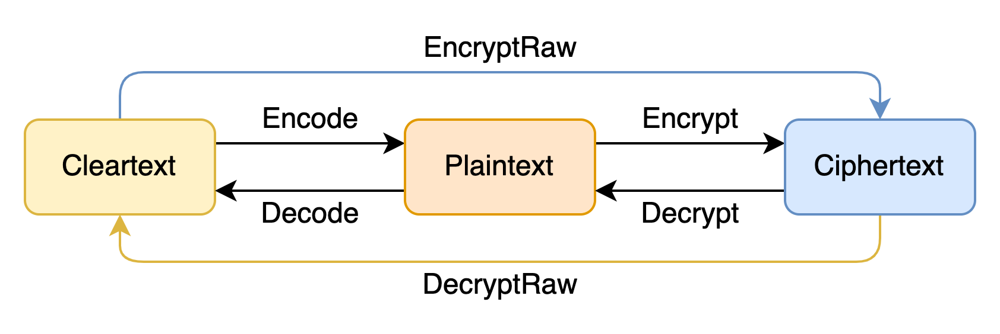
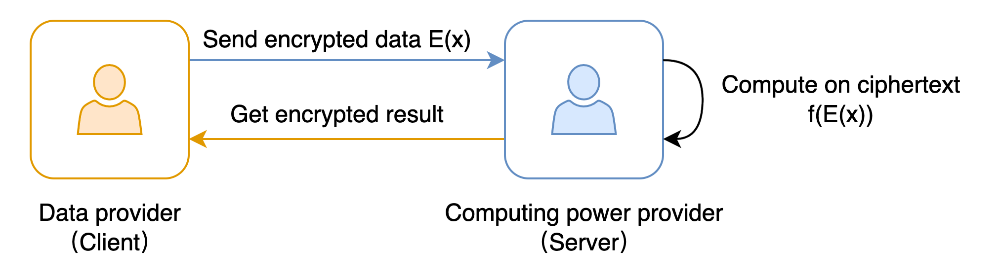

:target{#id1}

# Quick start

HEU can only be used as an Additive Homomorphic Encryption (AHE) Library now. Please refer to [Installation Instructions](installation.mdx) to install HEU before using it

<Container type="note">
  All contents mentioned in this article are implemented in `heu.phe` module
</Container>

:target{#id2}

## Encryption & Decryption

There are 3 types of objects in HEU:

<table id="id5">
  <caption>
    Object types in HEU
  </caption>

  <thead>
    <tr>
      <td>
        Objects
      </td>

      <td>
        Data type
      </td>

      <td>
        Description
      </td>
    </tr>
  </thead>

  <tbody>
    <tr>
      <td>
        Cleartext
      </td>

      <td>
        Native data types in python
      </td>

      <td>
        python native data types, such as int, float
      </td>
    </tr>

    <tr>
      <td>
        Plaintext
      </td>

      <td>
        phe.Plaintext
      </td>

      <td>
        The encoded cleartext which is always an integer
      </td>
    </tr>

    <tr>
      <td>
        Ciphertext
      </td>

      <td>
        phe.Ciphertext
      </td>

      <td>
        Ciphertext
      </td>
    </tr>
  </tbody>
</table>

The conversion methods between three objects are as follows:



Basic usage of HEU

```python3
from heu import phe

kit = phe.setup(phe.SchemaType.ZPaillier, 2048)
encryptor = kit.encryptor()
evaluator = kit.evaluator()
decryptor = kit.decryptor()

c1 = encryptor.encrypt_raw(3)
c2 = encryptor.encrypt_raw(5)
evaluator.add_inplace(c1, c2)  # c1 += c2

decryptor.decrypt_raw(c1)  # output 8
```

<Container type="note">
  The `encrypt_raw` and `decrypt_raw` interfaces support arbitrary precision, and the conversion precision is the same as the range of value supported by HE algorithm itself. The exact range varies from algorithm to algorithm, but is generally much larger than C++ int128\_t’s range.
</Container>

:target{#id3}

## Encoding

Currently HEU provides five kinds of `Encoders`:

- `phe.IntegerEncoder`: Encode int128 integers
- `phe.FloatEncoder`: Encode floating-point (double) numbers
- `phe.BigintEncoder` Encode arbitrary-precision integers
- `phe.BatchIntegerEncoder`: Encode two int64 integer cleartexts into one plaintext
- `phe.BatchFloatEncoder`: Encode two float64 cleartexts into one plaintext

Methods to create Encoders (take `phe.IntegerEncoder` as an example)

Method 1:

```python3
encoder = phe.IntegerEncoder(phe.SchemaType.ZPaillier)
```

Method 2:

```python3
kit = phe.setup(phe.SchemaType.ZPaillier, 2048)
encoder = phe.IntegerEncoder(kit.get_schema())
```

Method 3:

```python3
kit = phe.setup(phe.SchemaType.ZPaillier, 2048)
encoder = kit.integer_encoder()
```

:target{#integerencoder-floatencoder}

### IntegerEncoder & FloatEncoder

`phe.IntegerEncoder` and `FloatEncoder` are similar in principle, both multiply cleartextby a scale to convert it into plaintext, so the size of the scale determines the precision of calculation. If the IntegerEncoder/FloatEncoder object is created without arguments, the default scale `1e6` is used.

<Container type="warning">
  `phe.IntegerEncoder` has an upper limit, please make sure the scaled cleartextis less than 128 bits
</Container>

<Container type="warning">
  `phe.FloatEncoder` has an upper limit, please make sure the scaled plaintext is in the representation range of (double) floating-point numbers
</Container>

```python3
from heu import phe

encoder = phe.IntegerEncoder(phe.SchemaType.ZPaillier)
pt = encoder.encode(3.5)
print(type(pt))  # heu.phe.Plaintext
print(pt)  # 3000000
print(encoder.decode(pt))  # 3

encoder = phe.FloatEncoder(phe.SchemaType.ZPaillier)
pt = encoder.encode(3.5)
print(encoder.decode(pt))  # 3.5
```

:target{#bigintencoder}

### BigintEncoder

`BigintEncoder` is similar to `IntegerEncoder(scale=1)`, but supports encoding arbitrary precision integers. The BigintEncoder is used by default when user does not specify an encoder.

<Container type="note">
  `BigintEncoder` has very high performance for cleartexts less than int128, but the performance will be significantly reduced for cleartexts more than 128 bits
</Container>

```python3
from heu import phe

encoder = phe.BigintEncoder(phe.SchemaType.ZPaillier)
int64_max = 9223372036854775807
pt = encoder.encode(int64_max**10)
print(encoder.decode(pt) == int64_max**10)  # True
```

:target{#batchintegerencoder-batchfloatencoder}

### BatchIntegerEncoder & BatchFloatEncoder

BatchIntegerEncoder 和 BatchFloatEncoder 是上述 IntegerEncoder、FloatEncoder 的 batch 版本，功能类似，但是 BatchEncoder 支持将两个原文（Cleartext，int64整数）打包加密到一个明文（Plaintext）中，实现 SIMD 功能。


<Container type="warning">
  `phe.BatchIntegerEncoder` has an upper limit on cleartext size, please make sure each cleartext is less than 64 bits
</Container>

<Container type="caution">
  BatchIntegerEncoder and BatchFloatEncoder are not fully compatible with cryptographic subtraction. They can only be used when all elements in ciphertext are positive integers. If you cannot infer the value range of elements, cryptographic subtraction should be avoided.
</Container>

```python3
from heu import phe

kit = phe.setup(phe.SchemaType.ZPaillier, 2048)
encryptor = kit.encryptor()
evaluator = kit.evaluator()
decryptor = kit.decryptor()

bc = kit.batch_integer_encoder()
pt1 = bc.encode(123, 456)
pt2 = bc.encode(789, 101112)

ct1 = encryptor.encrypt(pt1)
ct2 = encryptor.encrypt(pt2)

# output: (912, 101568)
print(bc.decode(decryptor.decrypt(evaluator.add(ct1, ct2))))
# When using batch encoding, please pay special attention to subtraction,
# which can only be used when all elements in ciphertext are positive integers.
# output: (-666, -100656)
print(bc.decode(decryptor.decrypt(evaluator.sub(ct1, ct2))))
```

<Container type="note">
  BatchEncoder 当前一次仅支持打包2个原文，如果您有打包更多数字的需求，欢迎提 Issue 或者直接参与共建。
</Container>

:target{#id4}

## Persistence

In practical scenarios, privacy preserving computing often involves multiple parties, which requires objects to have serialization and deserialization capabilities. The object persistence capability in HEU relies on Pickle.

In a typical usage scenario, the client is data provider and the server is computing power provider. Assuming that the client does not trust the server, so the client chooses to encrypt private data first and then send it to server. The server perform calculations on ciphertext and returns the result to the client.



```python3
import pickle
from heu import phe

# client: encrypt
client_he = phe.setup(phe.SchemaType.ZPaillier, 2048)
pk_buffer = pickle.dumps(client_he.public_key())

ct1_buffer = pickle.dumps(client_he.encryptor().encrypt_raw(123))
ct2_buffer = pickle.dumps(client_he.encryptor().encrypt_raw(456))

# server: calc ct1 - ct2
# server_he supports encryption and cryptographic operations, but doesn't support decryption
server_he = phe.setup(pickle.loads(pk_buffer))
ct3 = server_he.evaluator().sub(pickle.loads(ct1_buffer), pickle.loads(ct2_buffer))
ct3_buffer = pickle.dumps(ct3)

# client: decrypt
ct_x = pickle.loads(ct3_buffer)
print(client_he.decryptor().decrypt_raw(ct_x))  # -333
```
