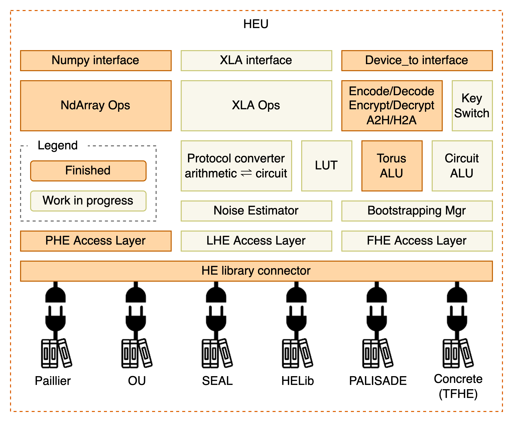

:target{#heu}

# HEU Documentation

Homomorphic Encryption processing Unit (HEU) is a sub-project of Secretflow that implements high-performance homomorphic encryption algorithms.

HEU aims to simplify the use of homomorphic encryption (HE) for data scientists. Particular care was given to the simplicity of our Python package in order to make it usable by any data scientist, even those without prior cryptography knowledge.

Since HEU is still in its infancy, HEU can only be used as a library and it is not ready to execute arbitrary programs like SPU.

<TableOfContents>

  

    Contents
  

  - [Getting started](getting_started/index.mdx)
    - [Installation](getting_started/installation.mdx)
    - [Quick start](getting_started/quick_start.mdx)
    - [Matrix Operations](getting_started/numpy.mdx)
    - [Algorithm Selection](getting_started/algo_choice.mdx)
    - [Frequently asked questions (FAQ)](getting_started/faq.mdx)
  - [Development](development/index.mdx)
    - [HEU Architecture](development/arch.mdx)
    - [Develop new algorithms](development/phe_dev.mdx)
  - [API Reference](references/index.mdx)
    - [PHE Module](references/phe_api.mdx)
    - [Numpy Module](references/numpy_api.mdx)
    - [Upgrade Guide](references/upgrade_guide.mdx)
</TableOfContents>
