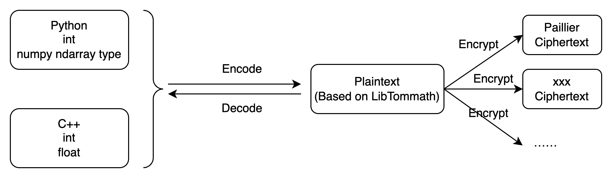
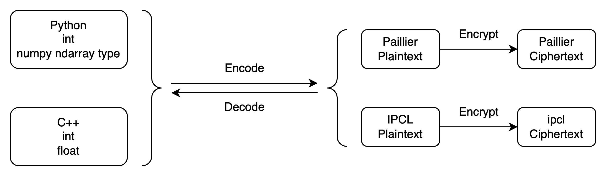
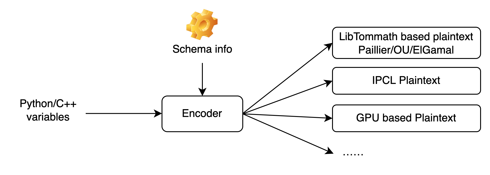

:target{#id1}

# Upgrade Guide

<style>
  {"\n    .red {color:#CC6600}\n    .blue {color:#6C8EBF}\n"}
</style>

:target{#heu-0-3-x-0-4-x}

## HEU 0.3.x → 0.4.x

:target{#api}

### API changes

HEU 0.4 版本将 `phe.BatchEncoder` 拆分成了2个：`phe.BatchIntegerEncoder` 和 `phe.BatchFloatEncoder`。

HEU 0.3 中的 `phe.BatchEncoder` 并不支持编码浮点数，为了让 BatchEncoder 支持浮点数编码，HEU 0.4 新增了 `phe.BatchFloatEncoder`，同时为了命名上的清晰性，我们将老旧的 `phe.BatchEncoder` 改名成了 `phe.BatchIntegerEncoder`

:target{#id2}

### 用户代码怎么改

您可以将老代码中的 BatchEncoder 查找替换为 BatchIntegerEncoder 即可，两者功能等价。

:target{#heu-0-2-x-0-3-x}

## HEU 0.2.x → 0.3.x

:target{#id3}

### Background

HEU version 0.2 is strongly coupled with the large integer arithmetic library Libtommath, that means all algorithms must be developed based on Libtommath, which limits the development space of algorithms. In order to support more types of HE algorithms, HEU version 0.3 has made a major upgrade to the underlying architecture. Libtommath and HE algorithms are decoupled completely, and the underlying implementation of the algorithms are no longer limited, so that algorithm developers have more room to play.

Before：The enc/dec flow of version 0.2.x

The Encoder first converts the original data type into an MPInt object (i.e. Plaintext) based on LibTommath, and then converts the MPInt plaintext into the corresponding Ciphertext by different HE algorithms.



After：The enc/dec flow of version 0.3.x

The Encoder directly converts the original data type into the Plaintext corresponding to the HE algorithm. The underlying plaintext defined by different algorithms allows to have completely different data structures.



In order to generate correct Plaintexts, the Encoder needs to pass in additional Schema information:

:target{#id4}

### API changes

The main change is that creating Plaintext requires passing in Schema information

Scalar operations

```python3
from heu import phe
kit = phe.setup(phe.SchemaType.ZPaillier, 2048)

# Create plaintext object via encoder (recommend)
# Create encoder:
# Before: edr = phe.BigintEncoder()
# Now:
edr = phe.BigintEncoder(kit.get_schema())
# Or:
edr = kit.bigint_encoder()
pt = edr.encode(123456789)

# Create plaintext object directly
# Before: phe.Plaintext(123)
# Now:
phe.Plaintext(kit.get_schema(), c)
```

matrix operations

```python3
from heu import numpy as hnp
from heu import phe
kit = hnp.setup(phe.SchemaType.ZPaillier, 2048)

# Create plaintext matrix (solution 1)
# Before: pt = hnp.array([1, 2, 3])
# Now:
pt = kit.array([1, 2, 3])

# Create plaintext matrix (solution 2)
# Before: pt = hnp.array([1, 2, 3], phe.IntegerEncoder())
# Now:
pt = hnp.array([1, 2, 3], kit.integer_encoder(scale=100))
# Or:
pt = hnp.array([1, 2, 3], phe.IntegerEncoder(kit.get_schema(), scale=100))
# Or:
pt = kit.array([1, 2, 3], phe.IntegerEncoderParams(scale=100))
```

:target{#id5}

### 用户代码怎么改

如果编译报错，请将 schema 参数传入即可，例如这一行编译报错：`phe.BigintEncoder()`，改为 `phe.BigintEncoder(kit.get_schema())` 即可，具体参考上一节 <strong>API 变更</strong> 内容。
