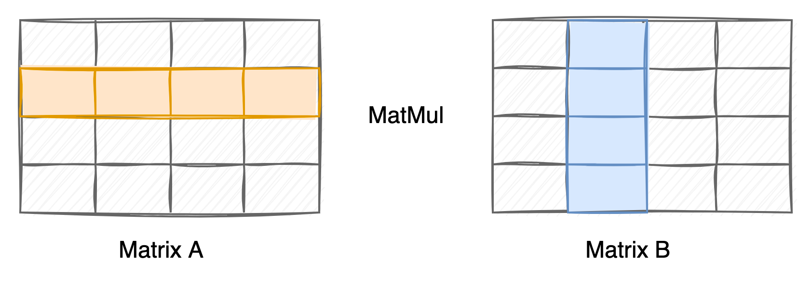

:target{#id1}

# 开发新算法

HEU 支持添加自定义 PHE 算法，添加新的 PHE 算法后，上层所有应用都可以无缝切换到新的算法上，用户无需修改任何业务代码。


HEU 定义了一套 SPI (Service Provider Interface)，任何符合 SPI 定义的算法都可接入到 HEU 中，HEU 的算法分配器（dispatcher）是 O(1) 效率的，也就是算法分配的开销与底层算法种类无关，您可以放心向 HEU 添加多种算法而无需担心对 HEU 造成负担。

下文以添加一种 Mock 算法为例，介绍如何在 HEU 中添加、实现一种新的 PHE 算法。新算法的代码文件请存放到 `heu/library/algorithms/` 路径下。

<Container type="admonition" title={"\u4e00\u4e9b\u524d\u7f6e\u8bf4\u660e"}>
  1. 开发一个新算法需要实现 `Plaintext`、`Ciphertext`、`PublicKey`、`SecretKey`、`KeyGenerator`、`Encryptor`、`Decryptor`、`Evaluator` 共 8 个 Class，请勿修改 Class name，所有 Class 都必须放置在 `heu::lib::algorithms::your_algo` namespace 下，其中 `your_algo` 使用实际的算法名称替换，否则将编译失败
  2. SPI 只规定了这 8 个 Class 必须要实现的 public 方法，SPI 并没有限制您添加其它方法与字段，您可以根据算法需要自由添加。
</Container>

:target{#id2}

## 定义数据结构

一般而言，PHE 的值域空间都比较大，远超 C++ int128 范围，因此您需要选定一个大整数运算库。HEU SPI 并没有绑定在任何一个大整数运算库上，您可以任意选定一个合适的大整数库。

选定大数库后，下一步定义 Plaintext 与 Ciphertext 结构。

:target{#plaintext}

### 定义 Plaintext

`Plaintext class` 的 SPI 接口如下：

<figure id="id14">
  <figcaption>
    heu/library/algorithms/clean\_template/plaintext.h
  </figcaption>

  ```C++
  #include "yacl/base/byte_container_view.h"

  #include "heu/library/algorithms/util/spi_traits.h"

  namespace heu::lib::algorithms::your_algo {

  class Plaintext {
   public:
    explicit Plaintext() = default;

    // Plaintext -> primitive type
    // T could be (u)int8/16/32/64/128
    template <typename T>
    T Get() const;

    // Set primitive value
    // T could be (u)int8/16/32/64/128
    template <typename T>
    void Set(T value);
    // Set big number by string
    void Set(const std::string &num, int radix);

    yacl::Buffer Serialize() const;
    void Deserialize(yacl::ByteContainerView buffer);

    std::string ToString() const;
    friend std::ostream &operator<<(std::ostream &os, const Plaintext &pt);
    std::string ToHexString() const;

    yacl::Buffer ToBytes(size_t byte_len, Endian endian = Endian::native) const;
    void ToBytes(unsigned char *buf, size_t buf_len,
                 Endian endian = Endian::native) const;

    size_t BitCount() const;

    Plaintext operator-() const;
    void NegateInplace();

    bool IsZero() const;      // [SPI: Critical]
    bool IsPositive() const;  // [SPI: Important]
    bool IsNegative() const;  // [SPI: Important]

    Plaintext operator+(const Plaintext &op2) const;
    Plaintext operator-(const Plaintext &op2) const;
    Plaintext operator*(const Plaintext &op2) const;
    Plaintext operator/(const Plaintext &op2) const;
    Plaintext operator%(const Plaintext &op2) const;
    Plaintext operator&(const Plaintext &op2) const;
    Plaintext operator|(const Plaintext &op2) const;
    Plaintext operator^(const Plaintext &op2) const;
    Plaintext operator<<(size_t op2) const;
    Plaintext operator>>(size_t op2) const;

    Plaintext operator+=(const Plaintext &op2);
    Plaintext operator-=(const Plaintext &op2);
    Plaintext operator*=(const Plaintext &op2);
    Plaintext operator/=(const Plaintext &op2);
    Plaintext operator%=(const Plaintext &op2);
    Plaintext operator&=(const Plaintext &op2);
    Plaintext operator|=(const Plaintext &op2);
    Plaintext operator^=(const Plaintext &op2);
    Plaintext operator<<=(size_t op2);
    Plaintext operator>>=(size_t op2);

    bool operator>(const Plaintext &other) const;
    bool operator<(const Plaintext &other) const;
    bool operator>=(const Plaintext &other) const;
    bool operator<=(const Plaintext &other) const;
    bool operator==(const Plaintext &other) const;
    bool operator!=(const Plaintext &other) const;

    // static helper functions //
    // Generates a uniformly distributed random number of "bit_size" size
    static void RandomExactBits(size_t bit_size, Plaintext *r);
    // Generates a uniformly distributed random number in [0, N)
    static void RandomLtN(const Plaintext &n, Plaintext *r);
  };

  }  // namespace heu::lib::algorithms::your_algo
  ```
</figure>

Plaintext class 的接口比较多，这是因为 HEU 并没有绑定到任何大数库，所有明文计算都依赖 Plaintext 类接口完成，这些接口您需要一一实现。

关于 SPI 接口中出现的 `ToBytes` 方法，此处有一些补充说明：

1. 该接口的功能与 [python int.to\_bytes](https://docs.python.org/3/library/stdtypes.html#int.to_bytes) 方法类似。
2. 该接口与序列化接口的区别：序列化接口用于在不同 HEU 实例之间传递信息，因此序列化的 buffer 只需要 HEU 自己能解析即可，一般与 Bignumber 内存存储格式接近以最大化性能；ToBytes 接口用于在 HEU 与其它模块之间传递信息，因此 Buffer 格式必须公认，目前模块之间统一使用 numpy 的格式，numpy 底层调用 Python built-in type int 的 to\_bytes() 接口，因此本质上 Plaintext 需要实现一个 python int to\_bytes() 类似的接口，把 big number 转换成指定字节大小的大/小端存储，因为存在转换，ToBytes 性能一般比序列化低。另一个区别是 ToBytes 是单向的，只需要实现 Plaintext 到 bytes 转换，无需 bytes 到 Plaintext 转换。

:target{#ciphertext}

### 定义 Ciphertext

Ciphertext 需要实现以下这些方法：

<figure id="id15">
  <figcaption>
    heu/library/algorithms/clean\_template/ciphertext.h
  </figcaption>

  ```C++
  #include <ostream>
  #include <string>

  #include "yacl/base/byte_container_view.h"

  namespace heu::lib::algorithms::your_algo {

  // SPI: Do not change class name.
  class Ciphertext {
   public:
    Ciphertext() = default;

    std::string ToString() const;
    friend std::ostream &operator<<(std::ostream &os, const Ciphertext &c);

    bool operator==(const Ciphertext &other) const;
    bool operator!=(const Ciphertext &other) const;

    yacl::Buffer Serialize() const;
    void Deserialize(yacl::ByteContainerView in);
  };

  }  // namespace heu::lib::algorithms::your_algo
  ```
</figure>

:target{#keys}

## 定义 KEYS

下一步定义 Key 相关数据结构，其 SPI 如下：

`PublicKey class`：

<figure id="id16">
  <figcaption>
    heu/library/algorithms/clean\_template/public\_key.h
  </figcaption>

  ```C++
  #include "heu/library/algorithms/clean_template/plaintext.h"

  namespace heu::lib::algorithms::your_algo {

  class PublicKey {
   public:
    bool operator==(const PublicKey &other) const;
    bool operator!=(const PublicKey &other) const;

    std::string ToString() const;

    // Valid plaintext range: [max_int_, -max_int_]
    const Plaintext &PlaintextBound() const &;

    yacl::Buffer Serialize() const;
    void Deserialize(yacl::ByteContainerView in);
  };

  }  // namespace heu::lib::algorithms::your_algo
  ```
</figure>

`SecretKey class`：

<figure id="id17">
  <figcaption>
    heu/library/algorithms/clean\_template/secret\_key.h
  </figcaption>

  ```C++
  #include "yacl/base/byte_container_view.h"

  namespace heu::lib::algorithms::your_algo {

  class SecretKey {
   public:
    bool operator==(const SecretKey &other) const;
    bool operator!=(const SecretKey &other) const;

    std::string ToString() const;

    yacl::Buffer Serialize() const;
    void Deserialize(yacl::ByteContainerView in);
  };

  }  // namespace heu::lib::algorithms::your_algo
  ```
</figure>

`KeyGenerator class`：

<figure id="id18">
  <figcaption>
    heu/library/algorithms/clean\_template/key\_generator.h
  </figcaption>

  ```C++
  #include "heu/library/algorithms/clean_template/public_key.h"
  #include "heu/library/algorithms/clean_template/secret_key.h"

  namespace heu::lib::algorithms::your_algo {

  class KeyGenerator {
   public:
    // Generate PHE key pair
    static void Generate(int key_size, SecretKey* sk, PublicKey* pk);
    // Generate PHE key pair by default configs
    static void Generate(SecretKey* sk, PublicKey* pk);
  };

  }  // namespace heu::lib::algorithms::your_algo
  ```
</figure>

:target{#id3}

## 定义操纵单元

基本数据结构和公私钥定义完成后，下一步就可以定义操纵单元，分别是 `Encryptor`、`Decryptor`、`Evaluator`。为了支持不同特性的算法，HEU 提供了两套截然不同的接口（SPI），分别是 Scalar SPI 和 Vectorized SPI。

- Scalar SPI：适合于大多数算法，一次调用只处理一个明文或密文。
- Vectorized SPI：适合于使用硬件加速的算法，例如 GPU 等，此类硬件对算法并行度有要求，Vectorized SPI 实现了 SIMD 的调用模式，从而使得算法实现层面可以做并行优化。

Scalar SPI 和 Vectorized SPI 算法只需要实现其中一套即可，HEU O(1) dispatcher 会根据算法实现的实际情况自动决定调用哪一套 SPI，当然，如果您同时实现 Scalar SPI 和 Vectorized SPI 那将会更好，此时 HEU O(1) dispatcher 会根据用户使用场景自动在两套 SPI 中切换，算法将获得最佳性能。

<Container type="admonition" title={"HEU O(1) Dispatcher \u540c\u65f6\u9002\u914d\u4e24\u5957 SPI \u63a5\u53e3\u7684\u539f\u7406"}>
  为了更好地帮助算法开发者理解 SPI 接口切换的机制，此处介绍一下 HEU O(1) Dispatcher 检测接口是否实现的原理。

  HEU O(1) Dispatcher 通过 `std::experimental::is_detected` 工具检测某个类是否实现了某个方法，以下是原理示意：

  ```C++
  #include <experimental/type_traits>

  // Check if T has a member function .Serialize()
  template <typename T>
  using kHasSerializeMethod = decltype(std::declval<T&>().Serialize());

  void foobar(const CLAZZ &obj) {
     if constexpr (std::experimental::is_detected_v<kHasSerializeMethod, CLAZZ>) {
         obj.Serialize();
     } else {
         obj.Other();
     }
  }
  ```
</Container>

:target{#scalar-spi}

### 只实现 Scalar SPI

Scalar SPI 需要实现以下接口。

`Encryptor class`：

<figure id="id19">
  <figcaption>
    heu/library/algorithms/clean\_template/scalar\_encryptor.h
  </figcaption>

  ```C++
  #include "heu/library/algorithms/clean_template/ciphertext.h"
  #include "heu/library/algorithms/clean_template/plaintext.h"
  #include "heu/library/algorithms/clean_template/public_key.h"

  namespace heu::lib::algorithms::your_algo {

  class Encryptor {
   public:
    explicit Encryptor(const PublicKey& pk);

    Ciphertext EncryptZero() const;
    Ciphertext Encrypt(const Plaintext& m) const;

    std::pair<Ciphertext, std::string> EncryptWithAudit(const Plaintext& m) const;
  };

  }  // namespace heu::lib::algorithms::your_algo
  ```
</figure>

Encryptor 涉及一个比较特殊的 `EncryptWithAudit` 接口，这是因为某些机构对隐语有特殊要求，要求隐语所有的行为具备事后审计能力，即所有的计算过程可还原。对于 PHE 加密，此处需要把加密用到的随机数返回给上层以便落入日志。

`EncryptWithAudit` 返回的 audit string 中至少要包含明文、密文以及加密所用的随机数三个信息，对于 string 的格式则没有要求，只要是程序可解析的即可，如果能做到 human readable 则更好，您可以通过以下方法查看实际的 audit string 样例：

```C++
from heu import phe

kit = phe.setup(phe.SchemaType.ZPaillier, 2048)
print(kit.encryptor().encrypt_with_audit(kit.plaintext(1)))
```

`Decryptor class`：

<figure id="id20">
  <figcaption>
    heu/library/algorithms/clean\_template/scalar\_decryptor.h
  </figcaption>

  ```C++
  #include <utility>

  #include "heu/library/algorithms/clean_template/ciphertext.h"
  #include "heu/library/algorithms/clean_template/plaintext.h"
  #include "heu/library/algorithms/clean_template/public_key.h"
  #include "heu/library/algorithms/clean_template/secret_key.h"

  namespace heu::lib::algorithms::your_algo {

  class Decryptor {
   public:
    explicit Decryptor(const PublicKey& _, const SecretKey& sk);

    void Decrypt(const Ciphertext& ct, Plaintext* out) const;
    Plaintext Decrypt(const Ciphertext& ct) const;
  };

  }  // namespace heu::lib::algorithms::your_algo
  ```
</figure>

`Evaluator class`：

<figure id="id21">
  <figcaption>
    heu/library/algorithms/clean\_template/scalar\_evaluator.h
  </figcaption>

  ```C++
  #include "heu/library/algorithms/clean_template/ciphertext.h"
  #include "heu/library/algorithms/clean_template/plaintext.h"
  #include "heu/library/algorithms/clean_template/public_key.h"

  namespace heu::lib::algorithms::your_algo {

  class Evaluator {
   public:
    explicit Evaluator(const PublicKey& pk);

    void Randomize(Ciphertext* ct) const;

    Ciphertext Add(const Ciphertext& a, const Ciphertext& b) const;
    Ciphertext Add(const Ciphertext& a, const Plaintext& b) const;
    Ciphertext Add(const Plaintext& a, const Ciphertext& b) const;
    Plaintext Add(const Plaintext& a, const Plaintext& b) const;
    void AddInplace(Ciphertext* a, const Ciphertext& b) const;
    void AddInplace(Ciphertext* a, const Plaintext& b) const;
    void AddInplace(Plaintext* a, const Plaintext& b) const;

    Ciphertext Sub(const Ciphertext& a, const Ciphertext& b) const;
    Ciphertext Sub(const Ciphertext& a, const Plaintext& b) const;
    Ciphertext Sub(const Plaintext& a, const Ciphertext& b) const;
    Plaintext Sub(const Plaintext& a, const Plaintext& b) const;
    void SubInplace(Ciphertext* a, const Ciphertext& b) const;
    void SubInplace(Ciphertext* a, const Plaintext& p) const;
    void SubInplace(Plaintext* a, const Plaintext& b) const;

    Ciphertext Mul(const Ciphertext& a, const Plaintext& b) const;
    Ciphertext Mul(const Plaintext& a, const Ciphertext& b) const;
    Plaintext Mul(const Plaintext& a, const Plaintext& b) const;
    void MulInplace(Ciphertext* a, const Plaintext& b) const;
    void MulInplace(Plaintext* a, const Plaintext& b) const;

    // out = -a
    Ciphertext Negate(const Ciphertext& a) const;
    void NegateInplace(Ciphertext* a) const;
  };

  }  // namespace heu::lib::algorithms::your_algo
  ```
</figure>

:target{#vectorized-spi}

### 只实现 Vectorized SPI

Vectorized SPI 的功能与 Scalar SPI 一致的，变化的是函数形参的形式，从单个明文/密文传递变成了明文列表/密文列表传递。

当算法只实现 Vectorized SPI 的时候，Dispatcher 会将所有计算都转换成 SIMD 形式调用，具体来说：

- 如果用户执行的是标量计算，Dispatcher 会将参数转换成长度为 1 的列表调用 Vectorized SPI。
- 如果用户执行的是矩阵计算，Dispatcher 会将矩阵拆分转换成列表调用 Vectorized SPI。

假设用户要做两个矩阵的元素级（element-wise）运算，例如元素加法、元素减法或元素乘法，Dispatcher 会把 broadcast 之后的矩阵元素拆解成多个等分，每个等分封装成一个列表，并分配一个线程执行。一个列表内的元素会一次性传递给 Vectorized SPI 执行，从而算法可以获得足够大的并发空间。


如果是 Matmul 运算，则 Dispatcher 会把矩阵按行列转换成多个列表，并行调用 Vectorized SPI 完成计算。



Vectorized SPI 传递列表用的是 Span\<T> 和 ConstSpan\<T> 两种类型，其中：

- Span\<T> 表示一个只读数组，每个元素是指向 T 的指针
- ConstSpan\<T> 表示一个只读数组，每个元素是指向 T 的常量指针

`Encryptor class`：

<figure id="id22">
  <figcaption>
    heu/library/algorithms/clean\_template/vector\_encryptor.h
  </figcaption>

  ```C++
  #include "heu/library/algorithms/clean_template/ciphertext.h"
  #include "heu/library/algorithms/clean_template/plaintext.h"
  #include "heu/library/algorithms/clean_template/public_key.h"
  #include "heu/library/algorithms/util/spi_traits.h"

  namespace heu::lib::algorithms::your_algo {

  class Encryptor {
   public:
    explicit Encryptor(const PublicKey& pk);

    std::vector<Ciphertext> EncryptZero(int64_t size) const;
    std::vector<Ciphertext> Encrypt(ConstSpan<Plaintext> pts) const;

    std::pair<std::vector<Ciphertext>, std::vector<std::string>> EncryptWithAudit(
        ConstSpan<Plaintext> pts) const;
  };

  }  // namespace heu::lib::algorithms::your_algo
  ```
</figure>

`Decryptor class`：

<figure id="id23">
  <figcaption>
    heu/library/algorithms/clean\_template/vector\_decryptor.h
  </figcaption>

  ```C++
  #include "heu/library/algorithms/clean_template/ciphertext.h"
  #include "heu/library/algorithms/clean_template/plaintext.h"
  #include "heu/library/algorithms/clean_template/public_key.h"
  #include "heu/library/algorithms/clean_template/secret_key.h"
  #include "heu/library/algorithms/util/spi_traits.h"

  namespace heu::lib::algorithms::your_algo {

  class Decryptor {
   public:
    explicit Decryptor(const PublicKey& _, const SecretKey& sk);

    std::vector<Plaintext> Decrypt(ConstSpan<Ciphertext> cts) const;
    void Decrypt(ConstSpan<Ciphertext> in_cts, Span<Plaintext> out_pts) const;
  };

  }  // namespace heu::lib::algorithms::your_algo
  ```
</figure>

`Evaluator class`：

<figure id="id24">
  <figcaption>
    heu/library/algorithms/clean\_template/vector\_evaluator.h
  </figcaption>

  ```C++
  #include "heu/library/algorithms/clean_template/ciphertext.h"
  #include "heu/library/algorithms/clean_template/plaintext.h"
  #include "heu/library/algorithms/clean_template/public_key.h"
  #include "heu/library/algorithms/util/spi_traits.h"

  namespace heu::lib::algorithms::your_algo {

  class Evaluator {
   public:
    explicit Evaluator(const PublicKey& pk);

    void Randomize(Span<Ciphertext> ct) const;

    std::vector<Ciphertext> Add(ConstSpan<Ciphertext> a,
                                ConstSpan<Ciphertext> b) const;
    std::vector<Ciphertext> Add(ConstSpan<Ciphertext> a,
                                ConstSpan<Plaintext> b) const;
    std::vector<Ciphertext> Add(ConstSpan<Plaintext> a,
                                ConstSpan<Ciphertext> b) const;
    std::vector<Plaintext> Add(ConstSpan<Plaintext> a,
                               ConstSpan<Plaintext> b) const;

    void AddInplace(Span<Ciphertext> a, ConstSpan<Ciphertext> b) const;
    void AddInplace(Span<Ciphertext> a, ConstSpan<Plaintext> b) const;
    void AddInplace(Span<Plaintext> a, ConstSpan<Plaintext> b) const;

    std::vector<Ciphertext> Sub(ConstSpan<Ciphertext> a,
                                ConstSpan<Ciphertext> b) const;
    std::vector<Ciphertext> Sub(ConstSpan<Ciphertext> a,
                                ConstSpan<Plaintext> b) const;
    std::vector<Ciphertext> Sub(ConstSpan<Plaintext> a,
                                ConstSpan<Ciphertext> b) const;
    std::vector<Plaintext> Sub(ConstSpan<Plaintext> a,
                               ConstSpan<Plaintext> b) const;

    void SubInplace(Span<Ciphertext> a, ConstSpan<Ciphertext> b) const;
    void SubInplace(Span<Ciphertext> a, ConstSpan<Plaintext> p) const;
    void SubInplace(Span<Plaintext> a, ConstSpan<Plaintext> b) const;

    std::vector<Ciphertext> Mul(ConstSpan<Ciphertext> a,
                                ConstSpan<Plaintext> b) const;
    std::vector<Ciphertext> Mul(ConstSpan<Plaintext> a,
                                ConstSpan<Ciphertext> b) const;
    std::vector<Plaintext> Mul(ConstSpan<Plaintext> a,
                               ConstSpan<Plaintext> b) const;

    void MulInplace(Span<Ciphertext> a, ConstSpan<Plaintext> b) const;
    void MulInplace(Span<Plaintext> a, ConstSpan<Plaintext> b) const;

    // out = -a
    std::vector<Ciphertext> Negate(ConstSpan<Ciphertext> a) const;
    void NegateInplace(Span<Ciphertext> a) const;
  };

  }  // namespace heu::lib::algorithms::your_algo
  ```
</figure>

:target{#scalar-vectorized-spi}

### 混合实现 Scalar/Vectorized SPI

HEU Dispatcher 会在函数级别探测算法实现了哪些 SPI，因此在同一个 class 中混合实现（或者同时实现）两种 API 也是可以的，例如 Encryptor class 中的 EncryptZero 您可以只实现 Scalar SPI，而 Encrypt 方法同时实现两种 SPI，此时 Dispatcher 会在函数粒度上选择最合适的 SPI 调用。

<figure id="id25">
  <figcaption>
    heu/library/algorithms/clean\_template/mix\_spi\_demo.h
  </figcaption>

  ```C++
  #include "heu/library/algorithms/clean_template//ciphertext.h"
  #include "heu/library/algorithms/clean_template/plaintext.h"
  #include "heu/library/algorithms/clean_template/public_key.h"
  #include "heu/library/algorithms/util/spi_traits.h"

  namespace heu::lib::algorithms::your_algo {

  class Encryptor {
   public:
    explicit Encryptor(const PublicKey& pk) {}

    // Scalar SPI only
    Ciphertext EncryptZero() const { YACL_THROW("To be implemented"); }

    // Scalar SPI + Vectorized SPI
    Ciphertext Encrypt(const Plaintext& m) const {
      YACL_THROW("To be implemented");
    }

    std::vector<Ciphertext> Encrypt(ConstSpan<Plaintext> pts) const {
      YACL_THROW("To be implemented");
    }

    // Vectorized SPI only
    std::pair<std::vector<Ciphertext>, std::vector<std::string>> EncryptWithAudit(
        ConstSpan<Plaintext> pts) const {
      YACL_THROW("To be implemented");
    }
  };

  }  // namespace heu::lib::algorithms::your_algo
  ```
</figure>

:target{#id4}

## 注册新算法

算法主体开发完成后，还需要在 HEU 中注册新算法，注册的位置位于以下两个文件：

- [heu/library/phe/base/schema.h](https://github.com/secretflow/heu/blob/main/heu/library/phe/base/schema.h)
- [heu/library/phe/base/schema.cc](https://github.com/secretflow/heu/blob/main/heu/library/phe/base/schema.cc)

请依照文件中注释的引导注册您的算法，有 `[SPI: Please register your algorithm here]` 标记的位置就是需要修改的地方，总共有5处，其中 `schema.h` 有4处需要修改，`schema.cc` 有1处需要修改。

:target{#id5}

### 条件编译（可选）

我们鼓励开发者编写可移植性强，平台依赖低的代码，以便您的算法可以被不同平台的用户所使用。一般而言，隐语至少要求算法支持 Linux、Mac（Intel）、Mac（arm）三个平台，但是对于某些涉及硬件加速的算法支持全平台确实存在困难，则可以考虑条件编译。

条件编译支持在编译时完全剥除您的算法，仅在支持的平台上包含您的算法，避免因为一个算法的加入导致整个 HEU 在某个平台上编译失败。

条件编译的步骤为：

1. 在算法的入口头文件中定义 `ENABLE_YOUR_ALGO` 宏，例如 [ipcl.h](https://github.com/secretflow/heu/blob/main/heu/library/algorithms/paillier_ipcl/ipcl.h)
2. 在 schema.h/cc 注册算法时引用 `ENABLE_YOUR_ALGO` 宏，即不要写死 true，这一步也可以参考 IPCL 的做法

:target{#id6}

## 测试和使用

算法开发完毕后，您还需要编写一个编译脚本，HEU 使用的是 bazel 编译系统，您需要在算法同级目录 `heu/library/algorithms/your_algo/` 下放置一个 `BUILD.bazel` 文件。

- `BUILD.bazel` 文件的写法可以参考 [此处](https://github.com/secretflow/heu/blob/main/heu/library/algorithms/mock/BUILD.bazel)
- 更多 Bazel 教程可以参考 [Bazel 官方文档](bazel.build.mdx)

Bazel 脚本编写完成后，请把您的算法作为依赖项加入到 `schema.h/cc` 对应的 `BUILD.bazel` 文件中。

您可以通过以下命令测试编译是否通过：

```shell
bazel test --verbose_failures heu/library/...
```

<Container type="note">
  所有代码开发完成后，请立即更新 [CHANGELOGS](https://github.com/secretflow/heu/blob/main/CHANGELOGS.md) 文件。
</Container>

:target{#id8}

### 单元测试

:target{#id9}

#### 编写自己的单测（可选）

HEU 单元测试使用 [GoogleTest](github.com/google/googletest.mdx) 框架，有关 GoogleTest 的用法请查阅 [GoogleTest 官方文档](google.github.io/googletest.mdx)

单元测试编写完毕后，您可以使用以下命令运行单元测试：

```shell
bazel test --verbose_failures heu/library/algorithms/your_algo/...
```

:target{#id11}

#### 运行已有单测（必须）

即使您没有编写任何单测，HEU 也会自动测试您的算法，单测请在 Python 3.8 环境下执行，请执行以下命令测试整个 HEU：

```shell
bazel test --verbose_failures heu/...
```

:target{#id12}

### 性能测试

以下命令可以对您的算法做性能测试：

```shell
# 测试算法在 scalar 运算场景下的性能
# Test the performance of your algorithm in scalar computing scenarios
bazel run -c opt heu/library/benchmark:phe -- --schema=your_algo_name_or_alias

# 测试算法在矩阵运算场景下的性能
# Test the performance of your algorithm in matrix operation scenarios
bazel run -c opt heu/library/benchmark:np -- --schema=your_algo_name_or_alias
```

如果不加 `--schema` 参数，则默认运行所有算法的性能测试，以便您与其它算法对比性能：

```shell
bazel run -c opt heu/library/benchmark:phe
bazel run -c opt heu/library/benchmark:np
```

:target{#id13}

### 算法应用

单元测试通过后，请执行以下命令编译、安装 Pip 包，以便在 Python 环境中使用您的新算法：

```shell
pip install pybind11 # Only need to run once

sh build_wheel_entrypoint.sh
```

基本使用：

```Python
from heu import phe

kit = phe.setup(phe.SchemaType.YOUR_ALGO, 2048)
c1 = kit.encryptor().encrypt_raw(3)
c2 = kit.evaluator().add(c1, c1)
print(kit.decryptor().decrypt_raw(c2)) #6
```

<Container type="admonition" title={"\u795d\u8d3a"}>
  如果一切顺利的话，此时您的算法已经可以在隐语中使用了，并且隐语上层所有基于 PHE 的应用都可以无缝切换到您的算法上，例如 WOE、HESS-LR、SecureBoost 等等，相信这些上层应用一定可以从您的算法中获益，感谢您对隐语做出的贡献。
</Container>
