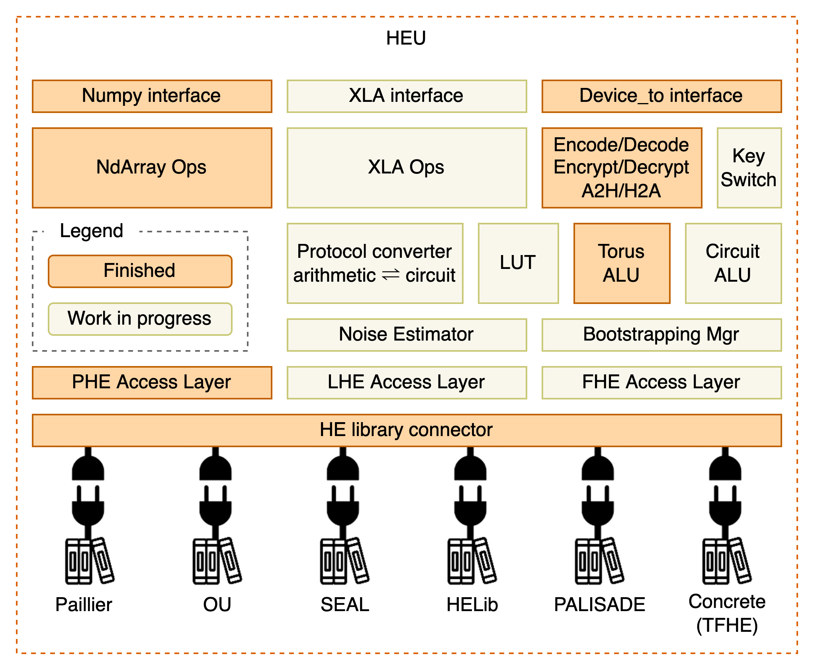

:target{#heu}

# HEU 文档

同态加密计算引擎（homomorphic encryption processing unit, HEU) 是隐语的一个子项目，实现了高性能的同态加密算法。

HEU 的目的是降低同态加密的使用门槛，使得用户无需专业知识就能利用同态加密算法构建任意程序。

由于 HEU 还处在起步阶段，当前 HEU 仅仅是一个加法同态加密的 library，还不具备像 SPU 一样执行任意程序的能力。

<TableOfContents>

  

    Contents
  

  - [准备开始](getting_started/index.mdx)
    - [安装](getting_started/installation.mdx)
    - [快速入门](getting_started/quick_start.mdx)
    - [矩阵运算](getting_started/numpy.mdx)
    - [算法选择](getting_started/algo_choice.mdx)
    - [常见问题](getting_started/faq.mdx)
  - [开发](development/index.mdx)
    - [HEU 架构](development/arch.mdx)
    - [开发新算法](development/phe_dev.mdx)
  - [API 手册](references/index.mdx)
    - [PHE 模块](references/phe_api.mdx)
    - [Numpy 模块](references/numpy_api.mdx)
    - [升级指南](references/upgrade_guide.mdx)
</TableOfContents>
