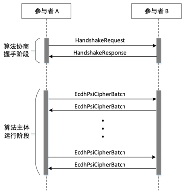
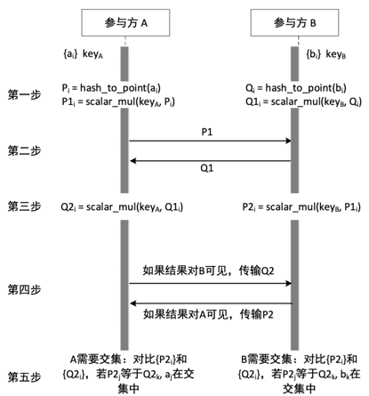

:target{#ecdh-psi}

# ECDH-PSI 协议

:target{#id1}

## 算法流程

算法分为2阶段，第一阶段为握手过程，第二阶段为算法主体，其流程如下：

:target{#id2}

### 握手过程

握手所用的 HandshakeRequest 定义如下：

<figure id="id4">
  <figcaption>
    interconnection/handshake/entry.proto
  </figcaption>

  ```Protobuf
  // unified protocol for interconnection
  message HandshakeRequest {
    // 握手请求版本号, 当前等于 2
    int32 version = 1;

    //** META INFO **//

    // The sender's rank
    int32 requester_rank = 2;

    //** AI/BI 算法层 **//

    // enum AlgoType
    repeated int32 supported_algos = 3;

    // 算法详细握手参数，与 supported_algos 一一对应
    // SS-LR：learning_rate，optimizer，normalize
    // ECDH-PSI：Nothing，skip
    repeated google.protobuf.Any algo_params = 4;

    //** 安全算子层 **//

    // AI/BI 算法所需的 op 列到此处
    // op = enum OpType
    // ECDH-PSI：Nothing，skip
    repeated int32 ops = 5;
    repeated google.protobuf.Any op_params = 6;

    //** 密码协议层 **//

    // protocol_family = enum ProtocolFamily
    //  SS: Protocol: [Semi2K, ABY3], FieldType, BeaverConfig, SerializeFormat
    //  ECC: Hash2Curve, EcGroup, SerializeFormat
    //  PHE: Protocol: [Paillier, EcElgamal], SerializeFormat
    repeated int32 protocol_families = 7;
    repeated google.protobuf.Any protocol_family_params = 8;

    //** 数据 IO **//

    // 定义 AI/BI 算法的输入和结果输出格式，不包括中间交互数据的格式
    // PSI: item_count、result_to_rank
    // SS-LR: sample_size、feature_num、has_label, etc.
    google.protobuf.Any io_param = 9;
  }
  ```
</figure>

HandshakeRequest 主要包括以下信息：

1. 协议版本号
2. 请求方的传输层 rank 值
3. 想使用的具体算法，比如使用 ECDH-PSI
4. 每类算法的详细参数，ECDH-PSI 算法忽略该字段
5. 用到的安全算子的类型，ECDH-PSI 算法忽略该字段
6. 每个安全算子的详细参数，ECDH-PSI 算法忽略该字段
7. 用到的密码协议族，比如 ECC 协议族
8. 每个协议族的详细参数，比如 ECC 协议族需要说明具体的椭圆曲线类型，哈希算法等参数
9. 算法的输入和结果输出格式，比如 ECDH-PSI 需要说明结果是A，B都可见，还是只对某一方可见

HandshakeRequest 中的 supported\_algos 字段的定义如下：

<figure id="id5">
  <figcaption>
    interconnection/handshake/entry.proto
  </figcaption>

  ```Protobuf
  enum AlgoType {
    ALGO_TYPE_UNSPECIFIED = 0;
    ALGO_TYPE_ECDH_PSI = 1;
    ALGO_TYPE_SS_LR = 2;
    ALGO_TYPE_SGB = 3;
  }
  ```
</figure>

HandshakeRequest 中的 protocol\_families 字段的定义如下：

<figure id="id6">
  <figcaption>
    interconnection/handshake/entry.proto
  </figcaption>

  ```Protobuf
  enum ProtocolFamily {
    PROTOCOL_FAMILY_UNSPECIFIED = 0;
    PROTOCOL_FAMILY_ECC = 1;
    PROTOCOL_FAMILY_SS = 2;
    PROTOCOL_FAMILY_PHE = 3;
  }
  ```
</figure>

如果协议族是 ECC，则 HandshakeRequest 中的 protocol\_family\_params 字段格式如下：

<figure id="id7">
  <figcaption>
    interconnection/handshake/protocol\_family/ecc.proto
  </figcaption>

  ```Protobuf
  message EccProtocolProposal {
    repeated int32 supported_versions = 1;

    // list of <curve, hash, hash2curve_strategy> suits
    repeated EcSuit ec_suits = 2;

    // ref enum PointOctetFormat
    // 点的序列化格式
    repeated int32 point_octet_formats = 3;

    // Whether to enable the optimization method: secondary ciphertext truncation
    bool support_point_truncation = 4;
  }
  ```
</figure>

EccProtocolProposal 中的 ec\_suits 字段的定义如下：

<figure id="id8">
  <figcaption>
    interconnection/handshake/protocol\_family/ecc.proto
  </figcaption>

  ```Protobuf
  // Suit of <curve, hash, hash2curve_strategy>
  message EcSuit {
    // ref enum CurveType
    int32 curve = 1;

    // ref enum HashType
    int32 hash = 2;

    // ref enum HashToCurveStrategy
    int32 hash2curve_strategy = 3;
  }
  ```
</figure>

如果算法是 ECDH-PSI，则 HandshakeRequest 中的 io\_param 字段格式如下：

<figure id="id9">
  <figcaption>
    interconnection/handshake/algos/psi.proto
  </figcaption>

  ```Protobuf
  message PsiDataIoProposal {
    repeated int32 supported_versions = 1;

    // How many items do I've.
    //
    // 待求交的 PSI 数据总量
    int64 item_num = 2;

    // Which rank can receive the psi results.
    //
    // 确定 PSI 结果获取方。
    //
    // NOTES:
    //   `-1`: all parties (所有机构都可以拿到交集结果)
    //   `>= 0`: corresponding rank can get the results (指定机构拿到交集结果)
    int32 result_to_rank = 3;
  }
  ```
</figure>

握手请求的结果 HandshakeResponse 定义如下：

<figure id="id10">
  <figcaption>
    interconnection/handshake/entry.proto
  </figcaption>

  ```Protobuf
  message HandshakeResponse {
    // response header
    ResponseHeader header = 1;

    //** AI/BI 算法层 **//

    // algos = enum AlgoType
    int32 algo = 2;

    // 算法详细握手参数
    // SS-LR：learning_rate，optimizer，normalize
    // ECDH-PSI：Nothing，skip
    google.protobuf.Any algo_param = 3;

    //** 安全算子层 **//

    // AI/BI 算法所需的 op 列到此处
    // op = enum OpType
    // ECDH-PSI：Nothing，skip
    repeated int32 ops = 4;
    repeated google.protobuf.Any op_params = 5;

    //** 密码协议层 **//

    // protocol_family = enum ProtocolFamily
    //  SS: Protocol: [Semi2K, ABY3], FieldType, BeaverConfig, SerializeFormat
    //  ECC: Hash2Curve, EcGroup, SerializeFormat
    //  PHE: Protocol: [Paillier, EcElgamal], SerializeFormat
    repeated int32 protocol_families = 6;
    repeated google.protobuf.Any protocol_family_params = 7;

    //** 数据 IO **//

    // 定义 AI/BI 算法的输入和结果输出格式，不包括中间交互数据的格式
    // PSI: item_count、result_to_rank
    // SS-LR: sample_size、feature_num、has_label, etc.
    google.protobuf.Any io_param = 8;
  }
  ```
</figure>

其中 ResponseHeader 定义如下：

<figure id="id11">
  <figcaption>
    interconnection/common/header.proto
  </figcaption>

  ```Protobuf
  syntax = "proto3";

  package org.interconnection;

  // 31100xxx is the white box interconnection code segment
  // 31100xxx 为引擎白盒互联互通号段
  enum ErrorCode {
    OK = 0;

    GENERIC_ERROR = 31100000;
    UNEXPECTED_ERROR = 31100001;
    NETWORK_ERROR = 31100002;

    INVALID_REQUEST = 31100100;
    INVALID_RESOURCE = 31100101;

    HANDSHAKE_REFUSED = 31100200;
    UNSUPPORTED_VERSION = 31100201;
    UNSUPPORTED_ALGO = 31100202;
    UNSUPPORTED_PARAMS = 31100203;
  }

  message ResponseHeader {
    int32 error_code = 1;
    string error_msg = 2;
  }
  ```
</figure>

如果协议族是 ECC，则 HandshakeResponse 中的 protocol\_family\_params 字段格式如下：

<figure id="id12">
  <figcaption>
    interconnection/handshake/protocol\_family/ecc.proto
  </figcaption>

  ```Protobuf
  message EccProtocolResult {
    int32 version = 1;

    // The chosen suit
    EcSuit ec_suit = 2;

    // The chosen octet format
    int32 point_octet_format = 3;

    // optimization method: secondary ciphertext truncation
    // -1 means disable this optimization (do not truncation)
    int32 bit_length_after_truncated = 4;
  }
  ```
</figure>

如果算法是 ECDH-PSI，则 HandshakeResponse 中的 io\_param 字段格式如下：

<figure id="id13">
  <figcaption>
    interconnection/handshake/algos/psi.proto
  </figcaption>

  ```Protobuf
  message PsiDataIoResult {
    int32 version = 1;

    // 确定 PSI 结果获取方。
    //
    // NOTES:
    //   `-1`: all parties (所有机构都可以拿到交集结果)
    //   `>= 0`: corresponding rank can get the results (指定机构拿到交集结果)
    int32 result_to_rank = 2;
  }
  ```
</figure>

:target{#protobuf}

#### Protobuf 传输方式

Protobuf 传输使用《传输层白盒互联互通协议》中的 P2P 传输协议进行传输。其中传输的 key 按照《传输层白盒互联互通协议》中定义的方法生成，value 即为 protobuf 序列化之后的二进制字符串。

:target{#id3}

### 算法主体



算法第二步、第四步使用 EcdhPsiCipherBatch 格式进行传输，EcdhPsiCipherBatch 定义如下：

<figure id="id14">
  <figcaption>
    interconnection/runtime/ecdh\_psi.proto
  </figcaption>

  ```Protobuf
  // ECDH PSI 密文传输
  message EcdhPsiCipherBatch {
    // The type hint for each message. (密文类型)
    //
    // "enc": the first stage ciphertext
    //
    // "dual.enc": the second stage ciphertext
    //
    // ECDH PSI 密文阶段类型，主要用来区分一阶段和二阶段的密文.
    string type = 1;

    // The batch index. Start from 0.
    //
    // Batch 索引，从 0 开始
    int32 batch_index = 3;

    // Is last batch flag
    bool is_last_batch = 4;

    // Count of items in this batch.
    // count == 0 is allowed for last batch
    int32 count = 6;

    // The packed all in one ciphertext for this batch.
    //
    // The first stage ciphertext takes 256 bits for each ciphertext element.
    // However, the second stage ciphertext takes 96 bits each. According to PSI
    // papers, we do not need to send all 256 bit for the final ciphertext. The
    // number of bits needed to compare is `Log(MN) + 40` given a 40 bits
    // statistical security parameter. TODO (add paper link here).
    //
    // We define each bucket has less than 2^28 items, i.e. about 270 million
    // (单桶最多 2.7亿) items, which is general enough for various psi algorithms.
    //
    // NOTE: we do not use `repeated`` here to save overhead of metadata.
    bytes ciphertext = 7;
  }
  ```
</figure>

其中 ciphertext 字段用于存放 ECC 上的点，每个点按照握手协议中的 point\_octet\_format 序列化之后依次连续存放。
