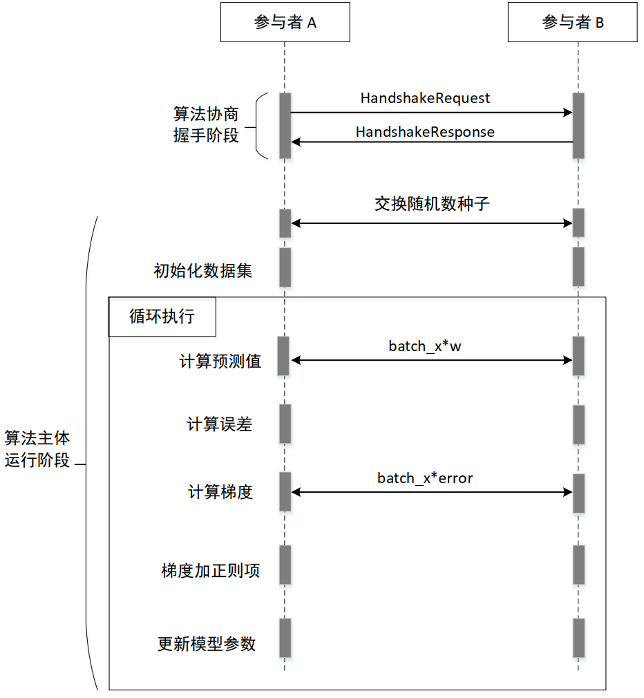
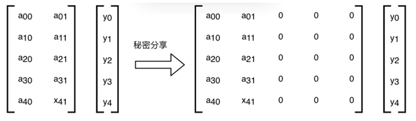
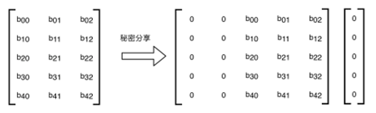

:target{#ss-lr}

# SS-LR 协议

:target{#id1}

## 算法流程

算法分为2阶段，第一阶段为握手过程，第二阶段为算法主体，其流程如下：

:target{#id2}

### 握手过程

:target{#id3}

#### 握手协议

握手所用的 HandshakeRequest 定义如下：

<figure id="id10">
  <figcaption>
    interconnection/handshake/entry.proto
  </figcaption>

  ```Protobuf
  // unified protocol for interconnection
  message HandshakeRequest {
    // 握手请求版本号, 当前等于 2
    int32 version = 1;

    //** META INFO **//

    // The sender's rank
    int32 requester_rank = 2;

    //** AI/BI 算法层 **//

    // enum AlgoType
    repeated int32 supported_algos = 3;

    // 算法详细握手参数，与 supported_algos 一一对应
    // SS-LR：learning_rate，optimizer，normalize
    // ECDH-PSI：Nothing，skip
    repeated google.protobuf.Any algo_params = 4;

    //** 安全算子层 **//

    // AI/BI 算法所需的 op 列到此处
    // op = enum OpType
    // ECDH-PSI：Nothing，skip
    repeated int32 ops = 5;
    repeated google.protobuf.Any op_params = 6;

    //** 密码协议层 **//

    // protocol_family = enum ProtocolFamily
    //  SS: Protocol: [Semi2K, ABY3], FieldType, BeaverConfig, SerializeFormat
    //  ECC: Hash2Curve, EcGroup, SerializeFormat
    //  PHE: Protocol: [Paillier, EcElgamal], SerializeFormat
    repeated int32 protocol_families = 7;
    repeated google.protobuf.Any protocol_family_params = 8;

    //** 数据 IO **//

    // 定义 AI/BI 算法的输入和结果输出格式，不包括中间交互数据的格式
    // PSI: item_count、result_to_rank
    // SS-LR: sample_size、feature_num、has_label, etc.
    google.protobuf.Any io_param = 9;
  }
  ```
</figure>

HandshakeRequest 主要包括以下信息：

1. 协议版本号
2. 请求方的传输层 rank 值
3. 想使用的具体算法，比如使用 SS-LR
4. 每类算法的详细参数，比如 SS-LR 需要说明优化器类型、正则项等参数
5. 用到的安全算子的类型，比如 Sigmoid
6. 每个安全算子的详细参数，比如 Sigmoid 需要说明采用的拟合算法
7. 用到的密码协议族，比如 SS 协议族
8. 每个协议族的详细参数，比如 SS 协议族需要说明协议种类、整数环比特数等参数
9. 算法的输入和结果输出格式，比如 SS-LR 需要说明样本数量、特征数量等参数

HandshakeRequest 中的 supported\_algos 字段的定义如下：

<figure id="id11">
  <figcaption>
    interconnection/handshake/entry.proto
  </figcaption>

  ```Protobuf
  enum AlgoType {
    ALGO_TYPE_UNSPECIFIED = 0;
    ALGO_TYPE_ECDH_PSI = 1;
    ALGO_TYPE_SS_LR = 2;
    ALGO_TYPE_SGB = 3;
  }
  ```
</figure>

如果算法是 SS-LR，则 HandshakeRequest 中的 algo\_params 字段格式如下：

<figure id="id12">
  <figcaption>
    interconnection/handshake/algos/lr.proto
  </figcaption>

  ```Protobuf
  message LrHyperparamsProposal {
    repeated int32 supported_versions = 1;

    // 支持哪些优化器类型
    // Ref: enum Optimizer
    repeated int32 optimizers = 2;

    // Ref: enum LastBatchPolicy
    repeated int32 last_batch_policies = 3;

    bool use_l0_norm = 4;
    bool use_l1_norm = 5;
    bool use_l2_norm = 6;
  }
  ```
</figure>

LrHyperparamsProposal 中的 optimizers 字段的定义如下：

<figure id="id13">
  <figcaption>
    interconnection/handshake/algos/optimizer.proto
  </figcaption>

  ```Protobuf
  // Optimizer list
  enum Optimizer {
    OPTIMIZER_UNSPECIFIED = 0;
    OPTIMIZER_SGD = 1;
    OPTIMIZER_MOMENTUM = 2;
    OPTIMIZER_ADAGRAD = 3;
    OPTIMIZER_ADADELTA = 4;
    OPTIMIZER_RMSPROP = 5;
    OPTIMIZER_ADAM = 6;
    OPTIMIZER_ADAMAX = 7;
    OPTIMIZER_NADAM = 8;
  }
  ```
</figure>

LrHyperparamsProposal 中的 last\_batch\_policies 字段的定义如下:

<figure id="id14">
  <figcaption>
    interconnection/handshake/algos/lr.proto
  </figcaption>

  ```Protobuf
  // Policy to process the partial last batch of each epoch
  enum LastBatchPolicy {
    LAST_BATCH_POLICY_UNSPECIFIED = 0;
    LAST_BATCH_POLICY_DISCARD = 1;
  }
  ```
</figure>

HandshakeRequest 中的 ops 字段的定义如下：

<figure id="id15">
  <figcaption>
    interconnection/handshake/entry.proto
  </figcaption>

  ```Protobuf
  enum OpType {
    OP_TYPE_UNSPECIFIED = 0;
    OP_TYPE_SIGMOID = 1;
  }
  ```
</figure>

如果安全算子类型是 Sigmoid，则 HandshakeRequest 中的 op\_params 字段格式如下：

<figure id="id16">
  <figcaption>
    interconnection/handshake/op/sigmoid.proto
  </figcaption>

  ```Protobuf
  message SigmoidParamsProposal {
    repeated int32 supported_versions = 1;

    // enum SigmoidMode
    repeated int32 sigmoid_modes = 2;
  }
  ```
</figure>

SigmoidParamsProposal 中的 sigmoid\_modes 字段的定义如下：

<figure id="id17">
  <figcaption>
    interconnection/handshake/op/sigmoid.proto
  </figcaption>

  ```Protobuf
  // Sigmoid approximation method.
  enum SigmoidMode {
    SIGMOID_MODE_UNSPECIFIED = 0;

    // Minimax approximation one order, f(x) = 0.5 + 0.125 * x
    SIGMOID_MODE_MINIMAX_1 = 1;
  }
  ```
</figure>

HandshakeRequest 中的 protocol\_families 字段的定义如下：

<figure id="id18">
  <figcaption>
    interconnection/handshake/entry.proto
  </figcaption>

  ```Protobuf
  enum ProtocolFamily {
    PROTOCOL_FAMILY_UNSPECIFIED = 0;
    PROTOCOL_FAMILY_ECC = 1;
    PROTOCOL_FAMILY_SS = 2;
    PROTOCOL_FAMILY_PHE = 3;
  }
  ```
</figure>

如果协议族是 SS，则 HandshakeRequest 中的 protocol\_family\_params 字段格式如下：

<figure id="id19">
  <figcaption>
    interconnection/handshake/protocol\_family/ss.proto
  </figcaption>

  ```Protobuf
  message SSProtocolProposal {
    repeated int32 supported_versions = 1;
    repeated int32 supported_protocols = 2;  // enum ProtocolKind

    repeated int32 field_types = 3;  // enum FieldType
    repeated TruncationModeProposal trunc_modes = 4;
    repeated PrgConfigProposal prg_configs = 5;

    // 秘密分享分片的序列化格式, enum ShardSerializeFormat
    repeated int32 shard_serialize_formats = 6;

    // Below fields only used for protocol [Semi2k]
    repeated TripleConfigProposal triple_configs = 50;
  }
  ```
</figure>

SSProtocolProposal 中的 supported\_protocols 字段的定义如下：

<figure id="id20">
  <figcaption>
    interconnection/handshake/protocol\_family/ss.proto
  </figcaption>

  ```Protobuf
  enum ProtocolKind {
    PROTOCOL_KIND_UNSPECIFIED = 0;
    PROTOCOL_KIND_SEMI2K = 1;
    PROTOCOL_KIND_ABY3 = 2;
  }
  ```
</figure>

SSProtocolProposal 中的 field\_types 字段的定义如下：

<figure id="id21">
  <figcaption>
    interconnection/handshake/protocol\_family/ss.proto
  </figcaption>

  ```Protobuf
  enum FieldType {
    FIELD_TYPE_UNSPECIFIED = 0;
    FIELD_TYPE_32 = 1;   // Ring 2^32
    FIELD_TYPE_64 = 2;   // Ring 2^64
    FIELD_TYPE_128 = 3;  // Ring 2^128
  }
  ```
</figure>

SSProtocolProposal 中的 trunc\_modes 字段的定义如下：

<figure id="id22">
  <figcaption>
    interconnection/handshake/protocol\_family/ss.proto
  </figcaption>

  ```Protobuf
  message TruncationModeProposal {
    repeated int32 supported_versions = 1;

    int32 method = 2 ;  // enum TruncMode
    repeated int32 compatible_protocols = 3; // protocols that support this method.  如果留空，表示所有 protocol 都支持

    // Below fields only used for trunc method "TRUNC_PRECISE"
    //  ...
  }
  ```
</figure>

TruncationModeProposal 中的 method 字段的定义如下：

<figure id="id23">
  <figcaption>
    interconnection/handshake/protocol\_family/ss.proto
  </figcaption>

  ```Protobuf
  enum TruncMode {
    TRUNC_MODE_UNSPECIFIED = 0;
    TRUNC_MODE_PROBABILISTIC = 1;
    TRUNC_MODE_PRECISE = 2;
  }
  ```
</figure>

SSProtocolProposal 中的 prg\_configs 字段的定义如下：

<figure id="id24">
  <figcaption>
    interconnection/handshake/protocol\_family/ss.proto
  </figcaption>

  ```Protobuf
  // Pseudorandom number generator configuration.
  message PrgConfigProposal {
    repeated int32 supported_versions = 1;

    // enum CryptoType
    int32 crypto_type = 2;
  }
  ```
</figure>

PrgConfigProposal 中的 crypto\_type 字段的定义如下：

<figure id="id25">
  <figcaption>
    interconnection/handshake/protocol\_family/ss.proto
  </figcaption>

  ```Protobuf
  enum CryptoType {
    CRYPTO_TYPE_UNSPECIFIED = 0;
    CRYPTO_TYPE_AES128_CTR = 1;
    CRYPTO_TYPE_SM4_CTR = 2;
  }
  ```
</figure>

SSProtocolProposal 中的 shard\_serialize\_formats 字段的定义如下：

<figure id="id26">
  <figcaption>
    interconnection/handshake/protocol\_family/ss.proto
  </figcaption>

  ```Protobuf
  // 秘密分享分片的序列化格式
  enum ShardSerializeFormat {
    SHARED_SERIALIZE_FORMAT_UNSPECIFIED = 0;
    SHARED_SERIALIZE_FORMAT_RAW = 1;
  }
  ```
</figure>

SSProtocolProposal 中的 triple\_configs 字段的定义如下：

<figure id="id27">
  <figcaption>
    interconnection/handshake/protocol\_family/ss.proto
  </figcaption>

  ```Protobuf
  // TrustedThirdParty configs.
  message TripleConfigProposal {
    repeated int32 supported_versions = 1;

    // TTP 服务的版本号，与 TTP 服务建立会话时需要该字段
    int32 sever_version = 2;
  }
  ```
</figure>

如果算法是 SS-LR，则 HandshakeRequest 中的 io\_param 字段格式如下：

<figure id="id28">
  <figcaption>
    interconnection/handshake/algos/lr.proto
  </figcaption>

  ```Protobuf
  message LrDataIoProposal {
    repeated int32 supported_versions = 1;

    // 样本数量
    int64 sample_size = 2;

    // 特征数量
    int32 feature_num = 3;

    // 是否有标签(Y)
    bool has_label = 4;
  }
  ```
</figure>

握手请求的结果 HandshakeResponse 定义如下：

<figure id="id29">
  <figcaption>
    interconnection/handshake/entry.proto
  </figcaption>

  ```Protobuf
  message HandshakeResponse {
    // response header
    ResponseHeader header = 1;

    //** AI/BI 算法层 **//

    // algos = enum AlgoType
    int32 algo = 2;

    // 算法详细握手参数
    // SS-LR：learning_rate，optimizer，normalize
    // ECDH-PSI：Nothing，skip
    google.protobuf.Any algo_param = 3;

    //** 安全算子层 **//

    // AI/BI 算法所需的 op 列到此处
    // op = enum OpType
    // ECDH-PSI：Nothing，skip
    repeated int32 ops = 4;
    repeated google.protobuf.Any op_params = 5;

    //** 密码协议层 **//

    // protocol_family = enum ProtocolFamily
    //  SS: Protocol: [Semi2K, ABY3], FieldType, BeaverConfig, SerializeFormat
    //  ECC: Hash2Curve, EcGroup, SerializeFormat
    //  PHE: Protocol: [Paillier, EcElgamal], SerializeFormat
    repeated int32 protocol_families = 6;
    repeated google.protobuf.Any protocol_family_params = 7;

    //** 数据 IO **//

    // 定义 AI/BI 算法的输入和结果输出格式，不包括中间交互数据的格式
    // PSI: item_count、result_to_rank
    // SS-LR: sample_size、feature_num、has_label, etc.
    google.protobuf.Any io_param = 8;
  }
  ```
</figure>

其中 ResponseHeader 定义如下：

<figure id="id30">
  <figcaption>
    interconnection/common/header.proto
  </figcaption>

  ```Protobuf
  syntax = "proto3";

  package org.interconnection;

  // 31100xxx is the white box interconnection code segment
  // 31100xxx 为引擎白盒互联互通号段
  enum ErrorCode {
    OK = 0;

    GENERIC_ERROR = 31100000;
    UNEXPECTED_ERROR = 31100001;
    NETWORK_ERROR = 31100002;

    INVALID_REQUEST = 31100100;
    INVALID_RESOURCE = 31100101;

    HANDSHAKE_REFUSED = 31100200;
    UNSUPPORTED_VERSION = 31100201;
    UNSUPPORTED_ALGO = 31100202;
    UNSUPPORTED_PARAMS = 31100203;
  }

  message ResponseHeader {
    int32 error_code = 1;
    string error_msg = 2;
  }
  ```
</figure>

如果算法是 SS-LR，则 HandshakeResponse 中的 algo\_param 字段格式如下：

<figure id="id31">
  <figcaption>
    interconnection/handshake/algos/lr.proto
  </figcaption>

  ```Protobuf
  message LrHyperparamsResult {
    // 版本号
    int32 version = 1;

    // 选中的优化器
    // Ref: enum Optimizer
    int32 optimizer_name = 2;

    // 优化器参数
    // 参考 optimizer.proto
    google.protobuf.Any optimizer_param = 3;

    // mini-batch 梯度下降的 epoch 参数
    int64 num_epoch = 4;

    // mini-batch 梯度下降的 bach_size 参数
    int64 batch_size = 5;

    // ref enum LastBatchPolicy
    int32 last_batch_policy = 6;

    // L0 正则项
    double l0_norm = 7;

    // L1 正则项
    double l1_norm = 8;

    // L2 正则项
    double l2_norm = 9;
  }
  ```
</figure>

如果 LR 优化器类型是 SGD，则 HandshakeResponse 中的 optimizer\_param 字段格式如下：

<figure id="id32">
  <figcaption>
    interconnection/handshake/algos/optimizer.proto
  </figcaption>

  ```Protobuf
  // mini-batch (stochastic) gradient descent
  message SgdOptimizer {
    double learning_rate = 1;
  }
  ```
</figure>

如果安全算子类型是 Sigmoid，则 HandshakeResponse 中的 op\_params 字段格式如下：

<figure id="id33">
  <figcaption>
    interconnection/handshake/op/sigmoid.proto
  </figcaption>

  ```Protobuf
  message SigmoidParamsResult {
    int32 version = 1;

    int32 sigmoid_mode = 2;
  }
  ```
</figure>

如果协议族是 SS，则 HandshakeResponse 中的 protocol\_family\_params 字段格式如下：

<figure id="id34">
  <figcaption>
    interconnection/handshake/protocol\_family/ss.proto
  </figcaption>

  ```Protobuf
  message SSProtocolResult {
    int32 version = 1;
    int32 protocol = 2;  // enum ProtocolKind

    int32 field_type = 3;
    TruncationModeResult trunc_mode = 4;
    PrgConfigResult prg_config = 5;

    // Number of fraction bits of fixed-point number.
    int32 fxp_fraction_bits = 6;

    // 秘密分享分片的序列化格式, enum ShardSerializeFormat
    int32 shard_serialize_format = 7;

    // Below fields only used for protocol [Semi2k]
    TripleConfigResult triple_config = 50;
  }
  ```
</figure>

SSProtocolResult 中的 trunc\_mode 字段的定义如下：

<figure id="id35">
  <figcaption>
    interconnection/handshake/protocol\_family/ss.proto
  </figcaption>

  ```Protobuf
  message TruncationModeResult {
    int32 version = 1;

    int32 method = 2;  // enum TruncMode
  }
  ```
</figure>

SSProtocolResult 中的 prg\_config 字段的定义如下：

<figure id="id36">
  <figcaption>
    interconnection/handshake/protocol\_family/ss.proto
  </figcaption>

  ```Protobuf
  // Pseudorandom number generator configuration.
  message PrgConfigResult {
    int32 version = 1;

    // // enum CryptoType
    int32 crypto_type = 2;
  }
  ```
</figure>

SSProtocolResult 中的 triple\_config 字段的定义如下：

<figure id="id37">
  <figcaption>
    interconnection/handshake/protocol\_family/ss.proto
  </figcaption>

  ```Protobuf
  // TrustedThirdParty configs.
  message TripleConfigResult {
    int32 version = 1;

    // TrustedThirdParty beaver server's remote ip:port or load balancing uri.
    string server_host = 2;

    // TTP 服务的版本号，与 TTP 服务建立会话时需要该字段
    int32 sever_version = 3;

    // 与 TTP 服务的会话ID
    string session_id = 4;

    // 哪一方调用 TTP 服务的 Adjust 接口，与 TTP 服务建立会话时需要该字段
    int32 adjust_rank = 5;
  }
  ```
</figure>

如果算法是 SS-LR，则 HandshakeResponse 中的 io\_param 字段格式如下：

<figure id="id38">
  <figcaption>
    interconnection/handshake/algos/lr.proto
  </figcaption>

  ```Protobuf
  message LrHyperparamsResult {
    // 版本号
    int32 version = 1;

    // 选中的优化器
    // Ref: enum Optimizer
    int32 optimizer_name = 2;

    // 优化器参数
    // 参考 optimizer.proto
    google.protobuf.Any optimizer_param = 3;

    // mini-batch 梯度下降的 epoch 参数
    int64 num_epoch = 4;

    // mini-batch 梯度下降的 bach_size 参数
    int64 batch_size = 5;

    // ref enum LastBatchPolicy
    int32 last_batch_policy = 6;

    // L0 正则项
    double l0_norm = 7;

    // L1 正则项
    double l1_norm = 8;

    // L2 正则项
    double l2_norm = 9;
  }
  ```
</figure>

:target{#protobuf}

#### Protobuf 传输方式

Protobuf 传输使用《传输层白盒互联互通协议》中的 P2P 传输协议进行传输。其中传输的 key 按照《传输层白盒互联互通协议》中定义的方法生成，
value 即为 protobuf 序列化之后的二进制字符串。

:target{#id4}

### 算法主体

在协议主体运行阶段，SS-LR 基于 mini-batch 梯度下降训练方法，对于每一个 batch，协议的执行过程中，底层都是用 SPDZ Semi2k 秘密分享协议，
以确保计算过程中每一个变量都处在 Arithmetic Sharing 状态，每一方仅能看到本地分片值，看不到明文值，保证了算法执行过程中没有泄露原始信息。

:target{#lr}

#### LR 算法训练过程

LR 算法公式为：

<Math>
  $$
  y = sigmoid(x_0w_0 + x_1w_1 + ⋯ + x_kw_k + intercept)


  $$
</Math>

其中 <InlineMath>$x$</InlineMath> 表示特征项，<InlineMath>$w$</InlineMath> 是 LR 模型的权重，<InlineMath>$intercept$</InlineMath> 是截距项， <InlineMath>$w$</InlineMath> 和 <InlineMath>$intercept$</InlineMath> 都是可训练的参数，
<InlineMath>$sigmoid$</InlineMath> 是一个 S 型函数，公式如下：

<Math>
  $$
  sigmoid(x)=1/(1+e^{-x})


  $$
</Math>

在隐私计算场景下，Sigmoid 函数直接计算有困难，本文件使用近似函数计算的方案，详见 [Sigmoid算子](#sigmoid)

此外，为了统一 <InlineMath>$w$</InlineMath> 和 <InlineMath>$intercept$</InlineMath> 的形式，简化计算流程，我们将 <InlineMath>$intercept$</InlineMath> 也看作是 <InlineMath>$w$</InlineMath> 向量的一个元素，
即假设特征数为 <InlineMath>$k$</InlineMath> 个，则 <InlineMath>$w$</InlineMath> 向量的长度为 <InlineMath>$k+1$</InlineMath>，之后在计算时，我们在 <InlineMath>$x$</InlineMath> 的最后拼接一个 <InlineMath>$1$</InlineMath>，
即可直接计算向量内积 <InlineMath>$w*x$</InlineMath>，
简化计算步骤。

在实际训练时，LR 模型训练采用 mini-batch 梯度下降方法，重复执行如下五个步骤，直到达到目标迭代次数：

第一步：计算预测值 <InlineMath>$pred=sigmoid(batch\_x*w)$</InlineMath>

第二步：计算误差 <InlineMath>$err=pred-y$</InlineMath>

第三步：计算梯度 <InlineMath>$grad=transpose(batch\_x)*err$</InlineMath>

第四步：梯度加正则项 <InlineMath>$grad=grad + w^{'}*l2\_norm$</InlineMath>

第五步：更新模型参数 <InlineMath>$w=w-(grad*learning\_rate/batch\_size)$</InlineMath>

其中：

- <InlineMath>$batch\_x$</InlineMath> 是当前 batch 的样本数据集与常数项组成的矩阵，其中常数项为 <InlineMath>$1$</InlineMath>，位于 <InlineMath>$batch\_x$</InlineMath> 的最后一列；
- <InlineMath>$w$</InlineMath> 是 LR 模型训练的结果，初始值为 <InlineMath>$0$</InlineMath>；
- <InlineMath>$sigmoid()$</InlineMath> 是常被用作神经网络的激活函数，将变量映射到 <InlineMath>$0$</InlineMath>, <InlineMath>$1$</InlineMath> 之间；
- <InlineMath>$*$</InlineMath> 是乘法；
- <InlineMath>$y$</InlineMath> 是当前 batch 的标签矩阵；
- <InlineMath>$transpose()$</InlineMath> 是矩阵转置操作；
- <InlineMath>$w^{'}$</InlineMath> 是将 <InlineMath>$w$</InlineMath> 的截距项即最后一个元素置为 <InlineMath>$0$</InlineMath>；
- <InlineMath>$l2\_norm$</InlineMath> 是 l2 正则项；
- <InlineMath>$learning\_rate$</InlineMath> 是学习率参数；
- <InlineMath>$batch\_size$</InlineMath> 是每个 batch 的大小。

:target{#semi2k-ss-lr}

#### 基于 Semi2K 的纵向 SS-LR 算法

这里描述基于 Semi2K 协议的两方秘密分享纵向 LR 算法的计算过程。

:target{#id5}

##### 数据集初始化

各参与方首先对输入的样本数据 <InlineMath>$batch\_x$</InlineMath> 和标签矩阵 <InlineMath>$y$</InlineMath> 进行编码和秘密分片。

<strong>输入数据编码</strong>

输入数据集的元素类型为浮点数类型，将其按统一的放大系数转为定点数，然后去掉小数部分转为整数，在整数环上计算。编码方式如下表所示，
整数环可取长度 64、128 等，元素编码后的数据类型分别为 int64\_t、int128\_t。放大系数和整数环的比特数在握手协议中约定。

<table id="id39">
  <caption>
    输入数据集元素编码
  </caption>

  <thead>
    <tr>
      <td>
        实际数据类型
      </td>

      <td>
        整数环的比特数
      </td>

      <td>
        编码数据类型（ISO C99）
      </td>
    </tr>
  </thead>

  <tbody>
    <tr>
      <td>
        浮点数
      </td>

      <td>
        64
      </td>

      <td>
        int64\_t
      </td>
    </tr>

    <tr>
      <td>
        浮点数
      </td>

      <td>
        128
      </td>

      <td>
        int128\_t
      </td>
    </tr>
  </tbody>
</table>

<strong>输入数据秘密分享</strong>

双方根据握手协议确定的样本数量、特征数量和标签信息，以及各自的输入样本数据集，首先通过秘密分享的方式计算出初始密态样本数据集。
对于每个样本元素 <InlineMath>$x$</InlineMath>，秘密分享获得两个密态分片 <InlineMath>$x$</InlineMath> 和 <InlineMath>$0$</InlineMath> ( <InlineMath>$x=x+0$</InlineMath> )，将 <InlineMath>$x$</InlineMath> 留在本地，将 <InlineMath>$0$</InlineMath> 发给对方
（由于 <InlineMath>$0$</InlineMath> 不是随机数，所以省略这个发送过程）。

若样本总数量等于5，样本特征数量等于数组 \[2, 3]，参与方 A（rank=0）拥有2个维度的特征和5个样本的标签，参与方 B（rank=1）拥有3个维度的特征。

双方对样本数据集进行秘密分享。参与方 A 初始化秘密分享的结果如下图：



参与方 B 初始化秘密分享的结果如下图：



<strong>交换伪随机数种子</strong>

双方各有一个属于自己的伪随机数种子，用于将公共明文转为密文，详见 [公共明文转为密文](#p2a)。初始阶段双方向对方发送这个伪随机数种子。

<strong>向Beaver服务发送伪随机数种子</strong>

除了上一节的伪随机数种子，双方还各自持有另一个伪随机数种子，用于从第三方可信 Beaver 服务获取乘法三元组，详见 [Beaver 矩阵乘法三元组](#beaver)。初始阶段双方分别向 Beaver 服务发送自己的这个伪随机数种子。

:target{#drbg}

##### <Target id="id6" />伪随机数生成方式

密码学安全的伪随机数生成器应当按照美国 NIST SP800-90A 标准或者中华人民共和国密码行业标准《GM/T 0105-2021软件随机数发生器设计指南》中规定的方式实现。伪随机数的安全强度要达到128比特。

:target{#id7}

##### 安全算子

:target{#sigmoid}

<strong>Sigmoid算子</strong>

在 Semi2K 协议下无法直接计算 Sigmoid 函数，本文件使用近似计算方案。Sigmoid有多种拟合算法，其中一种较为简单，并且不需要交互的近似计算方法如下：

Minimax逼近方法，其公式为：<InlineMath>$f(X)=0.5+0.125*X$</InlineMath>。

<strong>Semi2k算子</strong>

:target{#p2a}

1. 公共明文转为密文

将 <InlineMath>$batch\_x$</InlineMath> 常数项 <InlineMath>$1$</InlineMath> 转为密文，将 <InlineMath>$w^{'}$</InlineMath> 的截距项 <InlineMath>$0$</InlineMath> 转为密文，这两处涉及公共明文转为密文。

假设公共明文等于 <InlineMath>$p$</InlineMath>，参与方 A 使用自己的伪随机数种子生成随机数 <InlineMath>$r_0$</InlineMath>，B 使用自己的伪随机数种子生成随机数 <InlineMath>$r_1$</InlineMath>，
生成方式参照 [伪随机数生成方式](#drbg)。由于双方都知道对方的伪随机数种子，且双方维护的计数器始终保持一致，所以可以计算出对方生成的伪随机数。
最终，A 的密态分片等于 <InlineMath>$p+r_0-r_1$</InlineMath>，B 的密态分片等于 <InlineMath>$r_1-r_0$</InlineMath>。

2. 明文常量 × 密文向量

Sigmoid 的 Minimax 逼近公式和梯度加正则项公式中涉及明文常量与密文向量相乘，即 <InlineMath>$0.125*X$</InlineMath>，<InlineMath>$w^{'}*l2\_norm$</InlineMath>。
此算子不涉及参与方之间的通信，双方各自在本地将明文常量与密文分片直接相乘即可。

3. 明文常量 + 密文向量

Sigmoid 的 Minimax 逼近公式中涉及明文常量与密文向量相加，即 <InlineMath>$0.5+0.125*X$</InlineMath>。

对于两个参与方（参与方 A 为 rank 0，参与方 B 为 rank 1）的情况，将明文常量直接加在 A 方的密文分片上，B 方的密文分片不变。

4. 密文向量 + 密文向量

梯度更新公式 <InlineMath>$grad=grad+w^{'}*l2\_norm$</InlineMath> 涉及密文向量与密文向量相加。

此算子不涉及参与方之间的通信，双方在本地将两个密文的分片直接相加即可。

5. 密文向量 - 密文向量

误差计算公式 <InlineMath>$err=pred-y$</InlineMath> 涉及密文向量与密文向量相减。此算子不涉及参与方之间的通信，双方在本地将两个密文的分片直接相减即可。

6. 密文矩阵 \* 密文矩阵

公式 <InlineMath>$batch\_x*w$</InlineMath> 和公式 <InlineMath>$grad=transpose(batch\_x)*err$</InlineMath> 涉及密文矩阵与密文矩阵相乘。算子的实现定义如下：

<InlineMath>$X_i$</InlineMath>、<InlineMath>$Y_i$</InlineMath> (<InlineMath>$i=0$</InlineMath> 或 <InlineMath>$1$</InlineMath>) 分别是 <InlineMath>$X$</InlineMath>、<InlineMath>$Y$</InlineMath> 的密文分片，以下步骤是计算 <InlineMath>$Z_i=[X*Y]_i$</InlineMath> 的实现。

- 可信第三方生成 Beaver 矩阵乘法三元组(<InlineMath>$A_i$</InlineMath>，<InlineMath>$B_i$</InlineMath>，<InlineMath>$C_i$</InlineMath>)，生成方式参见 [Beaver 矩阵乘法三元组](#beaver)。
- 双方同时解密得到 <InlineMath>$X-A$</InlineMath> 和 <InlineMath>$Y-B$</InlineMath>：

  双方分别本地计算 <InlineMath>$X_i-A_i$</InlineMath> 和 <InlineMath>$Y_i-B_i$</InlineMath> ，然后调用传输层协议接口先后获得对方的分片 <InlineMath>$X_{1-i}-A_{1-i}$</InlineMath> 和 <InlineMath>$Y_{1-i}-B_{1-i}$</InlineMath>。双方分别在本地执行加法后得到 <InlineMath>$X-A$</InlineMath> 和 <InlineMath>$Y-B$</InlineMath>。
- 各方分别在本地执行以下计算：

  <InlineMath>$Z_i=C_i+(X-A)*B_i+A_i*(Y-B)+(1-i)×(X-A)*(Y-B)$</InlineMath>
- 对 <InlineMath>$Z_i$</InlineMath> 进行截断，截断的实现方式参照 [密文截断](#truncation)

:target{#truncation}

7. 密文截断

乘法计算后要对结果进行截断（Truncation）。有多种对秘密分享分片截断的方案，其中一种不需要交互但有一定出错概率的截断算法方案如下：

一方直接对其分片向右移动指定截断位数，另一方用 <InlineMath>$2^n$</InlineMath> 减分片，将减法结果向右移动指定截断位数，再用 <InlineMath>$2^n$</InlineMath> 减右移后的分片。

此处的移动指逻辑右移，即对于 int64/int128 变量，如果数值为自然数，右移时高位补 <InlineMath>$0$</InlineMath>，如果数值为负数，右移时高位补 <InlineMath>$1$</InlineMath>。

:target{#beaver}

#### <Target id="id8" />Beaver 矩阵乘法三元组

在矩阵乘法计算过程中，参与方 A 和 B 获得矩阵乘法三元组分片（<InlineMath>$A_0$</InlineMath>，<InlineMath>$B_0$</InlineMath>，<InlineMath>$C_0$</InlineMath>）和（<InlineMath>$A_1$</InlineMath>，<InlineMath>$B_1$</InlineMath>，<InlineMath>$C_1$</InlineMath>），满足 <InlineMath>$(A_0+A_1)*(B_0+B_1)=(C_0+C_1)$</InlineMath>。三元组分片是各方通过私有的随机数种子生成的，所以对另一方不可见。

:target{#id9}

##### Beaver 三元组生成方式

乘法三元组有多种实现算法方案，包括两方实现的算法方案和第三方辅助的算法方案。以下是一种第三方辅助的算法方案的实现设计。

以可信第三方的 Beaver 服务为例。Beaver 服务器知道参与方 A 和参与方 B 的随机数种子，通过相同的伪随机数生成算法和参数生成与 A 和 B 相同的伪随机数，即三元组分片分片（<InlineMath>$A_0$</InlineMath>，<InlineMath>$B_0$</InlineMath>，<InlineMath>$C_0$</InlineMath>）和（<InlineMath>$A_1$</InlineMath>，<InlineMath>$B_1$</InlineMath>，<InlineMath>$C_1$</InlineMath>）。Beaver服务计算 <InlineMath>$adjust=(A_0+A_1)*(B_0+B_1)-(C_0+C_1)$</InlineMath>，得到调整值 <InlineMath>$adjust$</InlineMath>。参与方 A（或参与方 B）从Beaver 服务获取 <InlineMath>$adjust$</InlineMath> 值，并将其加到 <InlineMath>$C_0$</InlineMath> （或 <InlineMath>$C_1$</InlineMath>）分片上得到新的 <InlineMath>$C_0$</InlineMath> （或 <InlineMath>$C_1$</InlineMath>），最终得到的就是符合条件的矩阵乘法三元组。
