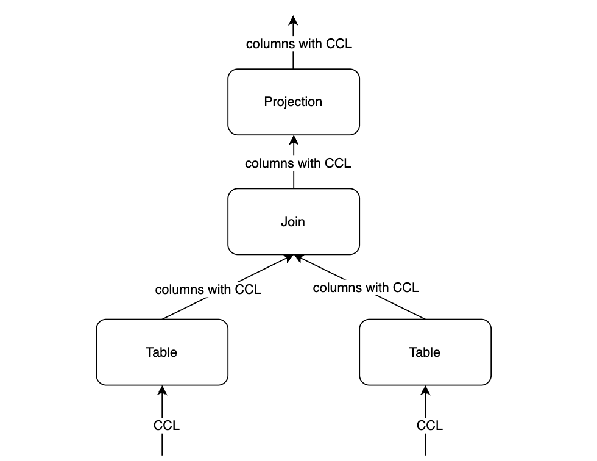

:target{#scql-ccl}

# SCQL CCL

Due to the flexibility of the SCQL syntax, the query issuer may be able to infer some of the original data from the results using a delicately constructed query. Therefore, it is generally necessary to obtain permission from all data owners before executing a query submitted by the issuer.

Manual review of queries allows data owners to confirm how the data is used and whether there is any leakage of sensitive information. However, manual review has the following two problems: 1. There are high requirements for reviewers, who need to have query analysis capabilities and be able to identify potential information leakage problems; 2. The waiting time for approval before execution is long. Authorizations from all data owners involved in the Query is required.

SCQL provides a Column Control List (CCL) mechanism that allows data owners to define data usage and disclosure restrictions. Queries that do not pass the CCL check are prohibited from execution. For queries that pass the CCL check, with the assistance of CCL, reviewers could focus on whether the query results can be used to infer sensitive data, which reduces the review burden and improves review efficiency. It should be noted that while CCL can help alleviate the problem of data abuse to some extent, it cannot completely eliminate the risk of inferring sensitive data from query results. It is recommended to combine it with pre-approval to reduce the risk of inferring results.

:target{#what-is-ccl}

## What is CCL?

The CCL (Column Control List) constrains the revelation policy and operations allowed to be performed on columns. SCQL promises to comply with these constraints, reject queries that do not meet CCL requirements, and ensure that the execution process doesn’t violate the data revelation policy specified by CCL. CCL can be represented as a triplet <code>\<src\_column, dest\_party, constraint></code>, which means the constraint type of src\_column on dest\_party.

<Container type="note">
  Currently, only one CCL constraint can be set for a column on a given participant.
</Container>

:target{#types-of-ccl-constraints}

## Types of CCL Constraints

CCL Constraints are currently divided into the following seven types. Among them, the first six constraints describe the circumstances under which data can be revealed

- <code>PLAINTEXT</code>: Computation and revelation of data in any form, including clear text, is permitted without any restrictions on use. Typically used for non-sensitive data. <code>PLAINTEXT</code> needs to be used with caution.
- <code>PLAINTEXT\_AFTER\_JOIN</code>: The data is allowed to be used as the key of INNER JOIN, and can be revealed in plaintext after JOIN.
- <code>PLAINTEXT\_AFTER\_GROUP\_BY</code>: When the constrained column is used as GROUP BY key, it can be revealed in plaintext after GROUP BY. CCL also limits the rows of the results obtained by GROUP BY, and filters out the groups whose number of rows does not meet the requirement of more than three.
- <code>PLAINTEXT\_AFTER\_AGGREGATE</code>: When the constrained column is used as the input parameter of aggregation functions (such as SUM, AVG, MIN, MAX, COUNT), the calculated results can be revealed in plaintext.
- <code>PLAINTEXT\_AFTER\_COMPARE</code>: When the constrained column is used as an input parameter of Compare (such as \<, >, >=, =, !=, etc.), the result obtained can be revealed in plaintext.
- <code>ENCRYPTED\_ONLY</code>: Always compute in a secret state, used to mark very sensitive data. Except for count (SCQL does not protect the size of the calculation intermediate results), can’t be revealed in any form.
- <code>UNKNOWN</code>: Not defined, currently refuses to be revealed in any form by default.

<Container type="note">
  User is advised to set the CCL according to the scenario and privacy protection needs. The attacker may construct a query that satisfies the CCL constraint, and infer the sensitive information of the original data from the result through complex query or multiple query methods. For related risk descriptions and suggestions, see [SCQL Security Statement](scql_security_statement.mdx).
</Container>

:target{#advantages-of-ccl}

## Advantages of CCL

The primary role of CCL is to provide data owners with the ability to restrict how their data is used. Another benefit brought by CCL is that it can provide hints for SCQL execution optimization.

For example, when the CCL constraint of the column is <code>PLAINTEXT\_AFTER\_AGGREGATE</code>, the result of the SUM of the column can participate in the next calculation in plaintext state, which can speed up the overall execution efficiency.

:target{#how-ccl-works}

## How CCL Works?

Translator takes the Logical Plan generated by the query and CCL settings as input, and then builds a Logical Plan with CCL. Translator will check the CCL of the the result contained in the root node, and only allow the query to execute if the CCL constraints of the result for the issuer is <code>PLAINTEXT</code>, otherwise, reject the query.

The following is a brief introduction and explanation of the derivation process and principle of CCL.

The derivation is based on the CCL set by the user. The derivation strategy is divided into two categories, one is the derivation of specific operations, such as relational algebra operations and specific functions; the other is the derivation of general expressions.

:target{#specific-operators-derivation}

### Specific Operators Derivation

The following explains the derivation of specific operations, taking operations such as JOIN and GROUP BY as examples.

<strong>Join</strong>

When the CCL constraints of the JOIN keys are both <code>PLAINTEXT\_AFTER\_JOIN</code> or <code>PLAINTEXT</code>, the CCL constraint type of the intersection result is <code>PLAINTEXT</code>.

<strong>Group By</strong>

When the CCL constraints of GROUP BY keys are <code>PLAINTEXT\_AFTER\_GROUP\_BY</code> or <code>PLAINTEXT</code>, the CCL constraints of the group by keys after GROUP BY are <code>PLAINTEXT</code>.

<strong>Aggregate</strong>

When the CCL constraints of the input parameters of the aggregation functions (such as SUM, AVG, MIN, MAX, COUNT) are <code>PLAINTEXT\_AFTER\_AGGREGATE</code> or <code>PLAINTEXT</code>, the CCL constraints of the results of the aggregation function are <code>PLAINTEXT</code>

<strong>Compare</strong>

When the CCL constraints of the input parameters of the compare function (> \< = >= \<= !=) are set to <code>PLAINTEXT\_AFTER\_COMPARE</code> or <code>PLAINTEXT</code>, the CCL constraints of the results of the compare function will be set to <code>PLAINTEXT</code>

:target{#general-operators-derivation}

### General Operators Derivation

For a general operator/function, CCL derives the CCL constraints of the results according to the CCL constraints of the input parameters. CCL derivation can be divided into the following situations (UNKNOWN indicates that the derivation process is abnormal, which will not be discussed here):

- When one of the input parameters’ CCL constraint is <code>PLAINTEXT</code>, the influence of this input parameter on the CCL constraint of the result can be ignored during the derivation of the CCL constraint.
- When one of the input parameters’ CCL constraint is <code>ENCRYPTED\_ONLY</code>, the CCL constraint of the result is <code>ENCRYPTED\_ONLY</code>.
- When the CCL constraints of the input parameters are the same, return this CCL constraint.
- For operators without input parameters, such as CURDATE(), NOW() and other functions, the CCL constraint of the result is <code>PLAINTEXT</code>.

For the constants in the query, it can be considered that the CCL constraints for all parties are <code>PLAINTEXT</code>.

For situations other than above, it is currently considered impossible to derive, and the CCL constraint of the result is <code>UNKNOWN</code>.

:target{#examples}

### Examples

Assume that there are two parties, Alice and Bob. Alice holds the data table ta, while Bob holds the data table tb, and both of them collaborate to execute a query task. The table ta held by Alice contains the fields id and rank, and the table tb held by Bob contains the fields id and rank.

CCL settings of table ta at Alice:

- <code>\<ta.id, Alice, PLAINTEXT></code>
- <code>\<ta.id, Bob, PLAINTEXT\_AFTER\_JOIN></code>
- <code>\<ta.rank, Alice, PLAINTEXT></code>
- <code>\<ta.rank, Bob, PLAINTEXT\_AFTER\_COMPARE></code>

CCL settings of table tb at Bob:

- <code>\<tb.id, Bob, PLAINTEXT></code>
- <code>\<tb.id, Alice, PLAINTEXT\_AFTER\_JOIN></code>
- <code>\<tb.rank, Bob, PLAINTEXT></code>
- <code>\<tb.rank, Alice, PLAINTEXT\_AFTER\_COMPARE></code>

When Alice executes query <code>select tb.rank from ta join tb on ta.id = tb.id</code>, SCQL will verify the CCL and generate a verification failure error: tb.rank is not <code>PLAINTEXT</code> for Alice’s CCL constraint.

When Alice executes query <code>select ta.rank > tb.rank from ta join tb on ta.id = tb.id</code>, SCQL CCL verification passes, the query can be executed normally and the result can be obtained, since the CCL constraint of the result of <code>ta.rank > tb.rank</code> for Alice is <code>PLAINTEXT</code>.
