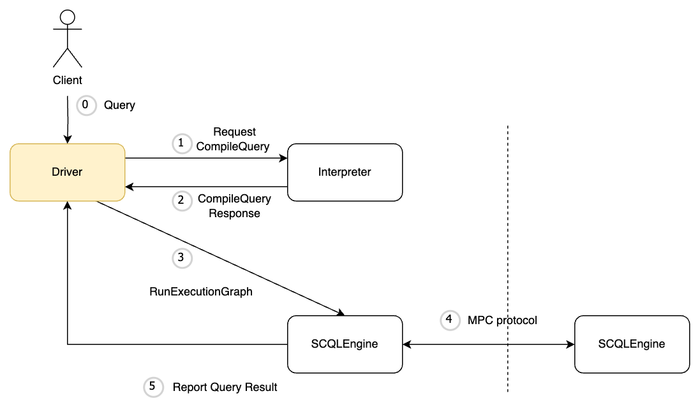

:target{#deployment-architecture-p2p-vs-centralized}

# Deployment Architecture: P2P vs Centralized

The SCQL system supports both P2P and Centralized deployment architecture.
They look different, but share the same SCQL unified architecture.

- The `Driver` component in the above diagram could be `Broker` in P2P deployment architecture, or `SCDB` in centralized deployment architecture.
- The `Interpreter` component is responsible for translating the DQL query into hybrid MPC-plaintext execution graph, it is the core component of SCQL. Normally, it will be embedded in the `Driver` as lib.

:target{#which-one-to-choose-p2p-or-centralized}

## Which one to choose, P2P or Centralized?

It depends on the actual business scenario. If there is no trusted third party to rely on, use P2P deployment architecture. If there exists a trusted third party, user could choose the centralized deployment architecture.

Both P2P and Centralized deployment architecture support the same SCQL DQL syntax and MPC protocol, and the end-to-end performance is basically the same.
