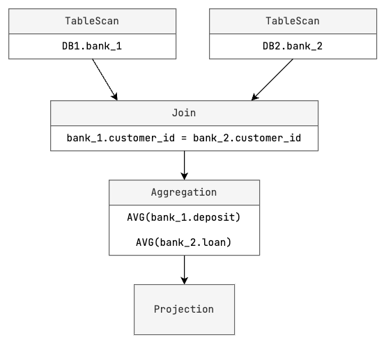

:target{#scql-system-overview}

# SCQL System Overview

Secure Collaborative Query Language (SCQL) is a system that allows multiple distrusting parties to run joint analysis without revealing their private data.

:target{#key-features}

## Key Features

- Semi-honest security. SCQL assumes that all parties are semi-honest.
- Support multiple parties (N >= 2).
- Support common SQL select syntax and functions to meet the needs of most scenarios. Please check [SCQL Implementation Status](../../reference/implementation-status.mdx) for details.
- Practical performance.  SCQL has multiple levels of performance optimization.
- Easy to use. SCQL provides relation SQL-like interface.
- Data usage authorization. SCQL provides a mechanism named CCL (Column Control List) for data owner to define their data usage restrictions.

:target{#architecture}

## Architecture

An SCQL system consists of an SCDB server and multiple SCQLEngines.

- SCDB server is responsible for translating SQL query into a hybrid MPC-plaintext execution graph and dispatching the execution graph to SCQLEngine of participants.
- SCQLEngine is a hybrid MPC-plaintext execution engine, which collaborates with peers to run the execution graph and reports the query result to SCDB server. SCQLEngine is implemented on top of state-of-the-art MPC framework [secretflow/spu](https://github.com/secretflow/spu).

:target{#how-scql-works}

## How SCQL Works

We will show how SCQL works through the life of the following sample SCQL query Q.

<figure id="id1">
  <figcaption>
    SCQL query Q
  </figcaption>

  ```SQL
  SELECT AVG(bank_1.deposit), AVG(bank_2.loan)
  FROM bank_1
  INNER JOIN bank_2
  ON bank_1.customer_id = bank_2.customer_id;
  ```
</figure>

:target{#table-schema}

### Table schema

Let’s have a look at the schema of tables involved in the above query Q.


- <DefinitionList>
    <dl>
      <dt>
        <DefinitionList.Term><span>`bank_1`</span></DefinitionList.Term>
      </dt>

      <dd>
        Party Bank1 owns the table `bank_1` in its local database `DB1`, which has two columns `customer_id` and `deposit`.
      </dd>
    </dl>
  </DefinitionList>
- <DefinitionList>
    <dl>
      <dt>
        <DefinitionList.Term><span>`bank_2`</span></DefinitionList.Term>
      </dt>

      <dd>
        Party Bank2 owns the table `bank_2` in its local database `DB2`, which has two columns `customer_id` and `loan`.
      </dd>
    </dl>
  </DefinitionList>

:target{#column-control-list-ccl}

### Column Control List (CCL)

CCL Form: `<src_column, dest_party, constraint>`

It means `src_column` is accessible to `dest_party` with the `constraint`.

To make the query Q pass the CCL validation, data owner should grant the following CCL.

- <DefinitionList>
    <dl>
      <dt>
        <DefinitionList.Term><span>Bank1</span></DefinitionList.Term>
      </dt>

      <dd>
        - `<bank_1.customer_id, Bank1, PLAINTEXT>`
        - `<bank_1.deposit, Bank1, PLAINTEXT>`
        - `<bank_1.customer_id, Bank2, PLAINTEXT_AFTER_JOIN>`
        - `<bank_1.deposit, Bank2, PLAINTEXT_AFTER_AGGREGATE>`
      </dd>
    </dl>
  </DefinitionList>
- <DefinitionList>
    <dl>
      <dt>
        <DefinitionList.Term><span>Bank2</span></DefinitionList.Term>
      </dt>

      <dd>
        - `<bank_2.customer_id, Bank2, PLAINTEXT>`
        - `<bank_2.loan, Bank2, PLAINTEXT>`
        - `<bank_2.customer_id, Bank1, PLAINTEXT_AFTER_JOIN>`
        - `<bank_2.loan, Bank1, PLAINTEXT_AFTER_AGGREGATE>`
      </dd>
    </dl>
  </DefinitionList>

<Container type="note">
  To learn more about CCL, please read the doc [<span>SCQL CCL</span>](../ccl/intro.mdx).
</Container>

:target{#lifetime-of-scql-query}

### Lifetime of SCQL query

:target{#step1-initialize-a-session}

#### Step1. Initialize a Session

SCDB creates a new session for the incoming query, and then authenticates the identity of the query issuer. It will reject the request if authentication fails.

:target{#step2-parse-and-plan-q}

#### Step2. Parse and Plan Q

Parser will parse Q into an AST(Abstract Syntax Tree), and then Planner converts it into a Logical Plan.

:target{#step3-translate}

#### Step3. Translate

Step3.1 Build and Check CCL

Translator needs to retrieve CCL from CCL manager, it will build CCL along the logical plan and verify the CCL of root node to ensure Q is legal on data owners’ constraints.

Step3.2 Translate

The translator takes the logical plan and CCL as inputs and generates an execution graph for the query Q as follows.

:target{#step4-optimize-and-split-graph}

#### Step4. Optimize and Split Graph

The graph optimizer will optimize the execution graph, such as node fusion and replicated node elimination.
The optimized execution graph is still a whole graph, graph splitter will split the whole graph into subgraphs based on the parties of the nodes.

:target{#step5-execute}

#### Step5. Execute

SCDB sends the subgraphs to corresponding SCQLEngine nodes, SCQLEngine cooperates with peers to run the execution graph and reports the final result of Q to SCDB.
