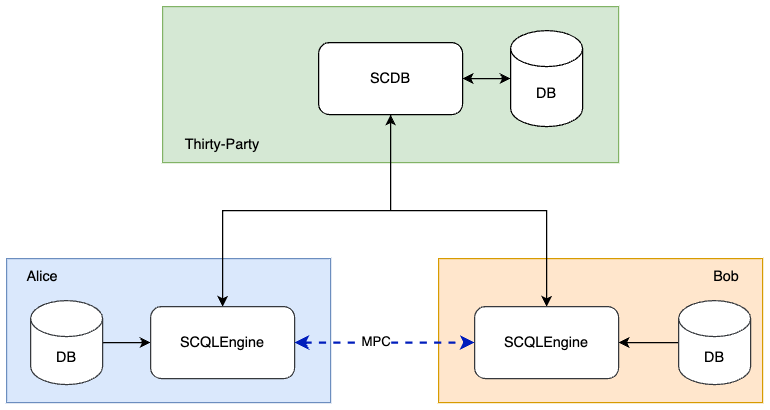

:target{#deployment}

# 部署

本文描述了如何使用 Docker 部署一个 SCQL 系统，并且使用 scdbclient 进行查询，它与 [快速开始](quickstart.mdx) 基本相同，只不过是部署在多台机器上。

在开始阅读这篇文档前，我们假设读者已经具备一定的 docker-compose 使用经验。如果您对 Docker Compose 不熟悉，请参阅 [Docker Compose 官方概述](https://docs.docker.com/compose/)，或者查看 [入门指南](https://docs.docker.com/compose/gettingstarted/)。

:target{#deployment-diagram}

## 部署图

SCQL 系统的部署图如下图所示，它涉及到三个参与方，包括一个可信的第三方和两个名为 <code>Alice</code> 和 <code>Bob</code> 的数据提供方。我们使用三台机器来模拟不同的参与方。



<Container type="note">
  1. SCDB 使用 HTTP 协议提供服务。在生产环境建议使用 HTTPS。详情请查看 [<span>配置 TLS</span>](../development/scql_config_manual.mdx#scdb-tls)。
  2. 请注意，虽然我们在演示中使用 ToyGRM，但它不应该被应用在生产环境。
</Container>

:target{#step-1-deploy-scqlengine}

## 步骤一：部署 SCQLEngine

在这里，我们将展示如何在参与方 Alice 中部署引擎，Bob 同理。

:target{#create-a-workspace}

### 1.1 创建工作区

```bash
mkdir engine
cd engine
```

:target{#set-dataset}

### 1.2 设置数据集

引擎中的数据库用于存储原始数据。在本文档中我们将使用 MySQL 作为数据库服务并模拟一个数据集，当然，如果您愿意，也可以使用您喜欢的数据库服务。

要模拟一个数据集，你需要在你的工作区中创建一个名为 alice\_init.sql 的 SQL 初始化文件，该文件对应于 [alice\_init.sql](https://github.com/secretflow/scql/tree/main/examples/docker-compose/mysql/initdb/alice_init.sql)。对于 Bob 请使用 [bob\_init.sql](https://github.com/secretflow/scql/tree/main/examples/docker-compose/mysql/initdb/bob_init.sql)。

此文件也可以在命令行使用 curl、wget 或其它类似工具获取。

```bash
wget raw.githubusercontent.com/secretflow/scql/main/examples/docker-compose/mysql/initdb/alice_init.sql
```

:target{#set-engine-config}

### 1.3 配置引擎

在您的工作区中创建一个名为 <code>gflags.conf</code> 的文件，并粘贴以下代码：

```bash
--listen_port=8080
--datasource_router=embed
--enable_scdb_authorization=true
--engine_credential=__ALICE_CREDENTIAL__
--server_enable_ssl=false
--scdb_enable_ssl_as_client=false
--peer_engine_enable_ssl_as_client=false
--embed_router_conf={"datasources":[{"id":"ds001","name":"mysql db","kind":"MYSQL","connection_str":"db=alice;user=root;password=testpass;host=mysql;auto-reconnect=true"}],"rules":[{"db":"*","table":"*","datasource_id":"ds001"}]}
```

更多配置信息请查看 [引擎配置项](../development/scql_config_manual.mdx#engine-config-options)

<Container type="note">
  <code>embed\_router\_conf</code> 中指定的 <code>connection\_str</code> 用于连接 [1.2 设置数据集](#set-dataset) 中设置的 alice 的数据库，对于 Bob，应该连接 bob 的数据库。

  <code>\_\_ALICE\_CREDENTIAL\_\_</code> 用于验证 SCDB，您需要用自己的凭据替换它，对于 Bob 同样如此。在我们的示例中，我们简单的将 Alice 的凭据设置为 <code>credential\_alice</code>，将 Bob 的凭据设置为 <code>credential\_bob</code>。
</Container>

:target{#create-docker-compose-file}

### 1.4 创建 docker-compose 文件

在您的工作区中创建一个名为 <code>docker-compose.yaml</code> 的文件，并粘贴以下代码：

```yaml
version: "3.8"
services:
  engine:
    cap_add:
      - NET_ADMIN
    command:
      - /home/admin/bin/scqlengine
      - --flagfile=/home/admin/engine/conf/gflags.conf
    restart: always
    image: secretflow/scql:latest
    ports:
      - __ALICE_PORT__:8080
    volumes:
      - ./gflags.conf:/home/admin/engine/conf/gflags.conf
  mysql:
    image: mysql:latest
    environment:
      - MYSQL_ROOT_PASSWORD=testpass
      - TZ=Asia/Shanghai
    healthcheck:
      retries: 10
      test:
        - CMD
        - mysqladmin
        - ping
        - -h
        - mysql
      timeout: 20s
    expose:
      - "3306"
    restart: always
    volumes:
      - ./alice_init.sql:/docker-entrypoint-initdb.d/alice_init.sql
```

<Container type="note">
  <code>\_\_ALICE\_PORT\_\_</code> 是 Engine 在宿主机上的监听端口，您需要替换为一个可访问的端口。这里我们将其指定为 8080

  <em>mysql</em> 容器通过 [1.2 设置数据集](#set-dataset) 设置的 <code>alice\_init.sql</code> 进行初始化，对于 Bob 应该使用 <code>bob\_init.sql</code>。如果您有自己的数据库服务，可以删除 <em>mysql</em> 容器
</Container>

:target{#start-engine-service}

### 1.5 启动引擎

您工作区的文件应如下所示：

```bash
└── engine
  ├── alice_init.sql
  ├── gflags.conf
  └── docker-compose.yaml
```

然后您可以运行 docker compose up 来启动引擎服务

```bash
# If you install docker with Compose V1, pleas use `docker-compose` instead of `docker compose`
$ docker compose -f docker-compose.yaml up -d

Creating network "engine_default" with the default driver
Creating engine_engine_1 ... done
Creating engine_mysql_1  ... done
```

您可以使用 docker logs 检查引擎是否正常工作

```bash
$ docker logs -f engine_engine_1

[info] [main.cc:main:297] Started engine rpc server success, listen on: 0.0.0.0:8080
```

SCQLEngine 正在监听 <code>8080</code>。

:target{#step-2-deploy-scdb}

## 步骤二：部署 SCDB

本章将演示如何在第三方部署 SCDB

:target{#id1}

### 2.1 创建工作区

```bash
mkdir scdb
cd scdb
```

:target{#set-toygrm}

### 2.2 配置 ToyGRM

我们在演示中使用 toygrm 取代 stdgrm，这意味着 GRM 服务是通过读取本地 JSON 文件进行模拟，不建议在生产环境中使用，了解有关 GRM 的更多信息请查看 [全局资源管理器](../reference/grm.mdx#grm)。

在您的工作区创建一个名为 <code>toy\_grm.json</code> 的 JSON 文件，其内容应如下所示：

```json
{
  "engine": {
    "read_token": ["__ALICE_TOKEN__", "__BOB_TOKEN__"],
    "engines_info": [
      {
        "party": "alice",
        "url": ["__ENGINE_ALICE_HOST__:__ALICE_PORT__"],
        "credential": ["__ALICE_CREDENTIAL__"]
      },
      {
        "party": "bob",
        "url": ["__ENGINE_BOB_HOST__:__BOB_PORT__"],
        "credential": ["__BOB_CREDENTIAL__"]
      }
    ]
  },
  "table": {
    "read_token": ["__ALICE_TOKEN__", "__BOB_TOKEN__"],
    "ownerships": [
      { "tids": ["tid0"], "token": "__ALICE_TOKEN__" },
      { "tids": ["tid1"], "token": "__BOB_TOKEN__" }
    ],
    "table_schema": [
      {
        "tid": "tid0",
        "schema": {
          "ref_db_name": "alice",
          "ref_table_name": "user_credit",
          "columns": [
            { "column_name": "ID", "column_type": "string" },
            { "column_name": "credit_rank", "column_type": "long" },
            { "column_name": "income", "column_type": "long" },
            { "column_name": "age", "column_type": "long" }
          ]
        }
      },
      {
        "tid": "tid1",
        "schema": {
          "ref_db_name": "bob",
          "ref_table_name": "user_stats",
          "columns": [
            { "column_name": "ID", "column_type": "string" },
            { "column_name": "order_amount", "column_type": "float" },
            { "column_name": "is_active", "column_type": "long" }
          ]
        }
      }
    ]
  }
}
```

<Container type="note">
  <code>\_\_ALICE\_TOKEN\_\_</code> 和 <code>\_\_BOB\_TOKEN\_\_</code> 是用于验证用户身份的字符串令牌，您应该用自己的令牌信息替换他们。在这里，它们被设置为 <code>token\_alice</code> 和 <code>token\_bob</code>。

  <code>\_\_ENGINE\_ALICE\_HOST\_\_</code> 和 <code>\_\_ENGINE\_BOB\_HOST\_\_</code> 代表了 Alice 和 Bob 的 IP 地址，您应该使用自己的 IP 地址信息替换这些占位符。

  <code>\_\_ALICE\_PORT\_\_</code> 和 <code>\_\_BOB\_PORT\_\_</code> 代表引擎服务的监听端口，并且应该于 [1.4 创建 docker-compose 文件](#create-docker-compose-file) 中指定的发布端口相匹配。这里应该是 8080。

  <code>\_\_ALICE\_CREDENTIAL\_\_</code> 和 <code>\_\_BOB\_CREDENTIAL\_\_</code> 用于在向引擎发送请求时识别 SCDB，并且应该与 [1.3 配置引擎](#set-engine-config) 中指定的 <code>engine\_credential</code> 相匹配。这里应该是 <code>credential\_alice</code> and <code>credential\_bob</code>。
</Container>

:target{#set-scdb-config}

### 2.3 配置 SCDB

在您的工作区创建一个名为 <code>config.yml</code> 的文件，并将以下代码粘贴进去：

```yaml
scdb_host: scdb:8080
port: 8080
protocol: http
query_result_callback_timeout: 3m
session_expire_time: 3m
session_expire_check_time: 100ms
log_level: debug
storage:
  type: mysql
  conn_str: "root:testpass@tcp(mysql:3306)/scdb?charset=utf8mb4&parseTime=True&loc=Local&interpolateParams=true"
  max_idle_conns: 10
  max_open_conns: 100
  conn_max_idle_time: 2m
  conn_max_lifetime: 5m
grm:
  grm_mode: toygrm
  toy_grm_conf: /home/admin/configs/toy_grm.json
engine:
  timeout: 120s
  protocol: http
  content_type: application/json
  spu:
    protocol: SEMI2K
    field: FM64
    sigmoid_mode: SIGMOID_REAL
```

更多配置信息请查看 [SCDB 配置项](../development/scql_config_manual.mdx#scdb-config-options)

<Container type="note">
  <code>conn\_str</code> 用于连接一个名为 SCDB 的数据库，该数据库将在 2.4 节中通过 docker-compose 完成部署。您也可以根据自己的需求来设置对应的数据库连接串
</Container>

:target{#id2}

### 2.4 创建 docker-compose 文件

在您的工作区中创建一个名为 <code>docker-compose.yaml</code> 的文件，并粘贴以下代码：

```yaml
version: "3.8"
services:
  scdb:
    image: secretflow/scql:latest
    environment:
      - SCQL_ROOT_PASSWORD=root
    command:
      - /home/admin/bin/scdbserver
      - -config=/home/admin/configs/config.yml
    restart: always
    ports:
      - __SCDB_PORT__:8080
    volumes:
      - ./config.yml:/home/admin/configs/config.yml
      - ./toy_grm.json:/home/admin/configs/toy_grm.json
  mysql:
    image: mysql:latest
    environment:
      - MYSQL_ROOT_PASSWORD=testpass
      - MYSQL_DATABASE=scdb
      - TZ=Asia/Shanghai
    healthcheck:
      retries: 10
      test:
        - CMD
        - mysqladmin
        - ping
        - -h
        - mysql
      timeout: 20s
    expose:
      - "3306"
    restart: always
```

<Container type="note">
  <code>\_\_SCDB\_PORT\_\_</code> 是 SCDB 服务在宿主机上的监听端口。您需要用一个可访问的端口号替换它。这里设置为 8080。
</Container>

:target{#start-scdb-service}

### 2.5 启动 SCDB

您工作区的文件应如下所示：

```bash
└── scdb
  ├── scdb_init.sql
  ├── config.yml
  ├── toy_grm.json
  └── docker-compose.yaml
```

然后您可以运行 docker compose up 来启动引擎服务

```bash
# If you install docker with Compose V1, pleas use `docker-compose` instead of `docker compose`
$ docker compose -f docker-compose.yaml up -d

Creating scdb_mysql_1 ... done
Creating scdb_scdb_1  ... done
```

您可以使用 docker logs 检查引擎是否正常工作

```bash
$ docker logs -f scdb_scdb_1

INFO main.go:122 Starting to serve request with http...
```

SCDB 正在监听 <code>8080</code>，等待连接。

:target{#step-3-scql-test}

## 步骤三：测试 SCQL

这里我们使用 scdbclient 向 SCDB 提交测试查询，您也可以通过发送 POST 请求直接向 SCDB 提交查询。此步骤可以在任何能访问 SCDB 地址的机器上完成。

关于 scdbclient 更多信息请阅读 [如何使用 SCDBClient](https://github.com/secretflow/scql/tree/main/cmd/scdbclient/README.md)

:target{#build-scdbclient}

### 3.1 构建 scdbclient

```bash
# Grab a copy of scql:
git clone git@github.com:secretflow/scql.git
cd scql

# build scdbclient from source
# requirements:
#   go version >= 1.19
go build -o scdbclient cmd/scdbclient/main.go

# try scdbclient
./scdbclient --help
```

:target{#set-client-config}

### 配置客户端

创建一个名为 <code>users.json</code> 的 JSON 文件，内容如下：

```json
{
  "alice": {
    "UserName": "alice",
    "Password": "some_password",
    "GrmToken": "__ALICE_TOKEN__"
  },
  "bob": {
    "UserName": "bob",
    "Password": "another_password",
    "GrmToken": "__BOB_TOKEN__"
  },
  "root": {
    "UserName": "root",
    "Password": "root",
    "GrmToken": ""
  }
}
```

<Container type="note">
  <code>root</code> 用户是在 scdb 容器初始化时设置的 SCDB 管理员用户，<code>alice</code> 和 <code>bob</code> 分别属于 Alice 和 Bob。

  <code>alice</code> 和 <code>bob</code> 的用户信息应该与您将要创建的用户信息保持一致。

  <code>\_\_ALICE\_TOKEN\_\_</code> 和 <code>\_\_BOB\_TOKEN\_\_</code> 应该与 [2.2 配置 ToyGRM](#set-toygrm) 中设置的令牌信息保持一致。这里应该设置为 <code>token\_alice</code> 和 <code>token\_bob</code>。
</Container>

:target{#submit-query}

### 3.3 提交查询

您可以开始使用 scdbclient 向 SCDBServer 提交查询并获取查询结果。您可以与在 [快速开始](quickstart.mdx) 中执行的操作相同

```bash
# use scdbclient to connect to scdbserver
./scdbclient prompt --host=__SCDB_URL__ --usersConfFileName=users.json --sync
> switch root
# create our first db demo
root> create database demo
[fetch] OK for DDL/DML
root> show databases;
[fetch]
1 rows in set: (2.945772ms)
+----------+
| Database |
+----------+
| demo     |
+----------+
...
```

<Container type="note">
  <code>\_\_SCDB\_URL\_\_</code> 是 scdb 服务监听的 url（例如：[http://127.0.0.1:8080](http://127.0.0.1:8080)），您需要用 scdb 服务的 url 替换它。
</Container>
