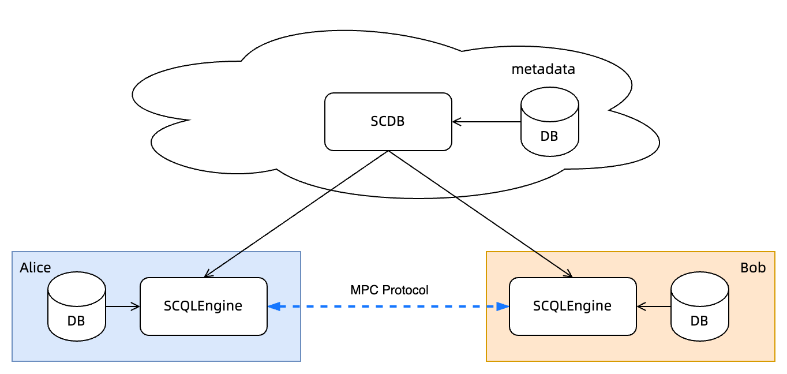

:target{#quickstart}

# 快速开始

:target{#tl-dr}

## 摘要

使用 <code>docker-compose</code> 来部署一个独立的 SCQL，然后使用 scdbclient 来查询

:target{#prerequisites}

## 先决条件

:target{#build-scdbclient}

### 构建 scdbclient

<code>scdbclient</code> 是 SCDBServer 的一个命令行客户端，我们将用它来向 SCDBServer 提交查询，并取回查询结果。

```bash
# build scdbclient from source
# requirements:
#   go version >= 1.19
go build -o scdbclient cmd/scdbclient/main.go

# try scdbclient
./scdbclient --help
```

:target{#register-user-information}

### 注册用户信息

在启动 SCQL 服务之前，您需要在 ToyGRM 中初始化令牌和凭证，并将这些信息写入 user.json 和引擎的配置文件中。

```bash
bash examples/docker-compose/register.sh
```

<Container type="note">
  register.sh 脚本会用随机的字符串替代 [examples/docker-compose/client/users.json](https://github.com/secretflow/scql/tree/main/examples/docker-compose/client/users.json) 中的 <code>\_\_ALICE\_TOKEN\_\_</code> 以及 [examples/docker-compose/scdb/conf/toy\_grm.json](https://github.com/secretflow/scql/tree/main/examples/docker-compose/scdb/conf/toy_grm.json) 中的 <code>\_\_BOB\_TOKEN\_\_</code>
</Container>

:target{#start-scql-service}

## 启动 SCQL 服务

你可以通过 [docker-compose](https://github.com/secretflow/scql/tree/main/examples/docker-compose) 来启动 SCQL 服务 ，它将部署和启动服务，如下图所示，它包含一个 SCDBServer 和两个分别来自参与方 <code>alice</code> 、 <code>bob</code> 的 SCQLEngines 。



<Container type="note">
  为了演示 SCQL，我们进行了以下简化操作：

  1. SCDBServer 和另外两个 SCQLEngines 使用同一个数据库服务器，但是使用不同的数据库名称进行区分。
  2. SCDBServer 是通过 HTTP 协议提供服务的。然而，对于生产环境，建议使用 HTTPS 协议来代替。请查看 [<span>TLS 配置</span>](../development/scql_config_manual.mdx#scdb-tls) 以了解详情。
  3. 请注意，虽然我们在演示中使用了 ToyGRM，但它不应该在生产环境中使用。
</Container>

```bash
# startup docker-compose
# If you install docker with Compose V1, pleas use `docker-compose` instead of `docker compose`
(cd examples/docker-compose && docker compose up -d)
```

SCDBServer 监听 <code>http\://localhost:8080</code> ，你可以通过 scdbclient 向它发送查询。

<Container type="note">
  如果你遇到任何问题，请查看 [examples/docker-compose/README.md](https://github.com/secretflow/scql/tree/main/examples/docker-compose/README.md) 故障排除部分以获得帮助。
</Container>

:target{#create-database-user-and-tables}

## 创建数据库、用户和数据表

```bash
# use scdbclient to connect to scdbserver
./scdbclient prompt --host=http://localhost:8080 --usersConfFileName=examples/docker-compose/client/users.json --sync
# switch to root user
> switch root
root> show databases;
[fetch]
0 rows in set: (4.859805ms)
+----------+
| Database |
+----------+
+----------+
# create our first db demo
root> create database demo
[fetch] OK for DDL/DCL
root> show databases;
[fetch]
1 rows in set: (2.945772ms)
+----------+
| Database |
+----------+
| demo     |
+----------+
# create user "alice" with password "some_password" for party "alice"
# note: if you want to use a custom password,
# please ensure it is consistent with the one configured in `examples/docker-compose/client/users.json`
root> create user alice PARTY_CODE "alice" IDENTIFIED BY "some_password"
[fetch] OK for DDL/DCL
# create user "bob" with password "another_password" for party "bob"
root> create user bob PARTY_CODE "bob" IDENTIFIED BY "another_password"
[fetch] OK for DDL/DCL
# grant create, grant, drop privileges to user alice
root> GRANT CREATE, GRANT OPTION, DROP ON demo.* TO alice
[fetch] OK for DDL/DCL
# grant create, grant, drop privileges to user bob
root> GRANT CREATE, GRANT OPTION, DROP ON demo.* TO bob
[fetch] OK for DDL/DCL
# switch to user alice
root> switch alice
alice> show databases;
[fetch]
1 rows in set: (3.718238ms)
+----------+
| Database |
+----------+
| demo     |
+----------+
# create table `ta` reference party alice table `alice.user_credit` with tid="tid0"
alice> CREATE TABLE demo.ta TID="tid0"
[fetch] OK for DDL/DCL
# describe created table
alice> DESCRIBE demo.ta
[fetch]
4 rows in set: (2.581103ms)
+-------------+--------+
|    Field    |  Type  |
+-------------+--------+
| id          | string |
| credit_rank | int    |
| income      | int    |
| age         | int    |
+-------------+--------+
# switch to user bob and create table
alice> switch bob
# create table `tb` reference party bob table `bob.user_stats` with tid="tid1",
# checkout `examples/docker-compose/scdb/conf/toy_grm.json` for details.
bob> CREATE TABLE demo.tb TID="tid1"
bob> DESCRIBE demo.tb
[fetch]
3 rows in set: (3.487224ms)
+--------------+--------+
|    Field     |  Type  |
+--------------+--------+
| id           | string |
| order_amount | float  |
| is_active    | int    |
+--------------+--------+
```

:target{#grant-ccl}

## 授权 CCL

```bash
bob> switch alice
# alice set CCL
alice> GRANT SELECT PLAINTEXT(ID, credit_rank, income, age) ON demo.ta TO alice;
alice> GRANT SELECT PLAINTEXT_AFTER_JOIN(ID) ON demo.ta TO bob;
alice> GRANT SELECT PLAINTEXT_AFTER_GROUP_BY(credit_rank) ON demo.ta TO bob;
alice> GRANT SELECT PLAINTEXT_AFTER_AGGREGATE(income) ON demo.ta TO bob;
alice> GRANT SELECT PLAINTEXT_AFTER_COMPARE(age) ON demo.ta TO bob;
# switch to bob and set ccl
alice> switch bob
bob> GRANT SELECT PLAINTEXT(ID, order_amount, is_active) ON demo.tb TO bob;
bob> GRANT SELECT PLAINTEXT_AFTER_JOIN(ID) ON demo.tb TO alice;
bob> GRANT SELECT PLAINTEXT_AFTER_COMPARE(is_active) ON demo.tb TO alice;
bob> GRANT SELECT PLAINTEXT_AFTER_AGGREGATE(order_amount) ON demo.tb TO alice;
# show grants
bob> show grants on demo for alice
[fetch]
8 rows in set: (5.909338ms)
+----------------------------------------------------------------------------+
|                         Grants on demo for alice@%                         |
+----------------------------------------------------------------------------+
| GRANT CREATE, DROP, GRANT OPTION ON demo.* TO alice                        |
| GRANT SELECT PLAINTEXT(id) ON demo.ta TO alice                             |
| GRANT SELECT PLAINTEXT(credit_rank) ON demo.ta TO alice                    |
| GRANT SELECT PLAINTEXT(income) ON demo.ta TO alice                         |
| GRANT SELECT PLAINTEXT(age) ON demo.ta TO alice                            |
| GRANT SELECT PLAINTEXT_AFTER_JOIN(id) ON demo.tb TO alice                  |
| GRANT SELECT PLAINTEXT_AFTER_AGGREGATE(order_amount) ON demo.tb TO alice   |
| GRANT SELECT PLAINTEXT_AFTER_COMPARE(is_active) ON demo.tb TO alice        |
+----------------------------------------------------------------------------+
bob> show grants on demo for bob
[fetch]
8 rows in set: (4.974734ms)
+----------------------------------------------------------------------+
|                       Grants on demo for bob@%                       |
+----------------------------------------------------------------------+
| GRANT CREATE, DROP, GRANT OPTION ON demo.* TO bob                    |
| GRANT SELECT PLAINTEXT_AFTER_JOIN(id) ON demo.ta TO bob              |
| GRANT SELECT PLAINTEXT_AFTER_GROUP_BY(credit_rank) ON demo.ta TO bob |
| GRANT SELECT PLAINTEXT_AFTER_AGGREGATE(income) ON demo.ta TO bob     |
| GRANT SELECT PLAINTEXT_AFTER_COMPARE(age) ON demo.ta TO bob          |
| GRANT SELECT PLAINTEXT(id) ON demo.tb TO bob                         |
| GRANT SELECT PLAINTEXT(order_amount) ON demo.tb TO bob               |
| GRANT SELECT PLAINTEXT(is_active) ON demo.tb TO bob                  |
+----------------------------------------------------------------------+
```

:target{#do-query}

## 查询

```bash
bob> switch alice
alice> use demo
[demo]alice> SELECT ta.credit_rank, COUNT(*) as cnt, AVG(ta.income) as avg_income, AVG(tb.order_amount) as avg_amount FROM ta INNER JOIN tb ON ta.ID = tb.ID WHERE ta.age >= 20 AND ta.age <= 30 AND tb.is_active=1 GROUP BY ta.credit_rank;
[fetch]
2 rows in set: (1.151690583s)
+-------------+-----+------------+------------+
| credit_rank | cnt | avg_income | avg_amount |
+-------------+-----+------------+------------+
|           6 |   4 |  336016.22 |  5499.4043 |
|           5 |   6 |  18069.775 |  7743.3486 |
+-------------+-----+------------+------------+
```
