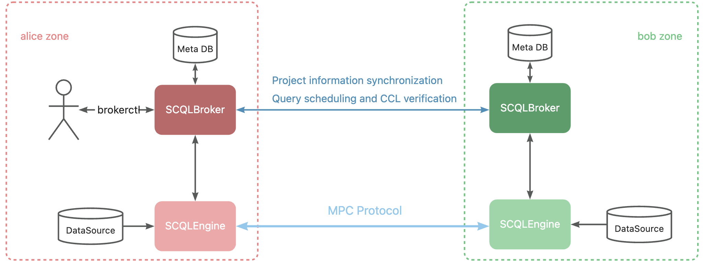

:target{#quickstart-tutorial}

# 快速开始

在本教程中，您将在单机上部署 SCQL 系统，然后模拟两方进行联合数据分析的项目设置，最后发起联合分析查询。

:target{#deployment-architecture-description}

## 部署架构说明

SCQL 支持两种部署架构：中心化和 P2P 。

- 中心化：中心化部署架构依靠可信第三方部署协调服务 SCDB ，每个数据参与方只需要部署一个 SCQLEngine 计算引擎。
- P2P ： P2P 部署架构不需要可信第三方，每个数据参与方都需要部署一个 SCQLEngine 和一个 SCQLBroker 。

本教程采用 P2P 部署架构。 如果您想体验中心化部署架构，可以参考 [这里](tutorial.mdx)

:target{#prerequisites}

## 先决条件

:target{#build-brokerctl}

### 构建 brokerctl

`brokerctl` 是面向 SCQLBroker 的命令行工具，我们将使用它来配置项目并向 SCQLBroker 提交查询。

```bash
# build brokerctl from source
# requirements:
#   go version >= 1.19
go build -o brokerctl cmd/brokerctl/main.go

# try brokerctl
./brokerctl --help
```

:target{#generate-privatekey-and-exchange-publickey}

### 生成私钥并交换公钥

```bash
bash examples/p2p-tutorial/setup.sh
```

<Container type="note">
  setup.sh 脚本将为各参与方生成私钥，并与其它参与方互相交换公钥。
</Container>

:target{#start-scql-service}

## 启动

你可以通过 [docker-compose](https://github.com/secretflow/scql/tree/main/examples/docker-compose) 来启动 SCQL 服务 ，它将部署和启动服务，如下图所示，它包含两个参与方 `alice` 和 `bob` 的 SCQLBroker 和 SCQLEngine 。



<Container type="note">
  为了演示 SCQL，我们进行了以下简化操作：

  1. SCQLBrokers 和 SCQLEngines 使用同一个数据库服务器，但是使用不同的数据库名称进行区分。
  2. SCQLBrokers 是通过 HTTP 协议提供服务的。然而，对于生产环境，建议使用 HTTPS 协议来代替。请查看 [<span>TLS 配置</span>](../reference/p2p-deploy-config.mdx#broker-tls) 以了解详情。
  3. 演示环境中 brokerctl 可以向两个 SCQLBrokers 发送请求，但在生产环境中，SCQLBroker 应使用本地端口，并且仅监听本地请求以确保安全。
</Container>

```bash
# startup docker-compose
# If you install docker with Compose V1, pleas use `docker-compose` instead of `docker compose`
(cd examples/p2p-tutorial && docker compose up -d)
```

alice 的 SCQLBroker 监听 `http://localhost:8081`，而 bob 则监听 `http://localhost:8082`，您可以通过 brokerctl 向他们发送请求。

<Container type="note">
  如果你遇到任何问题，请查看 [examples/p2p-tutorial/README.md](https://github.com/secretflow/scql/tree/main/examples/p2p-tutorial/README.md) 故障排除部分以获得帮助。
</Container>

:target{#create-project-invite-party-to-join}

## 创建项目，并邀请参与方加入

```bash
# create project demo in alice
# NOTE: we specify the project-id to simplify the description, generally you should make sure the id is unique or ignore this flag and use the automatically generated one
./brokerctl create project --project-id "demo" --host http://localhost:8081
# check project's information
./brokerctl get project --host http://localhost:8081
[fetch]
+-----------+---------+---------+----------------------------------+
| ProjectId | Creator | Members |               Conf               |
+-----------+---------+---------+----------------------------------+
| demo      | alice   | [alice] | {                                |
|           |         |         |   "protocol":  "SEMI2K",         |
|           |         |         |   "field":  "FM64"               |
|           |         |         | }                                |
+-----------+---------+---------+----------------------------------+

# alice invite bob to join the project
./brokerctl invite bob --project-id "demo" --host http://localhost:8081
# bob check invitation list
./brokerctl get invitation --host http://localhost:8082
[fetch]
+--------------+---------+---------+---------+-----------+---------+---------+----------------------------------+
| InvitationId | Status  | Inviter | Invitee | ProjectId | Creator | Members |               Conf               |
+--------------+---------+---------+---------+-----------+---------+---------+----------------------------------+
|            1 | Pending | alice   | bob     | demo      | alice   | [alice] | {                                |
|              |         |         |         |           |         |         |   "protocol":  "SEMI2K",         |
|              |         |         |         |           |         |         |   "field":  "FM64"               |
|              |         |         |         |           |         |         | }                                |
+--------------+---------+---------+---------+-----------+---------+---------+----------------------------------+

# bob decide to join the project with invitation-id 1
./brokerctl process invitation 1 --response "accept" --project-id "demo" --host http://localhost:8082
# check the project, its members should contain alice and bob
./brokerctl get project --host http://localhost:8081
[fetch]
+-----------+---------+-------------+----------------------------------+
| ProjectId | Creator |   Members   |               Conf               |
+-----------+---------+-------------+----------------------------------+
| demo      | alice   | [alice bob] | {                                |
|           |         |             |   "protocol":  "SEMI2K",         |
|           |         |             |   "field":  "FM64"               |
|           |         |             | }                                |
+-----------+---------+-------------+----------------------------------+
```

:target{#create-tables}

## 创建数据表

```bash
# create table for alice
./brokerctl create table ta --project-id "demo" --columns "ID string, credit_rank int, income int, age int" --ref-table alice.user_credit --db-type mysql --host http://localhost:8081
# check the table ta
./brokerctl get table ta --host http://localhost:8081 --project-id "demo"
[fetch]
TableName: ta, Owner: alice, RefTable: alice.user_credit, DBType: mysql
Columns:
+-------------+----------+
| ColumnName  | DataType |
+-------------+----------+
| age         | int      |
| credit_rank | int      |
| ID          | string   |
| income      | int      |
+-------------+----------+

# create table for bob
./brokerctl create table tb --project-id "demo" --columns "ID string, order_amount double, is_active int" --ref-table bob.user_stats --db-type mysql --host http://localhost:8082
# check the table tb
./brokerctl get table tb --host http://localhost:8082 --project-id "demo"
[fetch]
TableName: tb, Owner: bob, RefTable: bob.user_stats, DBType: mysql
Columns:
+--------------+----------+
|  ColumnName  | DataType |
+--------------+----------+
| ID           | string   |
| is_active    | int      |
| order_amount | double   |
+--------------+----------+
```

:target{#grant-ccl}

## 授权 CCL

```bash
# alice set CCL for table ta
./brokerctl grant alice PLAINTEXT --project-id "demo" --table-name ta --column-name ID --host http://localhost:8081
./brokerctl grant alice PLAINTEXT --project-id "demo" --table-name ta --column-name credit_rank --host http://localhost:8081
./brokerctl grant alice PLAINTEXT --project-id "demo" --table-name ta --column-name income --host http://localhost:8081
./brokerctl grant alice PLAINTEXT --project-id "demo" --table-name ta --column-name age --host http://localhost:8081

./brokerctl grant bob PLAINTEXT_AFTER_JOIN --project-id "demo" --table-name ta --column-name ID --host http://localhost:8081
./brokerctl grant bob PLAINTEXT_AFTER_GROUP_BY --project-id "demo" --table-name ta --column-name credit_rank --host http://localhost:8081
./brokerctl grant bob PLAINTEXT_AFTER_AGGREGATE --project-id "demo" --table-name ta --column-name income --host http://localhost:8081
./brokerctl grant bob PLAINTEXT_AFTER_COMPARE --project-id "demo" --table-name ta --column-name age --host http://localhost:8081
# bob set ccl for table tb
./brokerctl grant bob PLAINTEXT --project-id "demo" --table-name tb --column-name ID --host http://localhost:8082
./brokerctl grant bob PLAINTEXT --project-id "demo" --table-name tb --column-name order_amount --host http://localhost:8082
./brokerctl grant bob PLAINTEXT --project-id "demo" --table-name tb --column-name is_active --host http://localhost:8082

./brokerctl grant alice PLAINTEXT_AFTER_JOIN --project-id "demo" --table-name tb --column-name ID --host http://localhost:8082
./brokerctl grant alice PLAINTEXT_AFTER_COMPARE --project-id "demo" --table-name tb --column-name is_active --host http://localhost:8082
./brokerctl grant alice PLAINTEXT_AFTER_AGGREGATE --project-id "demo" --table-name tb --column-name order_amount --host http://localhost:8082

# show grants for alice
# NOTE: you can add flag tables to specify table like: --tables ta
./brokerctl get ccl  --project-id "demo" --parties alice --host http://localhost:8081
[fetch]
+-----------+-----------+--------------+---------------------------+
| PartyCode | TableName |  ColumnName  |        Constraint         |
+-----------+-----------+--------------+---------------------------+
| alice     | ta        | age          | PLAINTEXT                 |
| alice     | ta        | credit_rank  | PLAINTEXT                 |
| alice     | ta        | ID           | PLAINTEXT                 |
| alice     | ta        | income       | PLAINTEXT                 |
| alice     | tb        | ID           | PLAINTEXT_AFTER_JOIN      |
| alice     | tb        | is_active    | PLAINTEXT_AFTER_COMPARE   |
| alice     | tb        | order_amount | PLAINTEXT_AFTER_AGGREGATE |
+-----------+-----------+--------------+---------------------------+
# show grants for bob
./brokerctl get ccl  --project-id "demo" --parties bob --host http://localhost:8081
[fetch]
+-----------+-----------+--------------+---------------------------+
| PartyCode | TableName |  ColumnName  |        Constraint         |
+-----------+-----------+--------------+---------------------------+
| bob       | ta        | age          | PLAINTEXT_AFTER_COMPARE   |
| bob       | ta        | credit_rank  | PLAINTEXT_AFTER_GROUP_BY  |
| bob       | ta        | ID           | PLAINTEXT_AFTER_JOIN      |
| bob       | ta        | income       | PLAINTEXT_AFTER_AGGREGATE |
| bob       | tb        | ID           | PLAINTEXT                 |
| bob       | tb        | is_active    | PLAINTEXT                 |
| bob       | tb        | order_amount | PLAINTEXT                 |
+-----------+-----------+--------------+---------------------------+
```

:target{#do-query}

## 查询

```bash
./brokerctl run "SELECT ta.credit_rank, COUNT(*) as cnt, AVG(ta.income) as avg_income, AVG(tb.order_amount) as avg_amount FROM ta INNER JOIN tb ON ta.ID = tb.ID WHERE ta.age >= 20 AND ta.age <= 30 AND tb.is_active=1 GROUP BY ta.credit_rank;"  --project-id "demo" --host http://localhost:8081 --timeout 3
[fetch]
2 rows in set: (1.221304389s)
+-------------+-----+-------------------+-------------------+
| credit_rank | cnt |    avg_income     |    avg_amount     |
+-------------+-----+-------------------+-------------------+
|           5 |   6 | 18069.77597427368 | 7743.392951965332 |
|           6 |   4 | 336016.8590965271 | 5499.404067993164 |
+-------------+-----+-------------------+-------------------+
```
