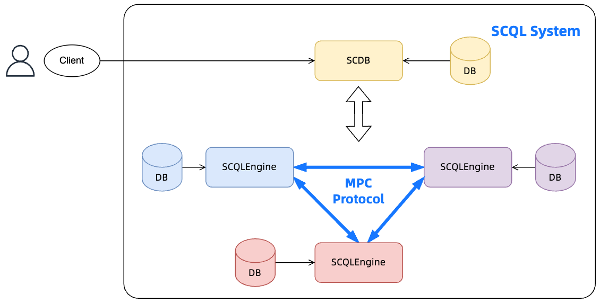

:target{#how-to-integrate-scdb}

# 如何集成 SCDB

:target{#overview}

## 概述

如图所示，SCQL 系统需要与 <strong>客户端</strong> 配合工作

- 客户端：为提交查询、获取结果而设计的用户接口



因此，平台应该提供客户端来集成 SCQL 系统。

具体来说，客户端通过查询 API 与 SCDB 互动。

:target{#query-api}

## 查询 API

针对 SQL 查询， SCDB 支持如下服务：

- Submit：异步 API，用于提交 SQL 查询并返回，服务器监听 `${SCDBHost}/public/submit_query`
- Fetch：异步 API，尝试获取 SQL 查询的结果，服务器监听 `${SCDBHost}/public/fetch_result`
- SubmitAndGet：同步 API，提交查询并等待获取查询结果，服务器监听server listen on `${SCDBHost}/public/submit_and_get`

更多细节请参考 [SCDB API](../../reference/scdb-api.mdx)

<Container type="note">
  - 客户端可以根据业务场景选择支持异步或同步 API：
    > 如果 SQL 查询任务需要较长的时间，建议使用异步 API，否则使用同步 API 更简单。
</Container>

简单来说，自定义客户端应该为用户的 SQL 构建 HTTP 请求，提交到 SCDB 并解析 SCDB 的响应。

:target{#sql-syntax}

## SQL 语法

SCDB 提供了类似 SQL 的用户界面，与大多数 MySQL 语法兼容。

<Container type="note">
  DQL 语法请参考 [<span>SCQL 方言指南</span>](../../reference/lang/manual.mdx)
</Container>

:target{#create-drop-alter-user-statement}

### <Target id="create-user-stm" />CREATE/DROP/ALTER USER Statement

```SQL
CREATE USER [IF NOT EXISTS] user PARTY_CODE party_code IDENTIFIED BY 'auth_string' [with_opt]

with_opt:
  WITH auth_opt [endpoint_opt]

auth_opt:
  (TOKEN token_str) | (message signature pub_key)

endpoint_opt:
  ENDPOINT endpoint (, endpoint)+


DROP USER [IF EXISTS] user

ALTER USER [IF EXISTS] user IDENTIFIED BY 'new_auth_string'

ALTER USER [IF EXISTS] user WITH ENDPOINT endpint (, endpoint)+
```

示例：

```SQL
-- create an user named alice,
-- with password `alice123`,
-- belongs to party `party_alice` with public key `MCowBQYDK2VwAyEAqhfJVWZX32aVh00fUqfrbrGkwboi8ZpTpybLQ4rbxoA=`.
-- the create user statement includes a timestamp message (in RFC 3339 formats), and signed by the party's private key.
CREATE USER `alice` PARTY_CODE 'party_alice' IDENTIFIED BY 'alice123' WITH '2023-08-23T15:46:16.096262218+08:00' 'DK/V80pV8bsWkXwgyRBrca7P2V2O03nC1pEldnJF+1dUnnL2NoRGKhAjSMv0ubuflT4yUmoIPRzwOi/bOsf2BQ==' 'MCowBQYDK2VwAyEAqhfJVWZX32aVh00fUqfrbrGkwboi8ZpTpybLQ4rbxoA=';

-- drop user alice
DROP USER alice;

-- change user alice password
ALTER USER alice IDENTIFIED BY "new_password";
-- change user engine endpoint
ALTER USER alice WITH ENDPOINT 'engine-alice-host:port'
```

:target{#create-drop-database-statement}

### <Target id="create-database-stm" />CREATE/DROP DATABASE Statement

```SQL
CREATE DATABASE [IF NOT EXISTS] database;

DROP DATABASE [IF EXISTS] database;
```

示例：

```SQL
-- create db `db_test`
CREATE DATABASE db_test;

-- drop db `db_test`
DROP DATABASE db_test;
```

:target{#create-drop-table-statement}

### <Target id="create-table" />CREATE/DROP TABLE Statement

```SQL
CREATE TABLE [IF NOT EXISTS] tbl_name (
    column_name data_type,
    column_name data_type,
    ...
) REF_TABLE=TableName DB_TYPE='db_type'

DROP TABLE [IF EXISTS] tbl_name
```

<Container type="note">
  这里创建表意味着将 `tbl_name` 映射到现有的物理表，该物理表由 `REF_TABLE` 选项指定并位于查询发出方。在 SCQL 中，用户在虚拟表上运行查询，这有助于简化权限控制和使用
</Container>

示例：

```SQL
-- create a table `ta` in database `db_test`
-- the new table should have the same table schema with the table `db1.tbl_1` specified by
-- REF_TABLE option,  and the new table is a MySQL table.
CREATE TABLE db_test.ta (
    id string,
    col1 int64,
    col2 float,
    col3 double
) REF_TABLE=db1.tbl_1 DB_TYPE='mysql';

DROP TABLE db_test.ta;
```

:target{#grant-revoke-statement}

### <Target id="scql-grant-revoke" />GRANT/REVOKE Statement

```SQL
GRANT
extend_priv_type [(column_list)]
  [, extend_priv_type[(column_list)]] ...
ON priv_level
TO user

REVOKE [IF EXISTS]
extend_priv_type [(column_list)]
  [, extend_priv_type[(column_list)]] ...
ON priv_level
FROM user

extend_priv_type:
    priv_type | SELECT [CCL level]
```

示例：

```SQL
-- GRANT privileges
GRANT CREATE VIEW on db.* to alice;
GRANT SHOW, DESCRIBE ON db.* TO 'someuser'@'somehost';
-- GRANT CCL
GRANT SELECT PLAINTEXT_AFTER_JOIN(column) on db.table to user;
-- REVOKE CCL
REVOKE SELECT PLAINTEXT_AFTER_AGGREGATE(column) ON db.table FROM user;
```

:target{#show-describe-statement}

### SHOW/DESCRIBE Statement

```SQL
SHOW DATABASES;

SHOW TABLES;

SHOW GRANTS on <db_name> FOR <user>;

DESCRIBE <db_name>.<table_name>;
```
