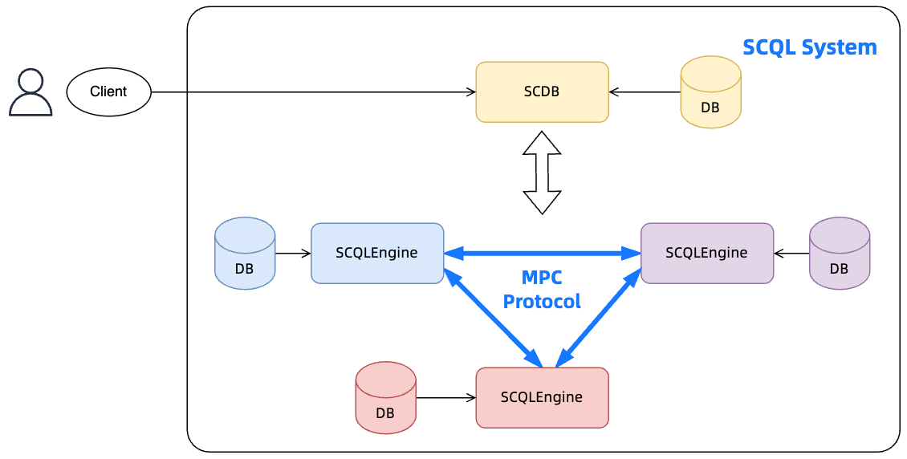

:target{#how-to-integrate-scql-system}

# 如何集成 SCQL 系统

:target{#overview}

## 概述

如图所示，SCQL 系统需要与 <strong>客户端（Client）</strong> 配合工作：

- 客户端（Client）：为提交查询、获取结果而设计的用户接口。

因此，平台应该提供客户端（Client）来集成 SCQL 系统。

具体来说，客户端（Client）通过查询 API 与 SCDB 互动。

:target{#query-api}

## 查询 API

对于 SQL 查询，SCDB 支持服务如下：

- Submit：异步 API，用于提交 SQL 查询并返回，服务器监听 `${SCDBHost}/public/submit_query`
- Fetch：异步 API，尝试获取 SQL 查询的结果，服务器监听 `${SCDBHost}/public/fetch_result`
- SubmitAndGet：同步 API，提交查询并等待获取查询结果，服务器监听 `${SCDBHost}/public/submit_and_get`

请参考 [SCQL API](../../reference/http-api.mdx) 了解详情。

<Container type="note">
  - 客户端（Client）可以根据业务场景选择支持异步或同步 API：
    > 如果 SQL 查询任务可能需要太多时间，建议使用异步 API，否则为了简单起见使用同步 API。
</Container>

简单来说，自定义客户端（Custom Client）应该为用户的 SQL 构建 HTTP 请求，提交到 SCDB 并解析 SCDB 的响应。
