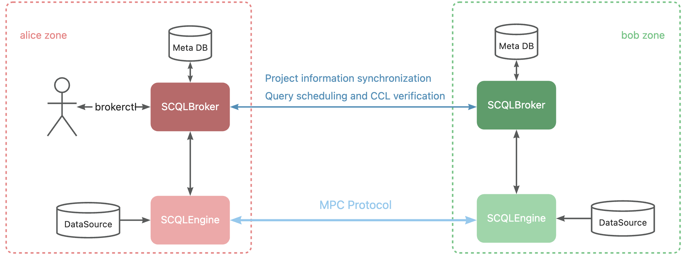

:target{#p2p-deployment}

# P2P 模式部署

本文档介绍了如何使用 docker 以 P2P 模式部署 SCQL 系统，并使用 brokerctl 进行查询。它与 [快速开始](../../intro/p2p-tutorial.mdx) 基本相同，但部署在多机上。

在开始阅读这篇文档前，我们假设读者已经具备一定的 docker-compose 使用经验。如果您对 Docker Compose 不熟悉，请参阅 [Docker Compose 官方概述](https://docs.docker.com/compose/)，或者查看 [入门指南](https://docs.docker.com/compose/gettingstarted/)。

:target{#deployment-diagram}

## 部署图

SCQL 系统的部署图如下图所示，它涉及到两个参与方：`Alice` 和 `Bob` ，我们使用两台机器来模拟不同的参与方。



<Container type="note">
  1. SCQLBrokers 使用 HTTP 协议提供服务。在生产环境建议使用 HTTPS。
</Container>

:target{#step-1-deployment-for-alice}

## 步骤一：部署 Alice 环境

在这里，我们展示如何为参与方 Alice 部署环境。

:target{#create-a-workspace}

### 1.1 创建工作区

```bash
mkdir scql-p2p
cd scql-p2p
```

:target{#prepare-meta-data-and-source-data}

### 1.2 准备状态数据、源数据

为了简化，我们使用同一个 mysql 容器来存储 SCQLBroker 的元数据和 SCQLEngine 的源数据。当然，您也可以使用您喜欢的其他数据库服务或分开存储两种类型的数据。

源数据存储在名为 `alice_init.sql` 的文件中，其内容可参考 [alice\_init.sql](https://github.com/secretflow/scql/tree/main/examples/p2p-tutorial/mysql/initdb/alice_init.sql)。对于 Bob ，请使用 [bob\_init.sql](https://github.com/secretflow/scql/tree/main/examples/p2p-tutorial/mysql/initdb/bob_init.sql) 代替。

元数据则存储在 `broker_init_alice.sql` 中，内容可参考 [broker\_init\_alice.sql](https://github.com/secretflow/scql/tree/main/examples/p2p-tutorial/mysql/initdb/broker_init_alice.sql)。对于 Bob ，请使用 [broker\_init\_bob.sql](https://github.com/secretflow/scql/tree/main/examples/p2p-tutorial/initdb/broker_init_bob.sql) 代替。

这些文件也可以通过命令行工具curl、wget或其他类似工具获取。

```bash
# For Bob, please use command: wget raw.githubusercontent.com/secretflow/scql/main/examples/p2p-tutorial/mysql/initdb/bob_init.sql
wget raw.githubusercontent.com/secretflow/scql/main/examples/p2p-tutorial/mysql/initdb/alice_init.sql
# For Bob, please use command: wget raw.githubusercontent.com/secretflow/scql/main/examples/p2p-tutorial/mysql/initdb/broker_init_bob.sql
wget raw.githubusercontent.com/secretflow/scql/main/examples/p2p-tutorial/mysql/initdb/broker_init_alice.sql
```

:target{#set-scqlbroker-config}

### 1.3 配置 SCQLBroker

在工作区中创建一个名为 `config.yml` 的文件，并粘贴如下代码：

```yaml
intra_server:
  host: 0.0.0.0
  port: 8080
inter_server:
  port: 8081
log_level: debug
party_code: alice
session_expire_time: 24h
session_expire_check_time: 1m
party_info_file: "/home/admin/configs/party_info.json"
private_pem_path: "/home/admin/configs/ed25519key.pem"
intra_host: broker:8080
engine:
  timeout: 120s
  protocol: http
  content_type: application/json
  uris:
    - for_peer: __ENGINE_URL__
      for_self: engine:8003
storage:
  type: mysql
  conn_str: "root:__MYSQL_ROOT_PASSWORD__@tcp(mysql:3306)/brokeralice?charset=utf8mb4&parseTime=True&loc=Local&interpolateParams=true"
  max_idle_conns: 10
  max_open_conns: 100
  conn_max_idle_time: 2m
  conn_max_lifetime: 5m
```

<Container type="note" id="replace-p2p-password">
  对于 Bob，<strong>party\_code</strong> 应该是 `bob`，而 <strong>conn\_str</strong> 中的 `brokeralice` 应该替换为 `brokerbob`。

  将 `__ENGINE_URL__` 替换为 <strong>机器的对外 host/ip + 引擎对外端口</strong>，如： [http://30.30.30.30:8003](http://30.30.30.30:8003)

  `__MYSQL_ROOT_PASSWORD__` 应替换为对应参与方选择的密码，后续文件请以同样的方式替换此占位符。
</Container>

请参阅：[SCQLBroker 配置选项](../../reference/p2p-deploy-config.mdx#config-broker-server-options) 了解更多信息。

:target{#set-scqlengine-config}

### 1.4 配置 SCQLEngine

在工作区中创建一个名为 `gflags.conf` 的文件，并粘贴如下代码：

```bash
--listen_port=8003
--datasource_router=embed
--enable_driver_authorization=false
--server_enable_ssl=false
--driver_enable_ssl_as_client=false
--peer_engine_enable_ssl_as_client=false
--embed_router_conf={"datasources":[{"id":"ds001","name":"mysql db","kind":"MYSQL","connection_str":"db=alice;user=root;password=__MYSQL_ROOT_PASSWORD__;host=mysql;auto-reconnect=true"}],"rules":[{"db":"*","table":"*","datasource_id":"ds001"}]}
# party authentication flags
--enable_self_auth=false
--enable_peer_auth=false
```

<Container type="note">
  `embed_router_conf` 中指定的 `connection_str` 用于连接名为 <strong>alice</strong> 的数据库，如 [1.2 准备元数据和源数据](#prepare-meta-data-and-source-data) 中设置的那样，对于 Bob，应设置为连接名为 <strong>bob</strong> 的数据库。

  请勿忘记将 `__MYSQL_ROOT_PASSWORD__` 替换为与 [<span>前面</span>](#replace-p2p-password) 相同的密码
</Container>

请参阅 [引擎配置选项](../../reference/p2p-deploy-config.mdx#engine-config-options) 了解更多配置信息

:target{#create-docker-compose-file}

### 1.5 创建 docker-compose 文件

在您的工作区中创建一个名为 `docker-compose.yaml` 的文件，并粘贴以下代码：

```yaml
version: '3.8'
services:
  broker:
    image: secretflow/scql:latest
    command:
      - /home/admin/bin/broker
      - -config=/home/admin/configs/config.yml
    restart: always
    ports:
      - __INTRA_PORT__:8080
      - __INTER_PORT__:8081
    volumes:
      - ./config.yml:/home/admin/configs/config.yml
      - ./party_info.json:/home/admin/configs/party_info.json
      - ./ed25519key.pem:/home/admin/configs/ed25519key.pem
  engine:
    cap_add:
      - NET_ADMIN
    command:
      - /home/admin/bin/scqlengine
      - --flagfile=/home/admin/engine/conf/gflags.conf
    image: secretflow/scql:latest
    ports:
      - __ENGINE_PORT__:8003
    volumes:
      - ./gflags.conf:/home/admin/engine/conf/gflags.conf
  mysql:
    image: mysql:latest
    environment:
      - MYSQL_ROOT_PASSWORD=__MYSQL_ROOT_PASSWORD__
      - TZ=Asia/Shanghai
    healthcheck:
      retries: 10
      test:
        - CMD
        - mysqladmin
        - ping
        - -h
        - mysql
      timeout: 20s
    expose:
      - "3306"
    restart: always
    volumes:
      - ./alice_init.sql:/docker-entrypoint-initdb.d/alice_init.sql
      - ./broker_init_alice.sql:/docker-entrypoint-initdb.d/broker_init_alice.sql
```

<Container type="note">
  `__INTRA_PORT__`, `__INTER_PORT__` 和 `__ENGINE_PORT__` 作为监听端口，您需要替换为可访问的端口，尤其注意 `__ENGINE_PORT__` 需要和 [<span>\_\_ENGINE\_URL\_\_</span>](#replace-p2p-password) 中的端口保持一致，这里我们指定为 `8080`, `8081` 和 `8003`

  请勿忘记将 `__MYSQL_ROOT_PASSWORD__` 替换为与 [<span>前面</span>](#replace-p2p-password) 相同的密码

  <em>mysql</em> 容器通过 `alice_init.sql` 和 `broker_init_alice.sql` 完成数据初始化，如 [1.2 准备元数据和源数据](#prepare-meta-data-and-source-data) 中设置。 对于 Bob，请使用 `bob_init.sql` 和 `broker_init_bob.sql`。

  如果您使用自己的数据库服务，则 <em>mysql</em> 容器可以删除，修改 SCQLBroker 和 SCQLEngine 配置中的 conn\_str ，指定可用的数据库连接信息即可
</Container>

:target{#prepare-party-auth-files}

### 1.6 准备身份验证文件

参与方身份通过私钥-公钥对进行识别，因此我们需要生成这些文件。

在您的工作区中创建一个名为 `party_info.json` 的文件，并粘贴以下代码：

```json
{
  "participants": [
    {
      "party_code": "alice",
      "endpoint": "__ALICE_BROKER_URL__",
      "pubkey": "__ALICE_PUBLIC_KEY__"
    },
    {
      "party_code": "bob",
      "endpoint": "__BOB_BROKER_URL__",
      "pubkey": "__BOB_PUBLIC_KEY__"
    }
  ]
}
```

<Container type="note">
  将 `__ALICE_BROKER_URL__` 替换为 `Alice 机器的对外 host/ip + __INTER_PORT__`，如：[http://30.30.30.30:8081](http://30.30.30.30:8081)，对 `__BOB_BROKER_URL__` 执行相同操作。
</Container>

创建其他文件

```bash
# generate private key
openssl genpkey -algorithm ed25519 -out ed25519key.pem
# get public key corresponding to the private key, the output can be used to replace the __ALICE_PUBLIC_KEY__ in party_info.json
# for engine Bob,  the output can be used to replace the __BOB_PUBLIC_KEY__ in party_info.json
openssl pkey -in ed25519key.pem  -pubout -outform DER | base64
```

然后您需要将 party\_info.json 中的 `__XXX_PUBLIC_KEY__` 占位符替换为相应的真实公钥。

:target{#start-services}

### 1.6 启动服务

您的工作区文件应如下所示：

```bash
└── scql-p2p
  ├── alice_init.sql
  ├── broker_init_alice.sql
  ├── config.yml
  ├── docker-compose.yaml
  ├── ed25519key.pem
  ├── gflags.conf
  └── party_info.json
```

然后您可以运行 docker compose up 来启动引擎服务

```bash
# If you install docker with Compose V1, pleas use `docker-compose` instead of `docker compose`
$ docker compose -f docker-compose.yaml up -d

Network scql-p2p_default     Created
Container scql-p2p-engine-1  Started
Container scql-p2p-broker-1  Started
Container scql-p2p-mysql-1   Started
```

您可以使用 docker logs 检查引擎是否正常工作

```bash
$ docker logs -f scql-p2p-engine-1

[info] [main.cc:main:297] Started engine rpc server success, listen on: 0.0.0.0:8003

$ docker logs -f scql-p2p-broker-1

INFO main.go:157 Starting to serve request on :8081 with http...
INFO main.go:157 Starting to serve request on :8080 with http...
```

:target{#step-2-deployment-for-bob}

## 步骤二：部署 Bob 环境

与 [步骤一：部署 Alice 环境](#step-1-deployment-for-alice) 基本相同，但与 `alice` 相关的一些字符和文件需要替换为 `bob` 。

:target{#step-3-scql-test}

## 步骤三：测试 SCQL

这里我们使用 brokerctl 向 SCQLBroker 提交查询进行测试，您也可以通过发送 POST 请求直接向 SCQLBroker 提交查询。

:target{#build-brokerctl}

### 3.1 构建 brokerctl

```bash
# Grab a copy of scql:
git clone git@github.com:secretflow/scql.git
cd scql

# build scdbclient from source
# requirements:
#   go version >= 1.19
go build -o brokerctl cmd/brokerctl/main.go

# try brokerctl
./brokerctl --help
```

:target{#submit-query}

### 3.2 提交查询

您可以开始使用 brokerctl 向 SCQLBroker 提交请求并获取结果。这与您在 [快速开始](../../intro/p2p-tutorial.mdx) 中可以执行的操作类似。

```bash
# create project demo in alice
./brokerctl create project --project-id "demo" --host __ALICE_INTRA_URL__
# check project's information
./brokerctl get project --host __ALICE_INTRA_URL__
[fetch]
+-----------+---------+---------+----------------------------------+
| ProjectId | Creator | Members |               Conf               |
+-----------+---------+---------+----------------------------------+
| demo      | alice   | [alice] | {                                |
|           |         |         |   "protocol":  "SEMI2K",         |
|           |         |         |   "field":  "FM64"               |
|           |         |         | }                                |
+-----------+---------+---------+----------------------------------+
...
```

<Container type="note">
  您需要将 `__ALICE_INTRA_URL__` 或 `__BOB_INTRA_URL__` 替换为实际的 IntraServer 地址，例如：[http://30.30.30.30:8080](http://30.30.30.30:8080)。
</Container>
