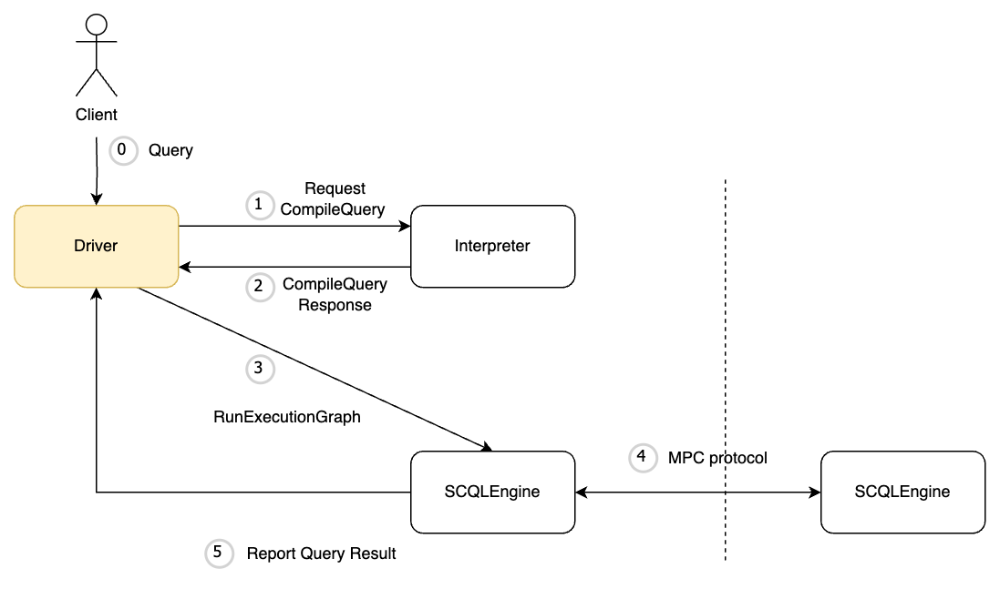

:target{#deployment-architecture-p2p-vs-centralized}

# 部署架构：P2P vs 中心化

SCQL 系统同时支持 P2P 和中心化部署架构。它们看起来不同，但共享相同的 SCQL 统一架构。

- 图中的 `Driver` 组件可以是 P2P 部署架构中的 `Broker` ，也可以是中心化部署架构中的 `SCDB` 。
- `Interpreter` 组件负责将 DQL 查询翻译成明密文混合执行图，它是 SCQL 的核心组件。通常作为 lib 嵌入到 `Driver` 中

:target{#which-one-to-choose-p2p-or-centralized}

## 如何选择部署模式，P2P 还是中心化？

这取决于实际的业务场景。如果没有可信第三方可以依赖，则使用 P2P 部署架构。如果有可信第三方，则可以选择中心化部署架构。

P2P 和中心化部署架构支持相同的 DQL 语法和 MPC 协议，端到端性能也基本相同。
