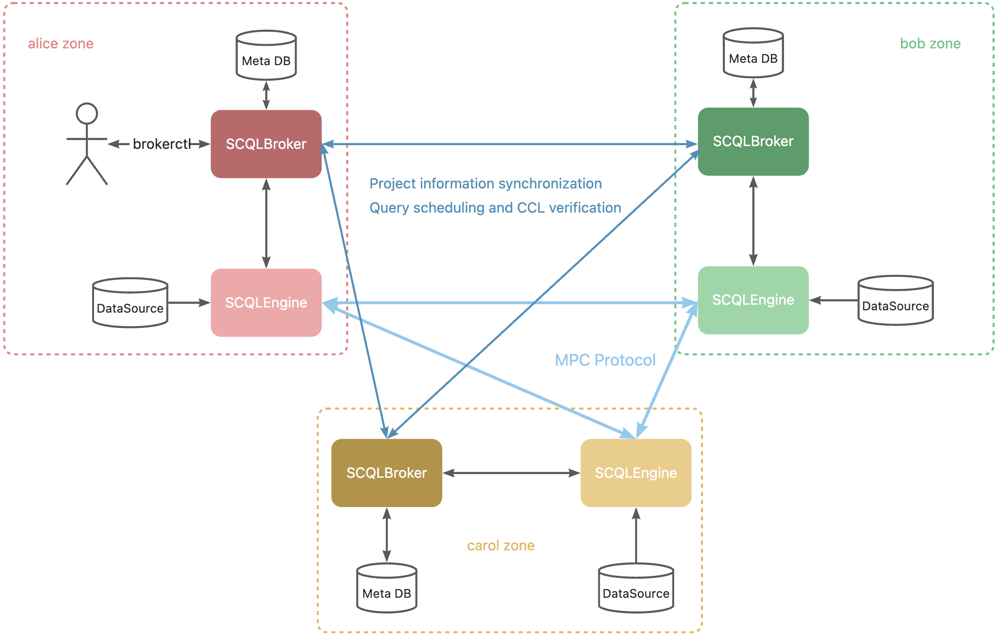

:target{#scql-p2p-overview}

# SCQL P2P 模式概述

SCQL 支持 P2P 模式部署。在这种模式下，各方均拥有对等权限，不需要依赖可信的第三方。

:target{#architecture}

## 架构

P2P 模式下的 SCQL 系统由 `SCQLBrokers` 和 `SCQLEngines` 组成，各方都有自己独立的 SCQLBroker 和 SCQLEngines

- `SCQLBroker`：作为 P2P 的核心模块，主要包含三个功能：
  - <strong>用户交互</strong>：通过 http 接口接受请求并返回结果。
  - <strong>P2P 状态同步</strong>：完成不同 SCQLBroker 之间的状态同步。
  - <strong>SQL 分析及作业调度</strong>：将 SQL 查询转换为明密文混合的执行图，并调度到本地 SCQLEngine 执行。
- `SCQLEngine`：SCQLEngine 是一个明密文混合执行引擎，不同参与方的 SCQLEngine 可以协作完成执行图计算，本地的 SCQLEngine 会将结果报告给 SCQLBroker 。SCQLEngine 是在最先进的 MPC 框架 [secretflow/spu](https://github.com/secretflow/spu) 的基础上实现的。

:target{#workflow-of-p2p-model}

## P2P 模式的工作流

在 P2P 模式中，不同的参与方通过 `Unique Identifiers` 来标识，不同业务则通过 `Projects` 进行隔离。

- `Unique Identifier`: 包括唯一的 partyCode 和公私钥对，私钥应由参与方自行保密，公钥则对所有参与方公开。
- `Project`: 项目，类似于中心化模式中的虚拟数据库概念，用于隔离不同的业务。

整个流程可以分为五步：<strong>创建项目</strong>、<strong>邀请参与方</strong>、<strong>创建数据表</strong>、<strong>配置 CCL</strong> 和 <strong>执行查询</strong>。

1. <strong>创建项目</strong>：一方可以创建项目并成为项目所有者。所有者只额外拥有邀请其他成员加入的权限。
2. <strong>邀请参与方</strong>：项目所有方邀请其他方后，其他方可以选择是否接受邀请。 如果接受，则可以加入项目，成为项目成员。
3. <strong>创建数据表</strong>：项目成员可以创建自己的数据表元数据，以便在项目中进行联合分析。
4. <strong>配置 CCL</strong>：成员创建自己的表后，可以将特定的 CCL 权限授予自己及其他参与方。
5. <strong>执行查询</strong>：完成 CCL 配置后，各方可以执行相应的 SQL 分析作业。

建议您通过 [快速开始](../../intro/p2p-tutorial.mdx) 来进一步体验整个流程

:target{#p2p-vs-centralized}

## P2P 与中心化

两种模式支持相同的 SQL 语法和 MPC 协议，端到端性能也基本相同。

如果业务场景中有可信方部署 SCDB ，则建议使用中心化模式，配置和集成都更简单。P2P 模式不依赖可信方，但需要更复杂的交互来完成状态同步。
