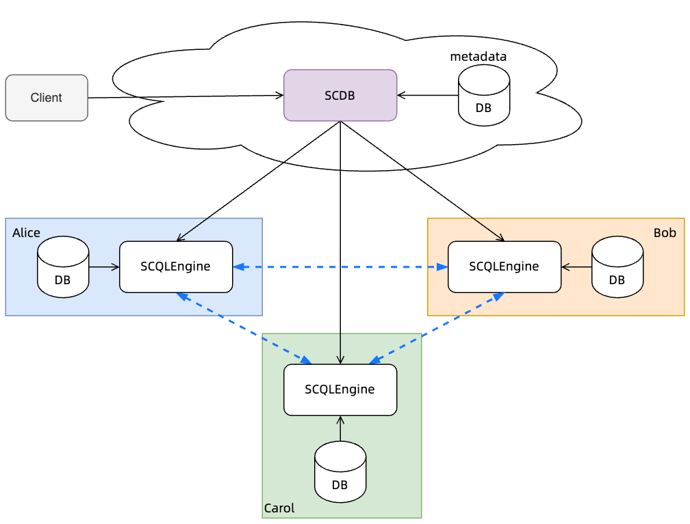

:target{#scql-system-overview}

# SCQL 系统概述

安全协作查询语言（Secure Collaborative Query Language, SCQL）是一个允许多个互不信任参与方在不泄露各自隐私数据的条件下进行联合数据分析的系统。

:target{#key-features}

## 关键特点

- 半诚实安全。SCQL 假设所有参与方都是半诚实的。
- 支持多方（N>=2）。
- 支持常见的 SQL select 语法和函数，满足大多数场景的需求。详情请查看 [SCQL 实现进度](../../reference/implementation-status.mdx)。
- 可实用的性能。SCQL 有多层次的性能优化。
- 易于使用。SCQL提供了类似于关系 SQL 的界面。
- 数据使用授权。SCQL 为数据所有者提供了一个名为 CCL（Column Control List, 列控制列表）的机制，以定义他们的数据使用限制。

:target{#architecture}

## 架构

SCQL 系统支持中心化和 P2P 两种部署模式。中心化模式依赖于可信第三方，但部署和配置过程更简单；P2P 则不需要依赖额外的可信第三方。

后续介绍将以中心化部署模式进行，更多 P2P 模式的相关信息，请参考 [SCQL P2P 模式概述](intro-p2p.mdx)

中心化模式下的 SCQL 系统由一个 SCDB 服务器和多个 SCQLEngines 组成。

- SCDB 服务器负责将 SQL 查询翻译成明密文混合执行图，并将执行图下发给参与方的 SCQLEngine。
- SCQLEngine 是一个明密文混合执行引擎，它与参与方协作运行执行图并将查询结果报告给 SCDB 服务器。SCQLEngine 是在最先进的 MPC 框架 [secretflow/spu](https://github.com/secretflow/spu) 的基础上实现的。

:target{#how-scql-works}

## SCQL 如何工作

我们将通过以下的 SCQL 查询样本 Q 的整个生命周期来展示 SCQL 是如何工作的。

<figure id="id1">
  <figcaption>
    SCQL 查询 Q
  </figcaption>

  ```SQL
  SELECT AVG(bank_1.deposit), AVG(bank_2.loan)
  FROM bank_1
  INNER JOIN bank_2
  ON bank_1.customer_id = bank_2.customer_id;
  ```
</figure>

:target{#table-schema}

### 表的结构

让我们来看看上面查询 Q 中涉及的表的结构。


- <DefinitionList>
    <dl>
      <dt>
        <DefinitionList.Term><span>`bank_1`</span></DefinitionList.Term>
      </dt>

      <dd>
        参与方 Bank1 在其本地数据库 `DB1` 中有张表 `bank_1`，该数据表有两列分别是 `customer_id` 和 `deposit`。
      </dd>
    </dl>
  </DefinitionList>
- <DefinitionList>
    <dl>
      <dt>
        <DefinitionList.Term><span>`bank_2`</span></DefinitionList.Term>
      </dt>

      <dd>
        参与方 Bank2 在其本地数据库 `DB2` 中有张表 `bank_2`，该数据表有两列分别是 `customer_id` 和 `loan`。
      </dd>
    </dl>
  </DefinitionList>

:target{#column-control-list-ccl}

### 列控制列表（CCL）

CCL 格式: `<src_column, dest_party, constraint>`

它表示 `src_column` 可以被 `dest_party` 在满足 `constraint` 的条件下访问。

为了使查询 Q 通过 CCL 验证，数据所有者应该授予以下 CCL。

- <DefinitionList>
    <dl>
      <dt>
        <DefinitionList.Term><span>Bank1</span></DefinitionList.Term>
      </dt>

      <dd>
        - `<bank_1.customer_id, Bank1, PLAINTEXT>`
        - `<bank_1.deposit, Bank1, PLAINTEXT>`
        - `<bank_1.customer_id, Bank2, PLAINTEXT_AFTER_JOIN>`
        - `<bank_1.deposit, Bank2, PLAINTEXT_AFTER_AGGREGATE>`
      </dd>
    </dl>
  </DefinitionList>
- <DefinitionList>
    <dl>
      <dt>
        <DefinitionList.Term><span>Bank2</span></DefinitionList.Term>
      </dt>

      <dd>
        - `<bank_2.customer_id, Bank2, PLAINTEXT>`
        - `<bank_2.loan, Bank2, PLAINTEXT>`
        - `<bank_2.customer_id, Bank1, PLAINTEXT_AFTER_JOIN>`
        - `<bank_2.loan, Bank1, PLAINTEXT_AFTER_AGGREGATE>`
      </dd>
    </dl>
  </DefinitionList>

<Container type="note">
  要了解更多关于 CCL 的信息，请阅读文档 [<span>SCQL CCL</span>](../ccl/intro.mdx)。
</Container>

:target{#lifetime-of-scql-query}

### SCQL 查询的生命周期

:target{#step1-initialize-a-session}

#### 步骤1. 初始化会话

SCDB 为传入的查询创建一个新的会话，然后验证查询发出者的身份。如果认证失败，它将拒绝该请求。

:target{#step2-parse-and-plan-q}

#### 步骤2. 解析和规划 Q

Parser 将 Q 解析为 AST（抽象语法树），然后 Planner 将其转换为逻辑计划。

:target{#step3-translate}

#### 步骤3. 翻译

步骤3.1 建立和检查 CCL

Translator 需要从 CCL 管理器检索 CCL，它将根据逻辑计划构建 CCL，并验证根节点的 CCL，以确保 Q 在数据所有者的约束下是合法的。

步骤3.2 翻译

翻译器将逻辑计划和 CCL 作为输入，并生成查询 Q 的执行图，如下所示。

:target{#step4-optimize-and-split-graph}

#### 步骤4. 图优化和拆分

图优化器将对执行图进行优化，如节点融合和重复节点的消除。优化后的执行图仍然是一张整图，图拆分器会根据节点的参与方信息将整图拆分为子图。

:target{#step5-execute}

#### 步骤5. 执行

SCDB 将子图发送到相应的 SCQLEngine 节点，SCQLEngine 与参与方协助运行执行图，并将 Q 的最终结果报告给 SCDB。
