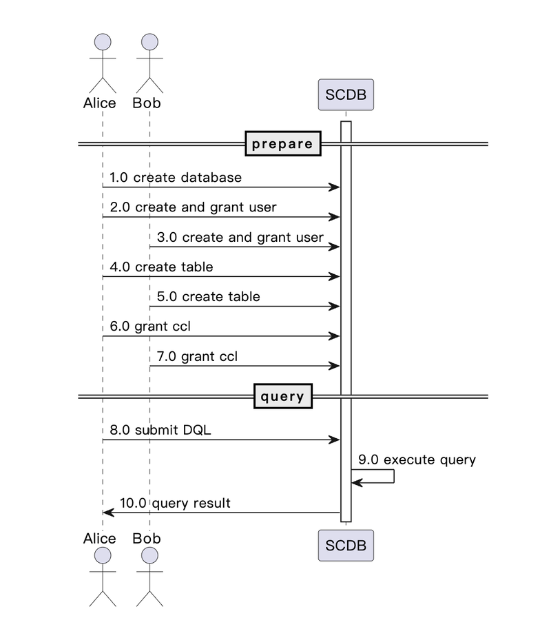

:target{#how-to-use-scql}

# SCQL 使用流程

The flowchart shows how to use SCQL system, which contains two stages: prepare and query. In the prepare stage, the system is set up, and the necessary tables are created and initialized. In the query stage, queries are submitted, processed, and results are returned.

<Container type="note">
  All requests from user to SCDB can be submitted through [synchronous api](../../reference/http-api.mdx#sync-api) or [asynchronous api](../../reference/http-api.mdx#async-api).
</Container>

:target{#workflow}

## Workflow

:target{#participants}

## Participants

- Alice: the user in party alice
- Bob: the user in party bob
- SCDB: the SCDB server

<Container type="note">
  Before the start of the project, Alice and Bob need to obtain the root user’s username and password from the admin.
</Container>

:target{#prepare-stage}

## Prepare stage

<DefinitionList>
  <dl>
    <dt>
      <DefinitionList.Term>1.0 create database</DefinitionList.Term>
    </dt>

    <dd>
      Alice or Bob creates a new database using the root user account through [CREATE DATABASE Statement](../../reference/lang/manual.mdx#create-database-stm), which can be considered a new project, SCQL supports running multiple projects simultaneously.
    </dd>

    <dt>
      <DefinitionList.Term>2.0 create and grant user</DefinitionList.Term>
    </dt>

    <dd>
      Alice creates user account “Alice” in SCDB using the root user account by [CREATE USER Statement](../../reference/lang/manual.mdx#create-user-stm), and grants access to the relevant database by [GRANT Statement](../../reference/lang/manual.mdx#scql-grant-revoke)
    </dd>

    <dt>
      <DefinitionList.Term>3.0 create and grant user</DefinitionList.Term>
    </dt>

    <dd>
      Bob creates user account “Bob” in SCDB using the root user account by [CREATE USER Statement](../../reference/lang/manual.mdx#create-user-stm), and grants access to the relevant database by [GRANT Statement](../../reference/lang/manual.mdx#scql-grant-revoke)
    </dd>

    <dt>
      <DefinitionList.Term>4.0 create table</DefinitionList.Term>
    </dt>

    <dd>
      Alice creates table in SCDB using the account “Alice” by [CREATE TABLE Statement](../../reference/lang/manual.mdx#create-table).
    </dd>

    <dt>
      <DefinitionList.Term>5.0 create table</DefinitionList.Term>
    </dt>

    <dd>
      Bob creates table in SCDB using the account “Bob” by [CREATE TABLE Statement](../../reference/lang/manual.mdx#create-table).
    </dd>

    <dt>
      <DefinitionList.Term>6.0 grant CCL</DefinitionList.Term>
    </dt>

    <dd>
      Alice grants CCL about the table created by Alice for Alice and Bob in SCDB using the account “Alice”, see [SCQL CCL](../ccl/intro.mdx) for more information.
    </dd>

    <dt>
      <DefinitionList.Term>7.0 grant CCL</DefinitionList.Term>
    </dt>

    <dd>
      Bob grants CCL about the table created by Bob for Alice and Bob in SCDB using the account “Bob”, see [SCQL CCL](../ccl/intro.mdx) for more information.
    </dd>
  </dl>
</DefinitionList>

:target{#execute-stage}

## Execute stage

<DefinitionList>
  <dl>
    <dt>
      <DefinitionList.Term>8.0 submit a DQL</DefinitionList.Term>
    </dt>

    <dd>
      Alice submits a DQL to SCDB through [public/submit\_query](../../reference/http-api.mdx#submit-query) or [public/submit\_and\_get](../../reference/http-api.mdx#submit-and-get) using the account “Alice”.
    </dd>

    <dt>
      <DefinitionList.Term>9.0 process query</DefinitionList.Term>
    </dt>

    <dd>
      SCDB will check ccl and execute query with engines.
    </dd>

    <dt>
      <DefinitionList.Term>10.0 return result</DefinitionList.Term>
    </dt>

    <dd>
      SCDB return the query result to Alice.
    </dd>
  </dl>
</DefinitionList>
