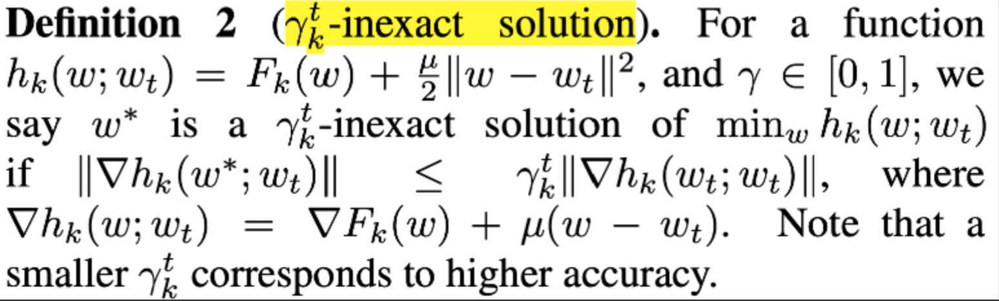
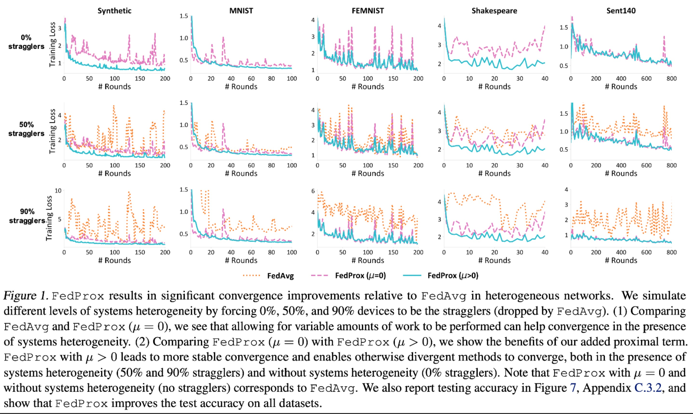

:target{#strategy-fedprox}

# Strategy: FedProx

:target{#fedavg-v-s-fedprox}

## FedAvg v.s FedProx

<table>
  <thead>
    <tr>
      <td>
        Heterogeneity
      </td>

      <td>
        FedAvg
      </td>

      <td>
        FedProx
      </td>
    </tr>
  </thead>

  <tbody>
    <tr>
      <td>
        data heterogeneity
      </td>

      <td>
        FedAvg does not guarantee fit for non-iid data
      </td>

      <td>
        FedProx can guarantee the fitting rate for non-iid data: by changing the objective function of the overall optimization, based on an assumption of distribution difference, a convergence proof is obtained
      </td>
    </tr>

    <tr>
      <td>
        device heterogeneity
      </td>

      <td>
        FedAvg does not take into account the heterogeneity of different devices, such as differences in computing power; for each device, the same workload is scheduled
      </td>

      <td>
        FedProx supports local training for each device with different workloads: adjust the accuracy requirements for local training per device by setting a different “γ-inexact” parameter for each device in each round
      </td>
    </tr>
  </tbody>
</table>

:target{#fit}

## Fit

Add Proximal Term to the objective function

<Math>
  $$

  \mathop{max}\limits_{w} h_k(w;w^t)=F_k(w)+\frac{\mu}{2}||w-w^t||^2

  $$
</Math>

<InlineMath>$F_k(w)$</InlineMath>: For a set of parameters w, the loss obtained by training k local data on device k

<InlineMath>$w^t$</InlineMath>: The initial model parameters sent by the server to device k in the t-th round of training

<InlineMath>$\mu$</InlineMath>: a hyperparameter

<InlineMath>$\mu/2||w - w^t||^2$</InlineMath>: proximal term, which limits the difference between the optimized w and the <InlineMath>$w^t$</InlineMath> released in the t round, so that the updated w of each device k is equal to Do not differ too much between them to help fit

:target{#different-training-requirements-for-each-device-inexact}

## Different training requirements for each device: γ-inexact

FedAvg requires that each device is fully optimized for E epochs during training locally;
Due to equipment heterogeneity, FedProx hopes to put forward different optimization requirements for each equipment k in each round t, and does not require all equipment to be completely optimized;

<InlineMath>$\mu_k^t \in [0,1]$</InlineMath>, the higher the value, the looser the constraints, that is, the lower the training completion requirements for equipment k; on the contrary, when <InlineMath>$\mu_k^t = 0$</InlineMath>, the parameters are required the training update is 0, requiring the local model to fully fit;

With the help of <InlineMath>$\mu_k^t$</InlineMath>, the training volume per round of each device can be adjusted according to the computing resources of the device;

:target{#requirements-for-parameter-selection-in-convergence-analysis}

## Requirements for parameter selection in Convergence analysis

When the selected parameters meet the following conditions, the expected value of the convergence rate of the model can be bound

:target{#parameter-conditions}

### Parameter conditions

<Math>
  $$

  \rho^t=(\frac{1}{\mu}-\frac{\gamma^tB}{\mu}-\frac{B(1+\gamma^t\sqrt(2))}{ \overline\mu\sqrt(K)}-\frac{LB(1+\gamma^t)}{\overline\mu\mu} - \frac{L(1+\gamma^t)^2B^2} {2\mu^2}-\frac{LB^2(1+\gamma^t)^2}{\mu^2K}(2\sqrt{2K}+2))

  $$
</Math>

There are three groups of parameters to set: K, <InlineMath>$\gamma$</InlineMath>, <InlineMath>$\mu$</InlineMath>;
Where K is the number of client devices selected in the t round, <InlineMath>$\gamma^t=max_k(\gamma_k^t)$</InlineMath>, <InlineMath>$\gamma$</InlineMath>, <InlineMath>$\mu$</InlineMath> is the hyperparameter for setting the proxy term. <strong>B is a value used to assume the upper limit of the current participation data distribution difference, not sure how to get it</strong>

:target{#fitting-rate}

### Fitting rate

Convergence can be proven if the parameters are set to meet the above requirements

:target{#sufficient-and-non-essential-conditions-for-parameter-selection}

### Sufficient and non-essential conditions for parameter selection

There is a tradeoff between <InlineMath>$\gamma$</InlineMath> and <InlineMath>$B$</InlineMath>. For example, the larger <InlineMath>$B$</InlineMath> is, the greater the difference in data distribution, the smaller the <InlineMath>$\gamma$</InlineMath> must be, and the higher the training requirements for each device;

:target{#experiment-1-effectiveness-of-proximal-term-and-inexactness}

## Experiment 1: Effectiveness of proximal term and inexactness

:target{#summarize}

## Summarize

The existence of <InlineMath>$\gamma$</InlineMath> and <InlineMath>$B$</InlineMath> is more theoretical, in practice, the workload of the device can be determined directly according to the device resources

:target{#implementation}

## Implementation

1. The proxy term for data non-iid has been implemented;
2. The inexactness for device heterogeneity needs to be realized;

:target{#reference}

## Reference

[Federated Optimization in Heterogeneous Networks](https://arxiv.org/pdf/1812.06127.pdf)
