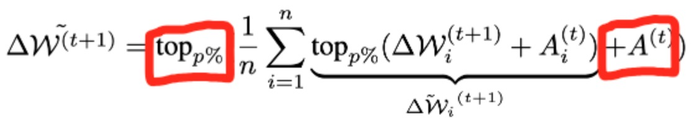
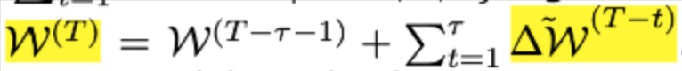
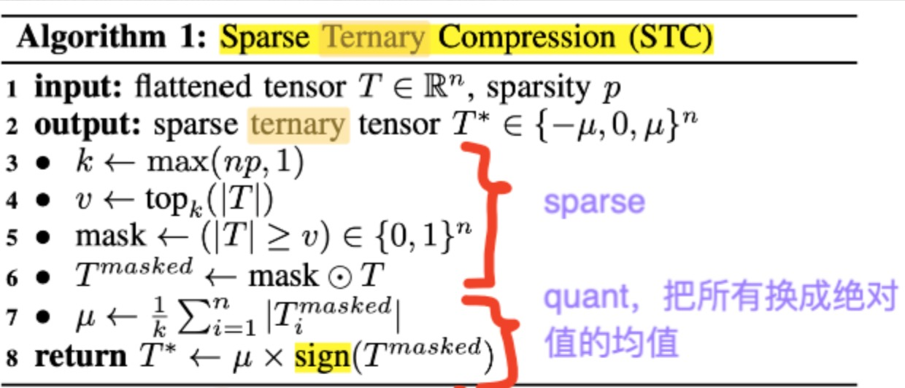
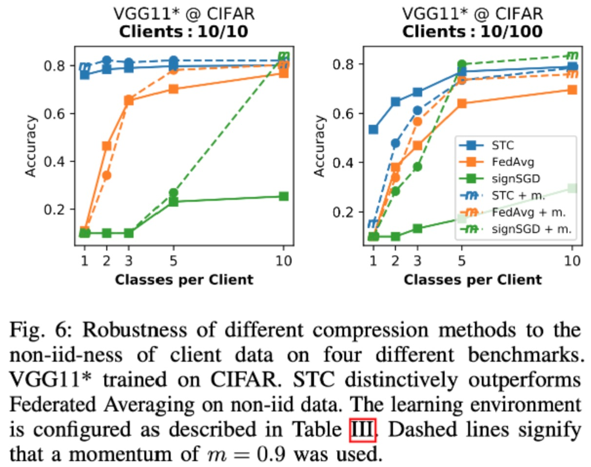
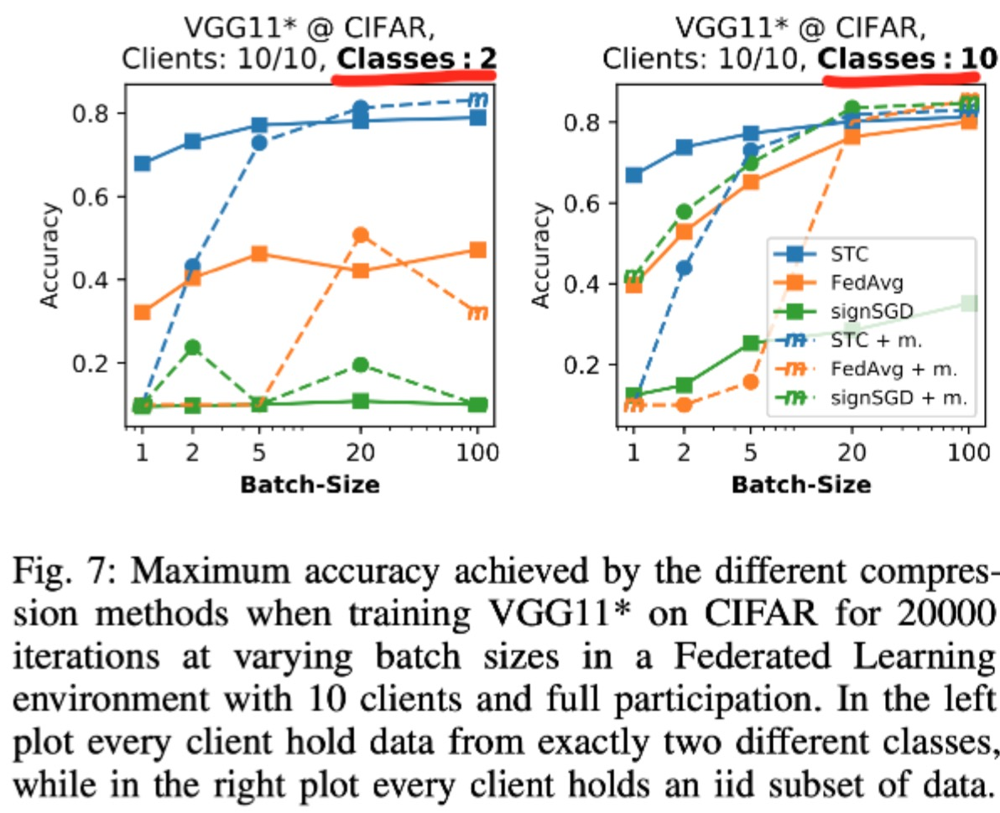
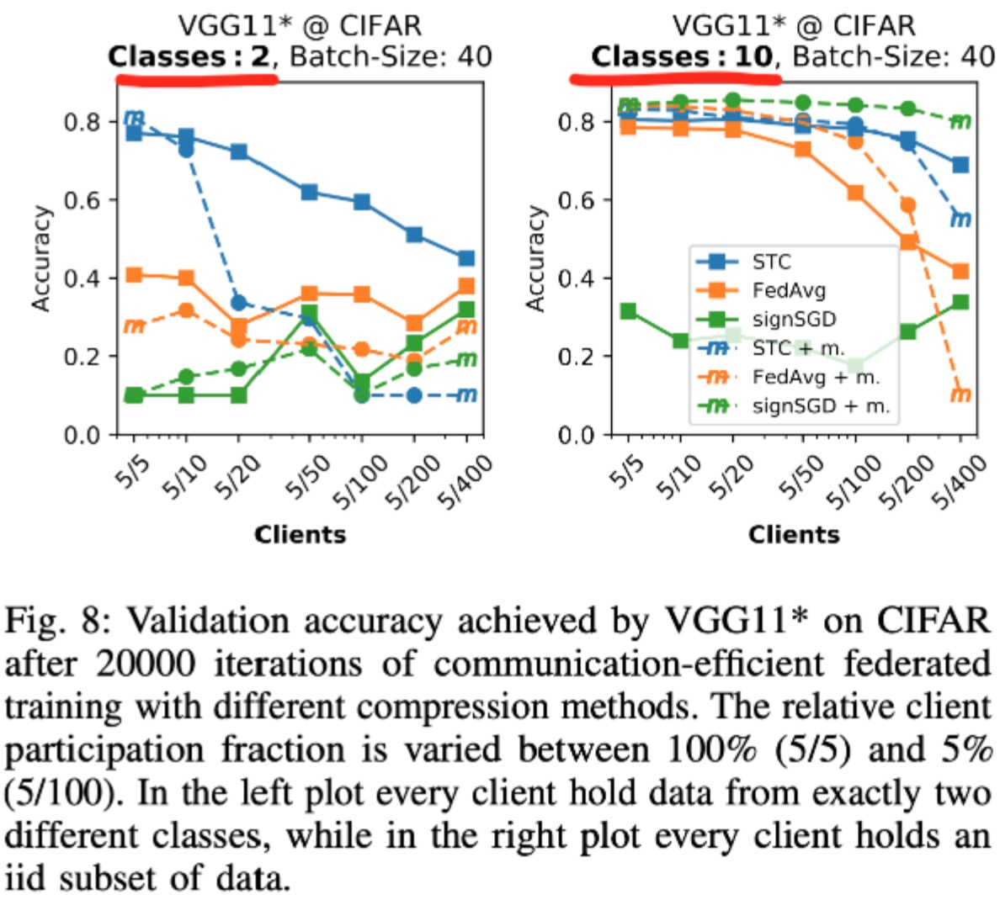
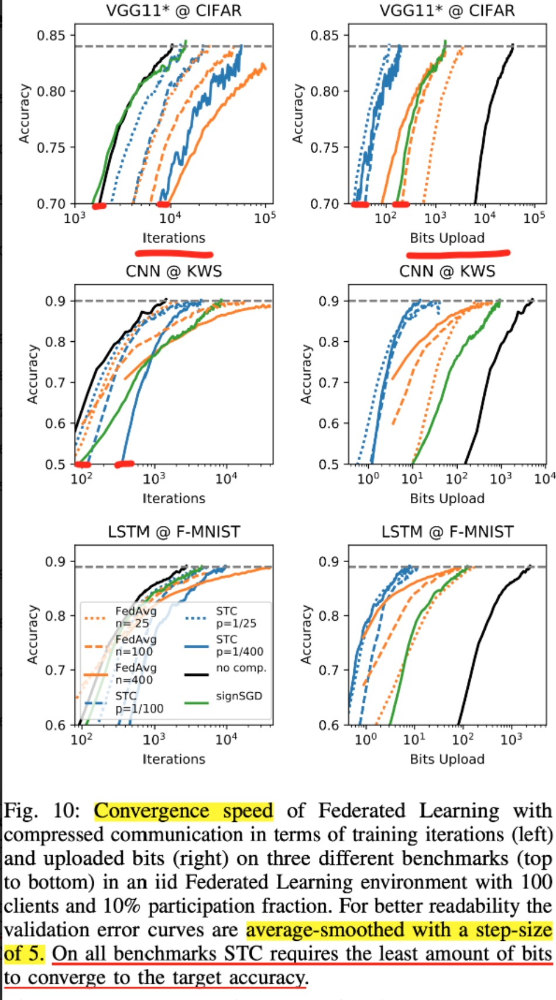

:target{#strategy-fedstc}

# Strategy: FedSTC

:target{#overview}

## Overview

<table>
  <thead>
    <tr>
      <td>

      </td>

      <td>
        Sparse method
      </td>

      <td>
        Quant method
      </td>

      <td>
        Residual
      </td>

      <td>
        Encoding
      </td>

      <td>
        Upstream
      </td>

      <td>
        Downstream
      </td>
    </tr>
  </thead>

  <tbody>
    <tr>
      <td>
        FedSTC
      </td>

      <td>
        topk
      </td>

      <td>
        binarization
      </td>

      <td>
        Yes
      </td>

      <td>
        Golomb
      </td>

      <td>
        Yes
      </td>

      <td>
        Yes
      </td>
    </tr>

    <tr>
      <td>

      </td>

      <td>
        Handle Non-IID
      </td>

      <td>
        Handle Dropping/Skipping
      </td>

      <td>

      </td>

      <td>
        Generality
      </td>

      <td>

      </td>

      <td>

      </td>
    </tr>

    <tr>
      <td>

      </td>

      <td>
        Fine //TODO
      </td>

      <td>
        Caching and synchronizing
      </td>

      <td>

      </td>

      <td>
        General
      </td>

      <td>

      </td>

      <td>

      </td>
    </tr>
  </tbody>
</table>

The main motivation of FedSTC is to compress the communication between client and server. The main contributions are as follows:

1. Compared with the previous sparse work on upstream (client 2 server), FedSTC also sparses on downstream (server 2 client);
2. When only some clients participate in each round, a Weight Update Caching mechanism is provided on the server side. Each client must synchronize the latest model before participating in the next round of training, or lag behind global weights. updates; (I understand such motivation is that if only part of the updates are updated, the content to be transmitted can be sparse);
3. Quantization is added while sparse. The quantization method is Binarization. Only 3 numbers will appear in the final matrix, <InlineMath>$\{-\mu,0,\mu\}$</InlineMath>;
4. Lossless Golomb Encoding is used on the sparse + quantized matrix;

:target{#design}

## Design

:target{#sparsity-topk}

### Sparsity（topk）

Only upstream sparse:

Add downstream：

A is the Residual status on the server side of the previous round;

:target{#caching}

### Caching

The server keeps the most recent historical updates:

The latest global weights can be expressed as:

When a client joins training again, it must update the corresponding <InlineMath>$P^{(s)}$</InlineMath> or <InlineMath>$W$</InlineMath>;

:target{#binarization-quant-ternary-tensor}

### Binarization (quant -> ternary tensor)

<Math>
  $$

  e' \in {-\mu,0,\mu}, \mu = mean(abs(e))

  $$
</Math>

Assuming that mu is the sum of the absolute values of all elements in the matrix after sparse, the non-zero elements in the matrix are binarized to <InlineMath>$\mu$</InlineMath> or <InlineMath>$-\mu$</InlineMath> according to the sign;

:target{#pseudo-code-on-compression}

### Pseudo Code on Compression

:target{#lossless-encoding}

### Lossless Encoding

Golomb Encoding

:target{#experiment}

## Experiment

Experiment on different models + datasets:

<table>
  <thead>
    <tr>
      <td>
        model
      </td>

      <td>
        dataset
      </td>
    </tr>
  </thead>

  <tbody>
    <tr>
      <td>
        VGG11
      </td>

      <td>
        CIFAR
      </td>
    </tr>

    <tr>
      <td>
        CNN
      </td>

      <td>
        KWS
      </td>
    </tr>

    <tr>
      <td>
        LSTM
      </td>

      <td>
        Fashion-MNIST
      </td>
    </tr>

    <tr>
      <td>
        Logistic R
      </td>

      <td>
        MNIST
      </td>
    </tr>

    <tr>
      <td>
        FedAvg is one of the baselines. In order to compare the transmission cost horizontally with FedSTC, FedAvg uses a delay period. For example, for FedSTC with sparse rate = 1/400, the delay period is 400 iterations;
      </td>

      <td>

      </td>
    </tr>

    <tr>
      <td>
        <strong>Experimental conclusion: FedSTC is obviously better than FedAvg in the case of (a) non-iid, (b) small batch size, © large number of participating clients but low participation in each round</strong>
      </td>

      <td>

      </td>
    </tr>
  </tbody>
</table>

:target{#on-non-iidness}

### on Non-iidness

:target{#outperforms-fedavg}

#### outperforms FedAvg

:target{#on-batch-size}

#### on batch size

:target{#on-drop-rate}

#### on drop rate

:target{#on-data-amount-unbalanced}

#### on data amount unbalanced

:target{#on-convergence}

#### on convergence

:target{#implementation}

## Implementation

1. The sparse+binarization in upstream and downstream has been implemented;
2. Caching is not implemented;
3. golomb/ encoding is not implemented;

:target{#reference}

## Reference

[Robust and Communication-Efficient Federated Learning From Non-i.i.d. Data](https://ieeexplore.ieee.org/document/8889996)
