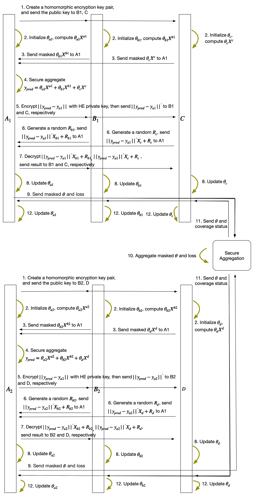

:target{#federated-logistic-regression-with-mix-partitioned-data}

# Federated Logistic Regression with Mix Partitioned data

:target{#what-is-mix-partitioned-data}

## What is Mix Partitioned Data

Mix partitioning descibes a senario with horizontal and vertical partitioning both. An example of mix partitioned data is as follows. A and B hold same samples but different parts of features seperately, while C/D/E share same features but hold different samples.

:target{#partitioning}

## Partitioning

The data will be partitioned into several vertical partitions firstly as follows.

The vertical data 0 is consist of (data0 of A, data0 of B, data of C, label0) corresponding to same sample, and so on for vertical data 1 and 2.

:target{#algorithm}

## Algorithm

SecretFlow provides SDG based `Federated Logistic Regression` to handle mix partitioned data,
and each participant holds its weights.

The high level overview of the algorithm:

1. Vertical federated logistic regression inside partitions of the same vertical data.
2. Horizontal federated logistic regression between vertical data.

The detailed steps of the algorithm:

(suppose A holds label)

