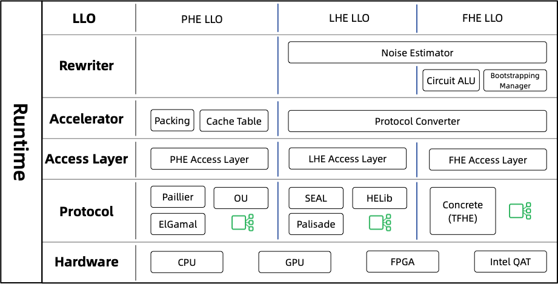

:target{#heu-device}

# HEU Device

:target{#what-is-heu}

## What is HEU

Homomorphic Encryption processing Unit (HEU) is a submodule of Secretflow that implements high-performance homomorphic encryption algorithms.

The purpose of HEU is to lower the threshold for the use of homomorphic encryption, so that users can use homomorphic encryption algorithms to build privacy-preserving applications without professional cryptography knowledge.

:target{#the-design-of-heu}

## The Design of HEU

HEU has two meanings, it is both a device in Secretflow and a high-performance homomorphic encryption library that can be used independently.

HEU Library: You can view HEU as a high-performance and complete homomorphic encryption library, which integrates almost all homomorphic encryption algorithms in the industry. At the same time, HEU encapsulates each algorithm and provides a uniform interface called “HEU library access layer”. You can switch between different HE algorithms at any time without modifying business code.

HEU device: As a component of Secretflow, HEU abstracts the homomorphic encryption algorithms into a programmable device, making it easy for users to flexibly build applications using the homomorphic encryption technology without professional knowledge. HEU (device) aims to build a complete computing solution through HE, that is, based on HE, any type of computing can be completed. Compared with SPU, HEU’s computation is purely local without any network communication, so HEU and SPU are complementary

:target{#insight-into-heu}

### Insight into HEU

Now let’s see the detail of HEU library.

There are many kinds of homomorphic encryption algorithms, and the functions of different algorithms are very different. It is impossible to integrate all the algorithms into a same library and provide a uniform interface. Therefore, HEU classifies homomorphic encryption algorithms into three categories, corresponding to three different working modes, as shown in the following table:

<table id="id1">
  <caption>
    HEU Working Mode
  </caption>

  <thead>
    <tr>
      <td>
        Working Mode
      </td>

      <td>
        Supported Calculation Types
      </td>

      <td>
        Number Of Calculations
      </td>

      <td>
        HE Algorithms
      </td>

      <td>
        Calculating Speed
      </td>

      <td>
        Ciphertext Size
      </td>
    </tr>
  </thead>

  <tbody>
    <tr>
      <td>
        PHEU
      </td>

      <td>
        Addition
      </td>

      <td>
        Unlimited
      </td>

      <td>
        Paillier
      </td>

      <td>
        Fast
      </td>

      <td>
        Small
      </td>
    </tr>

    <tr>
      <td>
        LHEU
      </td>

      <td>
        Addition, Multiplication
      </td>

      <td>
        Limited
      </td>

      <td>
        BGV, CKKS
      </td>

      <td>
        Fast (packed Mode)
      </td>

      <td>
        Least (packed Mode)
      </td>
    </tr>

    <tr>
      <td>
        FHEU
      </td>

      <td>
        Addition, Multiplication, Comparison, Mux
      </td>

      <td>
        Unlimited
      </td>

      <td>
        TFHE (Bitwise)
      </td>

      <td>
        Very Slow
      </td>

      <td>
        Largest
      </td>
    </tr>
  </tbody>
</table>

<Container type="note">
  HEU is still under rapid iterative development, LHEU and FHEU modes are not ready currently, only PHEU mode is available.
</Container>

Based on the three working modes of the HEU, the architecture of the HEU library is divided into three relatively independent parts in vertical direction.

The left part integrates PHE-related libraries, including Paillier, ElGamal, and so on. HEU deeply optimizes these PHE algorithms and often performs better than third-party libraries. So even if you do not need to use SecretFlow, it’s beneficial to just use HEU alone as a PHE library.

The middle part integrates LHE libraries, including SEAL, HELib, Palisade, and so on. It should be noted that although BGV/BFV and CKKS are fully homomorphic encryption algorithms themselves, the performance of bootstrapping is very low, so HEU only uses them as leveled HEs.

The right part integrates the FHE library, namely [Concrete](https://github.com/zama-ai/concrete), which is a variant of the TFHE algorithm developed by [Zama.ai](https://www.zama.ai/). It only supports encrypt one bit at a time, so its performance is very low. For example, a 64-bit integer will generate 64 ciphertexts after encrypted in this mode. And if you want to add two 64-bit integers, you need to execute a very complex circuit to obtain the result, which is very inefficient. In short, it is only suitable for low computation cost scenarios, and the advantage is that it can support arbitrary kind of encrypted operations, making it possible to do confidential outsourcing computing.

From a horizontal perspective, HEU can also be divided into several layers. The top layer is the <code>LLO</code> (low level operators) layer, which is the entry point to the HEU library. The HEU device first translates the user’s code into a DAG, and then compiled into LLO code. LLO defines a atomic operations set for interworking with HEU library. The second layer is <code>Rewriter</code>, which translates and rewrites the LLO code to suit different working modes. The third layer is <code>Accelerator</code>, which further optimizes the LLO code to accelerate the performance of confidential computing. The next layer is <code>Access Layer</code>, which abstracts a uniform interface for different homomorphic encryption libraries to facilitate protocol insertion and removal. The penultimate layer <code>Protocol</code> layer, which implements a variety of specific homomorphic encryption algorithms. The bottom layer is <code>Hardware</code> acceleration layer, which is still under working. We plan to support PHE hardware acceleration first, and then further expand to LHE and FHE.
