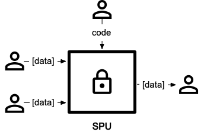
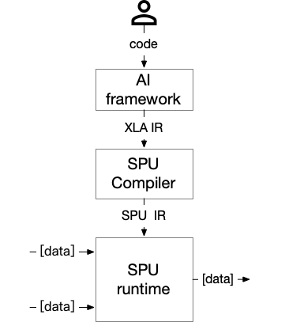
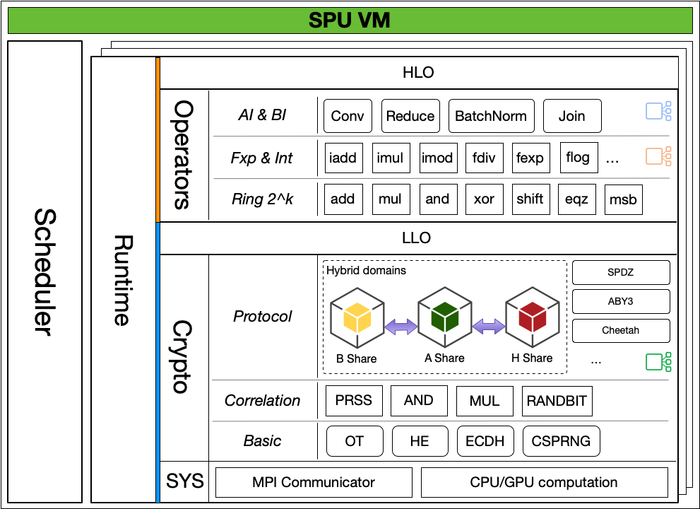
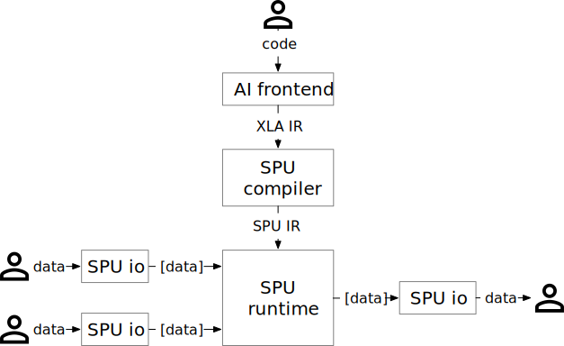

:target{#spu-secure-processing-unit}

# SPU (Secure Processing Unit)

SPU(Secure Processing Unit) is a domain-specific compiler and runtime suite. With SPU, you can:

- Create privacy-preserving application without any knowledge of MPC.
- Program with your favorite machine learning framework and API.
- Deploy your application to various security scenarios without modifying the code.

:target{#introduction}

## Introduction

SPU, as the name suggests, behaves like other <em>processing unit</em> which accepts code and inputs and return outputs. But unlike other <em>processing unit</em>, SPU protects user’s privacy during the whole process.

Although SPU and CPU are not easy to compare directly, but from programmer’s point of view, we can simply make an analogy between them.

<table>
  <tbody>
    <tr>
      <td>
        <figure id="id1">
          

          <figcaption>
            <em>Central Processing Unit</em>
          </figcaption>

          - Physical device, integrated circuit.
          - Works on plaintext.
          - Local system, single user.
          - Flexible for all kind of workload.
          - Fast, low latency.
        </figure>
      </td>

      <td>
        <figure id="id2">
          

          <figcaption>
            <em>Secure Processing Unit</em>
          </figcaption>

          - <strong>Virtual device</strong>, MPC protocol.
          - Works on <strong>ciphertext</strong>.
          - <strong>Distributed system</strong>, multiple user.
          - Suitable for certain kind of task.
          - Relatively slow, high latency.
        </figure>
      </td>
    </tr>
  </tbody>
</table>

There are two main components inside the SPU. The SPU compiler translates the python code into bytecode with privacy protection semantics. The SPU executes these bytecodes at runtime to get the result. We will introduce them separately below.

:target{#components}

## Components

:target{#compiler}

### Compiler

<figure>
  
</figure>

Just like other compilers, <em>SPU Compiler</em> translates code in one programming language into another language.

The SPU compiler is designed with the following considerations:

- Reuse machine learning front-end, reduce user learning costs.
- Reuse machine learning compiler’s functionality, avoid duplicated work.
- Optimize for MPC backend, generate MPC friendly bytecode.

With the first goal, we choose [XLA](https://www.tensorflow.org/xla/architecture) as the source language of the SPU compiler, since many AI framework (such as TensorFlow, JAX) is able to compile python code to XLA IR, so with the support of XLA, we can support AI frontend natively.

With the second goal, we choose [MLIR](https://mlir.llvm.org/) as the compiler infrastructure, and tries to resue the platform independent optimization and lowering pass as possible.

With the third goal, we add security related type hint to the type system, and use these type hints to help to generated efficient bytecode.

For more details, please check [SPU type system](https://www.secretflow.org.cn/docs/spu/en/development/type_system.html) and [SPU Compiler design](https://www.secretflow.org.cn/docs/spu/en/development/compiler.html).

:target{#runtime}

### Runtime

<em>SPU Runtime</em> is a virtual device composed by multiple physical node that do not trust each other.

- Inside SPU, multiple physical node run a MPC protocol at the same time, completing certain computation tasks while protecting data privacy.
- From the outside, multiple physical nodes together form a virtual device, providing general computing service.

The model is illustrated below.

<figure id="id3">
  

  <figcaption>
    <em>SPU inside</em>
  </figcaption>
</figure>

Of course, as a virtual machine, the SPU runtime itself is a multi-layer complex infrastructure, which translates the SPU bytecode layer by layer to the lowest-level cryptographic components, and provides concurrency and scheduling capabilities.

<figure id="id4">
  

  <figcaption>
    <em>SPU Runtime architecture</em>
  </figcaption>
</figure>

We will not go into details here, for more details, please visit [SPU standalone docs](https://www.secretflow.org.cn/docs/spu/en/)

:target{#summary}

## Summary

In the previous sections, we have introduced the various components of the SPU. Next, let’s take a look at the overall process of the SPU operation.

<figure id="id5">
  

  <figcaption>
    SPU operations in summary
  </figcaption>
</figure>

- User write program with TensorFLow, PyTorch or JAX.
- With SPU Compiler, the source program is translated into SPU IR that SPU Runtime understands.
- With SPU IO, data provider encrypts their data to the format that SPU Runtime understands.
- SPU Runtime executes the IR on the encrypted input, with given MPC protocol, and generated (encrypted) output.
- With SPU IO, data receiver decrypts the encrypted output and get the final result.

:target{#appendix}

## Appendix

:target{#mpc-secure-multi-party-computation}

### MPC (Secure multi-party computation)

If you are not familiar with MPC, please check [Resources for Getting
Started with MPC](https://u.cs.biu.ac.il/~lindell/MPC-resources.html)
and some famous [MPC frameworks and protocols](https://github.com/rdragos/awesome-mpc#frameworks.).

SPU implemented several MPC protocol including:

- [ABY3](https://eprint.iacr.org/2018/403.pdf): A honest majority
  3PC-protocol. SPU provides semi-honest implementation.
- [Semi2k-SPDZ](https://eprint.iacr.org/2018/482.pdf) : A
  semi-honest NPC-protocol similar to SPDZ but requires a trusted third
  party to generate offline randoms. By default this protocol now uses
  trusted first party. Hence, it should be used for debugging purposes
  only.
- [Cheetah](https://eprint.iacr.org/2022/207) : A fast 2pc
  semi-honest protocol. Since this protocol does not require a trusted
  third party, it requires more computation effort.

Please check [SPU MPC development status](https://www.secretflow.org.cn/docs/spu/en/reference/mpc_status.html) for
details.

:target{#spu-api-design}

### SPU API design

The API of the SPU is quite simple. There are three main modules, corresponding to the previous component descriptions.

- [SPU Io](https://www.secretflow.org.cn/docs/spu/en/reference/py_api.html#runtime-io),
  a library to transfer between plaintext and secret shares.
- [SPU compiler](https://www.secretflow.org.cn/docs/spu/en/reference/py_api.html#compiler),
  a tool to translate XLA to SPU IR.
- [SPU Runtime](https://www.secretflow.org.cn/docs/spu/en/reference/py_api.html#runtime-setup),
  a library to consume SPU IR and execute MPC computation.

:target{#spu-in-secretflow}

### SPU in SecretFlow

In SecretFlow, <em>SPU Device</em> encapsulates all the concepts of the above SPU, providing a simpler programming interface upwards.

- Data owners are <em>PYU devices</em> in SecretFlow and plaintext of values are called <em>PYU Objects</em>.
- A <em>PYU object</em> (plaintext) could be converted to secret shares, which is called a <em>SPU Object</em>.
- Python functions could be sent and executed by a <em>SPU device</em>, with the help of SPU Compiler and Runtime.
- Lastly, a <em>SPU Object</em> could be transferred to a <em>PYU Object</em>, which is owned by a <em>PYU Device</em>.
