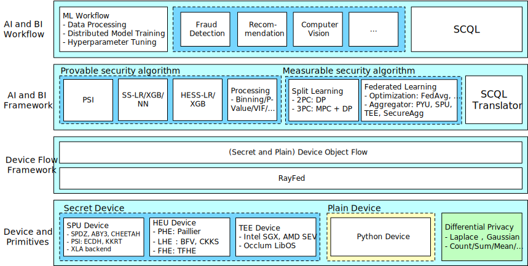

---
sitemap:
- children:
  - children: []
    filepath: getting_started/installation.mdx
    hidden: false
    title: Installation
  - children: []
    filepath: getting_started/deployment.mdx
    hidden: false
    title: Deployment
  filepath: getting_started/index.mdx
  hidden: true
  title: Getting started
- children:
  - children:
    - children: []
      filepath: user_guide/preprocessing/DataFrame.mdx
      hidden: false
      title: DataFrame
    - children: []
      filepath: user_guide/preprocessing/WeightOfEvidenceEncoding.mdx
      hidden: false
      title: Weight Of Evidence encoding
    filepath: user_guide/preprocessing/index.mdx
    hidden: true
    title: Preprocessing
  - children: []
    filepath: user_guide/psi.mdx
    hidden: true
    title: Private Set Intersection(PSI)
  - children:
    - children: []
      filepath: user_guide/mpc_ml/linear_model.mdx
      hidden: false
      title: Linear Models
    - children: []
      filepath: user_guide/mpc_ml/decision_tree.mdx
      hidden: false
      title: Decision Trees
    - children: []
      filepath: user_guide/mpc_ml/feature_eng.mdx
      hidden: false
      title: Feature Engineering
    filepath: user_guide/mpc_ml/index.mdx
    hidden: true
    title: MPC Machine Learning
  - children:
    - children:
      - children: []
        filepath: user_guide/federated_learning/horizontal_federated_learning/fl_model.mdx
        hidden: false
        title: Federated NN Model
      - children: []
        filepath: user_guide/federated_learning/horizontal_federated_learning/tree.mdx
        hidden: false
        title: Horizontally Federated XGBoost
      filepath: user_guide/federated_learning/horizontal_federated_learning/index.mdx
      hidden: false
      title: Horizontal Federated Learning
    - children:
      - children: []
        filepath: user_guide/federated_learning/vertical_federated_learning/split_learning.mdx
        hidden: false
        title: Split Learning
      - children: []
        filepath: user_guide/federated_learning/vertical_federated_learning/tree.mdx
        hidden: false
        title: Vertically Federated XGB (SecureBoost)
      filepath: user_guide/federated_learning/vertical_federated_learning/index.mdx
      hidden: false
      title: Vertical Federated Learning
    - children: []
      filepath: user_guide/federated_learning/mix_federated_learning.mdx
      hidden: false
      title: Mix Federated Learning
    filepath: user_guide/federated_learning/index.mdx
    hidden: true
    title: Federated Learning
  filepath: user_guide/index.mdx
  hidden: true
  title: User Guide
- children:
  - children:
    - children:
      - children:
        - children: []
          filepath: source/secretflow.component.component.feature.mdx
          hidden: false
          title: secretflow.component.feature package
        - children:
          - children:
            - children: []
              filepath: source/secretflow.component.ml.boost.component.ml.boost.sgb.mdx
              hidden: false
              title: secretflow.component.ml.boost.sgb package
            - children: []
              filepath: source/secretflow.component.ml.boost.component.ml.boost.ss_xgb.mdx
              hidden: false
              title: secretflow.component.ml.boost.ss_xgb package
            filepath: source/secretflow.component.ml.component.ml.boost.mdx
            hidden: false
            title: secretflow.component.ml.boost package
          - children: []
            filepath: source/secretflow.component.ml.component.ml.eval.mdx
            hidden: false
            title: secretflow.component.ml.eval package
          - children: []
            filepath: source/secretflow.component.ml.component.ml.linear.mdx
            hidden: false
            title: secretflow.component.ml.linear package
          filepath: source/secretflow.component.component.ml.mdx
          hidden: false
          title: secretflow.component.ml package
        - children: []
          filepath: source/secretflow.component.component.preprocessing.mdx
          hidden: false
          title: secretflow.component.preprocessing package
        - children: []
          filepath: source/secretflow.component.component.stats.mdx
          hidden: false
          title: secretflow.component.stats package
        filepath: source/secretflow.component.mdx
        hidden: false
        title: secretflow.component package
      - children:
        - children: []
          filepath: source/secretflow.data.data.horizontal.mdx
          hidden: false
          title: secretflow.data.horizontal package
        - children: []
          filepath: source/secretflow.data.data.io.mdx
          hidden: false
          title: secretflow.data.io package
        - children: []
          filepath: source/secretflow.data.data.mix.mdx
          hidden: false
          title: secretflow.data.mix package
        - children: []
          filepath: source/secretflow.data.data.vertical.mdx
          hidden: false
          title: secretflow.data.vertical package
        filepath: source/secretflow.data.mdx
        hidden: false
        title: secretflow.data package
      - children:
        - children: []
          filepath: source/secretflow.device.device.device.mdx
          hidden: false
          title: secretflow.device.device package
        - children: []
          filepath: source/secretflow.device.device.kernels.mdx
          hidden: false
          title: secretflow.device.kernels package
        filepath: source/secretflow.device.mdx
        hidden: false
        title: secretflow.device package
      - children: []
        filepath: source/secretflow.distributed.mdx
        hidden: false
        title: secretflow.distributed package
      - children: []
        filepath: source/secretflow.kuscia.mdx
        hidden: false
        title: secretflow.kuscia package
      - children:
        - children:
          - children: []
            filepath: source/secretflow.ml.boost.ml.boost.core.mdx
            hidden: false
            title: secretflow.ml.boost.core package
          - children:
            - children: []
              filepath: source/secretflow.ml.boost.homo_boost.ml.boost.homo_boost.boost_core.mdx
              hidden: false
              title: secretflow.ml.boost.homo_boost.boost_core package
            - children: []
              filepath: source/secretflow.ml.boost.homo_boost.ml.boost.homo_boost.tree_core.mdx
              hidden: false
              title: secretflow.ml.boost.homo_boost.tree_core package
            filepath: source/secretflow.ml.boost.ml.boost.homo_boost.mdx
            hidden: false
            title: secretflow.ml.boost.homo_boost package
          - children:
            - children:
              - children: []
                filepath: source/secretflow.ml.boost.sgb_v.core.ml.boost.sgb_v.core.cache.mdx
                hidden: false
                title: secretflow.ml.boost.sgb_v.core.cache package
              - children: []
                filepath: source/secretflow.ml.boost.sgb_v.core.ml.boost.sgb_v.core.distributed_tree.mdx
                hidden: false
                title: secretflow.ml.boost.sgb_v.core.distributed_tree package
              - children: []
                filepath: source/secretflow.ml.boost.sgb_v.core.ml.boost.sgb_v.core.pure_numpy_ops.mdx
                hidden: false
                title: secretflow.ml.boost.sgb_v.core.pure_numpy_ops package
              filepath: source/secretflow.ml.boost.sgb_v.ml.boost.sgb_v.core.mdx
              hidden: false
              title: secretflow.ml.boost.sgb_v.core package
            - children:
              - children: []
                filepath: source/secretflow.ml.boost.sgb_v.factory.ml.boost.sgb_v.factory.booster.mdx
                hidden: false
                title: secretflow.ml.boost.sgb_v.factory.booster package
              - children:
                - children: []
                  filepath: source/secretflow.ml.boost.sgb_v.factory.components.ml.boost.sgb_v.factory.components.bucket_sum_calculator.mdx
                  hidden: false
                  title: secretflow.ml.boost.sgb_v.factory.components.bucket_sum_calculator
                    package
                - children: []
                  filepath: source/secretflow.ml.boost.sgb_v.factory.components.ml.boost.sgb_v.factory.components.cache.mdx
                  hidden: false
                  title: secretflow.ml.boost.sgb_v.factory.components.cache package
                - children: []
                  filepath: source/secretflow.ml.boost.sgb_v.factory.components.ml.boost.sgb_v.factory.components.data_preprocessor.mdx
                  hidden: false
                  title: secretflow.ml.boost.sgb_v.factory.components.data_preprocessor
                    package
                - children: []
                  filepath: source/secretflow.ml.boost.sgb_v.factory.components.ml.boost.sgb_v.factory.components.gradient_encryptor.mdx
                  hidden: false
                  title: secretflow.ml.boost.sgb_v.factory.components.gradient_encryptor
                    package
                - children: []
                  filepath: source/secretflow.ml.boost.sgb_v.factory.components.ml.boost.sgb_v.factory.components.leaf_manager.mdx
                  hidden: false
                  title: secretflow.ml.boost.sgb_v.factory.components.leaf_manager
                    package
                - children: []
                  filepath: source/secretflow.ml.boost.sgb_v.factory.components.ml.boost.sgb_v.factory.components.loss_computer.mdx
                  hidden: false
                  title: secretflow.ml.boost.sgb_v.factory.components.loss_computer
                    package
                - children: []
                  filepath: source/secretflow.ml.boost.sgb_v.factory.components.ml.boost.sgb_v.factory.components.model_builder.mdx
                  hidden: false
                  title: secretflow.ml.boost.sgb_v.factory.components.model_builder
                    package
                - children: []
                  filepath: source/secretflow.ml.boost.sgb_v.factory.components.ml.boost.sgb_v.factory.components.node_selector.mdx
                  hidden: false
                  title: secretflow.ml.boost.sgb_v.factory.components.node_selector
                    package
                - children: []
                  filepath: source/secretflow.ml.boost.sgb_v.factory.components.ml.boost.sgb_v.factory.components.order_map_manager.mdx
                  hidden: false
                  title: secretflow.ml.boost.sgb_v.factory.components.order_map_manager
                    package
                - children: []
                  filepath: source/secretflow.ml.boost.sgb_v.factory.components.ml.boost.sgb_v.factory.components.sampler.mdx
                  hidden: false
                  title: secretflow.ml.boost.sgb_v.factory.components.sampler package
                - children: []
                  filepath: source/secretflow.ml.boost.sgb_v.factory.components.ml.boost.sgb_v.factory.components.shuffler.mdx
                  hidden: false
                  title: secretflow.ml.boost.sgb_v.factory.components.shuffler package
                - children: []
                  filepath: source/secretflow.ml.boost.sgb_v.factory.components.ml.boost.sgb_v.factory.components.split_candidate_manager.mdx
                  hidden: false
                  title: secretflow.ml.boost.sgb_v.factory.components.split_candidate_manager
                    package
                - children: []
                  filepath: source/secretflow.ml.boost.sgb_v.factory.components.ml.boost.sgb_v.factory.components.split_finder.mdx
                  hidden: false
                  title: secretflow.ml.boost.sgb_v.factory.components.split_finder
                    package
                - children: []
                  filepath: source/secretflow.ml.boost.sgb_v.factory.components.ml.boost.sgb_v.factory.components.split_tree_builder.mdx
                  hidden: false
                  title: secretflow.ml.boost.sgb_v.factory.components.split_tree_builder
                    package
                - children: []
                  filepath: source/secretflow.ml.boost.sgb_v.factory.components.ml.boost.sgb_v.factory.components.tree_trainer.mdx
                  hidden: false
                  title: secretflow.ml.boost.sgb_v.factory.components.tree_trainer
                    package
                filepath: source/secretflow.ml.boost.sgb_v.factory.ml.boost.sgb_v.factory.components.mdx
                hidden: false
                title: secretflow.ml.boost.sgb_v.factory.components package
              filepath: source/secretflow.ml.boost.sgb_v.ml.boost.sgb_v.factory.mdx
              hidden: false
              title: secretflow.ml.boost.sgb_v.factory package
            filepath: source/secretflow.ml.boost.ml.boost.sgb_v.mdx
            hidden: false
            title: secretflow.ml.boost.sgb_v package
          - children:
            - children: []
              filepath: source/secretflow.ml.boost.ss_xgb_v.ml.boost.ss_xgb_v.core.mdx
              hidden: false
              title: secretflow.ml.boost.ss_xgb_v.core package
            filepath: source/secretflow.ml.boost.ml.boost.ss_xgb_v.mdx
            hidden: false
            title: secretflow.ml.boost.ss_xgb_v package
          filepath: source/secretflow.ml.ml.boost.mdx
          hidden: false
          title: secretflow.ml.boost package
        - children:
          - children: []
            filepath: source/secretflow.ml.linear.ml.linear.hess_sgd.mdx
            hidden: false
            title: secretflow.ml.linear.hess_sgd package
          - children:
            - children: []
              filepath: source/secretflow.ml.linear.ss_glm.ml.linear.ss_glm.core.mdx
              hidden: false
              title: secretflow.ml.linear.ss_glm.core package
            filepath: source/secretflow.ml.linear.ml.linear.ss_glm.mdx
            hidden: false
            title: secretflow.ml.linear.ss_glm package
          - children: []
            filepath: source/secretflow.ml.linear.ml.linear.ss_sgd.mdx
            hidden: false
            title: secretflow.ml.linear.ss_sgd package
          filepath: source/secretflow.ml.ml.linear.mdx
          hidden: false
          title: secretflow.ml.linear package
        - children:
          - children: []
            filepath: source/secretflow.ml.nn.ml.nn.applications.mdx
            hidden: false
            title: secretflow.ml.nn.applications package
          - children:
            - children:
              - children:
                - children: []
                  filepath: source/secretflow.ml.nn.fl.backend.tensorflow.ml.nn.fl.backend.tensorflow.strategy.mdx
                  hidden: false
                  title: secretflow.ml.nn.fl.backend.tensorflow.strategy package
                filepath: source/secretflow.ml.nn.fl.backend.ml.nn.fl.backend.tensorflow.mdx
                hidden: false
                title: secretflow.ml.nn.fl.backend.tensorflow package
              - children:
                - children: []
                  filepath: source/secretflow.ml.nn.fl.backend.torch.ml.nn.fl.backend.torch.strategy.mdx
                  hidden: false
                  title: secretflow.ml.nn.fl.backend.torch.strategy package
                filepath: source/secretflow.ml.nn.fl.backend.ml.nn.fl.backend.torch.mdx
                hidden: false
                title: secretflow.ml.nn.fl.backend.torch package
              filepath: source/secretflow.ml.nn.fl.ml.nn.fl.backend.mdx
              hidden: false
              title: secretflow.ml.nn.fl.backend package
            filepath: source/secretflow.ml.nn.ml.nn.fl.mdx
            hidden: false
            title: secretflow.ml.nn.fl package
          - children:
            - children: []
              filepath: source/secretflow.ml.nn.sl.ml.nn.sl.agglayer.mdx
              hidden: false
              title: secretflow.ml.nn.sl.agglayer package
            - children:
              - children: []
                filepath: source/secretflow.ml.nn.sl.attack.ml.nn.sl.attack.torch.mdx
                hidden: false
                title: secretflow.ml.nn.sl.attack.torch package
              filepath: source/secretflow.ml.nn.sl.ml.nn.sl.attack.mdx
              hidden: false
              title: secretflow.ml.nn.sl.attack package
            - children:
              - children:
                - children: []
                  filepath: source/secretflow.ml.nn.sl.backend.tensorflow.ml.nn.sl.backend.tensorflow.strategy.mdx
                  hidden: false
                  title: secretflow.ml.nn.sl.backend.tensorflow.strategy package
                filepath: source/secretflow.ml.nn.sl.backend.ml.nn.sl.backend.tensorflow.mdx
                hidden: false
                title: secretflow.ml.nn.sl.backend.tensorflow package
              - children:
                - children: []
                  filepath: source/secretflow.ml.nn.sl.backend.torch.ml.nn.sl.backend.torch.strategy.mdx
                  hidden: false
                  title: secretflow.ml.nn.sl.backend.torch.strategy package
                filepath: source/secretflow.ml.nn.sl.backend.ml.nn.sl.backend.torch.mdx
                hidden: false
                title: secretflow.ml.nn.sl.backend.torch package
              filepath: source/secretflow.ml.nn.sl.ml.nn.sl.backend.mdx
              hidden: false
              title: secretflow.ml.nn.sl.backend package
            filepath: source/secretflow.ml.nn.ml.nn.sl.mdx
            hidden: false
            title: secretflow.ml.nn.sl package
          filepath: source/secretflow.ml.ml.nn.mdx
          hidden: false
          title: secretflow.ml.nn package
        filepath: source/secretflow.ml.mdx
        hidden: false
        title: secretflow.ml package
      - children:
        - children:
          - children: []
            filepath: source/secretflow.preprocessing.binning.preprocessing.binning.kernels.mdx
            hidden: false
            title: secretflow.preprocessing.binning.kernels package
          filepath: source/secretflow.preprocessing.preprocessing.binning.mdx
          hidden: false
          title: secretflow.preprocessing.binning package
        filepath: source/secretflow.preprocessing.mdx
        hidden: false
        title: secretflow.preprocessing package
      - children:
        - children: []
          filepath: source/secretflow.protos.protos.component.mdx
          hidden: false
          title: secretflow.protos.component package
        filepath: source/secretflow.protos.mdx
        hidden: false
        title: secretflow.protos package
      - children:
        - children: []
          filepath: source/secretflow.security.security.aggregation.mdx
          hidden: false
          title: secretflow.security.aggregation package
        - children: []
          filepath: source/secretflow.security.security.compare.mdx
          hidden: false
          title: secretflow.security.compare package
        - children:
          - children: []
            filepath: source/secretflow.security.privacy.security.privacy.accounting.mdx
            hidden: false
            title: secretflow.security.privacy.accounting package
          - children:
            - children: []
              filepath: source/secretflow.security.privacy.mechanism.security.privacy.mechanism.tensorflow.mdx
              hidden: false
              title: secretflow.security.privacy.mechanism.tensorflow package
            - children: []
              filepath: source/secretflow.security.privacy.mechanism.security.privacy.mechanism.torch.mdx
              hidden: false
              title: secretflow.security.privacy.mechanism.torch package
            filepath: source/secretflow.security.privacy.security.privacy.mechanism.mdx
            hidden: false
            title: secretflow.security.privacy.mechanism package
          filepath: source/secretflow.security.security.privacy.mdx
          hidden: false
          title: secretflow.security.privacy package
        filepath: source/secretflow.security.mdx
        hidden: false
        title: secretflow.security package
      - children:
        - children: []
          filepath: source/secretflow.stats.stats.core.mdx
          hidden: false
          title: secretflow.stats.core package
        filepath: source/secretflow.stats.mdx
        hidden: false
        title: secretflow.stats package
      - children:
        - children:
          - children: []
            filepath: source/secretflow.utils.simulation.utils.simulation.data.mdx
            hidden: false
            title: secretflow.utils.simulation.data package
          filepath: source/secretflow.utils.utils.simulation.mdx
          hidden: false
          title: secretflow.utils.simulation package
        filepath: source/secretflow.utils.mdx
        hidden: false
        title: secretflow.utils package
      filepath: source/secretflow.mdx
      hidden: false
      title: secretflow package
    filepath: source/modules.mdx
    hidden: false
    title: secretflow
  filepath: api/index.mdx
  hidden: true
  title: API Documentation
- children:
  - children: []
    filepath: tutorial/FedDataFrameDataLoader.mdx
    hidden: false
    title: Loading CSV data in SecretFlow
  - children: []
    filepath: tutorial/FedNdarrayDataLoader.mdx
    hidden: false
    title: Load Numpy data in SecretFlow
  - children: []
    filepath: tutorial/CustomDataLoaderTF.mdx
    hidden: false
    title: Using Custom DataBuilder in SecretFlow (TensorFlow)
  - children: []
    filepath: tutorial/CustomDataLoaderTorch.mdx
    hidden: false
    title: Using Custom DataBuilder in SecretFlow (Torch)
  - children: []
    filepath: tutorial/CustomDataLoaderOnSL.mdx
    hidden: false
    title: Customize DataBuilder on SLModel in SecretFlow
  - children: []
    filepath: tutorial/data_preprocessing_with_data_frame.mdx
    hidden: false
    title: Data Preprocessing with DataFrame
  - children: []
    filepath: tutorial/WeightOfEvidenceEncoding.mdx
    hidden: false
    title: Weight Of Evidence encoding
  - children: []
    filepath: tutorial/spu_basics.mdx
    hidden: false
    title: SPU Basics
  - children: []
    filepath: tutorial/lr_with_spu.mdx
    hidden: false
    title: Logistic Regression with SPU
  - children: []
    filepath: tutorial/nn_with_spu.mdx
    hidden: false
    title: Neural Network with SPU
  - children: []
    filepath: tutorial/gpt2_with_spu.mdx
    hidden: false
    title: GPT-2 private inference with SPU
  - children: []
    filepath: tutorial/numpy_with_spu.mdx
    hidden: false
    title: Privacy-Preserving Scientific Computing with NumPy in SPU
  - children: []
    filepath: tutorial/gpt2_with_puma.mdx
    hidden: false
    title: GPT-2 Secure inference with Puma
  - children: []
    filepath: tutorial/teeu.mdx
    hidden: false
    title: TEEU Getting Started Guide
  - children: []
    filepath: tutorial/teeu_xgboost.mdx
    hidden: false
    title: 'TEEU Example: XGBoost'
  - children: []
    filepath: tutorial/PSI_On_SPU.mdx
    hidden: false
    title: PSI On SPU
  - children: []
    filepath: tutorial/Federate_Learning_for_Image_Classification.mdx
    hidden: false
    title: Federated Learning for Image Classification
  - children: []
    filepath: tutorial/Federated_Learning_with_Pytorch_backend.mdx
    hidden: false
    title: Federated Learning with Pytorch Backend
  - children: []
    filepath: tutorial/Federated_Xgboost.mdx
    hidden: false
    title: Horizontally Federated XGBoost
  - children: []
    filepath: tutorial/SecureBoost.mdx
    hidden: false
    title: Vertically Federated XGB (SecureBoost)
  - children: []
    filepath: tutorial/Split_Learning_for_bank_marketing.mdx
    hidden: false
    title: Split Learning—Bank Marketing
  - children: []
    filepath: tutorial/split_learning_gnn.mdx
    hidden: false
    title: Split Learning for Graph Neural Network
  - children: []
    filepath: tutorial/mix_lr.mdx
    hidden: false
    title: Mix Federated Learning - Logistic Regression
  - children: []
    filepath: tutorial/sl_rec_deepfm.mdx
    hidden: false
    title: 'SplitREC: Using DeepFM Algorithm in SecretFlow'
  - children: []
    filepath: tutorial/risk_control_scenario.mdx
    hidden: false
    title: 隐语SecretFlow金融风控全链路能力展示
  - children: []
    filepath: tutorial/practical_case_walkthrough_using_sf_with_spu.mdx
    hidden: false
    title: 隐语SecretFlow实际场景MPC算法开发实践
  - children: []
    filepath: tutorial/GPU_check.mdx
    hidden: false
    title: GPU check
  filepath: tutorial/index.mdx
  hidden: true
  title: Tutorial
- children:
  - children: []
    filepath: component/comp_spec.mdx
    hidden: false
    title: Component Specification
  - children: []
    filepath: component/comp_list.mdx
    hidden: false
    title: SecretFlow Component List
  - children: []
    filepath: component/comp_spec_design.mdx
    hidden: false
    title: Design of Component Specification
  - children: []
    filepath: component/comp_guide.mdx
    hidden: false
    title: Guide of SecretFlow Components
  filepath: component/index.mdx
  hidden: true
  title: Component
- children:
  - children: []
    external: https://www.yuque.com/secret-flow/admin/exgixt72drdvdsy3
    hidden: false
    title: A comprehensive comparison of various privacy-preserving technologies
  - children: []
    filepath: developer/design/architecture.mdx
    hidden: false
    title: Architecture
  - children: []
    filepath: developer/design/spu.mdx
    hidden: false
    title: SPU (Secure Processing Unit)
  - children: []
    filepath: developer/design/heu.mdx
    hidden: false
    title: HEU Device
  - children: []
    filepath: developer/design/teeu.mdx
    hidden: false
    title: TEEU
  - children: []
    filepath: developer/design/flmodel.mdx
    hidden: false
    title: FLModel Design
  - children: []
    filepath: developer/design/strategy.mdx
    hidden: false
    title: Strategy Design
  - children: []
    filepath: developer/design/programming_in_secretflow.mdx
    hidden: false
    title: Programming in SecretFlow
  - children: []
    filepath: developer/algorithm/secure_aggregation.mdx
    hidden: false
    title: Secure Aggregation
  - children: []
    filepath: developer/algorithm/mix_lr.mdx
    hidden: false
    title: Federated Logistic Regression with Mix Partitioned data
  - children: []
    filepath: developer/algorithm/federated_learning/fed_prox.mdx
    hidden: false
    title: 'Strategy: FedProx'
  - children: []
    filepath: developer/algorithm/federated_learning/fed_scr.mdx
    hidden: false
    title: 'Strategy: FedSCR'
  - children: []
    filepath: developer/algorithm/federated_learning/fed_stc.mdx
    hidden: false
    title: 'Strategy: FedSTC'
  - children: []
    filepath: developer/algorithm/differential_privacy/GlobalDP.mdx
    hidden: false
    title: 'Differential Privacy: Global DP in Federated Learning'
  - children: []
    filepath: developer/benchmark/psi_benchmark.mdx
    hidden: false
    title: 隐语PSI Benchmark白皮书
  - children: []
    filepath: developer/benchmark/ubpsi_benchmark.mdx
    hidden: false
    title: 隐语非平衡(Unbalanced) PSI Benchmark白皮书
  filepath: developer/index.mdx
  hidden: true
  title: Developer
---

:target{#secretflow}

# SecretFlow

[SecretFlow](https://github.com/secretflow/secretflow) is a unified framework for privacy-preserving data analysis and machine learning.

SecretFlow provides

- Device abstraction, which abstracts privacy-preserving computing technologies such as
  Multi-Party Secure Computing (MPC), Homomorphic Encryption (HE),
  and Trusted Execution Environment (TEE) into ciphertext devices,
  and abstracts plaintext computing into plaintext devices.
- Computational graphs based on abstracted devices, enabling data analysis
  and machine learning workflows to be represented as computational graphs.
- Machine learning/data analysis capabilities based on computational graphs,
  supporting data horizontal/vertical/hybrid segmentation and other scenarios.

:target{#why-secretflow}

## Why <cite>SecretFlow</cite>

At present, privacy-preserving computing technology is growing in popularity.
However, neither the technology nor the market has yet reached real maturity.
In order to cope with the development uncertainty of privacy-preserving computing technology and applications,
we propose a general privacy-preserving computing framework called “SecretFlow”.
SecretFlow will adhere to the following principles,
so that the framework has the maximum inclusive and extensible capabilities to
cope with the development of future privacy-preserving computing technologies and applications.

- Completeness: It supports various privacy-preserving computing technologies and
  can be assembled flexibly to meet the needs of different scenarios.
- Transparency: Build a unified technical framework, and try to make the
  underlying technology iteration transparent to the upper-layer application,
  with high cohesion and low coupling.
- Openness: People with different professional directions can easily participate
  in the construction of the framework, and jointly accelerate the development of privacy-preserving computing technology.
- Connectivity: Data in scenarios supported by different underlying technologies
  can be connected to each other.

:target{#mpc-fl-tee-which-one-is-better}

### MPC, FL, TEE: which one is better?

We’re often asked which technology is better. The short answer is there is no dominant winner.
It depends on the requirements, such as performance, security assumption, etc. For a more detailed comparison, please check
[A comprehensive comparison of various privacy-preserving technologies](https://www.yuque.com/secret-flow/admin/exgixt72drdvdsy3) .

<TableOfContents />
