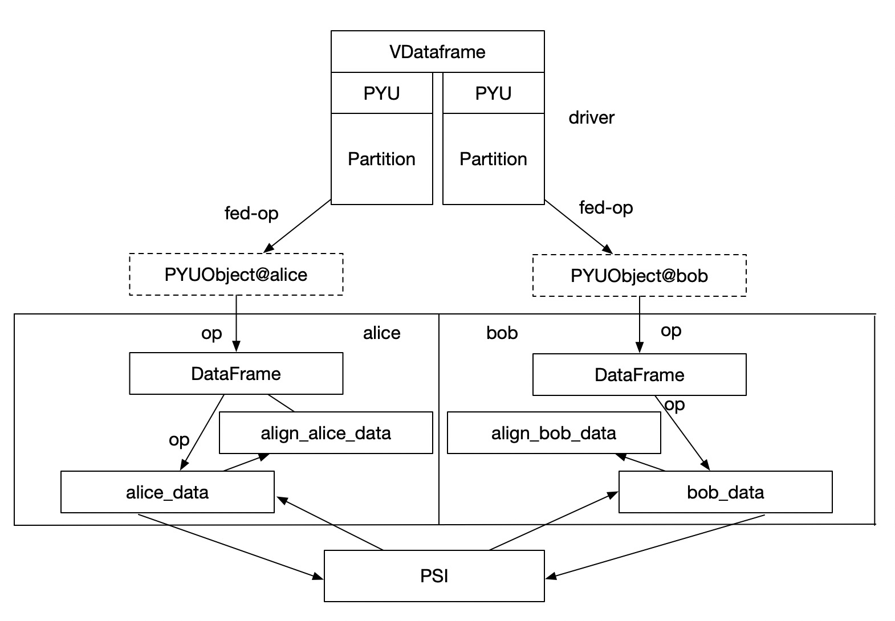

:target{#Loading-CSV-data-in-SecretFlow}

# Loading CSV data in SecretFlow

The following codes are demos only. It’s <strong>NOT for production</strong> due to system security concerns, please <strong>DO NOT</strong> use it directly in production.

This tutorial will demonstrate, through several examples, how to load CSV data in SecretFlow and utilize it for data processing and modeling.

:target{#Setting-up-the-environment}

## Setting up the environment

<Notebook.Cell>
  <Notebook.CodeArea prompt="[1]:" stderr={false} type="input">
    ```python
    %load_ext autoreload
    %autoreload 2
    ```
  </Notebook.CodeArea>
</Notebook.Cell>

<Notebook.Cell>
  <Notebook.CodeArea prompt="[2]:" stderr={false} type="input">
    ```python
    import secretflow as sf

    # Check the version of your SecretFlow
    print('The version of SecretFlow: {}'.format(sf.__version__))

    # In case you have a running secretflow runtime already.
    sf.shutdown()
    sf.init(['alice', 'bob', 'charlie'], address="local", log_to_driver=True)
    alice, bob, charlie = sf.PYU('alice'), sf.PYU('bob'), sf.PYU('charlie')
    ```
  </Notebook.CodeArea>
</Notebook.Cell>

:target{#Introduction-to-the-interface}

## Introduction to the interface

In SecretFlow, we provide an interface similar to `pandas.read_csv` to read CSV data from different parties and unify it into a federated concept of data.

- For horizontal scenarios, there is `secretflow.horizontal.read_csv` [API](https://www.secretflow.org.cn/docs/secretflow/en/source/secretflow.data.horizontal.html#secretflow.data.horizontal.read_csv) available.
- For horizontal scenarios, there is `secretflow.vertical.read_csv` [API](https://www.secretflow.org.cn/docs/secretflow/en/source/secretflow.data.horizontal.html#secretflow.data.vertical.read_csv) available.

By using `read_csv`, you can read CSV files from multiple parties and create a FedDataFrame.

<LineBlock>
  <strong>Build Federated Table</strong>

  A federated table is a virtual concept that spans multiple parties.
</LineBlock>

1. Data from each party in the federated table is stored locally and is not allowed to leave the domain.
2. Except for the party that owns the data, no one else can access the data storage.
3. Any operation on the federated table is scheduled by the Driver to each Worker, and the execution instructions are passed layer by layer until they reach the Python Runtime of the specific Worker that owns the data. The framework ensures that data can only be operated on when the Worker.device and Object.device are the same.
4. The federated table is designed to manage and manipulate multi-party data from a central perspective.
5. The interface aligns with `pandas.DataFrame` to reduce the cost of multi-party data operations.



:target{#Data-Download-and-Splitting}

## Data Download and Splitting

<Notebook.Cell>
  <Notebook.CodeArea prompt="[3]:" stderr={false} type="input">
    ```python
    %%capture
    %%!
    wget https://secretflow-data.oss-accelerate.aliyuncs.com/datasets/iris/iris.csv
    ```
  </Notebook.CodeArea>
</Notebook.Cell>

<Notebook.Cell>
  <Notebook.CodeArea prompt="[4]:" stderr={false} type="input">
    ```python
    import pandas as pd

    alldata_df = pd.read_csv("./iris.csv")
    ```
  </Notebook.CodeArea>
</Notebook.Cell>

<Notebook.Cell>
  <Notebook.CodeArea prompt="[5]:" stderr={false} type="input">
    ```python
    len(alldata_df)
    ```
  </Notebook.CodeArea>

  <Notebook.CodeArea prompt="[5]:" stderr={false} type="output">
    <pre>
      {"150\n"}
    </pre>
  </Notebook.CodeArea>
</Notebook.Cell>

<Notebook.Cell>
  <Notebook.CodeArea prompt="[6]:" stderr={false} type="input">
    ```python
    h_alice_df = alldata_df.loc[:70]
    h_bob_df = alldata_df.loc[70:]
    ```
  </Notebook.CodeArea>
</Notebook.Cell>

Save horizontally split DataFrame as CSV files separately.

<Notebook.Cell>
  <Notebook.CodeArea prompt="[7]:" stderr={false} type="input">
    ```python
    # save the data to local file system
    import tempfile

    _, h_alice_path = tempfile.mkstemp()
    _, h_bob_path = tempfile.mkstemp()
    h_alice_df.to_csv(h_alice_path, index=False)
    h_bob_df.to_csv(h_bob_path, index=False)
    ```
  </Notebook.CodeArea>
</Notebook.Cell>

<Notebook.Cell>
  <Notebook.CodeArea prompt="[8]:" stderr={false} type="input">
    ```python
    v_alice_df = alldata_df.loc[:, ['sepal_length', 'sepal_width']]
    v_bob_df = alldata_df.loc[:, ['petal_length', 'petal_width', 'class']]
    ```
  </Notebook.CodeArea>
</Notebook.Cell>

Save vertically split DataFrame as CSV files separately.

<Notebook.Cell>
  <Notebook.CodeArea prompt="[9]:" stderr={false} type="input">
    ```python
    # save the data to local file system
    _, v_alice_path = tempfile.mkstemp()
    _, v_bob_path = tempfile.mkstemp()
    v_alice_df.to_csv(v_alice_path, index=True, index_label="id")
    v_bob_df.to_csv(v_bob_path, index=True, index_label="id")
    ```
  </Notebook.CodeArea>
</Notebook.Cell>

:target{#Loading-CSV-Data-Example-for-Horizontal-Scenario}

## Loading CSV Data Example for Horizontal Scenario

<Notebook.Cell>
  <Notebook.CodeArea prompt="[10]:" stderr={false} type="input">
    ```python
    from secretflow.data.horizontal import read_csv
    from secretflow.security.aggregation.plain_aggregator import PlainAggregator
    from secretflow.security.compare.plain_comparator import PlainComparator
    from secretflow.data.split import train_test_split
    ```
  </Notebook.CodeArea>
</Notebook.Cell>

First, prepare the CSV data files for two parties. In a horizontal scenario, it is required that the schema of the data from both parties is consistent.

- Alice: datapath (the local path accessible on Alice’s machine)
- Bob: datapath (the local path accessible on Bob’s machine)

In a horizontal scenario, since the data with the same schema is distributed across multiple parties, cross-domain computation is required for certain DataFrame operations. The `read_csv` interface requires the specification of an `aggregator` and a `comparator`. We can specify a `secure aggregator` and a `secure comparator` during computation to protect data privacy.

<Notebook.Cell>
  <Notebook.CodeArea prompt="[11]:" stderr={false} type="input">
    ```python
    path_dict = {alice: h_alice_path, bob: h_bob_path}

    aggregator = PlainAggregator(charlie)
    comparator = PlainComparator(charlie)

    hdf = read_csv(filepath=path_dict, aggregator=aggregator, comparator=comparator)
    ```
  </Notebook.CodeArea>
</Notebook.Cell>

<Notebook.Cell>
  <Notebook.CodeArea prompt="[12]:" stderr={false} type="input">
    ```python
    hdf.columns
    ```
  </Notebook.CodeArea>

  <Notebook.CodeArea prompt="[12]:" stderr={false} type="output">
    <pre>
      {"Index(['sepal_length', 'sepal_width', 'petal_length', 'petal_width', 'class'], dtype='object')\n"}
    </pre>
  </Notebook.CodeArea>
</Notebook.Cell>

The resulting hdf is a FedDataFrame, and we can now perform some data processing on it. For reference, [Data Preprocessing with FedDataFrame](https://www.secretflow.org.cn/docs/secretflow/en/tutorial/data_preprocessing_with_data_frame.html)：

<Notebook.Cell>
  <Notebook.CodeArea prompt="[13]:" stderr={false} type="input">
    ```python
    label = hdf["class"]
    data = hdf.drop(columns="class")
    ```
  </Notebook.CodeArea>
</Notebook.Cell>

The obtained `data` and `label` can be inputted into FLModel or SLModel for modeling purposes.

SecretFlow provides `train_test_split` to split data.

<Notebook.Cell>
  <Notebook.CodeArea prompt="[14]:" stderr={false} type="input">
    ```python
    train_data, test_data = train_test_split(
        data, train_size=0.8, shuffle=True, random_state=1234
    )
    ```
  </Notebook.CodeArea>
</Notebook.Cell>

<Notebook.Cell>
  <Notebook.CodeArea prompt="[15]:" stderr={false} type="input">
    ```python
    print(train_data.partition_shape(), test_data.partition_shape())
    ```
  </Notebook.CodeArea>

  <Notebook.CodeArea prompt="" stderr={false} type="output">
    <pre>
      {"{alice: (56, 4), bob: (64, 4)} {alice: (15, 4), bob: (16, 4)}\n"}
    </pre>
  </Notebook.CodeArea>
</Notebook.Cell>

:target{#Loading-CSV-Data-Example-for-Vertical-Scenario}

## Loading CSV Data Example for Vertical Scenario

First, prepare the CSV data files for two parties. In a vertical scenario, it is not required that the schema of the data from both parties is consistent. We provide the ability of PSI in the `read_csv` interface.

- Alice: datapath (The local path accessible on Alice’s machine)
- Bob: datapath (The local path accessible on Bob’s machine)

In a vertical scenario, the schema of the data from both parties is not consistent, but each party has all the data of each column. No comparator or aggregator is required. However, the data of each party is not necessarily aligned, and we need to align the data through `PSI` when reading.

- path\_dict: data path
- spu: spu device used for intersection
- keys: keys for intersection (support multi-column intersection)
- drop\_keys: ID column name to be deleted after intersection

<Notebook.Cell>
  <Notebook.CodeArea prompt="[16]:" stderr={false} type="input">
    ```python
    spu = sf.SPU(sf.utils.testing.cluster_def(['alice', 'bob']))
    ```
  </Notebook.CodeArea>
</Notebook.Cell>

<Notebook.Cell>
  <Notebook.CodeArea prompt="[17]:" stderr={false} type="input">
    ```python
    spu
    ```
  </Notebook.CodeArea>

  <Notebook.CodeArea prompt="[17]:" stderr={false} type="output">
    <pre>
      {"<secretflow.device.device.spu.SPU at 0x7f3b808347f0>\n"}
    </pre>
  </Notebook.CodeArea>
</Notebook.Cell>

<Notebook.Cell>
  <Notebook.CodeArea prompt="[18]:" stderr={false} type="input">
    ```python
    from secretflow.data.vertical import read_csv
    ```
  </Notebook.CodeArea>
</Notebook.Cell>

<Notebook.Cell>
  <Notebook.CodeArea prompt="[19]:" stderr={false} type="input">
    ```python
    path_dict = {
        alice: v_alice_path,  # The path that alice can access
        bob: v_bob_path,  # The path that bob can access
    }

    # Prepare the SPU device
    spu = sf.SPU(sf.utils.testing.cluster_def(['alice', 'bob']))

    vdf = read_csv(path_dict, spu=spu, keys='id', drop_keys="id")
    ```
  </Notebook.CodeArea>

  <Notebook.CodeArea prompt="" stderr={false} type="output">
    <pre>
      <span className="ansi-cyan-fg">{"(SPURuntime pid=23157)"}</span>{" 2023-04-13 13:45:34.913 [error] [context.cc:operator():132] connect to rank=1 failed with error [external/yacl/yacl/link/transport/channel_brpc.cc:368] send, rpc failed=112, message=[E111]Fail to connect Socket{id=0 addr=127.0.0.1:44893} (0x0x55850693c900): Connection refused [R1][E112]Not connected to 127.0.0.1:44893 yet, server_id=0 [R2][E112]Not connected to 127.0.0.1:44893 yet, server_id=0 [R3][E112]Not connected to 127.0.0.1:44893 yet, server_id=0\n"}<span className="ansi-cyan-fg">{"(SPURuntime pid=23518)"}</span>{" 2023-04-13 13:45:36.308 [error] [context.cc:operator():132] connect to rank=0 failed with error [external/yacl/yacl/link/transport/channel_brpc.cc:368] send, rpc failed=112, message=[E111]Fail to connect Socket{id=0 addr=127.0.0.1:24875} (0x0x562301a903c0): Connection refused [R1][E112]Not connected to 127.0.0.1:24875 yet, server_id=0 [R2][E112]Not connected to 127.0.0.1:24875 yet, server_id=0 [R3][E112]Not connected to 127.0.0.1:24875 yet, server_id=0\n"}<span className="ansi-cyan-fg">{"(SPURuntime pid=23518)"}</span>{" 2023-04-13 13:45:37.312 [info] [bucket_psi.cc:Init:228] bucket size set to 1048576\n"}<span className="ansi-cyan-fg">{"(SPURuntime pid=23518)"}</span>{" 2023-04-13 13:45:37.312 [info] [bucket_psi.cc:Run:97] Begin sanity check for input file: /tmp/tmp0y82frfo, precheck_switch:true\n"}<span className="ansi-cyan-fg">{"(SPURuntime pid=23518)"}</span>{" 2023-04-13 13:45:37.313 [info] [csv_checker.cc:CsvChecker:121] Executing duplicated scripts: LC_ALL=C sort --buffer-size=1G --temporary-directory=/tmp --stable selected-keys.1681364737312870835 | LC_ALL=C uniq -d > duplicate-keys.1681364737312870835\n"}<span className="ansi-cyan-fg">{"(SPURuntime pid=23518)"}</span>{" 2023-04-13 13:45:37.316 [info] [bucket_psi.cc:Run:115] End sanity check for input file: /tmp/tmp0y82frfo, size=150\n"}<span className="ansi-cyan-fg">{"(SPURuntime pid=23518)"}</span>{" 2023-04-13 13:45:37.316 [info] [bucket_psi.cc:Run:133] Skip doing psi, because dataset has been aligned!\n"}<span className="ansi-cyan-fg">{"(SPURuntime pid=23518)"}</span>{" 2023-04-13 13:45:37.316 [info] [bucket_psi.cc:Run:178] Begin post filtering, indices.size=150, should_sort=true\n"}<span className="ansi-cyan-fg">{"(SPURuntime pid=23518)"}</span>{" 2023-04-13 13:45:37.317 [info] [utils.cc:MultiKeySort:88] Executing sort scripts: tail -n +2 /tmp/tmp-sort-in-1681364737316884224 | LC_ALL=C sort --buffer-size=3G --parallel=8 --temporary-directory=./ --stable --field-separator=, --key=1,1 >>/tmp/tmp-sort-out-1681364737316884224\n"}<span className="ansi-cyan-fg">{"(SPURuntime pid=23518)"}</span>{" 2023-04-13 13:45:37.320 [info] [utils.cc:MultiKeySort:90] Finished sort scripts: tail -n +2 /tmp/tmp-sort-in-1681364737316884224 | LC_ALL=C sort --buffer-size=3G --parallel=8 --temporary-directory=./ --stable --field-separator=, --key=1,1 >>/tmp/tmp-sort-out-1681364737316884224, ret=0\n"}<span className="ansi-cyan-fg">{"(SPURuntime pid=23518)"}</span>{" 2023-04-13 13:45:37.320 [info] [bucket_psi.cc:Run:216] End post filtering, in=/tmp/tmp0y82frfo, out=/tmp/tmp0y82frfo.psi_output_94874\n"}<span className="ansi-cyan-fg">{"(SPURuntime pid=23517)"}</span>{" 2023-04-13 13:45:37.312 [info] [bucket_psi.cc:Init:228] bucket size set to 1048576\n"}<span className="ansi-cyan-fg">{"(SPURuntime pid=23517)"}</span>{" 2023-04-13 13:45:37.312 [info] [bucket_psi.cc:Run:97] Begin sanity check for input file: /tmp/tmp5xjv6qs8, precheck_switch:true\n"}<span className="ansi-cyan-fg">{"(SPURuntime pid=23517)"}</span>{" 2023-04-13 13:45:37.313 [info] [csv_checker.cc:CsvChecker:121] Executing duplicated scripts: LC_ALL=C sort --buffer-size=1G --temporary-directory=/tmp --stable selected-keys.1681364737313158626 | LC_ALL=C uniq -d > duplicate-keys.1681364737313158626\n"}<span className="ansi-cyan-fg">{"(SPURuntime pid=23517)"}</span>{" 2023-04-13 13:45:37.316 [info] [bucket_psi.cc:Run:115] End sanity check for input file: /tmp/tmp5xjv6qs8, size=150\n"}<span className="ansi-cyan-fg">{"(SPURuntime pid=23517)"}</span>{" 2023-04-13 13:45:37.316 [info] [bucket_psi.cc:Run:133] Skip doing psi, because dataset has been aligned!\n"}<span className="ansi-cyan-fg">{"(SPURuntime pid=23517)"}</span>{" 2023-04-13 13:45:37.316 [info] [bucket_psi.cc:Run:178] Begin post filtering, indices.size=150, should_sort=true\n"}<span className="ansi-cyan-fg">{"(SPURuntime pid=23517)"}</span>{" 2023-04-13 13:45:37.316 [info] [utils.cc:MultiKeySort:88] Executing sort scripts: tail -n +2 /tmp/tmp-sort-in-1681364737316796390 | LC_ALL=C sort --buffer-size=3G --parallel=8 --temporary-directory=./ --stable --field-separator=, --key=1,1 >>/tmp/tmp-sort-out-1681364737316796390\n"}<span className="ansi-cyan-fg">{"(SPURuntime pid=23517)"}</span>{" 2023-04-13 13:45:37.319 [info] [utils.cc:MultiKeySort:90] Finished sort scripts: tail -n +2 /tmp/tmp-sort-in-1681364737316796390 | LC_ALL=C sort --buffer-size=3G --parallel=8 --temporary-directory=./ --stable --field-separator=, --key=1,1 >>/tmp/tmp-sort-out-1681364737316796390, ret=0\n"}<span className="ansi-cyan-fg">{"(SPURuntime pid=23517)"}</span>{" 2023-04-13 13:45:37.319 [info] [bucket_psi.cc:Run:216] End post filtering, in=/tmp/tmp5xjv6qs8, out=/tmp/tmp5xjv6qs8.psi_output_94874\n"}
    </pre>
  </Notebook.CodeArea>
</Notebook.Cell>

<Notebook.Cell>
  <Notebook.CodeArea prompt="[20]:" stderr={false} type="input">
    ```python
    vdf.columns
    ```
  </Notebook.CodeArea>

  <Notebook.CodeArea prompt="[20]:" stderr={false} type="output">
    <pre>
      {"Index(['sepal_length', 'sepal_width', 'petal_length', 'petal_width', 'class'], dtype='object')\n"}
    </pre>
  </Notebook.CodeArea>
</Notebook.Cell>

<Notebook.Cell>
  <Notebook.CodeArea prompt="[21]:" stderr={false} type="input">
    ```python
    label = vdf["class"]
    data = vdf.drop(columns="class")
    ```
  </Notebook.CodeArea>
</Notebook.Cell>

We can also use `train_test_split` to split data.

<Notebook.Cell>
  <Notebook.CodeArea prompt="[22]:" stderr={false} type="input">
    ```python
    train_data, test_data = train_test_split(
        data, train_size=0.8, shuffle=True, random_state=1234
    )
    ```
  </Notebook.CodeArea>
</Notebook.Cell>

:target{#Next,-you-can-try-your-own-csv-data}

## Next, you can try your own csv data
