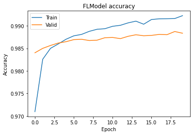

:target{#Federated-Learning-with-Pytorch-Backend}

# Federated Learning with Pytorch Backend

> The following codes are demos only. It’s <strong>NOT for production</strong> due to system security concerns, please <strong>DO NOT</strong> use it directly in production.

In this tutorial, We will walk you through how to use pytorch backend on SecretFlow for federated learning.

- We will use the image clasification task as example
- Use pytorch as backend
- We will show how to use multi fl strategy

If you want to learn more about federated learning, datasets, etc., you can move to [Federated Learning for Image Classification](Federate_Learning_for_Image_Classification.mdx).

<strong>Here we go!</strong>

<Notebook.Cell>
  <Notebook.CodeArea prompt="[1]:" stderr={false} type="input">
    ```python
    %load_ext autoreload
    %autoreload 2
    ```
  </Notebook.CodeArea>
</Notebook.Cell>

<Notebook.Cell>
  <Notebook.CodeArea prompt="[2]:" stderr={false} type="input">
    ```python
    import secretflow as sf

    # Check the version of your SecretFlow
    print('The version of SecretFlow: {}'.format(sf.__version__))

    # In case you have a running secretflow runtime already.
    sf.shutdown()

    sf.init(['alice', 'bob', 'charlie'], address='local')
    alice, bob, charlie = sf.PYU('alice'), sf.PYU('bob'), sf.PYU('charlie')
    ```
  </Notebook.CodeArea>
</Notebook.Cell>

:target{#Here,-let-us-first-introduce-some-concepts}

## Here, let us first introduce some concepts

<LineBlock>
  BaseModule: Similar to the <code>torch.nn.module</code>.

  TorchModel: A wrap class include <code>loss\_fn</code>,<code>optim\_fn</code>,<code>model\_def</code>,<code>metrics</code>.

  metric\_wrapper: Wrap metrics to workers.

  optim\_wrapper: Wrap optim\_fn to workers.

  FLModel: Federated model, use <code>backend</code> to specify which bachend will be use, use <code>strategy</code> to spcify which federated strategy will be use.
</LineBlock>

<Notebook.Cell>
  <Notebook.CodeArea prompt="[3]:" stderr={false} type="input">
    ```python
    from secretflow.ml.nn.utils import BaseModule, TorchModel
    from secretflow.ml.nn.fl.utils import metric_wrapper, optim_wrapper
    from secretflow.ml.nn import FLModel
    from torchmetrics import Accuracy, Precision
    from secretflow.security.aggregation import SecureAggregator
    from secretflow.utils.simulation.datasets import load_mnist
    from torch import nn, optim
    from torch.nn import functional as F
    ```
  </Notebook.CodeArea>
</Notebook.Cell>

When we define the model, we only need to inherit <code>BaseModule</code> instead of <code>nn.Module</code>, and the others are consistent with pytorch.

<Notebook.Cell>
  <Notebook.CodeArea prompt="[4]:" stderr={false} type="input">
    ```python
    class ConvNet(BaseModule):
        """Small ConvNet for MNIST."""

        def __init__(self):
            super(ConvNet, self).__init__()
            self.conv1 = nn.Conv2d(1, 3, kernel_size=3)
            self.fc_in_dim = 192
            self.fc = nn.Linear(self.fc_in_dim, 10)

        def forward(self, x):
            x = F.relu(F.max_pool2d(self.conv1(x), 3))
            x = x.view(-1, self.fc_in_dim)
            x = self.fc(x)
            return F.softmax(x, dim=1)
    ```
  </Notebook.CodeArea>
</Notebook.Cell>

We can continue to use the loss function and optimizer defined in pytorch, the only difference is that we need to wrap it with the wrapper provided in secretflow.

<Notebook.Cell>
  <Notebook.CodeArea prompt="[5]:" stderr={false} type="input">
    ```python
    (train_data, train_label), (test_data, test_label) = load_mnist(
        parts={alice: 0.4, bob: 0.6},
        normalized_x=True,
        categorical_y=True,
        is_torch=True,
    )

    loss_fn = nn.CrossEntropyLoss
    optim_fn = optim_wrapper(optim.Adam, lr=1e-2)
    model_def = TorchModel(
        model_fn=ConvNet,
        loss_fn=loss_fn,
        optim_fn=optim_fn,
        metrics=[
            metric_wrapper(Accuracy, task="multiclass", num_classes=10, average='micro'),
            metric_wrapper(Precision, task="multiclass", num_classes=10, average='micro'),
        ],
    )
    ```
  </Notebook.CodeArea>
</Notebook.Cell>

<Notebook.Cell>
  <Notebook.CodeArea prompt="[6]:" stderr={false} type="input">
    ```python
    device_list = [alice, bob]
    server = charlie
    aggregator = SecureAggregator(server,[alice,bob])

    # spcify params
    fl_model = FLModel(
        server=server,
        device_list=device_list,
        model=model_def,
        aggregator=aggregator,
        strategy='fed_avg_w', # fl strategy
        backend="torch", # backend support ['tensorflow', 'torch']
    )
    ```
  </Notebook.CodeArea>
</Notebook.Cell>

<Notebook.Cell>
  <Notebook.CodeArea prompt="[7]:" stderr={false} type="input">
    ```python
    history = fl_model.fit(
                train_data,
                train_label,
                validation_data=(test_data, test_label),
                epochs=20,
                batch_size=32,
                aggregate_freq=1,
            )
    ```
  </Notebook.CodeArea>
</Notebook.Cell>

<Notebook.Cell>
  <Notebook.CodeArea prompt="[8]:" stderr={false} type="input">
    ```python
    from matplotlib import pyplot as plt

    # Draw accuracy values for training & validation
    plt.plot(history.global_history['multiclassaccuracy'])
    plt.plot(history.global_history['val_multiclassaccuracy'])
    plt.title('FLModel accuracy')
    plt.ylabel('Accuracy')
    plt.xlabel('Epoch')
    plt.legend(['Train', 'Valid'], loc='upper left')
    plt.show()
    ```
  </Notebook.CodeArea>

  <Notebook.FancyOutput prompt="" type="output">
    
  </Notebook.FancyOutput>
</Notebook.Cell>
