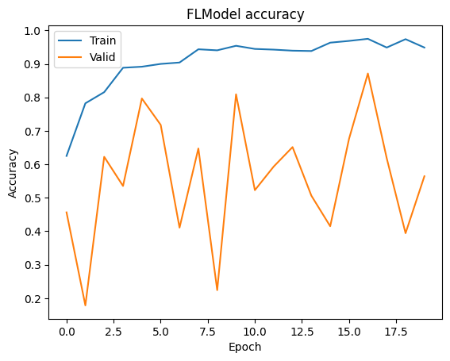
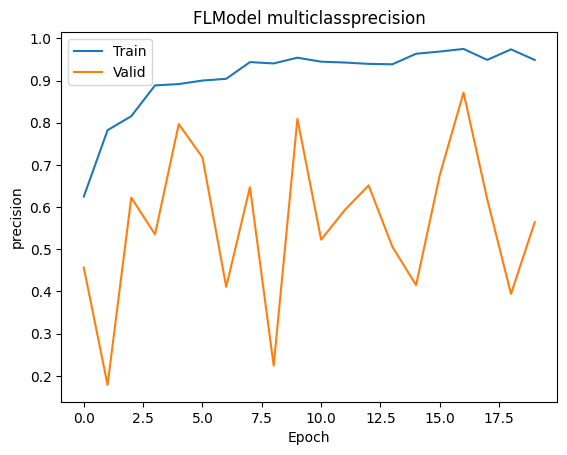
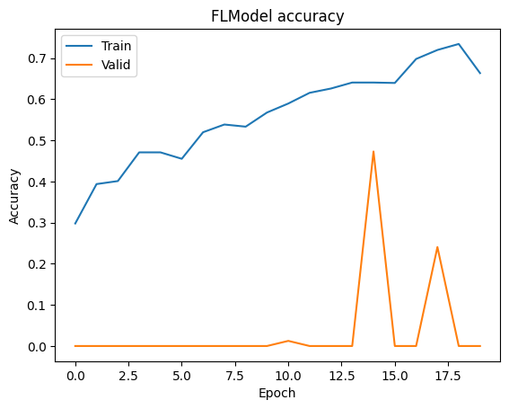
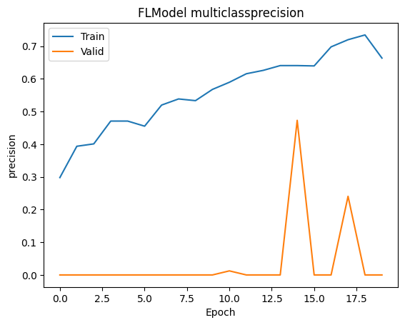

:target{#基于-PyTorch-的预训练模型在隐语联邦学习环境下的微调}

# 基于 PyTorch 的预训练模型在隐语联邦学习环境下的微调

:target{#引言}

## 引言

预训练模型加载和精调在机器学习中非常重要。一般来说，从头训练一个非常大的模型，不仅需要大量的算力资源，同时也需要耗费大量的时间。所以在传统的机器学习中，使用预训练模型，然后针对具体的任务做微调和迁移学习非常普遍。同样的，对于联邦学习来说，如果能够加载预训练模型进行微调和迁移学习，不仅能够节省参与方的算力资源，降低参与方的准入门槛，同时也能够加快模型的学习速度。

得益于隐语联邦学习模块优异的兼容性，使得其可以直接加载 PyTorch 的一系列[预训练模型](https://pytorch.org/vision/master/models.html)；本教程将基于 PyTorch 的 [AlexNet](https://proceedings.neurips.cc/paper_files/paper/2012/file/c399862d3b9d6b76c8436e924a68c45b-Paper.pdf) 的微调教程展现如何基于PyTorch的[预训练模型](https://pytorch.org/vision/master/models/alexnet.html)在SecretFlow的框架下进行微调，充分展现SecretFlow的易用性。

<Notebook.Cell>
  <Notebook.CodeArea prompt="[1]:" stderr={false} type="input">
    ```python
    %load_ext autoreload
    %autoreload 2
    ```
  </Notebook.CodeArea>
</Notebook.Cell>

:target{#加载数据集}

## 加载数据集

:target{#数据集介绍}

### 数据集介绍

Flower 数据集介绍：flower 数据集是一个包含了 5 种花卉（雏菊、蒲公英、玫瑰、向日葵、郁金香）共计 4323 张彩色图片的数据集。每种花卉都有多个角度和不同光照下的图片，每张图片的分辨率为 320x240。这个数据集常用于图像分类和机器学习算法的训练与测试。数据集中每个类别的数量分别是：daisy（633），dandelion（898），rose（641），sunflower（699），tulip（852）

下载地址: [http://download.tensorflow.org/example\_images/flower\_photos.tgz](http://download.tensorflow.org/example_images/flower_photos.tgz)

:target{#下载数据集并解压}

### 下载数据集并解压

<Notebook.Cell>
  <Notebook.CodeArea prompt="[2]:" stderr={false} type="input">
    ```python
    # The TensorFlow interface is reused to download images , and the output is a folder, as shown in the following figure.
    import tempfile
    import tensorflow as tf

    _temp_dir = tempfile.mkdtemp()
    path_to_flower_dataset = tf.keras.utils.get_file(
        "flower_photos",
        "https://secretflow-data.oss-accelerate.aliyuncs.com/datasets/tf_flowers/flower_photos.tgz",
        untar=True,
        cache_dir=_temp_dir,
    )
    ```
  </Notebook.CodeArea>

  <Notebook.CodeArea prompt="" stderr={false} type="output">
    <pre>
      {"Downloading data from https://secretflow-data.oss-accelerate.aliyuncs.com/datasets/tf_flowers/flower_photos.tgz\n67588319/67588319 [==============================] - 3s 0us/step\n"}
    </pre>
  </Notebook.CodeArea>
</Notebook.Cell>

:target{#环境设置}

## 环境设置

首先我们初始化各个参与方。

<Notebook.Cell>
  <Notebook.CodeArea prompt="[3]:" stderr={false} type="input">
    ```python
    import secretflow as sf

    # Check the version of your SecretFlow
    print('The version of SecretFlow: {}'.format(sf.__version__))

    # In case you have a running secretflow runtime already.
    sf.shutdown()
    sf.init(['alice', 'bob', 'charlie'], address="local", log_to_driver=False)
    alice, bob, charlie = sf.PYU('alice'), sf.PYU('bob'), sf.PYU('charlie')
    ```
  </Notebook.CodeArea>

  <Notebook.CodeArea prompt="" stderr={false} type="output">
    <pre>
      {"The version of SecretFlow: 1.2.0.dev20231009\n"}
    </pre>
  </Notebook.CodeArea>
</Notebook.Cell>

:target{#定义Dataloader}

## 定义Dataloader

我们可以参考[PyTorch下的DataBuilder教程](https://www.secretflow.org.cn/docs/secretflow/latest/zh-Hans/tutorial/CustomDataLoaderTorch)定义我们自己的DataBuilder。

<Notebook.Cell>
  <Notebook.CodeArea prompt="[4]:" stderr={false} type="input">
    ```python
    def create_dataset_builder(
        batch_size=32,
        train_split=0.8,
        shuffle=True,
        random_seed=1234,
    ):
        def dataset_builder(x, stage="train"):
            """ """
            import math

            import numpy as np
            from torch.utils.data import DataLoader
            from torch.utils.data.sampler import SubsetRandomSampler
            from torchvision import datasets, transforms

            # Define dataset
            flower_transform = transforms.Compose(
                [
                    transforms.Resize((180, 180)),
                    transforms.ToTensor(),
                ]
            )
            flower_dataset = datasets.ImageFolder(x, transform=flower_transform)
            dataset_size = len(flower_dataset)
            # Define sampler

            indices = list(range(dataset_size))
            if shuffle:
                np.random.seed(random_seed)
                np.random.shuffle(indices)
            split = int(np.floor(train_split * dataset_size))
            train_indices, val_indices = indices[:split], indices[split:]
            train_sampler = SubsetRandomSampler(train_indices)
            valid_sampler = SubsetRandomSampler(val_indices)

            # Define databuilder
            train_loader = DataLoader(
                flower_dataset, batch_size=batch_size, sampler=train_sampler
            )
            valid_loader = DataLoader(
                flower_dataset, batch_size=batch_size, sampler=valid_sampler
            )

            # Return
            if stage == "train":
                train_step_per_epoch = math.ceil(split / batch_size)

                return train_loader, train_step_per_epoch
            elif stage == "eval":
                eval_step_per_epoch = math.ceil((dataset_size - split) / batch_size)
                return valid_loader, eval_step_per_epoch

        return dataset_builder
    ```
  </Notebook.CodeArea>
</Notebook.Cell>

<Notebook.Cell>
  <Notebook.CodeArea prompt="[5]:" stderr={false} type="input">
    ```python
    # prepare dataset dict
    data_builder_dict = {
        alice: create_dataset_builder(
            batch_size=32,
            train_split=0.8,
            shuffle=False,
            random_seed=1234,
        ),
        bob: create_dataset_builder(
            batch_size=32,
            train_split=0.8,
            shuffle=False,
            random_seed=1234,
        ),
    }
    ```
  </Notebook.CodeArea>
</Notebook.Cell>

:target{#加载模型}

## 加载模型

我们只要参照教程里对模型的定义，在函数里完成我们对模型的定义即可；可以看到代码几乎不需要作任何修改，只需要进行适当的封装。并且得益于隐语优异的封装性，我们可以在定义模型很快进行进行训练，而不是需要自行编写训练和测试函数；相反如果我们自行从头开始写整个神经网络结构的话，我们需要自行参考AlexNet的[源代码](https://pytorch.org/vision/master/_modules/torchvision/models/alexnet.html#alexnet)，将其适配在隐语的`secretflow.ml.nn.utils.BaseModule`;为便于对比，我们分别给出两种实现方式：

:target{#加载预训练模型}

### 加载预训练模型

<Notebook.Cell>
  <Notebook.CodeArea prompt="[6]:" stderr={false} type="input">
    ```python
    from secretflow.ml.nn.utils import BaseModule
    from torchvision.models import alexnet
    from torch import nn


    class AlexNet(BaseModule):
        def __init__(self, *args, **kwargs) -> None:
            super().__init__(*args, **kwargs)
            self.finetune_net = alexnet(weights='IMAGENET1K_V1')
            self.finetune_net.classifier[6] = nn.Linear(4096, 5)
            nn.init.xavier_uniform_(self.finetune_net.classifier[6].weight)

            for named_param in self.finetune_net.named_parameters():
                if 'classifier' in named_param[0]:
                    print('Will train', named_param[0])
                    named_param[1].requires_grad = True
                else:
                    print('Won\'t train', named_param[0])
                    named_param[1].requires_grad = False

        def forward(self, xb):
            return self.finetune_net(xb)
    ```
  </Notebook.CodeArea>
</Notebook.Cell>

:target{#自行编写网络结构}

### 自行编写网络结构

<Notebook.Cell>
  <Notebook.CodeArea prompt="[7]:" stderr={false} type="input">
    ```python
    import torch


    class handy_AlexNet(BaseModule):
        def __init__(self, num_classes: int = 5, dropout: float = 0.5, **kwargs) -> None:
            super().__init__(**kwargs)
            self.features = nn.Sequential(
                nn.Conv2d(3, 64, kernel_size=11, stride=4, padding=2),
                nn.ReLU(inplace=True),
                nn.MaxPool2d(kernel_size=3, stride=2),
                nn.Conv2d(64, 192, kernel_size=5, padding=2),
                nn.ReLU(inplace=True),
                nn.MaxPool2d(kernel_size=3, stride=2),
                nn.Conv2d(192, 384, kernel_size=3, padding=1),
                nn.ReLU(inplace=True),
                nn.Conv2d(384, 256, kernel_size=3, padding=1),
                nn.ReLU(inplace=True),
                nn.Conv2d(256, 256, kernel_size=3, padding=1),
                nn.ReLU(inplace=True),
                nn.MaxPool2d(kernel_size=3, stride=2),
            )
            self.avgpool = nn.AdaptiveAvgPool2d((6, 6))
            self.classifier = nn.Sequential(
                nn.Dropout(p=dropout),
                nn.Linear(256 * 6 * 6, 4096),
                nn.ReLU(inplace=True),
                nn.Dropout(p=dropout),
                nn.Linear(4096, 4096),
                nn.ReLU(inplace=True),
                nn.Linear(4096, num_classes),
            )

            for named_param in self.features.named_parameters():
                named_param[1].requires_grad = True

            for named_param in self.classifier.named_parameters():
                named_param[1].requires_grad = True

        def forward(self, x: torch.Tensor) -> torch.Tensor:
            x = self.features(x)
            x = self.avgpool(x)
            x = torch.flatten(x, 1)
            x = self.classifier(x)
            return x
    ```
  </Notebook.CodeArea>
</Notebook.Cell>

<Notebook.Cell>
  <Notebook.CodeArea prompt="[8]:" stderr={false} type="input">
    ```python
    from secretflow.ml.nn import FLModel
    from secretflow.security.aggregation import SecureAggregator
    from torch import nn, optim
    from torchmetrics import Accuracy, Precision
    from secretflow.ml.nn.fl.utils import metric_wrapper, optim_wrapper
    from secretflow.ml.nn.utils import TorchModel
    ```
  </Notebook.CodeArea>
</Notebook.Cell>

:target{#定义-FLModel-并且训练}

## 定义 FLModel 并且训练

:target{#基于预训练模型定义-Torch-后端的-FLModel}

### 基于预训练模型定义 Torch 后端的 FLModel

<Notebook.Cell>
  <Notebook.CodeArea prompt="[9]:" stderr={false} type="input">
    ```python
    device_list = [alice, bob]
    aggregator = SecureAggregator(charlie, [alice, bob])

    data = {
        alice: path_to_flower_dataset,
        bob: path_to_flower_dataset,
    }
    # prepare model
    num_classes = 5


    # torch model
    loss_fn = nn.CrossEntropyLoss
    optim_fn = optim_wrapper(optim.Adam, lr=1e-3)
    model_def = TorchModel(
        model_fn=AlexNet,
        loss_fn=loss_fn,
        optim_fn=optim_fn,
        metrics=[
            metric_wrapper(
                Accuracy, task="multiclass", num_classes=num_classes, average='micro'
            ),
            metric_wrapper(
                Precision, task="multiclass", num_classes=num_classes, average='micro'
            ),
        ],
    )

    fed_model = FLModel(
        device_list=device_list,
        model=model_def,
        aggregator=aggregator,
        backend="torch",
        strategy="fed_avg_w",
        random_seed=1234,
    )
    ```
  </Notebook.CodeArea>
</Notebook.Cell>

:target{#基于预训练模型的-FLModel-开始训练}

### 基于预训练模型的 FLModel 开始训练

<Notebook.Cell>
  <Notebook.CodeArea prompt="[10]:" stderr={false} type="input">
    ```python
    history = fed_model.fit(
        data,
        None,
        validation_data=data,
        epochs=20,
        batch_size=32,
        aggregate_freq=2,
        sampler_method="batch",
        random_seed=1234,
        dp_spent_step_freq=1,
        dataset_builder=data_builder_dict,
    )
    ```
  </Notebook.CodeArea>
</Notebook.Cell>

:target{#训练结果可视化}

### 训练结果可视化

<Notebook.Cell>
  <Notebook.CodeArea prompt="[11]:" stderr={false} type="input">
    ```python
    from matplotlib import pyplot as plt

    # Draw accuracy values for training & validation
    plt.plot(history.global_history['multiclassaccuracy'])
    plt.plot(history.global_history['val_multiclassaccuracy'])
    plt.title('FLModel accuracy')
    plt.ylabel('Accuracy')
    plt.xlabel('Epoch')
    plt.legend(['Train', 'Valid'], loc='upper left')
    plt.show()

    # Draw precision for training & validation
    plt.plot(history.global_history['multiclassprecision'])
    plt.plot(history.global_history['val_multiclassprecision'])
    plt.title('FLModel multiclassprecision')
    plt.ylabel('precision')
    plt.xlabel('Epoch')
    plt.legend(['Train', 'Valid'], loc='upper left')
    plt.show()
    ```
  </Notebook.CodeArea>

  <Notebook.FancyOutput prompt="" type="output">
    
  </Notebook.FancyOutput>

  <Notebook.FancyOutput prompt="" type="output">
    
  </Notebook.FancyOutput>
</Notebook.Cell>

:target{#基于自编写网络定义-Torch-后端的-FLModel}

### 基于自编写网络定义 Torch 后端的 FLModel

<Notebook.Cell>
  <Notebook.CodeArea prompt="[12]:" stderr={false} type="input">
    ```python
    model_def = TorchModel(
        model_fn=handy_AlexNet,
        loss_fn=loss_fn,
        optim_fn=optim_fn,
        metrics=[
            metric_wrapper(
                Accuracy, task="multiclass", num_classes=num_classes, average='micro'
            ),
            metric_wrapper(
                Precision, task="multiclass", num_classes=num_classes, average='micro'
            ),
        ],
    )

    fed_model = FLModel(
        device_list=device_list,
        model=model_def,
        aggregator=aggregator,
        backend="torch",
        strategy="fed_avg_w",
        random_seed=1234,
    )
    ```
  </Notebook.CodeArea>
</Notebook.Cell>

:target{#基于自编写网络模型的-FLModel-开始训练}

### 基于自编写网络模型的 FLModel 开始训练

<Notebook.Cell>
  <Notebook.CodeArea prompt="[13]:" stderr={false} type="input">
    ```python
    history = fed_model.fit(
        data,
        None,
        validation_data=data,
        epochs=20,
        batch_size=32,
        aggregate_freq=2,
        sampler_method="batch",
        random_seed=1234,
        dp_spent_step_freq=1,
        dataset_builder=data_builder_dict,
    )
    ```
  </Notebook.CodeArea>
</Notebook.Cell>

:target{#id13}

### 训练结果可视化

<Notebook.Cell>
  <Notebook.CodeArea prompt="[14]:" stderr={false} type="input">
    ```python
    # Draw accuracy values for training & validation
    plt.plot(history.global_history['multiclassaccuracy'])
    plt.plot(history.global_history['val_multiclassaccuracy'])
    plt.title('FLModel accuracy')
    plt.ylabel('Accuracy')
    plt.xlabel('Epoch')
    plt.legend(['Train', 'Valid'], loc='upper left')
    plt.show()

    # Draw precision for training & validation
    plt.plot(history.global_history['multiclassprecision'])
    plt.plot(history.global_history['val_multiclassprecision'])
    plt.title('FLModel multiclassprecision')
    plt.ylabel('precision')
    plt.xlabel('Epoch')
    plt.legend(['Train', 'Valid'], loc='upper left')
    plt.show()
    ```
  </Notebook.CodeArea>

  <Notebook.FancyOutput prompt="" type="output">
    
  </Notebook.FancyOutput>

  <Notebook.FancyOutput prompt="" type="output">
    
  </Notebook.FancyOutput>
</Notebook.Cell>

可以看到，在同样的任务，同样的模型上，我们加载预训练模型，不仅能省时省力，还能获得更好的模型性能。

:target{#小结}

## 小结

隐语能够无缝地兼容基于 PyTorch 预训练模型，我们可以不需要自己再重新写出复杂网络的模型结构，这对于大型网络结构可以起到省时省力的效果。并且通过加载预训练模型的权重，可以让我们的模型性能更优秀。

本篇教程，我们以 AlexNet 为例介绍了如何在隐语的联邦学习模式下基于直接加载 PyTorch 的[预训练模型](https://pytorch.org/vision/stable/models.html)，通过直接加载预训练模型，我们能够获得： - 不需要再次编写复杂模型的结构代码 - 基于预训练模型进行微调和迁移学习 - 使用预训练权重模型能够使得联邦模型获得更好的性能
