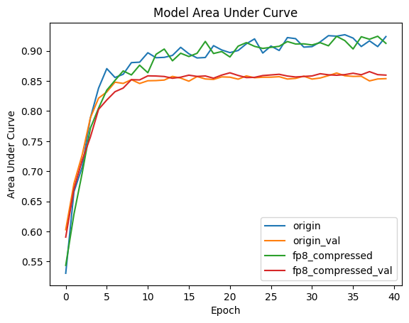
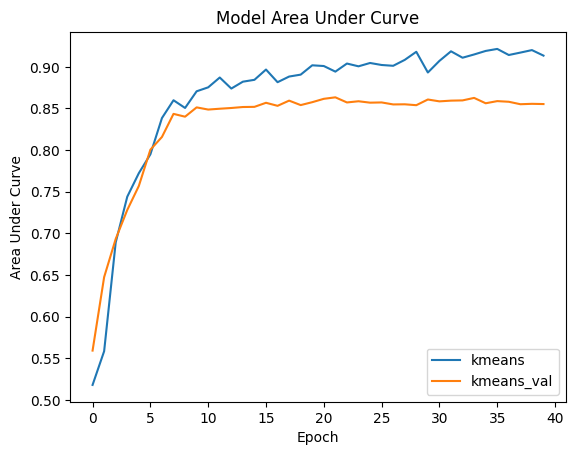
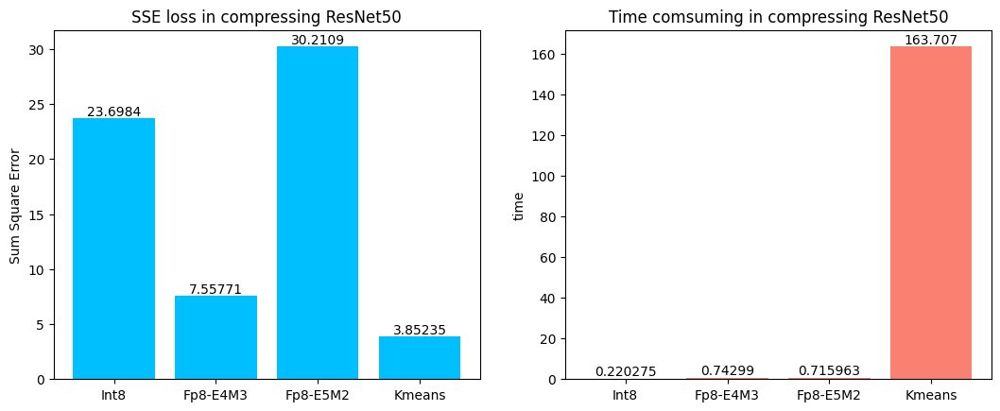

:target{#在拆分学习中使用通讯压缩方法}

# 在拆分学习中使用通讯压缩方法

> 以下代码仅作为示例，请勿在生产环境直接使用。

> 本示例基于基于“拆分学习：银行营销”教程制作，建议先观看那个教程。

在拆分学习中，由于模型被拆分在多个设备当中，进行训练的时候，各方需要对特征和梯度进行多次传输，带来很高的网络通讯消耗。为了减少通讯过程中的数据量，可以进行一些压缩处理。

SecretFlow提供了Compressor对拆分学习中的数据进行压缩。同时也提供了多种基类，可以在此基础上实现自己的压缩算法。

下面我们来试试一些算法的可用性，首先，我们在secretflow环境中创造2个实体alice和bob。

<Notebook.Cell>
  <Notebook.CodeArea prompt="[1]:" stderr={false} type="input">
    ```python
    import secretflow as sf

    sf.shutdown()
    sf.init(['alice', 'bob'], address='local')
    alice, bob = sf.PYU('alice'), sf.PYU('bob')
    ```
  </Notebook.CodeArea>
</Notebook.Cell>

接下来我们准备要学习的数据。

我们使用“拆分学习：银行营销”中的数据准备和处理方法，下载银行营销数据集并进行处理。alice和bob的角色和之前的教程完全相同：

<Notebook.Cell>
  <Notebook.CodeArea prompt="[2]:" stderr={false} type="input">
    ```python
    from secretflow.utils.simulation.datasets import load_bank_marketing
    from secretflow.preprocessing.scaler import MinMaxScaler
    from secretflow.preprocessing.encoder import LabelEncoder
    from secretflow.data.split import train_test_split

    random_state = 1234

    data = load_bank_marketing(parts={alice: (0, 4), bob: (4, 16)}, axis=1)
    label = load_bank_marketing(parts={alice: (16, 17)}, axis=1)

    encoder = LabelEncoder()
    data['job'] = encoder.fit_transform(data['job'])
    data['marital'] = encoder.fit_transform(data['marital'])
    data['education'] = encoder.fit_transform(data['education'])
    data['default'] = encoder.fit_transform(data['default'])
    data['housing'] = encoder.fit_transform(data['housing'])
    data['loan'] = encoder.fit_transform(data['loan'])
    data['contact'] = encoder.fit_transform(data['contact'])
    data['poutcome'] = encoder.fit_transform(data['poutcome'])
    data['month'] = encoder.fit_transform(data['month'])
    label = encoder.fit_transform(label)

    scaler = MinMaxScaler()
    data = scaler.fit_transform(data)

    train_data, test_data = train_test_split(
        data, train_size=0.8, random_state=random_state
    )
    train_label, test_label = train_test_split(
        label, train_size=0.8, random_state=random_state
    )
    ```
  </Notebook.CodeArea>
</Notebook.Cell>

接下来我们创建联邦模型，同样地，我们使用“拆分学习：银行营销”中的建模，构建出base\_model和fuse\_model，然后就可以定义SLModel用于训练：

<Notebook.Cell>
  <Notebook.CodeArea prompt="[3]:" stderr={false} type="input">
    ```python
    def create_base_model(input_dim, output_dim, name='base_model'):
        # Create model
        def create_model():
            from tensorflow import keras
            from tensorflow.keras import layers
            import tensorflow as tf

            model = keras.Sequential(
                [
                    keras.Input(shape=input_dim),
                    layers.Dense(100, activation="relu"),
                    layers.Dense(output_dim, activation="relu"),
                ]
            )
            # Compile model
            model.summary()
            model.compile(
                loss='binary_crossentropy',
                optimizer='adam',
                metrics=["accuracy", tf.keras.metrics.AUC()],
            )
            return model

        return create_model


    # prepare model
    hidden_size = 64

    model_base_alice = create_base_model(4, hidden_size)
    model_base_bob = create_base_model(12, hidden_size)


    def create_fuse_model(input_dim, output_dim, party_nums, name='fuse_model'):
        def create_model():
            from tensorflow import keras
            from tensorflow.keras import layers
            import tensorflow as tf

            # input
            input_layers = []
            for i in range(party_nums):
                input_layers.append(
                    keras.Input(
                        input_dim,
                    )
                )

            merged_layer = layers.concatenate(input_layers)
            fuse_layer = layers.Dense(64, activation='relu')(merged_layer)
            output = layers.Dense(output_dim, activation='sigmoid')(fuse_layer)

            model = keras.Model(inputs=input_layers, outputs=output)
            model.summary()

            model.compile(
                loss='binary_crossentropy',
                optimizer='adam',
                metrics=["accuracy", tf.keras.metrics.AUC()],
            )
            return model

        return create_model


    model_fuse = create_fuse_model(input_dim=hidden_size, party_nums=2, output_dim=1)

    base_model_dict = {alice: model_base_alice, bob: model_base_bob}


    from secretflow.ml.nn import SLModel

    sl_model_origin = SLModel(
        base_model_dict=base_model_dict,
        device_y=alice,
        model_fuse=model_fuse,
    )
    ```
  </Notebook.CodeArea>
</Notebook.Cell>

:target{#使用通讯压缩算法}

## 使用通讯压缩算法

SecretFlow提供了Compressor，里面实现了各种基础的通讯压缩算法，可以直接使用。

只要导入想使用的压缩算法并实例化,定义SLModel时将实例化的方法作为参数传入就可以在训练中实现通讯压缩。

我们以QuantizedFP为例，该算法会将浮点数量化到8位以降低传输消耗。

<Notebook.Cell>
  <Notebook.CodeArea prompt="[4]:" stderr={false} type="input">
    ```python
    from secretflow.utils.compressor import QuantizedFP

    qfp = QuantizedFP()

    sl_model_compress = SLModel(
        base_model_dict=base_model_dict,
        device_y=alice,
        model_fuse=model_fuse,
        compressor=qfp,  # 在这里传入实例化的compressor算法
    )
    ```
  </Notebook.CodeArea>
</Notebook.Cell>

我们分别对没有使用通讯压缩的模型和使用了量化压缩的模型进行训练，并把训练轮次拉高到40轮，看看效果如何。

<Notebook.Cell>
  <Notebook.CodeArea prompt="[5]:" stderr={false} type="input">
    ```python
    histories = []
    for sl_model in [sl_model_origin, sl_model_compress]:
        history = sl_model.fit(
            train_data,
            train_label,
            validation_data=(test_data, test_label),
            epochs=40,
            batch_size=128,
            shuffle=True,
            verbose=1,
            validation_freq=1,
        )

        histories.append(history)
    ```
  </Notebook.CodeArea>

  <Notebook.CodeArea prompt="" stderr={false} type="output">
    <pre>
      <span className="ansi-cyan-fg">{"(PYUSLTFModel pid=28114)"}</span>{" Model: \"sequential\"\n"}<span className="ansi-cyan-fg">{"(PYUSLTFModel pid=28114)"}</span>{" _________________________________________________________________\n"}<span className="ansi-cyan-fg">{"(PYUSLTFModel pid=28114)"}</span>{"  Layer (type)                Output Shape              Param #\n"}<span className="ansi-cyan-fg">{"(PYUSLTFModel pid=28114)"}</span>{" =================================================================\n"}<span className="ansi-cyan-fg">{"(PYUSLTFModel pid=28114)"}</span>{"  dense (Dense)               (None, 100)               500\n"}<span className="ansi-cyan-fg">{"(PYUSLTFModel pid=28114)"}</span><span className="ansi-cyan-fg">{"(PYUSLTFModel pid=28114)"}</span>{"  dense_1 (Dense)             (None, 64)                6464\n"}<span className="ansi-cyan-fg">{"(PYUSLTFModel pid=28114)"}</span><span className="ansi-cyan-fg">{"(PYUSLTFModel pid=28114)"}</span>{" =================================================================\n"}<span className="ansi-cyan-fg">{"(PYUSLTFModel pid=28114)"}</span>{" Total params: 6,964\n"}<span className="ansi-cyan-fg">{"(PYUSLTFModel pid=28114)"}</span>{" Trainable params: 6,964\n"}<span className="ansi-cyan-fg">{"(PYUSLTFModel pid=28114)"}</span>{" Non-trainable params: 0\n"}<span className="ansi-cyan-fg">{"(PYUSLTFModel pid=28114)"}</span>{" _________________________________________________________________\n"}<span className="ansi-cyan-fg">{"(PYUSLTFModel pid=28114)"}</span>{" Model: \"model\"\n"}<span className="ansi-cyan-fg">{"(PYUSLTFModel pid=28114)"}</span>{" __________________________________________________________________________________________________\n"}<span className="ansi-cyan-fg">{"(PYUSLTFModel pid=28114)"}</span>{"  Layer (type)                   Output Shape         Param #     Connected to\n"}<span className="ansi-cyan-fg">{"(PYUSLTFModel pid=28114)"}</span>{" ==================================================================================================\n"}<span className="ansi-cyan-fg">{"(PYUSLTFModel pid=28114)"}</span>{"  input_2 (InputLayer)           [(None, 64)]         0           []\n"}<span className="ansi-cyan-fg">{"(PYUSLTFModel pid=28114)"}</span><span className="ansi-cyan-fg">{"(PYUSLTFModel pid=28114)"}</span>{"  input_3 (InputLayer)           [(None, 64)]         0           []\n"}<span className="ansi-cyan-fg">{"(PYUSLTFModel pid=28114)"}</span><span className="ansi-cyan-fg">{"(PYUSLTFModel pid=28114)"}</span>{"  concatenate (Concatenate)      (None, 128)          0           ['input_2[0][0]',\n"}<span className="ansi-cyan-fg">{"(PYUSLTFModel pid=28114)"}</span>{"                                                                   'input_3[0][0]']\n"}<span className="ansi-cyan-fg">{"(PYUSLTFModel pid=28114)"}</span><span className="ansi-cyan-fg">{"(PYUSLTFModel pid=28114)"}</span>{"  dense_2 (Dense)                (None, 64)           8256        ['concatenate[0][0]']\n"}<span className="ansi-cyan-fg">{"(PYUSLTFModel pid=28114)"}</span><span className="ansi-cyan-fg">{"(PYUSLTFModel pid=28114)"}</span>{"  dense_3 (Dense)                (None, 1)            65          ['dense_2[0][0]']\n"}<span className="ansi-cyan-fg">{"(PYUSLTFModel pid=28114)"}</span><span className="ansi-cyan-fg">{"(PYUSLTFModel pid=28114)"}</span>{" ==================================================================================================\n"}<span className="ansi-cyan-fg">{"(PYUSLTFModel pid=28114)"}</span>{" Total params: 8,321\n"}<span className="ansi-cyan-fg">{"(PYUSLTFModel pid=28114)"}</span>{" Trainable params: 8,321\n"}<span className="ansi-cyan-fg">{"(PYUSLTFModel pid=28114)"}</span>{" Non-trainable params: 0\n"}<span className="ansi-cyan-fg">{"(PYUSLTFModel pid=28114)"}</span>{" __________________________________________________________________________________________________\n"}
    </pre>
  </Notebook.CodeArea>

  <Notebook.CodeArea prompt="" stderr={false} type="output">
    <pre>
      <span className="ansi-cyan-fg">{"(PYUSLTFModel pid=28127)"}</span>{" Model: \"sequential\"\n"}<span className="ansi-cyan-fg">{"(PYUSLTFModel pid=28127)"}</span>{" _________________________________________________________________\n"}<span className="ansi-cyan-fg">{"(PYUSLTFModel pid=28127)"}</span>{"  Layer (type)                Output Shape              Param #\n"}<span className="ansi-cyan-fg">{"(PYUSLTFModel pid=28127)"}</span>{" =================================================================\n"}<span className="ansi-cyan-fg">{"(PYUSLTFModel pid=28127)"}</span>{"  dense (Dense)               (None, 100)               1300\n"}<span className="ansi-cyan-fg">{"(PYUSLTFModel pid=28127)"}</span><span className="ansi-cyan-fg">{"(PYUSLTFModel pid=28127)"}</span>{"  dense_1 (Dense)             (None, 64)                6464\n"}<span className="ansi-cyan-fg">{"(PYUSLTFModel pid=28127)"}</span><span className="ansi-cyan-fg">{"(PYUSLTFModel pid=28127)"}</span>{" =================================================================\n"}<span className="ansi-cyan-fg">{"(PYUSLTFModel pid=28127)"}</span>{" Total params: 7,764\n"}<span className="ansi-cyan-fg">{"(PYUSLTFModel pid=28127)"}</span>{" Trainable params: 7,764\n"}<span className="ansi-cyan-fg">{"(PYUSLTFModel pid=28127)"}</span>{" Non-trainable params: 0\n"}<span className="ansi-cyan-fg">{"(PYUSLTFModel pid=28127)"}</span>{" _________________________________________________________________\n"}
    </pre>
  </Notebook.CodeArea>

  <Notebook.CodeArea prompt="" stderr={false} type="output">
    <pre>
      <span className="ansi-cyan-fg">{"(PYUSLTFModel pid=28181)"}</span>{" Model: \"sequential\"\n"}<span className="ansi-cyan-fg">{"(PYUSLTFModel pid=28181)"}</span>{" _________________________________________________________________\n"}<span className="ansi-cyan-fg">{"(PYUSLTFModel pid=28181)"}</span>{"  Layer (type)                Output Shape              Param #\n"}<span className="ansi-cyan-fg">{"(PYUSLTFModel pid=28181)"}</span>{" =================================================================\n"}<span className="ansi-cyan-fg">{"(PYUSLTFModel pid=28181)"}</span>{"  dense (Dense)               (None, 100)               500\n"}<span className="ansi-cyan-fg">{"(PYUSLTFModel pid=28181)"}</span><span className="ansi-cyan-fg">{"(PYUSLTFModel pid=28181)"}</span>{"  dense_1 (Dense)             (None, 64)                6464\n"}<span className="ansi-cyan-fg">{"(PYUSLTFModel pid=28181)"}</span><span className="ansi-cyan-fg">{"(PYUSLTFModel pid=28181)"}</span>{" =================================================================\n"}<span className="ansi-cyan-fg">{"(PYUSLTFModel pid=28181)"}</span>{" Total params: 6,964\n"}<span className="ansi-cyan-fg">{"(PYUSLTFModel pid=28181)"}</span>{" Trainable params: 6,964\n"}<span className="ansi-cyan-fg">{"(PYUSLTFModel pid=28181)"}</span>{" Non-trainable params: 0\n"}<span className="ansi-cyan-fg">{"(PYUSLTFModel pid=28181)"}</span>{" _________________________________________________________________\n"}<span className="ansi-cyan-fg">{"(PYUSLTFModel pid=28181)"}</span>{" Model: \"model\"\n"}<span className="ansi-cyan-fg">{"(PYUSLTFModel pid=28181)"}</span>{" __________________________________________________________________________________________________\n"}<span className="ansi-cyan-fg">{"(PYUSLTFModel pid=28181)"}</span>{"  Layer (type)                   Output Shape         Param #     Connected to\n"}<span className="ansi-cyan-fg">{"(PYUSLTFModel pid=28181)"}</span>{" ==================================================================================================\n"}<span className="ansi-cyan-fg">{"(PYUSLTFModel pid=28181)"}</span>{"  input_2 (InputLayer)           [(None, 64)]         0           []\n"}<span className="ansi-cyan-fg">{"(PYUSLTFModel pid=28181)"}</span><span className="ansi-cyan-fg">{"(PYUSLTFModel pid=28181)"}</span>{"  input_3 (InputLayer)           [(None, 64)]         0           []\n"}<span className="ansi-cyan-fg">{"(PYUSLTFModel pid=28181)"}</span><span className="ansi-cyan-fg">{"(PYUSLTFModel pid=28181)"}</span>{"  concatenate (Concatenate)      (None, 128)          0           ['input_2[0][0]',\n"}<span className="ansi-cyan-fg">{"(PYUSLTFModel pid=28181)"}</span>{"                                                                   'input_3[0][0]']\n"}<span className="ansi-cyan-fg">{"(PYUSLTFModel pid=28181)"}</span><span className="ansi-cyan-fg">{"(PYUSLTFModel pid=28181)"}</span>{"  dense_2 (Dense)                (None, 64)           8256        ['concatenate[0][0]']\n"}<span className="ansi-cyan-fg">{"(PYUSLTFModel pid=28181)"}</span><span className="ansi-cyan-fg">{"(PYUSLTFModel pid=28181)"}</span>{"  dense_3 (Dense)                (None, 1)            65          ['dense_2[0][0]']\n"}<span className="ansi-cyan-fg">{"(PYUSLTFModel pid=28181)"}</span><span className="ansi-cyan-fg">{"(PYUSLTFModel pid=28181)"}</span>{" ==================================================================================================\n"}<span className="ansi-cyan-fg">{"(PYUSLTFModel pid=28181)"}</span>{" Total params: 8,321\n"}<span className="ansi-cyan-fg">{"(PYUSLTFModel pid=28181)"}</span>{" Trainable params: 8,321\n"}<span className="ansi-cyan-fg">{"(PYUSLTFModel pid=28181)"}</span>{" Non-trainable params: 0\n"}<span className="ansi-cyan-fg">{"(PYUSLTFModel pid=28181)"}</span>{" __________________________________________________________________________________________________\n"}
    </pre>
  </Notebook.CodeArea>

  <Notebook.CodeArea prompt="" stderr={false} type="output">
    <pre>
      <span className="ansi-cyan-fg">{"(PYUSLTFModel pid=28235)"}</span>{" Model: \"sequential\"\n"}<span className="ansi-cyan-fg">{"(PYUSLTFModel pid=28235)"}</span>{" _________________________________________________________________\n"}<span className="ansi-cyan-fg">{"(PYUSLTFModel pid=28235)"}</span>{"  Layer (type)                Output Shape              Param #\n"}<span className="ansi-cyan-fg">{"(PYUSLTFModel pid=28235)"}</span>{" =================================================================\n"}<span className="ansi-cyan-fg">{"(PYUSLTFModel pid=28235)"}</span>{"  dense (Dense)               (None, 100)               1300\n"}<span className="ansi-cyan-fg">{"(PYUSLTFModel pid=28235)"}</span><span className="ansi-cyan-fg">{"(PYUSLTFModel pid=28235)"}</span>{"  dense_1 (Dense)             (None, 64)                6464\n"}<span className="ansi-cyan-fg">{"(PYUSLTFModel pid=28235)"}</span><span className="ansi-cyan-fg">{"(PYUSLTFModel pid=28235)"}</span>{" =================================================================\n"}<span className="ansi-cyan-fg">{"(PYUSLTFModel pid=28235)"}</span>{" Total params: 7,764\n"}<span className="ansi-cyan-fg">{"(PYUSLTFModel pid=28235)"}</span>{" Trainable params: 7,764\n"}<span className="ansi-cyan-fg">{"(PYUSLTFModel pid=28235)"}</span>{" Non-trainable params: 0\n"}<span className="ansi-cyan-fg">{"(PYUSLTFModel pid=28235)"}</span>{" _________________________________________________________________\n"}
    </pre>
  </Notebook.CodeArea>
</Notebook.Cell>

<Notebook.Cell>
  <Notebook.CodeArea prompt="[6]:" stderr={false} type="input">
    ```python
    import matplotlib.pyplot as plt

    for history in histories:
        plt.plot(history['train_auc_1'])
        plt.plot(history['val_auc_1'])

    plt.title('Model Area Under Curve')
    plt.ylabel('Area Under Curve')
    plt.xlabel('Epoch')
    plt.legend(
        ['origin', 'origin_val', 'fp8_compressed', 'fp8_compressed_val'], loc='lower right'
    )
    plt.show()
    ```
  </Notebook.CodeArea>

  <Notebook.FancyOutput prompt="" type="output">
    
  </Notebook.FancyOutput>
</Notebook.Cell>

可以看到，两个模型的验证集auc均在0.85左右波动，使用8位量化对此任务的训练精度影响不大，而理论通讯消耗减少了3/4（从32位减少到了8位）。

:target{#自定义通讯压缩算法}

## 自定义通讯压缩算法

我们也可以自定义一个压缩算法，SecretFlow提供了SparseCompressor和QuantizedCompressor基类，对应稀疏化方法和量化压缩方法。

这里以量化压缩方法为例，来实现一个基于K-means的压缩算法。

K-means压缩论文是”Deep Compression: Compressing Deep Neural Networks with Pruning, Trained Quantization and Huffman Coding”提出的方法中的其中一个步骤，其思想是把对传输参数进行聚类，保存聚类中心的值，然后把其他值用聚类序号来表示。

继承QuantizedCompressor后，只要实现\_compress\_one（将一个numpy向量打包为QuantizedData） 和 \_decompress\_one（将QuantizedData还原回numpy向量）函数即可。

<Notebook.Cell>
  <Notebook.CodeArea prompt="[7]:" stderr={false} type="input">
    ```python
    from secretflow.utils.compressor import QuantizedCompressor, QuantizedData
    import numpy as np


    class QuantizedMyKmeans(QuantizedCompressor):
        def __init__(self, quant_bits: int = 8):
            super().__init__(quant_bits)
            from sklearn.cluster import KMeans

            self.km = KMeans(2**quant_bits, n_init=1, max_iter=50)

        def _compress_one(self, data: np.ndarray) -> QuantizedData:
            ori_shape = data.shape
            self.km.fit(np.expand_dims(data.flatten(), axis=1))
            quantized = self.km.labels_ - (1 << (self.quant_bits - 1))
            quantized = np.reshape(quantized, ori_shape)
            q = self.km.cluster_centers_

            return QuantizedData(quantized.astype(self.np_type), q, None, data.dtype)

        def _decompress_one(self, data: QuantizedData) -> np.ndarray:
            label = data.data.astype(data.origin_type) + (1 << (self.quant_bits - 1))
            dequantized = np.zeros_like(label)
            for i in range(data.q1.shape[0]):
                dequantized[label == i] = data.q1[i]

            return dequantized
    ```
  </Notebook.CodeArea>
</Notebook.Cell>

我们来实例化这个算法，再跑一遍联邦学习模型：

<Notebook.Cell>
  <Notebook.CodeArea prompt="[8]:" stderr={false} type="input">
    ```python
    qkm = QuantizedMyKmeans()

    sl_model_kmeans = SLModel(
        base_model_dict=base_model_dict,
        device_y=alice,
        model_fuse=model_fuse,
        compressor=qkm,
    )

    history_kmeans = sl_model_kmeans.fit(
        train_data,
        train_label,
        validation_data=(test_data, test_label),
        epochs=40,
        batch_size=128,
        shuffle=True,
        verbose=1,
        validation_freq=1,
    )
    ```
  </Notebook.CodeArea>

  <Notebook.CodeArea prompt="" stderr={false} type="output">
    <pre>
      <span className="ansi-cyan-fg">{"(PYUSLTFModel pid=30232)"}</span>{" Model: \"sequential\"\n"}<span className="ansi-cyan-fg">{"(PYUSLTFModel pid=30232)"}</span>{" _________________________________________________________________\n"}<span className="ansi-cyan-fg">{"(PYUSLTFModel pid=30232)"}</span>{"  Layer (type)                Output Shape              Param #\n"}<span className="ansi-cyan-fg">{"(PYUSLTFModel pid=30232)"}</span>{" =================================================================\n"}<span className="ansi-cyan-fg">{"(PYUSLTFModel pid=30232)"}</span>{"  dense (Dense)               (None, 100)               500\n"}<span className="ansi-cyan-fg">{"(PYUSLTFModel pid=30232)"}</span><span className="ansi-cyan-fg">{"(PYUSLTFModel pid=30232)"}</span>{"  dense_1 (Dense)             (None, 64)                6464\n"}<span className="ansi-cyan-fg">{"(PYUSLTFModel pid=30232)"}</span><span className="ansi-cyan-fg">{"(PYUSLTFModel pid=30232)"}</span>{" =================================================================\n"}<span className="ansi-cyan-fg">{"(PYUSLTFModel pid=30232)"}</span>{" Total params: 6,964\n"}<span className="ansi-cyan-fg">{"(PYUSLTFModel pid=30232)"}</span>{" Trainable params: 6,964\n"}<span className="ansi-cyan-fg">{"(PYUSLTFModel pid=30232)"}</span>{" Non-trainable params: 0\n"}<span className="ansi-cyan-fg">{"(PYUSLTFModel pid=30232)"}</span>{" _________________________________________________________________\n"}<span className="ansi-cyan-fg">{"(PYUSLTFModel pid=30232)"}</span>{" Model: \"model\"\n"}<span className="ansi-cyan-fg">{"(PYUSLTFModel pid=30232)"}</span>{" __________________________________________________________________________________________________\n"}<span className="ansi-cyan-fg">{"(PYUSLTFModel pid=30232)"}</span>{"  Layer (type)                   Output Shape         Param #     Connected to\n"}<span className="ansi-cyan-fg">{"(PYUSLTFModel pid=30232)"}</span>{" ==================================================================================================\n"}<span className="ansi-cyan-fg">{"(PYUSLTFModel pid=30232)"}</span>{"  input_2 (InputLayer)           [(None, 64)]         0           []\n"}<span className="ansi-cyan-fg">{"(PYUSLTFModel pid=30232)"}</span><span className="ansi-cyan-fg">{"(PYUSLTFModel pid=30232)"}</span>{"  input_3 (InputLayer)           [(None, 64)]         0           []\n"}<span className="ansi-cyan-fg">{"(PYUSLTFModel pid=30232)"}</span><span className="ansi-cyan-fg">{"(PYUSLTFModel pid=30232)"}</span>{"  concatenate (Concatenate)      (None, 128)          0           ['input_2[0][0]',\n"}<span className="ansi-cyan-fg">{"(PYUSLTFModel pid=30232)"}</span>{"                                                                   'input_3[0][0]']\n"}<span className="ansi-cyan-fg">{"(PYUSLTFModel pid=30232)"}</span><span className="ansi-cyan-fg">{"(PYUSLTFModel pid=30232)"}</span>{"  dense_2 (Dense)                (None, 64)           8256        ['concatenate[0][0]']\n"}<span className="ansi-cyan-fg">{"(PYUSLTFModel pid=30232)"}</span><span className="ansi-cyan-fg">{"(PYUSLTFModel pid=30232)"}</span>{"  dense_3 (Dense)                (None, 1)            65          ['dense_2[0][0]']\n"}<span className="ansi-cyan-fg">{"(PYUSLTFModel pid=30232)"}</span><span className="ansi-cyan-fg">{"(PYUSLTFModel pid=30232)"}</span>{" ==================================================================================================\n"}<span className="ansi-cyan-fg">{"(PYUSLTFModel pid=30232)"}</span>{" Total params: 8,321\n"}<span className="ansi-cyan-fg">{"(PYUSLTFModel pid=30232)"}</span>{" Trainable params: 8,321\n"}<span className="ansi-cyan-fg">{"(PYUSLTFModel pid=30232)"}</span>{" Non-trainable params: 0\n"}<span className="ansi-cyan-fg">{"(PYUSLTFModel pid=30232)"}</span>{" __________________________________________________________________________________________________\n"}
    </pre>
  </Notebook.CodeArea>

  <Notebook.CodeArea prompt="" stderr={false} type="output">
    <pre>
      <span className="ansi-cyan-fg">{"(PYUSLTFModel pid=30250)"}</span>{" Model: \"sequential\"\n"}<span className="ansi-cyan-fg">{"(PYUSLTFModel pid=30250)"}</span>{" _________________________________________________________________\n"}<span className="ansi-cyan-fg">{"(PYUSLTFModel pid=30250)"}</span>{"  Layer (type)                Output Shape              Param #\n"}<span className="ansi-cyan-fg">{"(PYUSLTFModel pid=30250)"}</span>{" =================================================================\n"}<span className="ansi-cyan-fg">{"(PYUSLTFModel pid=30250)"}</span>{"  dense (Dense)               (None, 100)               1300\n"}<span className="ansi-cyan-fg">{"(PYUSLTFModel pid=30250)"}</span><span className="ansi-cyan-fg">{"(PYUSLTFModel pid=30250)"}</span>{"  dense_1 (Dense)             (None, 64)                6464\n"}<span className="ansi-cyan-fg">{"(PYUSLTFModel pid=30250)"}</span><span className="ansi-cyan-fg">{"(PYUSLTFModel pid=30250)"}</span>{" =================================================================\n"}<span className="ansi-cyan-fg">{"(PYUSLTFModel pid=30250)"}</span>{" Total params: 7,764\n"}<span className="ansi-cyan-fg">{"(PYUSLTFModel pid=30250)"}</span>{" Trainable params: 7,764\n"}<span className="ansi-cyan-fg">{"(PYUSLTFModel pid=30250)"}</span>{" Non-trainable params: 0\n"}<span className="ansi-cyan-fg">{"(PYUSLTFModel pid=30250)"}</span>{" _________________________________________________________________\n"}
    </pre>
  </Notebook.CodeArea>
</Notebook.Cell>

<Notebook.Cell>
  <Notebook.CodeArea prompt="[9]:" stderr={false} type="input">
    ```python
    plt.plot(history_kmeans['train_auc_1'])
    plt.plot(history_kmeans['val_auc_1'])

    plt.title('Model Area Under Curve')
    plt.ylabel('Area Under Curve')
    plt.xlabel('Epoch')
    plt.legend(['kmeans', 'kmeans_val'], loc='lower right')
    plt.show()
    ```
  </Notebook.CodeArea>

  <Notebook.FancyOutput prompt="" type="output">
    
  </Notebook.FancyOutput>
</Notebook.Cell>

最终验证集auc在0.855左右，也还不错\~

:target{#压缩算法的压缩效果}

## 压缩算法的压缩效果

我们在ImageNet预训练的ResNet网络为例，试一下Int8、Fp8和Kmeans方法对模型参数的压缩效果，看看有什么差异。

<Notebook.Cell>
  <Notebook.CodeArea prompt="[10]:" stderr={false} type="input">
    ```python
    from secretflow.utils.compressor import QuantizedZeroPoint, QuantizedFP, QuantizedKmeans
    from torchvision import models
    import ssl
    import time

    import numpy as np
    import matplotlib.pyplot as plt

    ssl._create_default_https_context = ssl._create_unverified_context
    net = models.resnet50(pretrained=True)
    net_params = [p.detach().numpy().flatten() for p in net.parameters()]

    coms = [
        QuantizedZeroPoint(8),
        QuantizedFP(8, format='E4M3'),
        QuantizedFP(8, format='E5M2'),
        QuantizedKmeans(8, n_clusters=100),
    ]
    losses = []
    durations = []

    for c in coms:
        start = time.time()
        c_params = c.compress(net_params)
        dc_params = c.decompress(c_params)
        losses.append(sum([np.sum((a - b) ** 2) for a, b in zip(net_params, dc_params)]))
        durations.append(time.time() - start)
    ```
  </Notebook.CodeArea>
</Notebook.Cell>

<Notebook.Cell>
  <Notebook.CodeArea prompt="[11]:" stderr={false} type="input">
    ```python
    plt.figure(figsize=(12.8, 4.8))
    x = [1, 2, 3, 4]
    x_label = ['Int8', 'Fp8-E4M3', 'Fp8-E5M2', 'Kmeans']

    plt.subplot(121)
    p1 = plt.bar(x, losses, color='deepskyblue')
    plt.bar_label(p1, label_type='edge')
    plt.xticks(x, x_label)
    plt.title('SSE loss in compressing ResNet50')
    plt.ylabel('Sum Square Error')

    plt.subplot(122)
    p2 = plt.bar(x, durations, color='salmon')
    plt.bar_label(p2, label_type='edge')
    plt.xticks(x, x_label)
    plt.title('Time comsuming in compressing ResNet50')
    plt.ylabel('time')

    plt.show()
    ```
  </Notebook.CodeArea>

  <Notebook.FancyOutput prompt="" type="output">
    
  </Notebook.FancyOutput>
</Notebook.Cell>

可以看到，kmeans压缩在控制精度损失方面表现最好，但压缩时间非常长。

浮点数(Fp8-M4E3)对ResNet模型参数压缩的效果略优于整型(Int8)压缩，时间消耗是整型压缩的3倍。

实际应用压缩算法时，可根据计算资源和压缩精度进行平衡。

:target{#总结}

## 总结

本篇示例介绍了通讯压缩算法，并在拆分学习的基础之上使用了SecretFlow提供和自行设计的压缩算法。

从实验数据可以看出，将32位数压缩为8位的精度损失不大，而理论通信消耗仅为不作压缩时的1/4，因此在需要频繁传输数据和梯度的拆分学习中，加入通讯压缩不失为一个好的选择。

本教程使用明文聚合来做演示，同时没有考虑隐藏层的泄露问题，SecretFlow提供了聚合层AggLayer，通过MPC,TEE,HE，以及DP等方式规避隐层明文传输泄露的问题。如果您感兴趣，可以看相关文档。
