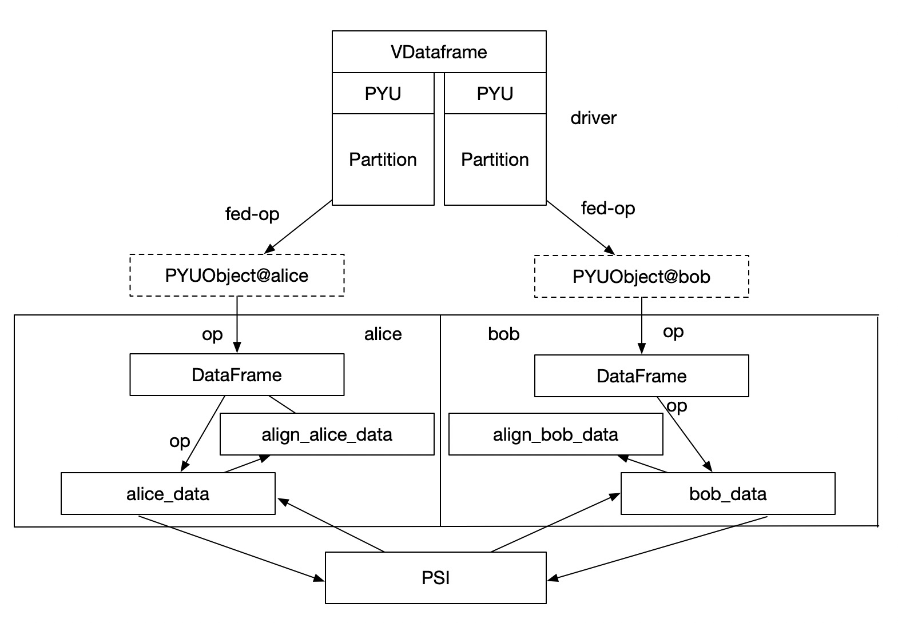

:target{#Split-Learning—Bank-Marketing}

# Split Learning—Bank Marketing

> The following codes are demos only. It’s <strong>NOT for production</strong> due to system security concerns, please <strong>DO NOT</strong> use it directly in production.

In this tutorial, we will use the bank’s marketing model as an example to show how to accomplish split learning in vertical scenarios under the SecretFlow framework. SecretFlow provides a user-friendly Api that makes it easy to apply your Keras model or PyTorch model to split learning scenarios to complete joint modeling tasks for vertical scenarios.

In this tutorial we will show you how to turn your existing ‘Keras’ model into a split learning model under Secretflow to complete federated multi-party modeling tasks.

:target{#What-is-Split-Learning？}

## What is Split Learning？

The core idea of split learning is to split the network structure. Each device (silo) retains only a part of the network structure, and the sub-network structure of all devices is combined together to form a complete network model. In the training process, different devices (silos) only perform forward or reverse calculation on the local network structure, and transfer the calculation results to the next device. Multiple devices complete the training through joint model until convergence.


<LineBlock>
  <strong>Alice</strong>：have <em>data\_alice</em>，<em>model\_base\_alice</em>

  <strong>Bob</strong>: have <em>data\_bob</em>，<em>model\_base\_bob</em>，<em>model\_fuse</em>
</LineBlock>

1. <strong>Alice</strong> uses its data to get <em>hidden0</em> through <em>model\_base\_Alice</em> and send it to Bob.
2. <strong>Bob</strong> gets <em>hidden1</em> with its data through <em>model\_base\_bob</em>.
3. <em>hidden\_0</em> and <em>hidden\_1</em> are input to the <em>AggLayer</em> for aggregation, and the aggregated <em>hidden\_merge</em> is the output.
4. <strong>Bob</strong> input <em>hidden\_merge</em> to <em>model\_fuse</em>, get the gradient with <em>label</em> and send it back.
5. The gradient is split into two parts <em>g\_0</em>, <em>g\_1</em> through <em>AggLayer</em>, which are sent to <strong>Alice</strong> and <strong>Bob</strong> respectively.
6. Then <strong>Alice</strong> and <strong>Bob</strong> update their local base net with <em>g\_0</em> or <em>g\_1</em>.

:target{#Task}

## Task

Marketing is the banking industry in the ever-changing market environment, to meet the needs of customers, to achieve business objectives of the overall operation and sales activities. In the current environment of big data, data analysis provides a more effective analysis means for the banking industry. Customer demand analysis, understanding of target market trends and more macro market strategies can provide the basis and direction.

The data from [kaggle](https://www.kaggle.com/janiobachmann/bank-marketing-dataset) is a set of classic marketing data bank, is a Portuguese bank agency telephone direct marketing activities, The target variable is whether the customer subscribes to deposit product.

:target{#Data}

## Data

1. The total sample size was 11162, including 8929 training set and 2233 test set.
2. Feature dim is 16, target is binary classification.
3. We have cut the data in advance. Alice holds the 4-dimensional basic attribute features, Bob holds the 12-dimensional bank transaction features, and only Alice holds the corresponding label.

Let’s start by looking at what our bank’s marketing data look like?

The original data is divided into Bank Alice and Bank Bob, which stores in Alice and Bob respectively. Here, CSV is the original data that has only been separated without pre-processing, we will use `secretflow preprocess` for FedData preprocess.

<Notebook.Cell>
  <Notebook.CodeArea prompt="[1]:" stderr={false} type="input">
    ```python
    %load_ext autoreload
    %autoreload 2

    import secretflow as sf
    import matplotlib.pyplot as plt

    sf.init(['alice', 'bob'], address='local')
    alice, bob = sf.PYU('alice'), sf.PYU('bob')
    ```
  </Notebook.CodeArea>
</Notebook.Cell>

:target{#prepare-data}

### prepare data

<Notebook.Cell>
  <Notebook.CodeArea prompt="[2]:" stderr={false} type="input">
    ```python
    import pandas as pd
    from secretflow.utils.simulation.datasets import dataset

    df = pd.read_csv(dataset('bank_marketing'), sep=';')
    ```
  </Notebook.CodeArea>
</Notebook.Cell>

We assume that Alice is a new bank, and they only have the basic information of the user and purchased the label of financial products from other bank.

<Notebook.Cell>
  <Notebook.CodeArea prompt="[3]:" stderr={false} type="input">
    ```python
    alice_data = df[["age", "job", "marital", "education", "y"]]
    alice_data
    ```
  </Notebook.CodeArea>

  <Notebook.FancyOutput prompt="[3]:" type="output">
    <div>
      <style scoped={true}>
        {"\n    .dataframe tbody tr th:only-of-type {\n        vertical-align: middle;\n    }\n\n    .dataframe tbody tr th {\n        vertical-align: top;\n    }\n\n    .dataframe thead th {\n        text-align: right;\n    }\n"}
      </style>

      <table border={1} className="dataframe">
        <thead>
          <tr style={{"textAlign":"right"}}>
            <th /><th>{"age"}</th><th>{"job"}</th><th>{"marital"}</th><th>{"education"}</th><th>{"y"}</th>
          </tr>
        </thead>

        <tbody>
          <tr>
            <th>{"0"}</th><td>{"30"}</td><td>{"unemployed"}</td><td>{"married"}</td><td>{"primary"}</td><td>{"no"}</td>
          </tr>

          <tr>
            <th>{"1"}</th><td>{"33"}</td><td>{"services"}</td><td>{"married"}</td><td>{"secondary"}</td><td>{"no"}</td>
          </tr>

          <tr>
            <th>{"2"}</th><td>{"35"}</td><td>{"management"}</td><td>{"single"}</td><td>{"tertiary"}</td><td>{"no"}</td>
          </tr>

          <tr>
            <th>{"3"}</th><td>{"30"}</td><td>{"management"}</td><td>{"married"}</td><td>{"tertiary"}</td><td>{"no"}</td>
          </tr>

          <tr>
            <th>{"4"}</th><td>{"59"}</td><td>{"blue-collar"}</td><td>{"married"}</td><td>{"secondary"}</td><td>{"no"}</td>
          </tr>

          <tr>
            <th>{"..."}</th><td>{"..."}</td><td>{"..."}</td><td>{"..."}</td><td>{"..."}</td><td>{"..."}</td>
          </tr>

          <tr>
            <th>{"4516"}</th><td>{"33"}</td><td>{"services"}</td><td>{"married"}</td><td>{"secondary"}</td><td>{"no"}</td>
          </tr>

          <tr>
            <th>{"4517"}</th><td>{"57"}</td><td>{"self-employed"}</td><td>{"married"}</td><td>{"tertiary"}</td><td>{"no"}</td>
          </tr>

          <tr>
            <th>{"4518"}</th><td>{"57"}</td><td>{"technician"}</td><td>{"married"}</td><td>{"secondary"}</td><td>{"no"}</td>
          </tr>

          <tr>
            <th>{"4519"}</th><td>{"28"}</td><td>{"blue-collar"}</td><td>{"married"}</td><td>{"secondary"}</td><td>{"no"}</td>
          </tr>

          <tr>
            <th>{"4520"}</th><td>{"44"}</td><td>{"entrepreneur"}</td><td>{"single"}</td><td>{"tertiary"}</td><td>{"no"}</td>
          </tr>
        </tbody>
      </table>

      <p>{"4521 rows × 5 columns"}</p>
    </div>
  </Notebook.FancyOutput>
</Notebook.Cell>

Bob is an old bank, they have the user’s account balance, house, loan, and recent marketing feedback.

<Notebook.Cell>
  <Notebook.CodeArea prompt="[4]:" stderr={false} type="input">
    ```python
    bob_data = df[
        [
            "default",
            "balance",
            "housing",
            "loan",
            "contact",
            "day",
            "month",
            "duration",
            "campaign",
            "pdays",
            "previous",
            "poutcome",
        ]
    ]
    bob_data
    ```
  </Notebook.CodeArea>

  <Notebook.FancyOutput prompt="[4]:" type="output">
    <div>
      <style scoped={true}>
        {"\n    .dataframe tbody tr th:only-of-type {\n        vertical-align: middle;\n    }\n\n    .dataframe tbody tr th {\n        vertical-align: top;\n    }\n\n    .dataframe thead th {\n        text-align: right;\n    }\n"}
      </style>

      <table border={1} className="dataframe">
        <thead>
          <tr style={{"textAlign":"right"}}>
            <th /><th>{"default"}</th><th>{"balance"}</th><th>{"housing"}</th><th>{"loan"}</th><th>{"contact"}</th><th>{"day"}</th><th>{"month"}</th><th>{"duration"}</th><th>{"campaign"}</th><th>{"pdays"}</th><th>{"previous"}</th><th>{"poutcome"}</th>
          </tr>
        </thead>

        <tbody>
          <tr>
            <th>{"0"}</th><td>{"no"}</td><td>{"1787"}</td><td>{"no"}</td><td>{"no"}</td><td>{"cellular"}</td><td>{"19"}</td><td>{"oct"}</td><td>{"79"}</td><td>{"1"}</td><td>{"-1"}</td><td>{"0"}</td><td>{"unknown"}</td>
          </tr>

          <tr>
            <th>{"1"}</th><td>{"no"}</td><td>{"4789"}</td><td>{"yes"}</td><td>{"yes"}</td><td>{"cellular"}</td><td>{"11"}</td><td>{"may"}</td><td>{"220"}</td><td>{"1"}</td><td>{"339"}</td><td>{"4"}</td><td>{"failure"}</td>
          </tr>

          <tr>
            <th>{"2"}</th><td>{"no"}</td><td>{"1350"}</td><td>{"yes"}</td><td>{"no"}</td><td>{"cellular"}</td><td>{"16"}</td><td>{"apr"}</td><td>{"185"}</td><td>{"1"}</td><td>{"330"}</td><td>{"1"}</td><td>{"failure"}</td>
          </tr>

          <tr>
            <th>{"3"}</th><td>{"no"}</td><td>{"1476"}</td><td>{"yes"}</td><td>{"yes"}</td><td>{"unknown"}</td><td>{"3"}</td><td>{"jun"}</td><td>{"199"}</td><td>{"4"}</td><td>{"-1"}</td><td>{"0"}</td><td>{"unknown"}</td>
          </tr>

          <tr>
            <th>{"4"}</th><td>{"no"}</td><td>{"0"}</td><td>{"yes"}</td><td>{"no"}</td><td>{"unknown"}</td><td>{"5"}</td><td>{"may"}</td><td>{"226"}</td><td>{"1"}</td><td>{"-1"}</td><td>{"0"}</td><td>{"unknown"}</td>
          </tr>

          <tr>
            <th>{"..."}</th><td>{"..."}</td><td>{"..."}</td><td>{"..."}</td><td>{"..."}</td><td>{"..."}</td><td>{"..."}</td><td>{"..."}</td><td>{"..."}</td><td>{"..."}</td><td>{"..."}</td><td>{"..."}</td><td>{"..."}</td>
          </tr>

          <tr>
            <th>{"4516"}</th><td>{"no"}</td><td>{"-333"}</td><td>{"yes"}</td><td>{"no"}</td><td>{"cellular"}</td><td>{"30"}</td><td>{"jul"}</td><td>{"329"}</td><td>{"5"}</td><td>{"-1"}</td><td>{"0"}</td><td>{"unknown"}</td>
          </tr>

          <tr>
            <th>{"4517"}</th><td>{"yes"}</td><td>{"-3313"}</td><td>{"yes"}</td><td>{"yes"}</td><td>{"unknown"}</td><td>{"9"}</td><td>{"may"}</td><td>{"153"}</td><td>{"1"}</td><td>{"-1"}</td><td>{"0"}</td><td>{"unknown"}</td>
          </tr>

          <tr>
            <th>{"4518"}</th><td>{"no"}</td><td>{"295"}</td><td>{"no"}</td><td>{"no"}</td><td>{"cellular"}</td><td>{"19"}</td><td>{"aug"}</td><td>{"151"}</td><td>{"11"}</td><td>{"-1"}</td><td>{"0"}</td><td>{"unknown"}</td>
          </tr>

          <tr>
            <th>{"4519"}</th><td>{"no"}</td><td>{"1137"}</td><td>{"no"}</td><td>{"no"}</td><td>{"cellular"}</td><td>{"6"}</td><td>{"feb"}</td><td>{"129"}</td><td>{"4"}</td><td>{"211"}</td><td>{"3"}</td><td>{"other"}</td>
          </tr>

          <tr>
            <th>{"4520"}</th><td>{"no"}</td><td>{"1136"}</td><td>{"yes"}</td><td>{"yes"}</td><td>{"cellular"}</td><td>{"3"}</td><td>{"apr"}</td><td>{"345"}</td><td>{"2"}</td><td>{"249"}</td><td>{"7"}</td><td>{"other"}</td>
          </tr>
        </tbody>
      </table>

      <p>{"4521 rows × 12 columns"}</p>
    </div>
  </Notebook.FancyOutput>
</Notebook.Cell>

:target{#Create-Secretflow-Environment}

## Create Secretflow Environment

<LineBlock>
  Create 2 entities in the Secretflow environment \[Alice, Bob]

  Where ‘Alice’ and ‘Bob’ are two `PYU`.

  Once you’ve constructed the two objects, you can happily start Splitting Learning.
</LineBlock>

:target{#Import-Dependency}

### Import Dependency

<Notebook.Cell>
  <Notebook.CodeArea prompt="[5]:" stderr={false} type="input">
    ```python
    from secretflow.data.split import train_test_split
    from secretflow.ml.nn import SLModel
    ```
  </Notebook.CodeArea>
</Notebook.Cell>

:target{#Prepare-Data}

## Prepare Data

<strong>Build Federated Table</strong>

Federated table is a virtual concept that cross multiple parties, We define `VDataFrame` for vertical setting .

1. The data of all parties in a federated table is stored locally and is not allowed to go out of the domain.
2. No one has access to data store except the party that owns the data.
3. Any operation performed on the federated table is scheduled by the driver to each worker, and the execution instructions are delivered layer by layer until the Python runtime of the specific worker. The framework ensures that only the worker with `worker.device` equal to the `Object.device` can operate on the data.
4. Federated tables are designed for managing and manipulating multi-party data from a central perspective.
5. Interfaces to `Federated Tables` are aligned to `pandas.DataFrame` to reduce the cost of multi-party data operations.
6. The SecretFlow framework provides Plain\&Ciphertext hybrid programming capabilities. Vertical federated tables are built using `SPU`, and `MPC-PSI` is used to safely get intersection and align data from all parties.



VDataFrame provides `read_csv` interface similar to pandas, the difference is that `secretflow.read_csv` receives a dictionary that defines the path of data for both parties. We can use `secretflow.vertical.read_csv` to build the `VDataFrame`.

```none
read_csv(file_dict,delimiter,ppu,keys,drop_key)
    filepath: Path of the participant file. The address can be a relative or absolute path to a local file
    spu: SPU Device for PSI; If this parameter is not specified, data must be prealigned
    keys: Key for intersection.
```

Create spu object

<Notebook.Cell>
  <Notebook.CodeArea prompt="[6]:" stderr={false} type="input">
    ```python
    spu = sf.SPU(sf.utils.testing.cluster_def(['alice', 'bob']))
    ```
  </Notebook.CodeArea>
</Notebook.Cell>

<Notebook.Cell>
  <Notebook.CodeArea prompt="[7]:" stderr={false} type="input">
    ```python
    from secretflow.utils.simulation.datasets import load_bank_marketing

    # Alice has the first four features,
    # while bob has the left features
    data = load_bank_marketing(parts={alice: (0, 4), bob: (4, 16)}, axis=1)
    # Alice holds the label.
    label = load_bank_marketing(parts={alice: (16, 17)}, axis=1)
    ```
  </Notebook.CodeArea>
</Notebook.Cell>

`data` is a vertically federated table. It only has the `Schema` of all the data globally.

Let’s examine the data management of `VDF` more closely.

As shown in the example, the `age` field belongs to `Alice`, so the corresponding column can be obtained from `Alice`’s partition. However, if `Bob` tries to obtain the `age` field, a `KeyError` error will be reported.

We have a concept called Partition, which is a defined data fragment. Each partition has its own device to which it belongs, and only the device to which it belongs can operate on its data.

<Notebook.Cell>
  <Notebook.CodeArea prompt="[8]:" stderr={false} type="input">
    ```python
    data['age'].partitions[alice].data
    ```
  </Notebook.CodeArea>

  <Notebook.CodeArea prompt="[8]:" stderr={false} type="output">
    <pre>
      {"<secretflow.device.device.pyu.PYUObject at 0x7fd7b1e8cb20>\n"}
    </pre>
  </Notebook.CodeArea>
</Notebook.Cell>

<Notebook.Cell>
  <Notebook.CodeArea prompt="[ ]:" stderr={false} type="input">
    ```python
    # You can uncomment this and you will get a KeyError.
    # data['age'].partitions[bob]
    ```
  </Notebook.CodeArea>
</Notebook.Cell>

<LineBlock>
  Next, we perform data preprocessing on the `VDataFrame`.

  We use LabelEncoder and MinMaxScaler as examples. These two preprocessing functions have corresponding concepts in SkLearn, and their usage methods are similar to those in <strong>sklearn</strong>.
</LineBlock>

<Notebook.Cell>
  <Notebook.CodeArea prompt="[9]:" stderr={false} type="input">
    ```python
    from secretflow.preprocessing.scaler import MinMaxScaler
    from secretflow.preprocessing.encoder import LabelEncoder
    ```
  </Notebook.CodeArea>
</Notebook.Cell>

<Notebook.Cell>
  <Notebook.CodeArea prompt="[10]:" stderr={false} type="input">
    ```python
    encoder = LabelEncoder()
    data['job'] = encoder.fit_transform(data['job'])
    data['marital'] = encoder.fit_transform(data['marital'])
    data['education'] = encoder.fit_transform(data['education'])
    data['default'] = encoder.fit_transform(data['default'])
    data['housing'] = encoder.fit_transform(data['housing'])
    data['loan'] = encoder.fit_transform(data['loan'])
    data['contact'] = encoder.fit_transform(data['contact'])
    data['poutcome'] = encoder.fit_transform(data['poutcome'])
    data['month'] = encoder.fit_transform(data['month'])
    label = encoder.fit_transform(label)
    ```
  </Notebook.CodeArea>
</Notebook.Cell>

<Notebook.Cell>
  <Notebook.CodeArea prompt="[11]:" stderr={false} type="input">
    ```python
    print(f"label= {type(label)},\ndata = {type(data)}")
    ```
  </Notebook.CodeArea>

  <Notebook.CodeArea prompt="" stderr={false} type="output">
    <pre>
      {"label= <class 'secretflow.data.vertical.dataframe.VDataFrame'>,\ndata = <class 'secretflow.data.vertical.dataframe.VDataFrame'>\n"}
    </pre>
  </Notebook.CodeArea>
</Notebook.Cell>

Standardize data via MinMaxScaler

<Notebook.Cell>
  <Notebook.CodeArea prompt="[12]:" stderr={false} type="input">
    ```python
    scaler = MinMaxScaler()

    data = scaler.fit_transform(data)
    ```
  </Notebook.CodeArea>
</Notebook.Cell>

Next we divide the data set into train-set and test-set.

<Notebook.Cell>
  <Notebook.CodeArea prompt="[13]:" stderr={false} type="input">
    ```python
    from secretflow.data.split import train_test_split

    random_state = 1234
    train_data, test_data = train_test_split(
        data, train_size=0.8, random_state=random_state
    )
    train_label, test_label = train_test_split(
        label, train_size=0.8, random_state=random_state
    )
    ```
  </Notebook.CodeArea>
</Notebook.Cell>

<strong>Summary:</strong> At this stage, we have finished defining `federated tables`, performing `data preprocessing`, and partitioning the `training set` and `test set`. The secretFlow framework defines a set of operations to be built on the federated table (which is the logical counterpart of `pandas.DataFrame`). The secretflow framework defines a set of operations to be built on the federated table (its logical counterpart is `sklearn`) Refer to our documentation and API introduction to learn
more about other features.

:target{#Introduce-Model}

## Introduce Model

<strong>local version</strong>: For this task, a simple DNN can be trained to take in 16-dimensional features, process them through a neural network, and output the probability of positive and negative samples.

<strong>Federate version</strong>:

- Alice:
  - base\_net: Input 4-dimensional feature and go through a DNN network to get hidden.
  - fuse\_net: Receive hidden features calculated by Alice and Bob, input them to fusenet for feature fusion, and complete the forward process and backward process.
- Bob:
  - base\_net: Input 12-dimensional features, get hidden through a DNN network, and then send hidden to Alice to complete the following operation.

:target{#Define-Model}

### Define Model

Next, we will start creating the federated model.

We have defined the SLTFModel and SLTorchModel, which are used to build split learning for vertically partitioned data. We have also created a simple and easy-to-use extensible interface, allowing you to easily transform your existing model into an SF-Model and perform vertically partitioned federated modeling.

Split learning is to break up a model so that one part is executed locally on the data and the other part is executed on the label side. First let’s define the locally executed model – base\_model.

<Notebook.Cell>
  <Notebook.CodeArea prompt="[14]:" stderr={false} type="input">
    ```python
    def create_base_model(input_dim, output_dim, name='base_model'):
        # Create model
        def create_model():
            from tensorflow import keras
            from tensorflow.keras import layers
            import tensorflow as tf

            model = keras.Sequential(
                [
                    keras.Input(shape=input_dim),
                    layers.Dense(100, activation="relu"),
                    layers.Dense(output_dim, activation="relu"),
                ]
            )
            # Compile model
            model.summary()
            model.compile(
                loss='binary_crossentropy',
                optimizer='adam',
                metrics=["accuracy", tf.keras.metrics.AUC()],
            )
            return model

        return create_model
    ```
  </Notebook.CodeArea>
</Notebook.Cell>

We use create\_base\_model to create their base models for ‘Alice’ and ‘Bob’, respectively.

<Notebook.Cell>
  <Notebook.CodeArea prompt="[15]:" stderr={false} type="input">
    ```python
    # prepare model
    hidden_size = 64

    model_base_alice = create_base_model(4, hidden_size)
    model_base_bob = create_base_model(12, hidden_size)
    ```
  </Notebook.CodeArea>
</Notebook.Cell>

<Notebook.Cell>
  <Notebook.CodeArea prompt="[16]:" stderr={false} type="input">
    ```python
    model_base_alice()
    model_base_bob()
    ```
  </Notebook.CodeArea>

  <Notebook.CodeArea prompt="" stderr={false} type="output">
    <pre>
      {"Model: \"sequential\"\n_________________________________________________________________\n Layer (type)                Output Shape              Param #\n=================================================================\n dense (Dense)               (None, 100)               500\n\n dense_1 (Dense)             (None, 64)                6464\n\n=================================================================\nTotal params: 6,964\nTrainable params: 6,964\nNon-trainable params: 0\n_________________________________________________________________\nModel: \"sequential_1\"\n_________________________________________________________________\n Layer (type)                Output Shape              Param #\n=================================================================\n dense_2 (Dense)             (None, 100)               1300\n\n dense_3 (Dense)             (None, 64)                6464\n\n=================================================================\nTotal params: 7,764\nTrainable params: 7,764\nNon-trainable params: 0\n_________________________________________________________________\n"}
    </pre>
  </Notebook.CodeArea>

  <Notebook.CodeArea prompt="[16]:" stderr={false} type="output">
    <pre>
      {"<keras.engine.sequential.Sequential at 0x7fd7a09c31f0>\n"}
    </pre>
  </Notebook.CodeArea>
</Notebook.Cell>

Next we define the side with the label, or the server-side model – fuse\_model In the definition of fuse\_model, we need to correctly define `loss`, `optimizer`, and `metrics`. This is compatible with all configurations of your existing Keras model.

<Notebook.Cell>
  <Notebook.CodeArea prompt="[17]:" stderr={false} type="input">
    ```python
    def create_fuse_model(input_dim, output_dim, party_nums, name='fuse_model'):
        def create_model():
            from tensorflow import keras
            from tensorflow.keras import layers
            import tensorflow as tf

            # input
            input_layers = []
            for i in range(party_nums):
                input_layers.append(
                    keras.Input(
                        input_dim,
                    )
                )

            merged_layer = layers.concatenate(input_layers)
            fuse_layer = layers.Dense(64, activation='relu')(merged_layer)
            output = layers.Dense(output_dim, activation='sigmoid')(fuse_layer)

            model = keras.Model(inputs=input_layers, outputs=output)
            model.summary()

            model.compile(
                loss='binary_crossentropy',
                optimizer='adam',
                metrics=["accuracy", tf.keras.metrics.AUC()],
            )
            return model

        return create_model
    ```
  </Notebook.CodeArea>
</Notebook.Cell>

<Notebook.Cell>
  <Notebook.CodeArea prompt="[18]:" stderr={false} type="input">
    ```python
    model_fuse = create_fuse_model(input_dim=hidden_size, party_nums=2, output_dim=1)
    ```
  </Notebook.CodeArea>
</Notebook.Cell>

<Notebook.Cell>
  <Notebook.CodeArea prompt="[19]:" stderr={false} type="input">
    ```python
    model_fuse()
    ```
  </Notebook.CodeArea>

  <Notebook.CodeArea prompt="" stderr={false} type="output">
    <pre>
      {"Model: \"model\"\n__________________________________________________________________________________________________\n Layer (type)                   Output Shape         Param #     Connected to\n==================================================================================================\n input_3 (InputLayer)           [(None, 64)]         0           []\n\n input_4 (InputLayer)           [(None, 64)]         0           []\n\n concatenate (Concatenate)      (None, 128)          0           ['input_3[0][0]',\n                                                                  'input_4[0][0]']\n\n dense_4 (Dense)                (None, 64)           8256        ['concatenate[0][0]']\n\n dense_5 (Dense)                (None, 1)            65          ['dense_4[0][0]']\n\n==================================================================================================\nTotal params: 8,321\nTrainable params: 8,321\nNon-trainable params: 0\n__________________________________________________________________________________________________\n"}
    </pre>
  </Notebook.CodeArea>

  <Notebook.CodeArea prompt="[19]:" stderr={false} type="output">
    <pre>
      {"<keras.engine.functional.Functional at 0x7fd7a0d569d0>\n"}
    </pre>
  </Notebook.CodeArea>
</Notebook.Cell>

:target{#Create-Split-Learning-Model}

### Create Split Learning Model

<LineBlock>
  Secretflow provides the split learning model `SLModel`.

  To initial SLModel only need 3 parameters.
</LineBlock>

- base\_model\_dict: A dictionary needs to be passed in all clients participating in the training along with base\_model mappings
- device\_y: PYU, which device has label
- model\_fuse: The fusion model

Define base\_model\_dict.

```python
base_model_dict:Dict[PYU,model_fn]
```

<Notebook.Cell>
  <Notebook.CodeArea prompt="[20]:" stderr={false} type="input">
    ```python
    base_model_dict = {alice: model_base_alice, bob: model_base_bob}
    ```
  </Notebook.CodeArea>
</Notebook.Cell>

<Notebook.Cell>
  <Notebook.CodeArea prompt="[21]:" stderr={false} type="input">
    ```python
    from secretflow.security.privacy import DPStrategy, LabelDP
    from secretflow.security.privacy.mechanism.tensorflow import GaussianEmbeddingDP

    # Define DP operations
    train_batch_size = 128
    gaussian_embedding_dp = GaussianEmbeddingDP(
        noise_multiplier=0.5,
        l2_norm_clip=1.0,
        batch_size=train_batch_size,
        num_samples=train_data.values.partition_shape()[alice][0],
        is_secure_generator=False,
    )
    label_dp = LabelDP(eps=64.0)
    dp_strategy_alice = DPStrategy(label_dp=label_dp)
    dp_strategy_bob = DPStrategy(embedding_dp=gaussian_embedding_dp)
    dp_strategy_dict = {alice: dp_strategy_alice, bob: dp_strategy_bob}
    dp_spent_step_freq = 10
    ```
  </Notebook.CodeArea>
</Notebook.Cell>

<Notebook.Cell>
  <Notebook.CodeArea prompt="[22]:" stderr={false} type="input">
    ```python
    sl_model = SLModel(
        base_model_dict=base_model_dict,
        device_y=alice,
        model_fuse=model_fuse,
        dp_strategy_dict=dp_strategy_dict,
    )
    ```
  </Notebook.CodeArea>
</Notebook.Cell>

<Notebook.Cell>
  <Notebook.CodeArea prompt="[23]:" stderr={false} type="input">
    ```python
    sf.reveal(test_data.partitions[alice].data), sf.reveal(
        test_label.partitions[alice].data
    )
    ```
  </Notebook.CodeArea>

  <Notebook.CodeArea prompt="[23]:" stderr={false} type="output">
    <pre>
      {"(           age       job  marital  education\n 1426  0.279412  0.181818      0.5   0.333333\n 416   0.176471  0.636364      1.0   0.333333\n 3977  0.264706  0.000000      0.5   0.666667\n 2291  0.338235  0.000000      0.5   0.333333\n 257   0.132353  0.909091      1.0   0.333333\n ...        ...       ...      ...        ...\n 1508  0.264706  0.818182      1.0   0.333333\n 979   0.544118  0.090909      0.0   0.000000\n 3494  0.455882  0.090909      0.5   0.000000\n 42    0.485294  0.090909      0.5   0.333333\n 1386  0.455882  0.636364      0.5   0.333333\n\n [905 rows x 4 columns],\n       y\n 1426  0\n 416   0\n 3977  0\n 2291  0\n 257   0\n ...  ..\n 1508  0\n 979   0\n 3494  0\n 42    0\n 1386  0\n\n [905 rows x 1 columns])\n"}
    </pre>
  </Notebook.CodeArea>
</Notebook.Cell>

<Notebook.Cell>
  <Notebook.CodeArea prompt="[24]:" stderr={false} type="input">
    ```python
    sf.reveal(train_data.partitions[alice].data), sf.reveal(
        train_label.partitions[alice].data
    )
    ```
  </Notebook.CodeArea>

  <Notebook.CodeArea prompt="[24]:" stderr={false} type="output">
    <pre>
      {"(           age       job  marital  education\n 1106  0.235294  0.090909      0.5   0.333333\n 1309  0.176471  0.363636      0.5   0.333333\n 2140  0.411765  0.272727      1.0   0.666667\n 2134  0.573529  0.454545      0.5   0.333333\n 960   0.485294  0.818182      0.5   0.333333\n ...        ...       ...      ...        ...\n 664   0.397059  0.090909      1.0   0.333333\n 3276  0.235294  0.181818      0.5   0.666667\n 1318  0.220588  0.818182      0.5   0.333333\n 723   0.220588  0.636364      0.5   0.333333\n 2863  0.176471  0.363636      1.0   0.666667\n\n [3616 rows x 4 columns],\n       y\n 1106  0\n 1309  0\n 2140  1\n 2134  0\n 960   0\n ...  ..\n 664   0\n 3276  0\n 1318  0\n 723   0\n 2863  0\n\n [3616 rows x 1 columns])\n"}
    </pre>
  </Notebook.CodeArea>
</Notebook.Cell>

<Notebook.Cell>
  <Notebook.CodeArea prompt="[25]:" stderr={false} type="input">
    ```python
    history = sl_model.fit(
        train_data,
        train_label,
        validation_data=(test_data, test_label),
        epochs=10,
        batch_size=train_batch_size,
        shuffle=True,
        verbose=1,
        validation_freq=1,
        dp_spent_step_freq=dp_spent_step_freq,
    )
    ```
  </Notebook.CodeArea>

  <Notebook.CodeArea prompt="" stderr={false} type="output">
    <pre>
      <span className="ansi-cyan-fg">{"(PYUSLTFModel pid=37975)"}</span>{" Model: \"sequential\"\n"}<span className="ansi-cyan-fg">{"(PYUSLTFModel pid=37975)"}</span>{" _________________________________________________________________\n"}<span className="ansi-cyan-fg">{"(PYUSLTFModel pid=37975)"}</span>{"  Layer (type)                Output Shape              Param #\n"}<span className="ansi-cyan-fg">{"(PYUSLTFModel pid=37975)"}</span>{" =================================================================\n"}<span className="ansi-cyan-fg">{"(PYUSLTFModel pid=37975)"}</span>{"  dense (Dense)               (None, 100)               500\n"}<span className="ansi-cyan-fg">{"(PYUSLTFModel pid=37975)"}</span><span className="ansi-cyan-fg">{"(PYUSLTFModel pid=37975)"}</span>{"  dense_1 (Dense)             (None, 64)                6464\n"}<span className="ansi-cyan-fg">{"(PYUSLTFModel pid=37975)"}</span><span className="ansi-cyan-fg">{"(PYUSLTFModel pid=37975)"}</span>{" =================================================================\n"}<span className="ansi-cyan-fg">{"(PYUSLTFModel pid=37975)"}</span>{" Total params: 6,964\n"}<span className="ansi-cyan-fg">{"(PYUSLTFModel pid=37975)"}</span>{" Trainable params: 6,964\n"}<span className="ansi-cyan-fg">{"(PYUSLTFModel pid=37975)"}</span>{" Non-trainable params: 0\n"}<span className="ansi-cyan-fg">{"(PYUSLTFModel pid=37975)"}</span>{" _________________________________________________________________\n"}<span className="ansi-cyan-fg">{"(PYUSLTFModel pid=37975)"}</span>{" Model: \"model\"\n"}<span className="ansi-cyan-fg">{"(PYUSLTFModel pid=37975)"}</span>{" __________________________________________________________________________________________________\n"}<span className="ansi-cyan-fg">{"(PYUSLTFModel pid=37975)"}</span>{"  Layer (type)                   Output Shape         Param #     Connected to\n"}<span className="ansi-cyan-fg">{"(PYUSLTFModel pid=37975)"}</span>{" ==================================================================================================\n"}<span className="ansi-cyan-fg">{"(PYUSLTFModel pid=37975)"}</span>{"  input_2 (InputLayer)           [(None, 64)]         0           []\n"}<span className="ansi-cyan-fg">{"(PYUSLTFModel pid=37975)"}</span><span className="ansi-cyan-fg">{"(PYUSLTFModel pid=37975)"}</span>{"  input_3 (InputLayer)           [(None, 64)]         0           []\n"}<span className="ansi-cyan-fg">{"(PYUSLTFModel pid=37975)"}</span><span className="ansi-cyan-fg">{"(PYUSLTFModel pid=37975)"}</span>{"  concatenate (Concatenate)      (None, 128)          0           ['input_2[0][0]',\n"}<span className="ansi-cyan-fg">{"(PYUSLTFModel pid=37975)"}</span>{"                                                                   'input_3[0][0]']\n"}<span className="ansi-cyan-fg">{"(PYUSLTFModel pid=37975)"}</span><span className="ansi-cyan-fg">{"(PYUSLTFModel pid=37975)"}</span>{"  dense_2 (Dense)                (None, 64)           8256        ['concatenate[0][0]']\n"}<span className="ansi-cyan-fg">{"(PYUSLTFModel pid=37975)"}</span><span className="ansi-cyan-fg">{"(PYUSLTFModel pid=37975)"}</span>{"  dense_3 (Dense)                (None, 1)            65          ['dense_2[0][0]']\n"}<span className="ansi-cyan-fg">{"(PYUSLTFModel pid=37975)"}</span><span className="ansi-cyan-fg">{"(PYUSLTFModel pid=37975)"}</span>{" ==================================================================================================\n"}<span className="ansi-cyan-fg">{"(PYUSLTFModel pid=37975)"}</span>{" Total params: 8,321\n"}<span className="ansi-cyan-fg">{"(PYUSLTFModel pid=37975)"}</span>{" Trainable params: 8,321\n"}<span className="ansi-cyan-fg">{"(PYUSLTFModel pid=37975)"}</span>{" Non-trainable params: 0\n"}<span className="ansi-cyan-fg">{"(PYUSLTFModel pid=37975)"}</span>{" __________________________________________________________________________________________________\n"}
    </pre>
  </Notebook.CodeArea>

  <Notebook.CodeArea prompt="" stderr={false} type="output">
    <pre>
      <span className="ansi-cyan-fg">{"(PYUSLTFModel pid=37977)"}</span>{" Model: \"sequential\"\n"}<span className="ansi-cyan-fg">{"(PYUSLTFModel pid=37977)"}</span>{" _________________________________________________________________\n"}<span className="ansi-cyan-fg">{"(PYUSLTFModel pid=37977)"}</span>{"  Layer (type)                Output Shape              Param #\n"}<span className="ansi-cyan-fg">{"(PYUSLTFModel pid=37977)"}</span>{" =================================================================\n"}<span className="ansi-cyan-fg">{"(PYUSLTFModel pid=37977)"}</span>{"  dense (Dense)               (None, 100)               1300\n"}<span className="ansi-cyan-fg">{"(PYUSLTFModel pid=37977)"}</span><span className="ansi-cyan-fg">{"(PYUSLTFModel pid=37977)"}</span>{"  dense_1 (Dense)             (None, 64)                6464\n"}<span className="ansi-cyan-fg">{"(PYUSLTFModel pid=37977)"}</span><span className="ansi-cyan-fg">{"(PYUSLTFModel pid=37977)"}</span>{" =================================================================\n"}<span className="ansi-cyan-fg">{"(PYUSLTFModel pid=37977)"}</span>{" Total params: 7,764\n"}<span className="ansi-cyan-fg">{"(PYUSLTFModel pid=37977)"}</span>{" Trainable params: 7,764\n"}<span className="ansi-cyan-fg">{"(PYUSLTFModel pid=37977)"}</span>{" Non-trainable params: 0\n"}<span className="ansi-cyan-fg">{"(PYUSLTFModel pid=37977)"}</span>{" _________________________________________________________________\n"}
    </pre>
  </Notebook.CodeArea>
</Notebook.Cell>

Let’s visualize the training process

<Notebook.Cell>
  <Notebook.CodeArea prompt="[26]:" stderr={false} type="input">
    ```python
    # Plot the change of loss during training
    plt.plot(history['train_loss'])
    plt.plot(history['val_loss'])
    plt.title('Model loss')
    plt.ylabel('Loss')
    plt.xlabel('Epoch')
    plt.legend(['Train', 'Val'], loc='upper right')
    plt.show()
    ```
  </Notebook.CodeArea>

  <Notebook.FancyOutput prompt="" type="output">
    
  </Notebook.FancyOutput>
</Notebook.Cell>

<Notebook.Cell>
  <Notebook.CodeArea prompt="[27]:" stderr={false} type="input">
    ```python
    # Plot the change of accuracy during training
    plt.plot(history['train_accuracy'])
    plt.plot(history['val_accuracy'])
    plt.title('Model accuracy')
    plt.ylabel('Accuracy')
    plt.xlabel('Epoch')
    plt.legend(['Train', 'Val'], loc='upper left')
    plt.show()
    ```
  </Notebook.CodeArea>

  <Notebook.FancyOutput prompt="" type="output">
    
  </Notebook.FancyOutput>
</Notebook.Cell>

<Notebook.Cell>
  <Notebook.CodeArea prompt="[28]:" stderr={false} type="input">
    ```python
    # Plot the Area Under Curve(AUC) of loss during training
    plt.plot(history['train_auc_1'])
    plt.plot(history['val_auc_1'])
    plt.title('Model Area Under Curve')
    plt.ylabel('Area Under Curve')
    plt.xlabel('Epoch')
    plt.legend(['Train', 'Val'], loc='upper left')
    plt.show()
    ```
  </Notebook.CodeArea>

  <Notebook.FancyOutput prompt="" type="output">
    
  </Notebook.FancyOutput>
</Notebook.Cell>

Let’s call the evaluation function

<Notebook.Cell>
  <Notebook.CodeArea prompt="[29]:" stderr={false} type="input">
    ```python
    global_metric = sl_model.evaluate(test_data, test_label, batch_size=128)
    ```
  </Notebook.CodeArea>
</Notebook.Cell>

:target{#Compare-to-local-model}

## Compare to local model

<LineBlock>
  Here, we use the same model structure as the one used in the split learning example, but only the model structure for Alice is used in this case. The code for defining the model is shown below.

  \#### Data

  The data also use kaggle’s anti-fraud data. Here, we just use Alice’s data of the new bank.

  1\. The total sample size was 11162, including 8929 training set and 2233 test set.

  2\. The feature dimension is 4.
</LineBlock>

<Notebook.Cell>
  <Notebook.CodeArea prompt="[30]:" stderr={false} type="input">
    ```python
    from tensorflow import keras
    from tensorflow.keras import layers
    import tensorflow as tf
    from sklearn.model_selection import train_test_split


    def create_model():
        model = keras.Sequential(
            [
                keras.Input(shape=4),
                layers.Dense(100, activation="relu"),
                layers.Dense(64, activation='relu'),
                layers.Dense(64, activation='relu'),
                layers.Dense(1, activation='sigmoid'),
            ]
        )
        model.compile(
            loss='binary_crossentropy',
            optimizer='adam',
            metrics=["accuracy", tf.keras.metrics.AUC()],
        )
        return model


    single_model = create_model()
    ```
  </Notebook.CodeArea>
</Notebook.Cell>

Data process

<Notebook.Cell>
  <Notebook.CodeArea prompt="[31]:" stderr={false} type="input">
    ```python
    import pandas as pd
    from sklearn.model_selection import train_test_split
    from sklearn.preprocessing import MinMaxScaler
    from sklearn.preprocessing import LabelEncoder

    encoder = LabelEncoder()
    single_part_data = alice_data.copy()

    single_part_data['job'] = encoder.fit_transform(alice_data['job'])
    single_part_data['marital'] = encoder.fit_transform(alice_data['marital'])
    single_part_data['education'] = encoder.fit_transform(alice_data['education'])
    single_part_data['y'] = encoder.fit_transform(alice_data['y'])
    ```
  </Notebook.CodeArea>
</Notebook.Cell>

<Notebook.Cell>
  <Notebook.CodeArea prompt="[32]:" stderr={false} type="input">
    ```python
    y = single_part_data['y']
    alice_data = single_part_data.drop(columns=['y'], inplace=False)
    ```
  </Notebook.CodeArea>
</Notebook.Cell>

<Notebook.Cell>
  <Notebook.CodeArea prompt="[33]:" stderr={false} type="input">
    ```python
    scaler = MinMaxScaler()
    alice_data = scaler.fit_transform(alice_data)
    ```
  </Notebook.CodeArea>
</Notebook.Cell>

<Notebook.Cell>
  <Notebook.CodeArea prompt="[34]:" stderr={false} type="input">
    ```python
    train_data, test_data = train_test_split(
        alice_data, train_size=0.8, random_state=random_state
    )
    train_label, test_label = train_test_split(y, train_size=0.8, random_state=random_state)
    ```
  </Notebook.CodeArea>
</Notebook.Cell>

<Notebook.Cell>
  <Notebook.CodeArea prompt="[35]:" stderr={false} type="input">
    ```python
    alice_data.shape
    ```
  </Notebook.CodeArea>

  <Notebook.CodeArea prompt="[35]:" stderr={false} type="output">
    <pre>
      {"(4521, 4)\n"}
    </pre>
  </Notebook.CodeArea>
</Notebook.Cell>

<Notebook.Cell>
  <Notebook.CodeArea prompt="[36]:" stderr={false} type="input">
    ```python
    single_model.fit(
        train_data,
        train_label,
        validation_data=(test_data, test_label),
        batch_size=128,
        epochs=10,
        shuffle=False,
    )
    ```
  </Notebook.CodeArea>

  <Notebook.CodeArea prompt="" stderr={false} type="output">
    <pre>
      {"Epoch 1/10\n29/29 [==============================] - 1s 10ms/step - loss: 0.5564 - accuracy: 0.8261 - auc_3: 0.4520 - val_loss: 0.4089 - val_accuracy: 0.8729 - val_auc_3: 0.4384\nEpoch 2/10\n29/29 [==============================] - 0s 3ms/step - loss: 0.3771 - accuracy: 0.8877 - auc_3: 0.4524 - val_loss: 0.3969 - val_accuracy: 0.8729 - val_auc_3: 0.4322\nEpoch 3/10\n29/29 [==============================] - 0s 3ms/step - loss: 0.3653 - accuracy: 0.8877 - auc_3: 0.4417 - val_loss: 0.3911 - val_accuracy: 0.8729 - val_auc_3: 0.4316\nEpoch 4/10\n29/29 [==============================] - 0s 3ms/step - loss: 0.3601 - accuracy: 0.8877 - auc_3: 0.4514 - val_loss: 0.3875 - val_accuracy: 0.8729 - val_auc_3: 0.4443\nEpoch 5/10\n29/29 [==============================] - 0s 3ms/step - loss: 0.3585 - accuracy: 0.8877 - auc_3: 0.4626 - val_loss: 0.3855 - val_accuracy: 0.8729 - val_auc_3: 0.4680\nEpoch 6/10\n29/29 [==============================] - 0s 3ms/step - loss: 0.3571 - accuracy: 0.8877 - auc_3: 0.4737 - val_loss: 0.3839 - val_accuracy: 0.8729 - val_auc_3: 0.4867\nEpoch 7/10\n29/29 [==============================] - 0s 3ms/step - loss: 0.3557 - accuracy: 0.8877 - auc_3: 0.4879 - val_loss: 0.3828 - val_accuracy: 0.8729 - val_auc_3: 0.5052\nEpoch 8/10\n29/29 [==============================] - 0s 2ms/step - loss: 0.3547 - accuracy: 0.8877 - auc_3: 0.5001 - val_loss: 0.3818 - val_accuracy: 0.8729 - val_auc_3: 0.5164\nEpoch 9/10\n29/29 [==============================] - 0s 2ms/step - loss: 0.3539 - accuracy: 0.8877 - auc_3: 0.5107 - val_loss: 0.3807 - val_accuracy: 0.8729 - val_auc_3: 0.5290\nEpoch 10/10\n29/29 [==============================] - 0s 2ms/step - loss: 0.3530 - accuracy: 0.8877 - auc_3: 0.5212 - val_loss: 0.3799 - val_accuracy: 0.8729 - val_auc_3: 0.5368\n"}
    </pre>
  </Notebook.CodeArea>

  <Notebook.CodeArea prompt="[36]:" stderr={false} type="output">
    <pre>
      {"<keras.callbacks.History at 0x7fd7a85ec7c0>\n"}
    </pre>
  </Notebook.CodeArea>
</Notebook.Cell>

<Notebook.Cell>
  <Notebook.CodeArea prompt="[37]:" stderr={false} type="input">
    ```python
    single_model.evaluate(test_data, test_label, batch_size=128)
    ```
  </Notebook.CodeArea>

  <Notebook.CodeArea prompt="" stderr={false} type="output">
    <pre>
      {"8/8 [==============================] - 0s 1ms/step - loss: 0.3799 - accuracy: 0.8729 - auc_3: 0.5368\n"}
    </pre>
  </Notebook.CodeArea>

  <Notebook.CodeArea prompt="[37]:" stderr={false} type="output">
    <pre>
      {"[0.3799220025539398, 0.8729282021522522, 0.5367639064788818]\n"}
    </pre>
  </Notebook.CodeArea>
</Notebook.Cell>

:target{#Summary}

### Summary

The above two experiments simulate a typical vertical scene training problem. Alice and Bob have the same sample group, but each side has only a part of the features. If Alice only uses her own data to train the model, an accuracy of <strong>0.872</strong>, AUC <strong>0.53</strong> model can be obtained. However, if Bob’s data are combined, a model with an accuracy of <strong>0.875</strong> and AUC <strong>0.885</strong> can be obtained.

:target{#Conclusion}

## Conclusion

- This tutorial introduces what is split learning and how to do it in secretFlow.
- It can be seen from the experimental data that split learning has significant advantages in expanding sample dimension and improving model effect through joint multi-party training.
- This tutorial uses plaintext aggregation to demonstrate, without considering the leakage problem of hidden layer. Secretflow provides AggLayer to avoid the leakage problem of hidden layer plaintext transmission through MPC,TEE,HE, and DP. If you are interested, please refer to relevant documents.
- Next, you may want to try different data sets, you need to vertically shard the data first and then follow the flow of this tutorial.
