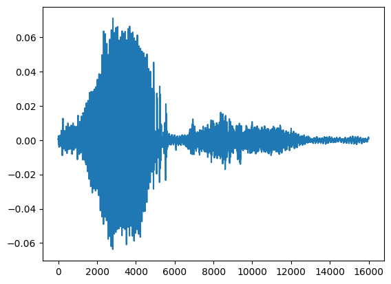
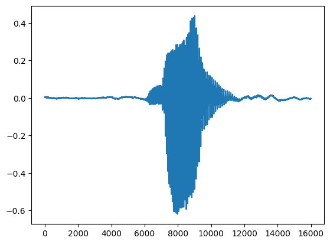
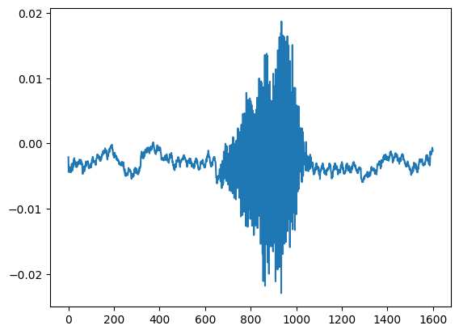
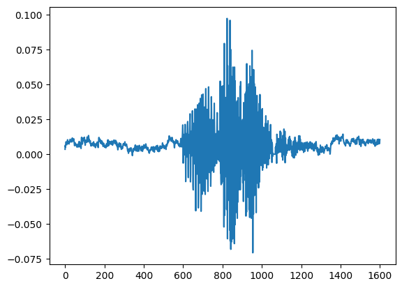
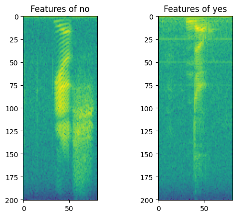
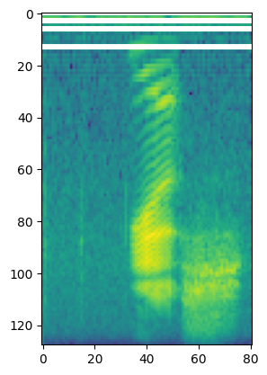
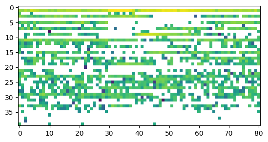
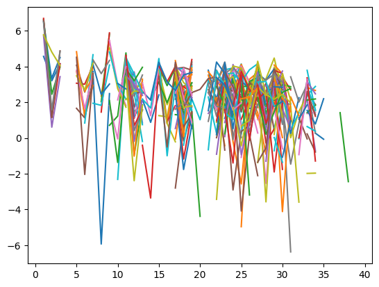
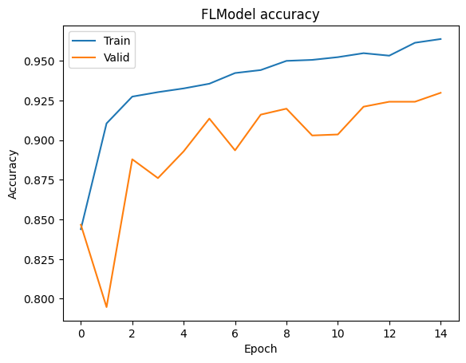

:target{#基于-PyTorch-在-SecretFlow-中实现水平联邦音频分类任务}

# 基于 PyTorch 在 SecretFlow 中实现水平联邦音频分类任务

:target{#引言}

## 引言

本教程基于 PyTorch 的 [微软教程：使用 PyTorch 进行音频分类简介教程](https://learn.microsoft.com/zh-cn/training/modules/intro-audio-classification-pytorch/) 而改写，通过本教程，您将了解到现有的基于 PyTorch 的示例如何快速地迁移到 SecretFlow 隐语的联邦学习框架之下，实现模型的联邦学习化。

:target{#单机模式}

## 单机模式

:target{#小节引言}

### 小节引言

本小节的代码主要来自于 [使用 PyTorch 进行音频分类简介教程](https://learn.microsoft.com/zh-cn/training/modules/intro-audio-classification-pytorch/) ，主要讲解如何在 PyTorch 下利用简单的神经网络进行音频分类。 为了教程的简洁，本小节仅仅简要介绍了一下各部分的功能；对于实现的具体解析，请读者移步参考[原教程](https://learn.microsoft.com/zh-cn/training/modules/intro-audio-classification-pytorch/)。

:target{#安装-TorchAudio}

### 安装 TorchAudio

<Notebook.Cell>
  <Notebook.CodeArea prompt="[1]:" stderr={false} type="input">
    ```python
    !pip install -r https://raw.githubusercontent.com/MicrosoftDocs/pytorchfundamentals/main/audio-pytorch/install-packages.txt
    ```
  </Notebook.CodeArea>

  <Notebook.CodeArea prompt="" stderr={false} type="output">
    <pre>
      {"Requirement already satisfied: torch in /opt/anaconda3/envs/limingbo_sf/lib/python3.8/site-packages (from -r https://raw.githubusercontent.com/MicrosoftDocs/pytorchfundamentals/main/audio-pytorch/install-packages.txt (line 1)) (2.0.0)\nRequirement already satisfied: torchaudio in /opt/anaconda3/envs/limingbo_sf/lib/python3.8/site-packages (from -r https://raw.githubusercontent.com/MicrosoftDocs/pytorchfundamentals/main/audio-pytorch/install-packages.txt (line 2)) (2.0.1)\nRequirement already satisfied: soundfile in /opt/anaconda3/envs/limingbo_sf/lib/python3.8/site-packages (from -r https://raw.githubusercontent.com/MicrosoftDocs/pytorchfundamentals/main/audio-pytorch/install-packages.txt (line 3)) (0.12.1)\nRequirement already satisfied: sox in /opt/anaconda3/envs/limingbo_sf/lib/python3.8/site-packages (from -r https://raw.githubusercontent.com/MicrosoftDocs/pytorchfundamentals/main/audio-pytorch/install-packages.txt (line 4)) (1.4.1)\nRequirement already satisfied: filelock in /opt/anaconda3/envs/limingbo_sf/lib/python3.8/site-packages (from torch->-r https://raw.githubusercontent.com/MicrosoftDocs/pytorchfundamentals/main/audio-pytorch/install-packages.txt (line 1)) (3.12.4)\nRequirement already satisfied: typing-extensions in /opt/anaconda3/envs/limingbo_sf/lib/python3.8/site-packages (from torch->-r https://raw.githubusercontent.com/MicrosoftDocs/pytorchfundamentals/main/audio-pytorch/install-packages.txt (line 1)) (4.8.0)\nRequirement already satisfied: sympy in /opt/anaconda3/envs/limingbo_sf/lib/python3.8/site-packages (from torch->-r https://raw.githubusercontent.com/MicrosoftDocs/pytorchfundamentals/main/audio-pytorch/install-packages.txt (line 1)) (1.12)\nRequirement already satisfied: networkx in /opt/anaconda3/envs/limingbo_sf/lib/python3.8/site-packages (from torch->-r https://raw.githubusercontent.com/MicrosoftDocs/pytorchfundamentals/main/audio-pytorch/install-packages.txt (line 1)) (2.8.8)\nRequirement already satisfied: jinja2 in /opt/anaconda3/envs/limingbo_sf/lib/python3.8/site-packages (from torch->-r https://raw.githubusercontent.com/MicrosoftDocs/pytorchfundamentals/main/audio-pytorch/install-packages.txt (line 1)) (3.1.2)\nRequirement already satisfied: nvidia-cuda-nvrtc-cu11==11.7.99 in /opt/anaconda3/envs/limingbo_sf/lib/python3.8/site-packages (from torch->-r https://raw.githubusercontent.com/MicrosoftDocs/pytorchfundamentals/main/audio-pytorch/install-packages.txt (line 1)) (11.7.99)\nRequirement already satisfied: nvidia-cuda-runtime-cu11==11.7.99 in /opt/anaconda3/envs/limingbo_sf/lib/python3.8/site-packages (from torch->-r https://raw.githubusercontent.com/MicrosoftDocs/pytorchfundamentals/main/audio-pytorch/install-packages.txt (line 1)) (11.7.99)\nRequirement already satisfied: nvidia-cuda-cupti-cu11==11.7.101 in /opt/anaconda3/envs/limingbo_sf/lib/python3.8/site-packages (from torch->-r https://raw.githubusercontent.com/MicrosoftDocs/pytorchfundamentals/main/audio-pytorch/install-packages.txt (line 1)) (11.7.101)\nRequirement already satisfied: nvidia-cudnn-cu11==8.5.0.96 in /opt/anaconda3/envs/limingbo_sf/lib/python3.8/site-packages (from torch->-r https://raw.githubusercontent.com/MicrosoftDocs/pytorchfundamentals/main/audio-pytorch/install-packages.txt (line 1)) (8.5.0.96)\nRequirement already satisfied: nvidia-cublas-cu11==11.10.3.66 in /opt/anaconda3/envs/limingbo_sf/lib/python3.8/site-packages (from torch->-r https://raw.githubusercontent.com/MicrosoftDocs/pytorchfundamentals/main/audio-pytorch/install-packages.txt (line 1)) (11.10.3.66)\nRequirement already satisfied: nvidia-cufft-cu11==10.9.0.58 in /opt/anaconda3/envs/limingbo_sf/lib/python3.8/site-packages (from torch->-r https://raw.githubusercontent.com/MicrosoftDocs/pytorchfundamentals/main/audio-pytorch/install-packages.txt (line 1)) (10.9.0.58)\nRequirement already satisfied: nvidia-curand-cu11==10.2.10.91 in /opt/anaconda3/envs/limingbo_sf/lib/python3.8/site-packages (from torch->-r https://raw.githubusercontent.com/MicrosoftDocs/pytorchfundamentals/main/audio-pytorch/install-packages.txt (line 1)) (10.2.10.91)\nRequirement already satisfied: nvidia-cusolver-cu11==11.4.0.1 in /opt/anaconda3/envs/limingbo_sf/lib/python3.8/site-packages (from torch->-r https://raw.githubusercontent.com/MicrosoftDocs/pytorchfundamentals/main/audio-pytorch/install-packages.txt (line 1)) (11.4.0.1)\nRequirement already satisfied: nvidia-cusparse-cu11==11.7.4.91 in /opt/anaconda3/envs/limingbo_sf/lib/python3.8/site-packages (from torch->-r https://raw.githubusercontent.com/MicrosoftDocs/pytorchfundamentals/main/audio-pytorch/install-packages.txt (line 1)) (11.7.4.91)\nRequirement already satisfied: nvidia-nccl-cu11==2.14.3 in /opt/anaconda3/envs/limingbo_sf/lib/python3.8/site-packages (from torch->-r https://raw.githubusercontent.com/MicrosoftDocs/pytorchfundamentals/main/audio-pytorch/install-packages.txt (line 1)) (2.14.3)\nRequirement already satisfied: nvidia-nvtx-cu11==11.7.91 in /opt/anaconda3/envs/limingbo_sf/lib/python3.8/site-packages (from torch->-r https://raw.githubusercontent.com/MicrosoftDocs/pytorchfundamentals/main/audio-pytorch/install-packages.txt (line 1)) (11.7.91)\nRequirement already satisfied: triton==2.0.0 in /opt/anaconda3/envs/limingbo_sf/lib/python3.8/site-packages (from torch->-r https://raw.githubusercontent.com/MicrosoftDocs/pytorchfundamentals/main/audio-pytorch/install-packages.txt (line 1)) (2.0.0)\nRequirement already satisfied: setuptools in /opt/anaconda3/envs/limingbo_sf/lib/python3.8/site-packages (from nvidia-cublas-cu11==11.10.3.66->torch->-r https://raw.githubusercontent.com/MicrosoftDocs/pytorchfundamentals/main/audio-pytorch/install-packages.txt (line 1)) (68.0.0)\nRequirement already satisfied: wheel in /opt/anaconda3/envs/limingbo_sf/lib/python3.8/site-packages (from nvidia-cublas-cu11==11.10.3.66->torch->-r https://raw.githubusercontent.com/MicrosoftDocs/pytorchfundamentals/main/audio-pytorch/install-packages.txt (line 1)) (0.41.2)\nRequirement already satisfied: cmake in /opt/anaconda3/envs/limingbo_sf/lib/python3.8/site-packages (from triton==2.0.0->torch->-r https://raw.githubusercontent.com/MicrosoftDocs/pytorchfundamentals/main/audio-pytorch/install-packages.txt (line 1)) (3.27.6)\nRequirement already satisfied: lit in /opt/anaconda3/envs/limingbo_sf/lib/python3.8/site-packages (from triton==2.0.0->torch->-r https://raw.githubusercontent.com/MicrosoftDocs/pytorchfundamentals/main/audio-pytorch/install-packages.txt (line 1)) (17.0.2)\nRequirement already satisfied: cffi>=1.0 in /opt/anaconda3/envs/limingbo_sf/lib/python3.8/site-packages (from soundfile->-r https://raw.githubusercontent.com/MicrosoftDocs/pytorchfundamentals/main/audio-pytorch/install-packages.txt (line 3)) (1.16.0)\nRequirement already satisfied: numpy>=1.9.0 in /opt/anaconda3/envs/limingbo_sf/lib/python3.8/site-packages (from sox->-r https://raw.githubusercontent.com/MicrosoftDocs/pytorchfundamentals/main/audio-pytorch/install-packages.txt (line 4)) (1.23.5)\nRequirement already satisfied: pycparser in /opt/anaconda3/envs/limingbo_sf/lib/python3.8/site-packages (from cffi>=1.0->soundfile->-r https://raw.githubusercontent.com/MicrosoftDocs/pytorchfundamentals/main/audio-pytorch/install-packages.txt (line 3)) (2.21)\nRequirement already satisfied: MarkupSafe>=2.0 in /opt/anaconda3/envs/limingbo_sf/lib/python3.8/site-packages (from jinja2->torch->-r https://raw.githubusercontent.com/MicrosoftDocs/pytorchfundamentals/main/audio-pytorch/install-packages.txt (line 1)) (2.1.3)\nRequirement already satisfied: mpmath>=0.19 in /opt/anaconda3/envs/limingbo_sf/lib/python3.8/site-packages (from sympy->torch->-r https://raw.githubusercontent.com/MicrosoftDocs/pytorchfundamentals/main/audio-pytorch/install-packages.txt (line 1)) (1.3.0)\n"}
    </pre>
  </Notebook.CodeArea>
</Notebook.Cell>

<Notebook.Cell>
  <Notebook.CodeArea prompt="[2]:" stderr={false} type="input">
    ```python
    # import the packages
    import os
    import torchaudio
    import IPython.display as ipd
    import matplotlib.pyplot as plt
    ```
  </Notebook.CodeArea>
</Notebook.Cell>

:target{#下载-speech-commands-数据集}

### 下载 speech commands 数据集

<Notebook.Cell>
  <Notebook.CodeArea prompt="[3]:" stderr={false} type="input">
    ```python
    default_dir = os.getcwd()
    folder = 'data'
    print(f'Data directory will be: {default_dir}/{folder}')

    if os.path.isdir(folder):
        print("Data folder exists.")
    else:
        print("Creating folder.")
        os.mkdir(folder)
    ```
  </Notebook.CodeArea>

  <Notebook.CodeArea prompt="" stderr={false} type="output">
    <pre>
      {"Data directory will be: /home/limingbo/workshop/secretflow/docs/tutorial/data\nData folder exists.\n"}
    </pre>
  </Notebook.CodeArea>
</Notebook.Cell>

<Notebook.Cell>
  <Notebook.CodeArea prompt="[4]:" stderr={false} type="input">
    ```python
    trainset_speechcommands = torchaudio.datasets.SPEECHCOMMANDS(
        f'./{folder}/', download=True
    )
    ```
  </Notebook.CodeArea>
</Notebook.Cell>

<Notebook.Cell>
  <Notebook.CodeArea prompt="[5]:" stderr={false} type="input">
    ```python
    os.chdir(f'./{folder}/SpeechCommands/speech_commands_v0.02/')
    labels = [name for name in os.listdir('.') if os.path.isdir(name)]
    # back to default directory
    os.chdir(default_dir)
    print(f'Total Labels: {len(labels)} \n')
    print(f'Label Names: {labels}')
    ```
  </Notebook.CodeArea>

  <Notebook.CodeArea prompt="" stderr={false} type="output">
    <pre>
      {"Total Labels: 36\n\nLabel Names: ['follow', 'wow', 'learn', 'left', 'yes', 'stop', 'three', 'one', 'tree', 'seven', 'bed', 'on', 'off', 'up', 'right', 'down', 'dog', 'six', 'two', 'cat', 'sheila', 'eight', 'happy', 'four', 'visual', '_background_noise_', 'marvin', 'nine', 'bird', 'five', 'no', 'zero', 'backward', 'house', 'forward', 'go']\n"}
    </pre>
  </Notebook.CodeArea>
</Notebook.Cell>

:target{#把声音转换为张量}

### 把声音转换为张量

<Notebook.Cell>
  <Notebook.CodeArea prompt="[6]:" stderr={false} type="input">
    ```python
    filename = "./data/SpeechCommands/speech_commands_v0.02/yes/00f0204f_nohash_0.wav"
    waveform, sample_rate = torchaudio.load(filepath=filename, num_frames=3)
    print(f'waveform tensor with 3 frames:  {waveform} \n')
    waveform, sample_rate = torchaudio.load(filepath=filename, num_frames=3, frame_offset=2)
    print(f'waveform tensor with 2 frame_offsets: {waveform} \n')
    waveform, sample_rate = torchaudio.load(filepath=filename)
    print(f'waveform tensor:  {waveform}')
    ```
  </Notebook.CodeArea>

  <Notebook.CodeArea prompt="" stderr={false} type="output">
    <pre>
      {"waveform tensor with 3 frames:  tensor([[0.0005, 0.0007, 0.0005]])\n\nwaveform tensor with 2 frame_offsets: tensor([[0.0005, 0.0004, 0.0007]])\n\nwaveform tensor:  tensor([[0.0005, 0.0007, 0.0005,  ..., 0.0008, 0.0008, 0.0007]])\n"}
    </pre>
  </Notebook.CodeArea>
</Notebook.Cell>

:target{#可视化波形}

### 可视化波形

<Notebook.Cell>
  <Notebook.CodeArea prompt="[7]:" stderr={false} type="input">
    ```python
    def plot_audio(filename):
        waveform, sample_rate = torchaudio.load(filename)

        print("Shape of waveform: {}".format(waveform.size()))
        print("Sample rate of waveform: {}".format(sample_rate))

        plt.figure()
        plt.plot(waveform.t().numpy())

        return waveform, sample_rate
    ```
  </Notebook.CodeArea>
</Notebook.Cell>

<Notebook.Cell>
  <Notebook.CodeArea prompt="[8]:" stderr={false} type="input">
    ```python
    filename = "./data/SpeechCommands/speech_commands_v0.02/yes/00f0204f_nohash_0.wav"
    waveform, sample_rate = plot_audio(filename)
    ipd.Audio(waveform.numpy(), rate=sample_rate)
    ```
  </Notebook.CodeArea>

  <Notebook.CodeArea prompt="" stderr={false} type="output">
    <pre>
      {"Shape of waveform: torch.Size([1, 16000])\nSample rate of waveform: 16000\n"}
    </pre>
  </Notebook.CodeArea>

  <Notebook.FancyOutput prompt="[8]:" type="output">
    <audio controls={true}>
      <source src="data:audio/wav;base64,UklGRiR9AABXQVZFZm10IBAAAAABAAEAgD4AAAB9AAACABAAZGF0YQB9AADhADUB/QCoAEMBtgCMACcB0gB7AY8EPQNK/9b/sQIQBPcCagILAfX+NQHKA9gDswFp/nT/iQHbAvcC8v/A/fj91v8nAXT/+/xj+2P7wP2F/mz9xvsV+aH54vt8/Lj7y/nA+BX5cfu1/A/7gvoS+kr6GvyZ/GD8uPue+mP7F/3c/bL9w/y1/EH9af66/zz/y/7L/hwAUQGJAVEBVACaAIkBIQOSAwUDvwKxAhAEZQRzBDoEWQOEAzoEDQWrBMoDIQOgAzoEVgRlBCEDzQITAyEDdQMvAxYCGQFDAUMB7wC2AA4A5/69/vX+6v3A/cP8qvso/Kr7m/uN+576gvpY+jn78/o8+mb6k/nz+g/7rPrX+jz6K/s5+3H7jfuq+zb8p/z4/R//WP88//L/0gBOAqMC6QK8A50ExAU1BrAH2wfpBxAJEAlkCfEJnQkNCuMJ/wkbCvQI9AgTCE4HhgdtBkYFnQTbAkACCALvAH4A3P2n/Iv8Oftm+tz4QviZ9/D2qvaR9S71vvT580LzGPMY84vyN/JF8uLxSPFk8ZHwBPBn8OjvIPBn8DrxNPMY81PyJvPX9VD4zvjX+kf7cfuh/kMBhANzBDcFXAdyCaIM8Q7/DrYPFRGAE98UlhXdFcMUJhUVFr4WTRZTFEgTHRO7EiASJhCADksN+QuJC+AK2AjPBn4FnQT0A4YCNQHI/1v+Bv56/Xz8K/uF+RX5Bvn4+Ab5JfgM99T27fd6+FD4JfiI+M74I/l0+rr6yfq6+mP70fxd/fj9F/2L/LL9wP0U/qf8VfsX/VL8f/uq+3H7uPsd++L7uPus+rr6D/v7/KT9F/34/Wn+WP81AVwCvwIvA/EE4AWXBiEILwgTCPQIqwnxCZ0JOgmOCXIJAgm8CCEIXAfdBkMGxAWMBasEHgQTAxYCJwFUABwAEf8G/iX9YPx/+wH7LvrO+Pv3Yffi9gH28/Wf9QT1EvXo9HT1u/Ur9oD24vaL99/3Mfkg+pD6K/vG+9/8iP1d/er9bP1u/Pv80fy9/jz/wP0U/lv+rP8f/x//DgD1/lQAbQGUAmcDBQOPBH4FiQZLCCwJNwopCiYLIQ3MDIMN9A1LDfQNcg46Dq0N2gyUDE4MpQvuCrkJSwiXBjUGJwbHBKADhgJtAdIARgC6/03+3/wo/Lj75fqv+Zb4b/eA9uX1kfW+9Ovzw/KL8sPyKfIp8kXyCvMm81DzP/RN9Dz1rfVj9uL2KPcJ+MP3zvhN+T/5hflb+ef5dPrU++L7kPrz+sb71PsM/Hr9+P3t/KT9AAB7AUACIQNlBHAFlwYQCTcKCgtqDOgMOg7ED5cQpRCIEOsQ2hG+ET8RpRCZD28Pxg4eDksNpQtQC4wKqwksCZQHwQZGBRAEgQTNApcB4QCe/3T/6v2n/Az8uvog+r35Bvle+GH3DPco93L2R/b+9v72K/a49sP3QvjA+KT4I/n2+ZD6R/tH+w/7cfuQ+rr6IPp3+b35pPgd+8n6hfl3+Qn4LvrJ+nH7jfvL+Uf70fy9/ioAkP9wANIAvwLgBRkGlwbPBj0I7gp7CyMMFQwjDAQN9gzXDXUNagzdC+4K/ApFCuYIsAeXBu4FGQbEBToE9wLsAScBNQG2ABH/zv3f/ET8UvzG+2b6hfn4+Hr4pPh6+Az3nPbU9rj2U/eL9yj3U/dQ+Nz45/lY+iD6HfvG+5n8lv0l/SX9Xf1B/T7++P1B/d/8KPwG/hT+0fzD/I37Jf1N/hT+9f7q/RH/0gBAAnUDTgKuA2IFhgeaCm8Ktgo0CxUM/w7VDikPqg5LDRsPiw8pD7gOrQ2wDF8LQgsYC9gICAd+BccESASxAl8BZv/q/fj9M/1g/Cv7W/mI+An4mfeA9iD1FfR684jzlvPD8inyqvEM8inyRfJv8mTxDPLt8qTzLvVm9cn18PbD9zH5d/lb+S76IPqC+pD65/mv+fj4svg0+O333PgJ+P721PYa9+333Piv+RL6Svq6+qf8r/50/9b/bQG8A4wFsAchCLwICgtqDJwOpw+ZD14QUBAxEcwRsBEVEVAQ7g//DikPqg6wDBgLKQqOCcoI6Qd7BjcF2AN1AwUDbQFwAAP/Iv74/fv8jfs8+hX5pPjf9yj3GvdV9uX1rfWO9gH2rfXi9mP2cvZv98P3iPj4+CP52fl3+dn52fmF+a/5XviL9wn4KPdh9/v3W/lV+5b4W/kG+er4bP2I/Wb/af6Z/BkBwgHHBBkGLwPuBUMGxwmUDJcLagz/CYkLLA6ODpwOwQvBCyMMwQuwDDoJzAelBikFlwZ1A9ABtgAu/5oA5P9K/1v+Gvwa/FL8Cf2Z/IL6BPr2+Z76ofmy+Hr4mfcl+EL4UPjO+CX4FfkE+g/7i/wM/O38Iv48/wsBagJZA64DjwQ3BUMGswaoBcQFXwYKBlQFVAUsBM0ClAKoAA4AyP8U/oj9mfzi+yv71/or+735vfnX+gH74vvU+6f8d/4R/2IANQH6AT0DVgT8Bc8GeAcsCYAJmgrBC7MLXAxcDNoMrQ0sDlYOyQ2DDbsNIQ2wDOsLxApWCT0IzAfSBasEhAMIAkMBgv93/tH8cfvz+lv5pPjw9q31LvWI8xjz1PGR8OXwIPD27wTwW+8x70Lueu6l7uDt4+y7647sN+387eDtjux67oPw5fDU8X3ypPPz9af3nvqL/Br8H//eAY8EogeiBzcKiQsCDskSARP8FEIVPxbDGX0ZmRlyGNcXxhhHGAEYBxYPE+gRiBAbD/QNGAuRCDUGVAVzBLECUQGT/oj93/zi+5v7WPr4+Jb4evgX+Iv3R/bz9XL2xvY292/38PY291D4r/kP+0f78/qN+3r9of4OAMj/H/9wAP0AhgJqAkMBqABK/yoA5P/O/WP7+/fR92/3gvUj9BjzwPPt8tTxmfIr8UjxtfKI88n1PPUr9lD4r/lP/RH/DgBqAvQDeAdICQ0KMgyRDW8P7g+IEE0RLhJyEywTBBLaEVsRXhD8D/EOnw3dC20L4AoeCQUImgUCBC8DJwFGANn+bP2Z/Cv7gvrZ+Xr4NPhv90T35fWw9Ef2u/VY9QT16PRH9kf2+/d6+Bf4wPh6+Nn5EvrZ+dz4UPjq+NH3w/eq9r70FfTf8lv00fdT9xL1zvMS9Sj3P/m4+9f6Svoa/Er/hANiBfwFUQaRCJQMiw/5EBURsBHiEzEW8xfUGLsXvhYuF6oY4hgxFjcUeBH8DxgQVg6GDK0ICAeJBlQFgQSzAQAAsv1s/fj9p/x/+/j4b/ff9zT4w/cB9rD09vTJ9XL25fU89S718/Uo92/34vaA9hr3bPgS+hL6W/nq+Hr4sviT+ZP5GvdN9PzyCvM38snwpe7l60LusO/S7Zzsdeuq7DTuOvGy80XylvMa9zn7gv9+APoBhAP6Bp8NiBB4EZESOhPoFsMZEhy6HNEZPxtKHGYcZhzGGOUXbBUsE7gTXhDJDcQKkQjbB+4FnQTCAfX++P2y/e38yfqT+dz47fcJ+Kf3uPbJ9RL1SvVy9kT3U/cr9mP2svh3+Vj6vfk/+br6K/vf/Kf8uvrZ+Vv5Tfl99y71wPPO8yvx7u067FnrZPFk8cbs8+tZ663wI/SO9jn2mfJE9/D77wCMBeYDgQSiBx4O3xQYFYgVbBVkGIsePyCsIYgf1xwJHxQgaSCLHhoZdxakFacUdRL0DeMJeAeaBZ0EEwO6/8P8IPrZ+ef5zvgr9nrzQvMx9Fj1ofRs8/DxN/Ij9Mn1nPbX9XT1VfZ6+Fj6rPrZ+YX5Zvri+9H8/vuh+ar2Gvc299r0uPH57sTt8+tt6TfoYe3d7proL+aM6MbscvGW83rzVvEH9HH7iQFDBsEGXAdhCgoQRRmQHEIapBpEHigjLSYAJ/gkmyKYI9klhSVjIrgdRxgHFs8VlhWzEEgJbQb/BAIETgLI/8P8NPi19035FfkJ+CP0GPMV9Lv1svjG9jn2rfWO9sD4Xvi6+k350fcu+vP66v3O/VX7fPx/+9H8mfyh+Wz4afT88tTxz+7X6xjpLOdR5PrfUd8658fn2OEn34nfEOfU7I7xIPCA7Af01/qxAj0I9wcTCMcJqhMEHKcenB2kGjAgryWHKaMpNiMgIecgwyPAJEEfNhmDEvwPkRIjEZoKEwNN/jD+9f5d/T/5BPVs8wrzP/TU9oL1b/LG8Wzzb/d6+Iv3jvbw9vb5VfvD/NT7qvt8/Cj8gv8OAFv+jfsG+bj7VfuF+R32SvDP7gLspemo6Nrlj+Ik2yLXHuJ16wLn0N8t3XjluPFY+n/7NPNV9mIAfgqWFQoVUxStEtcXDieeK54rTCVVIgYqeS7hMSos/iIRIecg/iIGIH0ZEhL/CfQI8QnpBwgCSvoM94723/fA+AH2mfKG70jx8/WW+Or4u/Ww9GH3KPwf/4j9D/su+iX9HAALAVj/Y/tH+2D8d/56/Wz4D/Ze81v0PPX271Dp/+JG4ynjud2j21rXgdNjz8XPq91w46Xf29sk2x7ncvZm/2n+FfnL/kUKkxYoHlUd1xwjG00gUi36MgYvCyikJCgomC0GL7cnfx1vGeIYtRkPGKIRWQjI/6T9ewEkAiX9cvZk8W/y1PY5+x37D/ah9Gz4y/7KAzoECwEi/l8B3QaaCq0I5gO2AJoAgQTEBS8DpP0G+c74P/mW+OX1HfFh7TrssOpk5yzixN412nnWH9im1TvTWs3ZyOnWE+ai6mrlHN545Qb51w3MES8IlAc3D4senitgLV0pASLwIp4r3jIIMz4q6h8VG5YfJSRsH0UULAm2BTIH6QfSBZb9W/To733yGvfD9/b0pe5k7GHy/vulATz/kPrz+icBxwlIDqgKjAW8AwgHeAwVDGoH4QCL/BT+WP+h/qT48/D87VPtg/Bp73vpXOWU4Bbg9+DQ3y/c0NDyzuTTQdag1wbNjc+P4r7vn/XE7ZHrSvopD4UgPBy4E90V2SC3MWU1ADEALJAmhymgL6sw3CkwIGEZShcMGegWWxFyCZ0EAgRcAicBr/4z/YL6+/dN+br6W/6oANb/vf6C/ycGzAz0DVALLAnrC7YP3RC2D/wK0gWGAvcCsQKv/sv57fJC7kXtz+407nvpzOU340PkIeZn5jLlHuIO3v3ZqNm819DVQdap1JXR8MrFykPfiPPX9ZfuWebP7m8KHSLfI8kSXwvaFqMp3jfyMP4iIxtVGLUjXSmpIjYZ9gxWCTIMnxKtEh4JeAKT/nAAVAUhCN0GYgDR/D7+rgOlC7gONAuBBCwELA6fF3oaZBPSCtIKiw8gF9oWLw0TAwH78PtOAhMDp/x18I7nN+il7oL1CvOM6P/in+ZQ7lv0ffIE6/zjl99z4tjh9NwC3djXRtSpz8DMl+ST+eX6vvQH6mzzbBD9LJIvtRlQEEcYvy7HP7Y2AyayFSkUYyK9JTMfpRBnA1EBHgT2DHgMeALw+zT4GvxAAqgF7gXZ/qr7Lv9WBJcL1Q4jDBkGSwPVCUsSBxaiEZQHhgIQBFYJtgoCBGP7i/Ll8IvyCvOk84PrQOUW5YzoZPEM8v/sfeia6Gzz5/kg+t/yyuY340bjS+ZI4jvYXdGKy0rJ8MUA1DTuGvcS9SHrzOpLA5YkWTneLW8ZZhf4JFw9i0UkOFolLBM3FHof0yJxHaoORgDl+m0BQAyDDUsIewHt/MIBpQuZFNEU1w3jCZoK5RLwHdkgPxtpEXUNfRR3G2YcnBNcBxMDXAJWBMoDCf1V9g3t/Oi+6vHsyfD87Vbn0uNZ5nruPPVV9lPybO4m7n3ysPTP7oHifNUzzFLL789dzGPF/7YCtkPaCfih/ov3s+ka9+0eX0ENRXku2SDfI6g28URLOcUnLhIQBC8I6wauA0r/zPQ96wrpdfBC+EMBmgXbAtABDQU3D9kbvSAMHrsXIBImFYseVSKZGUsNzwbPBvwKwQu8AxL6IPoG+c7zG/JN763w6/Mr8Yju4+wr8T/5gvrl+jH5D/vk/ycBvwLO/Vv5uPYx7w3ohNzFz8vDYbx0vwHAjruUr765Yt4g+pENHglp/l4Qlzd8WSBXokI4MWsuLz5RQfQ01B0eBOr4ZvUY85zxz+6O5x7i6eWU7zD+vgycE30UiBUSHPsj5yreLe0oAyE2GbIVdBeZFGcN5gNE/Er6pPg292Hywe5b71vvPPDr7hvtB+8b8i718/X29C71mfcP+9/8W/4U/hf9/vsV+eX1CvNZ8MzlHNQGyFXAb7c/uYu3pa7HpzKqBtI2/AcWShd4ApEIoCqsXF9ym1jKOf4ikyX0NFEycSLxBJHrgd3k2FTjTe9V9iDwe+QN6FX7mRl+MeM1VCxHIsslqTGMO1Q78isjFqUGoAPBBjoJjwQP9jrsjuwY85D63/x/+4X5VftK/0MB8v8qANIAjAAi/n331/VY9X33svhj9jrxxuzE6OPsgvr/5+zfj9iAtvG247bzteW/U7dcr1mwV9OXEIQ0JDNVHSkPmC2vYIRv3l4QNacPeAwpD+MOjAXD8mjc08pVykHR+enHBOgMsAw6BJcLcScVQiBSkUg7MDkdEheeHMkcLBN7AZnt0uPP5PnuMflK/8v++Phe+PX+5Q3JF58X/A/sAR//uv8cAGn+W/Qm7sfn4+fM6kvrKfKI+P77JfiO8QTwEvU8+jTzhNxmxGSxg6uiuSjBusR6uJ+17N9WDmI2SD/QKJMgEzTwWHZl6FETNFkSIQi2Bfb5rfC24+bcqNkn2nvfbO5hCm4eVSdVJ1gmhzPgRX1PsEdUMZ4c9A2tCNIF7fzO8/bqjucj6pHwP/m/AiYQjhNWE8wRRQ8xFkoXGBUQCSD6cvHE6CPqmugK6WHoE+Zh6DHqOfYD/48E4wRS/GH3NO546lbi5M7Gu5ueEZh7pFu5+8sawbLMSvBHIgFOhUx7PAMw2kLfWd9PBTlnEmb63/Ie59vb2c1xzzXas+QS6ynt0gDXHAI1QkF7PEM3gTpTQGo9KiwgFx4EsvgV9GfrvuV+49jm8/Bm+oYCSAlQFQEiQSklKVUdYRQhDVwHQAK+9ATrFuCY2mXYsduM6Ibvtfd6+GP7kP+uA1wMjAqPBBr3peRg0Bu8lK/3oPqaE6Z9sjG5cramy4QDB0LbaTBgDUBPLmFAo19dX3BAMgz93sXK9cje0HzV/9114dXivuVC8/AYNEGTW4pZ3Ua5NUEuxDaUOCgozws67G3asdb03Njm1Oz88mz40AFIDq8bvSo9NLw0Iio5GJQHiP3+9nruNeT92RzUHNTC2tjmzvOC/8wHXwtFCs8LewsNCs8GnPaG4ILE0q2ooyiVipDOkSqeB7ljwNjXeAfKPoxxvnPLW1NAsD3AVUJQ6TPc/YfMsr06u3fDY8UqzyTgB+/CASYQyyroTIpje2gdU4E6vSoqJ68lohFs+MrcEc6bz/fWjufX9b8CgA6hFg8iACz9Nus8kjQBIhAJ7ffM71nrdeYC3fLTSc7k0xDiwPMyB2cSdxbwE/wPGBDaDPcHDPyG6rTV3b1WrFed8pN3jXSYUa6Ix3bXBeGODuBAmnH/fyJl10gQNd08FjMrGAzyxcqfv025WboEv5XRmfKzCwkfWiWKLbBCbFWVX+JTszcoHpQM0AGR9e7oseAv3GLexOPj59T2FQwiIEkwFjPsLUcnXSS9IBgVWQMM8vzjV91527zctuOM6IDxxvtLA1wMNw8PE00R7gpWCVEBXvgC7Frc2c0dwHK7dbVhshCsnp2oo8Gz3tA656r7MCrqUONwcGxkSaMpcR0+KsAkeAcO3tS7ZLbAwmDQe9+O8ZoKzh87K10uvDQNRSBShVECOkcYqABC+OX1MfTJ8MTt+e729K/57wDlDdEe+i1GMdYrNh7lEkgObQv0A2/38+tw47zh6+Tz67LztfzuBSwJGwoCCbYKPQ2wB7YAgPZn6+7j3trLzVXAU7dts4avx6Jgn8SoKMYs55P0kRcIPZhjG3bLW0MyrQ0EF4IhGxQm873DVrHauQnROuLG7GoCRRkkM/o87DfmOWc+ckT3OMsgsQLB7gfvTe/o7zrsketY9QUDSw1pES4Xeh9jJ8sq0yI6E6gFBv6F+cDzpe6f61bsZ/BN9Pv31/r6AYkLSw0QDqsJqwQIAiv7RPcx78/p/Oi54gjbBtKCySXCmbfQqWWitq3FyrvmAuxC+EIal0azchh3r1aKKFYT1BMjDEYAPeb60JvKwMy608TeofmvG+Y51UQpO18yxTHHOvxA4TZpG1v+6+7x57PpEvC195cBEw1hFKcUhRbJHDYo/SwzJLsSswES+kL4cvYj75Hr4+zf8jT4rPoR/4EEjg6REskNSAT7/AH7IPrc+K3w8eck4I/Ym9SvzWDLNsaIvZGwOKNwrbLCVN6M6CD1XhqlQdBoEWZcQu0eZw3+E+sLqvYI23/FpMyH1kvhpems+sAavzM3QP02vC9aL8IylTMUIKIHp/fz9V74dPXf8sbxQf0pD98ZNh5QGi4cICGNIgkfPBJAB/X+2fn88ibpjufG7An4BQNRBtIF4wR1CIwK/wknBn4AT/3A+FX2nPHx7G/oe+QL3w7Uk8itvzy6BatOpSaulsfd5AT1wBWPMH1UKmy6XLw+UxkjEfkLCwHM71LQAcXWyXDZL+sx+X0Pfyc1PNdDLz52NKAqFynFIjERJf1Z8FDuzO9Y9Rf4HftnCPkV3B8UIBUbpxlTGdQYbBAyAgT1we7B7g3thuoE67vwCf0sCbgO/wmEAwgCMgIyAsn6IPUm7trqzOqO5zfol+QI5UDgZdMSxDSzxaPbm9irf8V23Grl3/d6H7hJiXKVbiBIkCG7Da0NPQMp8qjZrMmH0RPcyuGJ6SoAxSKaQIhLnT/vMVcrtC2mLdQdqwmv+Vv0/PJ685z2w/yXCz8biiMiIO0ZwxkSHDwcLBN7Bo371/Vy9ibzuPGF9AH7vAOJBrAHjAVAAiQCfgDk/+f+zv05+1bxueeP4gXmp+0S8ODj3tBYv8Gz2q8ZpGqqg7p/1G3p/vENFDI402IQcA9O5CGuA8wHlwvn/iHmrMkdxc3Rytxk59z4WBfSNpdGvD4cLIIh4iI2KBQgNwqh9JHr4O1k8Qf0kPopBcMUMCBEHhsUVg6cE28ZmRkCDqH+AfZ689r08/B479r0iP2zBpcGygPy/y7/AgQWApP+zviq9jb3U/Js7i/rSOxy7L7ledY8xCO5Z6tlosWjbbMD2KXuHADfGfQ5m2IKcnxejzBcDLMGPQOy+ODjw8sPyo/YUOna9GoCnhz9NjFMaUyXPCIvPiUaI/gaXAwG/vnzdPWO9j/5FP4QBFsRShy9IB0dnxfJF+UXehUeCVv5g/Cq7P7xbPM/9M74Ef/uCksNnQlZA7L9hf6y/Qb5/PLg7cnreOoT5onkpeS555HmV9gPwEum55JbkpqoLskI5Trsd/6vIPNIMmmYY/RDtR7oDG0GuPY15JjQ5Mk11Z3dAuJC6aUBNiOtPuhH3TxcM0EutC3hJ3cW4AVg/L35xvYY8zz1af7VDi4cBiAjG4UWrRcJGp8XEw1+ANz4r/me+nT6uPZj9hf9hgKrCUILqApkCU4HAgQi/tT7p/cP9pHwaupq6oDsI+9F6O/ZNsb8t52smKQsp8y53toY7jz1fgr3Lt9Z9HSdZg07SxLNAsn6/O0s4vLTYtQp493pme3X9TQLFCpfQQ9J6T1zMHclwx5KF0sI3P0j+U35ofnt94j4T/1ICdoW8xz+HYga+RVyE28KyP+C9cnwiPPM9Fj1JvOF9IL6cABwBb4HiQbsAUYAnvop8lDuourS7fPwUPOI803vYeiu3DvTBsg8vxutlZu/oM+zFtbM6jTu/QDLJXlaiXcZaLM8KQ/6AbL9p/Jw43PTq9gh5ujvXu5Z8PEJOCz8SpZQ3UEqMZYkMCBkGOsLbQGW/QAADgBN/iL+WQPED+IdGiNeH0UZGBUbFHUNswG19+X1lv0bBWUEuPtp9C717fyXBkUKOgngBRwA4vtm9UrwqvGC9Zb4k/Q67Cfkv9sD2L/Rnsl6wqiyzaWPp4mzA84s4szq3QuSOUZiAnDAVborHglWBC7/keud3VLQrtL/3crhRuN98uIThzPgRRVCeTP4KWYmkCEYFc8Gr/7c/ef+xvu79WH3PP97C1gXbBq1GZ8XshWUEVMKBQPG++L7+P3w+6/5hfSt9bj7lwE1BqgF/wQ9A6UBiQHL/kT8R/tN+Ur1+e516zHqWesQ7PHnL9ymy3e5dqFrmw2ozseI7u33Iv6tEq45XWRGcRRbhC+nFLYK5/kb6FTU3MwL2uDope4m7l39nBj3M8lDl0GgORYz2y74JBISxADc+HT6d/5u/AH7YPzxBLMQjhhhGY4YNBq4GFAVLAnl+t3zP/Qj+YL6Yfc59gn45/70A0gEBQN+AG0BH/8u+mzzpe6i76fy6PRv8qLv/O326oDnJ9+P06zJqrYyoDOWJKAuv//iLvCL8vkLmjaVX0lrWFLtKN0QSw26/+jqhNdHz0bZPeZW5+PnYfc0FaMzB0J+QDU3mDL3LkcnNhn3BwP//vt8/Hf5Tfmv/m0GWRIMGfgajR3ZIA8iyxsYEGcDSvq197L4CfgP9kr1Ofay+ET8rgN1CEAMUAuPBLL9XvjJ+hr8rPqn9yDweu6I7szvU+1R5Bzef9Spytq0Yp4+oe63NdrR8nXrpe7BEOVD72c4YmxGaSBvFJ8NrfXv3o/TMtvB6fnu9OaO5879cR2dNdU6jDZoNFo0Ui2cGHMElvi9+XT/H/+b+4j9cwQmC2EP0g+fEoMX7R4BHcYTBQjA/YX5IPUd9uX1sviC+rX3uPa49kf7DgD6AWoCJALvAFj/Mfly9rv11Pb2+R32ZPGc7Lnn5uGa2TPRBs2AwMStLaIvq43F4N4v607liP3bLkxbQG4PWNAyLhcxEdgDLOy53ZrZFuUS8HXrKeiI89UOgSv/OhY9ZzmxOHAxrCGZD57/Jf22AJQCwgGaAEMGeAzGExoZpxmIGlAaixn8FIMN7AEl+D/0u/VK+gz87fwB+6r7Bv6/Au4FwQafCP8E0gDz+p/1VfYj+SD6AfZv8k304vbA+EjxNeTY3IfWfNDiwBCnZZ3HrMDHYuOq7FvvSA4TOUlc02IHTAYvShyTFqUBx+e32QXXLOJc6gLnzOUJ+MMU0C3SO1Q7hjiENJssPxvPBv77r/mh/gsBnv+6/4kBpQZCC14Q2hboGygeYRnoEYYHW/6I+E30/vbR93f5mfdF8p/wVvFp+U4C8QnaDC8IoAMJ/ZP5UPhv97L4PPpE/I72xvHx7ATrp+1Q6W3fGdBWu9WiKJpUqFDCoOGz7r7vZwjIMJlUWmCIUG0yPCHwHYMICu7C2rfU7N+a6MTohuoP+7IVVSczLt4tki+JN3420yc0FV8GwgFcAvL/m/uy/UAHZw3oEZQRBxGWFfAYYRl9FPkQqAopBagAy/m49kLzZvXJ9fD2YPwJ/eT/5P9b/gAAJwHmA2cDiQELAWz9m/t3+Qn4UPhy9t/yp+0b6I/idtz10pnGXrhZq5Sq0rfyzqjjqOjG+9ccGEE5XU9aX0H4JDQaOg7q+EXoktxR3z3r1OwC5//n+/dFD6kiJy2BMI81ZTX9LAkfOg4bBf8EqAUIAn4ApQGgA4kGgwg0C7MQrRfDGVMZFRbJDbkEtfzG9nf0gvXO847xkfAp8jb3k/nX+hr8cAC5BJoFZwNd/fv8Pv53/iX94vu4+4L6P/mU71/pnOei5bPkudgPyvO/Kbf2tKS9uskO2fnkDPJ9D4oyRFR3W9dNoDSsHEgT/QDl8HLnmuOr53jqFuWB4r7v/wSLGZsnii1+MW0y0C1EI4UWkQ09CNUEtgDw+zz6Jf3y/xsFYQrMEcMZIBzLG/4TrQ06BI37WPoa9xL1w/L57qrsfe1Z8N/yxvYM/Fv+swH9ADP9FP5p/g4AM/10+qz6Y/tiAFv+EvpK9d3ub+1I54bgrtyY1ZjQ8MWiuXW1fbyvzYze4+f+8XgR7zYmUPVW40Q1LWkgbBU9A/PwLOex4PHiGOSd3djh+e7bAlAVWyBoKjgxFjMUL38i/BRnDUgJ6QcZBukCxADCAbwDLAStCEgOjhNVGB0YzxVQEEMG9f5s+JH1BPX583Lx4O1F7V7uWPU2/DgAagJAAqADWQOjAiQC8v9m/0YAjAAG/hf9ofm79ULzVvHG8ULuaurY4ZLXt89uxt/BzL5pw7HRsdtk57YAwyOqREFahVatPt4orBxTD139LvBq5cTjzOW54qLgEOKq8RkGixSFIL8pYjFcM2Atix7PEOAKagcTCOYDZv+6/z7+T/3f/CcBOglWExoZaRbBEPcHxADi+1X2vvQg9SnyB+/X66joMep47yP0SvqlAcwHKQqrCbAHjwRqAhH/+/z7/Mj/PQPvAAH7qvbd81v0LvU/9MPyVvGc7MTjQ9rhz7LMedHH2HXhnOfE7bLzkgO9INA3PEgKS9s9NS26HHgM5/nM70js/+cj6gfqG+hp73T6agfwE68gCy30NP02Bi85IiAX6AylBrwDhgLYA3MEqwSMAMP8iP2jAmoMBBIBE6cPsAfvAPb5B/R18GnvK/EH7zHvDe2t68nwgPZN/nUDWQjPCzQLQAc1AXr9IPrL+Q/7JfjG9vnzsO9F7cbs8ews7I7scuxO6qXkud3Y14HTzdZL3Fnh8edk8UILdirEQCBIkT4+L70gBxbKCO38zvjX9fnz/+xf5GfmGO6q+5EIxhMwIBEr7DIkLk8k2RsVFiASLw1FCgoGowIOAIL6VfYJ+PX+zwZfCxAOBwwkBwgCCf2q+3/7i/zL+YD22vTw8fDxn/CR8C71of7xCbYPTREVDIEEWP90+qT4xvtN/qgA6QKT/pP5zPSZ8pP0Xvhs/U4C4wQ1AfP6KfKz6VnmxONZ4cHfjN5f31TjHueU6qLvkPpWE/gpXDNUNh8r/hg/EcwHIPqt9dr0QvOW8+Xw8+sN7d3z6v2GB8EQFxp0IaYjkyBsGiwT4A9CCwgHGwV+AL3+0fxC+J/1kfVE9xL6Ef/sAVQFxwTEAA4A6v34/er9d/mq9oD2UPhp+er4Qvg0+NT7YPwo/BT+gv9LA94BGvyW+K31kfU/9HruxOjK4YHdrtcZ0LLMy81/1O/eauqe+vMXUTfGSaFRGEtcOFItRyLED/EE3/yI82fwX+mU4CziaurG9qIHGBWvIOwtNTJaL08pzh8MGSkULA5LCE4Cbvxm9Rjuiena6pTvJfgLAfEEVgmaCrMGUQH4/cD9dP/W/xL6UPOq7Dfotuhh6OjqPPCk8zH5RPwz/VQAjABGAH4AyP/vANsCowK6/6f8+PgP9vP1D/av+TD+/QD9AFv+tfyn/Mv+GQGUAmcDVAX/BL8CtgAl/e38fPyL/Bf9i/xP/TP9FP6Z/Cv7fPww/uEAfgCv/t/8Aftx+w/7Y/vc/az/JAJWBFYEsQJDAVEB7AHmA8EGagcTCOYIvgdcB/8EIQMIAmoCYgWaBcQFLARLA78CmgDn/ij8Hfub+yj8Y/vD917zxO1W553iYt7m3Kvdj91z3djcktyo3qLgc+L/5/zthf7tGdkqHDGEL08kUxmnFEsNvAP6ATUBtgBN/tf1U/Lo9G786wbrEFMZfCO3LI0s5CYXH1AahRYuEu4P+QuDCBsF8v9T9+LxYfKt9fP6Iv4qAE4CeAKMABT+Y/tS/MP8yfq192HyiO7u7VPti+2f8Pzy1/Xq+BL6NvyW/fj9zQINBXMEXwYTA6z/gv+I/VX7UvwqAFkDCAeDCM8GjAXEBScGagd1CPEJqAo0CykKCAf/BIYCvAM3BWIF3QYkB4YH3QadBKMCpQFqAoQDoAMhA1kD2wKMAJoARgCQ/wUDNwXgBU4H/AVGBagFZwP3AnUDXAJOAlwCHADy//X+tfxu/Fj6FfmI+Db3HfaF9B3xG+3B6fHn2Ob05gjlqN6a2UPVyNMq1EbU3tWo2bzhl+lK+oAThSWSNHg4wi3RI8MevhazC4kGJwG4+174ou/V58zlI+og9e8A9gxpG24oyi8fMC0rHybTItkgAR0xFgIOKQWT+dTsX+Qs4kvmGO5V9rr6Zv+EAzoENwUnBhAJYQr5C44JAACh+aTzcuxq6pzssO9m9Rr82f6h/tn+AAC/AhkGlwsjEbMQpRAyDPQDVAD7/Jv7vf41AZQCSAQvA+EAFgICBEMGDQoHDLgOtg9LDUgJLAS6/4j9d/50/9b/rP/n/tz9w/yL/Mb7F/2s/94BWQNAAkMBKgBwAEMB7wC2AJD/d/6k/Zn8jfvX+lX7pP3c/U3++gGxAkACewGF/jP90fxu/An93/x8/E3+4vt6+Er6YPzL/g4A3P1/+zn7NvwG/vv81PvO/SL+MP61/Dz6nvqN+2P7Y/s5+8P8H//L/s79fPx0+mb65fpV+/j96v0J/Xz8vfmv+Zv7Jf2C/18BBQMeBK4DEATYA+YD2APpAgUDzQKuAwIECAJiAC7/yP/bAqgFzwYhCC8ICAfdBvEE/wR4B1wHogd4B88GBQizBh4ENQE+/hH/AAC2AG0B0gBfAQAAW/4X/br68/r++6T93P0a/Pb5Gveh9ELzSvXG9vj4nvpN+Rf4SvWn8rjx4vFh8tHyk/RV9uL2i/f4+Az8DgDVBNgIxAqzC2oMlwtZCOkHdQjmCEAM9A2ZD/8OEw0KC/cHPQjjCcwMNBBZEugR0g++DPQICAcFCBsKQgtTCksI/wR7AS7/tfxm+jH5BPqe+s74i/dy9lv0iPPG8drvGO7G7GHtKe1W7EDq2Ob/4kvhGd/h2ebXBdfs1dPZ8d2/4E7l8edC81YEPxEoHvUlESZdJEEk8B2AGHcWeBE6DqIHWP/c+H3yN/LX9Qb5jAAbCgET+xkgHAQcIxs2GVAawBouFzQVpw9+BZb9n/Xd7u7tsO8K8zb3wPiI+Ij4F/h3+X/7hf6xAp0EcAWxAtz9d/mA9g/23/ek+Gb6Iv6T/jD+zv2I/br/vAMkB8cJEAmGBycGSwP9ADz/RgDNAkgErgP6AYL/vf7y/ycBnQRRBt0GXwbmA04CpQGUAngC0AEnAZ7/6v2I/d/8BPqT+er4WPr4/Xf+QwHvAFv+Ef+k/RT+gv8u/8v+3P16/Xz8D/vw+zD+Ef+aAMQAy/7Z/rL9k/7I/xT+mgDsAbYANQF0/5P+H/8w/gP/y/61/D7+W/5E/EH9mfwi/ioAnv+zATUBkP8f/4j9tfzq/a/+xAD3ApoA7wDhANz9MP6Z/I372f41AU4CiQHW/8j/jACaAHgCzQLbAu4F3QbdBgIEQwEZAW0BIQM9AwgC4QDW/4L/y/7A/cv+fgC/Ai8DbQFwAEYAOACaABkBpQEyAlEBYgCk/Sj8Qf0+/hH/AAAAAOEAlAL6AdABewEWAoYCCAInAbr/wP2k/cv+2f7W/3T/tgDsAdABpQGXAWoChAOSA0ACswFwAPL/pP0P+x37KPyh/hwAxAAAAHf+Zv9m/0YAswH9AJD/9f4f/xH/xABDAZcBRgAX/SX91PtP/QAAaf5Y/y7/wP2T/ur9nv/9AHAAwgHQAXUDjwSxArr/3/w5+/D7p/zq/bMBqADSAAAAT/0+/qT9KgBnAx4EYgVnA9b/Ef/c/Vv+RgCQ/3AAGQFY/+f+6v1b/icBlAI9AyEDwgGlAfL/W/5iAIwABQM6BE4CXwEqAFj/VAD6AfoBhAPHBEYFmgW8A1wCswHhAEMBqABfAXgCCwFiAC7/Ef9m/2IAJAJ4Aj0DIQMWAtIA/QCzAf0ARgBiAP0AbQGXAdb/PP+s/+f+Lv/n/pD/xABfAbMBDgDn/lv+iP3c/S7/nv/k/9b/hf7n/iX9GvwJ/VL8d/5K/8v+af5d/a/+Sv+h/vj9bvz++1L8jfsd+8b7hf6lAZQCeAJ7AWb/DgBiAFQA7AEIAuwBcAAi/tz99f4U/h//Lv9N/hkB0AGuA64DCAL6Af0A0AEhAxMDvwIyAmIA1v9iADgAlwEyAsIBhgKlAd4BQAJOAiwE9AP0A/8EDQVGBbkErgPsAaz/NQFAAi8D4wTKAz0DpQFY/wP/rP+zAQ0FSAQIAgAAMP6Q/xwAXwFOAu8AGQELAZ7/NQFRAZoANQGQ/6UBBQPsAWoCSv8z/RT+ev1m/8IBXAIhA/L/w/yn/Mb7+P10/6/+dP9m/xH/MP4o/NH8d/7q/b3+9f4+/hH/Iv6b+035UPgP+9H8T/31/tz9KPzL+YD2dPU0+G78PP90/7L9fPzG+0T8iP0w/oL/QwHhAC7/sv0M/I371Pv++6T9DgAIAggCnv8i/tH8i/yk/fX+4QClAc0C7AE4AAP/pP2T/qH+rP9tAc0CrgOUAkMB1v+e/8QA4QCoAF8BpQGlAewBiQHSALYAfgBiAH4ApQHYAxAEIQOJAZoAmgClATIC0AGjAiEDEwNcAhYC+gETAwIEhAOGAhkBwgH3AtgD2ANcAlQAr/4U/j7+hf7Z/pD/Zv88/4L/Ef8i/nf+vf5m/9IAfgCQ/yL+tfx8/ET8NvwX/c79r/74/WD88PuQ+kf7fPzf/Or99f4u/8v+Qf2N+4374vt6/Vv+af74/d/8Nvxx+8b7Jf13/i7/Zv9K/wP/k/7c/Qn9KPyL/Jb9MP69/gP/dP8u/wb+pP0z/bL99f7y/ycBtgDW/5D/vf6v/mb/KgA4ACoAAACe/9b/rP/k/zgACwEWAvoBhgJqAnsB/QC2AAsBJAITA8oDOgT3Am0BfgDW//0A+gHpAmUEHgSEA0ACnv+F/q/+PP9DAdAB7AHNAggC0gDn/gb+uv81AfcChAP6AUMBVADy/+T/A/9Y/34AUQHQAUMBVAC2AHAAAAAAAJ7/KgD6AUACJwHI/7L93/wo/Kr7bvyk/cv+2f6y/Xz8uPtH+/v8iP0J/T7+of6T/s791Psr+5768/rf/LX8fPwU/k/9bvzD/Cj8iP0f/+T/jABK/57/A/+y/fX+sv1K/1wCUQEWAtAB7wDCAXsBpQEkAukC5gPmAwUDowJqArMBvwLpAm0BpQFtAfcCdQN4AqADzQJ7AV8BwgH6AaUBowLxBCwEowLKA9gDTgJ+ACED/wRlBGIFKQUyAqgAZwNOAsIBzQIyAjcFGwVZAx4EtgDW/7YA4QBnAz0DHgRlBMIBBQN1A7r/RgCaAHT/5P90/5cBlwGe/xwAr/6y/Tz/9f66/0YA9f4R/xf9wP3Z/gn9of4U/jb8gv/hALX8cfs5+8b7af4OAIwAT/2n/Nz90fzw+5v7+P0f/+T/5P+L/Jv7tfx6/Xz8fPzq/Zb9Lv9P/UT8Iv4z/QP/5P+T/tb/RgCv/icB+gEU/qH+vf7k/z0DJwFm//X+Qf2oAGUEdQMeBNsCowJZAyQC2API/6/+SwPNArECJwEcAPL/swHVBMIBjABLA3UDLwOuAyQCBQNwBSwEcAX3Au8ASAQFA8cEewGv/nsBPP/bAk4Cgv9DAXAAGQEWAoYCMgKJAZD/VACGAkMBMgJ+ADz/TgKF/vv86v2I/RwA+/xd/ZD/+P29/nz86v1+AGz98Ptu/MP8RgA+/qz6wP02/JP+kP/Z+Uf7xvu4+4X+tfyq+xf9xvvt/Cj8P/nO/UH9Ofus/zb8R/tE/Lr6F/37/Az8fPwM/Fj6T/1p/gP/VAAG/oX+Gvw8/9b/5/7CAXH7iP2MAEH9AABiAMj/xAAqAIL/W/4nAXT/dP9OAvL/rgMFAwP/iQGMAF8BBQOlATICdP+MAJIDtgBOAjgA7AGPBAsB9wI+/m0BOgRfAYQD7fxiAHMEewHCAfj9cAAeBJIDBQOv/tb/pQFUANgDQwHvAP0AjADEAIkBwgHL/gAAof4sBPj95P9+AO33VAUU/kr/kgPf9/L/M/1N/qz/ofliACv7W/5RARX5VAA+/n/7Sv9K+uf+ewEo/MD9w/w290YA3/wr++kCcvbI/1v+k/lwACv74vvU+/D7jfts/c79fPxN/kT8Cf13/hf9Ef+T/sD9PP8G/nz8cAD9ANb/fgCN+5D/8v/n/j0DFP5UAHME5P81AbYAjfudBIQDuv97Bgn9JwGgA6z/YgVN/u8AdQMOAA0FlALeAaADjACBBL8C0AG5BLYAnQTy/4YCswYR/7AHXwG2ANIFHADYAzUBQwY+/oQDJwZx+3sLQf1iAHgHXviaCqH+FP46CZb44ApfAVX7ewZ3+QgCNwUcAAsBSwME+gsBTgen91YJR/uc9qUL1/UkB7kEY/awB/D2of4sBAn4zQKh/jz66v2I/Rf9WQOe+nAAQf2h+c8G5fV4B2IAiPMbCgf0i/whCIjz4wS6/6rx3QZK+sb2ogdp9Lr/AgT+9rwDJfib++YDm/syAg/7ffe2AO8Alv1tBqT4QvizBqH5AgmF/mP7SATX+rwI0fxE/EMGAft7BhAE1/rgBVv+dP+OCdf6JALYA278XAye+r8Clwbt9+gMaf5N/o4Jy/lwBT0I+PhDBlYEp/dFDyj8/QAVDIjz+RA8+ioA0g8P8SYQy/5K+vkQ+PiGAggHafkyB4YHT/3YCPj4QAeMBbX8sxAp8swH4AVY9RUWvfkr+xsPBPV7C2oHd/lODKr2FgdGBbX3ChD792cDnQku9ckNyfqMAHgHAfb2DID2CwGaCt/yrQ2C+vL/6Qdm9X4KTfnEBZQCSvp7Bhf4SARfAVQACALO/a4DQf1LAyQCd/57Aaf3gwgE+k4CJgsB8SkK3P0l/dIKjftwBdn+PQNiAMD9UAv4+NIFlwaT+bwIJwFRAZIDdQPpB6f8JAf1/gn9dQ2W/R4EPQhE/KMCTgcLAQ0FIQPbAhAE5/4NBdUEQf1+CksDMflkDmb6/QDKCOX6SwN1A5P+hgLQAUACxwR0/xMDuv+/AsIBBQiJAUsDZwNg/JQHBQPO/ekHD/vbAp8I3/dOBzn7qADmA3z8iQFP/aH+xwSy/Vv+UQEf/xH/4wR8/LX8/wQa97wDK/sAAMj/sv3bAiP5YgCe/1j/uQQD/2n+5/mQ/+EArPqwB2n0+gFp/gb5UQaT+ZcB0fw/+W0GBPrJ+n4FY/ZiAH4A9f4a/OT/8PtK+scEAfvc/TP9SvoD//L/H/+2ANn57AHG+4j9XwEX/UsDbP2T/iv7fgAOACX9fgV8/Cj8qAWs+kAC4QDL/rYAOACaAPb5LAR3+b8CCwHt/KgASvoQBPD7mgCdBOL76v2SA0r6w/yJBhf93QYu/9z9T/3i+58IMP4KBgb+I/mGAtz9ewaaBTP9FP6b+0H9ewb0A3UDaf5j+73+JAIZBsIB+/y6/5D/5/4WB2P7gv+8A6/5CAek/fj9NQGT+bYF7fy2AFYEyfqjAoYC7fxUBa/5zv1OAgn4XwZ0+vX+LAQj+bMBHAAj+ZoAJwEr+0gE/vvG+yX92f7QAdz4SARp+br6Fgfl9f8EkP8Y86IHY/ZK/4EEzvNLAzn75/76BoL19f5GALX3XAdS/Bf90gCT+eMELvrR/IYHTfTxBAIEdfBWCaH50fwhCAT6Lv88/wsB8v9p+U4CCf10/9IKxvarBPj4dP/rBoj4jAol+Hf+2AhN/uT/JwaI/aH+xwRUAM0Cjfv/BGb/WP8ZBqf8+gEz/foGDgCh/p8IF/hGBdb/UvyoBa/+xACk/RMDWP/hAKMCTfmxAsoDbP3bAp7/BvkWB+kC8/q5BCj3cwTpB1v5Tgca96H+GwVd/W0GY/uC/94Bd/4yAt/3wgGGAuX6Ewi49tf1PQMu/3sB5gMX+Nf1bQFp/moC8Pvw9vj4W/5TCjH5bPhK+hX02AMqAAn9iP3D91L8xvvA/Zn8Afun/JD60gDn/vv87fwd+0MB1Ps8/+EAp/cNBXr9fPx7Bpb4owKe/xr8+gHZ+ZD/8Pvq/ewBJwHW/4L/9wJK+kYAkgO1/DoENQHw+zcFhgInAUsDAACe/6MCXwFY/ykF1v9nA/8E8Pu5BHf+sQKMBbr/5gOe/ycBagJ7BpoAQf2aBeMEA/8eBE3+5fqADjICiQF+BXL2DQX/BDUBVADvAE4CiQH/BBf4lAJLA57/cwSW/bYA0fxiAEYFSvqe/7kERPyBBDD+af5m/0T84wSN+1EGRPwx+eMEk/muA0H9ZvreATH57AFY/5n3yfrf/D7+A/90//723gH6Aaz69AgV9Jv7lAdK9WoHIPou/xMITfnrBjH5D/ts/WIAjAV998QFKPzc/UgJlvi5BMv+AfudBDgAbQGC+vQIsv18/FEGnvo1BtAB9AOe/6z/OABP/e8AqwTbB278zwvq/Sv76AyW8xAJLwNb/t0LYfdICQgCuPsjDAb+0gAyDLr/yP9DBk/9WP/uClkDkP8hDXf+DgDpByv7nQS+B3z8HgksCQb5kQiN+0/9EARRAbkJ9vkhA3T/zv3EClEGTf4x+QIEBPqJBqULi/eaBdH8WPohAxMDewFtAUMB/vYnBqf8jvZcByX4A/+UBxX5DPw6BNz4mgAFA4v3nv8f/9z9p/xm/5n8r/6W/cv+4vuI+CwJu/V+ACEDNPN4By76Y/uW/Rr89ANK/wP/b/fc/UMBWPoFCJP0lv0FCL70LAni9ur9UQZe+LkJtfw4AGb/p/xUAF39jwSQ/1YE5/7Z+W0BZvo8/2wQPPoeBMoIGO7xCRkGP/kHDBT+P/nHCRT+tgBiBTn71QRm/+T/3QbJ+gUD5gMf/1MKof7J+pQCDPzjBF8G5P9+BWP7agKy/Rr8OgnD948ExAUp8nsGPP9g/GoH8PvNAnH7tfzSBcv+DgBY+qTzY/uJAUsIowIH9LMBEvVDAcELgPbmAzn7pPiPBEr/1/onAR37m/vxBHf5T/3z+iX9XwHy/3/7w/es/4j4H/9e+Mv5KPz++4kBCf2EA5z2IQMqAMDzRgX2+SX9dQOuA7L9UvzeAWz4/Aol/f77Jway8yQHyP82/CQHYPyrBFwHH//Z+YYC7fxx+18LVAA4AN0G7fzSADIHy/5ICScBr/7sATICvgeGAuAFMP7c/WP7xAoeBA0F8Qlm/7AHev1UBZ0EkgORCPEEWP8NBfcC8v9ODBwADgBUBSL+swbrC+8AswYg+jUBcAWaAOAP8/BUBc8GzPT8FN/8kP9UAEL4ygh6+EgOuvpp+SkPtujYCMoDCvNFFJP0hfmzBqLvfQ/vALDv/wk38oX+zwYB9soDwPjD/KUBTfSUArL9uPZqAmn0mgA6BArzWQNC+Ef7ZwNV+8v+0ffvALYAlv0qAG/36v0FAwUDkP+UAnL2Ef8yAoL6Cgtb9GoC/QDJ+oMNqABiAIwFcfvi++4KqvbjBHgC5fX8CoX+OADuBW78uvpOAkACw/y5BI8EW/nKCJb9mgVnCK/5ixRy9oEE5gNe+IAJ7wBiBVX7Tgw8/8ELZwPSAMIB1PZQC9n54w5b/soD2wdy9v8JBv5nCGIANQGSA9/8eAdRARAEkfXdBh//1/raEVv0H//eAQb5ewEZAXUDafmh/qz/U/f0AycBMfSjAmD80fwvA9/3RgBb+Tz/WQPG9tz95gOI+CoA0gCL7UgEiQbo76gFfPyw7wgHpPj9AIj4KgAcAOLxFQzu7fQIsQIM8u4KSvDmAywEgvWGAvD71/VCCxf99vlzBMD4QwHt/FEGSwNb+dcNJf34/ZEIk/RRBhkBWPq+DKz/hAMvA9H3Bwz1/j7+MgxE92IAVAAKBvkLNveOCe38mgBODE35rgPf/MoDjwQ2/HAFpP1s/UgO4vvn/ksDF/3HBE/9Lwhm+swH+gaq9g0KF/0f/7kEpPjBCyoAIPqUArv1uA5b/nAAjAVF8uYIzv1IBC76zvhADLX86QJY/5v7iQEw/sj/Vfu8A879lAKI+MP84wRb7yASlvPZ/goGn/AkBzP9TgLKA0r11PsIAv722hHA88b7hgcX+PQIb/J7AUMBvfmaCvv8evMpCjn2QAK5BMbsxwTW//X+cwRh9yL+eAeh/lEBVACw9EYASASxAsP8EvrYA3r9sAcz/fv80grk/5oFKQVH9jUBev1m/woQw/diABH/F/j2DGcD9AP7/EL46Qcw/jQLiQGc9tsHUQFtBoj9rgMo9/X+AgRiABMIyfBAB9sC5P+dCULzmfzHCaz6mgXEADH5qACoAFwChfn6BpD/wPjYCHf5F/3/CTD+hfn6Bt/8K/uzBpb9K/s3BYL1Qf11DY72rQ279XH7XwEr9iwJiPPxCfv3vf4kAqrxeAz4+JID3/ft/PL/8/VkDszv4QDO+F74uxJv8pcG1PZN9HsLqvYTAyL+RfLQAXAA6viEAzz1m/s9Azz1rQ0V+e33QAxY9VQFewY/72oCof6T/kgOyfXZ/tgDyfqDDQb5EvqJBrLzswtFCuXwbBA0+C8D5giO7PkVlO8jDEsIme1sFRjzzBF4B6f3GwWv+Q0KJAL8CkLzZAl8/BjzKx2z7mEKNQEu+v8EgvrGDsD4BBKN+3f+0fwa/C4SOvGDElv5NPPjCQH77gUnBj/5lv2MCvP6hAPYA1PyJwYnAdb/fgqD8E4CYgUa/DUGwP1u/G0BuQlT9zD+SAm+9EILp/wj73oQ+fNyCb8CD/EpBTTzlAye//v34wTD8o4JVAD4/YQD3fNtAYD2iQYZARf4kgM0+E/9mgW6+kH9cADt/EMB+/y6+vj9Tgeh9OkC1/ox9JcQ1/XPC4v3B/QNDxjzgwhiAMv+FfTjCS7/Y/aTGzrnuQmJBl7zvgxh9+MJZvVqAqUGbPjgCnT6XAzo75oA3Quz7jQVKPzc/dgIafQbClv52AOACcPyJhAWAov8gwhp+aULQwHmA6UG1PZfARAEQhDL+YwFlv1C80gOyP9nCAn96vjCAVL8pRBE/FkDRgDt9xAOi/LBC8v+5fqoCoPr/A/vAK/+uw3+9oL/8PalC6f3VgQbD//sLA7G9qz6qg7++7wDBPrn+XgC7wAsBH4A0fyk87AMDgAo/DcUdetRAd0LuOxhDzICou9yE9r0lviXC5z2mfwnBvj4CwH9AHLsuQmoBXL2uw2I803vfQ/QAaT9Tgc67F748xf29N0GVAVZ4fkL4vsJ/dQTofQ8+jUGKPfYCGoHsvNGBTD+bQEQCRYC/vY0C8QAg/DDGb7v6v1yE6LqTgxZA8n1KQrvAN/ygw33AuXweBFh9zcFhgKR9esGmgAi/qgAcwSf9ToOrgMx+asELvr1/mcDRQpy9uMEvAMX+CASTfl4AsQAw/LBELL9qwS2AI37CAK4+1kNnvrc/RYCUvyMCgz8ewHYA/P1MgdK/+33AgT++34AEASZ/EgE7fLYA3T6NvwPE+7tBQP2+QT6QAci/lEG0fIIB6H+evgmCynyw/xfBk35mgAWB04Cm/u4+8D9RPyJBlYEK/aQ/wz37AFiBTz1/AVu/Hr90gBN+cIBk/mrBMv+jfsi/pb9agI2/Gb/cfuQ/+T/Tf4hA/D2bQHuBQH2zAcl+JP5pQEX/agFd/mwB7L4OfttBiX4xABE/CED7wCv+ZQCGvyjAgUIF/1Y/+T/BPqaAHMEjABN/vj9w/yI+LYFuQRS/PL/BPr0AxwAvf6aANf19wKrBPL/nQTw+1QAXwZs+IQD9APw9iwEhfROB5cB9vkeCfPwDQqA9mQJFgJk7E0Wae/KA3MEvvSMCvP1xwnz9YYHRgAu+ngR1ecmEBr89f5nCJfunQnR/H4K6v0r9lL8afS7DUL4OAC5CdrvQgvO+ET3TgeT+bMLVfuF+dn+YfflDUf2cAXt/NLtuBPA8/wKWP+X7rAHZPFvCp7/r/ndBj/0oAOW/QoG3gFe+MQFVfbNAnAFUvwbBf72+gHSAOX6BwxB/coDwPgu+joJafkWBxYCgPbgBcj/hgKF/kH9JgtY9SkFQwFp+aIH1PbxDmb/bvzjDmzzNAtGBX33xwmq9moHiQYl/WEKpP0E+pEIAgk8+lALcfu197gOCALdBuEATf7Z/lj/LwjI/zIMQALz+rAHuvokB5oKKgDNAtf6EAQOAL3+XAz6AVEBCwHR/DICPQiPBFkDaf5B/e4Fy/6UB9/8PQMTAwz3xg5h95QCTf4l+JQMp/cTCIX55fo1AVX78QnR97YAwPg/+aUGU/cFCKTzmfcWB7X3VAXd89n+pP26/wgCD/aMBQ/2OgQAAAz3PQjD9+8AqAUb8lkI7fwx+TIMvvSe/20BUvz8BaAD0gCb+0gEbP3KAxwA/vvbAgn9ZQT7/LkE3P0QBEMBevgYCzT4iQGMBU35XAKPBLL9agKDCAH7GQaaAHgCgQSXAYEEIQNZA9b/ogc2/FEBJAezAQAAJwYZAf0AWQgZAaUBVAXW/73+vgfn/kYFvAN6/YYCyP8i/voBbvyy/VEGOgR8/FQAyP9B/Z8IYffbAhr8Y/vYCKf3jAA2/LYAJAKy+HsBGvwU/hT+af4D/2n5swbJ+h//W/40+Gb//vtY/1v+Ef/q+C7/lv04AP77Xviv/iL+RPxnAxf9P/lAArX34wQP+6UBmgBm+sIBp/d1A9IAcfvQAWn+r/4IAtn+swHG+0MG1PvCAaMCDPw6CcP3swak/eT/zwYJ/cQFqvuEA0r/0gDQAXAFYgVp+UMGmfwkB6gAhf65BFX79AjbAuYD0gBwAJID9AMqAPwFgQQP+zcPHftAB1YE1PtTD5P5XAz7/MIB+gbR/AcM7ffYCLr6pQY6CT/5eAyT9CwJxvuGAkUKrfUmCxX5IQPL/hH/UQGZ/FYEdPqaBfv3ZwMa/NH8Xwbw8bYK1PYIAtb/nPYpCtfrGwpY+jTz4AWn8tIAofki/lP3JwGt9Y373Qa+72oM5euF/uYDsO+cDg/xNvwM/GH3QwF/+6z/zv3O/Wb62wLc+DcFGvwg+tgIdPVkCaH5DgBtBqH5RQrX+vX+pQGGAuwBpQEkAsv+OgRu/HsLy/54AvoGbPgEDZP+ygP0A0/9/AWUAnsBnQQvA7L9+QuF+ZoFSAmh+TcPp/fEBfEJI/mfDU35EwPjCR371w3CAZb9xArO+CwJCgbo9MQPgvVRAaIR/vHPC139d/mqDgrzbwrvAN3z1Q408/cCFge48WoMmfcJ/WcIi+2+DMP3vfk9DVPoQAz++6H01Q4h67YFkP+U728PxvE+/pcGou9+BbX3PPWiB7XyNQETA8zqUwqA8YL6mgq75lYJPPUV+Y4J1OxDBs74LvWOCZbzy/5LA/7xgAkX/bj7IQhZ8B4Jw/x8/PwKgPG+B2IAEvrxCSX4VACzBqT4RQp6/WP7NwrX9f8JOAA2/LkJgvqUAmcD5P/KAyQCtfyJBtH8dQgCBG78gwjz9f8OXwHNAukH9vmfCIkBUQYw/uMEsv3VBGUEIv6UB3/7wQYu/8QFFgL9AHsBvf4yAtABZwMa/NUEofndBvX+rP8TA174WQgP+6sE/vus/4X+Ef+aBbX3QALt/Mv+MP54Aqz67wA1AbL45gOQ+vX+r/6F/jb8Tf7q/Vv5oAM5+0YA3/wJ+JIDlvhwAEYApPhP/VX7VACy/Wz9Cf3++z7+Qf2aACP5Lvp6/Ur/DgD++/0ABPWT/hkBsviJBur42f7NAjz6tgUJ/V39TgI5+9gD7AGZ/NABev3KA4QDSv+uA8v5zQJ1Aw4AUQaQ/3f+GQF1A1EBZQQX/az/EwOn/AUICwGXAZ0E6v3NAtABxAA9A8IBbQHbAtIAdQOGAiEDXwFwAMIBPP9fBioAQf1GBXz8FgJUBYX5WQN0/0MBjwRV+/0Ahf6oAA4AeAKs/zz6qAWs/1j/VgkG+R///wSO9swH4vtN/iEDEvohAwz8GQF8/KMCsv2L/IwA4vsIAhkB0gAX+L3+XwGoACQCd/61/MQAkP/6Adb/d/ny//L/0AG1/G0BfPw+/mIF0gC8A7X83P3sARwAXwF+ADz/cAClARAE8PuXAd4BhgJDBlv+tgWs+ngCfgVqAn4F2flOB1QAmgXEBQb+zwaQ/2EKbP2Q/20BNvw3D5D/gQQw/k35KQoIAuYIZv+n/LYA2f7VDu38BQP0A0f2Ag4o/L3+zAcM92UEEwNUAIkBZv93/n4AXAeF/qADdQO9+dsHaf6b+xYH4vt7Bk4C1PugA6H5iQZ4Amz9OgQg+oEEaf7sAZoF2fmBBNT20AGJAfD2NAtK+rj7sQI0+Gn+cACs/yP5Pv5DAR37JwbA+F39XALw9ggHLv/O+MIBgvp3/nT/RgC6/+f5DQXJ+p7/yP+Z8sQFmgCb+xAEJfj++03+OgSC/2n5DQW194YCHgQ5+4wFlv0X/SQHH//7/LkEYgCs/xkGeAKF/pQCQwHsAdABsQITA18B9f7I/4YCpQZUAAUDBv40+IkLuv+aBVQAp/ylBrX3jAou/2/3dQhiAMQFQwGN++EAlv1OAhsFlwFm+uEAoAPn+cQFgv82/IkBof79AKgALv8X/coDev29/rYF+PgqAAoG+/zYA5n85/4U/vL/tgV/+7kEVfbW/5IDd/5IBGz4cwQj+bYAYgUS9TUBQf1Y/9b/lv31/p768v829yEDmfxY+t0GG/I3Be38iPhDBpP5pP05+xH/fgA8/2n+I/nc/Ur6ev0vAxL6hf5K//b0nvrxBGn+1v8i/oL1mgUU/uL7qAXt8kMBtgDz+jQLGvdwAAAAGvxkCaz6nwi4+/b5ewuF+QUIpQGN+9sH8PuJAaADQAKQ/4MIdQOc9p0JbPjQAeAKI/mOCcb71v8KBj7+GQYV+dgI7AFs+GcNw/JnA8EGzvi2D2z43P1yCW780gVB/UgEBQP7/MEQ3/cNBSEDGvdWE174/wQKBsz0ZAnn/nsGmgCZ/EUK+Pg9COYDf/vEBTH5HADxBCX9gQRY/278QwGL9ycG1QSW+EgJBPp09YwKY/uQ/6gAuPsD/4wAlAfw9v0A+gGh9EsIWQNY+m0GqvZK+joEqvvpB+L7gv/k/1D4ZAlE9yL+nQS79bYFbP0U/qgA/vYAANn5kP+W/Xz80AHa9EH9uQT7/Mj//QAd+wsBev0J/d4BiP3EAFEBqAAM/IX+WQhRASD6ygiv/hr3kQjvAFj6QwYR/735/Aq1/OkCewb7994BJwa2BYD2vwJwBbD0XAzpAi71IwzA+OAFrQgP9oMNiPj9ALkJfgD8BTn25gPHBJoASwj1/pIDqvt0/wUIM/22CicBk/npByv2xAUKC/v32APpAvQDK/uJAXAFZvWDDbEC7fxAB5P0EwgyAkr/GQb7/Fj/IPoKBv77EvqOCSD6xwQ9A8DzIQjA+HsBsAff9+wBW/QWAhAEr/7y/6T49f7X9coIBQiq8QAAWPrX+u4FZv/A/fj9wPh8/PoGTf7U+1kDVfYu+hYHqvtAAoX+uPurBOL2CwFUAGn+swaI/R//DPcAAEsDoAP9AHf01QQX/Wb/kgOh+eAFJwFp/i7/CfhZA5oAVAXhAELz5gOF/mUETgIl/ewB8PZtBtgDXwG8CBX5d/5K/4kGsAdN+eAFqvYG/tUOuv/y/4v8JwHbAtsCeAd3/mb/Sv8qACEI5/7CAfcCYPyQ/+AFVgRu/BkBSwOJAcQAhf4IAoj9Lv9GBUH9NQEZAer9JwEi/rEC5gNK/9/8xvvYA7MBp/xiAE3+ewEnAer9m/s+/u4FbvxZA/b5FfStCF8B7AGy/dz4Aftm+nMElwHJ+lv+EvoG/ioAy/mXATn7Y/bpAlQFw/wS+rMBWPp0+usLR/vO+LYFIPUeBOwB8PbdBkf7FP5b/h4EbP1j+4kGNvc4AE3+lAJ7Bi760fw2/EYAOgTNAggCXf2e+rr/cAWgA9H8GQEi/rL4hgJ1A1YEcADG+3H7sv2iB18BPQM8/3/7mgXEANIATf5OB6ADhfm/Am0B3gHHBEr/Qf3sATUBygNm/1j/IQNiBWcDZvq8AwP/kP8sCeT/2f6JAdn+vAOUB8v+pP2oAKUBbQEpBTUBKPwQBJP+4AW/AnT6Vgni+8P8bwpV+0gEkP/l+jIHgvqgA7wDkP9fASj8Zv9m/8QFowJm+iv7b/ev/j0I3gG2ACX4nPalAc79xADNAqf3RPzhACP54vtzBNz9Tfl+AOf5BPqzBjb8Uvy5BJP0iQF+ANn5nwji9tn+M/3Z+UAMhflUBfj9bPMbChr8H/8IAuf+MgIo/GcD8PsJ/bsNGvwP+1EG/vYR/2oHQwGSAyv7d/62AAT6yggAAA/7jwSv+Vj/Xwbk/+wBgv8u+jP9zAdfBsn6dQiXAWb6CguC/73+fgAi/iEDEf94B5oAjfsD/wz8NwX0A4v8Zv9RAeL7cADSBRkB9f6UAgn9fgBCC9/8A//SBaf32f68A6T9qAXCAc79iP2n/AgCsQLbAnr95fX9AFEBH/8WArj2xvsIAvL/VgQD/2/35/69/gP/GvwOADgAvf6EA1D4sv2b+xL69wdu/D/5HgSn98v+JwHU+yEDUvwU/mb/SwPL+XT/swHO8yQHzQKh/uT/mgBtAVj6lAfJ+uT/eAeQ+s8GyfrSAKULGvwOALj70AGSAyEDsAzO+PQDCwGT9NUOWP/sASMMffelAfEEQwFcAhYHlwHX+t0GjAB+BRsKiP17AfoBfgBWBCED3QajAgAASwOy/Xf+GwWaBbL9OADEAAH7ewYbCs0CewG9/mP7ev1vCtIFafm8A735R/t+CiL+GvzQAQAA5/lwBd4BbPMyB1j/Qvh1A8P8bQFzBKH++Phu/FkD7fz1/hYCOfYX/S8DyfWzAcv+WPqxAoX03gEX/c74Sv93+bkEM/3D/Nn+kfWh/scEyfoo/Kz/lv36AYj9P/nvAEsDaf74/db/wPilAZ0Jsv3Z/iv7iQHpAsv+xAoi/kAClwFE/McJCf2tCKsEevjKAzICzwtwAP8E8QS9+ZEIDQVnA2cIFP5RAY4J3P3BC94BwP1tC7r6/AohA2oCagdj+7YK8/rKCKgK1PtAB5D6VAXVBMQAjglK/6/++gG2ALECswbNAhH/7wBK+ukHqAqZ/NABSv90+hAEiQHt/NUE+gH9AD7+JAJh9xkBMgeZ8usLi/x3+W0Gw/IkB4X+LvoFA2b6FP7++6gAFfmy/RMDn/UX/f77d/m2ABf9Nvds+Gn+RPeaAPj9uPGrBKH59vlIBJH1D/vEAAP/M/0J/QP/w/JfAcIBjvaXAdz4k/4LAeX6rPqxAjP94vt+BYv31v/k/6T91QRiABf9F/3PBv77zQIyB9/3IQOs/xYCxwRwALr/YgAeBKgARgUi/i8DhgJqAo8E+P3MB+f+Cgb3B174sAfmA/j9bQH3AnsG7AHPBpb9GQHmCGn+GQEQBIwAtgDgBRMDqvsWB1EBk/ngCnAA1PuGB18BGQGGAioAEf93+QgHCAcU/u4FP/mL/McEf/tnA80C5focADP9D/uXAScBNvwvA3f0DPxGBeL7KQXl9YL/Ffl8/AUI9u8sBD7+Y/s9A33yUQFb+Wb6OAAX+E4Cb/Lt/DgAbPN1CNT2afkZAWH3swbJ9f77w/xH9h4EuvpzBA/7D/YCBGn5UQEeBB32qAC4+78CMgcY8zIHUvyn990LIPreAZIDNPhcAuwBHgRDAdf6ZQR8/BwAYgVN+YYHrP88+ikK2fkIAhMIZvpOAkYAvwIeBHgCM/2L/AIJ9AO2AIwFEf8l/RMIWQPeATgAcADMB7MBdQjR/Cj8Swiy/f8JXALZ+Vj/iQEyDC7/owIa/Br3eAwNBRkBjACs+owAvwINBUgEH//n/soDCf2aACEInPZ4B4L/Y/ZkDj/57wAkB4L1/AVY/wP/qwni+x//OABm/x///wTQAdH3AgRV9nT/0gpY+m0Bb/d6/RMDrP/BBm/3k/m/AjgAnv90/zD+qvuEA437BvmMCi76of6JAZ/1uQSe//EEA//q+NgIYPwvCOT/m/tiBeX1swuN+z7+2gzJ9dgIbP32+YwKF/g1BsQAF/idCXAAtgDi+/cCWP81AaUGKPckByL+3P33Aov8mgDf/DUG8PseBMQF4vbSCgz87fwWBw/7lwF3/uAFeAIu+ksDVfvhAFEGK/v9AE3++P03BTgASv9wADD+Xf0WAnUDtgA+/s0Cmfwz/UAHsvgAAOsGgvpwBcP83P25BCD6QwYf/xX5LwNiABwACAJK+nr4ygNAAgAAd/7d857/9wKoAOf+Cfiq+/v8ZwOC/xr8R/u4+yj85P+lAUf75P9V+8v5EATZ/vP6vwKL/Dz6PQM+/qz/kP/U+7ECW/4IAuf+Qf3bApv7ZwM8/w/7agcw/nAAzAfX9a4D+ga49rAMaf6F/jcFafkVDJD6HgSaBfnzgAms/8QFUQZ39M8GwgGUAhMDGvw9A8b7CgY6CU35HADYCLL9bQFOB0r6ewGzBnz84wlnA8v5OABfBhMDNvwpCvnzd/7MDN/3sAfhAOL7zQLQAUACr/l1AyQC2fl1AzD+of4l/az66wah/pD/of53/mb/8Pt0/+r9CwGy/Wz9of7W/wH7ygMsBBr3+P1OAgn9DgCF/hL6FgIyAvX+3/x3/pP+QwF+ALYAPP8J/c0C3P2L/EYFr/6k/ZQCjvEeBKUG8/WDCLL4+/wCBPP6BwyI+O38MgdW8RYHQAfO+GIFGvxAAuwBEf+GB0L4HADuBXUDiQZP/QH7dP8bBSwENwU1AXf5agL6BtUE4QBj+z0DOABUAM8LQwHuClMP7wCrCWn55/mLD0MBlwZtAQn40gBRAXIOlwYD/wsBlvhDAd0GvwKF/tb/F/1+ANIKXwGSA1YENQE4AIj9W/kM/O38+/ci/vnzR/sf/576jwTc+Db3bQGC+tT2dP8S+vb5MgKk+M0CCAIl/eYIIPo6BNb/AftZCP72+gE2/LL9Tgc/+b8CafmT/v8EqvtiAFX7Tf7A/YwAH//r80MBVABK/9gDofQLAT7+jfuGApnyTgL4/a/5ewGC9RH/1PvsASoA5fUCBPj4Xf1OAqz6nv9j+9AB9f6e/2oHY/tUAMD9LwPVBCL+Gwqq9oYCtgWq+0gJvfkCBJoA0gD8Bfv3zwaF/qz/dQOQ/6MC6v0kBwz8PQOXBr35dQPn/hYClAJH+/X+sQI8/xYCzQLL/rwD0gCI/UYAagIw/kAH8v+W+KgK+gGC/7YFVADk/94ByggCBPX+EATA/Ur/swb/BAb+TgJZA1L8WQhOAvv3lway/dH8VAWb+8cEPPqI/VEGF/jmA/L/sv3I/6H+IQMr+9IF+/zl+sEGy/l0/0YA4QAU/lv5oAPw+6H5qwQ8/2z4bQFfAaT4Zv8yAhL69wInAfj4kP/hAMD9bP0yAoL6Xf3hAHf+of4i/soDEvrL/nUDYPwWAqz/k/7w+5D/SwNS/JoAdP8+/nf+VACQ/wn9/QCs/wAAjAAWAjb81v/KA4X+RgBcAokB8v/9ANz93Qb7/Mj/QAcg9aIHLARp/oYHd/nvAN4BQAKdBBwAxAW4+5cB4AXL/rMBCwF4AowA2wKuA6gABv6aBZIDvfm+B1EBbP0CCagAlv1qAk4CiQECBMv++gFcAvD73Qan/Mb7uQmN++wBJwa9+fj9cwSPBEYAKgAo/AAAaf4FA5cG3Phm/1v+PP9cB18BPv64+6UBYgDn/g0FF/g+/mUEMP6oAP77Bv5S/CcB3gFV9sQAJf0g+pIDDPxs/c79Xf0u/zn74QA8/3z8Lv8w/jz/jfvNAvL/r/kKBj7+2f4TA2z9VAD7/BMDjAAU/i8DJf1m/57/EwNfAbX8xwTt/Bf9EwgqAGn+QwHhAHr9dP9UBRT+dQNtAXz8VgTA/agFiQF3/m0GAfv6AXUDXwHbAnT/cwQa/IEEWQhx+xYHnv/L/owFDgCPBAP/6QJLAx//xAW2AKUBygP9AFkDewEIAhMDQALeAYkBiQGe/3gCPQMOANIAagKC/wsBjwT1/rMBDgAi/hMDpP3KA5oAY/tUBT7+RPy8A8QA5/6W/S7/5P+v/uEAZv9x+4j9Zv8w/t/84vtRAZP5bQHn/hL14wSv+X/7T/2v+b8Cofnf/K/+evgG/voBEvpY+j0DbPgo/BkBuPuMAHr9of7++zz6bQE1AVX7lv01AeL7JwEZBnT6KgDYA2n5EAQnAfX+eALR/LwDF/16/dIF+P2GAtz98/pwBXf+PP+xApn8W/4pBVj/jABzBJb90gAhA0sD2f5LA50Ew/xAAkMBkP+zAZoAwgHBBvL/hAPjBM74SwjZ/nz8TgxH+0MB4AUX/bwDlwGzAVkDGvxwALkERgBtAZcByfrn/lQFCf0kAsj/IPrpApoATgIu//D7UvyaAPcCcfvpAqr7wPgWB9/8ev10/1v50AHW/wP/Xf05+6gAtfxY//L/Y/tK/7X80gCQ/3T69wJE/Or9vwJx+1j/M/37/C7/p/xDAU3+FP6GAlX7Ef+zAbX8NQFB/eT/GQHf/C8Dzv10/0YAmfw3BRwAMP6jAoX+TgJZA3f+9wJGAOr9hANOAgIEyP8cAB4EUvw1Bt4B3/y+B5n8KQXYAw/73QZGAA4AIQgG/tn+IQhY/4wAvAPQAVQA+gGXBioAYgDYA/L/MgJGBQn9WQNZA2P7Ogkf/2D8yggz/fX+EAR4Ar3+QwGPBKT4agKoBe38gQQ+/jz/mgDR/IQDd/5K/yoAAftzBPX+1PsFA9z4nv+MAJn8kP/2+b8C3/yN+xkBKPcAAEr/m/vW/1L85/6I/dT7i/zA/Yj9Afsf/8b7K/tDASX92f6n/Ab+Zv9P/cj/Cf1qAj7+1v+y/Rf47gWQ/3T/TgJm+ur9gv+PBHf+FP5wBTP9FgIyAmIAZwPk/7wDdP8vA7wDVADSBXr9ZQTHBDz/0gXmA+wBtgDEBcQA9f4kB1QFMgJZA4kBJALBBiEDLARGBRH/cwQ1BkYAYgVLA7r/UQbpAksD2wIG/iQHCwHsAeYD7fzEBTgAXAJ+BUf7XALeAU3+ZwPq/ZoA7AHc/WoCvf7I/5oAnv+JAfP6RgB4AiX9JwE8/437JwGaACX9iQH7/HT67AG1/E/98v85+wAAfPxK/0/9NPhiAMb73/yF/sv5+P1d/fv8H//G+1L8bP37/Kz6Uvy6/2n5rP8u/+r4YgAo/E/9y/6n/JP+fPx0/4X+af5b/gb+0AGQ/2b/OABY/y7/uv/6AUMB+P39ADIC6v3HBDICd/7YAyoARgB4AlEBbQF1A6/+FgLgBVj/EwOjAhkBpQGzAccE0AGGAjcFJAJRAY8EowLNAgoG2wJnA5cBWQOBBJcBCgZOAvL/BQN7AZ0ETgIZAeMEZv+GAvEEmgBGAPoBCAIJ/bwDIQPq/VkDT/0yApIDCf0IAgP/dP/SAC7/WP+1/Mj/5P/f/K/+Tf5N/tz9W/4R/xr81v+k/er9rP9Y+nsBfPzG+57/YPxK/3/7Sv9S/Dn7qABj+wb+M/2N+/j9cfuI/d/8GvzA/X/7mfxE/DP9ev1/+2z9i/xd/SX9DPzf/OL7MP6k/c79hf5E/Gn+3/yI/Tz/Bv6s/03+H/9Y/6/+YgD1/sj/qACoALr/jABOAvX+wgGXAWb/WQMqANIATgJUAOYDMgJGAGoC7wB4AhwACwGEA2z9hAOSA7r/hAPy/7MBQAInAWoCkP9UAFQAEf94ArMB2f4yAsD98v9WBKH+AgT1/qf8cAAR/4kBvf7vAEr/y/6EA1j/Zv+XAZb95P/SABwARgBN/p7/af4kAg4ACf31/qH+/QCW/ScB2f7i+7ECBv4f/9IASv+h/sP8JwG2ABH/tgC6/6/+W/4D/73+AACaAIX+VAAu/9/8XwGaABr8Tf7y/6z6Zv/pAg/7CAI8/3H77wDq/ZQCEf+Q/+EA8PtlBB//KgA9A+L7tgCW/V8BhAMqAGoCEf84AEYAbQGzAYwAtgDvAIYCuv+JAaMC4QBqAu8AtgCzAVj/xACxAh//qADCARH/vf5wAOEA9f5OAi7/wP36ATb8cABAAjP9eALq/aH+xAD1/tgDwP2T/mIACf3EAJP+AAD9AD7+LwMD/4L/XAJ8/FkDjAAw/mIFbP1N/sQAW/6zAWIAdP/D/Er/y/7L/lkDFP6s/2IAMP7W/03+Zv9K/+f+VABwAAP/Sv/vALX8kP9wAKr7xAAi/m78qAB3/pP+yP8J/a/+qAA+/j7+MP5K//X+Sv+F/kH9swE+/hwANQHw+8IBzv0z/RYCT/3I/94BrP8AAF8B5P88/5QCYgAcAIYC9f5+ALMBr/76ATUBgv9RAUYAtgBRAagAOAAAAPL/fgCXAZD//QAIAi7/0gDk/3sB0AHW/7MBH/8OAH4AjAA1AZ7/+gGs/wsBIQMqAEsD/QD1/pQCcACXAdIANQG8A3sBXALCAewBxAAnAWoCPP/9AAsBfgDSADz/7wDy/+8AewFK/7r/HABUAPX+jAB0/xT+NQEcAKgAdP9K/wsBH/8ZAcj/5/4cAHT/UQHy/0YA8v+9/hYC2f4i/qUBgv8OAH4Aev26/5cBRgBiAJP+Tf7Z/gAAmgDL/mn+k/4u/yoAtgAR/2n+2f6C/w4Agv9b/tz9Pv4X/RwAcACy/TgAyP88/3sBUQHI/wsBcABb/jUBLv9wAB4ESv+XAYkBPP+XAXT/5/7W/7r/qADhAPX+1v9DASoAnv/QAZ7/MP7vAAP/xAAyAkYA8v8i/ur9bQFwAGIAvwL4/X4AlAIAACQCAAAu/5oAQwFDAcQAJwFUAMIBbQEOACcB7wBcAqMChgKJAVQACAIIAk4CewELAUACiQETA2oCVAB7AdIA+gF7Adb/UQFiACcBXwFGADgAZv/vAJ7/mgALAer9jAA8//L/MgJm/4wA8v9m/yoA2f7Z/qH+uv8OAPL/mgD1/mb/H/8R/5D/Pv4u/2n+PP9K/3f+Zv+9/tb/+P1Y/7r/Iv4ZAZP+MP5m/8v+nv+e/5oADgAf/wP/r/7I/wP/yP+s/zD+AAAu/1QA4QCe//0AAADvACcBHACMAFj/HAC6/9n+1v8u/yoAnv90/xwAFP71/i7/WP8cAEr/kP+Q/xwAHABm/xH/of6aAJoAnv84AC7/Sv8qABwAjABiAIL/1v+MABkBiQH9AGIAxABUAFQAVADI/0YAcABiADgAHACoAA4AOACMAIL/gv+e/7r/RgCMAKz/5P84AJD/YgBwABwAfgDI/wAA8v+6/0YAZv/W/4L/kP/k/2b/dP/L/qz/Sv/W/2b/Bv66/0r/2f5Y/xH/k/4+/nT/Ef9Y/zz/FP4w/jD+FP5p/hT+iP29/qT9Tf7q/bX8FP5s/Wb/dP8U/tn+5/5m/2b/nv90/73+Sv+e/57/DgDW/9b/DgAOAA4AOACoAFQA4QDSAPL/8v9wANIACwGzAf0AGQHSAEMBJwEcAG0BKgBiALMB/QCzAdIAKgA1Af0AlwGlAVEBQAKjAqUBbQHeAUMBwgFfAV8BiQHhABkB7wCXAbMBwgEnAeEAJwHk/4wAmgCoAF8BQwH6AaUBlwEnAXAA0gBUAJoAfgC2ABkBOAA4ABwAYgBUAMj/rP+e/zz/kP+s/8v+gv9m/4X+5/69/uf+AAA8/xT+Pv7c/Qb+Tf4G/oj9mfxP/Zb9F/1s/Yj9zv0G/vj9iP16/cD9MP7A/Qb+Bv7t/DD+Pv4+/i7/af6T/lj/9f71/pP+2f66/5D/nv+v/hH/5P+s/w4AWP+Q/wAAyP9wANb/8v/W/4L/mgCMAJcBewHSALMB0gD6AUACtgA1AagAUQFqAk4ChgLeATICeAJAAukC3gFtAUAC3gFcAmoC2wKSA1wCsQJAAk4ChAOxAoYCTgLCARYClAJOAkACbQELAVwCXAKGAjICUQHCAd4B+gHsAcIB7AHsAaUBbQFRAdABCALCAfoB4QBGANIAcABUAGIARgBwAIwAqADy/8j/YgBwAH4Auv8f/x//H//k/9b/5/5b/pP+hf4+/oX+MP56/aT9k/5b/nr9w/z7/BT+W/5N/hT+MP5N/jD+hf74/bL9iP1s/U3+Iv4w/ur9Pv50/2n+H/8R/6H+1v8f/0r/Sv+h/nT/1v+C/+T/1v/I//L/5P9GADgADgAcANb/5P9iAIwAYgDy/yoARgB+AIwA8v8OAOT/nv9UAOEANQHCAZcB/QBDAQsBqABtAYkBXwH6ASQCJALCARkBGQHvACcBewEnAYkBUQFtAd4BGQG2AEYA7wBfAaUB0AF7AfoBlwFDARkB7wCaACoAfgDSAEYA5P8AANb/HADy/9b/dP+h/nT/dP/n/r3+r/6h/nf+2f7L/r3+W/7q/Wn+Iv6k/TD+of7Z/mn+d/7L/gP/2f7Z/lj/of5b/iL+3P0w/jD+hf5b/hT+pP1B/TP9bP1d/Wz9iP1P/U3+hf7n/q/++P3O/Zb9FP4w/mn+d/7L/p7/uv+C/4L/nv+6/w4AAADI/9b/nv+6/yoAHAB+AMQAVAAcAPL/8v9iAJoANQHvALYANQFDAbMBwgHQAYkBNQEZAV8BFgKJAf0A0gDvAFEBXwFtAdIAjAAZAScB7wC2ACoAHABwAFQAxAD9AGIAxACaAMQAwgGoAAsB+gHeAVwCswHvAMQAOABUAIwAjAB+ABwADgDy/6z/AACQ/xH/rP9Y/3T/rP+Q/4L/A/9K/1j/A/+h/qH+k/4+/iL+bP2W/bL9Jf3f/Iv87fz7/Iv8+/xB/UH97fzR/Bf9p/yn/Pv8Qf1s/c79FP4G/jD++P3A/SL+af4i/oX+y/4w/vj9d/69/oX+A/8R/6/+PP/n/hH/kP+e/34AcABiABkBQwELAf0ANQFtAZcBewGJAYkBGQFfAW0BXwGlAcIBJAJOAmoCXAIWAhYCXAKUAk4CowJ1AxMDlAKGAjICXAIhAyQCwgEkAokBFgIWAk4CMgJRAbMBbQE1AVEBJwHvACcB7wC2AP0A0gDEAHAAVADy/9b/KgDI/7r/yP/k//L/kP+e/6z/yP+6/8j/uv8R//X+2f71/lj/PP/Z/gP/r/5N/jD+T/37/An9Cf3t/Iv8NvzG+/D7Uvwo/Hz8Uvyn/An90fzf/MP8F/1s/V39F/1d/fv8i/z7/Pv8pP2F/uf+Sv8R/6/+2f4D/0r/Ef8u/wP/Zv8OALr/OACoANIA0gAnAYkBpQGJAcIBowIWAvoBFgIWAkACCALeAW0BewFOAhYCswGGAiQCagK/Ak4CBQPpAqMCBQM9A1kDIQPbAgUDEwOUAngCeAJOAoYCTgJ4AuwB+gFcAhYClAIyApcBewF7AaUBXwELAf0A7wDSAP0ANQFwAGIAmgDW/8j/1v+C/x//W/5N/oX+af5b/hT+sv1d/c79sv1B/V397fwJ/Qb++P0i/jD+Iv4U/mz9zv0U/rL9iP1P/V39Xf16/SX9Cf0z/Wz9Xf3O/TD++P0U/pb9+P2h/k3+Bv7q/fj9pP0+/vX+r/7L/tn+2f4D/2b/gv/1/uf+nv+Q/zz/yP/y//L/OAAqAO8ACwHEAG0BbQH6AfoBwgEkAvoB+gFAAngC2wJ4AvoBTgK/As0CXAIyAoYCvwKxAr8CzQL3AhMDZwO8Az0DSwNLA2cDSwMvA2cDEwNLAyEDXAJAAoYCeAJAAt4BswFtARkBJwHhAAsBJwGMAGIAjABGAHAAjABwALYARgBUACoA5P9UAPL/yP/y/1j/2f4u/7r/dP8u/wP/vf4f/zz/Zv9Y/5P+Tf6F/r3+Bv5p/gP/y/4f//X+9f6h/j7+k/7q/Yj9zv2W/aT9lv3c/c79pP0i/rL96v29/nf+2f5Y/2b/PP88/x//A/+e/3T/PP9Y/9b/8v+e/9b/1v84AEYAVADvAOEA4QBRARYCCAKXAewBCAIkAqMCsQJqAs0CvwKUAngCzQIvA2oClAKjAkAC0AH6AaMCowKGAvoBCAIyAqUB0AFfAScBewE1Af0AqAA1AW0B0gCoAJoAxAAnAYkBlwE1ATUBJwFDAUMBxAC2AIwAYgBwAJoAfgBUAEYADgDy/6z/dP+s/4L/5P/k/1j/PP/n/r3+2f4u/8v+r/6h/r3+Ef+h/r3+Pv7A/bL9pP2I/fj9Iv6W/SL+Tf4i/vj9wP34/c79wP3O/dz9Bv7O/Yj9wP0w/k3++P3A/Qb+6v0U/lv+MP4w/iL+Iv7q/Xf+y/6F/gP/H/9K/9n+A//W/+T/VABUAEYAmgAqAA4AfgC2AAsBxACMAGIAYgDhAAsB/QCMAIwAfgDEAHsBXwEZAQsB7wALAW0BbQE1ARkBQwFfAXsBiQGXAewBwgFtAW0BNQH6ARYCewEkAvoBNQGJAVEBCwFDAQsB0gDEANIAfgC2AIwAqAAnAYwAjABiACoAKgBUACoA5P8cAPL/kP+C/4L/PP9m/wP/k/5N/mn+of7q/c79W/6F/qH+hf4w/nf+Tf4+/lv+af7n/sv+k/4G/iL+y/5b/lv+y/5b/jD+r/6v/uf+2f5p/j7+Iv6h/vX+r/69/oX+af71/sv+af53/pP+y/6h/tn+Zv88/y7/WP8R/xH/HAAcAFQAVADy/5oAVAALATUBbQHsAUYAiQHQAW0BBQPsAZQCTgJDAZQC7AHeAfoBJwGXAVEBUQF7ATUBXwF7AQsBQwGXAVEBXwG2AGIAxABwAJoAxAAqAGIA0gBGAGIAYgAcAGIARgDhADUBUQFRAScBJwELAf0AcABGAFQAmgDSADUBXwEZARkB0gCoAHAAcAA4ABwAVABUAFQAOAAqAGIAKgDy/3T/Lv8f/8v+Ef8u//X+of69/qH+Tf5b/nf+Lv8R/xH/Ef9K/0r/Lv9Y/+f+Ef+h/rr/8v8R/0r/9f4f/xH/Lv+C//X+Ef+C/4L/Zv+C/9b/8v/I/6z/uv/I/5D/rP8cAPL/DgAcADgAtgDhACcB0gBwAKgAGQEnAe8AJwFDAXsBewGJAUMBJwFtAUMBpQH6ATICJAIyAmoCCAL6AYkBiQGzAaUBpQFDAbMBpQFRAV8BUQF7ARkBbQGlAaUB+gH6ARYCwgGzAaUBswFOAkACFgJ4ArEChgIIAiQCQAJ4ApQCMgLsAcIBlwGlAbMBwgFtAf0AswFtATUBiQG2AJoA7wAAAGIAxABGAFQAHAAcAAAAyP/W/5D/dP88//X+vf7Z/sv+Pv6T/h//y/5p/vX+Zv9K/zz/WP9K/5D/dP88/6H+Pv5N/j7+af4G/iL+Iv7q/cD9Bv5N/iL+6v0i/pP+d/4w/j7+Tf4U/q/+A/+h/i7/dP9K/y7/WP+Q/0r/of69/nT/rP9Y/1j/dP/Z/kr/uv+6/5D/1v84AAAA4QDEADgAqACoAOEAcAA1Af0AAAAnAe8ANQG2AMQAbQFDAVEBxADEANIAQwFRAbYAfgCaANIAtgC2ALYACwEnAf0ANQGaAGIA7wDSAJoAYgDW/34AcAAAAHAA5P8AAJ7/Sv/I/3T/Lv/1/p7/rP+C/zgAZv90/6z/PP+C/5D/gv90/4L/A/8u/2b/Lv8R/9b/1v90/7r/WP9K/zz/PP+Q/8v+af6F/hT+r/5N/gb+zv3t/Ij9bP1B/Zb9ev3c/Xf+MP4U/mn++P3q/Xf+5/53/jD+Pv6I/Vv+5/5p/pP+hf4D/zz/WP+C/2b/yP8AAAAAOABGAFQAjACaAMQA7wBRAf0AxADSAJoAUQFfAf0ACwFUABwAHABUALYAYgBwACoAjAAnAV8BbQEnAQsBXwGzAYkBewELAQsBlwE1AScBlwHeAVwCzQKxAlwCJAJcAlwC7AEIAjICQALeAdABlAIyAtABswEkAvoB/QClAdABlwGJAScB0gC2AAsB7wCMANb/OAAOANb/1v+C/4L/H/8f/9n+r/6v/qH+r/53/pP+of6h/mn+Bv5N/pP+Pv5p/iL+Iv6F/rL9wP0i/hT+Pv5P/TP9lv2y/bL97fxB/Yj9Qf1P/fv8Xf2I/TP9ev1P/V39F/0J/V39T/16/UH9ev3O/cD9Iv4+/j7+of5p/j7+af6h/jz/Sv9Y/9b/yP+C/6z/VAALAcQAcAB+AIwARgAqAEYADgAqAGIAqACoADgAfgDSAHAAtgBDARkBNQHvALYA0gA1AQsB4QBRAUMBQwFtAW0BQwF7ARYCwgHsAcIBQwHCAYkB0AHQAaUB0AHeARYC0AHsAdAB0AGzAcIBlwFtARYCbQFtAbMBNQELAdIAUQELASoAVABwAPL/uv9m/3T/1v/k/6z/nv+C/x//Sv/1/sv+2f6F/oX+Tf4w/gb+zv3q/RT+pP0J/U/9ev0J/cP8mfwz/TP90fxs/Zb9lv1P/Yj9lv2I/Xr9Xf0G/rL9bP3O/U3+r/6T/uf+Ef/1/pD/5P8D/73+9f6C/xwAAAA4AGIAVABGAOEACwFDAdABbQHCAW0B0gA1AScBewGXARkBUQFDAW0BlwFfAaUBXwFDAcIBFgKJAbMBpQHsAXgC7AFcAlwCagLNAhMDPQPbArECBQMvAwUDsQIhA3UD9wLpAtsCvwJqAoYChgKGAhYCJAJ4AvoBTgLsAd4BlwEZAV8BJwH9AH4ARgDSALYARgAOALr/8v+6/3T/rP8u/9n+y/53/hT+zv0U/sD9zv2T/lv+hf5b/sD96v3q/fj9sv1B/fj9sv0l/Rf9M/0l/af8+/xg/Hz83/zD/Bf9+/z7/NH8+/xP/Wz96v3O/aT9zv1p/gP/d/4f/3T/H/+Q/1j/uv8AAPL/OABwAFQAtgBRAf0AewGlAXsBCAKzAW0BwgFAAngC3gHsAXgCeALbAiEDSwPYA4QDPQOuA6ADIQOEA5ID6QLpAlkDIQMTAyEDPQO8Az0DBQOEA9gDoAPYA5IDWQOgA7ECzQKjAmoCBQMyAiQCTgKGAngC+gHeAd4BwgFfAd4B3gFRAQsBGQHEAEYAfgCe/9b/OADI/+T/2f48/2b/y/48/6/+hf5p/pb9Xf1B/e387fzf/Hz8F/16/Yv8RPzf/CX9F/21/NH8bP2I/SX9M/0X/bX8mfw2/LX8M/0J/U/9lv1d/UH9ev2k/er9Bv4U/nf+af5b/nf+hf71/tn+vf6C//L/AADI/w4AYgAOACoACwF+AFQAUQHvAOEA7wA1AW0BwgHQAW0B3gGzAcIBFgJOAlwCowLNAs0CLwNLA3UDdQNLA/cChgJqAngCvwK/ArEC2wIFA/cCEwOxArECsQJOApQCJAJOAoYCJAIIAl8BXwE1AagAGQGoAOEAqAB+AIwAmgDEACoAtgB+AHAAVAAOAKz/Sv9Y/+f+PP+v/hT+hf4U/tz96v3c/c79Xf1d/Zb9Jf0J/bX8F/0l/W78+/xd/TP9Cf3f/Hz8RPyZ/ET8/vso/Mb7uPv++/77KPzw+6r7uPvG+8b71Pv++xr8Nvx8/N/8+/zt/EH9Cf0z/dz9Iv74/er93P1b/tn+Tf53/uf+9f5Y/7r/kP/W/+T/AACoAO8ANQGXAW0BswEkAsIB3gHeAVwClAKjAi8DeAIFAz0DvwL3AhMDWQMFAxMDEwNLA5IDSwOEA6ADZwOuA5IDLwOEA8oDygNnA1kDEwNcAqMChgIyAkACpQGJAaUBJwF7Ad4BJwFRAVEBGQFDATUB0gCMAP0AfgBwAFQA5P9iACoAKgAqAMj/DgDk/5D/yP9Y/2b/Zv8R/6/+A/+s/zz/dP+6/2b/Sv8D/6/+A/9Y/1j/Sv/Z/sv+of6T/tz9sv1N/hT+W/7A/TP9Bv4i/vj96v0U/nf+r/53/mn+Tf4i/jD+Iv4R/wP/Lv/W/6z/VAAAAAAAYgA4AHAAxAAZAeEANQFfAV8BXwFfAYkBXwGzAW0BbQHeAbMB7AHCAZcB3gFqAk4CTgJAAtABTgLsAVwCTgKXAd4BCALeAbMBFgKlAaUBswHsAU4CCAJAAkACXAKGAggC0AHCAcIB+gEkAngCQALeASQCswGlAaUBiQGlAYkBbQHhAOEAjACMAIwAKgAOACoA5P9Y/5D/Sv9m/zz/5/71/mn+Tf5p/lv+Pv74/cD9wP0+/iL++P0w/jD+3P3A/er9+P3q/c79wP3A/Wz9iP2I/dH8w/xu/ET8i/xu/G780fwJ/Rf9bP1s/V39Xf2I/aT9iP3O/Xr9Iv4+/s79Pv6k/Qb+Iv56/RT+Tf6T/sv+vf7n/tn+Ef8u/3T/AAAOAKz/1v9iAAAAHABUACoA/QBDAe8A0gCJAZcB7wBDAZoAtgDhALYAJwH9AOEAxAAnAUMBUQHhAH4AQwFRAUMB0AFtAScBGQG2AHAAjABUADgAxABwAGIAYgDk/yoAmgBGAA4AOAC6/xwAcAAOACoAKgCQ/3T/uv90/3T/Sv9Y/4L/Ef88//X+Lv88/4L/PP8U/mn+W/5b/pP+FP5N/k3+Bv5p/mn+d/7L/qH+k/6v/k3+Pv4+/j7+9f71/jD+af7L/sv+af5p/jD+MP69/oX+hf71/sv+k/7Z/qH+d/5N/q/+gv8f/zz/gv+Q/3T/kP+C/8j/5P8OAA4A1v8qADgAmgBiAO8A0gB+AP0A/QC2AMQANQFDAV8BiQGzAaUBwgGJAV8BQwEnAQsBUQGlAe8ANQE1AdIAxADEAFEB/QC2AOEAGQFRAe8A4QDvAOEAJwFfAXsBJwH9ABkBqAALAeEA0gDhADgAqACMABwA8v8AAPL/uv8qAJD/rP8cAMj/nv+s/9b/dP+e/3T/Zv+s//X+Ef8f/zz/PP8u/4L/Ef+T/r3+WP88/3T/WP/n/kr/WP9Y/3T/WP8u/+f+H/8D/73+vf4D/8v+r/71/lv+of6h/hT+k/5p/nf+k/7L/oX+k/4D/6/+5/7L/uf+k/6h/mb/9f48/5D/H/+s//L/rP+6/w4A5P/k/2IARgBiACoAOABwAPL/fgCoAGIA7wDvAO8AQwGJAYkBiQFtAVEBXwEnAUMBewGXAZcBbQHQAXsB/QBtAQsBUQEIAm0BbQEWAvoB+gEkAsIBwgEkAk4CXAJcArECTgK/AksDTgKxAngC+gFOAhYCCAIWAt4B0AGXAW0BewE1AQ==" type="audio/wav" />{"\n    Your browser does not support the audio element.\n"}
    </audio>
  </Notebook.FancyOutput>

  <Notebook.FancyOutput prompt="" type="output">
    
  </Notebook.FancyOutput>
</Notebook.Cell>

<Notebook.Cell>
  <Notebook.CodeArea prompt="[9]:" stderr={false} type="input">
    ```python
    filename = "./data/SpeechCommands/speech_commands_v0.02/no/0b40aa8e_nohash_0.wav"
    waveform, sample_rate = plot_audio(filename)
    ipd.Audio(waveform.numpy(), rate=sample_rate)
    ```
  </Notebook.CodeArea>

  <Notebook.CodeArea prompt="" stderr={false} type="output">
    <pre>
      {"Shape of waveform: torch.Size([1, 16000])\nSample rate of waveform: 16000\n"}
    </pre>
  </Notebook.CodeArea>

  <Notebook.FancyOutput prompt="[9]:" type="output">
    <audio controls={true}>
      <source src="data:audio/wav;base64,UklGRiR9AABXQVZFZm10IBAAAAABAAEAgD4AAAB9AAACABAAZGF0YQB9AACsAPMAuQDbANAA0wC3AKsAvgCZALMA5gDjAAcBHQEIAfsA+gD7ANkAuQD6ABUB5gD1ANEAqwDZAOoA+AD9ANYAqQDBAPYAtgDBAOoArwDLAMkAuQDrAOsA3gDeAM4A2wANAd4AswDMAL4AwwCjAJoAuwCRAJwAqQCOAI8ArgCpAIQApwCvAI4AfACZAL4AkgCfALEAdACJAHoARQB3AJQAnwCBADsAfACrAGIAfQCvAGoAYgCBAGcAkQC8AFMAKQCUAKwApgCkAIoAkQCaALEAhAB6ALYAtgCuAJkAjACPAKYAnACPAJYAlgDOAJoAPgCeANkAcACBAMAAhQBtAIEA5gDoAGQAYgCXALwApwBsAH0AsQCJAF0ApACkAH8AhwCUAJwAWgBnAHwAWgBsAGIASAA9AFgAcgB/AGwAbwCcAJQAfQAjACsAowCxALcAhABiAIwAcgB5AGcAQgBsAGUAXQB9AG8AUgBaAJwAnwBHAEUAZwB8AJEAcgBHAGUAmgBfADYAZwChAG8AOwCWAIEAQABDAE8AcgBIAEMAUgA9AHQAeQBFAFIAigCnAI4AbABPAEsAdwCWAIIAaACOAH0AWACKAHcAhACjAIkAlgBFAFsApwB9AHwAagB6AKYAmgCPAHIAZABsAFMARQBYAGQAUwA+ADIAKwArAEMAUABTAEsAQgBNAGUAagBLAGUAYgAhACgAWABvAFoAQABKAGgAdAB0AH0AhACBAFMALgBHAF0ARQA6AGgAeQBqAGAASgBkAGoAYgBgAEMAZQCEAGUARQBIAE0AMwArAAkABABVAFsAHgAuADgACQAbADsAOwA1ABgADAARACkALQATACEAQgA2ACUALQAdADAASAArACYAMgApABAA9P8WACYAEQAGAAwATQAhAPT/HgAtADUAKAAzAEcASABQAG0AaAATADAATQAAAB4AEAD//z0AEQD3/xgAAwAEACsACADs//L/9f////D//f///wwACADy/yMALgAZAAgAEQAZAAQABAD4/xMAQgAWANj/8P/s/77/4//1/9f/4//4//X/zv/I////4v+m/7b/zv/d/+P/qP+c//f/xv95/8r/yP+Z/8j/nP+M/8L/uP+Z/3v/wP/Q/4n/f/+j/6n/jP+u/5b/gf+p/5H/mf+p/6H/qf+1/63/qP+o/5P/m//Y/9L/mP+z/6P/if+Z/5b/rv+t/7j/uP+4//r/xv+c/9r/nP+H/7j/qP+p/7X/uP/A/9L/y//I/6n/i/++/8j/wv/F/7n/vv+9/+D/4v+r/8v/BgDj/8X/4v/g/87/5//s/+//+v/N/8L/1f/n//X/0//S//T/5//D/77/1//G/7j/2v/I/7j/6P/8/7n/mP/d/+z/sf+1/8j/jP+T/73/mP+5/+f/sP+e/93/1//A/8r/0//i/8r/8P/w/7n//f8AANj/6v/q/+L/9f/0/7P/xv/j/+//9/+2/9P/8v/a/8X/w//Q/7H/6v/n/5z/xv/0/93/sP/K//r/2/+o/4P/sP/0/8v/o/+m/7n/yv+m/6P/tf+T/4n/k/+R/8L/sf+g//X/xv+m/9r/of+l/7H/of/D/4v/hP+u/6X/vf/F/5n/Z/9q/3b/lv+u/3z/kf+u/1X/Pf9p/yv/Ov95/1f/Rf9A/0T/OP8//0r/N/83/zT/V/80/wb/Pf89/03/fP9p/z3/Vf9h/0X/V/9X/2f/e/+G/2f/Pf+E/3T/Vf+M/13/P/9k/3L/ZP9m/2f/V/9V/1f/Pf9R/57/cv9K/1r/P/9J/0D/J/84/0//XP81/wr/IP8j/xr/KP8v/yD/C/8V/zT/H//j/tz+IP9M/1n/V/9P/0X/KP9K/zz/K/9h/1n/Wf86/yD/X/9v/2r/Yv9K/1//XP9S/0r/Lf9U/2b/Pf9M/2f/Uf84/1L/Uv8w/z3/Rf/u/vb+Sv/x/vn+Lf/x/hD/PP84/yr/+P7U/hL/J/8K/yr/Iv8r/zj/Kv9J/2H/b/9m/3H/fP9v/5z/hv9S/2b/b/+O/6H/e/+B/1//Tf+b/63/nv+e/7b/zv/I/8D/qP+z/7b/hv+m/9f/yv+7/5n/rf+7/5z/nv+1/+X/xv+x/8X/sf/O/6v/qf/g/8r/yP+1/9X/3f+T/9P/5/+g/9X/4////1sAFgDv/w4Azv/j/w4A2P/y/xQA5f/q/wgACwD//+D/4//j/+r/DgABAAAALgATAPT/7f/G/+j/GQDq/+r//P8DAOP/qf8RAP3/nv/F/8X/u/+5/8X/m/+B/6j/xv/G/7H/uf+2/+D//f+9/8P/7//n/+//7//X/9f/7f/g/+j/CQDq/9//7P/C/7j/vf+m/9L/7P/O//r/7f/Q//X/6P/d/93/9P8JAOj/u//i/wAA9//s/6n/sf/f/+P/0//Y/8j/mP/N/7X/cv+2/7P/f/+W/5H/if+g/4v/lv/F/57/qP/f/87/0P++/8L/5f/a/8j/2//q/8r/xf/N/9L/vv/V//D/y//a/9L/uP/O/8L/sf/l//f/4v/S/67/4P8BAOL/wv+e//r/AACL/9j/LQD4/+z/6P/Y/9v/0/++/5D/o//f/9X/0P/y//T/2//V/83/vf/q/+X/tf/w/+f/sP/K/6b/sP/8/9L/uP/Y/9v/4P/n/9r/2v/n/9D/sP+w/8L/2//o/9j/1f/d/9j/2//w//3/7//g/9v/3//N/7H/xv/K/8b/AwAmAA4A///j/9X/0v/f//D/xv/g/+//yv/q/9f/0/8OAAYACAADAPL/DgD4/+z/9f8MAD0AKAAtAEMAGwAIACsAKAAuAFcASABgAFgAAAD0/zAAHQD//z4AIQDl//j/+P8YADAAGQAzAEoAWwBfADoATQBlAE8ANQA2AE0ASgAAAPL/PQAWACMATQAYAFcAfwBgAFIAXQBtAE8AXQBQAEgAWABdAGIAOwBIAGcAhQCEAGIAbQBiAFUASABlAJoAYgA+AFUAVwCXAKYAYgB1AJEAWwBNAHwAUgAmACYAFAA1ACUA9P8JAB4ADgA2ADgAFgALAP3/IQAlAFUASgAlAGIAMwAdACsABAD1/xgAWgAtAAEARwAyAAQANQApADYAXwAOAPT/EAAIAB4AMgAhABAADgABACUANQAYADYARQBPAFcASgAwADAAQAAyAFIAYABHAC4AAQAgAD0ACwAuAGAANQA1AC4AMgBPACEANgA1ABYAZQBKABAAQwAjAAgATQAyABAARQBQAFgAVQBCAFcAZwBAACgAOgAzAFMAXwA9AFAAQAArAF0AOAD3/x0AMgA7AEIAMwArAAwAIwBvAHAAVQBoAEoAagCmAEoAPgBSAC4AJgATAC4ANgBSAGQAUgBoADUAPQBvAFUAbwB8AD4AOABsAFgAOgBaAGAAWwBYAEoAQwBLAG8AQwAzAGgAXwBSAFMAdAB5AHcAWABCAIwAqwCOAGUAYABtAFcAbwB9AFgAXwBlAEcAUgBSADsASwBFAEMAagB0AFgAXQBtAFcAbABtAC4ANQBQADgAQwBoAEsAQAA9ADoAaAA2ACAAWgA6AC0AOwAjADgAWAA6ADIAWABNAEcALgAuAHAAXwBDAHIAdQBNAE8AWgA7ADUAWgBLAEMAOwAOACYANQAzADMAMwBdAC0A9P8uAFMASwBQAD0AMABQAE8ASwB8AHoASgB5AIIASgBiAEAAVwB5AEIAUwBLAEcATQBFAFcAZABdAFAASwAgABMADgAUADoAHQAUABgAGwAEAOX/CQD0/9P/9/8LAPr/1f/1//j/4/8OAPj/9/8OAN3/0/8MAAYA2P/b/93/BgDq/7b/0v+x/8X/2//F/+X/0v/T/wQA6v/n/9P/rv/f/9v/wv/a/+z/7P8LAAwAqP/C//T/lP+m/73/i/+g/6n/o/+h/7P/uf+o/73/tf+c/6b/dv97/87/s/+W/6H/jP+l/47/cv+5/6v/fv+T/5n/k/+D/4n/mf+e/4P/kf+Z/4n/uP+h/6X/u/+Y/6b/of+E/4f/hv9//6P/jv9y/7X/qP+x/9L/q//F/6b/bP+G/5P/nv+W/6H/o/+e/7X/fv95/5n/lP+j/6D/of+p/6n/k/9x/5P/nP9a/2n/lP+l/7X/of+w/7H/h/+e/5z/lP+e/4n/tv+Z/37/o/+T/6P/rf+o/5T/i/95/1n/f/+H/1L/Vf+B/3z/b/9x/0n/Kv9m/1z/G/9E/2z/bP9M/zz/Wv9p/2f/hv+G/3H/hP9+/4P/af9a/4f/kP9+/3H/e/9//6v/rf+O/7P/vf/O/83/mf+9/8D/lP/F/7v/fP+j/8D/mP+5/7j/f/+B/1n/jv+p/2b/o/+b/2H/kf+h/3//pv++/2z/bP98/2H/b/98/4z/Yv9Z/3n/fv+M/3//jP+g/5z/fv9y/5z/dP9f/5D/k/+Q/4v/h/+u/7H/jP+G/6H/o/9y/27/kP97/3v/sP+Q/2b/m/+x/6b/uP+1/5j/qP+p/3//mf+7/7P/o/+z/8v/qf+o/6v/uP/o/8j/lP+O/6b/qf+l/5D/bv+h/7P/m/+e/5b/oP+l/7D/rv+4/6H/dP+T/3//fP95/2r/gf+Q/6b/mP+R/3v/Yf9i/3v/h/9q/4v/rv+b/5T/mP+g/63/dv+B/6P/kf+1/4P/dP+H/1L/V/92/13/K/98/6D/cv+T/3L/Xf9+/4P/oP+O/zf/NP93/4n/g/+U/5z/nv+H/2r/cv95/5D/hP9n/4b/i/+W/6b/jv+Y/7n/qf+G/4T/f/9V/3L/pf98/5T/yP+g/5b/w/+t/4n/uP+p/5n/qf+O/7P/0//Q/8v/o/+h/8r/wv+4/93/1f+w/8v/uf+u/wQAEwD8/wwAzv+2/+z/vv/C/+X/5/8QANr/u//n/7v/vf/1/8X/sP/F/5v/yv/y/6D/w//8/6j/yP/4/7X/1f/9/9X/3f/y/+//6v/S//D/JgAEAOr/EAAOAPz/EAD//wQAHgD1/xgAHQD1/yMA+P/3/yAA3//w/xYA9////xMA8P/1/xsA/P/6/+z/nP+4/9P/tv/q/9D/q//6/wsA8P/i/8r/yP/a/9//zf/G/8L/wP/A/57/pf+o/4b/oP+u/5j/rv/F/9X/2v+Y/5T/vv+u/6P/qP+2/6H/mP+u/6D/nv+E/3z/hP98/7X/rf+m/5H/Wf+U/6v/kf+W/5D/pf+R/4b/ef9P/5P/jP9a/6X/q/9//4T/ef9n/4v/lv92/1//Yv9q/0X/Uv+J/3v/cv9u/1X/Z/93/37/cv98/4H/X/9h/1f/T/9J/zf/Vf9P/zr/Qv9S/03/IP9C/2L/VP9m/3b/Uf9i/5P/Xf9P/1H/Qv9f/zz/Bf9R/3H/Uf9f/y3/4f7m/jD/Ov8Y/x3/Iv8C/9P++/4w/x3/Ev8C/+T+Hf8f/+n+Hf83/x//PP8T/9v+Sv89/9T+I/9N/1//av8o/xj/Pf9i/2T/K/8d/0n/NP84/zL/Ff9c/zT/E/9i/2L/TP9J/1X/XP9u/2f/T/9a/0n/OP8r/zT/Qv9J/0D/KP86/zz/T/9q/27/bP8y/xv/Ev8o/2f/Pf/7/iD/Pf8K/z//Z/8w/0z/Iv8b/3v/Yf8j/xP/+/77/j//Rf8I/yj/Ov8f/1X/Uf8b/yD/IP9H/2H/Uf9V/zT/Kv9s/3T/Uf8//y3/NP9S/27/av9F/xb/N/+T/4z/XP9m/3L/cv9x/4v/kP9p/27/nP+J/0r/ZP+M/63/wv9+/4z/tf9y/3v/rv/C/7v/kf+2/+j/of+M/73/qf+7/+j/vf97/6H/sP+L/8D/u/90/2z/g/+b/8L/vf+g/9P/4//T/9L/wv/C/73/4P/s/93/7//f/8L/vf/d//L/3//g/9v/7P/0/83/7//0/8j/tf+p/8L/0//i/9//0v+1/8r/zf+e/+f/9//g/xAA8v/d/+z/yv+4/8P/0//j//f/5f/n/wAA4//j/87/rv/T/83/yv/4/+P/u//A/9P/7P/1//z/9P/Y/9f/5//s/8b/0/8LAOD/vv+9/8j/AAC9/5b/1/+9/5T/oP+4/67/vf/A/67/9P/n/77/yP/G/+//+v/o//L/CADt/+f/6v+5/7v/nv+7//3/vv+b/8L/qP+r/83/kP+5/9X/i/+5/7n/uP/t/7D/hv+G/3n/nv+u/57/tv/G/8v/q/+Q/7H/zv/s/9r/rv+g/5z/u/+1/6j/u/+2/6v/i/+D/7n/yP+c/5P/sf+c/4P/jP+2/9//vf+4/7b/zf/6/77/tv/I/5j/lP+h/7n/tv+p/63/s/+5/5j/o/+4/8P/0P+j/8D/+P/D/9L/+v/G/7b/s/+r/6n/y//o/7D/qf/X/9L/0P/X/7D/tv/F/67/3f/a/5T/tv/T/73/4//l/9X/u/+1/+X/0v/V/+P/xf/D/9L/7//g/+r/BADT/93/CQD9//f/6v/f//T/9P/t/wkA/f/1//r/4v/l/9X/2//b/8b/0P+x/7D/zf+l/5P/0v/f/9D/6v/n/9D/vf/L/8X/i/+g/7D/fv95/4H/jP+G/3f/d/9x/7v/yP9//4b/tf+7/57/qf+c/5v/sf+Z/6b/1f/n/8r/qP+g/7P/uP+o/5T/nv/l/+r/y/+o/4H/zf/i/6j/w//s/8r/jP9k/3n/of+c/63/vf/I/7v/uP/X/9P/tv+p/8D/0//v/8v/nv+4/7v/0//l/87/uf/K/8b/qf/G/9v/yP+p/3v/nv/a/8D/uP+4/5D/k/+c/1//Yf+R/4v/mP+Y/4v/o/+p/47/kP+j/3b/hv+r/3n/dv9y/3z/m/+Z/5j/dP9y/5H/g/+J/4z/d/90/1//ZP9//4v/jv9u/4b/pv97/27/V/89/3L/bP81/1f/RP9Z/6D/dv9f/z//NP9U/0r/R/9K/03/Zv+U/4H/Z/9m/1z/Tf9F/1f/cv9//1z/b/9y/1f/jP+G/3b/X/89/37/k/95/2z/dv/A/8j/g/9x/3n/Zv9h/1z/Yf98/3f/Wv9X/3b/h/95/3//i/92/2//fP9v/3f/dv+L/9f/sf9//3b/Qv9U/1r/PP9K/2r/dv9v/5T/qf+U/5j/mf+O/4P/pv+1/5j/pf+Y/3T/qP/F/3f/ZP98/3T/if+l/6P/if+G/6j/sP+R/5v/vf+4/7v/s/+R/6P/tv+D/3L/e/98/6X/nv+Z/3//R/93/6b/i/+Y/6H/qf/L/4H/b/+T/2//kP+m/4T/b/+H/5H/fP+B/3b/af+J/4f/av+b/5n/hP9y/0L/Xf9V/1r/hP+D/4P/fv90/13/ZP9c/1X/f/9m/1r/cf89/xv/Ov9S/1z/Z/9p/2z/bv9a/2L/TP8r/yD/Ev9K/0z/Nf9i/1H/TP9c/0L/XP9+/3n/cv+J/6v/h/9p/3T/V/8v/03/Z/89/1n/e/9h/1X/Uf84/yL/Qv9X/2b/Wv8j/yj/TP9A/0D/Xf88/0r/Yf9U/0n/Lf9S/0L/N/9E/y//QP9R/0//TP+J/6D/Sv8t/1f/PP8f/yf/Lf9H/zf/Hf8Q/x3/RP8o/wb/I/8j/xb/Pf9E/0z/Qv80/0//Qv9E/0f/Sf9S/yr/Sf9//3T/Wf9K/0//N/8Y/0r/Z/88/1//f/9U/0X/VP98/5j/dv9P/1r/ef90/3H/ZP97/63/if9s/3f/h//D/9r/jP+h/9j/of+Y/4P/bP92/4f/sf+e/6D/kf+H/8L/rv+p/7X/of+Q/3b/k/+Q/4v/u/+J/1z/rf/L/5n/oP98/27/nv9p/4v/1f/L/9v/xv+B/3f/mf9//47/tf+l/7P/0v+1/4P/i/+E/3H/kf+4/6v/jP+m/7P/oP+g/5z/qP+W/5j/2//n/6j/o//G/6b/qP/K/8j/0P/O/77/xv+5/6v/xf++/73/xf+4/+D//P/N/8b/xf+j/77/0P+1/83/3//1/wQA1/+9/+P/4/+j/7H/w/+Z/7P/4//d/67/sf/Q/73/q/+9/9f/wP++/87/tv+2/7P/w/+u/4H/qP+Y/5T/tv+b/6X/pv+Y/7P/tf+H/3v/cf92/6D/ef9n/5z/hP95/57/Wf8y/3z/Zv8n/xv/NP9f/1n/PP9R/2//Sv9A/1//H/8j/0X/Dv8S/xX/IP9X/03/Lf8y/xj/Gv9J/zD/I/8y/y//Qv88/1L/Yv80/zL/Ov8i/yr/V/9f/1H/bP9k/y//Mv9M/0X/R/8t/yP/Sf9F/zL/Rf9A/yP/OP8//0L/Tf84/0n/af9k/2b/gf+j/8j/sP9v/2f/h/+M/3z/dv+w/8r/fP+W/77/if+O/5P/Z/9k/3v/Yf9R/3v/nv+E/37/sf+m/5j/pf+D/5b/vv+o/5P/tv+4/7X/0v+x/47/fP9u/2//jv+Z/5v/mP93/5n/k/9u/2z/Wv9n/37/fv+R/4f/XP+B/5H/cf+Q/47/bv+J/6n/wv/j/73/xf/n/6X/o/++/8P/s/+R/6D/q/+4/63/kP+l/6b/pf+2/47/hP+U/7X/2//F/wgALQDj/8X/1f/q/8b/q/+x/7v/4P/C/57/tv/S/+D/2v/K/8P/1f/X/+j/8P/0/xEA4P/d/xQAGAAAAPD/4//b/9//4P/y/9X/xv/g//L/GwAGAPT/AADd/9L/0//F////TQA4ACAARQBFADAAIAAGAAwA+P/Y/xAANQAWABkACwDv/yAAMwAJAD0AaABSAF0AVwBSAFoAMgAwAFMAXQB0AF0AZAB8AFgAXwBVADAAJQA7ADMAQgB1AFIAVwBfADoAOgA2AC0AKQArADIANQAuAEIARQArAEIASABFAFMAUwBaAFcATwApAA4AHQA2AC0AFAA4AEsATQA2ACEAQgBDAFAAYgBSAHIAdwBNAEUAOwA6AD0ANQAuAEoAbQBSADUASgB/AHwALQBAAGIAXQB9AH0AfACcAIIAKAAlAEIAVQB0ACEAHgB6ADoAAAAOAAYAKAAbABsALQD//yUASwA9AF8AZABQAE0AOwAwAD0AOwAzADoAKwAbACgARQBiAG8AUAAwAC0AJgApAEsAYgBfAE0ALgAjADIAOwA7ACAAGwA6AC4ANgBFAD4AUABLADIAJQApABAAHgBaADUAIQBIAFcAQAA4AEoAQAA1ACYAAAAAACgALQAGAAEAPQBDAFAAdABiAEsARwBYAFIAagB/AIIAfwBYAFsAegCcAJ8AhQBwAGgAlgC8AKcAlACEAHIAfwCZAHkAYACHAIIAlgCMAG0AXwBCAIcAjACJAI8ARQAyAFAAWAAuAEAAaABbAFoAXQBSAF0AcgA2ADAAbwBTAFUAPgAUAFUAOgApAGIASwAzAEMAfABgAEoAfAByAHoAhwCBAGIAUgBsAFoAdQCHAF8AbwBvAEcASgByAIIAgQBtADMAUwBsACUAOwB/AHUAaAB5AHAAegCKAH0ArwCUAHoAoQBaAG0ArgCeAJcAigCFAJ8AfQA9AIQAnwBaAFUAWwBqAHIAQwA9AGAAVQBXAGwAagBqAHUAZQA2AEIAXQBlAFUARwBgADgAOwBVAEcAYAA1ABgAGAAbAFoAZQBwAJEAkQB3AFUAbACJAH0AbAA2ACkAUwBaAGcAZQBQAGIAVwAyADUASgAuACUAZwBoAGQAlABnAEoAbQBNAC4ASgBNADYARwBnAHoAeQBbADUALQAlACEALQA2AFgAQgAhADgAOwA1ACAAGQBYAC4ACQApAAgARQCBAG8AUgAzACUAAQATACsAIwA1AD0ARQBAAB0AHQA7AEAASABIAC4AMwAlACMAPgAlACEATQBYAGgAVwA6AEgALgAzAHIAdQBVAF8AUwA2AEIAKAAlAFMAOwBIAGAAUgBTAEUAYABgADMAOgBbAFgAVQCEAGUAdQC0AFoAQABdAFgAngCcAFsAYgBXADAANgAoACsAUABHAEAARQAzADgAWwBYAFMAUwBCAEMAOwBLAGIAXQB5AG0AZwCKAGAAXwBkACUASwB6AHkAfABwAHoAjACCAHwAigCFAJkAtwCEAIIAdABbAJkAegByALkArgB5AIQAlgCzAMEAkQCHAIwAfQByAHUAlgCeAJkAigCJAJQAcgB5AKMAgQBgAGgAeQCsAL4AnwCXAIcAqQC7AJwArgCvAMkA2wC7AK8A0QDyANAAwADVAOUA4ADQAOAACgH2AKkAuQDAAIwAjACaAKQAqwDqANsAdwB9AKcAvgCXAIcApACCAH0AegB6ALQAtgCPAIwAfABnAIIAdwBgAJ4AoQCCAIkAcAB3AI4AhQCJAH8AcABwAHoAegBlAGwAZQB9AIQARwB6AIcAUwB9AHIAZQCuAKEAfQCxAKsAjACfAKMAigBqAG8AlwCJAHcAgQB3AIwApADLALcAjAC+AM4AkQBqAJ8AyQCpAIUAigCRALMAwQCaAMgA4wC3ALMAzADgAOUA6wDuAOMA0ADjAN0AxADMAK4ArADEALsAwQDAAKsAuwDEAM4A8wDdALwArwCPAKkAvgC2ALMApAC8AK4AjgCeAKsArgCeAIcAiQCmAJwAjwDAANsAzgDJAMYA5QD7AMMAywDWAJQAqwDlANMAsQCZALQAvgCaAKwAwADjANsAwwDuAPgAAgH9AOYA3gDVANsAyQDMAPYAAgECAf4A8ADoAOUA4wATASUB7gDlANAA0ADuALkAqwDIALsA4ADhALsAxADeAOoAwQDAANUA2AACAQMB3QDbANgAyQD2APgA4AAKAfIA0wDdAO4A+gCvAKMAtgCuALYArADVAMYAtADzAOgAxADOANYA7gAKAd4AuwDGAJcAngDBALkAyADRANAAxADLANEA1QDYAMAAxACcAIIAuQCsAK8AwQCpAJkAWgBqAKYAdQBQAHQAngDDAMYAngCfALEAuQCcAHIAoQCzAIIAaACCAKMAlwCSAIcAjwCxAHUAQwB/AKsApwCPAJEAjgCxAJQAXQCKAM7/bv+p/2z/bP+R/5b/kf+Z/0//OP93/1H/bv+T/2f/hv+J/3n/cv93/6j/k/9k/2//f/+M/4P/cv97/3f/gf9m/2r/jv9x/3b/fP+B/6P/mf90/5H/hv9q/7P/tf+W/4v/ef+H/2z/V/9q/3b/ef9y/3b/Yf9S/3//fP9x/27/Uf9f/0X/NP9R/1n/Uv9J/zj/Kv9K/2n/QP8i/0X/TP9U/2T/H/8l/0r//v7w/jX/PP8f/0L/Iv8G/0//X/9k/1X/Yf9x/0r/IP8Q/1T/av9c/0z/QP9X/zz/KP9a/2L/MP8t/z3/N/84/1H/P/8d/zX/PP8w/x3/Df8n/yr/Iv81/1f/b/8v/9b+6/77/vD+/f4C//3+5v4I/yD/9v4C/yf/8P7P/gX/I/8v/wL/9f4f/wj/Bf80/wr/+P4O/wP/TP9V/0f/af86//v+Df81/xb/P/9f/1T/dP9U/0D/Pf9M/0z/H/81/1X/Wf9m/3z/V/9J/13/Jf86/0n/Jf9K/y//Hf8v/zz/QP81/1T/XP97/5j/h/+R/4z/cf9v/3n/dv+E/6v/of9k/3z/mP9P/yP/Vf9q/03/VP9P/2n/k/+L/3L/ZP9x/3f/Vf9E/0L/Sf9q/13/R/8//y//N/8b//j+GP80/zr/TP9n/1X/H/8y/0f/K/8o/1L/dP9h/2T/af81/xj/Iv84/0T/K/8q/xr/Nf8y//X+G/8G//D+GP8o/yD/Cv/+/un++/74/un+z/7o/jr/A//1/g7/+f72/uT+/f4G/9H+xP7L/uH+C//4/tH+sv7Z/hX/5v7o/gL//f4b/zf/Lf8S/yr/J/8Q/w7/+f4V/yj/Dv8C//3+5P7T/tj+z/7D/rT+3v7r/sf+8/4G/9v+2P7x/ub+EP8v/wL/C/8G/xL/Av/T/vP+4/7h/jL/Mv8W/zj/K/8n/0D/KP/+/ub+6P4N/yD/NP9J//7+1v4O/yf/Bv8A/xX/I/8T/wr/NP8w/0X/Sf8d/yX/Qv83/yL/V/84//X+KP90/3f/av9q/1r/lP+x/3H/R/9J/27/Zv9S/3L/d/90/3//Uf9d/3z/VP98/4T/Vf93/5j/nv/V//3/2P+c/5H/sP/Y//T/7//o/9v/yP/K/+r//P/L/9X/4v/Q/yUAMAD0/x0AGwAbAD0APQBDABsAJgAgANX/2v/1/+//1f/l////7////w4ADAD3/77/1/8LAB0ACAD1/ysADgD0/x4AEwD6/xsAJQD1//3//P8TADUAJgAoADsAcABdADsAWwB3AFgASAB/AHAAegB0ACUAQABLAFAAZwAyADIAYgBXAEAAYgB5AKMAtgB0AIkAlABCAFAAVQBQAH0AWwBdAHAAZwCRAIIAeQCrAJYAfwCjAJkAbQBVAHIAnABkAG8AfwBPAHwAeQCRALcAhwCvAM4AsQCuAKcApAC2AJ8AmQC5AMQAuQCPAKMAxACnAJIAmQCmAK4A0ADOAMYAtwCjAM4AxgCsAKsAwwDYAMYA0wDhALQAcgB1AHAAVwBkAKcAsQBvAK8AnwBFAIwAkQByAJoAYABgAJ8AXQB6AIoANgB9AJ8ATwBXAIEAlwCpAJQAmgC+AKwAfAB5AJoAswC5AIwAtgDwALYAlACcAMwArgCMAIUAfADBAJoAgQCZAHoAhwCJAIoAegCFAJ8AeQByAKEArwCeAJwApACvAJYArAC8AJkAqQCEAIUAjgBwAIoAlwC8AMQAlACRAMYAswCEAKwArwCaAO0ACwHhAAIB8gC3AMsA8ADlANAAAgH+ANgA1gDGAPMAJwEIAfgADwH2APYA8wDwADIBHQEFAQ8B9gACAf4A8gD2AOMA4AAPASoB7gDRAOoA5QDZAPgAFwH7AAUBCgEVAQ0B4AAlAScB9gDbAKcAywDVAM4A4wDbAPoA6wDLAMgAuQC5ALkA6wAdAR0B+ADQAOAA+gAFARABCAHWAOMAAgH4ABUB7gDlABAB/QDoAAoBFQEFATQBLQH+ABwBLwEIAf0AEwEaAT0BOgEcASABJwEaAQIBJQFSASwBDQE5ATwBHQEtASUBIgEoAUcBewE5AfIA8wATAToBJwEfATQBRgE0ASwBNQH4APYAGAEIAScBEAHzAFQBTAHyAO4AGgEqAQ8BWQFXARMBSQExASwBHAHYAAMB/gDjAO0A8ADlAMYA5QAPAQIB1gDOAAABEgEXAQUBBQFBASQBLAFHAQUBIAEoAQoBFwEQASQBLwH1ANsAGAEnAS0BKAEaAScB+ADrAPsA4QDeABIBJwH7AA0BIAEcARMB+AD4APMA5QC5AOEAAwHwAA8BuQChALkAlwCpAKkA2QDzAM4AuQDOAPAA1gDIAKwAlwC8AL4AowC0ANgA2AD2AP0A+AACAckAywC8AJcAwwDWAOgA4QCrALEAtwB8ALEA9QCvAJ8AxACjAI4ArgCUAGwAYAB0AJoAnwC7AMAArwCnAKEAmQCOAJkAlgCsAKsArwDhAOEAswC3AOoAtwCxANAAkgDJAPMArAC8ANEAtAC0AKcAnwCcAHUApAC8AIwAtgDLANgA2wDAAOUA3QDGAO0A7gDGANMA4ADMAOYA0ADDANYAwwDbAPIADwEPAd0A+wACAcYAuwC8AMQAuQDMAAsBzgCvAPsA2wDGAAMBywCrALwAowDQAM4AwwDWAKkAzADLAJYAzADEAMgA6ACrAMgA+ADjAOoAyQCuAKkAnwDEANgAvgCvALcAsQDMAMwAlwCeALkApwDQACwBCwEFASQB6wDTANkA6gAVASUBKAE5ATEBHQEAAfYA8wDzAAcBPAFjAR0B7QAVAS8BFwESAQ8B+AAPAf4A3gDZANYA9QD2ANkAtgC+ANsA4wACAfYAAAHjAKsA3QDwAPUA7QC8AIwAYACeAK8AgQC5ALMAlgCZAIoAwwDQAKsAuQDDAIoAcAB/AIQAnwBlAE8AngB/AGUAgQBqAHkAdQBqAIwAZwByAKYAhQCPAK4AhACnALYAoQDLAJ8AeQCRALcAngBwAIIAngCeAFgAZQCeAH0AbAB1AKsAnwBCAEMAeQCFAGcAaABHAFUAigBHAJQAyABoAHAAeQB5AIEAegCXAJIAPgA7AHAAXQBlAE8AfwDZAHQAeQDZAJ8AbQBtAIIAjABbAHAAegBdAGoAaAByAEoAMABiAFUAKQArADYAVQBSACEAUwCjAIcAVQBfAFUASABtAF8ASwBHAFoAeQBQAEsAZQBbAD0ALQBNAGQAOwAhAFUAZQBoAF0AXQCJAEIAIABsAHUAQwBLAGoASwBHAFsAWwBYAE8AVwByAHIATwBaAHoAfQBqAFsAdABdAEcAUABYAGwAaABVABgANgCfAGgAagCSAHcAtACHAE0AhAB5AIoAkQCBALEAkgB1AIcAggBdAEsAdwBiAEMAbACSAJEAVwCJAN0AegBtAN0A4QDMANAAxACfAJoArwC0AMgApgCcANMAwwC3AMMA4ADtAK8ArwDIANEA1QDOAOoA8gDQANMAAAHYAL4A7gDlANYA0QC+ANEA7gDgAMEAtgCaAKsA2wDtAPAA4QDLAMEArwCjAMgA4QDjAOsA5QDVAI4AXwCeAKEAlADJAMgAywDOALwAxgCmAJYAnABgAHkA7QAIAcsAswDDALQAqwCsAJwAkgB0AG8AcABIAHAAigBtAIEAagBFADMAKwBFACEAAwBlAGgAIQA2AEoAbABLAAQAAwAIAAsAFgAmADYAMAAZACUAGAAWAB4AEwBHAEsALQD4/w4ARQAGABMAQwAwABsA//8mAGQAEQDy/08AQAALABMAFgAZADUASwBHAF8AUgAwADsAFAD0/wwALQA7ACUAIQBDAFMAHgD0/xsAJQAZADMAGwAWADsAMwBPAF0AJgAtADIAFgDw/+z/QAAmAAAAGQAlADIA7P/g////2v/D/8j/zf+z/7n/4//f/+j/w/+r/+r/3f/A/+L/HQAEAOX//f8JAC4AJQAUAB4APQAzACUAQgApAB0ADgAZADIAFAALAAkA/f/n/9//7P////j/6P/i/+X/DgDv/8j/+P/0/9L//P8IANP/4v/6/9//5//w//f/7f/I/87/4P/t/8P/oP/O/+X/4//o/93/0//X/77/wv+5/5j/0//o/67/pf+t/8j/vf98/4P/rf/C/8D/oP9y/5j/q/9//7H/rv+H/4z/g/+o/6P/sP/L/4z/m/+W/4b/wP/N/7j/i/+g/7j/pf+x/6v/jP9y/6v/s/+D/4v/f/+p/8r/h/9v/4z/cv9u/2n/Vf9J/zz/fv92/1n/Wf9J/1r/Tf89/0D/Pf89/2z/Zv8d/w7/L/9X/1n/IP80/4f/VP8V/yf/QP9P/zD/H/8a/xX/L/9F/0r/P//+/vb+NP81/y//Sf8t/wX/AP8t/zz/8f7z/jf/L/8Q//7+9v4i/wL//v4i/8z+zv71/u3+3P7e/gD/I/8w//H+6P4T/w7/Kv9k/yj/CP81/yr/K/8d/x//IP/+/gL/+/7+/gv/E/8d//7+AP8W//7+AP8D//3+Df8T/xv/IP8b/wL/CP8v/y3/Qv9P/xD/C/8f/xX/QP83/wj/Lf83/yv/Mv88/0//Mv8K//X+/v4T/xj/Ff8Q/yX/MP8a/w3/GP8Y/yL/Qv9H/xj/Df8q//j+4f77/gr/5v7P/gb/A//t/rn+kv68/rz+sv68/tP+7f7B/pr+yf7T/q7+wf7Y/u3+z/6V/r7+2f66/qn+zP7u/tH+rv7B/uP+v/7E/vj+7v4F/xX/zv7M/gj/8f79/vj+sv7p/gv/4f7W/qb+mf4D/y3/5v71/gX/+f77/tz+y/7T/uD+jP6k/hX/8f7k/sf+f/6q/rn+ev6R/rL+pv6U/nX+ev6a/oL+hP5g/jn+bf5v/mD+U/5F/lP+bf5F/hH+Pv5N/lL+S/4m/kP+K/4O/k3+OP5D/qT+YP4U/kj+Y/58/p3+lP6c/pT+fP6m/rr+rv6+/qH+h/6v/qz+sf6+/rH+tP6N/oz+n/5t/lj+c/6F/pT+d/5d/pT+mv5z/oz+cv5o/qb+cP5B/k3+M/4e/iD+UP5D/hb+/v0T/jb+FP73/RP+O/7X/ZL9wv3p/fr9xP24/cj9yv3Z/dT9x/3f/fT95f0P/jP+E/7v/dr97/0B/tn94v30/fn9Uv5B/in+Tf5D/mr+d/5r/mL+aP6Z/rH+qv6P/o/+tP7o/uT+kf5j/nL+n/60/oL+kv6V/mL+jf6E/l3+Uv4u/j7+Tf4p/tD9zf3u/cr9vf2W/af9o/1z/Wv9U/1k/XH9Vv0+/Ub9PP0E/SL9aP1b/fr80/wU/Sr9LP0Y/Rf9Zv2b/ZX9e/2F/d/9DP7Z/ff9Nf4w/l/+iP53/q/+vv6a/u7+/f71/jD/P/9U/3n/if9U/zr/V/86/0X/bP9p/5T/gf8y/zr/GP/g/uT+3v6v/oz+a/5b/iv+zf2r/X79W/1W/S39FP0N/fr89fzb/MD80fyw/Jb8gvxc/HT8j/yP/Kz8tvyX/LD8ofye/Or8Bf0k/Sz9Ov2F/ar9s/0E/l/+jf7M/vv+G/88/4P/1/89AKYA0wAkAVQBNAFaAYEBkwHiAcIBkwGqAX4BbAFjATkBAgGxAG0AHgC4/3T/T/8o/8f+S/4P/tX9dv0N/cD8lPxI/PD7zPuy+6D7lftW+zv7KfsP+xn7G/s0+0P7Zvup+8/7Dvwe/DP8dPzA/C/9ZP3A/Tn+df4S/2T/av8BAJIA6gA3AXsBzQEPAmIC8AJ0A6QDrAMHBHEEhgRzBHgEmwR2BGAESwTQA3ID8AJVAr8B1gD//2T/x/7Z/Sf9l/yc+/f6m/o0+qz5Wvkr+eT41Pid+I74qPid+Nz4OPlY+WD5rPk9+rL6EvuI+xP8o/wn/cz9W/4G/6X/6P9gALEA+gC2ATwCcwK1AgADYgPgA14EtQQpBdsFNQZcBrMGEgdQB2YHXQc+B5MGVgWbBJMETwQyAxICNQEUAGL/7v5w/qj9k/xa/Ej8ivu/+lH6MPrm+WX5G/kz+Rj5zfjk+NT4oPjz+ND5svoG+yP7avv++0f8P/zR/FH9e/2z/Qz+Vf5f/r7+G/9y//f/bAADAZkBGwKCAgUD0wNuBNkEPQWXBfsFZAb/BrkHKQhXCKEIdAh+B8oG+gYkB0QGEwX/A7UCxwGjATUB0v9l/vL9If6D/Yf8C/z8+9z7bft9+5T79/o8+hz6Evp8+RT5gvl2+rX6ZPqO+vr6Vvu6+1T8uPyf/Kv8Qv3X/aj9dv33/Xz+rv4K/2f/sf8zANYAowFNAuwCrANMBCAFzgUvBtgGgwf7B3UI8wiOCRsKLgqmCeAIYAh8CFcIRgdmBowFCATwAoAC0AGFAEL/3v7M/hP+Ev2H/Hr8P/zf+9/7t/tE++f6q/ot+mD5DvmP+UL6Y/oi+kf6pvrd+hv7evvJ+0z86Pwt/Uf9H/1M/ez9IP5D/pf+z/4O/4z/JQC3AHEBGQLMAp4DaAQmBcYFhwZOB60HPgg0CdcJbQrjCvQKSQokCbEI1QjmCOIHhwZaBb4DrAKCAiMCdAAI//X+ov6B/V38G/xK/LT77/oB+2P7Avth+lz6HPor+aP4WvlJ+kH67fkw+nb6hPoh+8n70vug+yj8Vv2q/fj82Pyt/Q7+Nf6A/sn+Uv+D/9v/gQAKAZkBWAJ0AzoEzwSdBVoGRAc4CKwIQQk4CggLkQu2C9kKeAkqCXYJKgk2CDcH4QUpBCsDxAIeAokAMv/+/sP+3/3J/FL8Jvys+0D7L/tB+/L6rfrd+sL6y/nk+IT5hvqL+qH6HvtB+8v61frG+x38vPsO/ND87/zz/Pr8DP2V/cr92v1L/qT+GP+b/y4A3QBfAQwC9ALlA7gEnwV5BjMH8QfICKoJZgoSC5YL/At0CzAKnQnHCfEJNQkdCNgG4QR2AyoDqgJEAff/m/93/43+P/2H/DD83Pt7+0b7l/ty++L6/frt+jD6jPm3+Yj6+vr/+oX77vtw+zz7r/tU/L380Pwv/X79TP1b/Z79zP0O/lL+1P44/4H/4v9CAPUAwgFzAhoD4gPKBNgF4wbEB6YIQQnlCd4Kuwu6DEsNgAw1C5IKlwqICvUJ6gh2B7YFRwSPAzUDLAJyAMD/tf8V/xb+HP2p/H/8G/zm+xH8BfyX+3b7qvsJ+xX6V/o0+6D7t/sF/Iz8q/wt/AX8ZfyW/OP8dv3l/Y79HP1s/eH9G/5T/o3+v/48/5z/yP9PAB0B1QGFAnEDLwTsBNwF4gYQCPgIqwmkCsYLoww4DTgNIgypClUK+wrhCuAJgQh7BnYEpAOHA5wC1gDT/7j/V/9d/kn9u/w//J37bfua+637WPv/+hb71frB+TP5Ofo2+wz7M/vK++b7z/vX+/z7Bfwb/Ln8U/1o/f/83fw6/Vv9pf05/p/++f5k/7v/CABkAAIB5AHhAtIDcwQkBUIGcAdnCE8JSwpkC3AMWA3HDfQMggvTCjcLXQtYCjwJvAeUBQcEmwM9A2sBwv+h/9L/K/9+/Yr8jPzc+zH7gvvj+437+fo5+4X7dPpG+bH5EftY+yv7Dfx3/A78EfyT/HT80ftH/HP9zP05/dP8If2b/Yn9cf01/s7+A/92/9D/PQCuAEQBWwKcA3ME1ATcBW0HeghRCUAKOgspDAkNrg0tDesLMgsqC4kLWQs2CkIIpAUABN4DfwPgAV0A9f+m/+3+B/4H/T38qvsm+1H7/Psj/GP7//p7+9r6nvm5+b/6cPvW+4780fxc/F383fxB/er8avxH/Qf+yv2I/R/9Ev2G/eL9Wv6Z/pz+Rf/w/1AAwAAiARYCiQOYBCQFAgYZBwEIPwmICtsL/gz5DPULygoDC64LkApwCakK7QuACewEfQKFAh4C9gAdAZgB4QDI/0z/NP+z/fX6E/r2++/93f1l/Cn7bPoA+nT5HvkM+V/1fvKa+LL+bvsC9r335f3e/gv8evw9/4oAs/+3/q39d/zr/Av/owCu/9z9z/67ASMDqgKEA6YGAgkZCr0LuQ0eD+YQpBNvFbcVmhKUCLr9vf1nBZ4EIfvb+RICpANw+xf2mPdm+D35KwAmB7EFSwDo/+oDeAT6/+P8CwAuBRMF1wHI/yX9mvhB9qj48vkW9xf2r/j0+Ib14PLf84b3UftX/Yj9EP15/OT7OfsC+w771/oR/Kb+7f5f/In6uvu8/g8BiQMhB2UKywtYDNMO+hG4E1cV4BiCHbEg9B7UEb77Te8z9z4CLv4h9kf6XwHJ/Afzw+8H8HbyLf1vC/QP0QgpAgADigVhAy7+TP2ZA5kJEAiRAbj6AfT67+7xGfZR9wj3uPjp+Rb3s/Ir8S31Kv2oA0IE6gFxAej/l/sb+T/6c/tA+xH8vvw4+T30hvSP+bX9HQDXBMULLhDuEAoS7xSvF8oZyhtuHz8kYSjeJJoNa+jd1VzoIP8G+V3sbfavBBL/nfKR79/w/fdSDWEhlx+qD7wEygJJBFgCXvoo9rb+iwkzBTb22uuB55Tnyu/7+VP7dfnX/W4Bf/tZ80DzrfskB9sNCQoYAXn9R/3P+EbzAvWc+UT6J/qV+mz3VvI29QkAdQcFCTgNIhaVGtwXRBYzGxQhtyLxIrQlsyshIn74rciZwofnOv3D8YruWgBOCjsAGPeW9Wj20gZqI24vciLUDE/9WPgO+6T52u9k7/7+mgeV+8TrCeas59zu0/qJA34DcAJOBWsEPfrN7avt3P38DpwPzwGv+A/6ufla9BjxiPOb+JH8nv3a+KrwXPCP+1IIfA27DVYSWhtHILQcHRirG9Qh2CLoIBQkpypIGFngI69iubjq+P+i9VT4gwySFOQJTv7G9/T7WRQ4L24xeRvq/wnun+vY8cXwBOkw78kDcAyy/XbrzObZ7vn7ZwbpCWwGywOeBN0A8/T/56rowvsZECsSFgMt97D43/o09Yfv/fG1+GD9D/5o+ffykPOG/zoOOxSsE/QWuR84I2wbBRaDHJEjOSHMHAomnSmhAZy/VaFzxgj8ywZo/boG6RlSHeANmPrZ80ADxB/lMPQnwgxy78LgMOb97lzsg+vk+wMQzRCk/t7squhA9NID8QrjCM4DGQJ+//j34u0z53vudAMWE1oOeP4v94z5Fvkg9LLwlfIi+AD9dPx597X1xPvnBzASYxWeFTEZXx53HZ0XpBj2HzAifR9SIK8qyyI46Y+kmZ2r2M8KDBDdCAIOTRukHwEP5fLv60cInyqXMpgesP054WfaK+ef8MTupfMOBqcV2RKQ//DqI+Z/9iAIswvEB1kCgf1C+pv0jekN5YXz5AmyFpcSlgGl8+XxafSM8ufvdPJJ+Mj86Pxg+Tz3MvxXCYwWwxrIGKMZRhzIGDsUeRiQHkoenh2nJFEvoRtt1taV858d5E4S5hV5EPMT3R0iIPcMzuwt5Y8FDyzCM7QaJ/Wn2b/YU+kh8VLuQvcoDnUcdRQz/vLoa+P08hQFQgk3BwcFPv7W9nLxcukj57P3mQ1PE9oL2wCX9pvwHu8+7hnuk/K++ST+Gv3h+X/5Gf45B5QQbBW6FpsYKxqLFyoUyhb2GhIbmxwSJEYyiCrt6buYi41n0rUPExphE08U1xydIfESbvDL3Rz2ECEuNaYlEAGD3qfUqONR8IPtzvEYCUQeDRzNBvrtaODF6Oj6WwWlB+wHRQOm+r31yu3X4uDpEQUtGDQUfQWf+PXveuwR7PTrEu8S9x4AxwI5/r/4hfhwAHEMFxSKFfwWYxntGG0V2xPwFWkYOx2DJGMvCzMoCdyzt4JjrkH7CRrwFnkY/iGWJuMaAftR3R3lcg3ILZsu4hSj75XWQtrY6Rns3uv9/rwanSS+FVD74+S44C3tb/qCA5oK+wxnBSD5C+7k4hDkvPi3D7YVgQxxAWf3ze8Q6p3lweng9rIC8gSrAK/7Sfiy+r4DTQ3dEeoTnBhGGmMVURKNFfMYmBkuH54oaDQXLvHuNpa2ghzL2Q/mFxEQ9xstLvssbxCk55jWzfCaGWMsDCSxCsfqDtmf4H7qU+ZW65gHuCP1JVAQLvQt4qTkuO+T9en9Rwx7EagHmPj56EXfvOhgAEoQxhC7CSUBO/jU7hXk8N5v6Zf8MQd9BUIB8/4R/Eb7AgGqCREQ9xT7GMcWHRDlERccWh7aFi4YxyesOh0xc+rDjz+B7M4iFEAYswvRGCoxjjPNFH/mKNHs6xoZvi0TIgMGDOnm3HLmbOwt4mTkaAT/JmErVROY81/hFOb672nyLPhrB/oQSw1AA/fvRNuG3cD3uQ1YEj0NaQQD/PTywOUi22jgFfR4BSsK4gZzApb9Y/o3/QcF6wtcEToYLxuwFhsS9BEAE/UT8hvUKdU4CTgmABukAYB2u3oCfg5TB5YYtDSFOncd/+w00BrjSQyTI8gg+g5b9j3lVec+60bgltxX99QdPS1qHc/+C+er5EPswO1N8R0BKhAiEaMJ9vtv56ncCeuWA3YOPwlNAoL+4Pd37Czgmt737KP/qQhSCDcDyfyh+e/6Yv+cA2IIxA9hFx0Z2RWTEbQNzQ7XFh8kpCzRNCU1WwJdqQeDV7ib+iYL3ApjGZ8vvDdaItjyltBZ35cH9B9XHgQPMPqU6WjokOrA36zZMfG7GCUtFCF7Ac/mpuQo7oXusO3r+XoKQhHrDSkAte3m42PpA/knB7oHJv4//JX9I/MU48rdI+dq9yAFeQn7BeL/G/wa/ZD9hPrS/dAL9BdRGaIVrhCDCnILAhY4IvAn2y1tOlclWdP0hqyUXd7XBmgHjQ3xJHo6MzUmCtHWd8+f82UV5hyIFDoGkPXo7Lbq++CE1LzeRAQMJ84qAhJY9NfoHO4a7ezjsOit/3kTfRUWCnH3kOp17lD0hPSi+W0Axv/a/Zr79+w23m3j9PIj/Jz//QNdB8IE+/yp9v/1wvhPAIELdxADEY4TahJSC+0LlRm8JCso/irUNHovTvPVndmGXcJj+00FWwcwGpYzczv0HhLr7c+J5GUHARiWFjsNX/5G8IXrp+ay2APVkvApGUIrYR6MArbuR+2v7p3lh+Ea81MMfxfaEecBXfEl70H2OfXo8fH2S/4kAVEB6/b94pXduevZ+e/9RQAGBUkGDwH6+fL1HfX++H8DPQ1uD0kRKhTJD0sI7AzUGpgjXCgnL5Q7KTIH7qGXnYdaxYL5GgGHBWkcVzihPeEchuisz9HjlwNfFtEa7hLn/wbv5Ov05nfWktGq7RAYQy1RIY8D0u9H8C/wY+N/357yRgpiFdITjAZ89Ivv//dC+WLyn/Nk/GwAz/178/fiAd/a7W37S/09//EEGAaBAVf6IPSZ8rz2J/+vBxoLmwsjDT4MDQm+C/AVWB8tJmgsjjAHNpwqhe3lmqKHKcTg/BIEEP9dEsUzlz96INDpV8/T5B4IjxfvFIsMn/6B8YXtoecD1xbRdutDFAQpzR48BMLyFfTx85Lk8dsv7VsHWBVbFEAGCPVs8jD3xvMm8MTzOvoHAVcE+PZe4JLbX+ql+PT7xvuhALYIuAgF/Z7xjO4B9Cj+GQT0BKQIKg4lDPEFzQg9E5IcKiNsKWUsmS0NM/oejteNj4uV8daT/N77OwKKHd444TnmFI/h7dIy8F8OphWgD3gFyfhr8qbxLuYG1G7VmPPoFiIkiBZ5/9P2XvoR8yHhFt9u83oIwhI8EX0EpfaD8sH0/vV790L3a/Wr+Tj+OfU65HTfz+qr91j+WgFdA+sCKv95+rL1/vEv8636XAEyBE4HLgjdBK0EhgzSFBYa1SAnJrwn/CdIMGYzCgQbrVyFfbZy87T7M/NsA7YobEIGMyz+w9X24J0CPRIRDcgD/vvL9pL4HPY244HPy9fR+5sbWR8sDJb6xvu0ANryXd7z3zP2AAuTE3oNFv/N+Kn7evid8B/w3POw9aj6S/0l8T3iWuTv8qn7gvuB/BAB3gPWAH35d/K275/0WPz4/u//GgO5AzEBYQSHDXsUnBgFHp4jcSQyI8Ukui8RMlsAa6yVi6q85PKw9wPvfACsKKNF4jajAbHas+UmA7EN8we2ATf9a/os/ZD4TuG1yxvUl/gOG9wiHRBW/UIA8wWO9YfeBt+U9K0JZRM9DhIBlftF/43+EPXp6xHsVvVj/qn8tu935BzolfXx+6/4Qfi//uwEEQWl/d70jPLv9cT55/ue/f79u/3X/4sGww4PEi0T9hduHi4fhBvlHeMlojLgNugN+L7jknOz1eSk7lPpl/kQI85H9kLpD6fgXOKL/RQJ5QGx/LH+TAGDAl/6WuRvz3bSOfDQEBkdzRF6A+oG2gyj/BjiUNwu7pUEuxHPDp0Cff2IAu0B5fUv68rqFvRy/7YB8vVw5orjTu6I+Gn4/vWi/YUK2w1yAx31ke3D73H1L/iY+nn93P2N/lQEuQoXCsAIRxAFHBoh4R2oGVkbgSMTLUk3BS6K84WnIpWJxf3sCuob5lwBOzS6VHI9Fv++2TrqNQV1BZj4ufeyAYkI0gYh+Bvf2s351UD0aRG7GYUNQQUeEIUUAv054FbdWPGJBkcORwaX/r8FVg5SBur1Je3J7JTxDfrJ/LjyVeaO6Db2//2c++j3YfwQCJoNXwOx8+7uQvVF+sf4u/fL+vz9nf4sAaQF0gZiCHIQURtRHwYblBZsGHweSiNRJtUx3TZVCq64UJL0uMzmk+pY5CL6jy3LV1lLjQ0V4PfnDv7U/u729fnHAiEH6QfiASTuotQ3zTflfQqBHYMTegc0ErMd4Qqp58/Ztedr/rgMaworA6kGPA4wC7kAyvVs7PPrOPbU/jn6iewy5YXu+PxY/ij3hvdTAlsN3wzY/4Pzx/KA9vL3e/tx/ez4B/Yi/YsG5QbZAj0FtQ/9GI8aohmyGTwZhBh5GSMfOCrUOh43t/42semXdsAS5fTjGuPUAXE2T1i5ReAJS+Ca6EP+X/4Z84bywP15C1MS3wd97KnSKtBH6BIHOxXUDeIHfxUOIFMNbew43m/nKPm5BZoFJgI1CYISLw78ARr4LvAT7CTwPvbj9Ifuyuvl8bH74v1z+KL2T/1UBnAJZwMy+sL3APre+YL4zfXv8ILwovktA6oEsAF2ASoJvhPOF0sUHRCTERMWAxg5FYoVfyCHL9E86S808AemhZtkzNLqROUQ5DIB+TaSWt1AK/7y3LLuNwH5+pjt0+40/wsRuRUKByXsqdS70v7pCga0D/0FCQOuFVkk4BLW74nfrul2/RcGg/20+LQHNRjAE2cDbPXz6+7r/PIA9RzwJe2r77n28/7j/MzxDfCJ/QYLhQpDAPP57v1JAV77XfOx7sbsn/BD+/UBuf+4/VYB7gd1DGwL+Qf2CsQUHRttGNAQfQ+nF7EgRCPpJ/cxsBz32qimJLRa3v/nYN5y550ODz8WTeAl4/MN7Oj8lvw88NbuuviGA6UM6w8HBWDuR9rH2c/uXAT1BW77JwKOGdggOQ1U9bTsUfIY/bv/Svms+wkKHBH3C+EFlPzJ7jDqQ/Hf9VjxWOuW7KT3ZQO4AaL1IfH7+xYI2gdTACf9q/9IAA7+J/qB8UXpCey+947/6f6K+3z8UQTCDC0NMQcqBsoOshfKFgQQgQ7SE8MYuxs9IKAmVy0kIRbxMbzhtDnTm+I73tPiXv1tKGdFujRQB6nxx/otAOv3q+8y8HX5RAclEJQLSvqZ5UrdPOis+NL9N/ie+isNKx1sGKEFUfiN9nP7G/5z+FT1tP5rCioMugcXAmj4i/AX8Bfy1vGX7oTsQPHs+zwBb/xZ9yv5rv9ZBKcCnf1Q/Cn+A//V/bD3cO096e7wQPuQ/QX6aPj9/EIGBAx5CDACZATGDWsUzhPsDtIMkg8uFKgW+haAF8caPCZxKB8G8s+cudPPc+VO5YviK+9kEV01yjZcE+n5d/5DAx/6v/Cu79HzVP2ECWkOZQfU9lfn9+fc9W/8nfN97rj8eBHaGdQSNAfLAfsDegPu+JbvFPPw+38AHAXDCRMGhf3g+Sb5pfVf773on+hh867/NQHi/Pr8XP8KAVEB3/2h+fD5rf1HAED/1/hv8dTxX/dN+dT2HvSS9l8AoAnuCAQECgYdDJAOIA3IC8AMiA68D4EQvxGdEZsR9RZvIFIoAR8B+8jSR8qj3dzmReG44OTwZxEjLc0pYg5dACYF+wMk+gnzMfDr8RP8pwikDZAHe/gq7aLw6Pms+UvwDO2g9/MIsBO+EIQIaAV/CCsIeP5Q9NDy6Pbd+qcAKwWkAi7+7v0n/9H7y/QQ7Z7pN/D++cD8rPmv+fz9pwJyBdcBI/vF+ID7Cv+J/8L6EvMF8kP4hvwE+4f3xPZO+4sDewfCBPsC4AWMClwOCBDaDpAM1wx2DzkRug/CDAMQKhkKI8MmoRZb9dHbOtz/5Wjk+N7C4NDxXRCpJQceegoSBz8MJQnk/o3zdu2z8tv/YAgBCKoCV/qn9qT7QP5n9r7sH+6i+HIDhgnICQMJzgvbDmUKbABH+vf4v/jD+eL8fv+Z//f/NwH2AOH9ofcD8Y/u3fH49k/5evkh+xL/awKpAzkCW/4z+5/7Rf5w/TL4L/Ur93P7Nf5p/FP4sfel+/T/0AGIAs4DGgaECdcMkw5FDjgNXQ14DwoRWw/yDB4PKhZEHOQfxhv9CJPwn+Sm5/XnSuGb3bvkb/rhEnAaBxGKDNgRZRANB6r+1/eV89f10PzIAfkCfQDe/Kz+XgIj/4b1CO9b8Jn2wf6rAzMFvgizDkERcwzwBWEBq/yB+Sj6zPt8+p75+/sY/zEBpf9L+334mff29e7zJvMH88f1tPx7Ar8E7gWEBakCaACu/uj5RvVU9R/4rfoy/Hn8cfzv/fj/5QD6ASMDdAOPBTQKOA69D8QPExAsEVsSTBEwDngNYRFMFucZbhxAF2EH8vVJ7i7uneqf5J7hq+eJ+UMMgBJcDgwPdRRCE70LDgMf+yP2GPdQ+5/+MAA+/iP8QwAlBlEEyvs09Qn04/fV/er/Ff+FAgsLABBuDiEMYQmHA5X9kvtz+w/6hfij+Kr7VQC/ARH+8PnX+Fr5OPkM+G73Fvks/S0BIAN/Ax0DpwIzAiQBTv4k+qP3Rvir+pz81vz6/Jj/MwPiBCkFHgUtBdAFqAeiCoANXQ+1D0gQZhEQESAQ6Q/bEAETJxebHPga9Az/+svxavEG73jokeIK5d70ogcVDqUJ8QqnEokTmg2ABz0BAfuf+UX8Nf5V/5H+FfwZ/oYEwQUw/6z5ivje+B77Xv2o/VcAIgcICzEKMguGDJcIuQIhACP/Sf1V+675+/mO/e3/A/6k/Iv9P/wg+b73vfen+ET7PP0r/pEBhAU1BXoDqAMjAmX+bPxf/M77v/qW+vX6UvyD/7sBjALhBLAHDwkJCrcKnQreC08Owg44DlgPbBBFEFkR/BMUFdAV9xjSFy4Nfv8N96Tz2++N6+jnG+m388MApgZrB64LgRGNEQYOKAsXB6sAI/z0+5j9IP+R/pb86f0VA7IF7wFj/XD73/ot/A/+tP7b/2UD6wWwBvwJwAzSCZ8F9AQuBPsAf/5f/O35mPrR/Jn8/PvJ/Gr88fqU+zP8wvo8+kb7If2FAPcDFAT0AuMD4gNSAW//GP9M/c/6Evsw/Cb8wfyF/v4AqAQbCHcIJQj4Cs4NGA5QDZYM6QxPDm0PEg+iD78SBhUsFkgYpxc5DwsDhfux9xTzUu5W6hfqVfGn+0oAewHFB1YPoxBpDhQNewocBY4AHP7m/GH9Kf1V+0P8EAFkBBEDzgDF/yL/NP/B/nv9z/0YABcBPQHNBP0I+ghZB0QHHwdrBVcDeQDl/Gb7SPsg+of54PrC+4r7Wvw6/YH8lPuF+wX8Jf2y/vf/IgFyAnoCiQF8AUkBd/9O/Wr8DfwT/AL9uP1V/iEA2QLABDIGmQifCvwLgg1mDq4NbAxxDPsM3A0rD6UPTRDwEoEWMhagD3wGUf+K+933efL17J3qjO7E9Rz7mf7qA/kJNQ17DuQO7Aw+CMgDWQE//079mvtN+aH5nv0CAUIBGgHnAZEB6wDeAGIAPP/Y/ub+8/5uAbAEAwVgBAsG5gfNBhQFCAREAeT+w/57/dD6C/pR+jD5Rfl7+wX8Wfs6/Ez9hv1S/nz/s/8IALsAVQBCAIQBnQFK/9X9Of61/eP8Mv3C/S7+1f8jAo4DYgWbB/IIgwoGDXMOww2iDDYMlQyHDfEN0Q2YDkIRAhTsEooNnAYaAXv9xPmj9M3vXe5r8H/0YPgT/FQBDQanCP0Kaw3qDNsIoQXLAycBof5P/FH66/nS++/9U/5f//YAWgGEAYICtwI6Adf/pP6u/uYAXQKJATwB/gJpBLcEQwUMBRgDPAHI/+T9hPx2+7H5evg2+Z36PfrN+Hr5Xvuh/Nr9+/4bACUBWQHjAPMARAEbAPT92/w6/aX9jf3u/az++P94AY4B4gE0BKYGmgdyCFEK6AuvDOYMbgwkDIEMkgzuDPUOsxGvEnEQ+gs2B1cDZP9U+mj1F/Le8GjxCfOa9d356P5WAnYEmgdOCjwK8gi6B64FjwIlADD+Dvxj+/j7C/wl/On9J/8d/0sAZgFPAVwBbgHLABYA4wClASYAbv9sAKwAXAHhAggDOAJyAqUC/QBZ/6H+nvw5+hD6Y/oZ+Tb4zfhL+UX6Yfyq/Uj+7P+EAYYB8gDGAF0AmP8f/4X+q/2j/fr9Kf6q/jz/rv+3AKACWwSFBfQG1ghVCrIKuQrXCq8KLwvbCw0MGA0ED7gQ2RCLDlUKLAb+AsX/5PtR9y30mvM79NP0UfX09yX8Ov89AUQEpweHCNYHcwehBv4EEQPDAG/+8vxi/Mn7avtP/Ff95f3Y/ksAXgERAk4CiwEnAXQBwwBd/wj/Yf9y/5H/LgAFAYkBwAEPAT0AowCxANv+tPzk+5L7qvpy+cf4z/hq+Sf6BPu0/GP+Sf9//8L/hQCxACgATP9a/kj+Rv4e/nz+of6s/hr/WABDAjUDywN0BUEHfQg5CSoJ6wiJCV0Kxgr5CkwLVgyaDV4Oog35CroH5QSVAhAAzvwB+Vj2/PXv9UL15PVc+MD60fyU/4ICvQTUBTwGNAaHBZUE8wLTAED/I/7e/Av8P/xa/E38B/1T/qn/9QC4AUYBLQHDASoB7P9J/x//vP53/sP+KP+Y/+f/0/9y/3L//f+T/07+kv0Q/SP8F/tH+pn5YPma+fj58fpY/Fn9m/2d/fr9iv7P/uD+kv4e/ib+S/4k/hz+Hv4c/g3/agBGAdABgwLLAxMF1gVqBuMGeAdVCP8IRAlKCYYJBgqtCo8LJAxCC48IIwa8BOECxf+g+0v4Jffb9uL1efWv9ib4OPnT+mb9FgDaAcwChAMNBGQElAOIAQQAZv93/u/89vvB+8/7G/yB/BD9+v34/jr/Iv/V/4kAOwCr/1//Bv98/t/9Vv3//Cf9Pv39/Fz9C/7//VP9D/0q/bT8DfzJ+3L7tfpM+j36Nfp++qX6m/pg+6b8Of1X/cf9bf6u/h7+ef2L/aj9xP0L/or+5f+uAHUA1QD3AR0DCATNBIUFUQboBhwHRgelBwQICQgzCBUJ6QkzCp4JJgh/BiYFwwM5ATv+QPwf+6/59ff79gv36vd1+PH4nfp8/N/9hv8xAQYCcgLRApUCCgJEASYAx/54/e38YvzJ+9z7QvwU/RP+kv7p/m//yv+l/x3/+P4w/6/+G/4r/iH+7P2a/QL9tPzg/JH8vPtI+277pPtZ+w/7Uftu+0b7Tvtr+8f7OPxt/LD8W/0M/hP+rf1R/TL9Wf2a/bL9s/3c/Tn+mv4o/ykAFwH9ASADWQRfBfAFoAZLB4IHRgfTBsUGLweoB/QHZAgHCTUJGwg1BsgEJwQwA8AAWv4X/eT7a/r3+FH4tfjB+I74j/lw+x39E/7J/tr/yQA5AS0BGAE1AfsAHQAb/43+Nv5+/fD8Qf2n/dT9+f0P/pf+Qv8n/7r+nP63/tP+lf5n/jH+t/1b/RT92/zJ/KT8SPwt/Fz8SPy++0D7SPuC+3j7a/vH+1L8tvzd/BL9VP2B/YP9V/2J/ez9A/75/QT+Q/53/kP+Q/7R/l//3f95AEwBYwJfAxIEzQSKBRgGUgY0BlEGlAaJBqAGugYaB7oHtQdTB4sGkQWaBEIDiAHb/03+9fz8+7r62fn4+SL6Cvoo+hT7Z/wx/af9eP6R/5cA6ACCAJcAswAWAIP//v6x/oL+Bv7d/f79Uv6A/kX+of4g/1T/Z/8y/yj/Lf8G/4/++v2v/W79BP3O/OP80Pyc/Hn8n/y7/H78dPzD/BD9+Pzz/Db9ZP3N/ar9Of3F/Tv+Pf5K/nr+2/62/oT+sf7r/hL/9f4g/9D/agDWADEBwwGSAk8D6AMfBIUEOwWfBcQF0wU1BokGYgZeBosG/wZZB2EHuQe/BwUH+AUBBWEEYQMpAjoBUACL/6n+ov0Y/eL8q/zD/Fv9G/7L/jz/Z//1/3IAYABQAGQAigCRAFsAIQDi/3T/5P7B/gD/E/9C/3f/b/9k/5D/cf/R/pn+v/4C/wv/jP47/iT+A/7S/V79/fwd/X391f0B/s/9mv3P/RT+E/70/Sv+h/7M/hb/Mv9P/1z/CP/h/h3/EP/b/u7+T//0/xMA2P81AMwALAFrAb8BSALCAkcDuwNEBPwEOAUoBSsFVgWMBZ0FsQX1BWwGoQaOBpkGvQaYBh0GhwUBBYsEuQN7AoQBBwFvAML/Hf/J/gb/6f5z/j7+jf4L/0//wP8OAGoAxACZAH8AcAD0/3n/ZP9n/3//hP80/yL/Ov9A/1//PP8Q/1L/nP9+/w3/pv6Z/nD+Dv7a/X79Rv1o/VP9Of1w/b39yv3K/Tb+jP6I/q/+6P7m/tb+1P6i/qb+rv6m/gL/Fv8//2//ZP+r/8X/6P9DAFIAYgDIABwBXwHLARkCMwJ7AtkCKAOWA9gD+AM5BIEElQR9BJ4EtQSaBO4ELQU1BYcFdAU7BREF1QSqBBQEbwMTA6UCJwJsAYoANgARALv/o/+b/3H/dv/G/xAAEwAMAFIAbABqAJ8AdAA9AAQAmf9y/zz/OP9h/1z/af+Q/6j/XP/z/rr+kv5Y/jP+KP7//c/9jf1X/Wn9oP2i/Zv93P0z/pT+uv6q/sn+vP6X/q/+wf6//qH+hf6I/rH+5P7h/gv/Qv9q/8L//f8mAGcAkQCWAKEAzgD9AOEAxAALAVEBiAHAAcsBFwJiAmoCbQJwAqcC1wLjAvACJQN5A54DwwP6AwwE4gPAA8MDtAOUA5EDPQOkAmYC/wF4ASABowBNABMAxv/g/wQA2P+5/5j/k/+t/7n/2P/Y/9D/3f/O/7P/av8r/1f/Qv/h/rf+gP5y/nr+OP7n/bL9vf26/Yv9Xv0q/Rj9FP0a/S/9DP34/Br9Rv08/Q/9Kf0s/Sr9R/1L/Uv9Jf0p/Vv9a/2V/bX9gP10/bj98f1V/oL+ov77/hX/Ev/z/v7+Kv90/+r/7f/3/wAA2P/w////NQBqAD0AMwBlAKsA4wDLAMQAPQGLAVoBZwGjAZABsAHlAZYBfgGBAUYBMgE0AVcBJQGWAIcAhQAuAPL/wv/T/yYACwCw/8L/rv9c/1X/Ev/x/ir/Ff8I/+D+c/5Q/in+vf1r/Rf96/wM/ej8qPye/Hf8jvzW/MD82vwQ/fj8HP1g/TT9FP3r/Jb81fzm/Ir8yPzz/L38wPzR/AX9ZP21/ZX9cf3a/RT+Kf5D/j7+UP5q/nr+mv7U/u7+1v7L/gP/Av+i/sv+Dv/7/hD/MP8y/x//XP+G/6v/1//d/0oAcAB/AJ4APgABACUAOgAjABsA9f+2/67/rv95/3z/0v+2/7n/CQDt/8L/yv+J/0z/Sv8g/+D+r/6q/or+Pf42/mL+Jv7U/d395P0E/uT9kP3d/Tj+Dv63/ZD9kP14/U/9/fwM/Tf9+PwF/RL95vzj/JP8SPyZ/Hr8I/wz/Ef8fvxq/Df8V/yB/Kb83vzq/MX8//wa/cn8qfye/Hf8jPyo/Mb8BP3m/PX8Lf1O/bL94f0H/kX+U/5V/kX+Uv4e/qf9o/3F/aL9lv23/en9I/5Y/sH+7f7u/g7/Ev9A/0L/Ev/7/vH+tP5j/nj+hf6F/o3+j/6k/oL+Vf5//rL+mv6U/of+Rf4P/hz+SP4T/pr9Y/2Q/Zb9Zv1E/RD9Mf1R/Rz9DP37/Or87fzo/AL9+Pzi/OP8wPyW/Kj8tPxh/Ez8nPyZ/Fj8Dvzm+wH89PvJ+8n75PsA/Cj8Ivzp+8/7vPvG+wj8Nfx0/KH8hvym/Ib8Svx0/DP8G/xl/HL8Yfw6/FX8ivy+/O38Ff1u/dr9JP4D/tX93f32/QH+yP2J/Wn9ef2I/X79ov3U/QT+9/3//Vb+j/7Z/gb/AP8D/+7+zv6n/of+pP6x/nz+X/5n/lb+aP5v/i7+LP4P/uL9Mf5G/ij+O/5V/mD+Nv4D/v79A/7Z/b39r/2S/Z79ff1U/Zj9vf2d/X79dP2T/Zb9eP2A/XT9Yf14/YH9bP1B/V79m/1s/T79Qf0S/Qf9Ff0P/QT92vz6/BT9Ev0a/Rr9N/1m/Yj9gf2l/Y39Iv0+/Yv9hv2A/Xb9ZP15/Xv9bP0//U79mP2Q/aD9rf3V/Tv+Hv4M/k7+WP5t/mj+b/7J/vX+uv6h/s/+3P7t/s/+lf68/rr+kv6k/rb+5v4G//H+IP9d/4b/hP9U/2T/fP9K/wX/0f7W/sb+pP6c/nj+cv5d/j3+Vf6d/gj/Df/o/j//Xf/7/sf+Fv9K/8z+lP65/oj+W/5q/of+Zf5A/mL+ff58/qb+Dv8l/9v+z/74/vP+zP6+/rf+y/6s/lL+SP5f/mv+X/6C/sn+v/7R/h//OP8q/zL/VP9k/2//Vf/w/sn+8P74/tz+8/4v/2L/h/+M/8D/0P/a/wsAzf/G/xQAIAD8/67/rv/K/5T/i/+w//r/OgA1AEsAXwB0AIUAUwBDAD0ANQAUAOj/BADy/9f/AwA2AAwA0P8GAAwAAwAgACkAKQAtAGoAjgBtAGgAhwCOAHcAZwBwAEsAUABbAC0AMgDq//3/OwAAAOz/2P8bAGQAJgAOABAAGQBTAHwAhQCBAHcAhQCMAGwARwApAOr/2/8bACAAIQBYAGcAdQBtAFIAYABQAHoAwwDAAMwAuQCXAKQApAB5AEAADAAYAFgAQAAmADUAMABwAHwAXQCHALQA+wDbAJEA4AAQAbkAjADGAOAAywDRAO0AAwEKARcBAAH9AFkBTwEYAfoAwQDZAMkArwC2AKkA5QAdAeMAvAA1AVYB7gCxAMkAAAHdAIwAWwCEAJYAcABbAH8A5gC+AHAAdwCBAJcAQwAbAI4AngBQABkASgC5ALcAdwB5AMEAtwBbAD0ASAB3AGUACwBAAJYAdAAzADIAfwB8AHQA1gDrALsAtgCsAHkASABAAFIAUABAADUAWwCHAJ4A6wD4AOEAyQB3AJ4A3QCXAE8AQwB6AHcAPQBCAHkAtADgABwBMgEaAQIB5QDTAL4AWwD1/yEAjACUAEsAdAANAWcBYQFSAdIBHwKzAZUBygHCAWwB5gDOACUBKAHmAOUAGgElAVYBfAFPAVoBpgHiAZEBaQG9AX4BCgH6AP4A8AATARwBJQF2AaEBmQGBAZUBsgF5ATUBWgFSAQ8BIgESAfgAQgGIAYEBbAGWAbsBoAGEAWcBUQGYAZgBGgESAUQBVAEnASUBjgF5AY0BvQF8AZUB5wEPAsgBqwEZAu8BgQG4Ae0BqgFsAUwBHQEVAUQBWQE/AZ0B5AFvAWYBmQFeATwBkwHlAbYB7AFTAgcCwAGEATQBDQHWAK4AiQCSAMsA4QDtADUBngGbAYsBvQHPAU8BrgCmAHUAEwAbAFAAsQADARIBJQEfAfsA4ACSADgAOwB6AFcAUgCsAIkAXwCjANYArACXAMMArwCOAI8AggBTAGgA1QCcADUAqwACAacAUwBTAFUACwD1//D/1f8YAHwAYAAeAGQATwC+/63/7//N/4n/zf/8/7j/kP+w/9D/BAAtABQABAA2AHcAQwDg/+z/8P90/0n/hP93/1L/d//I/4v/hP/q/4z/Mv+E/+r/Wf+P/jf/nv89/3L/pv9f/xP/Zv+Z/37/xv/b/6H/1f9kAPj/Xf8BAGIA9f+z/+L/LgALAPT/CwDX/9P/DADQ/0L/av+U/0r/rf8WAMP/Pf9H/3//Sf8g/2b/k/88/3H/2P9K//v+X/8r/8/+Iv9x/1L/G/9q/2n/4/5C/9L/pv9s/77/5/+J/4b/vv+z/3T/f/98/wv/T/+Z/z3/cv///xYAxf/D/zAA+v9h/2z/jP8d/8T+Uf+t/zj/i/8eAOL/tf/A/8j/u/+4//X/k/8V/1X/Ev/Y/n//1f+5/8v/+P8EAOD/3f/f/3z/mP/V/1H/Jf95/4H/Sv9q/8v/xv+h/8j/y/90/0L/Yv9n/6n/JgAJAND/LQBtAAgAvf9QAJQA9f/4/5QAgQDK/13/tv+4/yX/fv84AFcAPgBVAIQAaABaAEUADgA7AH8AOAAAAE8AOwDA/8j/QgBXACUAagCuAG0AKwBFAFoAeQCSAHcAjwDJALEAWABVADMAu/+w/xsAdAAWAAAAuQDAACAAGwCBAE0AGQB1AEMAAABQAG0AbQBbAE0ATQA9AJcAxABAAB0AuwDrAMwA+wC7ANYAkwEIAToAoQAAAdsAhAChABoB5gDbAB8B9gDlAOsA3gDRAOgAFwEkAYMBnQEiARIBhgGzAVcBTwGWAWcBRAFCAeMAtwD7AA0BxADqABUB5QBBAc0B0gGBAboBDwKRATcBXAEcAaQAywAsAfgAoQAlAaABQgE3AVQBNwEQAfsAEgEIATcBaQGVAaMBgwGRAZUBsgF0AQgBFwETAbwAfwCkAIkAowACAe0AHwFcAXYBTAEkAYkBfgEkAWwBqwEkAQIBOQH9APIAwACCALsAOgGbAWQBQgGbAasBgwGqAfcBDgLpAecBxwFkAYEBugGJAUkBYwGrAZYBgwGWAZABngHAAbMBywH5AcMBwAH6AfQB2gHFAc8B4AGoAXwBrQG6AZYB4gEEAnsBAAGFAFAASgABAEoA4QA1AbUBOAIXArsB0gGuARUBJAGZAU8B9QCVAdcBPAFOAb0BqAGDAeoBBAK6ARYCNgKoAZEBEgK7ASUBpQHxAWQBGgGIAXsBGgGWATQC+gHnAaIChwKhAZgB9QGjAUoBhAGzAcIBNgJGAuUBegI/A/ECQQIrAjACvQFSAUoBjQH3AUYCSQKxAjAD1wJIAl0CTgKAAS8B+gFAApAB8gG8AncCCgImAnMCTQLfAUMCwQJdAogC8wJ/AtABsgEXAhkC7AEMAuwBvQEUAksC8gHQAQQC1QGbAdcB4AGtAfQBRQIHAt0BIwJoAhsCBAIsAr8BswEGAuoBxQHVASMCUwIXAvIBLAKMAnoCPgJgAogCigJJAvoBHAI4AtgB9QG8AqwC/QFTAsYCMwLdAQYC9QGRAZAB/QHNAYgB6gEcAuIB5wEJAjQCVQIRAuUB/AFqAl0CngGtAQoCwAGoAQICKwJLAoMCjwJbAv0BCQI+AuwBqgFAAroCWwIuAlgCYAIhAqYBmwH9ARICAQJJAmsCzwFBAZ4B9wF0AScBBgKgAlECeAKFAv8BxwG4AbgBnQGWAd8BFwI4AkUCIQLyASQCFgLKAeoBLAIzAgwC9AGzAaoBwAGoAdcBOAJBAisCYAJRAgQC8gEUAhwCCQLIAcIB/QHpAaABZAG7AdwB0gFIAhICBwJ9AjACowGGAcABugHPATwC2AEdAT0ByAGNAdEAEwEBAuQBJwFnAbIBVgFfAZABjQGoAaABoQGyAXkBMgHoAPgADwHyAAUBEgEkAXsBaQGXAMwAiAEdAQMBjgGAARIBCwFsAfIAKwCMANsA2QDrAK4A2ABUARoBQABFAA0B2wChAA8BCAG0ANkAKgGhABEAhQCxAE0AlADeAHAAlwAIAY8AggAoASIBqwDAAOoA5QDuAJIAUAA6AFsATwDt/1gAowCXAMkA4ADOAIwAdAB9AFIA3//0/5YAjwBFADUAfQDDAE0AAQAdACMARQBvAHAAXwCBAHwAAQD4/zYA0/+U/yUAfABIAJoABQGFAPz/zf+1/8j/xf+x/5T/w/8jADgARwAbABYAEwD3/3AATQDd/wYA/P+W/zX/bP+9/3f/dv/0//z/rf+o/4v/VP9X/zz/zv65/gv/Hf/p/tv+af/K/0r/MP+z/4z/Fv8V/xv/C/8G/xP/Kv8F/wL/Uv8w/wD/RP89/xr/Ov8l/8v+1v4S//P+y/7Y/uj+5P4i/9n+Pf6Z/vj+gP5Y/tz+AP8Q/wb/v/7P/rL+iv6v/rr+l/7o/kL/G/8N//v+7f7c/rr+of6N/vH+8P65/uT+A//7/sP+3P7u/q7+2/5J/zj/5v7b/gX/AP/O/qf+qv7o/g3/A/86/6j/av8d/3b/Xf/k/uD+Df/m/tb+Sf9u//3+/v5i/w3/mv7+/jD/6P4A/wP/xP63/r/+ev4W/lv+4P7e/r/+5P4v/z3/8P6n/nD+fP6y/qf+pP7R/tj++P5d/2f/8f4F/3T/EP+5/vH+/f7o/ij/wv+R/wD/Ov9J/8P+hf6m/mP+Lv7B/j//A//D/uP+p/6U/sb+aP6h/lr/Sf+5/s/+PP/g/qz+CP/x/rf+J/+e/3H/Cv8W/1T/NP88/0L//v4j/5n/lP9J/5v/tv9c/6D/1/95/z3/g/+j/zf/Iv+U/6X/kf/8/wsAlP/K/xsAZ/8Y/3//Vf8W/1r/tv+z/6b/BADy/5T/rv+j/1r/af/K//L/AwAzABEAwv+r/9r/5/+J/4v/GQBKAB4AJgA6AOL/m/+p/3n/lv/a/6H/qP/o/+//7/8RAEcANgAhAFMANQDs//r/OgBiADAATQC8AKwAfwB3ADYAJgBbAFcANQBfAHQAOgB0ALYAdQBwAMEAuQByAJcArwChAMgA0AChAGIAjwDdAKsArgADAQgB4QDRAOYA0ACuAOoA/QDJAMkA2QC8ANEAAwHtALMAwQDeAJ8AqwC7AJ8AwQDBANAA0wDqADkBKgHGAI4A5gAnAfMADwFMARwBCwEsAeUAwAAKAT8BdgGbAY4BqgHXAbABbwFXAWkBowHQAcABkwG4AeUB0gHHAdIBJAJAAiQCHwIOAl0COAKjAasB4AHdAfQBYAJWAt8B2AFIAiMCpgHlASMCFwIrAiQC3AG9AeUBLAJJAgcCIQJ/AnoCUAIsAvIBGwKFAlUCDAIuAnUCfQIzAjsCfQKdAs8CqQJQAjsCMwJbAocCbgJ6ArcC9gIFA4UCVQJgAjsCcAKDApwC/gIVA/ACvgJ3AmMCZgJeAoICygIRAygDKAPuAqUChwKHApICpALkAgAD3gLPAvgC7AKVAp0CCAPUAogC/AIaA8kCwQLoAu4C7AIbAxMDqgKsAtECrwLGAsYCeAJzAukC9gKUAocCtAKaAncCgAKXArIC4QI4A+sCkgKdAm4CWAJmAm0CUwKFAukC1gKnAr8CoAI5AjECgwJ9AksCsQL8AroCsQK6AogCcAKlAtQCewJ1As8CVgK2ARkCfQIMAu0BewKkAlsCiALHAn8CQQJ1AmsCUAKdAoICJAIrAk0CagKNAm4CcgK0AocCNgIkAgoC4AH0AfkB5wEsAmMCRQJIAoMCSQL9ASsCKQL1ASwCZQJRAmYCawIPAtQBAgIhAuoB0AFAApICHgL6ATkC1wGYAfoB/AHSASkCWQI0Ag8CEQJDAiYC/AEhAgECoQGRAYsBhAGVAVEBbAHiAc8BrQHSAbgBawFeAWsBWgE8ATUBWgFjAVkBJAHwABcBNQE6AWMBYQFMAV8BMQHqAJkAfwDTANEAngC5ANsA6AD4AKcAKwA+AHoAhwCkAOsA8AB9AHoAngA9ADMAhwCzAKMApAC3AHkASwBaAHIAXQBDAIwAngBQAF0AdwBFAGIAowCOAGoAhACcAIQAfABsADoAKQBFADgADAAzAF8ALgAEAEgAYAAmADIAQAA9ACUA2v/j/xkABgAUAOz/tf8LAOf/zv8rAAgA2P+5/5n/nv9+/0n/Tf+m/7P/q//v//D////4/8D/fv9a/6P/m/9v/3b/lv+9/4n/dP+L/1z/Yv+c/5P/mf+b/3L/h/+W/2z/cv+Q/57/nv97/2//d/90/1T/P/8W/+3+K/9R/wD/n/7H/i3/R/9M/zz/Sf9a/1f/OP/+/hP/H/8F//P++/4G/+T+7v7M/rT+Bf80/zr/Ff8A/w3/5v6v/qT+rv6d/p/+sf6P/lX+aP56/m/+hP6H/of+Zf5V/mr+WP5V/nD+mf6k/qL+ov6F/m/+f/5S/ij+jf5w/gT+KP4p/gf+Qf6Z/mP+Jv58/rz+kv5q/of+Qf4B/kH+Q/4w/jX+Uv5W/hb+3f27/fb9I/4P/gn++v33/d/9pf1j/T/9Qv1h/ZD9iP2W/ez9vf2F/X79Qf1p/Yn9hf2n/Zj9oP2Q/Vv9jf2j/Vf9cP2l/Xv9U/1j/Vv9TP1c/Uv9ZP2W/YH9fv2L/X39k/2Q/Vb9bP2Q/XP9eP2J/Vv9Rv1m/Wz9U/1W/bL9qP1e/WT9T/06/Rz9Nv0//fr8BP0v/Vz9Y/05/ff8ufys/Kj83vzl/Or8If33/Oj8+/zb/Iz8evy4/Nj8Df0Q/fL8Df0M/eP8yfzj/Nv85fwq/Sf98/yo/J785vzd/Kb80Pwf/e/8rPy7/Kb8h/yG/LP81fws/Zv9XP0//Vz9GP3l/PX8F/0n/Uf9Qv0h/WP9aP31/Nr89fwF/RX9Ev0c/TT9Qv1j/Vf9Iv0h/R/9Cv3W/J/8s/y5/MP84/zm/AT9RP1U/VH9Y/3//Kz82Pz3/BD9Df3v/M78ufy7/Jv8nvwE/Tn9Hf0s/Rz92vzv/Eb9Hf2H/K78L/37/PD8TP0v/fL8D/00/T79Gv0y/Wv9NP02/UL9FP1J/Zj9qv1z/Wv9wP2a/Wb9o/1e/Rz9if3U/Zj9dP3S/fn9yP24/ZD9cf2Y/fb9E/7M/Yn9fv12/Uz9bP1o/WD9ov2F/Yj90v3M/ZD9iP2O/YD9Xv1b/aP9hv1O/bP99P2q/ar9lf1M/Z795f32/cf9iP3E/cr9jf23/f/97P3s/f793/2r/Zr90v29/cr9/P3C/bL9yv35/ez91f0L/v793f3v/ef9lv2b/cD9qP2j/af9zP23/X79yP36/bL9qP21/aD9rf2S/Xb9W/1w/cr9xP3C/df9sv2S/Yn9hv2A/Xb9mP2r/X79lf2W/UT9R/1M/Sn9Vv2i/bL9k/2Y/ZL9V/1c/X39bP1Z/XH9oP2T/Vz9Zv1b/Vv9k/1j/YD9zP2G/Wn9Yf0X/QD9Nv1c/Xv9nv2S/ZL9hf0k/Q/9Zv1x/V79ov2N/S/9Lf1C/Wj9aP06/Xj9kv1s/Y39fv1k/VH9ZP2d/Yb9eP1w/Xj9bP1h/Yv9lf2Y/aX9o/2T/Xn9c/15/Xv9k/2I/Wv9Yf1Z/ZP9m/1z/ZD9nv2D/Yv9qP2G/X393f3h/Zb9gf2V/cL9jf1c/aD91P29/cT98v3V/er9C/7H/b391P3C/cr94v3H/Zv9rf3E/bP9x/26/YD9qP0Z/hz+3/2w/Xj9zP3d/Y79qv2q/cD9sP2I/Xn9U/2b/a/9kP2z/aj9jv1h/WH9kP1x/af93/2y/dD9z/2y/Zv9c/2w/er94v3u/e/90v3h/dT9fv1p/aP9BP4P/vH9Lv4J/qL9qP2W/Wj9jf3I/en97/3N/Xb9e/3n/cj9iP3k/Qn+wv2z/bD9dP2A/d/97v3U/dX9Af7p/ZD9p/2g/XH9rf3y/fL9Cf4c/tr90v0M/hf+//05/l/+B/4B/hn+7/3v/Tj+Vv4o/jD+j/6U/hP+7/0O/vb9FP5l/mD+YP54/kr+Vv5r/lD+Wv5i/oj+l/5N/lr+gP4T/uL9M/5r/or+gv59/p/+Zf4o/hf+9/0r/lv+Tv5F/kH+Nv4k/hv+/P3a/er9Ef4M/iH+Tv5N/lL+X/5d/l/+Y/5G/mD+eP4u/jv+X/49/mL+gv53/mP+ev6S/j7+SP6c/oX+f/6Z/pn+kv6P/qL+iP5n/n/+iv6d/qz+yf6i/kr+gP6R/n/+of6a/pz+r/7j/sP+hP6n/qL+jf6v/t7++/7h/p/+rP65/qb+v/7G/sz+zv7R/uj+EP/o/oj+vv7h/pH+sf7g/tb+8P7B/sv+5v6U/rr+/f4I/zX/Gv8D/wj/2f7g/uv+uv60/r7+6f4W/9z+z/74/vX+7v7z/ir/Uv8O/9v+1P7J/tz+8P4K/zT/Df8A/x3/8/75/gj/9v4G/yP/Qv8q//P+9f4i//v+2/7x/hb/Sf8n/yr/Tf81/y//QP9K/2//e/9V/1r/T/9Z/4f/dv+G/57/ef9S/yD/RP+L/6P/i/+Q/9j/y/+7/67/qf+1/5n/tv+j/6b/7f/f/7n/wP/G/6D/if+O/5b/sf/C/+r/FADN/2r/hv+w/6j/qP/G/8X/lP/L/6b/Uf+Q/5D/mP+r/4v/ef+e/6v/d/+U/63/y//g/7X/sf/D/9D/u/+1////9f+T/5H/pv+1/9r/xf+e/8b/8v/I/5z/m//I/+j/vf95/4v/yP/F/77/o/+Q/5z/jv+5/9X/kf+j/87/of+1/83/nv+z/7b/sf/y/9f/wv/8////AQDv/9//4P++/7b/vv+7/47/if+9/7H/of/l/wAA1f/s/wEA7P/S/5v/hv+l/8L/wv+p/83/1/+W/5H/if+B/7P/vf+w/7H/q/+L/3L/m//L/7P/mP/C/+L/u/+u/7H/kf+l/83/y//X/9P/0P/S/8D/xf/y////+v8UAPT/4v8MAAgAFAA6ACYALgBKADMAQAAwAPr/MwBSAB0ASwCFAIEAcAApADUAbABLAD0ASgBXAEAAMwBiAEoAGwA2ADMATwBdAD4AWAA1ADgAYABVAGAAUABXAGQALgArAIwAoQB5AHwAdAB/AH8AgQCWAHAASgBtAIEAcACjAIcAcAC+AK8AjgCkAJ4AkgDIALcAtADZAJYAagB9AL4ArwBvAIIAlACeAK4ApgCHAIUAkQCZAKcAlgCFAJYAmQChAMsA4wDjANEAlwCMAMkAywCaAK4A4wDTAMsA3gDRANAArAC3AM4ArwDeAPgA3gDtANMAtAC3AKQAwQDGAJEAnADbAN0AqwDQAMkAxAD+AN0A0QDbALYAggCjAL4AXQBKAGoAegB0AFUATQA+AGAAdABgAHoAXQBnAJkAeQBYAFsAiQC8ANAAqQBtAHUAbQBVAIQAcgBFAHkAjwBkAFsAYgBSAGUAVQBbAI4AaAB0AIcAYABTAFUAYgAhABEAVQApADYAWgArADYAKQAyAD4ALgBVAEUAKAAQAAkADgD9/ygAPQAwABkABAAJABMAPgAeAAwAJgADAPj/y//X/wAA0/8TACUA7/8RAAAA4v/8/+z/2P/0/9j/tv+9/9L/GwAYAPL/CQAJAP//EAAZABAAEQD3/+X/7f/v//3/6P/9/xYA8P/i/8v/xf/Y/7n/pv/j/+r/zv/G/4T/mf+j/4P/ef+E/9j/jP9K/3n/cv9m/z//fv+t/4P/kP+O/1r/QP9Z/1f/Rf81/0T/bv+J/2b/P/9U/1H/TP89/1r/hP9m/0X/I/8i/yX/Ov9y/2z/T/9q/5b/cf8//zL/IP8a/z3/TP8q/zj/TP83/z//T/9R/zX/EP8b/zX/E/8Q/xP/z/7c/vn+x/7z/iv/Cv8N/xj/Gv/7/tz+Ev8L//P+9f7M/pz+h/7D/uT+r/6i/qL+pP7U/r/+qv60/p3+0/4I/9j+pP6a/qH+qv63/qL+rP7O/tn+sf6M/tT+rv59/pX+ev6h/sf+1v6u/pz+rP6i/p3+av6A/n3+M/5K/mf+cP5z/nj+f/5r/m/+bf6R/rb+lf6M/pf+ov65/qf+av51/qL+df5z/oL+MP4r/kv+Uv5O/jb+Wv5n/mj+Vv4c/in+Nv4r/lP+kv6F/mv+Qf4g/lX+Mf4s/jn++v0+/kP+K/47/gP+If4p/gz+I/4p/jD+OP4p/g7+/v3S/d/9Ef7n/d/9+v3//QT+BP4W/hn+C/76/fT9E/41/iT++v0G/h7+DP4H/vr95/0g/lX+Jv4L/gT+8v0x/iv+FP5A/j7+Pf4M/v/9KP4W/iP+O/7+/d39Af4O/in+D/4B/ib+Dv4W/hb+FP4k/hP+K/4g/g/+Pv5V/ij+A/4O/hn+Kf4p/jP+Kf49/mv+QP5L/lj+Qf5z/pL+b/5f/oz+j/5w/lb+Uv5r/mf+gP5t/lj+ff5l/m/+tP68/p/+zP7E/rL++P7P/qr+uf6n/pz+pP66/uP+2P6f/pH+aP5j/o/+iv6E/qf+3v7O/qz+uf7W/s7+sv6+/r/+uf6d/of+tP7G/rf+yf65/rn+4f68/rb+1P65/rL+rv66/uH+Bv/k/rr++f4L//P+7f4C/yD/IP8W/wj/Df8g/zj/Iv8T/0D/OP8w/zL/Nf86/xj/Ff8t/yL/Kv81/yv/Tf9N/yr/IP9A/z3/K/9R/0f/VP95/1X/GP8I/xX/Fv8L/wP/Sf9f/1H/cv8L//v+b/9S/1n/cv81/27/ef8W/0z/Yv8q/0z/Wv81/zD/T/9U/1X/e/+W/0r/Kv+T/3T/Sv92/1f/af9S/xX/ZP9n/0z/jP9s/0T/PP81/3T/hv9k/2b/Yf97/4T/cf+W/4n/Yf9K/yr/K/9C/zf/NP9h/xr/+/5n/zT/K/9y/0r/Vf83/0f/b/9H/13/QP8t/xr/Iv8//yf/R/83/0z/af9d/47/kf+O/4v/Yf9V/1z/XP9u/3v/dv+Q/5j/g/+U/4b/dv92/3f/h/9i/5b/kP89/03/MP9n/4T/RP9+/37/cv+Y/4f/hv+H/3n/jv+l/2//h/+z/6H/wv+7/4z/cv+p/6b/d/+g/3z/jv+5/3T/nP++/4b/hP+l/7P/uP+9/6j/lP+h/6b/lv+z/+j/7//b/8D/vv/X/87/w/+4/73/xv/L/8b/rv/F/6X/nP/n////9f/3//D/zf/O/+//4P/g/+3/0//f//z//f/3/+j/8P/1/9r/1f8OACUADgAIAAQAIAAMAOr/DgAhACEAHgAeACYAEQD3/+r/EQAlAM7/qP/F/6j/rf/A/73/3f/8/+P/oP/Y/+f/oP/T/9r/yP/l/6v/lP+x/5b/pv/A/6n/sP/L/8v/o/+g/6j/lP+c/7H/nv95/2z/fv+M/4v/oP+T/27/gf+D/27/k/+R/4H/tv+x/4n/m/+g/6D/kf+O/7H/nP+Y/5z/g/+Y/4z/oP+Y/2b/h/9+/6H/qP9u/5D/rv+Z/2L/cv93/zX/PP9Z/3b/ef9m/3f/VP8w/z3/Sv9v/1X/PP9X/0//R/9V/1X/Rf9k/3//e/9a/z//cv+W/4P/af9d/1n/bP89/w3/ZP9H/0D/d/86/2//fv9C/1f/TP9f/3//R/8i/03/P/8I/xv/Ov9a/1f/PP9N/yf/Ff8g//7+AP8A/wD/A//2/vv+Df8F//3+Cv/t/u7+Df8W/xX/8/7+/hX/GP8d/wr/Df8b/xD/+f4Y/x3//v4N/wX/Ff/2/uD++f4A/xj//v4F//v+zP7b/hL/Df/4/hX/zP7j/hb/xP7m/vb+4/4K/9j+y/4N/xj/+P72/hv/Jf8w/yr/Ff8N//j+4P7w/jX/Fv8T/yP/2f7+/uv+vv7r/s7+7v7r/rn+8f7g/sf+6/7h/vj+Bv/9/hX/A//j/u7+xv7D/gv/+f7m/vv+0f7e/gP/3P4D/zL/GP8T/wj/KP88/wv/OP9J/z//P/8G/03/Z/8A/w7/Jf8f/0z/Xf9m/w==" type="audio/wav" />{"\n    Your browser does not support the audio element.\n"}
    </audio>
  </Notebook.FancyOutput>

  <Notebook.FancyOutput prompt="" type="output">
    
  </Notebook.FancyOutput>
</Notebook.Cell>

:target{#加载数据集文件夹进入-DataLoader}

### 加载数据集文件夹进入 DataLoader

<Notebook.Cell>
  <Notebook.CodeArea prompt="[10]:" stderr={false} type="input">
    ```python
    import os
    import torch
    import torchaudio
    import matplotlib.pyplot as plt
    from torch.utils.data import Dataset, DataLoader
    from pathlib import Path
    ```
  </Notebook.CodeArea>
</Notebook.Cell>

<Notebook.Cell>
  <Notebook.CodeArea prompt="[11]:" stderr={false} type="input">
    ```python
    def load_audio_files(path: str, label: str):
        dataset = []
        walker = sorted(str(p) for p in Path(path).glob(f'*.wav'))

        for i, file_path in enumerate(walker):
            path, filename = os.path.split(file_path)
            speaker, _ = os.path.splitext(filename)
            speaker_id, utterance_number = speaker.split("_nohash_")
            utterance_number = int(utterance_number)

            # Load audio
            waveform, sample_rate = torchaudio.load(file_path)
            dataset.append([waveform, sample_rate, label, speaker_id, utterance_number])

        return dataset
    ```
  </Notebook.CodeArea>
</Notebook.Cell>

<Notebook.Cell>
  <Notebook.CodeArea prompt="[12]:" stderr={false} type="input">
    ```python
    trainset_speechcommands_yes = load_audio_files(
        './data/SpeechCommands/speech_commands_v0.02/yes', 'yes'
    )
    trainset_speechcommands_no = load_audio_files(
        './data/SpeechCommands/speech_commands_v0.02/no', 'no'
    )
    ```
  </Notebook.CodeArea>
</Notebook.Cell>

<Notebook.Cell>
  <Notebook.CodeArea prompt="[13]:" stderr={false} type="input">
    ```python
    print(f'Length of yes dataset: {len(trainset_speechcommands_yes)}')
    print(f'Length of no dataset: {len(trainset_speechcommands_no)}')
    ```
  </Notebook.CodeArea>

  <Notebook.CodeArea prompt="" stderr={false} type="output">
    <pre>
      {"Length of yes dataset: 4044\nLength of no dataset: 3941\n"}
    </pre>
  </Notebook.CodeArea>
</Notebook.Cell>

<Notebook.Cell>
  <Notebook.CodeArea prompt="[14]:" stderr={false} type="input">
    ```python
    trainloader_yes = torch.utils.data.DataLoader(
        trainset_speechcommands_yes, batch_size=1, shuffle=True, num_workers=0
    )
    ```
  </Notebook.CodeArea>
</Notebook.Cell>

<Notebook.Cell>
  <Notebook.CodeArea prompt="[15]:" stderr={false} type="input">
    ```python
    trainloader_no = torch.utils.data.DataLoader(
        trainset_speechcommands_no, batch_size=1, shuffle=True, num_workers=0
    )
    ```
  </Notebook.CodeArea>
</Notebook.Cell>

<Notebook.Cell>
  <Notebook.CodeArea prompt="[16]:" stderr={false} type="input">
    ```python
    yes_waveform = trainset_speechcommands_yes[0][0]
    yes_sample_rate = trainset_speechcommands_yes[0][1]
    print(f'Yes Waveform: {yes_waveform}')
    print(f'Yes Sample Rate: {yes_sample_rate}')
    print(f'Yes Label: {trainset_speechcommands_yes[0][2]}')
    print(f'Yes ID: {trainset_speechcommands_yes[0][3]} \n')

    no_waveform = trainset_speechcommands_no[0][0]
    no_sample_rate = trainset_speechcommands_no[0][1]
    print(f'No Waveform: {no_waveform}')
    print(f'No Sample Rate: {no_sample_rate}')
    print(f'No Label: {trainset_speechcommands_no[0][2]}')
    print(f'No ID: {trainset_speechcommands_no[0][3]}')
    ```
  </Notebook.CodeArea>

  <Notebook.CodeArea prompt="" stderr={false} type="output">
    <pre>
      {"Yes Waveform: tensor([[-0.0028, -0.0054, -0.0034,  ..., -0.0011, -0.0013, -0.0014]])\nYes Sample Rate: 16000\nYes Label: yes\nYes ID: 004ae714\n\nNo Waveform: tensor([[0.0072, 0.0061, 0.0055,  ..., 0.0098, 0.0085, 0.0092]])\nNo Sample Rate: 16000\nNo Label: no\nNo ID: 012c8314\n"}
    </pre>
  </Notebook.CodeArea>
</Notebook.Cell>

:target{#变换和可视化}

### 变换和可视化

<Notebook.Cell>
  <Notebook.CodeArea prompt="[17]:" stderr={false} type="input">
    ```python
    def show_waveform(waveform, sample_rate, label):
        print(
            "Waveform: {}\nSample rate: {}\nLabels: {} \n".format(
                waveform, sample_rate, label
            )
        )
        new_sample_rate = sample_rate / 10

        # Resample applies to a single channel, we resample first channel here
        channel = 0
        waveform_transformed = torchaudio.transforms.Resample(sample_rate, new_sample_rate)(
            waveform[channel, :].view(1, -1)
        )

        print(
            "Shape of transformed waveform: {}\nSample rate: {}".format(
                waveform_transformed.size(), new_sample_rate
            )
        )

        plt.figure()
        plt.plot(waveform_transformed[0, :].numpy())
    ```
  </Notebook.CodeArea>
</Notebook.Cell>

<Notebook.Cell>
  <Notebook.CodeArea prompt="[18]:" stderr={false} type="input">
    ```python
    show_waveform(yes_waveform, yes_sample_rate, 'yes')
    ```
  </Notebook.CodeArea>

  <Notebook.CodeArea prompt="" stderr={false} type="output">
    <pre>
      {"Waveform: tensor([[-0.0028, -0.0054, -0.0034,  ..., -0.0011, -0.0013, -0.0014]])\nSample rate: 16000\nLabels: yes\n\nShape of transformed waveform: torch.Size([1, 1600])\nSample rate: 1600.0\n"}
    </pre>
  </Notebook.CodeArea>

  <Notebook.FancyOutput prompt="" type="output">
    
  </Notebook.FancyOutput>
</Notebook.Cell>

<Notebook.Cell>
  <Notebook.CodeArea prompt="[19]:" stderr={false} type="input">
    ```python
    show_waveform(no_waveform, no_sample_rate, 'no')
    ```
  </Notebook.CodeArea>

  <Notebook.CodeArea prompt="" stderr={false} type="output">
    <pre>
      {"Waveform: tensor([[0.0072, 0.0061, 0.0055,  ..., 0.0098, 0.0085, 0.0092]])\nSample rate: 16000\nLabels: no\n\nShape of transformed waveform: torch.Size([1, 1600])\nSample rate: 1600.0\n"}
    </pre>
  </Notebook.CodeArea>

  <Notebook.FancyOutput prompt="" type="output">
    
  </Notebook.FancyOutput>
</Notebook.Cell>

:target{#频谱图}

### 频谱图

<Notebook.Cell>
  <Notebook.CodeArea prompt="[20]:" stderr={false} type="input">
    ```python
    def show_spectrogram(waveform_classA, waveform_classB):
        yes_spectrogram = torchaudio.transforms.Spectrogram()(waveform_classA)
        print("\nShape of yes spectrogram: {}".format(yes_spectrogram.size()))

        no_spectrogram = torchaudio.transforms.Spectrogram()(waveform_classB)
        print("Shape of no spectrogram: {}".format(no_spectrogram.size()))

        plt.figure()
        plt.subplot(1, 2, 1)
        plt.title("Features of {}".format('no'))
        plt.imshow(yes_spectrogram.log2()[0, :, :].numpy(), cmap='viridis')

        plt.subplot(1, 2, 2)
        plt.title("Features of {}".format('yes'))
        plt.imshow(no_spectrogram.log2()[0, :, :].numpy(), cmap='viridis')
    ```
  </Notebook.CodeArea>
</Notebook.Cell>

<Notebook.Cell>
  <Notebook.CodeArea prompt="[21]:" stderr={false} type="input">
    ```python
    show_spectrogram(yes_waveform, no_waveform)
    ```
  </Notebook.CodeArea>

  <Notebook.CodeArea prompt="" stderr={false} type="output">
    <pre>
      {"\nShape of yes spectrogram: torch.Size([1, 201, 81])\nShape of no spectrogram: torch.Size([1, 201, 81])\n"}
    </pre>
  </Notebook.CodeArea>

  <Notebook.FancyOutput prompt="" type="output">
    
  </Notebook.FancyOutput>
</Notebook.Cell>

:target{#梅尔频谱图}

### 梅尔频谱图

<Notebook.Cell>
  <Notebook.CodeArea prompt="[22]:" stderr={false} type="input">
    ```python
    def show_melspectrogram(waveform, sample_rate):
        mel_spectrogram = torchaudio.transforms.MelSpectrogram(sample_rate)(waveform)
        print("Shape of spectrogram: {}".format(mel_spectrogram.size()))

        plt.figure()
        plt.imshow(mel_spectrogram.log2()[0, :, :].numpy(), cmap='viridis')
    ```
  </Notebook.CodeArea>
</Notebook.Cell>

<Notebook.Cell>
  <Notebook.CodeArea prompt="[23]:" stderr={false} type="input">
    ```python
    show_melspectrogram(yes_waveform, yes_sample_rate)
    ```
  </Notebook.CodeArea>

  <Notebook.CodeArea prompt="" stderr={false} type="output">
    <pre>
      {"Shape of spectrogram: torch.Size([1, 128, 81])\n"}
    </pre>
  </Notebook.CodeArea>

  <Notebook.FancyOutput prompt="" type="output">
    
  </Notebook.FancyOutput>
</Notebook.Cell>

:target{#梅尔倒频谱系数（Mel-frequency-cepstral-coefficients-,-MFCC）}

### 梅尔倒频谱系数（Mel-frequency cepstral coefficients , MFCC）

<Notebook.Cell>
  <Notebook.CodeArea prompt="[24]:" stderr={false} type="input">
    ```python
    def show_mfcc(waveform, sample_rate):
        mfcc_spectrogram = torchaudio.transforms.MFCC(sample_rate=sample_rate)(waveform)
        print("Shape of spectrogram: {}".format(mfcc_spectrogram.size()))

        plt.figure()
        fig1 = plt.gcf()
        plt.imshow(mfcc_spectrogram.log2()[0, :, :].numpy(), cmap='viridis')

        plt.figure()
        plt.plot(mfcc_spectrogram.log2()[0, :, :].numpy())
        plt.draw()
    ```
  </Notebook.CodeArea>
</Notebook.Cell>

<Notebook.Cell>
  <Notebook.CodeArea prompt="[25]:" stderr={false} type="input">
    ```python
    show_mfcc(no_waveform, no_sample_rate)
    ```
  </Notebook.CodeArea>

  <Notebook.CodeArea prompt="" stderr={false} type="output">
    <pre>
      {"Shape of spectrogram: torch.Size([1, 40, 81])\n"}
    </pre>
  </Notebook.CodeArea>

  <Notebook.FancyOutput prompt="" type="output">
    
  </Notebook.FancyOutput>

  <Notebook.FancyOutput prompt="" type="output">
    
  </Notebook.FancyOutput>
</Notebook.Cell>

:target{#基于频谱图创建图像}

### 基于频谱图创建图像

<Notebook.Cell>
  <Notebook.CodeArea prompt="[26]:" stderr={false} type="input">
    ```python
    def create_spectrogram_images(trainloader, label_dir):
        # make directory
        directory = f'./data/spectrograms/{label_dir}/'
        if os.path.isdir(directory):
            print("Data exists for", label_dir)
        else:
            os.makedirs(directory, mode=0o777, exist_ok=True)

            for i, data in enumerate(trainloader):
                waveform = data[0]
                sample_rate = data[1][0]
                label = data[2]
                ID = data[3]

                # create transformed waveforms
                spectrogram_tensor = torchaudio.transforms.Spectrogram()(waveform)

                fig = plt.figure()
                plt.imsave(
                    f'./data/spectrograms/{label_dir}/spec_img{i}.png',
                    spectrogram_tensor[0].log2()[0, :, :].numpy(),
                    cmap='viridis',
                )
    ```
  </Notebook.CodeArea>
</Notebook.Cell>

<Notebook.Cell>
  <Notebook.CodeArea prompt="[27]:" stderr={false} type="input">
    ```python
    def create_mfcc_images(trainloader, label_dir):
        # make directory
        os.makedirs(f'./data/mfcc_spectrograms/{label_dir}/', mode=0o777, exist_ok=True)

        for i, data in enumerate(trainloader):
            waveform = data[0]
            sample_rate = data[1][0]
            label = data[2]
            ID = data[3]

            mfcc_spectrogram = torchaudio.transforms.MFCC(sample_rate=sample_rate)(waveform)

            plt.figure()
            fig1 = plt.gcf()
            plt.imshow(mfcc_spectrogram[0].log2()[0, :, :].numpy(), cmap='viridis')
            plt.draw()
            fig1.savefig(f'./data/mfcc_spectrograms/{label_dir}/spec_img{i}.png', dpi=100)

            # spectorgram_train.append([spectrogram_tensor, label, sample_rate, ID])
    ```
  </Notebook.CodeArea>
</Notebook.Cell>

<Notebook.Cell>
  <Notebook.CodeArea prompt="[28]:" stderr={false} type="input">
    ```python
    create_spectrogram_images(trainloader_yes, 'yes')
    create_spectrogram_images(trainloader_no, 'no')
    ```
  </Notebook.CodeArea>

  <Notebook.CodeArea prompt="" stderr={false} type="output">
    <pre>
      {"Data exists for yes\nData exists for no\n"}
    </pre>
  </Notebook.CodeArea>
</Notebook.Cell>

<Notebook.Cell>
  <Notebook.CodeArea prompt="[29]:" stderr={false} type="input">
    ```python
    from torch.utils.data import DataLoader
    from torchvision import datasets, transforms
    import torch
    import torchaudio
    import torch.nn as nn
    import torch.nn.functional as F
    import torch.optim as optim
    import numpy as np
    import matplotlib.pyplot as plt
    from torch.utils.data import Dataset, DataLoader
    from torchvision import datasets, models, transforms
    from torchinfo import summary
    import pandas as pd
    import os
    ```
  </Notebook.CodeArea>
</Notebook.Cell>

:target{#加载频谱图到-DataLoader-进行训练}

### 加载频谱图到 DataLoader 进行训练

<Notebook.Cell>
  <Notebook.CodeArea prompt="[30]:" stderr={false} type="input">
    ```python
    data_path = './data/spectrograms'  # looking in subfolder train

    yes_no_dataset = datasets.ImageFolder(
        root=data_path,
        transform=transforms.Compose([transforms.Resize((201, 81)), transforms.ToTensor()]),
    )
    print(yes_no_dataset)
    ```
  </Notebook.CodeArea>

  <Notebook.CodeArea prompt="" stderr={false} type="output">
    <pre>
      {"Dataset ImageFolder\n    Number of datapoints: 7985\n    Root location: ./data/spectrograms\n    StandardTransform\nTransform: Compose(\n               Resize(size=(201, 81), interpolation=bilinear, max_size=None, antialias=warn)\n               ToTensor()\n           )\n"}
    </pre>
  </Notebook.CodeArea>
</Notebook.Cell>

<Notebook.Cell>
  <Notebook.CodeArea prompt="[31]:" stderr={false} type="input">
    ```python
    class_map = yes_no_dataset.class_to_idx

    print("\nClass category and index of the images: {}\n".format(class_map))
    ```
  </Notebook.CodeArea>

  <Notebook.CodeArea prompt="" stderr={false} type="output">
    <pre>
      {"\nClass category and index of the images: {'no': 0, 'yes': 1}\n\n"}
    </pre>
  </Notebook.CodeArea>
</Notebook.Cell>

:target{#划分训练数据和测试数据}

### 划分训练数据和测试数据

<Notebook.Cell>
  <Notebook.CodeArea prompt="[32]:" stderr={false} type="input">
    ```python
    # split data to test and train
    # use 80% to train
    train_size = int(0.8 * len(yes_no_dataset))
    test_size = len(yes_no_dataset) - train_size
    yes_no_train_dataset, yes_no_test_dataset = torch.utils.data.random_split(
        yes_no_dataset, [train_size, test_size]
    )

    print("Training size:", len(yes_no_train_dataset))
    print("Testing size:", len(yes_no_test_dataset))
    ```
  </Notebook.CodeArea>

  <Notebook.CodeArea prompt="" stderr={false} type="output">
    <pre>
      {"Training size: 6388\nTesting size: 1597\n"}
    </pre>
  </Notebook.CodeArea>
</Notebook.Cell>

<Notebook.Cell>
  <Notebook.CodeArea prompt="[33]:" stderr={false} type="input">
    ```python
    from collections import Counter

    # labels in training set
    train_classes = [label for _, label in yes_no_train_dataset]
    Counter(train_classes)
    ```
  </Notebook.CodeArea>

  <Notebook.CodeArea prompt="[33]:" stderr={false} type="output">
    <pre>
      {"Counter({0: 3193, 1: 3195})\n"}
    </pre>
  </Notebook.CodeArea>
</Notebook.Cell>

<Notebook.Cell>
  <Notebook.CodeArea prompt="[34]:" stderr={false} type="input">
    ```python
    train_dataloader = torch.utils.data.DataLoader(
        yes_no_train_dataset, batch_size=15, num_workers=2, shuffle=True
    )

    test_dataloader = torch.utils.data.DataLoader(
        yes_no_test_dataset, batch_size=15, num_workers=2, shuffle=True
    )
    ```
  </Notebook.CodeArea>
</Notebook.Cell>

<Notebook.Cell>
  <Notebook.CodeArea prompt="[35]:" stderr={false} type="input">
    ```python
    td = train_dataloader.dataset[0][0][0][0]
    print(td)
    ```
  </Notebook.CodeArea>

  <Notebook.CodeArea prompt="" stderr={false} type="output">
    <pre>
      {"tensor([0.4745, 0.5451, 0.5333, 0.4275, 0.4745, 0.2235, 0.5255, 0.2510, 0.4471,\n        0.1725, 0.1176, 0.5529, 0.3098, 0.5255, 0.4667, 0.1294, 0.3412, 0.3255,\n        0.5451, 0.3490, 0.4863, 0.5137, 0.4667, 0.6235, 0.2196, 0.1725, 0.4039,\n        0.5451, 0.3333, 0.2078, 0.4941, 0.3020, 0.3490, 0.3569, 0.4667, 0.4863,\n        0.5451, 0.4118, 0.5059, 0.4863, 0.6039, 0.5922, 0.6039, 0.5137, 0.3922,\n        0.5725, 0.5725, 0.4667, 0.1176, 0.5333, 0.5725, 0.4392, 0.3922, 0.5255,\n        0.5059, 0.4196, 0.4549, 0.3098, 0.4196, 0.4549, 0.1333, 0.4196, 0.4392,\n        0.4549, 0.4863, 0.6863, 0.6353, 0.3922, 0.6549, 0.4941, 0.6235, 0.4471,\n        0.3255, 0.2235, 0.4863, 0.5451, 0.4667, 0.5137, 0.2667, 0.6235, 0.5725])\n"}
    </pre>
  </Notebook.CodeArea>
</Notebook.Cell>

<Notebook.Cell>
  <Notebook.CodeArea prompt="[36]:" stderr={false} type="input">
    ```python
    device = 'cuda' if torch.cuda.is_available() else 'cpu'
    print('Using {} device'.format(device))
    ```
  </Notebook.CodeArea>

  <Notebook.CodeArea prompt="" stderr={false} type="output">
    <pre>
      {"Using cuda device\n"}
    </pre>
  </Notebook.CodeArea>
</Notebook.Cell>

:target{#构建卷积神经网络}

### 构建卷积神经网络

<Notebook.Cell>
  <Notebook.CodeArea prompt="[37]:" stderr={false} type="input">
    ```python
    class CNNet(nn.Module):
        def __init__(self):
            super().__init__()
            self.conv1 = nn.Conv2d(3, 32, kernel_size=5)
            self.conv2 = nn.Conv2d(32, 64, kernel_size=5)
            self.conv2_drop = nn.Dropout2d()
            self.flatten = nn.Flatten()
            self.fc1 = nn.Linear(51136, 50)
            self.fc2 = nn.Linear(50, 2)

        def forward(self, x):
            x = F.relu(F.max_pool2d(self.conv1(x), 2))
            x = F.relu(F.max_pool2d(self.conv2_drop(self.conv2(x)), 2))
            # x = x.view(x.size(0), -1)
            x = self.flatten(x)
            x = F.relu(self.fc1(x))
            x = F.dropout(x, training=self.training)
            x = F.relu(self.fc2(x))
            return F.log_softmax(x, dim=1)


    model = CNNet().to(device)
    ```
  </Notebook.CodeArea>
</Notebook.Cell>

:target{#构建训练和测试函数}

### 构建训练和测试函数

<Notebook.Cell>
  <Notebook.CodeArea prompt="[38]:" stderr={false} type="input">
    ```python
    # cost function used to determine best parameters
    cost = torch.nn.CrossEntropyLoss()

    # used to create optimal parameters
    learning_rate = 0.0001
    optimizer = torch.optim.Adam(model.parameters(), lr=learning_rate)

    # Create the training function


    def train(dataloader, model, loss, optimizer):
        model.train()
        size = len(dataloader.dataset)
        for batch, (X, Y) in enumerate(dataloader):
            X, Y = X.to(device), Y.to(device)
            optimizer.zero_grad()
            pred = model(X)
            loss = cost(pred, Y)
            loss.backward()
            optimizer.step()

            if batch % 100 == 0:
                loss, current = loss.item(), batch * len(X)
                print(f'loss: {loss:>7f}  [{current:>5d}/{size:>5d}]')


    # Create the validation/test function


    def test(dataloader, model):
        size = len(dataloader.dataset)
        model.eval()
        test_loss, correct = 0, 0

        with torch.no_grad():
            for batch, (X, Y) in enumerate(dataloader):
                X, Y = X.to(device), Y.to(device)
                pred = model(X)

                test_loss += cost(pred, Y).item()
                correct += (pred.argmax(1) == Y).type(torch.float).sum().item()

        test_loss /= size
        correct /= size

        print(f'\nTest Error:\nacc: {(100*correct):>0.1f}%, avg loss: {test_loss:>8f}\n')
    ```
  </Notebook.CodeArea>
</Notebook.Cell>

:target{#训练模型}

### 训练模型

<Notebook.Cell>
  <Notebook.CodeArea prompt="[39]:" stderr={false} type="input">
    ```python
    epochs = 15

    for t in range(epochs):
        print(f'Epoch {t+1}\n-------------------------------')
        train(train_dataloader, model, cost, optimizer)
        test(test_dataloader, model)
    print('Done!')
    ```
  </Notebook.CodeArea>

  <Notebook.CodeArea prompt="" stderr={false} type="output">
    <pre>
      {"Epoch 1\n-------------------------------\nloss: 0.693147  [    0/ 6388]\nloss: 0.678901  [ 1500/ 6388]\nloss: 0.443748  [ 3000/ 6388]\nloss: 0.523017  [ 4500/ 6388]\nloss: 0.512554  [ 6000/ 6388]\n\nTest Error:\nacc: 91.4%, avg loss: 0.014311\n\nEpoch 2\n-------------------------------\nloss: 0.232422  [    0/ 6388]\nloss: 0.589198  [ 1500/ 6388]\nloss: 0.150064  [ 3000/ 6388]\nloss: 0.189455  [ 4500/ 6388]\nloss: 0.152220  [ 6000/ 6388]\n\nTest Error:\nacc: 92.7%, avg loss: 0.012255\n\nEpoch 3\n-------------------------------\nloss: 0.045995  [    0/ 6388]\nloss: 0.130162  [ 1500/ 6388]\nloss: 0.151662  [ 3000/ 6388]\nloss: 0.162012  [ 4500/ 6388]\nloss: 0.914063  [ 6000/ 6388]\n\nTest Error:\nacc: 93.4%, avg loss: 0.010353\n\nEpoch 4\n-------------------------------\nloss: 0.075109  [    0/ 6388]\nloss: 0.336659  [ 1500/ 6388]\nloss: 0.084331  [ 3000/ 6388]\nloss: 0.118936  [ 4500/ 6388]\nloss: 0.131541  [ 6000/ 6388]\n\nTest Error:\nacc: 94.4%, avg loss: 0.009808\n\nEpoch 5\n-------------------------------\nloss: 0.085149  [    0/ 6388]\nloss: 0.173272  [ 1500/ 6388]\nloss: 0.296961  [ 3000/ 6388]\nloss: 0.057803  [ 4500/ 6388]\nloss: 0.119692  [ 6000/ 6388]\n\nTest Error:\nacc: 94.2%, avg loss: 0.009273\n\nEpoch 6\n-------------------------------\nloss: 0.476337  [    0/ 6388]\nloss: 0.116197  [ 1500/ 6388]\nloss: 0.058058  [ 3000/ 6388]\nloss: 0.086271  [ 4500/ 6388]\nloss: 0.248736  [ 6000/ 6388]\n\nTest Error:\nacc: 94.4%, avg loss: 0.008735\n\nEpoch 7\n-------------------------------\nloss: 0.077507  [    0/ 6388]\nloss: 0.100408  [ 1500/ 6388]\nloss: 0.831771  [ 3000/ 6388]\nloss: 0.111290  [ 4500/ 6388]\nloss: 0.106297  [ 6000/ 6388]\n\nTest Error:\nacc: 94.9%, avg loss: 0.008226\n\nEpoch 8\n-------------------------------\nloss: 0.120034  [    0/ 6388]\nloss: 0.148116  [ 1500/ 6388]\nloss: 0.136060  [ 3000/ 6388]\nloss: 0.082970  [ 4500/ 6388]\nloss: 0.011689  [ 6000/ 6388]\n\nTest Error:\nacc: 95.4%, avg loss: 0.008405\n\nEpoch 9\n-------------------------------\nloss: 0.173588  [    0/ 6388]\nloss: 0.092450  [ 1500/ 6388]\nloss: 0.111218  [ 3000/ 6388]\nloss: 0.132205  [ 4500/ 6388]\nloss: 0.119570  [ 6000/ 6388]\n\nTest Error:\nacc: 95.7%, avg loss: 0.007495\n\nEpoch 10\n-------------------------------\nloss: 0.090931  [    0/ 6388]\nloss: 0.037991  [ 1500/ 6388]\nloss: 0.082023  [ 3000/ 6388]\nloss: 0.321072  [ 4500/ 6388]\nloss: 0.166948  [ 6000/ 6388]\n\nTest Error:\nacc: 95.8%, avg loss: 0.007072\n\nEpoch 11\n-------------------------------\nloss: 0.026505  [    0/ 6388]\nloss: 0.081491  [ 1500/ 6388]\nloss: 0.039262  [ 3000/ 6388]\nloss: 0.257153  [ 4500/ 6388]\nloss: 0.204995  [ 6000/ 6388]\n\nTest Error:\nacc: 95.7%, avg loss: 0.007461\n\nEpoch 12\n-------------------------------\nloss: 0.167367  [    0/ 6388]\nloss: 0.077338  [ 1500/ 6388]\nloss: 0.048410  [ 3000/ 6388]\nloss: 0.153318  [ 4500/ 6388]\nloss: 0.030383  [ 6000/ 6388]\n\nTest Error:\nacc: 95.9%, avg loss: 0.006969\n\nEpoch 13\n-------------------------------\nloss: 0.054312  [    0/ 6388]\nloss: 0.135297  [ 1500/ 6388]\nloss: 0.121914  [ 3000/ 6388]\nloss: 0.141828  [ 4500/ 6388]\nloss: 0.064397  [ 6000/ 6388]\n\nTest Error:\nacc: 95.9%, avg loss: 0.007261\n\nEpoch 14\n-------------------------------\nloss: 0.081329  [    0/ 6388]\nloss: 0.105171  [ 1500/ 6388]\nloss: 0.091839  [ 3000/ 6388]\nloss: 0.060654  [ 4500/ 6388]\nloss: 0.019211  [ 6000/ 6388]\n\nTest Error:\nacc: 96.2%, avg loss: 0.006350\n\nEpoch 15\n-------------------------------\nloss: 0.027931  [    0/ 6388]\nloss: 0.088221  [ 1500/ 6388]\nloss: 0.165891  [ 3000/ 6388]\nloss: 0.177692  [ 4500/ 6388]\nloss: 0.019100  [ 6000/ 6388]\n\nTest Error:\nacc: 95.9%, avg loss: 0.006869\n\nDone!\n"}
    </pre>
  </Notebook.CodeArea>
</Notebook.Cell>

<Notebook.Cell>
  <Notebook.CodeArea prompt="[40]:" stderr={false} type="input">
    ```python
    summary(model, input_size=(15, 3, 201, 81))
    ```
  </Notebook.CodeArea>

  <Notebook.CodeArea prompt="[40]:" stderr={false} type="output">
    <pre>
      {"==========================================================================================\nLayer (type:depth-idx)                   Output Shape              Param #\n==========================================================================================\nCNNet                                    [15, 2]                   --\n├─Conv2d: 1-1                            [15, 32, 197, 77]         2,432\n├─Conv2d: 1-2                            [15, 64, 94, 34]          51,264\n├─Dropout2d: 1-3                         [15, 64, 94, 34]          --\n├─Flatten: 1-4                           [15, 51136]               --\n├─Linear: 1-5                            [15, 50]                  2,556,850\n├─Linear: 1-6                            [15, 2]                   102\n==========================================================================================\nTotal params: 2,610,648\nTrainable params: 2,610,648\nNon-trainable params: 0\nTotal mult-adds (G): 3.05\n==========================================================================================\nInput size (MB): 2.93\nForward/backward pass size (MB): 82.80\nParams size (MB): 10.44\nEstimated Total Size (MB): 96.17\n==========================================================================================\n"}
    </pre>
  </Notebook.CodeArea>
</Notebook.Cell>

:target{#测试模型}

### 测试模型

<Notebook.Cell>
  <Notebook.CodeArea prompt="[41]:" stderr={false} type="input">
    ```python
    model.eval()
    test_loss, correct = 0, 0
    class_map = ['no', 'yes']

    with torch.no_grad():
        for batch, (X, Y) in enumerate(test_dataloader):
            X, Y = X.to(device), Y.to(device)
            pred = model(X)
            print(
                "Predicted:\nvalue={}, class_name= {}\n".format(
                    pred[0].argmax(0), class_map[pred[0].argmax(0)]
                )
            )
            print("Actual:\nvalue={}, class_name= {}\n".format(Y[0], class_map[Y[0]]))
            break
    ```
  </Notebook.CodeArea>

  <Notebook.CodeArea prompt="" stderr={false} type="output">
    <pre>
      {"Predicted:\nvalue=0, class_name= no\n\nActual:\nvalue=0, class_name= no\n\n"}
    </pre>
  </Notebook.CodeArea>
</Notebook.Cell>

:target{#联邦学习}

## 联邦学习

:target{#id17}

### 小节引言

通过单机模式，我们基于微软的[教程](https://learn.microsoft.com/zh-cn/training/modules/intro-audio-classification-pytorch/) 完成了基于 PyTorch 的音频分类任务。接下来，我们将看到如何将单机模式下的音频分类任务迁移到隐语的联邦学习模式之下。

<Notebook.Cell>
  <Notebook.CodeArea prompt="[42]:" stderr={false} type="input">
    ```python
    %load_ext autoreload
    %autoreload 2
    ```
  </Notebook.CodeArea>
</Notebook.Cell>

:target{#数据划分}

### 数据划分

首先为了模拟联邦学习多方参与的场景设定，我们先人为进行一下数据集划分。为方便演示，我们对数据按参与方进行均匀划分

:target{#查看数据集结构}

#### 查看数据集结构

我们可以看到数据集的路径是 <strong>“./data/spectrograms”</strong>

<Notebook.Cell>
  <Notebook.CodeArea prompt="[43]:" stderr={false} type="input">
    ```python
    print(data_path)
    ```
  </Notebook.CodeArea>

  <Notebook.CodeArea prompt="" stderr={false} type="output">
    <pre>
      {"./data/spectrograms\n"}
    </pre>
  </Notebook.CodeArea>
</Notebook.Cell>

<Notebook.Cell>
  <Notebook.CodeArea prompt="[44]:" stderr={false} type="input">
    ```python
    os.listdir(data_path)
    ```
  </Notebook.CodeArea>

  <Notebook.CodeArea prompt="[44]:" stderr={false} type="output">
    <pre>
      {"['yes', 'no']\n"}
    </pre>
  </Notebook.CodeArea>
</Notebook.Cell>

<Notebook.Cell>
  <Notebook.CodeArea prompt="[45]:" stderr={false} type="input">
    ```python
    subdataset_yes_path = os.path.join(data_path, 'yes')
    os.listdir(subdataset_yes_path)[:20]
    ```
  </Notebook.CodeArea>

  <Notebook.CodeArea prompt="[45]:" stderr={false} type="output">
    <pre>
      {"['spec_img2947.png',\n 'spec_img988.png',\n 'spec_img2426.png',\n 'spec_img3850.png',\n 'spec_img473.png',\n 'spec_img3641.png',\n 'spec_img298.png',\n 'spec_img1094.png',\n 'spec_img344.png',\n 'spec_img476.png',\n 'spec_img1127.png',\n 'spec_img3695.png',\n 'spec_img2039.png',\n 'spec_img724.png',\n 'spec_img354.png',\n 'spec_img3701.png',\n 'spec_img1603.png',\n 'spec_img1092.png',\n 'spec_img3040.png',\n 'spec_img3133.png']\n"}
    </pre>
  </Notebook.CodeArea>
</Notebook.Cell>

:target{#给定参与方}

#### 给定参与方

我们假定联邦学习的数据拥有方是 <strong>alice</strong> 和 <strong>bob</strong>

<Notebook.Cell>
  <Notebook.CodeArea prompt="[46]:" stderr={false} type="input">
    ```python
    parties_list = ['alice', 'bob']
    ```
  </Notebook.CodeArea>
</Notebook.Cell>

:target{#建立数据文件夹}

#### 建立数据文件夹

由上述结果，我们可以看到，语音分类的训练数据集经过预处理后，主要由频谱图组成，并且包含两个种类：是（yes）和否（no），分别位于 <strong>“./data/spectrograms/yes”</strong> 和 <strong>“./data/spectrograms/no”</strong> ；联邦学习模型的数据输入从此处开始；我们的参与方数据文件夹分别为 <strong>“./fl-data/spectrograms/alice/”</strong> 和 <strong>“./fl-data/spectrograms/bob/”</strong>；所以我们分别在参与方数据文件夹下建立 <strong>‘yes’</strong> 和 <strong>‘no’</strong> 来保存对应的数据。

<Notebook.Cell>
  <Notebook.CodeArea prompt="[47]:" stderr={false} type="input">
    ```python
    dataset_name = "spectrograms"
    parties_path_list = []
    split_dataset_path = os.path.join('.', 'fl-data', dataset_name)

    for party in parties_list:
        party_path = os.path.join('.', 'fl-data', dataset_name, party)
        os.makedirs(party_path, exist_ok=True)
        parties_path_list.append(party_path)
    ```
  </Notebook.CodeArea>
</Notebook.Cell>

<Notebook.Cell>
  <Notebook.CodeArea prompt="[48]:" stderr={false} type="input">
    ```python
    parties_path_list
    ```
  </Notebook.CodeArea>

  <Notebook.CodeArea prompt="[48]:" stderr={false} type="output">
    <pre>
      {"['./fl-data/spectrograms/alice', './fl-data/spectrograms/bob']\n"}
    </pre>
  </Notebook.CodeArea>
</Notebook.Cell>

<Notebook.Cell>
  <Notebook.CodeArea prompt="[49]:" stderr={false} type="input">
    ```python
    commands = os.listdir(data_path)
    ```
  </Notebook.CodeArea>
</Notebook.Cell>

<Notebook.Cell>
  <Notebook.CodeArea prompt="[50]:" stderr={false} type="input">
    ```python
    if 'README.md' in commands:
        commands.remove('README.md')
    elif '.DS_Store' in commands:
        commands.remove('.DS_Store')
    ```
  </Notebook.CodeArea>
</Notebook.Cell>

<Notebook.Cell>
  <Notebook.CodeArea prompt="[51]:" stderr={false} type="input">
    ```python
    commands
    ```
  </Notebook.CodeArea>

  <Notebook.CodeArea prompt="[51]:" stderr={false} type="output">
    <pre>
      {"['yes', 'no']\n"}
    </pre>
  </Notebook.CodeArea>
</Notebook.Cell>

:target{#进行数据集划分}

#### 进行数据集划分

<Notebook.Cell>
  <Notebook.CodeArea prompt="[52]:" stderr={false} type="input">
    ```python
    from os.path import join
    import shutil

    parties_num = len(parties_list)
    for command in commands:
        command_path = join(data_path, command)
        for party_path in parties_path_list:
            party_command_path = join(party_path, command)
            print(party_command_path)
            os.makedirs(party_command_path, exist_ok=True)

        index = 0
        for wav_name in os.listdir(command_path):
            wav_path = join(command_path, wav_name)
            target_dir_path = join(
                '.', 'fl-data', dataset_name, parties_list[index % parties_num], command
            )
            shutil.copy(wav_path, target_dir_path)
            # if you want to watch the progress of copying the files, please uncomment the following line
            # print(f'copy {wav_path}-->{target_dir_path}')
            index += 1
    ```
  </Notebook.CodeArea>

  <Notebook.CodeArea prompt="" stderr={false} type="output">
    <pre>
      {"./fl-data/spectrograms/alice/yes\n./fl-data/spectrograms/bob/yes\n./fl-data/spectrograms/alice/no\n./fl-data/spectrograms/bob/no\n"}
    </pre>
  </Notebook.CodeArea>
</Notebook.Cell>

查看参与方的各个文件夹下所拥有的文件数目

<Notebook.Cell>
  <Notebook.CodeArea prompt="[53]:" stderr={false} type="input">
    ```python
    for command in commands:
        for party_path in parties_path_list:
            command_path = join(party_path, command)
            file_num = len(os.listdir(command_path))
            print(f'{command_path} : {file_num}')
    ```
  </Notebook.CodeArea>

  <Notebook.CodeArea prompt="" stderr={false} type="output">
    <pre>
      {"./fl-data/spectrograms/alice/yes : 2022\n./fl-data/spectrograms/bob/yes : 2022\n./fl-data/spectrograms/alice/no : 1971\n./fl-data/spectrograms/bob/no : 1970\n"}
    </pre>
  </Notebook.CodeArea>
</Notebook.Cell>

:target{#隐语环境初始化}

### 隐语环境初始化

<Notebook.Cell>
  <Notebook.CodeArea prompt="[54]:" stderr={false} type="input">
    ```python
    import secretflow as sf

    # Check the version of your SecretFlow
    print('The version of SecretFlow: {}'.format(sf.__version__))

    # In case you have a running secretflow runtime already.
    sf.shutdown()
    sf.init(['alice', 'bob', 'charlie'], address="local", log_to_driver=False)
    alice, bob, charlie = sf.PYU('alice'), sf.PYU('bob'), sf.PYU('charlie')
    ```
  </Notebook.CodeArea>

  <Notebook.CodeArea prompt="" stderr={false} type="output">
    <pre>
      {"The version of SecretFlow: 1.2.0.dev20231009\n"}
    </pre>
  </Notebook.CodeArea>
</Notebook.Cell>

:target{#封装-DataBuilder}

### 封装 DataBuilder

在迁移过程，对于数据集的预处理方式，联邦学习模式和单机模式是一样的，我们不再重复。为了完成迁移适配过程，我们只需要参考[在 SecretFlow 中使用自定义 DataBuilder（Torch）](https://github.com/secretflow/secretflow/blob/main/docs/tutorial/CustomDataLoaderTorch.ipynb) 封装我们自定义 DataBuilder 即可。现在，参考原教程，我们封装对应的DataBuilder。

<Notebook.Cell>
  <Notebook.CodeArea prompt="[55]:" stderr={false} type="input">
    ```python
    def create_dataset_builder(
        batch_size=32,
        train_split=0.8,
        shuffle=True,
        random_seed=1234,
    ):
        def dataset_builder(data_path, stage="train"):
            """ """
            import math

            import numpy as np
            from torch.utils.data import DataLoader
            from torch.utils.data.sampler import SubsetRandomSampler
            from torchvision import datasets, transforms

            # Define dataset
            yes_no_dataset = datasets.ImageFolder(
                root=data_path,
                transform=transforms.Compose(
                    [transforms.Resize((201, 81)), transforms.ToTensor()]
                ),
            )

            dataset_size = len(yes_no_dataset)
            # Define sampler

            indices = list(range(dataset_size))
            if shuffle:
                np.random.seed(random_seed)
                np.random.shuffle(indices)
            split = int(np.floor(train_split * dataset_size))
            train_indices, val_indices = indices[:split], indices[split:]
            train_sampler = SubsetRandomSampler(train_indices)
            valid_sampler = SubsetRandomSampler(val_indices)

            # Define databuilder
            train_loader = DataLoader(
                yes_no_dataset, batch_size=batch_size, sampler=train_sampler
            )
            valid_loader = DataLoader(
                yes_no_dataset, batch_size=batch_size, sampler=valid_sampler
            )

            # Return
            if stage == "train":
                train_step_per_epoch = math.ceil(split / batch_size)

                return train_loader, train_step_per_epoch
            elif stage == "eval":
                eval_step_per_epoch = math.ceil((dataset_size - split) / batch_size)
                return valid_loader, eval_step_per_epoch

        return dataset_builder
    ```
  </Notebook.CodeArea>
</Notebook.Cell>

:target{#构建-dataset_builder_dict}

### 构建 dataset\_builder\_dict

<Notebook.Cell>
  <Notebook.CodeArea prompt="[56]:" stderr={false} type="input">
    ```python
    # prepare dataset dict
    data_builder_dict = {
        alice: create_dataset_builder(
            batch_size=32,
            train_split=0.8,
            shuffle=False,
            random_seed=1234,
        ),
        bob: create_dataset_builder(
            batch_size=32,
            train_split=0.8,
            shuffle=False,
            random_seed=1234,
        ),
    }
    ```
  </Notebook.CodeArea>
</Notebook.Cell>

:target{#定义网络结构}

### 定义网络结构

得益于隐语优异的设计，我们只需要将单机模式下定义的网络结构，由原来的继承`torch.nn.Module`改为继承即可`secretflow.ml.nn.utils.BaseModule`即可。

<Notebook.Cell>
  <Notebook.CodeArea prompt="[57]:" stderr={false} type="input">
    ```python
    from secretflow.ml.nn.utils import BaseModule


    class ConvNet(BaseModule):
        def __init__(self, *args, **kwargs) -> None:
            super().__init__(*args, **kwargs)
            self.conv1 = nn.Conv2d(3, 32, kernel_size=5)
            self.conv2 = nn.Conv2d(32, 64, kernel_size=5)
            self.conv2_drop = nn.Dropout2d()
            self.flatten = nn.Flatten()
            self.fc1 = nn.Linear(51136, 50)
            self.fc2 = nn.Linear(50, 2)

        def forward(self, x):
            x = F.relu(F.max_pool2d(self.conv1(x), 2))
            x = F.relu(F.max_pool2d(self.conv2_drop(self.conv2(x)), 2))
            # x = x.view(x.size(0), -1)
            x = self.flatten(x)
            x = F.relu(self.fc1(x))
            x = F.dropout(x, training=self.training)
            x = F.relu(self.fc2(x))
            return F.log_softmax(x, dim=1)
    ```
  </Notebook.CodeArea>
</Notebook.Cell>

<Notebook.Cell>
  <Notebook.CodeArea prompt="[58]:" stderr={false} type="input">
    ```python
    from secretflow.ml.nn import FLModel
    from secretflow.security.aggregation import SecureAggregator
    from torch import nn, optim
    from torchmetrics import Accuracy, Precision
    from secretflow.ml.nn.fl.utils import metric_wrapper, optim_wrapper
    from secretflow.ml.nn.utils import TorchModel
    ```
  </Notebook.CodeArea>
</Notebook.Cell>

:target{#定义-Torch-后端的-FLModel}

### 定义 Torch 后端的 FLModel

<Notebook.Cell>
  <Notebook.CodeArea prompt="[59]:" stderr={false} type="input">
    ```python
    device_list = [alice, bob]
    aggregator = SecureAggregator(charlie, [alice, bob])


    num_classes = 2
    # torch model
    loss_fn = nn.CrossEntropyLoss
    optim_fn = optim_wrapper(optim.Adam, lr=1e-3)

    model_def = TorchModel(
        model_fn=ConvNet,
        loss_fn=loss_fn,
        optim_fn=optim_fn,
        metrics=[
            metric_wrapper(
                Accuracy, task="multiclass", num_classes=num_classes, average='micro'
            ),
            metric_wrapper(
                Precision, task="multiclass", num_classes=num_classes, average='micro'
            ),
        ],
    )

    fed_model = FLModel(
        device_list=device_list,
        model=model_def,
        aggregator=aggregator,
        backend="torch",
        strategy="fed_avg_w",
        random_seed=1234,
    )
    ```
  </Notebook.CodeArea>
</Notebook.Cell>

:target{#给出参与方数据集路径}

### 给出参与方数据集路径

<Notebook.Cell>
  <Notebook.CodeArea prompt="[60]:" stderr={false} type="input">
    ```python
    parties_path_list
    ```
  </Notebook.CodeArea>

  <Notebook.CodeArea prompt="[60]:" stderr={false} type="output">
    <pre>
      {"['./fl-data/spectrograms/alice', './fl-data/spectrograms/bob']\n"}
    </pre>
  </Notebook.CodeArea>
</Notebook.Cell>

<Notebook.Cell>
  <Notebook.CodeArea prompt="[61]:" stderr={false} type="input">
    ```python
    data = {
        alice: parties_path_list[0],
        bob: parties_path_list[1],
    }
    ```
  </Notebook.CodeArea>
</Notebook.Cell>

:target{#训练联邦学习模型}

### 训练联邦学习模型

<Notebook.Cell>
  <Notebook.CodeArea prompt="[62]:" stderr={false} type="input">
    ```python
    history = fed_model.fit(
        data,
        None,
        validation_data=data,
        epochs=15,
        batch_size=32,
        aggregate_freq=2,
        sampler_method="batch",
        random_seed=1234,
        dp_spent_step_freq=1,
        dataset_builder=data_builder_dict,
    )
    ```
  </Notebook.CodeArea>
</Notebook.Cell>

:target{#可视化训练历史}

### 可视化训练历史

<Notebook.Cell>
  <Notebook.CodeArea prompt="[63]:" stderr={false} type="input">
    ```python
    history.global_history.keys()
    ```
  </Notebook.CodeArea>

  <Notebook.CodeArea prompt="[63]:" stderr={false} type="output">
    <pre>
      {"dict_keys(['multiclassaccuracy', 'multiclassprecision', 'val_multiclassaccuracy', 'val_multiclassprecision'])\n"}
    </pre>
  </Notebook.CodeArea>
</Notebook.Cell>

<Notebook.Cell>
  <Notebook.CodeArea prompt="[64]:" stderr={false} type="input">
    ```python
    from matplotlib import pyplot as plt

    # Draw accuracy values for training & validation
    plt.plot(history.global_history['multiclassaccuracy'])
    plt.plot(history.global_history['val_multiclassaccuracy'])
    plt.title('FLModel accuracy')
    plt.ylabel('Accuracy')
    plt.xlabel('Epoch')
    plt.legend(['Train', 'Valid'], loc='upper left')
    plt.show()
    ```
  </Notebook.CodeArea>

  <Notebook.FancyOutput prompt="" type="output">
    
  </Notebook.FancyOutput>
</Notebook.Cell>

:target{#小结}

### 小结

可以看到，将单机模式下的音频分类任务，迁移到隐语的联邦学习模式，不仅非常的容易，而且不需要开发者继续编写训练函数和测试函数，充分展现了隐语的易用性和好用性

:target{#总结}

# 总结

通过本教程，您将学习到： - 如何基于 PyTorch 开展音频分类任务 - 如何编写少量代码即可将单机模式下的音频分类模型迁移到隐语的联邦学习框架之下
