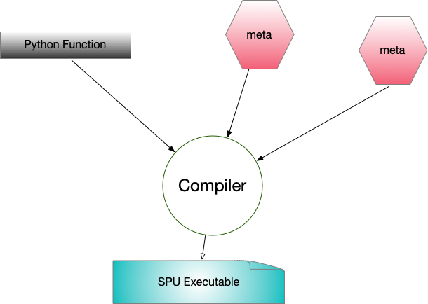

:target{#SPU-Basics}

# SPU Basics

> The following codes are demos only. It’s <strong>NOT for production</strong> due to system security concerns, please <strong>DO NOT</strong> use it directly in production.

SPU devices are responsible for performing MPC computation in SecretFlow.

This tutorial would help you:

- be familiar with SPU device and SPU Object
- learn how to transfer a Python Object / PYU Object from/to SPU Object.
- run MPC computation with SPU device.

:target{#Create-an-SPU-Device}

## Create an SPU Device

:target{#Create-SecretFlow-Parties}

### Create SecretFlow Parties

Parties are basic nodes in SecretFlow nodes. We are going to create four parties - <strong>alice</strong>, <strong>bob</strong>, <strong>carol</strong> and <strong>dave</strong>.

Based on four parties, we will set up three devices:

- a PYU device based on <em>alice</em>
- a PYU device based on <em>dave</em>
- an SPU device based on <em>alice</em>, <em>bob</em> and <em>carol</em>


<Notebook.Cell>
  <Notebook.CodeArea prompt="[1]:" stderr={false} type="input">
    ```python
    import secretflow as sf

    # Check the version of your SecretFlow
    print('The version of SecretFlow: {}'.format(sf.__version__))

    # In case you have a running secretflow runtime already.
    sf.shutdown()

    sf.init(['alice', 'bob', 'carol', 'dave'], address='local')
    ```
  </Notebook.CodeArea>
</Notebook.Cell>

:target{#Create-a-3PC-ABY3-SPU-device}

### Create a 3PC ABY3 SPU device

After that, let’s create an SPU device with [ABY3](https://eprint.iacr.org/2018/403.pdf) protocol.

`sf.utils.testing.cluster_def` is a helper method to create a config by finding unused ports.

<Notebook.Cell>
  <Notebook.CodeArea prompt="[2]:" stderr={false} type="input">
    ```python
    aby3_config = sf.utils.testing.cluster_def(parties=['alice', 'bob', 'carol'])

    aby3_config
    ```
  </Notebook.CodeArea>

  <Notebook.CodeArea prompt="[2]:" stderr={false} type="output">
    <pre>
      {"{'nodes': [{'party': 'alice', 'address': '127.0.0.1:49613'},\n  {'party': 'bob', 'address': '127.0.0.1:52053'},\n  {'party': 'carol', 'address': '127.0.0.1:25589'}],\n 'runtime_config': {'protocol': 3, 'field': 3}}\n"}
    </pre>
  </Notebook.CodeArea>
</Notebook.Cell>

Then let’s use <em>aby3\_config</em> to create an SPU device and check its cluster\_def.

<Notebook.Cell>
  <Notebook.CodeArea prompt="[3]:" stderr={false} type="input">
    ```python
    spu_device = sf.SPU(aby3_config)

    spu_device.cluster_def
    ```
  </Notebook.CodeArea>

  <Notebook.CodeArea prompt="[3]:" stderr={false} type="output">
    <pre>
      {"{'nodes': [{'party': 'alice', 'address': '127.0.0.1:49613'},\n  {'party': 'bob', 'address': '127.0.0.1:52053'},\n  {'party': 'carol', 'address': '127.0.0.1:25589'}],\n 'runtime_config': {'protocol': 3, 'field': 3}}\n"}
    </pre>
  </Notebook.CodeArea>
</Notebook.Cell>

Lastly, let’s create two PYU devices.

<Notebook.Cell>
  <Notebook.CodeArea prompt="[4]:" stderr={false} type="input">
    ```python
    alice, dave = sf.PYU('alice'), sf.PYU('dave')
    ```
  </Notebook.CodeArea>
</Notebook.Cell>

:target{#Pass-Values-to-SPU-device}

## Pass Values to SPU device

Before talking about computation with SPU device, let’s understand how to pass a Python object or a PYUObject to SPU device.

:target{#SPUObject}

### SPUObject

A Python object or a PYUObject could be transferred into an SPUObject and secret-shared by SPU nodes.

<strong>sf.device.SPUIO</strong> is the helper class to do the job. You don’t need to call this method in your code. We just use it to demonstrate the structure of <strong>SPUObjects</strong> and everything happens for you.

Each SPUObject has two fields:

- meta: The structure of the origin object.
- shares: The secret sharing of the origin object.

<Notebook.Cell>
  <Notebook.CodeArea prompt="[5]:" stderr={false} type="input">
    ```python
    spu_io = sf.device.SPUIO(spu_device.conf, spu_device.world_size)

    bank_account = [{'id': 12345, 'deposit': 1000.25}, {'id': 12345, 'deposit': 100000.25}]

    import spu

    meta, io_info, *shares = spu_io.make_shares(bank_account, spu.Visibility.VIS_SECRET)
    ```
  </Notebook.CodeArea>
</Notebook.Cell>

Let’s check meta first.

<Notebook.Cell>
  <Notebook.CodeArea prompt="[6]:" stderr={false} type="input">
    ```python
    meta
    ```
  </Notebook.CodeArea>

  <Notebook.CodeArea prompt="[6]:" stderr={false} type="output">
    <pre>
      {"[{'deposit': SPUValueMeta(shape=(), dtype=dtype('float32'), vtype=1, protocol=3, field=3, fxp_fraction_bits=0),\n  'id': SPUValueMeta(shape=(), dtype=dtype('int32'), vtype=1, protocol=3, field=3, fxp_fraction_bits=0)},\n {'deposit': SPUValueMeta(shape=(), dtype=dtype('float32'), vtype=1, protocol=3, field=3, fxp_fraction_bits=0),\n  'id': SPUValueMeta(shape=(), dtype=dtype('int32'), vtype=1, protocol=3, field=3, fxp_fraction_bits=0)}]\n"}
    </pre>
  </Notebook.CodeArea>
</Notebook.Cell>

I guess you could find meta preserves the structure of origin data and replaces the digits/arrays with <strong>SPUValueMeta</strong>:

- data\_type, indicates whether the value is integer or fixed points.
- visibility, indicates whether the value is a secret or a public content.
- storage\_type, indicates attributes of value, e.g. MPC protocol(ABY3 in our case), field size(128 bits in our case), etc

Then let’s check shares of bank\_account\_spu. Since we are passing data to a 3PC SPU device. We would have three pieces of shares, and we are going to check the first piece.

<Notebook.Cell>
  <Notebook.CodeArea prompt="[7]:" stderr={false} type="input">
    ```python
    assert len(shares) == 12

    shares[0]
    ```
  </Notebook.CodeArea>

  <Notebook.CodeArea prompt="[7]:" stderr={false} type="output">
    <pre>
      {"[{'deposit': b'\\x08\\n\\x10\\x01\"\\x10aby3.AShr<FM128>* \\xcd\\xbd\\xed#\\x06\\x04\\x0f\\xebJ\\xdc\\xdf\\x1b\\xacUe\\xdc\\xbe\\'\\x94\\xbb\\xf8?\\xa9-\\x99\\xc8TzM\\xf3\\xe4\\xaf',\n  'id': b'\\x08\\x06\\x10\\x01\"\\x10aby3.AShr<FM128>* \\xf0\\x8b\\xaa\\xc4\\xe5V\\x8a^\\xffq>\\xee\\x08\\x85\\xa6\\x87\\x82C\\xb6\\xbf|_\\xff\\x18\\xfb\\xb7\\xe3`\\x86\\xea\\xc9\\x1a'},\n {'deposit': b'\\x08\\n\\x10\\x01\"\\x10aby3.AShr<FM128>* \\xbaB\\x18\\xa6\\x84\\x9eW\\xa3\\xe8\\x18\\xc6\\x81\\xc7\\x1dp\\'\\x03\\xb4\\xa7\\xa6\\x9e\\x0eF\\xfan\\x81\\xd33,\\xcd\\x05X',\n  'id': b'\\x08\\x06\\x10\\x01\"\\x10aby3.AShr<FM128>* xj\\xde\\x12\\xa9\\x82\\xdfi\\xaahZ\\x16\\r\\xdeH\\x15$\\x17\\xce\\x05\\x8f\\x9b\\x9f\\xc5\\x81d\\x94!\\xab\\x983\\xaf'}]\n"}
    </pre>
  </Notebook.CodeArea>
</Notebook.Cell>

You should find a piece of shares of SPU Object is very similar to meta and origin data. It still preserves the structure of origin data while digits are replaced by encoded secret (try to guess the origin data if you would like to).

Well, let’s reconstruct the origin Python object from SPU object.

<Notebook.Cell>
  <Notebook.CodeArea prompt="[8]:" stderr={false} type="input">
    ```python
    bank_account_hat = spu_io.reconstruct(shares, io_info, meta)
    bank_account_hat
    ```
  </Notebook.CodeArea>

  <Notebook.CodeArea prompt="[8]:" stderr={false} type="output">
    <pre>
      {"[{'deposit': array(1000.25, dtype=float32), 'id': array(12345, dtype=int32)},\n {'deposit': array(100000.25, dtype=float32), 'id': array(12345, dtype=int32)}]\n"}
    </pre>
  </Notebook.CodeArea>
</Notebook.Cell>

If you compare <strong>bank\_account\_hat</strong> with origin <strong>bank\_account</strong>, you should find all the digits in <strong>bank\_account\_hat</strong> have become <strong>numpy.array</strong> but values are preseved.

:target{#Pass-a-PYU-Object-from-PYU-to-SPU}

### Pass a PYU Object from PYU to SPU

First, we create a PYU object with a PYU device.

<Notebook.Cell>
  <Notebook.CodeArea prompt="[9]:" stderr={false} type="input">
    ```python
    def debit_amount():
        return 10


    debit_amount_pyu = alice(debit_amount)()
    debit_amount_pyu
    ```
  </Notebook.CodeArea>

  <Notebook.CodeArea prompt="[9]:" stderr={false} type="output">
    <pre>
      {"<secretflow.device.device.pyu.PYUObject at 0x7fd98cd09130>\n"}
    </pre>
  </Notebook.CodeArea>
</Notebook.Cell>

Then let’s pass debit\_amount\_pyu from PYU to SPU. We will get an SPU object as result. Under the hood, <strong>alice</strong> calls <strong>sf.device.SPUIO.make\_shares</strong> to get <strong>meta</strong> and <strong>shares</strong> to send to nodes of the spu device.

<Notebook.Cell>
  <Notebook.CodeArea prompt="[10]:" stderr={false} type="input">
    ```python
    debit_amount_spu = debit_amount_pyu.to(spu_device)

    debit_amount_spu
    ```
  </Notebook.CodeArea>

  <Notebook.CodeArea prompt="[10]:" stderr={false} type="output">
    <pre>
      {"<secretflow.device.device.spu.SPUObject at 0x7fd817a03c70>\n"}
    </pre>
  </Notebook.CodeArea>
</Notebook.Cell>

Let’s check meta of debit\_amount\_spu.

<Notebook.Cell>
  <Notebook.CodeArea prompt="[11]:" stderr={false} type="input">
    ```python
    debit_amount_spu.meta
    ```
  </Notebook.CodeArea>

  <Notebook.CodeArea prompt="[11]:" stderr={false} type="output">
    <pre>
      {"ObjectRef(e0dc174c83599034ffffffffffffffffffffffff0100000001000000)\n"}
    </pre>
  </Notebook.CodeArea>
</Notebook.Cell>

Oh no, it’s a Ray ObjectRef located at alice part. So how about shares of debit\_amount\_spu?

<Notebook.Cell>
  <Notebook.CodeArea prompt="[12]:" stderr={false} type="input">
    ```python
    debit_amount_spu.shares_name
    ```
  </Notebook.CodeArea>

  <Notebook.CodeArea prompt="[12]:" stderr={false} type="output">
    <pre>
      {"[ObjectRef(f4402ec78d3a260750696baee0bc0bb42b40620a0100000001000000),\n ObjectRef(f91b78d7db9a65936b44b364879d9518bec82ea10100000001000000),\n ObjectRef(82891771158d68c155ebf101d0aa7682c810dad40100000001000000)]\n"}
    </pre>
  </Notebook.CodeArea>
</Notebook.Cell>

So you get a list of ObjectRef! Since it’s located at alice part, we couldn’t check the value at host.

But if you are really curious, we could use <strong>sf.reveal</strong> to check the origin value. Be careful to use <strong>sf.reveal</strong> in production! When <strong>sf.reveal</strong> are applied on <strong>SPUObjects</strong>, <strong>sf.device.SPUIO.reconstruct</strong> are called for you.

<Notebook.Cell>
  <Notebook.CodeArea prompt="[13]:" stderr={false} type="input">
    ```python
    sf.reveal(debit_amount_spu)
    ```
  </Notebook.CodeArea>

  <Notebook.CodeArea prompt="[13]:" stderr={false} type="output">
    <pre>
      {"array(10, dtype=int32)\n"}
    </pre>
  </Notebook.CodeArea>
</Notebook.Cell>

:target{#Pass-a-Python-Object-from-Host-to-SPU}

### Pass a Python Object from Host to SPU

Let’s pass a dict from Host to SPU device.

> NOTE: I know it looks weird. At this moment, if you want to pass a Python object to SPU device, you have to pass it to a PYU.

<Notebook.Cell>
  <Notebook.CodeArea prompt="[14]:" stderr={false} type="input">
    ```python
    bank_account_spu = sf.to(alice, bank_account).to(spu_device)
    ```
  </Notebook.CodeArea>
</Notebook.Cell>

:target{#Summary}

### Summary

This is the first part of Data Flow with SPU device, at this moment, you should be aware of the following facts.

- A Python Object/PYU Object could be transferred to an SPU Object.
- An SPU Object consists of meta and shares.
- <strong>sf.to</strong> and <strong>sf.reveal</strong> calls <strong>sf.device.SPUIO</strong> to transfer between SPUObjects and Python objects.
- Just converting to SPU Object won’t trigger data flow from PYU to SPU. e.g. When you transferred a PYU object to an SPU object. All the field of SPU objects including meta and shares are still located at the PYU device. The shares would only be sent to parties of SPU device when computation do happen. In short, data flow is lazy.

:target{#Computation-with-SPU-Device}

## Computation with SPU Device

Since we have two SPU objects - <em>bank\_account\_spu</em> and <em>debit\_amount\_spu</em> as inputs. Let’s try to do some computation with SPU device.

<Notebook.Cell>
  <Notebook.CodeArea prompt="[15]:" stderr={false} type="input">
    ```python
    def deduce_from_account(bank_account, amount):
        new_bank_account = []

        for account in bank_account:
            account['deposit'] = account['deposit'] - amount
            new_bank_account.append(account)

        return new_bank_account


    new_bank_account_spu = spu_device(deduce_from_account)(
        bank_account_spu, debit_amount_spu
    )

    new_bank_account_spu
    ```
  </Notebook.CodeArea>

  <Notebook.CodeArea prompt="[15]:" stderr={false} type="output">
    <pre>
      {"<secretflow.device.device.spu.SPUObject at 0x7fd98cca88b0>\n"}
    </pre>
  </Notebook.CodeArea>
</Notebook.Cell>

<em>new\_bank\_account\_spu</em> is also a <strong>SPUObject</strong>. But it’s a bit different from <em>debit\_amount\_spu</em>!

- <em>debit\_amount\_spu</em> is located at alice, so only alice could check value.
- <em>new\_bank\_account\_spu</em> is located at spu, each party of spu have a piece of shares. And you couldn’t check the value directly without <em>sf.reveal</em>.

Well, but what happened behind computation of SPU device?

:target{#Step-1:-Compile-Python(Jax)-Code-to-SPU-Executable}

### Step 1: Compile Python(Jax) Code to SPU Executable

The Python function (<em>deduce\_from\_account</em> in our case) and metas of all inputs (<em>bank\_account\_spu</em> and <em>debit\_amount\_spu</em>) would be sent to one party of SPU device. Then SPU compiler would be used to compile them to <em>SPU Executable</em>.



:target{id="Step-2:-Distribute-the-SPU-Executable-and-Shares-to-SPU-parties."}

### Step 2: Distribute the SPU Executable and Shares to SPU parties.

Each party of SPU device would get:

- one copy of SPU Executable
- one piece of each SPU Object share


:target{#Step-3:-Run-SPU-Executable-and-Assembly-SPU-Object}

### Step 3: Run SPU Executable and Assembly SPU Object

Then each party of SPU device would execute SPU Executable.

In the end, each party of SPU device would own a piece of output SPU Objects and a copy of meta.

Then SecretFlow framework would use them to assembly SPU Objects.

:target{#Get-Value-from-SPU-Device}

## Get Value from SPU Device

But in the end, we need to get value from spu, we couldn’t always keep <em>SPUObject</em> as secret!

Most common way of handling <em>SPUObject</em> is pass the secret to one party. This party is not necessarily one of parties consisting of SPU device.

<Notebook.Cell>
  <Notebook.CodeArea prompt="[16]:" stderr={false} type="input">
    ```python
    new_bank_account_pyu = new_bank_account_spu.to(dave)

    new_bank_account_pyu
    ```
  </Notebook.CodeArea>

  <Notebook.CodeArea prompt="[16]:" stderr={false} type="output">
    <pre>
      {"<secretflow.device.device.pyu.PYUObject at 0x7fd98cd754f0>\n"}
    </pre>
  </Notebook.CodeArea>
</Notebook.Cell>

We just pass <em>new\_bank\_account\_spu</em> to <strong>pyu</strong>, then it becomes a <em>PYUObject</em>! And it’s owned by dave. Let’s check the value of <em>new\_bank\_account\_pyu</em>.

<Notebook.Cell>
  <Notebook.CodeArea prompt="[17]:" stderr={false} type="input">
    ```python
    sf.reveal(new_bank_account_pyu)
    ```
  </Notebook.CodeArea>

  <Notebook.CodeArea prompt="[17]:" stderr={false} type="output">
    <pre>
      {"[{'deposit': array(990.25, dtype=float32), 'id': array(12345, dtype=int32)},\n {'deposit': array(99990.25, dtype=float32), 'id': array(12345, dtype=int32)}]\n"}
    </pre>
  </Notebook.CodeArea>
</Notebook.Cell>

We could also pass <em>SPUObject</em> to host directly. The magic is <em>sf.reveal</em>. And again, be careful in production!

<Notebook.Cell>
  <Notebook.CodeArea prompt="[18]:" stderr={false} type="input">
    ```python
    sf.reveal(new_bank_account_spu)
    ```
  </Notebook.CodeArea>

  <Notebook.CodeArea prompt="[18]:" stderr={false} type="output">
    <pre>
      {"[{'deposit': array(990.25, dtype=float32), 'id': array(12345, dtype=int32)},\n {'deposit': array(99990.25, dtype=float32), 'id': array(12345, dtype=int32)}]\n"}
    </pre>
  </Notebook.CodeArea>
</Notebook.Cell>

:target{#Advanced-Topic:-Use-Different-MPC-Protocol}

## Advanced Topic: Use Different MPC Protocol

At this moment, SPU device supports multiple MPC protocol besides ABY3. It’s easy to use different MPC protocol - just set the proper field in cluster def.

For instance, if someone would like to use 2PC protocol - Cheetah, You should prepare another cluster def:

<Notebook.Cell>
  <Notebook.CodeArea prompt="[19]:" stderr={false} type="input">
    ```python
    import spu

    import secretflow as sf

    # In case you have a running secretflow runtime already.
    sf.shutdown()

    sf.init(['alice', 'bob', 'carol', 'dave'], address='local')

    cheetah_config = sf.utils.testing.cluster_def(
        parties=['alice', 'bob'],
        runtime_config={
            'protocol': spu.spu_pb2.CHEETAH,
            'field': spu.spu_pb2.FM64,
        },
    )
    ```
  </Notebook.CodeArea>
</Notebook.Cell>

Then you could create an SPU device with <em>cheetah\_config</em>.

<Notebook.Cell>
  <Notebook.CodeArea prompt="[20]:" stderr={false} type="input">
    ```python
    spu_device2 = sf.SPU(cheetah_config)
    ```
  </Notebook.CodeArea>
</Notebook.Cell>

Let’s check the <em>cluster\_def</em> of spu\_device2.

<Notebook.Cell>
  <Notebook.CodeArea prompt="[21]:" stderr={false} type="input">
    ```python
    spu_device2.cluster_def
    ```
  </Notebook.CodeArea>

  <Notebook.CodeArea prompt="[21]:" stderr={false} type="output">
    <pre>
      {"{'nodes': [{'party': 'alice', 'address': '127.0.0.1:64555'},\n  {'party': 'bob', 'address': '127.0.0.1:30243'}],\n 'runtime_config': {'protocol': 4, 'field': 2}}\n"}
    </pre>
  </Notebook.CodeArea>
</Notebook.Cell>

We could use <em>spu\_device2</em> to check famous Yao’s Millionaires’ problem.

<Notebook.Cell>
  <Notebook.CodeArea prompt="[22]:" stderr={false} type="input">
    ```python
    def get_carol_assets():
        return 1000000


    def get_dave_assets():
        return 1000002


    carol, dave = sf.PYU('carol'), sf.PYU('dave')

    carol_assets = carol(get_carol_assets)()
    dave_assets = dave(get_dave_assets)()
    ```
  </Notebook.CodeArea>
</Notebook.Cell>

We use <em>spu\_device2</em> to check if <em>carol</em> is richer.

<Notebook.Cell>
  <Notebook.CodeArea prompt="[23]:" stderr={false} type="input">
    ```python
    def get_winner(carol, dave):
        return carol > dave


    winner = spu_device2(get_winner)(carol_assets, dave_assets)

    sf.reveal(winner)
    ```
  </Notebook.CodeArea>

  <Notebook.CodeArea prompt="[23]:" stderr={false} type="output">
    <pre>
      {"array(False)\n"}
    </pre>
  </Notebook.CodeArea>
</Notebook.Cell>

:target{#Advanced-Topic:-Multiple-Returns-from-SPU-Computation}

## Advanced Topic: Multiple Returns from SPU Computation

In most cases, we have multiple returns from the function executed by SPU device.

For instance,

<Notebook.Cell>
  <Notebook.CodeArea prompt="[24]:" stderr={false} type="input">
    ```python
    def get_multiple_outputs(x, y):
        return x + y, x - y
    ```
  </Notebook.CodeArea>
</Notebook.Cell>

There are multiple options to handle this.

:target{#Option-1:-Treat-All-Returns-as-Single}

### Option 1: Treat All Returns as Single

This is the default behavior of SPU. Let’s see.

<Notebook.Cell>
  <Notebook.CodeArea prompt="[25]:" stderr={false} type="input">
    ```python
    single_output = spu_device2(get_multiple_outputs)(carol_assets, dave_assets)

    single_output
    ```
  </Notebook.CodeArea>

  <Notebook.CodeArea prompt="[25]:" stderr={false} type="output">
    <pre>
      {"<secretflow.device.device.spu.SPUObject at 0x7fd98cd754c0>\n"}
    </pre>
  </Notebook.CodeArea>
</Notebook.Cell>

We could see we only get a single <em>SPUObject</em>. Let’s reveal it.

<Notebook.Cell>
  <Notebook.CodeArea prompt="[26]:" stderr={false} type="input">
    ```python
    sf.reveal(single_output)
    ```
  </Notebook.CodeArea>

  <Notebook.CodeArea prompt="[26]:" stderr={false} type="output">
    <pre>
      {"(array(2000002, dtype=int32), array(-2, dtype=int32))\n"}
    </pre>
  </Notebook.CodeArea>
</Notebook.Cell>

So single\_output itself actually represents a tuple.

:target{#Option-2:-Decide-Return-Nums-on-the-Fly}

### Option 2: Decide Return Nums on the Fly

We can also instruct SPU to decide return numbers for us.

<Notebook.Cell>
  <Notebook.CodeArea prompt="[27]:" stderr={false} type="input">
    ```python
    from secretflow.device.device.spu import SPUCompilerNumReturnsPolicy

    multiple_outputs = spu_device2(
        get_multiple_outputs, num_returns_policy=SPUCompilerNumReturnsPolicy.FROM_COMPILER
    )(carol_assets, dave_assets)

    multiple_outputs
    ```
  </Notebook.CodeArea>

  <Notebook.CodeArea prompt="[27]:" stderr={false} type="output">
    <pre>
      {"(<secretflow.device.device.spu.SPUObject at 0x7fd98cce0400>,\n <secretflow.device.device.spu.SPUObject at 0x7fd98cce0490>)\n"}
    </pre>
  </Notebook.CodeArea>
</Notebook.Cell>

let’s check two outputs respectively.

<Notebook.Cell>
  <Notebook.CodeArea prompt="[28]:" stderr={false} type="input">
    ```python
    print(sf.reveal(multiple_outputs[0]))
    print(sf.reveal(multiple_outputs[1]))
    ```
  </Notebook.CodeArea>

  <Notebook.CodeArea prompt="" stderr={false} type="output">
    <pre>
      {"2000002\n-2\n"}
    </pre>
  </Notebook.CodeArea>
</Notebook.Cell>

:target{#Option-3:-Decide-Return-Nums-Manually}

### Option 3: Decide Return Nums Manually

If possible, you could also set return nums manually.

<Notebook.Cell>
  <Notebook.CodeArea prompt="[29]:" stderr={false} type="input">
    ```python
    user_multiple_outputs = spu_device2(
        get_multiple_outputs,
        num_returns_policy=SPUCompilerNumReturnsPolicy.FROM_USER,
        user_specified_num_returns=2,
    )(carol_assets, dave_assets)

    user_multiple_outputs
    ```
  </Notebook.CodeArea>

  <Notebook.CodeArea prompt="[29]:" stderr={false} type="output">
    <pre>
      {"[<secretflow.device.device.spu.SPUObject at 0x7fd98cce0a60>,\n <secretflow.device.device.spu.SPUObject at 0x7fd98cce0af0>]\n"}
    </pre>
  </Notebook.CodeArea>
</Notebook.Cell>

let’s also check two outputs respectively.

<Notebook.Cell>
  <Notebook.CodeArea prompt="[30]:" stderr={false} type="input">
    ```python
    print(sf.reveal(multiple_outputs[0]))
    print(sf.reveal(multiple_outputs[1]))
    ```
  </Notebook.CodeArea>

  <Notebook.CodeArea prompt="" stderr={false} type="output">
    <pre>
      {"2000002\n-2\n"}
    </pre>
  </Notebook.CodeArea>
</Notebook.Cell>

Let’s summarize what we have:

- Be default, SPU treats all the returns as a single return
- Since SPU compiler generates the SPU executable, it can figure out return nums. However, the options results some latency since we have to make compilation blocked.
- If you want to avoid latency, we can provide return nums manually. But you have to make sure you provide the right nums, otherwise, the program would complain!

:target{#What’s-Next?}

## What’s Next?

After learning basics of SPU, you may check some advanced tutorials with SPU:

- [Logistic Regression with SPU](lr_with_spu.mdx)
- [Neural Network with SPU](nn_with_spu.mdx)
