:target{#基于-Keras-Applications-的预训练模型在隐语联邦学习环境下的微调}

# 基于 Keras Applications 的预训练模型在隐语联邦学习环境下的微调

:target{#引言}

## 引言

预训练模型加载和精调在机器学习中非常重要。一般来说，从头训练一个非常大的模型，不仅需要大量的算力资源，同时也需要耗费大量的时间。所以在传统的机器学习中，使用预训练模型，然后针对具体的任务做微调和迁移学习非常普遍。同样的，对于联邦学习来说，如果能够加载预训练模型进行微调和迁移学习，不仅能够节省参与方的算力资源，降低参与方的准入门槛，同时也能够加快模型的学习速度。

得益于隐语联邦学习模块优异的兼容性，使得其可以直接加载TensorFlow\.Keras的一系列[预训练模型](https://keras.io/api/applications/)；本教程将基于TensorFlow\.Keras的[InceptionV3](https://arxiv.org/abs/1512.00567)的[微调教程](https://keras.io/api/applications/#finetune-inceptionv3-on-a-new-set-of-classes)展现如何基于TensorFlow\.Keras的预训练模型在SecretFlow的框架下进行微调，充分展现SecretFlow的易用性。

:target{#加载数据集}

## 加载数据集

:target{#数据集介绍}

### 数据集介绍

Flower 数据集介绍：flower 数据集是一个包含了 5 种花卉（雏菊、蒲公英、玫瑰、向日葵、郁金香）共计 4323 张彩色图片的数据集。每种花卉都有多个角度和不同光照下的图片，每张图片的分辨率为 320x240。这个数据集常用于图像分类和机器学习算法的训练与测试。数据集中每个类别的数量分别是：daisy（633），dandelion（898），rose（641），sunflower（699），tulip（852）

下载地址: [http://download.tensorflow.org/example\_images/flower\_photos.tgz](http://download.tensorflow.org/example_images/flower_photos.tgz)

:target{#下载数据集并解压}

### 下载数据集并解压

<Notebook.Cell>
  <Notebook.CodeArea prompt="[1]:" stderr={false} type="input">
    ```python
    import tempfile
    import tensorflow as tf


    _temp_dir = tempfile.mkdtemp()
    path_to_flower_dataset = tf.keras.utils.get_file(
        "flower_photos",
        "https://secretflow-data.oss-accelerate.aliyuncs.com/datasets/tf_flowers/flower_photos.tgz",
        untar=True,
        cache_dir=_temp_dir,
    )
    ```
  </Notebook.CodeArea>

  <Notebook.CodeArea prompt="" stderr={false} type="output">
    <pre>
      {"Downloading data from https://secretflow-data.oss-accelerate.aliyuncs.com/datasets/tf_flowers/flower_photos.tgz\n67588319/67588319 [==============================] - 2s 0us/step\n"}
    </pre>
  </Notebook.CodeArea>
</Notebook.Cell>

:target{#id5}

### 加载数据集

<Notebook.Cell>
  <Notebook.CodeArea prompt="[2]:" stderr={false} type="input">
    ```python
    import math
    import tensorflow as tf

    img_height = 180
    img_width = 180
    batch_size = 32
    # In this example, we use the TensorFlow interface for development.
    data_set = tf.keras.utils.image_dataset_from_directory(
        path_to_flower_dataset,
        validation_split=0.2,
        subset="both",
        seed=123,
        image_size=(img_height, img_width),
        batch_size=batch_size,
    )
    ```
  </Notebook.CodeArea>

  <Notebook.CodeArea prompt="" stderr={false} type="output">
    <pre>
      {"Found 1201 files belonging to 5 classes.\nUsing 961 files for training.\nUsing 240 files for validation.\n"}
    </pre>
  </Notebook.CodeArea>
</Notebook.Cell>

:target{#划分数据集}

### 划分数据集

<Notebook.Cell>
  <Notebook.CodeArea prompt="[3]:" stderr={false} type="input">
    ```python
    train_set = data_set[0]
    test_set = data_set[1]
    ```
  </Notebook.CodeArea>
</Notebook.Cell>

:target{#查看数据集}

### 查看数据集

<Notebook.Cell>
  <Notebook.CodeArea prompt="[4]:" stderr={false} type="input">
    ```python
    print(type(train_set), type(test_set))
    ```
  </Notebook.CodeArea>

  <Notebook.CodeArea prompt="" stderr={false} type="output">
    <pre>
      {"<class 'tensorflow.python.data.ops.batch_op._BatchDataset'> <class 'tensorflow.python.data.ops.batch_op._BatchDataset'>\n"}
    </pre>
  </Notebook.CodeArea>
</Notebook.Cell>

<Notebook.Cell>
  <Notebook.CodeArea prompt="[5]:" stderr={false} type="input">
    ```python
    x, y = next(iter(train_set))
    print(f"x.shape = {x.shape}")
    print(f"y.shape = {y.shape}")
    ```
  </Notebook.CodeArea>

  <Notebook.CodeArea prompt="" stderr={false} type="output">
    <pre>
      {"x.shape = (32, 180, 180, 3)\ny.shape = (32,)\n"}
    </pre>
  </Notebook.CodeArea>
</Notebook.Cell>

:target{#单机模式进行微调}

## 单机模式进行微调

单机模式下进行预训练模型的微调，基本上参考TensorFlow\.Keras的[官方教程](https://keras.io/api/applications/#finetune-inceptionv3-on-a-new-set-of-classes)，并根据数据集格式在编译模型的参数上作适当的修改，但影响不大；

:target{#微调顶部分类器}

### 微调顶部分类器

<Notebook.Cell>
  <Notebook.CodeArea prompt="[6]:" stderr={false} type="input">
    ```python
    import matplotlib.pyplot as plt

    from tensorflow.keras.applications.inception_v3 import InceptionV3
    from tensorflow.keras.preprocessing import image
    from tensorflow.keras.models import Model
    from tensorflow.keras.layers import Dense, GlobalAveragePooling2D


    # create the base pre-trained model
    base_model = InceptionV3(weights='imagenet', include_top=False)

    # add a global spatial average pooling layer
    x = base_model.output
    x = GlobalAveragePooling2D()(x)
    # let's add a fully-connected layer
    x = Dense(1024, activation='relu')(x)
    # and a logistic layer -- let's say we have 10 classes
    predictions = Dense(10, activation='softmax')(x)

    # this is the model we will train
    model = Model(inputs=base_model.input, outputs=predictions)

    # first: train only the top layers (which were randomly initialized)
    # i.e. freeze all convolutional InceptionV3 layers
    for layer in base_model.layers:
        layer.trainable = False

    # compile the model (should be done *after* setting layers to non-trainable)
    model.compile(
        optimizer='rmsprop',
        loss='sparse_categorical_crossentropy',
        metrics=["accuracy"],
    )
    ```
  </Notebook.CodeArea>
</Notebook.Cell>

<Notebook.Cell>
  <Notebook.CodeArea prompt="[7]:" stderr={false} type="input">
    ```python
    # train the model on the new data for a few epochs
    history = model.fit(train_set, validation_data=test_set, epochs=50)

    # at this point, the top layers are well trained and we can start fine-tuning
    # convolutional layers from inception V3. We will freeze the bottom N layers
    # and train the remaining top layers.
    ```
  </Notebook.CodeArea>

  <Notebook.CodeArea prompt="" stderr={false} type="output">
    <pre>
      {"Epoch 1/50\n"}
    </pre>
  </Notebook.CodeArea>

  <Notebook.CodeArea prompt="" stderr={false} type="output">
    <pre>
      {"31/31 [==============================] - ETA: 0s - loss: 112.3790 - accuracy: 0.2206\n"}
    </pre>
  </Notebook.CodeArea>

  <Notebook.CodeArea prompt="" stderr={false} type="output">
    <pre>
      {"31/31 [==============================] - 15s 175ms/step - loss: 112.3790 - accuracy: 0.2206 - val_loss: 34.8170 - val_accuracy: 0.1500\nEpoch 2/50\n31/31 [==============================] - 2s 57ms/step - loss: 18.9387 - accuracy: 0.2737 - val_loss: 21.3622 - val_accuracy: 0.2625\nEpoch 3/50\n31/31 [==============================] - 2s 57ms/step - loss: 14.2041 - accuracy: 0.3091 - val_loss: 16.4007 - val_accuracy: 0.2625\nEpoch 4/50\n31/31 [==============================] - 2s 59ms/step - loss: 11.6635 - accuracy: 0.2716 - val_loss: 14.6091 - val_accuracy: 0.2167\nEpoch 5/50\n31/31 [==============================] - 2s 57ms/step - loss: 8.6897 - accuracy: 0.3215 - val_loss: 7.3476 - val_accuracy: 0.4042\nEpoch 6/50\n31/31 [==============================] - 2s 57ms/step - loss: 8.0223 - accuracy: 0.2914 - val_loss: 3.7781 - val_accuracy: 0.3417\nEpoch 7/50\n31/31 [==============================] - 2s 57ms/step - loss: 6.0596 - accuracy: 0.3413 - val_loss: 6.9468 - val_accuracy: 0.2417\nEpoch 8/50\n31/31 [==============================] - 2s 59ms/step - loss: 4.8735 - accuracy: 0.3486 - val_loss: 14.5767 - val_accuracy: 0.2583\nEpoch 9/50\n31/31 [==============================] - 2s 57ms/step - loss: 3.7563 - accuracy: 0.3954 - val_loss: 7.5974 - val_accuracy: 0.2625\nEpoch 10/50\n31/31 [==============================] - 2s 58ms/step - loss: 3.1183 - accuracy: 0.3871 - val_loss: 9.8358 - val_accuracy: 0.2583\nEpoch 11/50\n31/31 [==============================] - 2s 58ms/step - loss: 3.5958 - accuracy: 0.3725 - val_loss: 3.7865 - val_accuracy: 0.2792\nEpoch 12/50\n31/31 [==============================] - 2s 58ms/step - loss: 2.4401 - accuracy: 0.4287 - val_loss: 5.4358 - val_accuracy: 0.2833\nEpoch 13/50\n31/31 [==============================] - 2s 57ms/step - loss: 2.2799 - accuracy: 0.4194 - val_loss: 4.6291 - val_accuracy: 0.2208\nEpoch 14/50\n31/31 [==============================] - 2s 58ms/step - loss: 2.3558 - accuracy: 0.4204 - val_loss: 4.1438 - val_accuracy: 0.2125\nEpoch 15/50\n31/31 [==============================] - 2s 57ms/step - loss: 1.8603 - accuracy: 0.4828 - val_loss: 6.8592 - val_accuracy: 0.2917\nEpoch 16/50\n31/31 [==============================] - 2s 58ms/step - loss: 1.8960 - accuracy: 0.4880 - val_loss: 2.8224 - val_accuracy: 0.3042\nEpoch 17/50\n31/31 [==============================] - 2s 58ms/step - loss: 1.7029 - accuracy: 0.4984 - val_loss: 3.8373 - val_accuracy: 0.2250\nEpoch 18/50\n31/31 [==============================] - 2s 58ms/step - loss: 1.4418 - accuracy: 0.5120 - val_loss: 3.6055 - val_accuracy: 0.3292\nEpoch 19/50\n31/31 [==============================] - 2s 57ms/step - loss: 1.5190 - accuracy: 0.5245 - val_loss: 3.9276 - val_accuracy: 0.3458\nEpoch 20/50\n31/31 [==============================] - 2s 58ms/step - loss: 1.3073 - accuracy: 0.5619 - val_loss: 6.1296 - val_accuracy: 0.1875\nEpoch 21/50\n31/31 [==============================] - 2s 59ms/step - loss: 1.3950 - accuracy: 0.5390 - val_loss: 3.7171 - val_accuracy: 0.2375\nEpoch 22/50\n31/31 [==============================] - 2s 59ms/step - loss: 1.1851 - accuracy: 0.5640 - val_loss: 5.6681 - val_accuracy: 0.1708\nEpoch 23/50\n31/31 [==============================] - 2s 58ms/step - loss: 1.3379 - accuracy: 0.5838 - val_loss: 2.4407 - val_accuracy: 0.2625\nEpoch 24/50\n31/31 [==============================] - 2s 59ms/step - loss: 1.1016 - accuracy: 0.6098 - val_loss: 3.4062 - val_accuracy: 0.2917\nEpoch 25/50\n31/31 [==============================] - 2s 58ms/step - loss: 1.1200 - accuracy: 0.5931 - val_loss: 2.9323 - val_accuracy: 0.3042\nEpoch 26/50\n31/31 [==============================] - 2s 59ms/step - loss: 1.0031 - accuracy: 0.6389 - val_loss: 2.8517 - val_accuracy: 0.2708\nEpoch 27/50\n31/31 [==============================] - 2s 59ms/step - loss: 1.0253 - accuracy: 0.6306 - val_loss: 4.8238 - val_accuracy: 0.3000\nEpoch 28/50\n31/31 [==============================] - 2s 59ms/step - loss: 1.0335 - accuracy: 0.6576 - val_loss: 3.0405 - val_accuracy: 0.2958\nEpoch 29/50\n31/31 [==============================] - 2s 58ms/step - loss: 1.1657 - accuracy: 0.6181 - val_loss: 3.3026 - val_accuracy: 0.2375\nEpoch 30/50\n31/31 [==============================] - 2s 59ms/step - loss: 0.9623 - accuracy: 0.6629 - val_loss: 3.2407 - val_accuracy: 0.2875\nEpoch 31/50\n31/31 [==============================] - 2s 59ms/step - loss: 0.8993 - accuracy: 0.6920 - val_loss: 2.2036 - val_accuracy: 0.3917\nEpoch 32/50\n31/31 [==============================] - 2s 58ms/step - loss: 0.9263 - accuracy: 0.6816 - val_loss: 3.2231 - val_accuracy: 0.2917\nEpoch 33/50\n31/31 [==============================] - 2s 60ms/step - loss: 0.8958 - accuracy: 0.6930 - val_loss: 3.6673 - val_accuracy: 0.2583\nEpoch 34/50\n31/31 [==============================] - 2s 59ms/step - loss: 0.8155 - accuracy: 0.7045 - val_loss: 3.7752 - val_accuracy: 0.2667\nEpoch 35/50\n31/31 [==============================] - 2s 59ms/step - loss: 0.8687 - accuracy: 0.6982 - val_loss: 3.5233 - val_accuracy: 0.3708\nEpoch 36/50\n31/31 [==============================] - 2s 59ms/step - loss: 0.9007 - accuracy: 0.7138 - val_loss: 2.5410 - val_accuracy: 0.3542\nEpoch 37/50\n31/31 [==============================] - 2s 60ms/step - loss: 0.7482 - accuracy: 0.7378 - val_loss: 3.7791 - val_accuracy: 0.3583\nEpoch 38/50\n31/31 [==============================] - 2s 59ms/step - loss: 0.8524 - accuracy: 0.7534 - val_loss: 2.9299 - val_accuracy: 0.3375\nEpoch 39/50\n31/31 [==============================] - 2s 59ms/step - loss: 0.6633 - accuracy: 0.7607 - val_loss: 3.8067 - val_accuracy: 0.3125\nEpoch 40/50\n31/31 [==============================] - 2s 59ms/step - loss: 0.7970 - accuracy: 0.7336 - val_loss: 3.9137 - val_accuracy: 0.3333\nEpoch 41/50\n31/31 [==============================] - 2s 59ms/step - loss: 0.7073 - accuracy: 0.7648 - val_loss: 2.9778 - val_accuracy: 0.3542\nEpoch 42/50\n31/31 [==============================] - 2s 60ms/step - loss: 0.6207 - accuracy: 0.7815 - val_loss: 3.2358 - val_accuracy: 0.3458\nEpoch 43/50\n31/31 [==============================] - 2s 59ms/step - loss: 0.6773 - accuracy: 0.7700 - val_loss: 3.8493 - val_accuracy: 0.3292\nEpoch 44/50\n31/31 [==============================] - 2s 60ms/step - loss: 0.5552 - accuracy: 0.7950 - val_loss: 4.1360 - val_accuracy: 0.3292\nEpoch 45/50\n31/31 [==============================] - 2s 59ms/step - loss: 0.5993 - accuracy: 0.8044 - val_loss: 3.3667 - val_accuracy: 0.3625\nEpoch 46/50\n31/31 [==============================] - 2s 59ms/step - loss: 0.6991 - accuracy: 0.7877 - val_loss: 2.8805 - val_accuracy: 0.3625\nEpoch 47/50\n31/31 [==============================] - 2s 59ms/step - loss: 0.6570 - accuracy: 0.7908 - val_loss: 3.2625 - val_accuracy: 0.3375\nEpoch 48/50\n31/31 [==============================] - 2s 59ms/step - loss: 0.5095 - accuracy: 0.8293 - val_loss: 4.0133 - val_accuracy: 0.3750\nEpoch 49/50\n31/31 [==============================] - 2s 59ms/step - loss: 0.5420 - accuracy: 0.8148 - val_loss: 3.1207 - val_accuracy: 0.3042\nEpoch 50/50\n31/31 [==============================] - 2s 59ms/step - loss: 0.5678 - accuracy: 0.8023 - val_loss: 3.8196 - val_accuracy: 0.3583\n"}
    </pre>
  </Notebook.CodeArea>
</Notebook.Cell>

<Notebook.Cell>
  <Notebook.CodeArea prompt="[8]:" stderr={false} type="input">
    ```python
    history.history.keys()
    ```
  </Notebook.CodeArea>

  <Notebook.CodeArea prompt="[8]:" stderr={false} type="output">
    <pre>
      {"dict_keys(['loss', 'accuracy', 'val_loss', 'val_accuracy'])\n"}
    </pre>
  </Notebook.CodeArea>
</Notebook.Cell>

<Notebook.Cell>
  <Notebook.CodeArea prompt="[9]:" stderr={false} type="input">
    ```python
    # Draw accuracy values for training & validation
    plt.plot(history.history['accuracy'])
    plt.plot(history.history['val_accuracy'])
    plt.title('Model accuracy')
    plt.ylabel('Accuracy')
    plt.xlabel('Epoch')
    plt.legend(['Train', 'Test'], loc='upper left')
    plt.show()

    # Draw loss for training & validation
    plt.plot(history.history['loss'])
    plt.plot(history.history['val_loss'])
    plt.title('Model loss')
    plt.ylabel('Loss')
    plt.xlabel('Epoch')
    plt.legend(['Train', 'Test'], loc='upper left')
    plt.show()
    ```
  </Notebook.CodeArea>

  <Notebook.FancyOutput prompt="" type="output">
    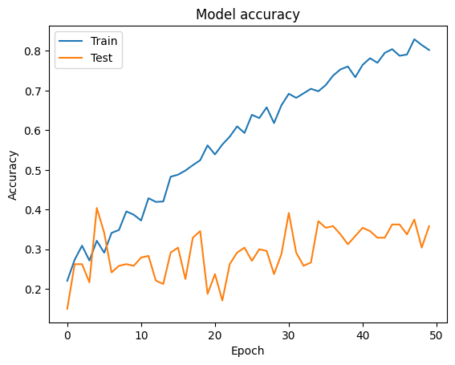
  </Notebook.FancyOutput>

  <Notebook.FancyOutput prompt="" type="output">
    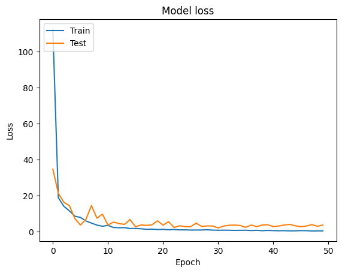
  </Notebook.FancyOutput>
</Notebook.Cell>

:target{#冻结底层网络层微调顶层网络层}

### 冻结底层网络层微调顶层网络层

<Notebook.Cell>
  <Notebook.CodeArea prompt="[10]:" stderr={false} type="input">
    ```python
    # let's visualize layer names and layer indices to see how many layers
    # we should freeze:
    for i, layer in enumerate(base_model.layers):
        print(i, layer.name)
    ```
  </Notebook.CodeArea>

  <Notebook.CodeArea prompt="" stderr={false} type="output">
    <pre>
      {"0 input_1\n1 conv2d\n2 batch_normalization\n3 activation\n4 conv2d_1\n5 batch_normalization_1\n6 activation_1\n7 conv2d_2\n8 batch_normalization_2\n9 activation_2\n10 max_pooling2d\n11 conv2d_3\n12 batch_normalization_3\n13 activation_3\n14 conv2d_4\n15 batch_normalization_4\n16 activation_4\n17 max_pooling2d_1\n18 conv2d_8\n19 batch_normalization_8\n20 activation_8\n21 conv2d_6\n22 conv2d_9\n23 batch_normalization_6\n24 batch_normalization_9\n25 activation_6\n26 activation_9\n27 average_pooling2d\n28 conv2d_5\n29 conv2d_7\n30 conv2d_10\n31 conv2d_11\n32 batch_normalization_5\n33 batch_normalization_7\n34 batch_normalization_10\n35 batch_normalization_11\n36 activation_5\n37 activation_7\n38 activation_10\n39 activation_11\n40 mixed0\n41 conv2d_15\n42 batch_normalization_15\n43 activation_15\n44 conv2d_13\n45 conv2d_16\n46 batch_normalization_13\n47 batch_normalization_16\n48 activation_13\n49 activation_16\n50 average_pooling2d_1\n51 conv2d_12\n52 conv2d_14\n53 conv2d_17\n54 conv2d_18\n55 batch_normalization_12\n56 batch_normalization_14\n57 batch_normalization_17\n58 batch_normalization_18\n59 activation_12\n60 activation_14\n61 activation_17\n62 activation_18\n63 mixed1\n64 conv2d_22\n65 batch_normalization_22\n66 activation_22\n67 conv2d_20\n68 conv2d_23\n69 batch_normalization_20\n70 batch_normalization_23\n71 activation_20\n72 activation_23\n73 average_pooling2d_2\n74 conv2d_19\n75 conv2d_21\n76 conv2d_24\n77 conv2d_25\n78 batch_normalization_19\n79 batch_normalization_21\n80 batch_normalization_24\n81 batch_normalization_25\n82 activation_19\n83 activation_21\n84 activation_24\n85 activation_25\n86 mixed2\n87 conv2d_27\n88 batch_normalization_27\n89 activation_27\n90 conv2d_28\n91 batch_normalization_28\n92 activation_28\n93 conv2d_26\n94 conv2d_29\n95 batch_normalization_26\n96 batch_normalization_29\n97 activation_26\n98 activation_29\n99 max_pooling2d_2\n100 mixed3\n101 conv2d_34\n102 batch_normalization_34\n103 activation_34\n104 conv2d_35\n105 batch_normalization_35\n106 activation_35\n107 conv2d_31\n108 conv2d_36\n109 batch_normalization_31\n110 batch_normalization_36\n111 activation_31\n112 activation_36\n113 conv2d_32\n114 conv2d_37\n115 batch_normalization_32\n116 batch_normalization_37\n117 activation_32\n118 activation_37\n119 average_pooling2d_3\n120 conv2d_30\n121 conv2d_33\n122 conv2d_38\n123 conv2d_39\n124 batch_normalization_30\n125 batch_normalization_33\n126 batch_normalization_38\n127 batch_normalization_39\n128 activation_30\n129 activation_33\n130 activation_38\n131 activation_39\n132 mixed4\n133 conv2d_44\n134 batch_normalization_44\n135 activation_44\n136 conv2d_45\n137 batch_normalization_45\n138 activation_45\n139 conv2d_41\n140 conv2d_46\n141 batch_normalization_41\n142 batch_normalization_46\n143 activation_41\n144 activation_46\n145 conv2d_42\n146 conv2d_47\n147 batch_normalization_42\n148 batch_normalization_47\n149 activation_42\n150 activation_47\n151 average_pooling2d_4\n152 conv2d_40\n153 conv2d_43\n154 conv2d_48\n155 conv2d_49\n156 batch_normalization_40\n157 batch_normalization_43\n158 batch_normalization_48\n159 batch_normalization_49\n160 activation_40\n161 activation_43\n162 activation_48\n163 activation_49\n164 mixed5\n165 conv2d_54\n166 batch_normalization_54\n167 activation_54\n168 conv2d_55\n169 batch_normalization_55\n170 activation_55\n171 conv2d_51\n172 conv2d_56\n173 batch_normalization_51\n174 batch_normalization_56\n175 activation_51\n176 activation_56\n177 conv2d_52\n178 conv2d_57\n179 batch_normalization_52\n180 batch_normalization_57\n181 activation_52\n182 activation_57\n183 average_pooling2d_5\n184 conv2d_50\n185 conv2d_53\n186 conv2d_58\n187 conv2d_59\n188 batch_normalization_50\n189 batch_normalization_53\n190 batch_normalization_58\n191 batch_normalization_59\n192 activation_50\n193 activation_53\n194 activation_58\n195 activation_59\n196 mixed6\n197 conv2d_64\n198 batch_normalization_64\n199 activation_64\n200 conv2d_65\n201 batch_normalization_65\n202 activation_65\n203 conv2d_61\n204 conv2d_66\n205 batch_normalization_61\n206 batch_normalization_66\n207 activation_61\n208 activation_66\n209 conv2d_62\n210 conv2d_67\n211 batch_normalization_62\n212 batch_normalization_67\n213 activation_62\n214 activation_67\n215 average_pooling2d_6\n216 conv2d_60\n217 conv2d_63\n218 conv2d_68\n219 conv2d_69\n220 batch_normalization_60\n221 batch_normalization_63\n222 batch_normalization_68\n223 batch_normalization_69\n224 activation_60\n225 activation_63\n226 activation_68\n227 activation_69\n228 mixed7\n229 conv2d_72\n230 batch_normalization_72\n231 activation_72\n232 conv2d_73\n233 batch_normalization_73\n234 activation_73\n235 conv2d_70\n236 conv2d_74\n237 batch_normalization_70\n238 batch_normalization_74\n239 activation_70\n240 activation_74\n241 conv2d_71\n242 conv2d_75\n243 batch_normalization_71\n244 batch_normalization_75\n245 activation_71\n246 activation_75\n247 max_pooling2d_3\n248 mixed8\n249 conv2d_80\n250 batch_normalization_80\n251 activation_80\n252 conv2d_77\n253 conv2d_81\n254 batch_normalization_77\n255 batch_normalization_81\n256 activation_77\n257 activation_81\n258 conv2d_78\n259 conv2d_79\n260 conv2d_82\n261 conv2d_83\n262 average_pooling2d_7\n263 conv2d_76\n264 batch_normalization_78\n265 batch_normalization_79\n266 batch_normalization_82\n267 batch_normalization_83\n268 conv2d_84\n269 batch_normalization_76\n270 activation_78\n271 activation_79\n272 activation_82\n273 activation_83\n274 batch_normalization_84\n275 activation_76\n276 mixed9_0\n277 concatenate\n278 activation_84\n279 mixed9\n280 conv2d_89\n281 batch_normalization_89\n282 activation_89\n283 conv2d_86\n284 conv2d_90\n285 batch_normalization_86\n286 batch_normalization_90\n287 activation_86\n288 activation_90\n289 conv2d_87\n290 conv2d_88\n291 conv2d_91\n292 conv2d_92\n293 average_pooling2d_8\n294 conv2d_85\n295 batch_normalization_87\n296 batch_normalization_88\n297 batch_normalization_91\n298 batch_normalization_92\n299 conv2d_93\n300 batch_normalization_85\n301 activation_87\n302 activation_88\n303 activation_91\n304 activation_92\n305 batch_normalization_93\n306 activation_85\n307 mixed9_1\n308 concatenate_1\n309 activation_93\n310 mixed10\n"}
    </pre>
  </Notebook.CodeArea>
</Notebook.Cell>

<Notebook.Cell>
  <Notebook.CodeArea prompt="[11]:" stderr={false} type="input">
    ```python
    # we chose to train the top 2 inception blocks, i.e. we will freeze
    # the first 249 layers and unfreeze the rest:
    for layer in model.layers[:249]:
        layer.trainable = False
    for layer in model.layers[249:]:
        layer.trainable = True
    ```
  </Notebook.CodeArea>
</Notebook.Cell>

<Notebook.Cell>
  <Notebook.CodeArea prompt="[12]:" stderr={false} type="input">
    ```python
    # we need to recompile the model for these modifications to take effect
    # we use SGD with a low learning rate
    from tensorflow.keras.optimizers import SGD

    model.compile(
        optimizer=SGD(learning_rate=0.0001, momentum=0.9),
        loss='sparse_categorical_crossentropy',
        metrics=["accuracy"],
    )
    ```
  </Notebook.CodeArea>
</Notebook.Cell>

<Notebook.Cell>
  <Notebook.CodeArea prompt="[13]:" stderr={false} type="input">
    ```python
    # we train our model again (this time fine-tuning the top 2 inception blocks
    # alongside the top Dense layers
    history = model.fit(train_set, validation_data=test_set, epochs=50)
    ```
  </Notebook.CodeArea>

  <Notebook.CodeArea prompt="" stderr={false} type="output">
    <pre>
      {"Epoch 1/50\n31/31 [==============================] - 13s 118ms/step - loss: 1.7043 - accuracy: 0.2882 - val_loss: 1.6911 - val_accuracy: 0.3458\nEpoch 2/50\n31/31 [==============================] - 2s 71ms/step - loss: 1.6528 - accuracy: 0.3330 - val_loss: 1.6635 - val_accuracy: 0.3375\nEpoch 3/50\n31/31 [==============================] - 2s 70ms/step - loss: 1.6001 - accuracy: 0.3673 - val_loss: 1.6358 - val_accuracy: 0.3250\nEpoch 4/50\n31/31 [==============================] - 2s 71ms/step - loss: 1.5633 - accuracy: 0.3975 - val_loss: 1.6324 - val_accuracy: 0.3208\nEpoch 5/50\n31/31 [==============================] - 2s 71ms/step - loss: 1.5255 - accuracy: 0.3975 - val_loss: 1.6274 - val_accuracy: 0.3250\nEpoch 6/50\n31/31 [==============================] - 2s 71ms/step - loss: 1.4992 - accuracy: 0.4048 - val_loss: 1.6040 - val_accuracy: 0.3167\nEpoch 7/50\n31/31 [==============================] - 2s 71ms/step - loss: 1.4658 - accuracy: 0.4287 - val_loss: 1.5823 - val_accuracy: 0.3292\nEpoch 8/50\n31/31 [==============================] - 2s 72ms/step - loss: 1.4350 - accuracy: 0.4454 - val_loss: 1.5678 - val_accuracy: 0.3208\nEpoch 9/50\n31/31 [==============================] - 2s 71ms/step - loss: 1.4175 - accuracy: 0.4443 - val_loss: 1.5482 - val_accuracy: 0.3250\nEpoch 10/50\n31/31 [==============================] - 2s 71ms/step - loss: 1.3867 - accuracy: 0.4589 - val_loss: 1.5394 - val_accuracy: 0.3292\nEpoch 11/50\n31/31 [==============================] - 2s 71ms/step - loss: 1.3550 - accuracy: 0.4880 - val_loss: 1.5272 - val_accuracy: 0.3167\nEpoch 12/50\n31/31 [==============================] - 2s 72ms/step - loss: 1.3254 - accuracy: 0.4932 - val_loss: 1.5242 - val_accuracy: 0.3250\nEpoch 13/50\n31/31 [==============================] - 2s 72ms/step - loss: 1.3148 - accuracy: 0.5120 - val_loss: 1.5063 - val_accuracy: 0.3458\nEpoch 14/50\n31/31 [==============================] - 2s 72ms/step - loss: 1.2890 - accuracy: 0.5297 - val_loss: 1.4933 - val_accuracy: 0.3500\nEpoch 15/50\n31/31 [==============================] - 2s 72ms/step - loss: 1.2470 - accuracy: 0.5609 - val_loss: 1.4905 - val_accuracy: 0.3333\nEpoch 16/50\n31/31 [==============================] - 2s 71ms/step - loss: 1.2174 - accuracy: 0.5525 - val_loss: 1.4791 - val_accuracy: 0.3458\nEpoch 17/50\n31/31 [==============================] - 2s 71ms/step - loss: 1.1906 - accuracy: 0.5723 - val_loss: 1.4681 - val_accuracy: 0.3500\nEpoch 18/50\n31/31 [==============================] - 2s 72ms/step - loss: 1.1686 - accuracy: 0.5817 - val_loss: 1.4669 - val_accuracy: 0.3500\nEpoch 19/50\n31/31 [==============================] - 2s 72ms/step - loss: 1.1449 - accuracy: 0.6046 - val_loss: 1.4621 - val_accuracy: 0.3625\nEpoch 20/50\n31/31 [==============================] - 2s 70ms/step - loss: 1.1219 - accuracy: 0.6181 - val_loss: 1.4552 - val_accuracy: 0.3667\nEpoch 21/50\n31/31 [==============================] - 2s 72ms/step - loss: 1.0932 - accuracy: 0.6327 - val_loss: 1.4428 - val_accuracy: 0.3708\nEpoch 22/50\n31/31 [==============================] - 2s 71ms/step - loss: 1.0565 - accuracy: 0.6462 - val_loss: 1.4397 - val_accuracy: 0.3625\nEpoch 23/50\n31/31 [==============================] - 2s 71ms/step - loss: 1.0192 - accuracy: 0.6722 - val_loss: 1.4278 - val_accuracy: 0.3792\nEpoch 24/50\n31/31 [==============================] - 2s 72ms/step - loss: 0.9906 - accuracy: 0.6785 - val_loss: 1.4345 - val_accuracy: 0.3833\nEpoch 25/50\n31/31 [==============================] - 2s 72ms/step - loss: 0.9632 - accuracy: 0.6930 - val_loss: 1.4148 - val_accuracy: 0.3875\nEpoch 26/50\n31/31 [==============================] - 2s 72ms/step - loss: 0.9382 - accuracy: 0.7242 - val_loss: 1.4085 - val_accuracy: 0.4000\nEpoch 27/50\n31/31 [==============================] - 2s 73ms/step - loss: 0.9137 - accuracy: 0.7471 - val_loss: 1.4146 - val_accuracy: 0.3958\nEpoch 28/50\n31/31 [==============================] - 2s 72ms/step - loss: 0.8796 - accuracy: 0.7409 - val_loss: 1.4115 - val_accuracy: 0.4042\nEpoch 29/50\n31/31 [==============================] - 2s 72ms/step - loss: 0.8471 - accuracy: 0.7419 - val_loss: 1.4027 - val_accuracy: 0.4167\nEpoch 30/50\n31/31 [==============================] - 2s 73ms/step - loss: 0.8274 - accuracy: 0.7607 - val_loss: 1.3981 - val_accuracy: 0.3958\nEpoch 31/50\n31/31 [==============================] - 2s 72ms/step - loss: 0.8057 - accuracy: 0.7638 - val_loss: 1.3978 - val_accuracy: 0.4125\nEpoch 32/50\n31/31 [==============================] - 2s 72ms/step - loss: 0.7804 - accuracy: 0.7950 - val_loss: 1.4013 - val_accuracy: 0.4083\nEpoch 33/50\n31/31 [==============================] - 2s 72ms/step - loss: 0.7360 - accuracy: 0.8158 - val_loss: 1.3971 - val_accuracy: 0.4125\nEpoch 34/50\n31/31 [==============================] - 2s 73ms/step - loss: 0.7070 - accuracy: 0.8158 - val_loss: 1.3992 - val_accuracy: 0.3875\nEpoch 35/50\n31/31 [==============================] - 2s 72ms/step - loss: 0.6836 - accuracy: 0.8252 - val_loss: 1.3861 - val_accuracy: 0.3958\nEpoch 36/50\n31/31 [==============================] - 2s 72ms/step - loss: 0.6650 - accuracy: 0.8408 - val_loss: 1.3846 - val_accuracy: 0.4042\nEpoch 37/50\n31/31 [==============================] - 2s 72ms/step - loss: 0.6598 - accuracy: 0.8252 - val_loss: 1.4019 - val_accuracy: 0.4250\nEpoch 38/50\n31/31 [==============================] - 2s 73ms/step - loss: 0.6042 - accuracy: 0.8522 - val_loss: 1.3979 - val_accuracy: 0.4208\nEpoch 39/50\n31/31 [==============================] - 2s 72ms/step - loss: 0.5765 - accuracy: 0.8793 - val_loss: 1.3919 - val_accuracy: 0.4042\nEpoch 40/50\n31/31 [==============================] - 2s 73ms/step - loss: 0.5533 - accuracy: 0.8907 - val_loss: 1.3877 - val_accuracy: 0.4042\nEpoch 41/50\n31/31 [==============================] - 2s 71ms/step - loss: 0.5341 - accuracy: 0.8772 - val_loss: 1.4072 - val_accuracy: 0.4083\nEpoch 42/50\n31/31 [==============================] - 2s 72ms/step - loss: 0.5130 - accuracy: 0.9043 - val_loss: 1.4061 - val_accuracy: 0.3833\nEpoch 43/50\n31/31 [==============================] - 2s 73ms/step - loss: 0.4917 - accuracy: 0.9084 - val_loss: 1.4121 - val_accuracy: 0.3750\nEpoch 44/50\n31/31 [==============================] - 2s 72ms/step - loss: 0.4768 - accuracy: 0.9136 - val_loss: 1.4326 - val_accuracy: 0.4042\nEpoch 45/50\n31/31 [==============================] - 2s 72ms/step - loss: 0.4641 - accuracy: 0.9084 - val_loss: 1.4192 - val_accuracy: 0.4083\nEpoch 46/50\n31/31 [==============================] - 2s 71ms/step - loss: 0.4416 - accuracy: 0.9282 - val_loss: 1.4249 - val_accuracy: 0.4042\nEpoch 47/50\n31/31 [==============================] - 2s 71ms/step - loss: 0.4154 - accuracy: 0.9251 - val_loss: 1.4281 - val_accuracy: 0.3958\nEpoch 48/50\n31/31 [==============================] - 2s 72ms/step - loss: 0.3910 - accuracy: 0.9396 - val_loss: 1.4334 - val_accuracy: 0.4000\nEpoch 49/50\n31/31 [==============================] - 2s 71ms/step - loss: 0.3940 - accuracy: 0.9396 - val_loss: 1.4281 - val_accuracy: 0.4000\nEpoch 50/50\n31/31 [==============================] - 2s 71ms/step - loss: 0.3821 - accuracy: 0.9490 - val_loss: 1.4365 - val_accuracy: 0.4250\n"}
    </pre>
  </Notebook.CodeArea>
</Notebook.Cell>

<Notebook.Cell>
  <Notebook.CodeArea prompt="[14]:" stderr={false} type="input">
    ```python
    # Draw accuracy values for training & validation
    plt.plot(history.history['accuracy'])
    plt.plot(history.history['val_accuracy'])
    plt.title('Model accuracy')
    plt.ylabel('Accuracy')
    plt.xlabel('Epoch')
    plt.legend(['Train', 'Test'], loc='upper left')
    plt.show()

    # Draw loss for training & validation
    plt.plot(history.history['loss'])
    plt.plot(history.history['val_loss'])
    plt.title('Model loss')
    plt.ylabel('Loss')
    plt.xlabel('Epoch')
    plt.legend(['Train', 'Test'], loc='upper left')
    plt.show()
    ```
  </Notebook.CodeArea>

  <Notebook.FancyOutput prompt="" type="output">
    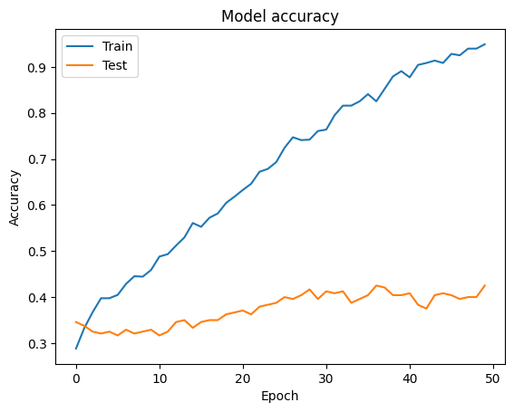
  </Notebook.FancyOutput>

  <Notebook.FancyOutput prompt="" type="output">
    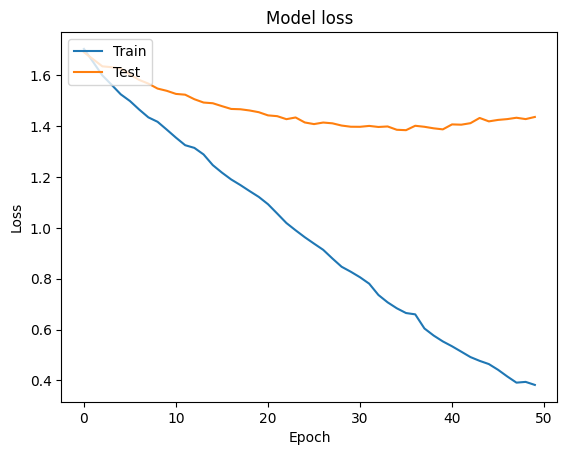
  </Notebook.FancyOutput>
</Notebook.Cell>

:target{#单机模式小结}

### 单机模式小结

以上我们按照官方教程在数据集Flower 上成功微调了 InceptionV3 模型，分别是<strong>微调顶部分类器</strong>和<strong>冻结底层网络层微调顶层网络层</strong>。接下来我们将展示如何将单机模式下的微调拓展到联邦学习模式下进行微调。

:target{#联邦学习模式进行微调}

## 联邦学习模式进行微调

:target{#环境设置}

### 环境设置

首先我们初始化各个参与方。

<Notebook.Cell>
  <Notebook.CodeArea prompt="[15]:" stderr={false} type="input">
    ```python
    %load_ext autoreload
    %autoreload 2
    ```
  </Notebook.CodeArea>
</Notebook.Cell>

<Notebook.Cell>
  <Notebook.CodeArea prompt="[16]:" stderr={false} type="input">
    ```python
    import secretflow as sf

    # Check the version of your SecretFlow
    print('The version of SecretFlow: {}'.format(sf.__version__))

    # In case you have a running secretflow runtime already.
    sf.shutdown()
    sf.init(['alice', 'bob', 'charlie'], address="local", log_to_driver=False)
    alice, bob, charlie = sf.PYU('alice'), sf.PYU('bob'), sf.PYU('charlie')
    ```
  </Notebook.CodeArea>

  <Notebook.CodeArea prompt="" stderr={false} type="output">
    <pre>
      {"The version of SecretFlow: 1.2.0.dev20230926\n"}
    </pre>
  </Notebook.CodeArea>
</Notebook.Cell>

:target{#定义Dataloader}

### 定义Dataloader

我们可以参考[TensorFlow下的DataBuilder教程](https://www.secretflow.org.cn/docs/secretflow/latest/zh-Hans/tutorial/CustomDataLoaderTF)定义我们自己的DataBuilder。

<Notebook.Cell>
  <Notebook.CodeArea prompt="[17]:" stderr={false} type="input">
    ```python
    def create_dataset_builder(
        batch_size=32,
    ):
        def dataset_builder(folder_path, stage="train"):
            import math

            import tensorflow as tf

            img_height = 180
            img_width = 180
            data_set = tf.keras.utils.image_dataset_from_directory(
                folder_path,
                validation_split=0.2,
                subset="both",
                seed=123,
                image_size=(img_height, img_width),
                batch_size=batch_size,
            )
            if stage == "train":
                train_dataset = data_set[0]
                train_step_per_epoch = math.ceil(len(data_set[0].file_paths) / batch_size)
                return train_dataset, train_step_per_epoch
            elif stage == "eval":
                eval_dataset = data_set[1]
                eval_step_per_epoch = math.ceil(len(data_set[1].file_paths) / batch_size)
                return eval_dataset, eval_step_per_epoch

        return dataset_builder
    ```
  </Notebook.CodeArea>
</Notebook.Cell>

<Notebook.Cell>
  <Notebook.CodeArea prompt="[18]:" stderr={false} type="input">
    ```python
    data_builder_dict = {
        alice: create_dataset_builder(
            batch_size=32,
        ),
        bob: create_dataset_builder(
            batch_size=32,
        ),
    }
    ```
  </Notebook.CodeArea>
</Notebook.Cell>

:target{#定义-SecureAggregator}

### 定义 SecureAggregator

<Notebook.Cell>
  <Notebook.CodeArea prompt="[19]:" stderr={false} type="input">
    ```python
    from secretflow.ml.nn import FLModel
    from secretflow.security.aggregation import SecureAggregator

    device_list = [alice, bob]
    aggregator = SecureAggregator(charlie, [alice, bob])
    ```
  </Notebook.CodeArea>
</Notebook.Cell>

:target{#定义数据加载路径}

### 定义数据加载路径

为了简便起见，我们在 单机模拟模式下直接加载同一处路径所对应的数据集

<Notebook.Cell>
  <Notebook.CodeArea prompt="[20]:" stderr={false} type="input">
    ```python
    data = {
        alice: path_to_flower_dataset,
        bob: path_to_flower_dataset,
    }
    ```
  </Notebook.CodeArea>
</Notebook.Cell>

:target{#定义联邦学习训练参数}

### 定义联邦学习训练参数

<Notebook.Cell>
  <Notebook.CodeArea prompt="[21]:" stderr={false} type="input">
    ```python
    epochs = 50
    batch_size = 32
    aggregate_freq = 2
    sampler_method = "batch"
    random_seed = 1234
    dp_spent_step_freq = 1
    ```
  </Notebook.CodeArea>
</Notebook.Cell>

:target{#id16}

### 微调顶部分类器

我们只要参照教程里对模型的定义，在函数里完成我们对模型的定义即可；可以看到代码几乎不需要作任何修改，只需要进行适当的封装。 为了方便作对比实验，我们额外添加是否加载权重的选项。

<Notebook.Cell>
  <Notebook.CodeArea prompt="[22]:" stderr={false} type="input">
    ```python
    def create_inception_v3_model_classifier(num_classes, is_load_weight=True):
        def create_model():
            from tensorflow import keras

            # Create model
            # create the base pre-trained model
            if is_load_weight:
                base_model = InceptionV3(weights='imagenet', include_top=False)
            else:
                base_model = InceptionV3(weights=None, include_top=False)

            # add a global spatial average pooling layer
            x = base_model.output
            x = GlobalAveragePooling2D()(x)
            # let's add a fully-connected layer
            x = Dense(1024, activation='relu')(x)
            # and a logistic layer -- let's say we have 10 classes
            predictions = Dense(num_classes, activation='softmax')(x)

            # this is the model we will train
            model = Model(inputs=base_model.input, outputs=predictions)

            # first: train only the top layers (which were randomly initialized)
            # i.e. freeze all convolutional InceptionV3 layers
            for layer in base_model.layers:
                layer.trainable = False

            # Compile model
            model.compile(
                optimizer='rmsprop',
                loss='sparse_categorical_crossentropy',
                metrics=["accuracy"],
            )

            return model

        return create_model
    ```
  </Notebook.CodeArea>
</Notebook.Cell>

:target{#加载预训练模型权重并且微调}

#### 加载预训练模型权重并且微调

<Notebook.Cell>
  <Notebook.CodeArea prompt="[23]:" stderr={false} type="input">
    ```python
    # prepare model
    num_classes = 5

    # keras model
    weight_model = create_inception_v3_model_classifier(
        num_classes=num_classes, is_load_weight=True
    )


    fed_model = FLModel(
        device_list=device_list,
        model=weight_model,
        aggregator=aggregator,
        backend="tensorflow",
        strategy="fed_avg_w",
        random_seed=1234,
    )
    ```
  </Notebook.CodeArea>
</Notebook.Cell>

<Notebook.Cell>
  <Notebook.CodeArea prompt="[24]:" stderr={false} type="input">
    ```python
    history = fed_model.fit(
        data,
        None,
        validation_data=data,
        epochs=epochs,
        batch_size=batch_size,
        aggregate_freq=aggregate_freq,
        sampler_method=sampler_method,
        random_seed=random_seed,
        dp_spent_step_freq=dp_spent_step_freq,
        dataset_builder=data_builder_dict,
    )
    ```
  </Notebook.CodeArea>
</Notebook.Cell>

<Notebook.Cell>
  <Notebook.CodeArea prompt="[25]:" stderr={false} type="input">
    ```python
    # Draw accuracy values for training & validation
    plt.plot(history.global_history['accuracy'])
    plt.plot(history.global_history['val_accuracy'])
    plt.title('FLModel accuracy')
    plt.ylabel('Accuracy')
    plt.xlabel('Epoch')
    plt.legend(['Train', 'Valid'], loc='upper left')
    plt.show()

    # Draw loss for training & validation
    plt.plot(history.global_history['loss'])
    plt.plot(history.global_history['val_loss'])
    plt.title('FLModel loss')
    plt.ylabel('Loss')
    plt.xlabel('Epoch')
    plt.legend(['Train', 'Valid'], loc='upper left')
    plt.show()
    ```
  </Notebook.CodeArea>

  <Notebook.FancyOutput prompt="" type="output">
    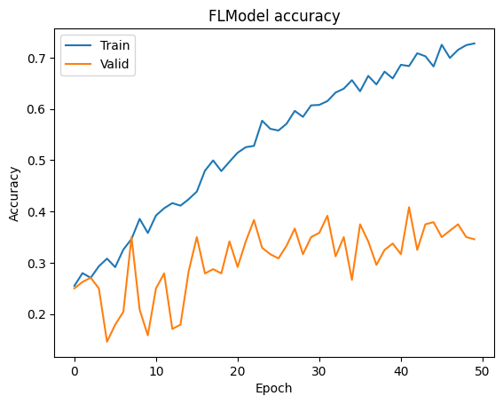
  </Notebook.FancyOutput>

  <Notebook.FancyOutput prompt="" type="output">
    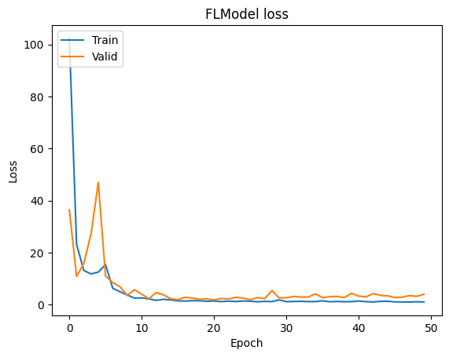
  </Notebook.FancyOutput>
</Notebook.Cell>

:target{#只加载网络结构同时随机初始化}

#### 只加载网络结构同时随机初始化

<Notebook.Cell>
  <Notebook.CodeArea prompt="[26]:" stderr={false} type="input">
    ```python
    # keras model
    no_weight_model = create_inception_v3_model_classifier(
        num_classes=num_classes, is_load_weight=False
    )


    fed_model = FLModel(
        device_list=device_list,
        model=no_weight_model,
        aggregator=aggregator,
        backend="tensorflow",
        strategy="fed_avg_w",
        random_seed=1234,
    )
    ```
  </Notebook.CodeArea>
</Notebook.Cell>

<Notebook.Cell>
  <Notebook.CodeArea prompt="[27]:" stderr={false} type="input">
    ```python
    history = fed_model.fit(
        data,
        None,
        validation_data=data,
        epochs=epochs,
        batch_size=batch_size,
        aggregate_freq=aggregate_freq,
        sampler_method=sampler_method,
        random_seed=random_seed,
        dp_spent_step_freq=dp_spent_step_freq,
        dataset_builder=data_builder_dict,
    )
    ```
  </Notebook.CodeArea>
</Notebook.Cell>

<Notebook.Cell>
  <Notebook.CodeArea prompt="[28]:" stderr={false} type="input">
    ```python
    # Draw accuracy values for training & validation
    plt.plot(history.global_history['accuracy'])
    plt.plot(history.global_history['val_accuracy'])
    plt.title('FLModel accuracy')
    plt.ylabel('Accuracy')
    plt.xlabel('Epoch')
    plt.legend(['Train', 'Valid'], loc='upper left')
    plt.show()

    # Draw loss for training & validation
    plt.plot(history.global_history['loss'])
    plt.plot(history.global_history['val_loss'])
    plt.title('FLModel loss')
    plt.ylabel('Loss')
    plt.xlabel('Epoch')
    plt.legend(['Train', 'Valid'], loc='upper left')
    plt.show()
    ```
  </Notebook.CodeArea>

  <Notebook.FancyOutput prompt="" type="output">
    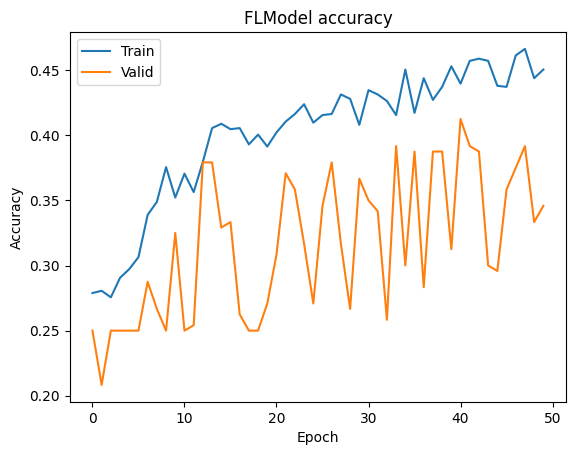
  </Notebook.FancyOutput>

  <Notebook.FancyOutput prompt="" type="output">
    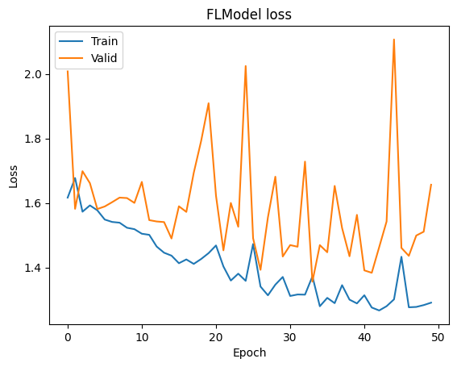
  </Notebook.FancyOutput>
</Notebook.Cell>

:target{#冻结底层微调顶层网络}

### 冻结底层微调顶层网络

我们只要参照教程里对模型的定义，在函数里完成我们对模型的定义即可；可以看到代码几乎不需要作任何修改，只需要进行适当的封装。 为了方便作对比实验，我们额外添加是否加载权重的选项。

<Notebook.Cell>
  <Notebook.CodeArea prompt="[29]:" stderr={false} type="input">
    ```python
    def create_inception_v3_model_fine_tune(num_classes, is_load_weight=True):
        def create_model():
            from tensorflow import keras

            # Create model
            # create the base pre-trained model
            if is_load_weight:
                base_model = InceptionV3(weights='imagenet', include_top=False)
            else:
                base_model = InceptionV3(weights=None, include_top=False)

            # add a global spatial average pooling layer
            x = base_model.output
            x = GlobalAveragePooling2D()(x)
            # let's add a fully-connected layer
            x = Dense(1024, activation='relu')(x)
            # and a logistic layer -- let's say we have 10 classes
            predictions = Dense(num_classes, activation='softmax')(x)

            # this is the model we will train
            model = Model(inputs=base_model.input, outputs=predictions)

            for layer in model.layers[:249]:
                layer.trainable = False
            for layer in model.layers[249:]:
                layer.trainable = True

            # Compile model
            model.compile(
                optimizer=SGD(learning_rate=0.0001, momentum=0.9),
                loss='sparse_categorical_crossentropy',
                metrics=["accuracy"],
            )

            return model

        return create_model
    ```
  </Notebook.CodeArea>
</Notebook.Cell>

:target{#id20}

#### 加载预训练模型权重并且微调

<Notebook.Cell>
  <Notebook.CodeArea prompt="[30]:" stderr={false} type="input">
    ```python
    # keras model
    weight_model = create_inception_v3_model_fine_tune(
        num_classes=num_classes, is_load_weight=True
    )


    fed_model = FLModel(
        device_list=device_list,
        model=weight_model,
        aggregator=aggregator,
        backend="tensorflow",
        strategy="fed_avg_w",
        random_seed=1234,
    )
    ```
  </Notebook.CodeArea>
</Notebook.Cell>

<Notebook.Cell>
  <Notebook.CodeArea prompt="[31]:" stderr={false} type="input">
    ```python
    history = fed_model.fit(
        data,
        None,
        validation_data=data,
        epochs=epochs,
        batch_size=batch_size,
        aggregate_freq=aggregate_freq,
        sampler_method=sampler_method,
        random_seed=random_seed,
        dp_spent_step_freq=dp_spent_step_freq,
        dataset_builder=data_builder_dict,
    )
    ```
  </Notebook.CodeArea>
</Notebook.Cell>

<Notebook.Cell>
  <Notebook.CodeArea prompt="[32]:" stderr={false} type="input">
    ```python
    # Draw accuracy values for training & validation
    plt.plot(history.global_history['accuracy'])
    plt.plot(history.global_history['val_accuracy'])
    plt.title('FLModel accuracy')
    plt.ylabel('Accuracy')
    plt.xlabel('Epoch')
    plt.legend(['Train', 'Valid'], loc='upper left')
    plt.show()

    # Draw loss for training & validation
    plt.plot(history.global_history['loss'])
    plt.plot(history.global_history['val_loss'])
    plt.title('FLModel loss')
    plt.ylabel('Loss')
    plt.xlabel('Epoch')
    plt.legend(['Train', 'Valid'], loc='upper left')
    plt.show()
    ```
  </Notebook.CodeArea>

  <Notebook.FancyOutput prompt="" type="output">
    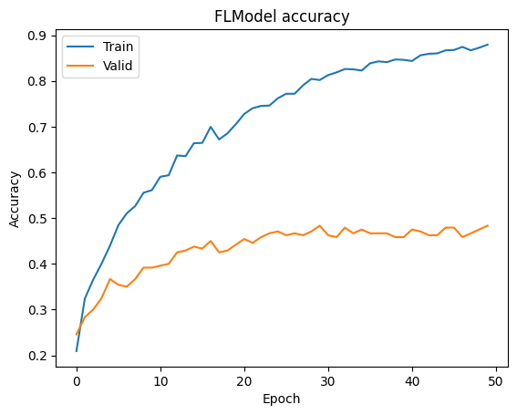
  </Notebook.FancyOutput>

  <Notebook.FancyOutput prompt="" type="output">
    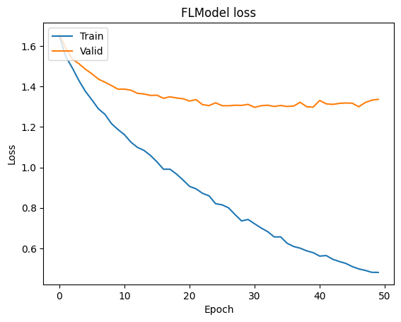
  </Notebook.FancyOutput>
</Notebook.Cell>

:target{#id21}

#### 只加载网络结构同时随机初始化

<Notebook.Cell>
  <Notebook.CodeArea prompt="[33]:" stderr={false} type="input">
    ```python
    # keras model
    no_weight_model = create_inception_v3_model_fine_tune(
        num_classes=num_classes, is_load_weight=False
    )


    fed_model = FLModel(
        device_list=device_list,
        model=no_weight_model,
        aggregator=aggregator,
        backend="tensorflow",
        strategy="fed_avg_w",
        random_seed=1234,
    )
    ```
  </Notebook.CodeArea>
</Notebook.Cell>

<Notebook.Cell>
  <Notebook.CodeArea prompt="[34]:" stderr={false} type="input">
    ```python
    history = fed_model.fit(
        data,
        None,
        validation_data=data,
        epochs=epochs,
        batch_size=batch_size,
        aggregate_freq=aggregate_freq,
        sampler_method=sampler_method,
        random_seed=random_seed,
        dp_spent_step_freq=dp_spent_step_freq,
        dataset_builder=data_builder_dict,
    )
    ```
  </Notebook.CodeArea>
</Notebook.Cell>

<Notebook.Cell>
  <Notebook.CodeArea prompt="[35]:" stderr={false} type="input">
    ```python
    # Draw accuracy values for training & validation
    plt.plot(history.global_history['accuracy'])
    plt.plot(history.global_history['val_accuracy'])
    plt.title('FLModel accuracy')
    plt.ylabel('Accuracy')
    plt.xlabel('Epoch')
    plt.legend(['Train', 'Valid'], loc='upper left')
    plt.show()

    # Draw loss for training & validation
    plt.plot(history.global_history['loss'])
    plt.plot(history.global_history['val_loss'])
    plt.title('FLModel loss')
    plt.ylabel('Loss')
    plt.xlabel('Epoch')
    plt.legend(['Train', 'Valid'], loc='upper left')
    plt.show()
    ```
  </Notebook.CodeArea>

  <Notebook.FancyOutput prompt="" type="output">
    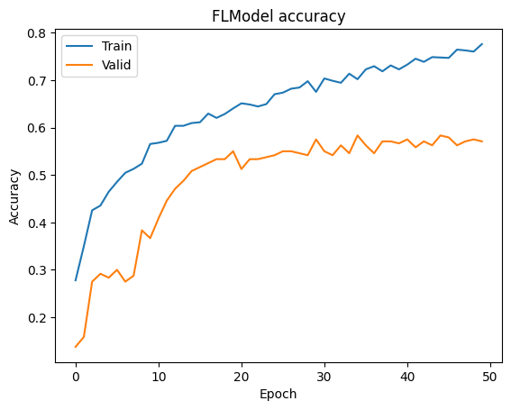
  </Notebook.FancyOutput>

  <Notebook.FancyOutput prompt="" type="output">
    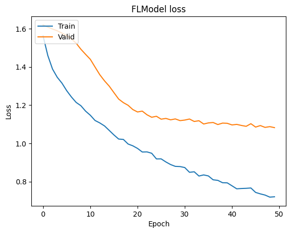
  </Notebook.FancyOutput>
</Notebook.Cell>

:target{#联邦学习小结}

### 联邦学习小结

可以看到，对照着 TensorFlow 的官方教程，隐语能够无缝地兼容所给出的微调方式；并且我们可以看到，通过对预训练模型的兼容，我们可以不需要自己再重新写出复杂网络的模型结构，InceptionV3 的网络结构源代码位于：[source code of Inception V3](https://github.com/keras-team/keras/blob/v2.13.1/keras/applications/inception_v3.py)，并且通过对比实验我们可以看出，加载预训练模型的权重，可以让我们的模型性能更优秀。

:target{#总结}

## 总结

本篇教程，我们以Inception V3为例介绍了如何在隐语的联邦学习模式下基于直接加载 TensorFlow\.Keras 的 [预训练模型](https://keras.io/api/applications/)，通过直接加载预训练模型，我们能够获得： - 不需要再次编写复杂模型的结构代码 - 基于预训练模型进行微调和迁移学习 - 使用预训练权重模型能够使得联邦模型获得更好的性能
