:target{#基于-TensorFlow-在-SecretFlow-中实现水平联邦目标检测任务}

# 基于 TensorFlow 在 SecretFlow 中实现水平联邦目标检测任务

:target{#引言}

## 引言

本教程基于 TensorFlow 的 [Object detection with Vision Transformers](https://keras.io/examples/vision/object_detection_using_vision_transformer/) 而改写，通过本教程，您将了解到现有的基于 TensorFlow 的示例如何快速地迁移到 SecretFlow 隐语的联邦学习框架之下，实现模型的联邦学习化。

:target{#单机模式}

## 单机模式

:target{#小节引言}

### 小节引言

本小节的代码主要来自于 [Object detection with Vision Transformers](https://keras.io/examples/vision/object_detection_using_vision_transformer/) ，主要讲解如何在 Keras 下利用 Vision Transformers 进行目标检测。 在本次示例，教程通过在数据集 [Caltech 101](http://www.vision.caltech.edu/datasets/) 上训练 ViT 在给定图片上检测一架飞机。
为了教程的简洁，本小节仅仅简要介绍了一下各部分的功能；对于实现的具体解析，请读者移步参考[原教程](https://keras.io/examples/vision/object_detection_using_vision_transformer/)。

<Notebook.Cell>
  <Notebook.CodeArea prompt="[1]:" stderr={false} type="input">
    ```python
    %load_ext autoreload
    %autoreload 2
    ```
  </Notebook.CodeArea>
</Notebook.Cell>

:target{#安装依赖包}

### 安装依赖包

<Notebook.Cell>
  <Notebook.CodeArea prompt="[2]:" stderr={false} type="input">
    ```python
    !python -m pip install -U tensorflow-addons
    !python -m pip install -U opencv-python
    ```
  </Notebook.CodeArea>

  <Notebook.CodeArea prompt="" stderr={false} type="output">
    <pre>
      {"Requirement already satisfied: tensorflow-addons in /opt/anaconda3/envs/limingbo_sf/lib/python3.8/site-packages (0.21.0)\nRequirement already satisfied: packaging in /opt/anaconda3/envs/limingbo_sf/lib/python3.8/site-packages (from tensorflow-addons) (23.2)\nRequirement already satisfied: typeguard<3.0.0,>=2.7 in /opt/anaconda3/envs/limingbo_sf/lib/python3.8/site-packages (from tensorflow-addons) (2.13.3)\nRequirement already satisfied: opencv-python in /opt/anaconda3/envs/limingbo_sf/lib/python3.8/site-packages (4.8.1.78)\nRequirement already satisfied: numpy>=1.17.0 in /opt/anaconda3/envs/limingbo_sf/lib/python3.8/site-packages (from opencv-python) (1.23.5)\n"}
    </pre>
  </Notebook.CodeArea>
</Notebook.Cell>

:target{#导入第三方库}

### 导入第三方库

<Notebook.Cell>
  <Notebook.CodeArea prompt="[1]:" stderr={false} type="input">
    ```python
    import numpy as np
    import tensorflow as tf
    from tensorflow import keras
    from tensorflow.keras import layers
    import tensorflow_addons as tfa
    import matplotlib.pyplot as plt
    import numpy as np
    import cv2
    import os
    import scipy.io
    import shutil
    ```
  </Notebook.CodeArea>
</Notebook.Cell>

:target{#准备数据集}

### 准备数据集

<Notebook.Cell>
  <Notebook.CodeArea prompt="[4]:" stderr={false} type="input">
    ```python
    # Path to images and annotations
    path_images = "./101_ObjectCategories/airplanes/"
    path_annot = "./Annotations/Airplanes_Side_2/"

    path_to_downloaded_file = keras.utils.get_file(
        fname="caltech_101_zipped",
        origin="https://data.caltech.edu/records/mzrjq-6wc02/files/caltech-101.zip",
        extract=True,
        archive_format="zip",  # downloaded file format
        cache_dir="./",  # cache and extract in current directory
    )

    # Extracting tar files found inside main zip file
    shutil.unpack_archive("./datasets/caltech-101/101_ObjectCategories.tar.gz", "./")
    shutil.unpack_archive("./datasets/caltech-101/Annotations.tar", "./")

    # list of paths to images and annotations
    image_paths = [
        f for f in os.listdir(path_images) if os.path.isfile(os.path.join(path_images, f))
    ]
    annot_paths = [
        f for f in os.listdir(path_annot) if os.path.isfile(os.path.join(path_annot, f))
    ]

    image_paths.sort()
    annot_paths.sort()

    image_size = 224  # resize input images to this size

    images, targets = [], []

    # loop over the annotations and images, preprocess them and store in lists
    for i in range(0, len(annot_paths)):
        # Access bounding box coordinates
        annot = scipy.io.loadmat(path_annot + annot_paths[i])["box_coord"][0]

        top_left_x, top_left_y = annot[2], annot[0]
        bottom_right_x, bottom_right_y = annot[3], annot[1]

        image = keras.utils.load_img(
            path_images + image_paths[i],
        )
        (w, h) = image.size[:2]

        # resize train set images
        if i < int(len(annot_paths) * 0.8):
            # resize image if it is for training dataset
            image = image.resize((image_size, image_size))

        # convert image to array and append to list
        images.append(keras.utils.img_to_array(image))

        # apply relative scaling to bounding boxes as per given image and append to list
        targets.append(
            (
                float(top_left_x) / w,
                float(top_left_y) / h,
                float(bottom_right_x) / w,
                float(bottom_right_y) / h,
            )
        )

    # Convert the list to numpy array, split to train and test dataset
    (x_train), (y_train) = (
        np.asarray(images[: int(len(images) * 0.8)]),
        np.asarray(targets[: int(len(targets) * 0.8)]),
    )
    (x_test), (y_test) = (
        np.asarray(images[int(len(images) * 0.8) :]),
        np.asarray(targets[int(len(targets) * 0.8) :]),
    )
    ```
  </Notebook.CodeArea>

  <Notebook.CodeArea prompt="" stderr={false} type="output">
    <pre>
      {"Downloading data from https://data.caltech.edu/records/mzrjq-6wc02/files/caltech-101.zip\n137414764/137414764 [==============================] - 73s 1us/step\n"}
    </pre>
  </Notebook.CodeArea>
</Notebook.Cell>

:target{#实现多层感知机（MLP）}

### 实现多层感知机（MLP）

<Notebook.Cell>
  <Notebook.CodeArea prompt="[5]:" stderr={false} type="input">
    ```python
    def mlp(x, hidden_units, dropout_rate):
        for units in hidden_units:
            x = layers.Dense(units, activation=tf.nn.gelu)(x)
            x = layers.Dropout(dropout_rate)(x)
        return x
    ```
  </Notebook.CodeArea>
</Notebook.Cell>

:target{#实现块划分层（the-patch-creation-layer）}

### 实现块划分层（the patch creation layer）

<Notebook.Cell>
  <Notebook.CodeArea prompt="[6]:" stderr={false} type="input">
    ```python
    class Patches(layers.Layer):
        def __init__(self, patch_size):
            super().__init__()
            self.patch_size = patch_size

        #     Override function to avoid error while saving model
        def get_config(self):
            config = super().get_config().copy()
            config.update(
                {
                    "input_shape": input_shape,
                    "patch_size": patch_size,
                    "num_patches": num_patches,
                    "projection_dim": projection_dim,
                    "num_heads": num_heads,
                    "transformer_units": transformer_units,
                    "transformer_layers": transformer_layers,
                    "mlp_head_units": mlp_head_units,
                }
            )
            return config

        def call(self, images):
            batch_size = tf.shape(images)[0]
            patches = tf.image.extract_patches(
                images=images,
                sizes=[1, self.patch_size, self.patch_size, 1],
                strides=[1, self.patch_size, self.patch_size, 1],
                rates=[1, 1, 1, 1],
                padding="VALID",
            )
            # return patches
            return tf.reshape(patches, [batch_size, -1, patches.shape[-1]])
    ```
  </Notebook.CodeArea>
</Notebook.Cell>

:target{#展示输入图像的块划分}

### 展示输入图像的块划分

<Notebook.Cell>
  <Notebook.CodeArea prompt="[7]:" stderr={false} type="input">
    ```python
    patch_size = 32  # Size of the patches to be extracted from the input images

    plt.figure(figsize=(4, 4))
    plt.imshow(x_train[0].astype("uint8"))
    plt.axis("off")

    patches = Patches(patch_size)(tf.convert_to_tensor([x_train[0]]))
    print(f"Image size: {image_size} X {image_size}")
    print(f"Patch size: {patch_size} X {patch_size}")
    print(f"{patches.shape[1]} patches per image \n{patches.shape[-1]} elements per patch")


    n = int(np.sqrt(patches.shape[1]))
    plt.figure(figsize=(4, 4))
    for i, patch in enumerate(patches[0]):
        ax = plt.subplot(n, n, i + 1)
        patch_img = tf.reshape(patch, (patch_size, patch_size, 3))
        plt.imshow(patch_img.numpy().astype("uint8"))
        plt.axis("off")
    ```
  </Notebook.CodeArea>

  <Notebook.CodeArea prompt="" stderr={false} type="output">
    <pre>
      {"Image size: 224 X 224\nPatch size: 32 X 32\n49 patches per image\n3072 elements per patch\n"}
    </pre>
  </Notebook.CodeArea>

  <Notebook.FancyOutput prompt="" type="output">
    
  </Notebook.FancyOutput>

  <Notebook.FancyOutput prompt="" type="output">
    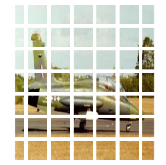
  </Notebook.FancyOutput>
</Notebook.Cell>

:target{#实现块编码层（the-patch-encoding-layer）}

### 实现块编码层（the patch encoding layer）

<Notebook.Cell>
  <Notebook.CodeArea prompt="[8]:" stderr={false} type="input">
    ```python
    class PatchEncoder(layers.Layer):
        def __init__(self, num_patches, projection_dim):
            super().__init__()
            self.num_patches = num_patches
            self.projection = layers.Dense(units=projection_dim)
            self.position_embedding = layers.Embedding(
                input_dim=num_patches, output_dim=projection_dim
            )

        # Override function to avoid error while saving model
        def get_config(self):
            config = super().get_config().copy()
            config.update(
                {
                    "input_shape": input_shape,
                    "patch_size": patch_size,
                    "num_patches": num_patches,
                    "projection_dim": projection_dim,
                    "num_heads": num_heads,
                    "transformer_units": transformer_units,
                    "transformer_layers": transformer_layers,
                    "mlp_head_units": mlp_head_units,
                }
            )
            return config

        def call(self, patch):
            positions = tf.range(start=0, limit=self.num_patches, delta=1)
            encoded = self.projection(patch) + self.position_embedding(positions)
            return encoded
    ```
  </Notebook.CodeArea>
</Notebook.Cell>

:target{#构建-VIT-模型}

### 构建 VIT 模型

<Notebook.Cell>
  <Notebook.CodeArea prompt="[9]:" stderr={false} type="input">
    ```python
    def create_vit_object_detector(
        input_shape,
        patch_size,
        num_patches,
        projection_dim,
        num_heads,
        transformer_units,
        transformer_layers,
        mlp_head_units,
    ):
        inputs = layers.Input(shape=input_shape)
        # Create patches
        patches = Patches(patch_size)(inputs)
        # Encode patches
        encoded_patches = PatchEncoder(num_patches, projection_dim)(patches)

        # Create multiple layers of the Transformer block.
        for _ in range(transformer_layers):
            # Layer normalization 1.
            x1 = layers.LayerNormalization(epsilon=1e-6)(encoded_patches)
            # Create a multi-head attention layer.
            attention_output = layers.MultiHeadAttention(
                num_heads=num_heads, key_dim=projection_dim, dropout=0.1
            )(x1, x1)
            # Skip connection 1.
            x2 = layers.Add()([attention_output, encoded_patches])
            # Layer normalization 2.
            x3 = layers.LayerNormalization(epsilon=1e-6)(x2)
            # MLP
            x3 = mlp(x3, hidden_units=transformer_units, dropout_rate=0.1)
            # Skip connection 2.
            encoded_patches = layers.Add()([x3, x2])

        # Create a [batch_size, projection_dim] tensor.
        representation = layers.LayerNormalization(epsilon=1e-6)(encoded_patches)
        representation = layers.Flatten()(representation)
        representation = layers.Dropout(0.3)(representation)
        # Add MLP.
        features = mlp(representation, hidden_units=mlp_head_units, dropout_rate=0.3)

        bounding_box = layers.Dense(4)(
            features
        )  # Final four neurons that output bounding box

        # return Keras model.
        return keras.Model(inputs=inputs, outputs=bounding_box)
    ```
  </Notebook.CodeArea>
</Notebook.Cell>

:target{#运行实验}

### 运行实验

<Notebook.Cell>
  <Notebook.CodeArea prompt="[10]:" stderr={false} type="input">
    ```python
    def run_experiment(model, learning_rate, weight_decay, batch_size, num_epochs):
        optimizer = tfa.optimizers.AdamW(
            learning_rate=learning_rate, weight_decay=weight_decay
        )

        # Compile model.
        model.compile(optimizer=optimizer, loss=keras.losses.MeanSquaredError())

        checkpoint_filepath = "logs/"
        checkpoint_callback = keras.callbacks.ModelCheckpoint(
            checkpoint_filepath,
            monitor="val_loss",
            save_best_only=True,
            save_weights_only=True,
        )

        history = model.fit(
            x=x_train,
            y=y_train,
            batch_size=batch_size,
            epochs=num_epochs,
            validation_split=0.1,
            callbacks=[
                checkpoint_callback,
                keras.callbacks.EarlyStopping(monitor="val_loss", patience=10),
            ],
        )

        return history


    input_shape = (image_size, image_size, 3)  # input image shape
    learning_rate = 0.001
    weight_decay = 0.0001
    batch_size = 32
    num_epochs = 100
    num_patches = (image_size // patch_size) ** 2
    projection_dim = 64
    num_heads = 4
    # Size of the transformer layers
    transformer_units = [
        projection_dim * 2,
        projection_dim,
    ]
    transformer_layers = 4
    mlp_head_units = [2048, 1024, 512, 64, 32]  # Size of the dense layers


    history = []
    num_patches = (image_size // patch_size) ** 2

    vit_object_detector = create_vit_object_detector(
        input_shape,
        patch_size,
        num_patches,
        projection_dim,
        num_heads,
        transformer_units,
        transformer_layers,
        mlp_head_units,
    )

    # Train model
    history = run_experiment(
        vit_object_detector, learning_rate, weight_decay, batch_size, num_epochs
    )
    ```
  </Notebook.CodeArea>

  <Notebook.CodeArea prompt="" stderr={false} type="output">
    <pre>
      {"Epoch 1/100\n18/18 [==============================] - 7s 187ms/step - loss: 1.6130 - val_loss: 0.3495\nEpoch 2/100\n18/18 [==============================] - 3s 142ms/step - loss: 0.3870 - val_loss: 0.3149\nEpoch 3/100\n18/18 [==============================] - 3s 142ms/step - loss: 0.3286 - val_loss: 0.2803\nEpoch 4/100\n18/18 [==============================] - 3s 154ms/step - loss: 0.2741 - val_loss: 0.2469\nEpoch 5/100\n18/18 [==============================] - 3s 145ms/step - loss: 0.2366 - val_loss: 0.2148\nEpoch 6/100\n18/18 [==============================] - 3s 159ms/step - loss: 0.2001 - val_loss: 0.1853\nEpoch 7/100\n18/18 [==============================] - 2s 140ms/step - loss: 0.1742 - val_loss: 0.1586\nEpoch 8/100\n18/18 [==============================] - 2s 141ms/step - loss: 0.1481 - val_loss: 0.1339\nEpoch 9/100\n18/18 [==============================] - 3s 161ms/step - loss: 0.1266 - val_loss: 0.1115\nEpoch 10/100\n18/18 [==============================] - 3s 169ms/step - loss: 0.1039 - val_loss: 0.0916\nEpoch 11/100\n18/18 [==============================] - 3s 163ms/step - loss: 0.0878 - val_loss: 0.0741\nEpoch 12/100\n18/18 [==============================] - 3s 163ms/step - loss: 0.0705 - val_loss: 0.0589\nEpoch 13/100\n18/18 [==============================] - 3s 159ms/step - loss: 0.0567 - val_loss: 0.0460\nEpoch 14/100\n18/18 [==============================] - 3s 166ms/step - loss: 0.0447 - val_loss: 0.0353\nEpoch 15/100\n18/18 [==============================] - 3s 159ms/step - loss: 0.0357 - val_loss: 0.0267\nEpoch 16/100\n18/18 [==============================] - 3s 164ms/step - loss: 0.0287 - val_loss: 0.0199\nEpoch 17/100\n18/18 [==============================] - 3s 152ms/step - loss: 0.0236 - val_loss: 0.0146\nEpoch 18/100\n18/18 [==============================] - 3s 158ms/step - loss: 0.0195 - val_loss: 0.0108\nEpoch 19/100\n18/18 [==============================] - 3s 168ms/step - loss: 0.0170 - val_loss: 0.0080\nEpoch 20/100\n18/18 [==============================] - 3s 170ms/step - loss: 0.0144 - val_loss: 0.0061\nEpoch 21/100\n18/18 [==============================] - 3s 173ms/step - loss: 0.0136 - val_loss: 0.0047\nEpoch 22/100\n18/18 [==============================] - 3s 162ms/step - loss: 0.0122 - val_loss: 0.0037\nEpoch 23/100\n18/18 [==============================] - 3s 171ms/step - loss: 0.0108 - val_loss: 0.0030\nEpoch 24/100\n18/18 [==============================] - 3s 168ms/step - loss: 0.0105 - val_loss: 0.0025\nEpoch 25/100\n18/18 [==============================] - 3s 152ms/step - loss: 0.0102 - val_loss: 0.0021\nEpoch 26/100\n18/18 [==============================] - 3s 172ms/step - loss: 0.0098 - val_loss: 0.0019\nEpoch 27/100\n18/18 [==============================] - 3s 169ms/step - loss: 0.0097 - val_loss: 0.0018\nEpoch 28/100\n18/18 [==============================] - 3s 165ms/step - loss: 0.0091 - val_loss: 0.0017\nEpoch 29/100\n18/18 [==============================] - 3s 158ms/step - loss: 0.0090 - val_loss: 0.0016\nEpoch 30/100\n18/18 [==============================] - 3s 160ms/step - loss: 0.0084 - val_loss: 0.0015\nEpoch 31/100\n18/18 [==============================] - 3s 156ms/step - loss: 0.0093 - val_loss: 0.0015\nEpoch 32/100\n18/18 [==============================] - 3s 152ms/step - loss: 0.0082 - val_loss: 0.0015\nEpoch 33/100\n18/18 [==============================] - 2s 116ms/step - loss: 0.0090 - val_loss: 0.0015\nEpoch 34/100\n18/18 [==============================] - 2s 115ms/step - loss: 0.0087 - val_loss: 0.0016\nEpoch 35/100\n18/18 [==============================] - 2s 118ms/step - loss: 0.0087 - val_loss: 0.0015\nEpoch 36/100\n18/18 [==============================] - 2s 115ms/step - loss: 0.0085 - val_loss: 0.0015\nEpoch 37/100\n18/18 [==============================] - 2s 116ms/step - loss: 0.0091 - val_loss: 0.0015\nEpoch 38/100\n18/18 [==============================] - 2s 115ms/step - loss: 0.0083 - val_loss: 0.0015\nEpoch 39/100\n18/18 [==============================] - 3s 171ms/step - loss: 0.0081 - val_loss: 0.0014\nEpoch 40/100\n18/18 [==============================] - 3s 159ms/step - loss: 0.0083 - val_loss: 0.0014\nEpoch 41/100\n18/18 [==============================] - 3s 149ms/step - loss: 0.0081 - val_loss: 0.0014\nEpoch 42/100\n18/18 [==============================] - 3s 158ms/step - loss: 0.0079 - val_loss: 0.0014\nEpoch 43/100\n18/18 [==============================] - 2s 115ms/step - loss: 0.0080 - val_loss: 0.0014\nEpoch 44/100\n18/18 [==============================] - 2s 115ms/step - loss: 0.0078 - val_loss: 0.0014\nEpoch 45/100\n18/18 [==============================] - 2s 116ms/step - loss: 0.0077 - val_loss: 0.0014\nEpoch 46/100\n18/18 [==============================] - 2s 115ms/step - loss: 0.0080 - val_loss: 0.0014\nEpoch 47/100\n18/18 [==============================] - 2s 116ms/step - loss: 0.0075 - val_loss: 0.0014\nEpoch 48/100\n18/18 [==============================] - 2s 113ms/step - loss: 0.0078 - val_loss: 0.0014\nEpoch 49/100\n18/18 [==============================] - 2s 115ms/step - loss: 0.0082 - val_loss: 0.0014\nEpoch 50/100\n18/18 [==============================] - 2s 115ms/step - loss: 0.0071 - val_loss: 0.0014\nEpoch 51/100\n18/18 [==============================] - 2s 114ms/step - loss: 0.0076 - val_loss: 0.0014\nEpoch 52/100\n18/18 [==============================] - 2s 116ms/step - loss: 0.0080 - val_loss: 0.0014\n"}
    </pre>
  </Notebook.CodeArea>
</Notebook.Cell>

:target{#可视化训练过程}

### 可视化训练过程

<Notebook.Cell>
  <Notebook.CodeArea prompt="[11]:" stderr={false} type="input">
    ```python
    history.history.keys()
    ```
  </Notebook.CodeArea>

  <Notebook.CodeArea prompt="[11]:" stderr={false} type="output">
    <pre>
      {"dict_keys(['loss', 'val_loss'])\n"}
    </pre>
  </Notebook.CodeArea>
</Notebook.Cell>

<Notebook.Cell>
  <Notebook.CodeArea prompt="[12]:" stderr={false} type="input">
    ```python
    # Plot the change of loss during training
    plt.plot(history.history['loss'])
    plt.plot(history.history['val_loss'])
    plt.title('Model loss')
    plt.ylabel('Loss')
    plt.xlabel('Epoch')
    plt.legend(['Train', 'Val'], loc='upper right')
    plt.show()
    ```
  </Notebook.CodeArea>

  <Notebook.FancyOutput prompt="" type="output">
    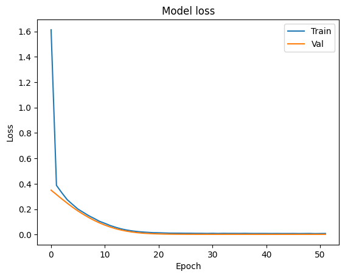
  </Notebook.FancyOutput>
</Notebook.Cell>

:target{#测试模型}

### 测试模型

<Notebook.Cell>
  <Notebook.CodeArea prompt="[13]:" stderr={false} type="input">
    ```python
    import matplotlib.patches as patches

    # Saves the model in current path
    vit_object_detector.save("vit_object_detector.h5", save_format="h5")


    # To calculate IoU (intersection over union, given two bounding boxes)
    def bounding_box_intersection_over_union(box_predicted, box_truth):
        # get (x, y) coordinates of intersection of bounding boxes
        top_x_intersect = max(box_predicted[0], box_truth[0])
        top_y_intersect = max(box_predicted[1], box_truth[1])
        bottom_x_intersect = min(box_predicted[2], box_truth[2])
        bottom_y_intersect = min(box_predicted[3], box_truth[3])

        # calculate area of the intersection bb (bounding box)
        intersection_area = max(0, bottom_x_intersect - top_x_intersect + 1) * max(
            0, bottom_y_intersect - top_y_intersect + 1
        )

        # calculate area of the prediction bb and ground-truth bb
        box_predicted_area = (box_predicted[2] - box_predicted[0] + 1) * (
            box_predicted[3] - box_predicted[1] + 1
        )
        box_truth_area = (box_truth[2] - box_truth[0] + 1) * (
            box_truth[3] - box_truth[1] + 1
        )

        # calculate intersection over union by taking intersection
        # area and dividing it by the sum of predicted bb and ground truth
        # bb areas subtracted by  the interesection area

        # return ioU
        return intersection_area / float(
            box_predicted_area + box_truth_area - intersection_area
        )


    i, mean_iou = 0, 0

    # Compare results for 10 images in the test set
    for input_image in x_test[:10]:
        fig, (ax1, ax2) = plt.subplots(1, 2, figsize=(15, 15))
        im = input_image

        # Display the image
        ax1.imshow(im.astype("uint8"))
        ax2.imshow(im.astype("uint8"))

        input_image = cv2.resize(
            input_image, (image_size, image_size), interpolation=cv2.INTER_AREA
        )
        input_image = np.expand_dims(input_image, axis=0)
        preds = vit_object_detector.predict(input_image)[0]

        (h, w) = (im).shape[0:2]

        top_left_x, top_left_y = int(preds[0] * w), int(preds[1] * h)

        bottom_right_x, bottom_right_y = int(preds[2] * w), int(preds[3] * h)

        box_predicted = [top_left_x, top_left_y, bottom_right_x, bottom_right_y]
        # Create the bounding box
        rect = patches.Rectangle(
            (top_left_x, top_left_y),
            bottom_right_x - top_left_x,
            bottom_right_y - top_left_y,
            facecolor="none",
            edgecolor="red",
            linewidth=1,
        )
        # Add the bounding box to the image
        ax1.add_patch(rect)
        ax1.set_xlabel(
            "Predicted: "
            + str(top_left_x)
            + ", "
            + str(top_left_y)
            + ", "
            + str(bottom_right_x)
            + ", "
            + str(bottom_right_y)
        )

        top_left_x, top_left_y = int(y_test[i][0] * w), int(y_test[i][1] * h)

        bottom_right_x, bottom_right_y = int(y_test[i][2] * w), int(y_test[i][3] * h)

        box_truth = top_left_x, top_left_y, bottom_right_x, bottom_right_y

        mean_iou += bounding_box_intersection_over_union(box_predicted, box_truth)
        # Create the bounding box
        rect = patches.Rectangle(
            (top_left_x, top_left_y),
            bottom_right_x - top_left_x,
            bottom_right_y - top_left_y,
            facecolor="none",
            edgecolor="red",
            linewidth=1,
        )
        # Add the bounding box to the image
        ax2.add_patch(rect)
        ax2.set_xlabel(
            "Target: "
            + str(top_left_x)
            + ", "
            + str(top_left_y)
            + ", "
            + str(bottom_right_x)
            + ", "
            + str(bottom_right_y)
            + "\n"
            + "IoU"
            + str(bounding_box_intersection_over_union(box_predicted, box_truth))
        )
        i = i + 1

    print("mean_iou: " + str(mean_iou / len(x_test[:10])))
    plt.show()
    ```
  </Notebook.CodeArea>

  <Notebook.CodeArea prompt="" stderr={false} type="output">
    <pre>
      {"1/1 [==============================] - 1s 832ms/step\n1/1 [==============================] - 0s 32ms/step\n1/1 [==============================] - 0s 34ms/step\n1/1 [==============================] - 0s 33ms/step\n1/1 [==============================] - 0s 35ms/step\n1/1 [==============================] - 0s 32ms/step\n1/1 [==============================] - 0s 36ms/step\n1/1 [==============================] - 0s 35ms/step\n1/1 [==============================] - 0s 34ms/step\n1/1 [==============================] - 0s 80ms/step\nmean_iou: 0.8566159723001687\n"}
    </pre>
  </Notebook.CodeArea>

  <Notebook.FancyOutput prompt="" type="output">
    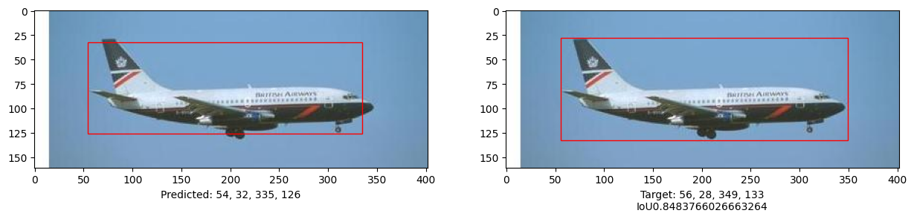
  </Notebook.FancyOutput>

  <Notebook.FancyOutput prompt="" type="output">
    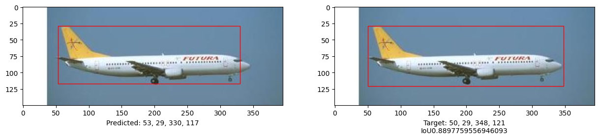
  </Notebook.FancyOutput>

  <Notebook.FancyOutput prompt="" type="output">
    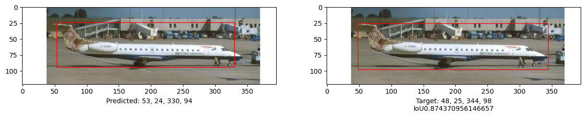
  </Notebook.FancyOutput>

  <Notebook.FancyOutput prompt="" type="output">
    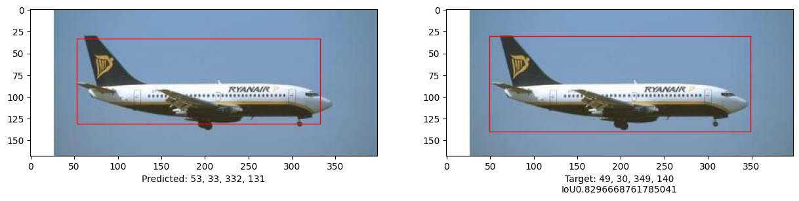
  </Notebook.FancyOutput>

  <Notebook.FancyOutput prompt="" type="output">
    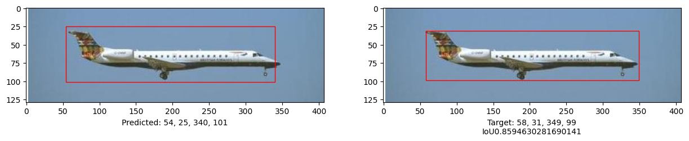
  </Notebook.FancyOutput>

  <Notebook.FancyOutput prompt="" type="output">
    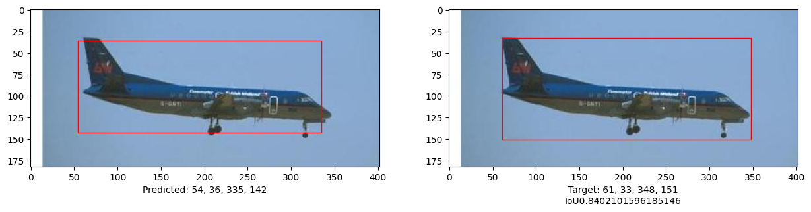
  </Notebook.FancyOutput>

  <Notebook.FancyOutput prompt="" type="output">
    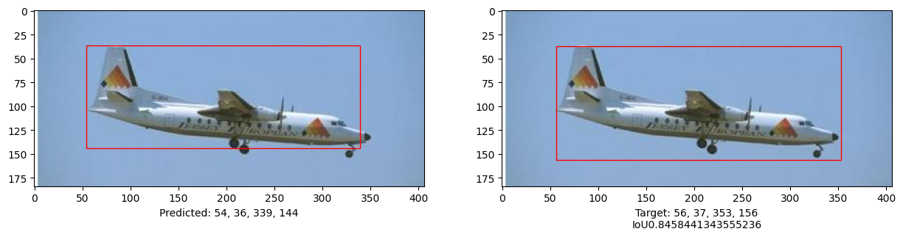
  </Notebook.FancyOutput>

  <Notebook.FancyOutput prompt="" type="output">
    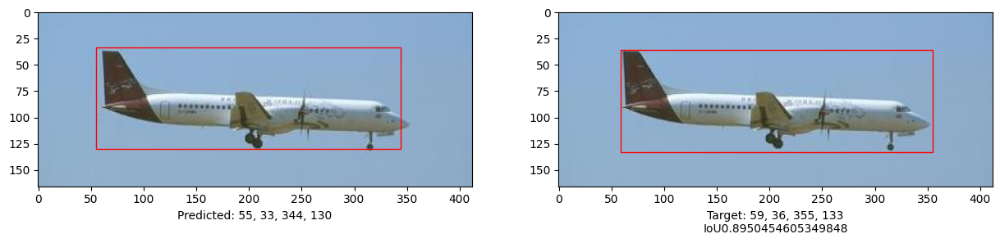
  </Notebook.FancyOutput>

  <Notebook.FancyOutput prompt="" type="output">
    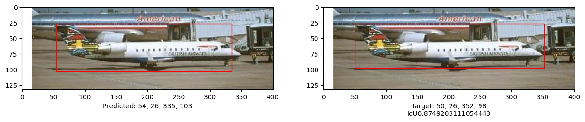
  </Notebook.FancyOutput>

  <Notebook.FancyOutput prompt="" type="output">
    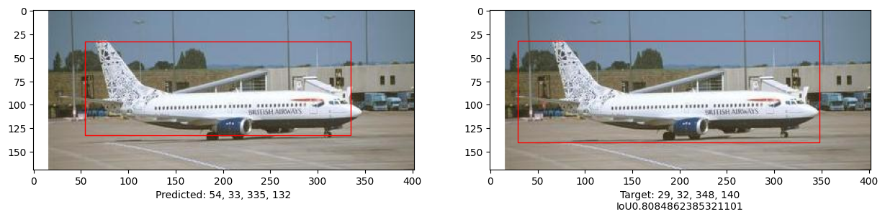
  </Notebook.FancyOutput>
</Notebook.Cell>

:target{#联邦模式}

## 联邦模式

:target{#id12}

### 小节引言

通过单机模式，我们已经学会到，如何在单机模式下使用 Vision Transformers 实现目标检测，本节我们将看到如何将单机模型如何快速和低成本地迁移到 SecretFlow 隐语的联邦学习框架之下。

:target{#数据划分}

### 数据划分

首先为了模拟联邦学习多方参与的场景设定，我们先人为进行一下数据集划分。为方便演示，我们对数据按参与方进行均匀划分

:target{#遍历数据集}

#### 遍历数据集

<Notebook.Cell>
  <Notebook.CodeArea prompt="[8]:" stderr={false} type="input">
    ```python
    # Path to images and annotations
    path_images = "./101_ObjectCategories/airplanes/"
    path_annot = "./Annotations/Airplanes_Side_2/"

    # list of paths to images and annotations
    image_paths = [
        f for f in os.listdir(path_images) if os.path.isfile(os.path.join(path_images, f))
    ]
    annot_paths = [
        f for f in os.listdir(path_annot) if os.path.isfile(os.path.join(path_annot, f))
    ]

    image_paths.sort()
    annot_paths.sort()
    ```
  </Notebook.CodeArea>
</Notebook.Cell>

<Notebook.Cell>
  <Notebook.CodeArea prompt="[9]:" stderr={false} type="input">
    ```python
    image_paths[:20]
    ```
  </Notebook.CodeArea>

  <Notebook.CodeArea prompt="[9]:" stderr={false} type="output">
    <pre>
      {"['image_0001.jpg',\n 'image_0002.jpg',\n 'image_0003.jpg',\n 'image_0004.jpg',\n 'image_0005.jpg',\n 'image_0006.jpg',\n 'image_0007.jpg',\n 'image_0008.jpg',\n 'image_0009.jpg',\n 'image_0010.jpg',\n 'image_0011.jpg',\n 'image_0012.jpg',\n 'image_0013.jpg',\n 'image_0014.jpg',\n 'image_0015.jpg',\n 'image_0016.jpg',\n 'image_0017.jpg',\n 'image_0018.jpg',\n 'image_0019.jpg',\n 'image_0020.jpg']\n"}
    </pre>
  </Notebook.CodeArea>
</Notebook.Cell>

<Notebook.Cell>
  <Notebook.CodeArea prompt="[10]:" stderr={false} type="input">
    ```python
    annot_paths[:20]
    ```
  </Notebook.CodeArea>

  <Notebook.CodeArea prompt="[10]:" stderr={false} type="output">
    <pre>
      {"['annotation_0001.mat',\n 'annotation_0002.mat',\n 'annotation_0003.mat',\n 'annotation_0004.mat',\n 'annotation_0005.mat',\n 'annotation_0006.mat',\n 'annotation_0007.mat',\n 'annotation_0008.mat',\n 'annotation_0009.mat',\n 'annotation_0010.mat',\n 'annotation_0011.mat',\n 'annotation_0012.mat',\n 'annotation_0013.mat',\n 'annotation_0014.mat',\n 'annotation_0015.mat',\n 'annotation_0016.mat',\n 'annotation_0017.mat',\n 'annotation_0018.mat',\n 'annotation_0019.mat',\n 'annotation_0020.mat']\n"}
    </pre>
  </Notebook.CodeArea>
</Notebook.Cell>

:target{#给定参与方}

#### 给定参与方

我们假定联邦学习的数据拥有方是 <strong>alice</strong> 和 <strong>bob</strong>

<Notebook.Cell>
  <Notebook.CodeArea prompt="[24]:" stderr={false} type="input">
    ```python
    parties_list = ['alice', 'bob']
    ```
  </Notebook.CodeArea>
</Notebook.Cell>

:target{#建立数据文件夹}

#### 建立数据文件夹

由上述结果，我们可以看到，目标检测的训练数据集主要由两部分组成：图片（images）和对应的标注（annotation），分别位于 <strong>“./101\_ObjectCategories/airplanes/”</strong> 和 <strong>“./Annotations/Airplanes\_Side\_2/”</strong> ；我们的参与方数据文件夹分别为 <strong>“./fl-data/object\_detection/alice/”</strong> 和 <strong>“./fl-data/object\_detection/bob/”</strong>；所以我们分别在参与方数据文件夹下建立 <strong>‘images’</strong> 和 <strong>‘annotation’</strong> 来保存对应的数据。

<Notebook.Cell>
  <Notebook.CodeArea prompt="[25]:" stderr={false} type="input">
    ```python
    parties_path_list = []
    dataset_name = 'object_detection'
    split_dataset_path = os.path.join('.', 'fl-data', dataset_name)
    subset_dir = ['images', 'annotation']
    for party in parties_list:
        for subset in subset_dir:
            party_path = os.path.join('.', 'fl-data', dataset_name, party, subset)
            os.makedirs(party_path, exist_ok=True)
            parties_path_list.append(party_path)
    ```
  </Notebook.CodeArea>
</Notebook.Cell>

<Notebook.Cell>
  <Notebook.CodeArea prompt="[26]:" stderr={false} type="input">
    ```python
    parties_path_list
    ```
  </Notebook.CodeArea>

  <Notebook.CodeArea prompt="[26]:" stderr={false} type="output">
    <pre>
      {"['./fl-data/object_detection/alice/images',\n './fl-data/object_detection/alice/annotation',\n './fl-data/object_detection/bob/images',\n './fl-data/object_detection/bob/annotation']\n"}
    </pre>
  </Notebook.CodeArea>
</Notebook.Cell>

:target{#定义数据划分函数}

#### 定义数据划分函数

<Notebook.Cell>
  <Notebook.CodeArea prompt="[27]:" stderr={false} type="input">
    ```python
    from os.path import join
    import shutil


    def split_dataset(data_dir_path, file_path_list, parties_list, dataset_name, subset):
        parties_num = len(parties_list)
        index = 0
        for item_name in file_path_list:
            item_path = join(data_dir_path, item_name)
            target_dir_path = join(
                '.', 'fl-data', dataset_name, parties_list[index % parties_num], subset
            )
            shutil.copy(item_path, target_dir_path)
            # if you want to watch the process of copy files,  uncomment the next line"
            # print(f'copy {item_path} -->{target_dir_path}')
            index += 1
    ```
  </Notebook.CodeArea>
</Notebook.Cell>

:target{#进行图像数据集划分}

#### 进行图像数据集划分

<Notebook.Cell>
  <Notebook.CodeArea prompt="[ ]:" stderr={false} type="input">
    ```python
    split_dataset(path_images, image_paths, parties_list, dataset_name, subset='images')
    ```
  </Notebook.CodeArea>
</Notebook.Cell>

:target{#进行标注数据集划分}

#### 进行标注数据集划分

<Notebook.Cell>
  <Notebook.CodeArea prompt="[ ]:" stderr={false} type="input">
    ```python
    split_dataset(path_annot, annot_paths, parties_list, dataset_name, subset='annotation')
    ```
  </Notebook.CodeArea>
</Notebook.Cell>

:target{#封装-DataBuilder}

### 封装 DataBuilder

在迁移过程，对于数据集的预处理方式，联邦学习模式和单机模式是一样的，我们不再重复。为了完成迁移适配过程，我们只需要参考[在 SecretFlow 中使用自定义 DataBuilder（TensorFlow）](https://github.com/secretflow/secretflow/blob/main/docs/tutorial/CustomDataLoaderTF.ipynb) 封装我们自定义 DataBuilder 即可。现在，参考原教程，我们封装对应的DataBuilder，所以我们也不需要额外写很多代码。

<Notebook.Cell>
  <Notebook.CodeArea prompt="[30]:" stderr={false} type="input">
    ```python
    def create_dataset_builder(
        batch_size=32,
    ):
        def dataset_builder(folder_path, stage="train"):
            import math

            import tensorflow as tf

            # get the path of dataset
            path_images = os.path.join(folder_path, 'images/')
            path_annot = os.path.join(folder_path, 'annotation/')
            # path_images = "./101_ObjectCategories/airplanes/"
            # path_annot = "./Annotations/Airplanes_Side_2/"

            # list of paths to images and annotations
            image_paths = [
                f
                for f in os.listdir(path_images)
                if os.path.isfile(os.path.join(path_images, f))
            ]
            annot_paths = [
                f
                for f in os.listdir(path_annot)
                if os.path.isfile(os.path.join(path_annot, f))
            ]

            image_paths.sort()
            annot_paths.sort()

            image_size = 224  # resize input images to this size

            images, targets = [], []

            # loop over the annotations and images, preprocess them and store in lists
            for i in range(0, len(annot_paths)):
                # Access bounding box coordinates
                annot = scipy.io.loadmat(path_annot + annot_paths[i])["box_coord"][0]

                top_left_x, top_left_y = annot[2], annot[0]
                bottom_right_x, bottom_right_y = annot[3], annot[1]

                image = keras.utils.load_img(
                    path_images + image_paths[i],
                )
                (w, h) = image.size[:2]

                # resize train set images
                # if i < int(len(annot_paths) * 0.8):
                # resize image if it is for training dataset
                image = image.resize((image_size, image_size))

                # convert image to array and append to list
                images.append(keras.utils.img_to_array(image))

                # apply relative scaling to bounding boxes as per given image and append to list
                targets.append(
                    (
                        float(top_left_x) / w,
                        float(top_left_y) / h,
                        float(bottom_right_x) / w,
                        float(bottom_right_y) / h,
                    )
                )

            # Convert the list to numpy array, split to train and test dataset
            (x_train), (y_train) = (
                np.asarray(images[: int(len(images) * 0.8)]),
                np.asarray(targets[: int(len(targets) * 0.8)]),
            )
            (x_test), (y_test) = (
                np.asarray(images[int(len(images) * 0.8) :]),
                np.asarray(targets[int(len(targets) * 0.8) :]),
            )

            train_dataset = tf.data.Dataset.from_tensor_slices((x_train, y_train))
            eval_dataset = tf.data.Dataset.from_tensor_slices((x_test, y_test))

            SHUFFLE_BUFFER_SIZE = 1024
            train_dataset = train_dataset.shuffle(SHUFFLE_BUFFER_SIZE).batch(batch_size)
            eval_dataset = eval_dataset.shuffle(SHUFFLE_BUFFER_SIZE).batch(batch_size)

            if stage == "train":
                train_step_per_epoch = math.ceil(x_train.shape[0] / batch_size)
                return train_dataset, train_step_per_epoch
            elif stage == "eval":
                eval_step_per_epoch = math.ceil(x_test.shape[0] / batch_size)
                return eval_dataset, eval_step_per_epoch

        return dataset_builder
    ```
  </Notebook.CodeArea>
</Notebook.Cell>

:target{#隐语环境初始化}

### 隐语环境初始化

<Notebook.Cell>
  <Notebook.CodeArea prompt="[31]:" stderr={false} type="input">
    ```python
    import secretflow as sf

    # Check the version of your SecretFlow
    print('The version of SecretFlow: {}'.format(sf.__version__))

    # In case you have a running secretflow runtime already.
    sf.shutdown()
    sf.init(['alice', 'bob', 'charlie'], address="local", log_to_driver=False)
    alice, bob, charlie = sf.PYU('alice'), sf.PYU('bob'), sf.PYU('charlie')
    ```
  </Notebook.CodeArea>

  <Notebook.CodeArea prompt="" stderr={false} type="output">
    <pre>
      {"The version of SecretFlow: 1.2.0.dev20231009\n"}
    </pre>
  </Notebook.CodeArea>
</Notebook.Cell>

:target{#构建-dataset_builder_dict}

### 构建 dataset\_builder\_dict

<Notebook.Cell>
  <Notebook.CodeArea prompt="[32]:" stderr={false} type="input">
    ```python
    data_builder_dict = {
        alice: create_dataset_builder(
            batch_size=32,
        ),
        bob: create_dataset_builder(
            batch_size=32,
        ),
    }
    ```
  </Notebook.CodeArea>
</Notebook.Cell>

:target{#定义网络结构}

### 定义网络结构

得益于隐语优异的设计，我们只需要将单机模式下定义的网络结构，进行适当的封装即可。具体到本教程，可以看到我们直接参考单机模式下 <strong>run\_experiment</strong>的实现，封装对应的模型即可，同时我们可以继续复用单机模式下定义的 <strong>create\_vit\_object\_detector</strong> 函数，只需要给定对应的参数即可。

<Notebook.Cell>
  <Notebook.CodeArea prompt="[33]:" stderr={false} type="input">
    ```python
    def create_fl_vit_object_detector(
        input_shape,
        patch_size,
        num_patches,
        projection_dim,
        num_heads,
        transformer_units,
        transformer_layers,
        mlp_head_units,
    ):
        def create_model():
            model = create_vit_object_detector(
                input_shape,
                patch_size,
                num_patches,
                projection_dim,
                num_heads,
                transformer_units,
                transformer_layers,
                mlp_head_units,
            )

            optimizer = tfa.optimizers.AdamW(
                learning_rate=learning_rate, weight_decay=weight_decay
            )

            # Compile model.
            model.compile(optimizer=optimizer, loss=keras.losses.MeanSquaredError())

            return model

        return create_model
    ```
  </Notebook.CodeArea>
</Notebook.Cell>

:target{#定义-TensorFlow-后端的-FLModel}

### 定义 TensorFlow 后端的 FLModel

<Notebook.Cell>
  <Notebook.CodeArea prompt="[34]:" stderr={false} type="input">
    ```python
    from secretflow.ml.nn import FLModel
    from secretflow.security.aggregation import SecureAggregator
    ```
  </Notebook.CodeArea>
</Notebook.Cell>

<Notebook.Cell>
  <Notebook.CodeArea prompt="[35]:" stderr={false} type="input">
    ```python
    device_list = [alice, bob]
    aggregator = SecureAggregator(charlie, [alice, bob])

    # prepare model
    image_size = 224
    input_shape = (image_size, image_size, 3)  # input image shape
    learning_rate = 0.001
    weight_decay = 0.0001
    batch_size = 32
    num_epochs = 100
    num_patches = (image_size // patch_size) ** 2
    projection_dim = 64
    num_heads = 4
    # Size of the transformer layers
    transformer_units = [
        projection_dim * 2,
        projection_dim,
    ]
    transformer_layers = 4
    mlp_head_units = [2048, 1024, 512, 64, 32]  # Size of the dense layers


    history = []
    num_patches = (image_size // patch_size) ** 2

    # keras model
    model = create_fl_vit_object_detector(
        input_shape,
        patch_size,
        num_patches,
        projection_dim,
        num_heads,
        transformer_units,
        transformer_layers,
        mlp_head_units,
    )


    fed_model = FLModel(
        device_list=device_list,
        model=model,
        aggregator=aggregator,
        backend="tensorflow",
        strategy="fed_avg_w",
        random_seed=1234,
    )
    ```
  </Notebook.CodeArea>
</Notebook.Cell>

:target{#给出参与方数据集路径}

### 给出参与方数据集路径

<Notebook.Cell>
  <Notebook.CodeArea prompt="[ ]:" stderr={false} type="input">
    ```python
    data = {
        alice: './fl-data/object_detection/alice',
        bob: './fl-data/object_detection/bob',
    }
    ```
  </Notebook.CodeArea>
</Notebook.Cell>

:target{#训练联邦学习模型}

### 训练联邦学习模型

<Notebook.Cell>
  <Notebook.CodeArea prompt="[36]:" stderr={false} type="input">
    ```python
    checkpoint_filepath = "logs/"
    checkpoint_callback = keras.callbacks.ModelCheckpoint(
        checkpoint_filepath,
        monitor="val_loss",
        save_best_only=True,
        save_weights_only=True,
    )

    history = fed_model.fit(
        data,
        None,
        validation_data=data,
        epochs=num_epochs,
        batch_size=batch_size,
        aggregate_freq=2,
        sampler_method="batch",
        random_seed=1234,
        dp_spent_step_freq=1,
        dataset_builder=data_builder_dict,
        callbacks=[
            checkpoint_callback,
            keras.callbacks.EarlyStopping(monitor="val_loss", patience=10),
        ],
    )
    ```
  </Notebook.CodeArea>
</Notebook.Cell>

:target{#可视化训练历史}

### 可视化训练历史

<Notebook.Cell>
  <Notebook.CodeArea prompt="[37]:" stderr={false} type="input">
    ```python
    history.global_history.keys()
    ```
  </Notebook.CodeArea>

  <Notebook.CodeArea prompt="[37]:" stderr={false} type="output">
    <pre>
      {"dict_keys(['loss', 'val_loss'])\n"}
    </pre>
  </Notebook.CodeArea>
</Notebook.Cell>

<Notebook.Cell>
  <Notebook.CodeArea prompt="[38]:" stderr={false} type="input">
    ```python
    from matplotlib import pyplot as plt

    # Draw accuracy values for training & validation
    plt.plot(history.global_history['loss'])
    plt.plot(history.global_history['val_loss'])
    plt.title('FLModel loss')
    plt.ylabel('Loss')
    plt.xlabel('Epoch')
    plt.legend(['Train', 'Valid'], loc='upper left')
    plt.show()
    ```
  </Notebook.CodeArea>

  <Notebook.FancyOutput prompt="" type="output">
    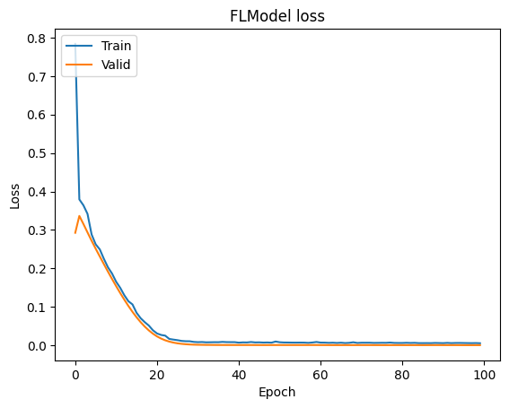
  </Notebook.FancyOutput>
</Notebook.Cell>

至此，我们很好地完成了联邦学习模型的训练。

:target{#小结}

## 小结

通过本教程，您将看到，如何将 Keras 的目标检测模型快速迁移到 SecretFlow 隐语 的联邦学习框架之下，实现目标检测模型的联邦学习。
