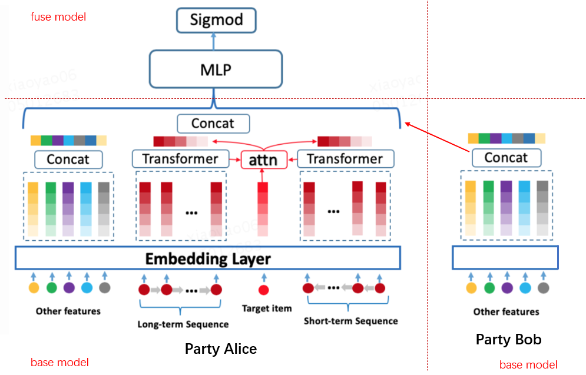

:target{#SplitRec：在隐语中使用拆分-BST-算法（Torch-后端）}

# SplitRec：在隐语中使用拆分 BST 算法（Torch 后端）

阿里搜索推荐团队在 2019 年 arXiv 上发布文章《Behavior Sequence Transformer for E-commerce Recommendation in Alibaba》，提出 BST 模型。BST 利用 Transformer 结构捕捉用户行为序列信息，解决 WDL、DIN 等模型忽略序列信息的问题，因而受到关注。本文将介绍如何在隐语中使用拆分 BST 算法。

:target{#BST-模型}

## BST 模型

BST 模型在 DNN 模型基础上，使用 Transformer Layer 捕捉用户行为序列中的信息，整体结构如下 

其中 Transformer Layer 使用一层 multi-head self-attention 结构，如图右侧所示。

Transformer layer 的输入是序列特征的 Embedding 和位置 Embedding 的加和。

:target{#隐语中的拆分-BST-模型}

## 隐语中的拆分 BST 模型

隐语考虑两方拆分学习场景，两方各持有一些特征，包括序列特征和其他特，一方持有 label 。双方特征经过 base 模型处理后，将 base 模型的输出输入到 fuse 模型进行学习，根据对序列特征的处理不同分为拆分 BST 模型和拆分 BSTPlus 模型。

:target{#拆分-BST-模型}

### 拆分 BST 模型

其中序列特征通过 Transformer Layer 处理，其他特征通过普通的 Embedding 处理，序列特征和其他特征是可选的，模型结构如图所示。

:target{#拆分-BSTPlus-模型}

### 拆分 BSTPlus 模型

上述 BST 模型虽然能够有效捕捉序列信息，但对于同一用户不同商品的预估来说，序列信息都是相同的，并不能区分同一用户行为序列与不同商品的关联性，因此 BSTPlus 模型在 BST 基础上叠加 DIN 中的 attention 思想，对 target item 和 Transformer layer 的输出进行 attention pooling，通过计算 target item 对序列中 item 的注意力来挖掘用户行为序列与 target item 之间的关联信息，结构如下图。由于 target item 存在于 label 方，暂不支持无 label 方有序列特征。

:target{#隐语封装}

## 隐语封装

我们在隐语中提供了对于各种应用的封装。 关于 BST 的封装在 secretflow/ml/nn/applications/sl\_bst\_torch.py，提供了 `BSTBase` `BSTPlusBase` 和 `BSTFuse` 几个类。 下面我们通过一个例子来看一下如何使用隐语封装的 BST 来进行训练。

:target{#环境设置}

## 环境设置

<Notebook.Cell>
  <Notebook.CodeArea prompt="[1]:" stderr={false} type="input">
    ```python
    import secretflow as sf

    # Check the version of your SecretFlow
    print('The version of SecretFlow: {}'.format(sf.__version__))

    # In case you have a running secretflow runtime already.
    sf.shutdown()
    sf.init(['alice', 'bob'], address="local", log_to_driver=False)
    alice, bob = sf.PYU('alice'), sf.PYU('bob')
    ```
  </Notebook.CodeArea>

  <Notebook.CodeArea prompt="" stderr={false} type="output">
    <pre>
      {"The version of SecretFlow: 1.1.0.dev20230926\n"}
    </pre>
  </Notebook.CodeArea>
</Notebook.Cell>

:target{#数据集介绍}

## 数据集介绍

这里将使用最经典的 MovieLens 数据集进行演示。 MovieLens 是一个开放式的推荐系统数据集，包含了电影评分和电影元数据信息。

[数据集官网](https://grouplens.org/datasets/movielens/)

[下载数据集](https://secretflow-data.oss-accelerate.aliyuncs.com/datasets/movielens/ml-1m.zip)

:target{#下载并处理数据}

## 下载并处理数据

<LineBlock>
  我们通过聚合同一用户按时间顺序评分过的电影生成用户行为序列，并对数据进行切分：

  \- alice: user\_id, target\_movie\_id, sequence\_movie\_ids, label

  \- bob: gender, age\_group, occupation
</LineBlock>

<Notebook.Cell>
  <Notebook.CodeArea prompt="[2]:" stderr={false} type="input">
    ```python
    import os
    from pathlib import Path
    import shutil

    data_dir = './test_bst_data'
    dataset_download_dir = data_dir + '/data_download'
    gen_data_path = data_dir + '/data_sl_bst'
    fea_emb_input_size = {}


    def generate_data():
        import numpy as np
        import pandas as pd

        from secretflow.utils.simulation.datasets import _DATASETS, get_dataset, unzip

        global dataset_download_dir
        # download dataset
        if not Path(dataset_download_dir).is_dir():
            filepath = get_dataset(_DATASETS['ml-1m'])
            unzip(filepath, dataset_download_dir)

        dataset_dir = dataset_download_dir + '/ml-1m'
        # read data
        users = pd.read_csv(
            dataset_dir + "/users.dat",
            sep="::",
            names=["user_id", "gender", "age_group", "occupation", "zip_code"],
            engine='python',
        )

        movies = pd.read_csv(
            dataset_dir + "/movies.dat",
            sep="::",
            names=["movie_id", "title", "genres"],
            engine='python',
            encoding="ISO-8859-1",
        )

        ratings = pd.read_csv(
            dataset_dir + "/ratings.dat",
            sep="::",
            names=["user_id", "movie_id", "rating", "unix_timestamp"],
            engine='python',
        )

        users["user_id"] = users["user_id"].apply(lambda x: f"{x}")
        users["age_group"] = users["age_group"].apply(lambda x: f"{x}")
        users["occupation"] = users["occupation"].apply(lambda x: f"{x}")

        movies["movie_id"] = movies["movie_id"].apply(lambda x: f"{x}")
        movies["genres"] = movies["genres"].apply(lambda x: ','.join(x.split('|')))

        ratings["movie_id"] = ratings["movie_id"].apply(lambda x: f"{x}")
        ratings["user_id"] = ratings["user_id"].apply(lambda x: f"{x}")
        ratings["rating"] = ratings["rating"].apply(lambda x: float(x))

        # encode movie_id
        from sklearn.preprocessing import LabelEncoder

        le = LabelEncoder()
        le.fit(movies['movie_id'].unique())
        movies['movie_id'] = (
            le.transform(movies['movie_id']) + 1
        )  # reserve index 0 for padding
        movies['movie_id'] = movies['movie_id'].astype('string')
        ratings["movie_id"] = le.transform(ratings["movie_id"]) + 1
        ratings['movie_id'] = ratings['movie_id'].astype('string')
        fea_emb_input_size['target_id'] = len(movies['movie_id'].unique()) + 1

        # generate users' movie sequence
        ratings_group = ratings.sort_values(by=["unix_timestamp"]).groupby("user_id")

        ratings_data = pd.DataFrame(
            data={
                "user_id": list(ratings_group.groups.keys()),
                "movie_ids": list(ratings_group.movie_id.apply(list)),
                "ratings": list(ratings_group.rating.apply(list)),
                "timestamps": list(ratings_group.unix_timestamp.apply(list)),
            }
        )

        sequence_length = 5
        step_size = 4

        def create_sequences(values, window_size, step_size):
            sequences = []
            start_index = 0
            while True:
                end_index = start_index + window_size
                seq = values[start_index:end_index]
                if len(seq) < window_size:
                    if len(seq) > 1:
                        seq.extend(['0'] * (window_size - len(seq)))
                        sequences.append(seq)
                    break
                sequences.append(seq)
                start_index += step_size
            return sequences

        ratings_data.movie_ids = ratings_data.movie_ids.apply(
            lambda ids: create_sequences(ids, sequence_length, step_size)
        )

        ratings_data.ratings = ratings_data.ratings.apply(
            lambda ids: create_sequences(ids, sequence_length, step_size)
        )
        del ratings_data["timestamps"]

        ratings_data_movies = ratings_data[["user_id", "movie_ids"]].explode(
            "movie_ids", ignore_index=True
        )
        ratings_data_rating = ratings_data[["ratings"]].explode(
            "ratings", ignore_index=True
        )
        ratings_data_transformed = pd.concat(
            [ratings_data_movies, ratings_data_rating], axis=1
        )
        ratings_data_transformed = ratings_data_transformed.join(
            users.set_index("user_id"), on="user_id"
        )
        # last movie in sequence is target movie
        ratings_data_transformed['movie_id'] = ratings_data_transformed.movie_ids.apply(
            lambda x: x[-1] if '0' not in x else x[x.index('0') - 1]
        )

        # remove last movie from seqnuence to generate movie sequence
        ratings_data_transformed.movie_ids = ratings_data_transformed.movie_ids.apply(
            lambda x: ",".join(x[:-1])
            if '0' not in x
            else ",".join(x[: x.index('0') - 1] + x[x.index('0') :])
        )

        # target movie's rating
        ratings_data_transformed['label'] = ratings_data_transformed.ratings.apply(
            lambda x: x[-1] if '0' not in x else x[x.index('0') - 1]
        )

        ratings_data_transformed.ratings = ratings_data_transformed.ratings.apply(
            lambda x: ",".join([str(v) for v in x[:-1]])
        )
        ratings_data_transformed = ratings_data_transformed.join(
            movies.set_index("movie_id"), on="movie_id"
        )

        del (
            ratings_data_transformed["zip_code"],
            ratings_data_transformed["title"],
            ratings_data_transformed["genres"],
            ratings_data_transformed["ratings"],
        )

        ratings_data_transformed.rename(
            columns={"movie_ids": "sequence_movie_ids", "movie_id": "target_movie_id"},
            inplace=True,
        )

        # encoder: str to id
        le = LabelEncoder()
        ratings_data_transformed[
            ['user_id', 'gender', 'age_group', 'occupation']
        ] = ratings_data_transformed[
            ['user_id', 'gender', 'age_group', 'occupation']
        ].apply(
            le.fit_transform
        )
        fea_emb_input_size['user_id'] = len(ratings_data_transformed['user_id'].unique())
        fea_emb_input_size['gender'] = len(ratings_data_transformed['gender'].unique())
        fea_emb_input_size['age_group'] = len(
            ratings_data_transformed['age_group'].unique()
        )
        fea_emb_input_size['occupation'] = len(
            ratings_data_transformed['occupation'].unique()
        )

        # split train/test
        random_selection = np.random.rand(len(ratings_data_transformed.index)) <= 0.85
        train_data = ratings_data_transformed[random_selection]
        test_data = ratings_data_transformed[~random_selection]

        if os.path.exists(gen_data_path):
            shutil.rmtree(gen_data_path)
        os.mkdir(gen_data_path)

        train_data.to_csv(
            gen_data_path + "/train_data.csv", index=False, sep="|", encoding='utf-8'
        )
        test_data.to_csv(
            gen_data_path + "/test_data.csv", index=False, sep="|", encoding='utf-8'
        )

        train_data_alice = train_data[
            ["user_id", "sequence_movie_ids", "target_movie_id", "label"]
        ]
        train_data_bob = train_data[
            [
                "gender",
                "age_group",
                "occupation",
            ]
        ]

        test_data_alice = test_data[
            ["user_id", "sequence_movie_ids", "target_movie_id", "label"]
        ]
        test_data_bob = test_data[
            [
                "gender",
                "age_group",
                "occupation",
            ]
        ]

        train_data_alice.to_csv(
            gen_data_path + "/train_data_alice.csv", index=False, sep="|", encoding='utf-8'
        )
        train_data_bob.to_csv(
            gen_data_path + "/train_data_bob.csv", index=False, sep="|", encoding='utf-8'
        )

        test_data_alice.to_csv(
            gen_data_path + "/test_data_alice.csv", index=False, sep="|", encoding='utf-8'
        )
        test_data_bob.to_csv(
            gen_data_path + "/test_data_bob.csv", index=False, sep="|", encoding='utf-8'
        )


    generate_data()
    ```
  </Notebook.CodeArea>
</Notebook.Cell>

<Notebook.Cell>
  <Notebook.CodeArea prompt="[3]:" stderr={false} type="input">
    ```python
    ! head ./test_bst_data/data_sl_bst/train_data_alice.csv
    ```
  </Notebook.CodeArea>

  <Notebook.CodeArea prompt="" stderr={false} type="output">
    <pre>
      {"user_id|sequence_movie_ids|target_movie_id|label\n0|2374,768,296,28|1435|3.0\n0|1435,876,2620,228|1950|5.0\n0|1950,1723,3580,213|3796|4.0\n0|3796,3460,1825,1014|1089|5.0\n0|1015,34,1078,539|107|4.0\n0|107,3791,314,1941|269|4.0\n0|269,1903,3517,2076|3375|4.0\n0|3375,2295,1935,35|1414|3.0\n0|1414,216,3444,1498|582|4.0\n"}
    </pre>
  </Notebook.CodeArea>
</Notebook.Cell>

<Notebook.Cell>
  <Notebook.CodeArea prompt="[4]:" stderr={false} type="input">
    ```python
    ! head ./test_bst_data/data_sl_bst/train_data_bob.csv
    ```
  </Notebook.CodeArea>

  <Notebook.CodeArea prompt="" stderr={false} type="output">
    <pre>
      {"gender|age_group|occupation\n0|0|2\n0|0|2\n0|0|2\n0|0|2\n0|0|2\n0|0|2\n0|0|2\n0|0|2\n0|0|2\n"}
    </pre>
  </Notebook.CodeArea>
</Notebook.Cell>

到这里，我们以及产出训练测试用的数据文件。

:target{#构造-dataset_builder-处理数据}

## 构造 dataset\_builder 处理数据

这里对特征进行 ID 化处理，rating > 3 作为正样本，否则作为负样本

<Notebook.Cell>
  <Notebook.CodeArea prompt="[5]:" stderr={false} type="input">
    ```python
    import torch
    from torch.utils.data import DataLoader, Dataset


    # transform DataFrame to Dataset
    class AliceDataset(Dataset):
        def __init__(self, df, label_df, vocab_dir):
            self.df = df
            self.label_df = label_df

        def __getitem__(self, index):
            user_id = torch.tensor([int(self.df["user_id"].iloc[index])])
            seq_ids = torch.tensor(
                [int(sid) for sid in self.df["sequence_movie_ids"].iloc[index].split(',')]
            )
            target_id = torch.tensor([int(self.df["target_movie_id"].iloc[index])])

            label = 1 if self.label_df["label"].iloc[index] > 3 else 0

            return (user_id, target_id, seq_ids), label

        def __len__(self):
            return len(self.label_df)


    class BobDataset(Dataset):
        def __init__(self, df, vocab_dir):
            self.df = df

        def __getitem__(self, index):
            gender = torch.tensor([self.df["gender"].iloc[index]])
            age = torch.tensor([self.df["age_group"].iloc[index]])
            occupation = torch.tensor([self.df["occupation"].iloc[index]])

            return (
                gender,
                age,
                occupation,
            )

        def __len__(self):
            return len(self.df)


    def create_dataset_builder_alice(batch_size=32):
        def dataset_builder(x):
            data_set = AliceDataset(x[0], x[1], gen_data_path)
            dataloader = DataLoader(
                dataset=data_set,
                batch_size=batch_size,
            )
            return dataloader

        return dataset_builder


    def create_dataset_builder_bob(batch_size=32):
        def dataset_builder(x):
            data_set = BobDataset(x[0], gen_data_path)
            dataloader = DataLoader(
                dataset=data_set,
                batch_size=batch_size,
            )
            return dataloader

        return dataset_builder


    batch_size = 128
    dataset_buidler_dict = {
        alice: create_dataset_builder_alice(batch_size=batch_size),
        bob: create_dataset_builder_bob(
            batch_size=batch_size,
        ),
    }
    ```
  </Notebook.CodeArea>
</Notebook.Cell>

:target{#定义模型结构}

## 定义模型结构

通过 mode 指定 base 模型结构 - mode=‘ori’: BSTBase - mode=‘plus’: BSTPlusBase

<Notebook.Cell>
  <Notebook.CodeArea prompt="[6]:" stderr={false} type="input">
    ```python
    from secretflow.ml.nn.applications.sl_bst_torch import BSTBase, BSTBasePlus, BSTfuse


    def create_base_model_alice(mode="ori"):
        def create_model():
            fea_emb_size = {
                "user_id": [fea_emb_input_size["user_id"], 8],
                "target_id": [fea_emb_input_size["target_id"], 9],
            }

            fea_list = ["user_id", "target_id", "sequence_movie_ids"]

            if mode == "ori":
                model = BSTBase(
                    fea_list=fea_list,
                    fea_emb_dim=fea_emb_size,
                    sequence_fea=["sequence_movie_ids"],
                    target_item_fea="target_id",
                    seq_len={"sequence_movie_ids": 4},
                    padding_idx=0,
                )
            else:
                model = BSTBasePlus(
                    fea_list=fea_list,
                    fea_emb_dim=fea_emb_size,
                    sequence_fea=["sequence_movie_ids"],
                    target_item_fea="target_id",
                    seq_len={"sequence_movie_ids": 4},
                    padding_idx=0,
                )

            return model

        return create_model


    def create_base_model_bob():
        def create_model():
            fea_list = ["gender", "age_group", "occupation"]
            fea_emb_size = {}
            for key in fea_list:
                fea_emb_size[key] = [fea_emb_input_size[key], 8]

            model = BSTBase(
                fea_list=fea_list,
                fea_emb_dim=fea_emb_size,
                sequence_fea=[],
                target_item_fea=None,
                seq_len=None,
            )

            return model

        return create_model


    def create_fuse_model(mode="ori"):
        def create_model():
            if mode == 'ori':
                model = BSTfuse(dnn_units_size=[77, 64])
            else:
                model = BSTfuse(dnn_units_size=[50, 64])
            return model

        return create_model
    ```
  </Notebook.CodeArea>
</Notebook.Cell>

:target{#定义-SL-Model}

## 定义 SL Model

<Notebook.Cell>
  <Notebook.CodeArea prompt="[7]:" stderr={false} type="input">
    ```python
    from torch import nn, optim
    from torchmetrics import AUROC, Accuracy, Precision
    from secretflow.ml.nn.fl.utils import metric_wrapper, optim_wrapper
    from secretflow.ml.nn.utils import TorchModel
    from secretflow.ml.nn import SLModel


    loss_fn = nn.CrossEntropyLoss
    optim_fn = optim_wrapper(optim.Adam, lr=1e-2)

    mode = 'plus'
    base_model_alice = TorchModel(
        model_fn=create_base_model_alice(mode),
        loss_fn=loss_fn,
        optim_fn=optim_fn,
        metrics=[
            metric_wrapper(Accuracy, task="multiclass", num_classes=2, average='micro'),
            metric_wrapper(Precision, task="multiclass", num_classes=2, average='micro'),
            metric_wrapper(AUROC, task="binary"),
        ],
    )

    base_model_bob = TorchModel(
        model_fn=create_base_model_bob(),
        loss_fn=loss_fn,
        optim_fn=optim_fn,
        metrics=[
            metric_wrapper(Accuracy, task="multiclass", num_classes=2, average='micro'),
            metric_wrapper(Precision, task="multiclass", num_classes=2, average='micro'),
            metric_wrapper(AUROC, task="binary"),
        ],
    )

    fuse_model = TorchModel(
        model_fn=create_fuse_model(mode),
        loss_fn=loss_fn,
        optim_fn=optim_fn,
        metrics=[
            metric_wrapper(Accuracy, task="multiclass", num_classes=2, average='micro'),
            metric_wrapper(Precision, task="multiclass", num_classes=2, average='micro'),
            metric_wrapper(AUROC, task="multiclass", num_classes=2),
        ],
    )

    base_model_dict = {
        alice: base_model_alice,
        bob: base_model_bob,
    }

    sl_model = SLModel(
        base_model_dict=base_model_dict,
        device_y=alice,
        model_fuse=fuse_model,
        random_seed=1234,
        backend='torch',
    )
    ```
  </Notebook.CodeArea>
</Notebook.Cell>

:target{#开始训练}

## 开始训练

<Notebook.Cell>
  <Notebook.CodeArea prompt="[8]:" stderr={false} type="input">
    ```python
    from secretflow.data.vertical import read_csv


    vdf = read_csv(
        {
            alice: gen_data_path + '/train_data_alice.csv',
            bob: gen_data_path + '/train_data_bob.csv',
        },
        delimiter='|',
    )
    label = vdf["label"]
    data = vdf.drop(columns=["label"])

    epoch = 1

    history = sl_model.fit(
        data,
        label,
        validation_data=(data, label),
        epochs=epoch,
        batch_size=batch_size,
        shuffle=False,
        random_seed=1234,
        dataset_builder=dataset_buidler_dict,
    )
    print('history: ', history)
    ```
  </Notebook.CodeArea>

  <Notebook.CodeArea prompt="" stderr={false} type="output">
    <pre>
      {"history:  {'train_loss': [array(0.6442506, dtype=float32)], 'train_MulticlassAccuracy': [tensor(0.6493)], 'train_MulticlassPrecision': [tensor(0.6493)], 'train_MulticlassAUROC': [tensor(0.6861)], 'val_val_loss': [array(0.63952535, dtype=float32)], 'val_MulticlassAccuracy': [tensor(0.6840)], 'val_MulticlassPrecision': [tensor(0.6840)], 'val_MulticlassAUROC': [tensor(0.7344)]}\n"}
    </pre>
  </Notebook.CodeArea>
</Notebook.Cell>

:target{#总结}

## 总结

本文通过 movieLens 数据集上的推荐任务来演示了如何通过隐语来训练拆分 BST 模型，您需要 1. 下载并处理数据集； 2. 构造 dataset\_builder 处理数据；3. 定义模型结构，调用 `BSTBase`， `BSTPlusBase` 和 `BSTFuse` 定义行模结构； 4. 使用 SLModel 进行训练，预测，评估即可。

您可以在自己的数据集上进行尝试，如有任何问题，可以在 github 上进行讨论。
