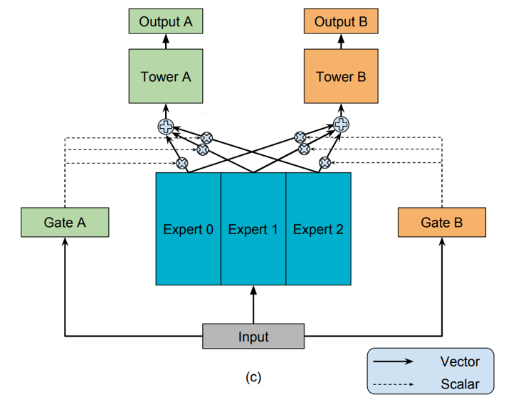
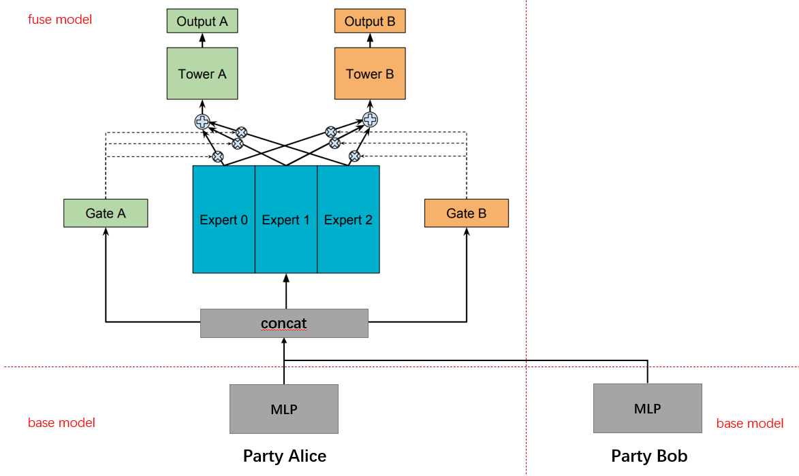

:target{#SplitRec：在隐语中使用拆分-MMoe-算法（Tensorflow-后端）}

# SplitRec：在隐语中使用拆分 MMoe 算法（Tensorflow 后端）

多任务学习的目的是希望通过学习不同任务的联系和差异，提高每个任务的学习效率和质量。

MMoe 是谷歌在 KDD 2018[《Modeling Task Relationships in Multi-task Learning with Multi-gate Mixture-of-Experts》](https://dl.acm.org/doi/pdf/10.1145/3219819.3220007)提出的经典多任务模型。本文将介绍如何在隐语中使用拆分 MMoe 算法。

:target{#MMoe-模型}

## MMoe 模型

多任务学习的难点在于任务之间相关度不高的情况下各任务的学习容易相互干扰，导致模型效果不佳。单个模型往往善于学习某一部分目标，而在其他目标的学习上表现不佳， MMoe 是单一全局模型和多个局部模型的这种，可以很好地解决这个问题。

MMoe 由多个专家网络 Expert 和门控网络 Gate 组成，每个专家网络由门控网络控制对各个任务的贡献，同时么门控网络的控制使得各专家网络学习数据中不同领域的信息，而共享的专家网络可以有效减少模型参数，具体模型结构如下



假设训练任务数为 K 的 MMoe 模型，Expert 数为 n，其中第 k 个任务的计算公式如下：

<Math>
  $$
  y_k=h_k(\sum{n \atop i=1}g_i^k(x)f_i(x))


  $$
</Math>

对于任务 k 来说，各个 Expert 计算输出 <InlineMath>$f_i(x)$</InlineMath>，<InlineMath>$g_i^k(x),i=1,2,...,n$</InlineMath> 表示各个 Expert 被选择的概率，将各个 Expert 的输出加权求和，输出给 Tower k 进行学习。

:target{#隐语中的-MMoe}

## 隐语中的 MMoe

隐语中的 MMoe 考虑多任务目标在同一方的情况，双方特征经过 base 模型计算后，将 base 模型的输出输入到 fuse 模型进行多任务学习。具体模型结构如下

:target{#隐语封装}

## 隐语封装

我们在隐语中提供了对于各种应用的封装。 关于 MMoe 的封装在 secretflow/ml/nn/applications/sl\_mmoe\_tf.py，提供了 `MMoeBase` 和 `MMoeFuse` 两个类。 下面我们通过一个例子来看一下如何使用隐语封装的拆分 MMoe 来进行训练。

:target{#环境设置}

## 环境设置

<Notebook.Cell>
  <Notebook.CodeArea prompt="[1]:" stderr={false} type="input">
    ```python
    import secretflow as sf

    # Check the version of your SecretFlow
    print('The version of SecretFlow: {}'.format(sf.__version__))

    # In case you have a running secretflow runtime already.
    sf.shutdown()
    sf.init(['alice', 'bob', 'charlie'], address="local", log_to_driver=False)
    alice, bob, charlie = sf.PYU('alice'), sf.PYU('bob'), sf.PYU('charlie')
    ```
  </Notebook.CodeArea>

  <Notebook.CodeArea prompt="" stderr={false} type="output">
    <pre>
      {"The version of SecretFlow: 1.1.0.dev20230926\n"}
    </pre>
  </Notebook.CodeArea>
</Notebook.Cell>

:target{#数据集介绍}

## 数据集介绍

这里我们使用来自 UCI 的 Census Income 数据集，Census Income 包含 15 个人口普查特征，这里我们用其中 13 个特征预测收入情况和婚姻状态。

[数据集官网](https://archive.ics.uci.edu/dataset/20/census+income)

[数据集下载](https://archive.ics.uci.edu/static/public/20/census+income.zip)

这里我们对数据进行纵向切分

Alice

- workclass
- fnlwgt
- education
- education\_num
- relationship
- race
- capital\_gain
- capital\_loss
- hours\_per\_week
- income\_50k (label\_1)
- marital\_status (label\_2)

Bob

- age
- sex
- occupation
- native\_country

:target{#下载并处理数据}

## 下载并处理数据

下载数据

<Notebook.Cell>
  <Notebook.CodeArea prompt="[2]:" stderr={false} type="input">
    ```python
    !mkdir data_download
    !wget https://archive.ics.uci.edu/static/public/20/census+income.zip
    !unzip -d data_download census+income.zip
    ```
  </Notebook.CodeArea>

  <Notebook.CodeArea prompt="" stderr={false} type="output">
    <pre>
      {"--2023-09-26 19:48:41--  https://archive.ics.uci.edu/static/public/20/census+income.zip\nResolving archive.ics.uci.edu (archive.ics.uci.edu)... 128.195.10.252\nConnecting to archive.ics.uci.edu (archive.ics.uci.edu)|128.195.10.252|:443... connected.\nHTTP request sent, awaiting response... 200 OK\nLength: unspecified\nSaving to: ‘census+income.zip’\n\ncensus+income.zip       [            <=>     ] 650.11K  14.3KB/s    in 57s\n\n2023-09-26 19:49:40 (11.4 KB/s) - ‘census+income.zip’ saved [665715]\n\nArchive:  census+income.zip\n  inflating: data_download/adult.data\n  inflating: data_download/adult.names\n  inflating: data_download/adult.test\n  inflating: data_download/Index\n  inflating: data_download/old.adult.names\n"}
    </pre>
  </Notebook.CodeArea>
</Notebook.Cell>

<Notebook.Cell>
  <Notebook.CodeArea prompt="[3]:" stderr={false} type="input">
    ```python
    !ls data_download
    ```
  </Notebook.CodeArea>

  <Notebook.CodeArea prompt="" stderr={false} type="output">
    <pre>
      {"adult.data  adult.names  adult.test  Index  old.adult.names\n"}
    </pre>
  </Notebook.CodeArea>
</Notebook.Cell>

处理数据，这里对数值类特征进行离散化处理，并把两个 label 映射到二分类。

<Notebook.Cell>
  <Notebook.CodeArea prompt="[4]:" stderr={false} type="input">
    ```python
    gen_data_path = './data_download/test_mmoe_data_tf'


    def data_prepare():
        import pandas as pd
        import os
        import shutil

        column_names = [
            'age',
            'workclass',
            'fnlwgt',
            'education',
            'education_num',
            'marital_status',
            'occupation',
            'relationship',
            'race',
            'sex',
            'capital_gain',
            'capital_loss',
            'hours_per_week',
            'native_country',
            'income_50k',
        ]

        train_df = pd.read_csv(
            './data_download/adult.data',
            delimiter=',',
            header=None,
            index_col=None,
            names=column_names,
        )

        label_columns = ['income_50k', 'marital_status']

        # continues feature to discrete feature
        train_df['age'] = (train_df['age'] / 10).astype(int).astype('string')
        train_df['fnlwgt'] = (train_df['fnlwgt'] / 10000).astype(int).astype('string')
        train_df['education_num'] = train_df['education_num'].astype('string')
        train_df['capital_gain'] = (
            (train_df['capital_gain'] / 1000).astype(int).astype('string')
        )
        train_df['capital_loss'] = (
            (train_df['capital_loss'] / 100).astype(int).astype('string')
        )
        train_df['hours_per_week'] = (
            (train_df['hours_per_week'] / 5).astype(int).astype('string')
        )

        # label
        train_df['income_50k'] = (train_df['income_50k'] == ' >50K').astype(int)
        train_df['marital_status'] = (
            train_df['marital_status'] == ' Never-married'
        ).astype(int)

        if os.path.exists(gen_data_path):
            shutil.rmtree(gen_data_path)
        os.mkdir(gen_data_path)
        os.mkdir(gen_data_path + '/vocabulary')

        train_df.to_csv(
            gen_data_path + "/train_data.csv", index=False, sep="|", encoding='utf-8'
        )

        train_data_alice = train_df[
            [
                'workclass',
                'fnlwgt',
                'education',
                'education_num',
                'relationship',
                'race',
                'capital_gain',
                'capital_loss',
                'hours_per_week',
                'income_50k',
                'marital_status',
            ]
        ]

        train_data_bob = train_df[
            [
                'age',
                'sex',
                'occupation',
                'native_country',
            ]
        ]

        train_data_alice.to_csv(
            gen_data_path + "/train_data_alice.csv", index=False, sep="|", encoding='utf-8'
        )
        train_data_bob.to_csv(
            gen_data_path + "/train_data_bob.csv", index=False, sep="|", encoding='utf-8'
        )

        for fea in column_names:
            if fea not in label_columns:
                with open(gen_data_path + '/vocabulary/' + fea, 'w') as f:
                    f.write('\n'.join(list(train_df[fea].unique())))


    data_prepare()
    ```
  </Notebook.CodeArea>
</Notebook.Cell>

到此为止我们已经完成了数据的处理和拆分，产出了 Alice Bob 两方的数据文件。

<Notebook.Cell>
  <Notebook.CodeArea prompt="[5]:" stderr={false} type="input">
    ```python
    !head data_download/test_mmoe_data_tf/train_data_alice.csv
    ```
  </Notebook.CodeArea>

  <Notebook.CodeArea prompt="" stderr={false} type="output">
    <pre>
      {"workclass|fnlwgt|education|education_num|relationship|race|capital_gain|capital_loss|hours_per_week|income_50k|marital_status\n State-gov|7| Bachelors|13| Not-in-family| White|2|0|8|0|1\n Self-emp-not-inc|8| Bachelors|13| Husband| White|0|0|2|0|0\n Private|21| HS-grad|9| Not-in-family| White|0|0|8|0|0\n Private|23| 11th|7| Husband| Black|0|0|8|0|0\n Private|33| Bachelors|13| Wife| Black|0|0|8|0|0\n Private|28| Masters|14| Wife| White|0|0|8|0|0\n Private|16| 9th|5| Not-in-family| Black|0|0|3|0|0\n Self-emp-not-inc|20| HS-grad|9| Husband| White|0|0|9|1|0\n Private|4| Masters|14| Not-in-family| White|14|0|10|1|1\n"}
    </pre>
  </Notebook.CodeArea>
</Notebook.Cell>

<Notebook.Cell>
  <Notebook.CodeArea prompt="[6]:" stderr={false} type="input">
    ```python
    !head data_download/test_mmoe_data_tf/train_data_bob.csv
    ```
  </Notebook.CodeArea>

  <Notebook.CodeArea prompt="" stderr={false} type="output">
    <pre>
      {"age|sex|occupation|native_country\n3| Male| Adm-clerical| United-States\n5| Male| Exec-managerial| United-States\n3| Male| Handlers-cleaners| United-States\n5| Male| Handlers-cleaners| United-States\n2| Female| Prof-specialty| Cuba\n3| Female| Exec-managerial| United-States\n4| Female| Other-service| Jamaica\n5| Male| Exec-managerial| United-States\n3| Female| Prof-specialty| United-States\n"}
    </pre>
  </Notebook.CodeArea>
</Notebook.Cell>

:target{#构造-data_builder-读数据}

## 构造 data\_builder 读数据

<Notebook.Cell>
  <Notebook.CodeArea prompt="[7]:" stderr={false} type="input">
    ```python
    def create_dataset_builder_bob(
        batch_size=128,
        repeat_count=5,
    ):
        def dataset_builder(x):
            import pandas as pd
            import tensorflow as tf

            x = [dict(t) if isinstance(t, pd.DataFrame) else t for t in x]
            x = x[0] if len(x) == 1 else tuple(x)
            data_set = (
                tf.data.Dataset.from_tensor_slices(x).batch(batch_size).repeat(repeat_count)
            )

            return data_set

        return dataset_builder


    def create_dataset_builder_alice(
        batch_size=128,
        repeat_count=5,
    ):
        def _parse_alice(row_sample, label):
            import tensorflow as tf

            y_1 = label["income_50k"]
            y_2 = label["marital_status"]
            return row_sample, (y_1, y_2)

        def dataset_builder(x):
            import pandas as pd
            import tensorflow as tf

            x = [dict(t) if isinstance(t, pd.DataFrame) else t for t in x]
            x = x[0] if len(x) == 1 else tuple(x)
            data_set = (
                tf.data.Dataset.from_tensor_slices(x).batch(batch_size).repeat(repeat_count)
            )

            data_set = data_set.map(_parse_alice)

            return data_set

        return dataset_builder


    bs = 128
    epoch = 1

    data_builder_dict = {
        alice: create_dataset_builder_alice(
            batch_size=bs,
            repeat_count=epoch,
        ),
        bob: create_dataset_builder_bob(
            batch_size=bs,
            repeat_count=epoch,
        ),
    }
    ```
  </Notebook.CodeArea>
</Notebook.Cell>

:target{#定义模型结构}

## 定义模型结构

<Notebook.Cell>
  <Notebook.CodeArea prompt="[8]:" stderr={false} type="input">
    ```python
    import tensorflow as tf
    from secretflow.ml.nn.applications.sl_mmoe_tf import MMoEBase, MMoEFuse


    def create_base_model_alice():
        # Create model
        def create_model():
            fea_list = [
                'workclass',
                'fnlwgt',
                'education',
                'education_num',
                'relationship',
                'race',
                'capital_gain',
                'capital_loss',
                'hours_per_week',
            ]
            vocab_dict = {}
            for fea in fea_list:
                with open(gen_data_path + '/vocabulary/' + fea) as f:
                    vocab_dict[fea] = [line.strip() for line in f.readlines()]

            def preprocess():
                inputs = {
                    fea: tf.keras.Input(shape=(1,), dtype=tf.string) for fea in fea_list
                }
                outputs = {
                    fea: tf.keras.layers.StringLookup(
                        vocabulary=vocab_dict[fea], output_mode="one_hot"
                    )(inputs[fea])
                    for fea in fea_list
                }

                return tf.keras.Model(inputs=inputs, outputs=outputs)

            preprocess_layer = preprocess()
            model = MMoEBase(
                dnn_units_size=[32],
                preprocess_layer=preprocess_layer,
                embedding_dim=9,
            )
            model.compile(
                loss=tf.keras.losses.binary_crossentropy,
                optimizer=tf.keras.optimizers.Adam(),
                metrics=[
                    tf.keras.metrics.AUC(),
                    tf.keras.metrics.Precision(),
                    tf.keras.metrics.Recall(),
                ],
            )
            return model  # need wrap

        return create_model


    def create_base_model_bob():
        # Create model
        def create_model():
            fea_list = [
                'age',
                'sex',
                'occupation',
                'native_country',
            ]
            vocab_dict = {}
            for fea in fea_list:
                with open(gen_data_path + '/vocabulary/' + fea) as f:
                    vocab_dict[fea] = [line.strip() for line in f.readlines()]

            def preprocess():
                inputs = {
                    fea: tf.keras.Input(shape=(1,), dtype=tf.string) for fea in fea_list
                }
                outputs = {
                    fea: tf.keras.layers.StringLookup(
                        vocabulary=vocab_dict[fea], output_mode="one_hot"
                    )(inputs[fea])
                    for fea in fea_list
                }

                return tf.keras.Model(inputs=inputs, outputs=outputs)

            preprocess_layer = preprocess()

            model = MMoEBase(
                dnn_units_size=[20],
                preprocess_layer=preprocess_layer,
            )
            model.compile(
                loss=tf.keras.losses.binary_crossentropy,
                optimizer=tf.keras.optimizers.Adam(),
                metrics=[
                    tf.keras.metrics.AUC(),
                    tf.keras.metrics.Precision(),
                    tf.keras.metrics.Recall(),
                ],
            )
            return model  # need wrap

        return create_model


    def create_fuse_model():
        # Create model
        def create_model():
            model = MMoEFuse(
                num_experts=3,
                expert_units_size=[32, 16],
                expert_activation="relu",
                num_tasks=2,
                gate_units_size=[],
                gate_activation="",
                tower_units_size=[12],
                tower_activation="relu",
                output_activation=["sigmoid", "sigmoid"],
            )
            model.compile(
                loss={"output_1": "binary_crossentropy", "output_2": "binary_crossentropy"},
                loss_weights=[1.0, 1.0],
                optimizer=tf.keras.optimizers.Adam(),
                metrics={
                    "output_1": [
                        tf.keras.metrics.AUC(),
                        tf.keras.metrics.Precision(),
                        tf.keras.metrics.Recall(),
                    ],
                    "output_2": [
                        tf.keras.metrics.AUC(),
                        tf.keras.metrics.Precision(),
                        tf.keras.metrics.Recall(),
                    ],
                },
            )
            return model

        return create_model


    model_base_alice = create_base_model_alice()
    model_base_bob = create_base_model_bob()
    base_model_dict = {
        alice: model_base_alice,
        bob: model_base_bob,
    }
    model_fuse = create_fuse_model()
    ```
  </Notebook.CodeArea>
</Notebook.Cell>

:target{#定义-SL-Model}

## 定义 SL Model

<Notebook.Cell>
  <Notebook.CodeArea prompt="[9]:" stderr={false} type="input">
    ```python
    from secretflow.ml.nn import SLModel

    device_y = alice

    sl_model = SLModel(
        base_model_dict=base_model_dict,
        device_y=device_y,
        model_fuse=model_fuse,
    )
    ```
  </Notebook.CodeArea>
</Notebook.Cell>

:target{#开始训练}

## 开始训练

<Notebook.Cell>
  <Notebook.CodeArea prompt="[10]:" stderr={false} type="input">
    ```python
    from secretflow.data.vertical import read_csv

    vdf = read_csv(
        {
            alice: gen_data_path + '/train_data_alice.csv',
            bob: gen_data_path + '/train_data_bob.csv',
        },
        delimiter='|',
    )

    int_fea_list = [
        'age',
        'fnlwgt',
        'education_num',
        'capital_gain',
        'capital_loss',
        'hours_per_week',
    ]
    for fea in int_fea_list:
        vdf[fea] = vdf[fea].astype('string')

    label = vdf['income_50k', 'marital_status']
    data = vdf.drop(columns=['income_50k', 'marital_status'])

    device_y = alice

    history = sl_model.fit(
        data,
        label,
        epochs=epoch,
        batch_size=bs,
        random_seed=1234,
        dataset_builder=data_builder_dict,
    )
    print(history)
    ```
  </Notebook.CodeArea>

  <Notebook.CodeArea prompt="" stderr={false} type="output">
    <pre>
      {"{'train_loss': [0.9630533], 'train_output_1_loss': [0.45116714], 'train_output_2_loss': [0.51188624], 'train_output_1_auc_1': [0.7793986], 'train_output_1_precision_1': [0.7068677], 'train_output_1_recall_1': [0.26909834], 'train_output_2_auc_2': [0.7872134], 'train_output_2_precision_2': [0.74010354], 'train_output_2_recall_2': [0.41477114]}\n"}
    </pre>
  </Notebook.CodeArea>
</Notebook.Cell>

:target{#总结}

## 总结

本文通过 MovieLens 数据集上的推荐任务来演示了如何通过隐语来实现 MMoe。

您需要：

1. 下载并拆分数据集；
2. 定义处理数据的 data\_builder；
3. 定义好数据预处理 preprocessing layer，调用 `MMoeBase` 和 `MMoeFuse` 来定义模型结构；
4. 使用 SLModel 进行训练即可。

您可以在自己的数据集上进行尝试，如有任何问题，可以在 github 上进行讨论。
