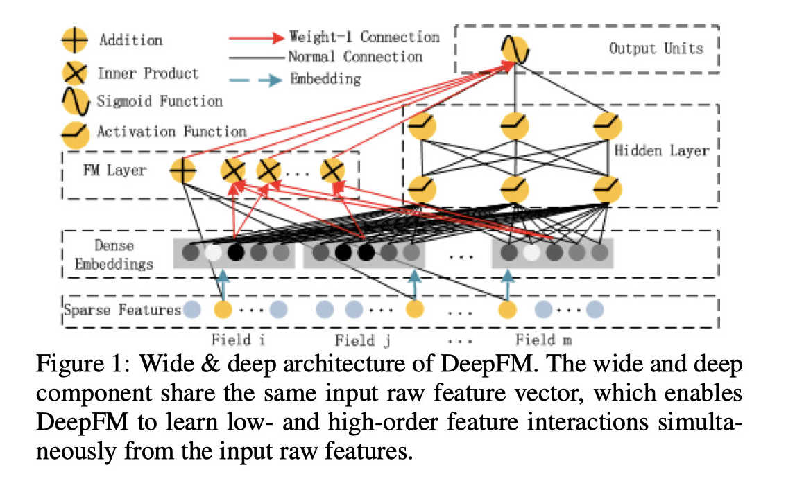
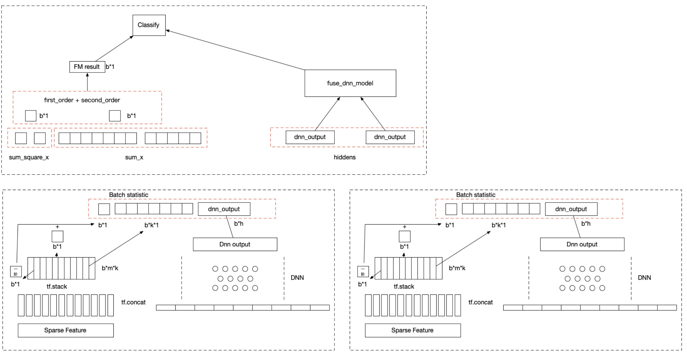

:target{#SplitREC:-Using-DeepFM-Algorithm-in-SecretFlow}

# SplitREC: Using DeepFM Algorithm in SecretFlow

> The following codes are demos only. It’s NOT for production due to system security concerns, please DO NOT use it directly in production.

<Notebook.Cell>
  <Notebook.CodeArea prompt="[1]:" stderr={false} type="input">
    ```python
    %load_ext autoreload
    %autoreload 2
    ```
  </Notebook.CodeArea>
</Notebook.Cell>

SecretFlow framework provides SLModel to meet user’s needs for Vertical Federated Learning. In the vertical scenario, all parties achieve the purpose of training a better model through complementary features and joint training. In actual application scenarios, the recommendation scenario fits well with the vertical federation solution. It has great application prospects. Different data holders have different features and are unwilling to share with each other, but the features are complementary,
such as consumer features, financial features and user portraits, etc. However, recommendation algorithms are often not so directly applicable to split learning. For example, the FM algorithm requires feature crossover. Therefore, we provide a special item in SecretFlow, by encapsulating commonly used recommendation algorithms, to facilitate users to use federated learning for recommendation applications. This article will introduce how to use the DeepFM algorithm in SecretFlow.

:target{#Introduction-to-the-principle-of-DeepFM-splitting}

## Introduction to the principle of DeepFM splitting

The DeepFM algorithm combines the strengths of FM and neural networks, can improve low-dimensional and high-dimensional features at the same time. Compared with the Wide\&Deep model, DeepFM algorithm also eliminates the feature engineering part.



From the overall structure, This model can be divided into two parts, namely the FM part and the Deep part. The input of these two parts is the same, and there is no distinction like the Wide & Deep model. The Deep part is used to train the high-dimensional correlations of these features, while the FM model calculates the two-dimensional cross information between features through the hidden vector v.

:target{#DeepFM-On-SecretFlow}

## DeepFM On SecretFlow

Split Scheme

DeepFM formula derivation

<Math>
  $$
  \hat{y}=w_0 + \sum_{i}^nW_iX_i + \sum_{i=1}^{n-1}\sum_{j=i+1}^nw_{ij}x_ix_j


  $$
</Math>

<Math>
  $$
  \hat{y}=w_0 + \sum_{i}^nW_iX_i + \sum_{i=1}^{n-1}\sum_{j=1}^nv_i^Tv_jx_i,x_j


  $$
</Math>

Mathematical simplification

<Math>
  $$
  \begin{align}
  \sum_{i=1}^n\sum_{j=i+1}^nv_i^Tv_jx_ix_j &= \frac12\sum_{i=1}^n\sum_{j=1}^nv_i^Tv_jx_ix_j -
  \frac12\sum_{i=1}^nv_i^Tv_jx_ix_j  \\
  &= \frac12(\sum_{i=1}^n\sum_{j=1}^n\sum_{k=1}^nv_{i,f}v_{j,f}x_ix_j - \sum_{i=1}^n\sum_{f=1}^nv_{i,f}v_{j,f}x_ix_i) \\
  &= \frac12\sum_{f=1}^k[(\sum_{i=1}^nv_{i,f}x_i)(\sum_{j=1}^nv_{j,f}x_j) - (\sum_{i=1}^nv_{i,f}^2x_i^2)]
  \\
  &= \frac12\sum_{f=1}^k[(\sum_{i=1}^nv_{i,f}x_i)^2 - \sum_{i=1}^nv_{i,f}^2x_i^2] \\
  \end{align}
  $$
</Math>

end up with the formula

<Math>
  $$
  \hat{y} = w_0 + \sum_{i=1}^nw_ix_i + \frac12[\sum{f_1}^k(\sum_{i=1}^nv_{i,f}x_i)^2-\sum_{i=1}^nv_{i,f}^2x_i^2]
  $$
</Math>

:target{#DeepFM-split-version}

## DeepFM split version

It can be seen from the derivation of the above formula that <InlineMath>$V_j$</InlineMath> is eliminated in the calculation of FM

<Math>
  $$
  \hat{y} = w_0 + \sum_{i=1}^nw_ix_i + \frac12[\sum{f_1}^k(\sum_{i=1}^nv_{i,f}x_i)^2-\sum_{i=1}^nv_{i,f}^2x_i^2]
  $$
</Math>

So the problem turns to as long as each party calculates their own <InlineMath>$\sum_{i}^kViX$</InlineMath> and <InlineMath>$\sum_{i}^kV_i^2X^2$</InlineMath>, continue to simplify this formula to get

<LineBlock>
  <br />
</LineBlock>

> <Math>
>   $$
>   \hat{y}=w_0+\sum_{i=1}^nw_ix_i +\frac{1}{2}[\sum_{f=1}^k(\sum_{i=1}^nV_{i,f}x_i)^2 - \sum_{f=1}^k\sum_{i=1}^nV_{i,f}^2{x_i}^2]
>
>
>   $$
> </Math>

<LineBlock>
  Extended to 2 parties, assuming that alice and bob have Na and Nb features respectively, then
</LineBlock>

<Math>
  $$
  \hat{y}=w_{a0}+w_{b0}+\sum_{i=1}^{Na}w_ix_i + \sum_{i=1}^{Nb}w_ix_i +\frac{1}{2}[\sum_{f=1}^k(\sum_{i=1}^{Na}V_{i,f}x_i+\sum_{i=1}^{Nb}V_{i,f}x_i)^2 - (\sum_{f=1}^k\sum_{i=1}^{Na}V_{i,f}^2{x_i}^2+\sum_{f=1}^k\sum_{i=1}^{Nb}V_{i,f}^2{x_i}^2)]
  $$
</Math>

It can be seen from the derivation of the formula that each participant only needs to calculate the first order <InlineMath>$\sum_{i=1}^aV_{i,f}x_i$</InlineMath> and <InlineMath>$\sum_{i=1}^aV_{i,f}^2{x_i}^2$</InlineMath> locally, and then transmit the two parts (1) and (2) to fusenet to complete the lossless fm part calculation

<Math>
  $$
  w_{a0}+\sum_{i=1}^aw_ix_i+\sum_{i=1}^aV_{i,f}^2{x_i}^2 \tag 1


  $$
</Math>

<Math>
  $$
  \sum_{i=1}^aV_{i,f}x_i \tag 2


  $$
</Math>

<LineBlock>
  The dimension of the original V\_vector is `batchsize*Na*k`, and the dimension of Bob is `batchsize*Nb*k`

  The data actually transmitted after derivation:

  \- The dimension of (1) is `batchsize*1`, which will not leak the information of the v matrix

  \- The dimension of (2) is `batchsize*K`, the information on the feature dimension has been eliminated, and only the sum information on the FM vector dimension is retained (usually dim=4)
</LineBlock>

:target{#SecretFlow-encapsulation}

## SecretFlow encapsulation

<LineBlock>
  Our application in SecretFlow provides packaging for various applications. The encapsulation of DeepFM is in secretflow/ml/nn/applications/sl\_deep\_fm.py, which provides `DeepFMBase` and `DeepFMFuse` two modules.

  <strong>DeepFMBase</strong>
</LineBlock>

```python
class DeepFMbase(tf.keras.Model):
    def __init__(
        self,
        dnn_units_size,
        dnn_activation="relu",
        preprocess_layer=None,
        fm_embedding_dim=16,
        **kwargs,
    ):
        """Split learning version of DeepFM
        Args:
            dnn_units_size: list,list of positive integer or empty list, the layer number and units in each layer of DNN
            dnn_activation: activation function of dnn part
            preprocess_layer: The preprocessed layer a keras model, output a dict of preprocessed data
            fm_embedding_dim: fm embedding dim, default to be 16
```

<strong>DeepFMFuse</strong>

```python
class DeepFMfuse(tf.keras.Model):
    def __init__(self, dnn_units_size, dnn_activation="relu", **kwargs):
```

<strong>Let’s take an example to see how to use DeepFM packaged in SecretFlow for training and prediction</strong>

:target{#Environment-settings}

## Environment settings

<Notebook.Cell>
  <Notebook.CodeArea prompt="[2]:" stderr={false} type="input">
    ```python
    import secretflow as sf

    # Check the version of your SecretFlow
    print('The version of SecretFlow: {}'.format(sf.__version__))

    # In case you have a running secretflow runtime already.
    sf.shutdown()
    sf.init(['alice', 'bob', 'charlie'], address="local", log_to_driver=False)
    alice, bob, charlie = sf.PYU('alice'), sf.PYU('bob'), sf.PYU('charlie')
    ```
  </Notebook.CodeArea>

  <Notebook.CodeArea prompt="" stderr={false} type="output">
    <pre>
      {"The version of SecretFlow: 1.0.0a0\n"}
    </pre>
  </Notebook.CodeArea>
</Notebook.Cell>

:target{#Dataset-introduction}

## Dataset introduction

<LineBlock>
  We will use the most classic <strong>MovieLens</strong> dataset for demonstration here. <strong>MovieLens</strong> is an open recommendation system dataset that includes movie ratings and movie metadata information.

  [Dataset address](https://secretflow-data.oss-accelerate.aliyuncs.com/datasets/movielens/ml-1m.zip)
</LineBlock>

<LineBlock>
  We split the data:

  \- alice: “UserID”, “Gender”, “Age”, “Occupation”, “Zip-code”

  \- bob: “MovieID”, “Rating”, “Title”, “Genres”, “Timestamp”
</LineBlock>

For details about DataBuilder, please see CustomDataLoaderOnSL

:target{#Download-and-process-data}

## Download and process data

Data splitting

<Notebook.Cell>
  <Notebook.CodeArea prompt="[3]:" stderr={false} type="input">
    ```python
    %%capture
    %%!
    wget https://secretflow-data.oss-accelerate.aliyuncs.com/datasets/movielens/ml-1m.zip
    unzip ./ml-1m.zip
    ```
  </Notebook.CodeArea>
</Notebook.Cell>

<Notebook.Cell>
  <Notebook.CodeArea prompt="[4]:" stderr={false} type="input">
    ```python
    # Read the data in dat format and convert it into a dictionary
    def load_data(filename, columns):
        data = {}
        with open(filename, "r", encoding="unicode_escape") as f:
            for line in f:
                ls = line.strip("\n").split("::")
                data[ls[0]] = dict(zip(columns[1:], ls[1:]))
        return data
    ```
  </Notebook.CodeArea>
</Notebook.Cell>

<Notebook.Cell>
  <Notebook.CodeArea prompt="[5]:" stderr={false} type="input">
    ```python
    fed_csv = {alice: "alice_ml1m.csv", bob: "bob_ml1m.csv"}
    csv_writer_container = {alice: open(fed_csv[alice], "w"), bob: open(fed_csv[bob], "w")}
    part_columns = {
        alice: ["UserID", "Gender", "Age", "Occupation", "Zip-code"],
        bob: ["MovieID", "Rating", "Title", "Genres", "Timestamp"],
    }
    ```
  </Notebook.CodeArea>
</Notebook.Cell>

<Notebook.Cell>
  <Notebook.CodeArea prompt="[6]:" stderr={false} type="input">
    ```python
    for device, writer in csv_writer_container.items():
        writer.write("ID," + ",".join(part_columns[device]) + "\n")
    ```
  </Notebook.CodeArea>
</Notebook.Cell>

<Notebook.Cell>
  <Notebook.CodeArea prompt="[7]:" stderr={false} type="input">
    ```python
    f = open("ml-1m/ratings.dat", "r", encoding="unicode_escape")

    users_data = load_data(
        "./ml-1m/users.dat",
        columns=["UserID", "Gender", "Age", "Occupation", "Zip-code"],
    )
    movies_data = load_data("./ml-1m/movies.dat", columns=["MovieID", "Title", "Genres"])
    ratings_columns = ["UserID", "MovieID", "Rating", "Timestamp"]

    rating_data = load_data("./ml-1m/ratings.dat", columns=ratings_columns)


    def _parse_example(feature, columns, index):
        if "Title" in feature.keys():
            feature["Title"] = feature["Title"].replace(",", "_")
        if "Genres" in feature.keys():
            feature["Genres"] = feature["Genres"].replace("|", " ")
        values = []
        values.append(str(index))
        for c in columns:
            values.append(feature[c])
        return ",".join(values)


    index = 0
    num_sample = 1000
    for line in f:
        ls = line.strip().split("::")
        rating = dict(zip(ratings_columns, ls))
        rating.update(users_data.get(ls[0]))
        rating.update(movies_data.get(ls[1]))
        for device, columns in part_columns.items():
            parse_f = _parse_example(rating, columns, index)
            csv_writer_container[device].write(parse_f + "\n")
        index += 1
        if num_sample > 0 and index >= num_sample:
            break
    for w in csv_writer_container.values():
        w.close()
    ```
  </Notebook.CodeArea>
</Notebook.Cell>

:target{#So-far-we-have-completed-the-data-processing-and-splitting}

### So far we have completed the data processing and splitting

Produced

```none
alice: alice_ml1m.csv
bob: bob_ml1m.csv
```

<Notebook.Cell>
  <Notebook.CodeArea prompt="[8]:" stderr={false} type="input">
    ```python
    ! head alice_ml1m.csv
    ```
  </Notebook.CodeArea>

  <Notebook.CodeArea prompt="" stderr={false} type="output">
    <pre>
      {"ID,UserID,Gender,Age,Occupation,Zip-code\n0,1,F,1,10,48067\n1,1,F,1,10,48067\n2,1,F,1,10,48067\n3,1,F,1,10,48067\n4,1,F,1,10,48067\n5,1,F,1,10,48067\n6,1,F,1,10,48067\n7,1,F,1,10,48067\n8,1,F,1,10,48067\n"}
    </pre>
  </Notebook.CodeArea>
</Notebook.Cell>

<Notebook.Cell>
  <Notebook.CodeArea prompt="[9]:" stderr={false} type="input">
    ```python
    ! head bob_ml1m.csv
    ```
  </Notebook.CodeArea>

  <Notebook.CodeArea prompt="" stderr={false} type="output">
    <pre>
      {"ID,MovieID,Rating,Title,Genres,Timestamp\n0,1193,5,One Flew Over the Cuckoo's Nest (1975),Drama,978300760\n1,661,3,James and the Giant Peach (1996),Animation Children's Musical,978302109\n2,914,3,My Fair Lady (1964),Musical Romance,978301968\n3,3408,4,Erin Brockovich (2000),Drama,978300275\n4,2355,5,Bug's Life_ A (1998),Animation Children's Comedy,978824291\n5,1197,3,Princess Bride_ The (1987),Action Adventure Comedy Romance,978302268\n6,1287,5,Ben-Hur (1959),Action Adventure Drama,978302039\n7,2804,5,Christmas Story_ A (1983),Comedy Drama,978300719\n8,594,4,Snow White and the Seven Dwarfs (1937),Animation Children's Musical,978302268\n"}
    </pre>
  </Notebook.CodeArea>
</Notebook.Cell>

:target{#Build-data_builder_dict}

## Build data\_builder\_dict

<Notebook.Cell>
  <Notebook.CodeArea prompt="[10]:" stderr={false} type="input">
    ```python
    # alice
    def create_dataset_builder_alice(
        batch_size=128,
        repeat_count=5,
    ):
        def dataset_builder(x):
            import pandas as pd
            import tensorflow as tf

            x = [dict(t) if isinstance(t, pd.DataFrame) else t for t in x]
            x = x[0] if len(x) == 1 else tuple(x)
            data_set = (
                tf.data.Dataset.from_tensor_slices(x).batch(batch_size).repeat(repeat_count)
            )

            return data_set

        return dataset_builder


    # bob
    def create_dataset_builder_bob(
        batch_size=128,
        repeat_count=5,
    ):
        def _parse_bob(row_sample, label):
            import tensorflow as tf

            y_t = label["Rating"]
            y = tf.expand_dims(
                tf.where(
                    y_t > 3,
                    tf.ones_like(y_t, dtype=tf.float32),
                    tf.zeros_like(y_t, dtype=tf.float32),
                ),
                axis=1,
            )
            return row_sample, y

        def dataset_builder(x):
            import pandas as pd
            import tensorflow as tf

            x = [dict(t) if isinstance(t, pd.DataFrame) else t for t in x]
            x = x[0] if len(x) == 1 else tuple(x)
            data_set = (
                tf.data.Dataset.from_tensor_slices(x).batch(batch_size).repeat(repeat_count)
            )

            data_set = data_set.map(_parse_bob)

            return data_set

        return dataset_builder


    data_builder_dict = {
        alice: create_dataset_builder_alice(
            batch_size=128,
            repeat_count=5,
        ),
        bob: create_dataset_builder_bob(
            batch_size=128,
            repeat_count=5,
        ),
    }
    ```
  </Notebook.CodeArea>
</Notebook.Cell>

<Notebook.Cell>
  <Notebook.CodeArea prompt="[ ]:" stderr={false} type="input">
    ```python
    # Use the packaged DeepFMBase and DeepFMFuse to define the model
    ```
  </Notebook.CodeArea>
</Notebook.Cell>

<Notebook.Cell>
  <Notebook.CodeArea prompt="[11]:" stderr={false} type="input">
    ```python
    from secretflow.ml.nn.applications.sl_deep_fm import DeepFMbase, DeepFMfuse
    from secretflow.ml.nn import SLModel

    NUM_USERS = 6040
    NUM_MOVIES = 3952
    GENDER_VOCAB = ["F", "M"]
    AGE_VOCAB = [1, 18, 25, 35, 45, 50, 56]
    OCCUPATION_VOCAB = [i for i in range(21)]
    GENRES_VOCAB = [
        "Action",
        "Adventure",
        "Animation",
        "Children's",
        "Comedy",
        "Crime",
        "Documentary",
        "Drama",
        "Fantasy",
        "Film-Noir",
        "Horror",
        "Musical",
        "Mystery",
        "Romance",
        "Sci-Fi",
        "Thriller",
        "War",
        "Western",
    ]
    ```
  </Notebook.CodeArea>
</Notebook.Cell>

<LineBlock>
  DeepFMBase has 4 parameters:

  \- dnn\_units\_size: This parameter needs to provide a list to define the dnn part, such as \[256,32] means that the two hidden layers in the middle are 256 and 32 respectively

  \- dnn\_activation: activation function of dnn, eg\:relu

  \- preprocess\_layer: Need to process the input, pass in a defined keras.preprocesslayer

  \- fm\_embedding\_dim: Dimensions of fm vector
</LineBlock>

<Notebook.Cell>
  <Notebook.CodeArea prompt="[12]:" stderr={false} type="input">
    ```python
    # Define alice's basenet
    def create_base_model_alice():
        # Create model
        def create_model():
            import tensorflow as tf

            def preprocess():
                inputs = {
                    "UserID": tf.keras.Input(shape=(1,), dtype=tf.string),
                    "Gender": tf.keras.Input(shape=(1,), dtype=tf.string),
                    "Age": tf.keras.Input(shape=(1,), dtype=tf.int64),
                    "Occupation": tf.keras.Input(shape=(1,), dtype=tf.int64),
                }
                user_id_output = tf.keras.layers.Hashing(
                    num_bins=NUM_USERS, output_mode="one_hot"
                )
                user_gender_output = tf.keras.layers.StringLookup(
                    vocabulary=GENDER_VOCAB, output_mode="one_hot"
                )

                user_age_out = tf.keras.layers.IntegerLookup(
                    vocabulary=AGE_VOCAB, output_mode="one_hot"
                )
                user_occupation_out = tf.keras.layers.IntegerLookup(
                    vocabulary=OCCUPATION_VOCAB, output_mode="one_hot"
                )

                outputs = {
                    "UserID": user_id_output(inputs["UserID"]),
                    "Gender": user_gender_output(inputs["Gender"]),
                    "Age": user_age_out(inputs["Age"]),
                    "Occupation": user_occupation_out(inputs["Occupation"]),
                }
                return tf.keras.Model(inputs=inputs, outputs=outputs)

            preprocess_layer = preprocess()
            model = DeepFMbase(
                dnn_units_size=[256, 32],
                preprocess_layer=preprocess_layer,
            )
            model.compile(
                loss=tf.keras.losses.binary_crossentropy,
                optimizer=tf.keras.optimizers.Adam(),
                metrics=[
                    tf.keras.metrics.AUC(),
                    tf.keras.metrics.Precision(),
                    tf.keras.metrics.Recall(),
                ],
            )
            return model  # need wrap

        return create_model
    ```
  </Notebook.CodeArea>
</Notebook.Cell>

<Notebook.Cell>
  <Notebook.CodeArea prompt="[13]:" stderr={false} type="input">
    ```python
    # Define bob's basenet
    def create_base_model_bob():
        # Create model
        def create_model():
            import tensorflow as tf

            # define preprocess layer
            def preprocess():
                inputs = {
                    "MovieID": tf.keras.Input(shape=(1,), dtype=tf.string),
                    "Genres": tf.keras.Input(shape=(1,), dtype=tf.string),
                }

                movie_id_out = tf.keras.layers.Hashing(
                    num_bins=NUM_MOVIES, output_mode="one_hot"
                )
                movie_genres_out = tf.keras.layers.TextVectorization(
                    output_mode='multi_hot', split="whitespace", vocabulary=GENRES_VOCAB
                )
                outputs = {
                    "MovieID": movie_id_out(inputs["MovieID"]),
                    "Genres": movie_genres_out(inputs["Genres"]),
                }
                return tf.keras.Model(inputs=inputs, outputs=outputs)

            preprocess_layer = preprocess()

            model = DeepFMbase(
                dnn_units_size=[256, 32],
                preprocess_layer=preprocess_layer,
            )
            model.compile(
                loss=tf.keras.losses.binary_crossentropy,
                optimizer=tf.keras.optimizers.Adam(),
                metrics=[
                    tf.keras.metrics.AUC(),
                    tf.keras.metrics.Precision(),
                    tf.keras.metrics.Recall(),
                ],
            )
            return model  # need wrap

        return create_model
    ```
  </Notebook.CodeArea>
</Notebook.Cell>

:target{#Define-Fusenet}

## Define Fusenet

<Notebook.Cell>
  <Notebook.CodeArea prompt="[14]:" stderr={false} type="input">
    ```python
    def create_fuse_model():
        # Create model
        def create_model():
            import tensorflow as tf

            model = DeepFMfuse(dnn_units_size=[256, 256, 32])
            model.compile(
                loss=tf.keras.losses.binary_crossentropy,
                optimizer=tf.keras.optimizers.Adam(),
                metrics=[
                    tf.keras.metrics.AUC(),
                    tf.keras.metrics.Precision(),
                    tf.keras.metrics.Recall(),
                ],
            )
            return model

        return create_model
    ```
  </Notebook.CodeArea>
</Notebook.Cell>

<Notebook.Cell>
  <Notebook.CodeArea prompt="[15]:" stderr={false} type="input">
    ```python
    base_model_dict = {alice: create_base_model_alice(), bob: create_base_model_bob()}
    model_fuse = create_fuse_model()
    ```
  </Notebook.CodeArea>
</Notebook.Cell>

:target{#Run-it}

## Run it

<Notebook.Cell>
  <Notebook.CodeArea prompt="[16]:" stderr={false} type="input">
    ```python
    from secretflow.data.vertical import read_csv as v_read_csv

    vdf = v_read_csv(
        {alice: "alice_ml1m.csv", bob: "bob_ml1m.csv"}, keys="ID", drop_keys="ID"
    )
    label = vdf["Rating"]

    data = vdf.drop(columns=["Rating", "Timestamp", "Title", "Zip-code"])
    data["UserID"] = data["UserID"].astype("string")
    data["MovieID"] = data["MovieID"].astype("string")

    sl_model = SLModel(
        base_model_dict=base_model_dict,
        device_y=bob,
        model_fuse=model_fuse,
    )
    history = sl_model.fit(
        data,
        label,
        epochs=5,
        batch_size=128,
        random_seed=1234,
        dataset_builder=data_builder_dict,
    )
    ```
  </Notebook.CodeArea>
</Notebook.Cell>

So far, we have used the deepfm package provided by SecretFlow to complete the recommendation task training on the <strong>MovieLens</strong> dataset.

:target{#Summarize}

## Summarize

<LineBlock>
  This article demonstrates how to use SecretFlow to implement DeepFM through the recommendation task on the <strong>MovieLens</strong> dataset

  you need:

  1\. Download and split the dataset

  2\. Define the dataloader for data processing

  3\. Define the preprocesslayer for data preprocessing, define the dnn structure, and call DeepFMBase and DeepFMFuse to define the model

  4\. Use SLModel for training, prediction, and evaluation.

  You can try it on your own dataset, if you have any questions, you can discuss it on github
</LineBlock>
