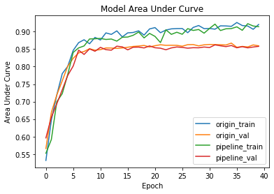

:target{#SplitRec：在隐语拆分学习中使用流水线并行}

# SplitRec：在隐语拆分学习中使用流水线并行

> 以下代码仅作为示例，请勿在生产环境直接使用。

> 本示例基于基于“拆分学习：银行营销”教程制作，建议先观看那个教程。

在拆分学习中，由于模型被拆分在多个设备当中，进行训练的时候，各方需要对中间结果和梯度进行多次传输，计算和网络通信存在大量 idle 时间，我们在隐语中参考论文[《PipeLearn: Pipeline Parallelism for Collaborative Machine Learnin》](https://arxiv.org/pdf/2302.12803.pdf)，利用隐语底座 RayFed 的任务调度能力，实现了流水线并行，使得计算和通信能够交叠隐藏部分计算时间，提高资源利用率。由于计算和通信的并发执行，使用流水线并行可能会带来模型准确性上的损失，用户可以根据实际场景平衡性能和精度。

下面我们通过一个例子来看一下如何使用在隐语拆分学习中使用流水线并行。

:target{#环境设置}

## 环境设置

首先，我们在 secretflow 环境中创造 2 个实体 alice 和 bob。

<Notebook.Cell>
  <Notebook.CodeArea prompt="[1]:" stderr={false} type="input">
    ```python
    import secretflow as sf

    sf.shutdown()
    sf.init(['alice', 'bob'], address='local')
    alice, bob = sf.PYU('alice'), sf.PYU('bob')
    ```
  </Notebook.CodeArea>
</Notebook.Cell>

:target{#准备数据}

## 准备数据

接下来我们准备要学习的数据。

我们使用“拆分学习：银行营销”中的数据准备和处理方法，下载银行营销数据集并进行处理。alice 和 bob 的角色和之前的教程完全相同：

<Notebook.Cell>
  <Notebook.CodeArea prompt="[2]:" stderr={false} type="input">
    ```python
    from secretflow.utils.simulation.datasets import load_bank_marketing
    from secretflow.preprocessing.scaler import MinMaxScaler
    from secretflow.preprocessing.encoder import LabelEncoder
    from secretflow.data.split import train_test_split

    random_state = 1234

    data = load_bank_marketing(parts={alice: (0, 4), bob: (4, 16)}, axis=1)
    label = load_bank_marketing(parts={alice: (16, 17)}, axis=1)

    encoder = LabelEncoder()
    data['job'] = encoder.fit_transform(data['job'])
    data['marital'] = encoder.fit_transform(data['marital'])
    data['education'] = encoder.fit_transform(data['education'])
    data['default'] = encoder.fit_transform(data['default'])
    data['housing'] = encoder.fit_transform(data['housing'])
    data['loan'] = encoder.fit_transform(data['loan'])
    data['contact'] = encoder.fit_transform(data['contact'])
    data['poutcome'] = encoder.fit_transform(data['poutcome'])
    data['month'] = encoder.fit_transform(data['month'])
    label = encoder.fit_transform(label)

    scaler = MinMaxScaler()
    data = scaler.fit_transform(data)

    train_data, test_data = train_test_split(
        data, train_size=0.8, random_state=random_state
    )
    train_label, test_label = train_test_split(
        label, train_size=0.8, random_state=random_state
    )
    ```
  </Notebook.CodeArea>
</Notebook.Cell>

:target{#定义模型结构}

## 定义模型结构

接下来我们创建联邦模型，同样地，我们使用“拆分学习：银行营销”中的建模，构建出 base\_model 和 fuse\_model，然后就可以定义 SLModel 用于训练：

<Notebook.Cell>
  <Notebook.CodeArea prompt="[3]:" stderr={false} type="input">
    ```python
    def create_base_model(input_dim, output_dim, name='base_model'):
        # Create model
        def create_model():
            from tensorflow import keras
            from tensorflow.keras import layers
            import tensorflow as tf

            model = keras.Sequential(
                [
                    keras.Input(shape=input_dim),
                    layers.Dense(100, activation="relu"),
                    layers.Dense(output_dim, activation="relu"),
                ]
            )
            # Compile model
            model.summary()
            model.compile(
                loss='binary_crossentropy',
                optimizer='adam',
                metrics=["accuracy", tf.keras.metrics.AUC()],
            )
            return model

        return create_model


    # prepare model
    hidden_size = 64

    model_base_alice = create_base_model(4, hidden_size)
    model_base_bob = create_base_model(12, hidden_size)


    def create_fuse_model(input_dim, output_dim, party_nums, name='fuse_model'):
        def create_model():
            from tensorflow import keras
            from tensorflow.keras import layers
            import tensorflow as tf

            # input
            input_layers = []
            for i in range(party_nums):
                input_layers.append(
                    keras.Input(
                        input_dim,
                    )
                )

            merged_layer = layers.concatenate(input_layers)
            fuse_layer = layers.Dense(64, activation='relu')(merged_layer)
            output = layers.Dense(output_dim, activation='sigmoid')(fuse_layer)

            model = keras.Model(inputs=input_layers, outputs=output)
            model.summary()

            model.compile(
                loss='binary_crossentropy',
                optimizer='adam',
                metrics=["accuracy", tf.keras.metrics.AUC()],
            )
            return model

        return create_model


    model_fuse = create_fuse_model(input_dim=hidden_size, party_nums=2, output_dim=1)

    base_model_dict = {alice: model_base_alice, bob: model_base_bob}
    ```
  </Notebook.CodeArea>
</Notebook.Cell>

:target{#定义-SLModel}

## 定义 SLModel

这里如果使用流水线并行，设置 strategy = ‘pipline’，并设置参数 pipeline\_size，pipeline\_size 增大并发程度会增大，但达到一定阈值，当一方的计算或网络被打满，性能将不会再有提升，通常 pipeline\_size 设为 2-4。

<Notebook.Cell>
  <Notebook.CodeArea prompt="[4]:" stderr={false} type="input">
    ```python
    from secretflow.ml.nn import SLModel

    sl_model_origin = SLModel(
        base_model_dict=base_model_dict,
        device_y=alice,
        model_fuse=model_fuse,
    )

    sl_model_pipeline = SLModel(
        base_model_dict=base_model_dict,
        device_y=alice,
        model_fuse=model_fuse,
        strategy='pipeline',
        pipeline_size=2,
    )
    ```
  </Notebook.CodeArea>
</Notebook.Cell>

:target{#开始训练}

## 开始训练

我们分别对没有使用通讯压缩的模型和使用了量化压缩的模型进行训练，并把训练轮次拉高到40轮，看看效果如何。

<Notebook.Cell>
  <Notebook.CodeArea prompt="[5]:" stderr={false} type="input">
    ```python
    import time

    histories = []
    cost_time = []
    for sl_model in [sl_model_origin, sl_model_pipeline]:
        begin = time.time()
        history = sl_model.fit(
            train_data,
            train_label,
            validation_data=(test_data, test_label),
            epochs=40,
            batch_size=128,
            shuffle=True,
            verbose=1,
            validation_freq=1,
        )
        end = time.time()
        cost_time.append((end - begin) / 60)
        histories.append(history)

    print(cost_time)
    ```
  </Notebook.CodeArea>

  <Notebook.CodeArea prompt="" stderr={false} type="output">
    <pre>
      <span className="ansi-cyan-fg">{"(PYUSLTFModel pid=1825002)"}</span>{" Model: \"sequential\"\n"}<span className="ansi-cyan-fg">{"(PYUSLTFModel pid=1825002)"}</span>{" _________________________________________________________________\n"}<span className="ansi-cyan-fg">{"(PYUSLTFModel pid=1825002)"}</span>{"  Layer (type)                Output Shape              Param #\n"}<span className="ansi-cyan-fg">{"(PYUSLTFModel pid=1825002)"}</span>{" =================================================================\n"}<span className="ansi-cyan-fg">{"(PYUSLTFModel pid=1825002)"}</span>{"  dense (Dense)               (None, 100)               500\n"}<span className="ansi-cyan-fg">{"(PYUSLTFModel pid=1825002)"}</span><span className="ansi-cyan-fg">{"(PYUSLTFModel pid=1825002)"}</span>{"  dense_1 (Dense)             (None, 64)                6464\n"}<span className="ansi-cyan-fg">{"(PYUSLTFModel pid=1825002)"}</span><span className="ansi-cyan-fg">{"(PYUSLTFModel pid=1825002)"}</span>{" =================================================================\n"}<span className="ansi-cyan-fg">{"(PYUSLTFModel pid=1825002)"}</span>{" Total params: 6,964\n"}<span className="ansi-cyan-fg">{"(PYUSLTFModel pid=1825002)"}</span>{" Trainable params: 6,964\n"}<span className="ansi-cyan-fg">{"(PYUSLTFModel pid=1825002)"}</span>{" Non-trainable params: 0\n"}<span className="ansi-cyan-fg">{"(PYUSLTFModel pid=1825002)"}</span>{" _________________________________________________________________\n"}<span className="ansi-cyan-fg">{"(PYUSLTFModel pid=1825002)"}</span>{" Model: \"model\"\n"}<span className="ansi-cyan-fg">{"(PYUSLTFModel pid=1825002)"}</span>{" __________________________________________________________________________________________________\n"}<span className="ansi-cyan-fg">{"(PYUSLTFModel pid=1825002)"}</span>{"  Layer (type)                   Output Shape         Param #     Connected to\n"}<span className="ansi-cyan-fg">{"(PYUSLTFModel pid=1825002)"}</span>{" ==================================================================================================\n"}<span className="ansi-cyan-fg">{"(PYUSLTFModel pid=1825002)"}</span>{"  input_2 (InputLayer)           [(None, 64)]         0           []\n"}<span className="ansi-cyan-fg">{"(PYUSLTFModel pid=1825002)"}</span><span className="ansi-cyan-fg">{"(PYUSLTFModel pid=1825002)"}</span>{"  input_3 (InputLayer)           [(None, 64)]         0           []\n"}<span className="ansi-cyan-fg">{"(PYUSLTFModel pid=1825002)"}</span><span className="ansi-cyan-fg">{"(PYUSLTFModel pid=1825002)"}</span>{"  concatenate (Concatenate)      (None, 128)          0           ['input_2[0][0]',\n"}<span className="ansi-cyan-fg">{"(PYUSLTFModel pid=1825002)"}</span>{"                                                                   'input_3[0][0]']\n"}<span className="ansi-cyan-fg">{"(PYUSLTFModel pid=1825002)"}</span><span className="ansi-cyan-fg">{"(PYUSLTFModel pid=1825002)"}</span>{"  dense_2 (Dense)                (None, 64)           8256        ['concatenate[0][0]']\n"}<span className="ansi-cyan-fg">{"(PYUSLTFModel pid=1825002)"}</span><span className="ansi-cyan-fg">{"(PYUSLTFModel pid=1825002)"}</span>{"  dense_3 (Dense)                (None, 1)            65          ['dense_2[0][0]']\n"}<span className="ansi-cyan-fg">{"(PYUSLTFModel pid=1825002)"}</span><span className="ansi-cyan-fg">{"(PYUSLTFModel pid=1825002)"}</span>{" ==================================================================================================\n"}<span className="ansi-cyan-fg">{"(PYUSLTFModel pid=1825002)"}</span>{" Total params: 8,321\n"}<span className="ansi-cyan-fg">{"(PYUSLTFModel pid=1825002)"}</span>{" Trainable params: 8,321\n"}<span className="ansi-cyan-fg">{"(PYUSLTFModel pid=1825002)"}</span>{" Non-trainable params: 0\n"}<span className="ansi-cyan-fg">{"(PYUSLTFModel pid=1825002)"}</span>{" __________________________________________________________________________________________________\n"}<span className="ansi-cyan-fg">{"(PYUSLTFModel pid=1825080)"}</span>{" Model: \"sequential\"\n"}<span className="ansi-cyan-fg">{"(PYUSLTFModel pid=1825080)"}</span>{" _________________________________________________________________\n"}<span className="ansi-cyan-fg">{"(PYUSLTFModel pid=1825080)"}</span>{"  Layer (type)                Output Shape              Param #\n"}<span className="ansi-cyan-fg">{"(PYUSLTFModel pid=1825080)"}</span>{" =================================================================\n"}<span className="ansi-cyan-fg">{"(PYUSLTFModel pid=1825080)"}</span>{"  dense (Dense)               (None, 100)               1300\n"}<span className="ansi-cyan-fg">{"(PYUSLTFModel pid=1825080)"}</span><span className="ansi-cyan-fg">{"(PYUSLTFModel pid=1825080)"}</span>{"  dense_1 (Dense)             (None, 64)                6464\n"}<span className="ansi-cyan-fg">{"(PYUSLTFModel pid=1825080)"}</span><span className="ansi-cyan-fg">{"(PYUSLTFModel pid=1825080)"}</span>{" =================================================================\n"}<span className="ansi-cyan-fg">{"(PYUSLTFModel pid=1825080)"}</span>{" Total params: 7,764\n"}<span className="ansi-cyan-fg">{"(PYUSLTFModel pid=1825080)"}</span>{" Trainable params: 7,764\n"}<span className="ansi-cyan-fg">{"(PYUSLTFModel pid=1825080)"}</span>{" Non-trainable params: 0\n"}<span className="ansi-cyan-fg">{"(PYUSLTFModel pid=1825080)"}</span>{" _________________________________________________________________\n"}
    </pre>
  </Notebook.CodeArea>

  <Notebook.CodeArea prompt="" stderr={false} type="output">
    <pre>
      <span className="ansi-cyan-fg">{"(PYUPipelineTFModel pid=1825145)"}</span>{" Model: \"sequential\"\n"}<span className="ansi-cyan-fg">{"(PYUPipelineTFModel pid=1825145)"}</span>{" _________________________________________________________________\n"}<span className="ansi-cyan-fg">{"(PYUPipelineTFModel pid=1825145)"}</span>{"  Layer (type)                Output Shape              Param #\n"}<span className="ansi-cyan-fg">{"(PYUPipelineTFModel pid=1825145)"}</span>{" =================================================================\n"}<span className="ansi-cyan-fg">{"(PYUPipelineTFModel pid=1825145)"}</span>{"  dense (Dense)               (None, 100)               500\n"}<span className="ansi-cyan-fg">{"(PYUPipelineTFModel pid=1825145)"}</span><span className="ansi-cyan-fg">{"(PYUPipelineTFModel pid=1825145)"}</span>{"  dense_1 (Dense)             (None, 64)                6464\n"}<span className="ansi-cyan-fg">{"(PYUPipelineTFModel pid=1825145)"}</span><span className="ansi-cyan-fg">{"(PYUPipelineTFModel pid=1825145)"}</span>{" =================================================================\n"}<span className="ansi-cyan-fg">{"(PYUPipelineTFModel pid=1825145)"}</span>{" Total params: 6,964\n"}<span className="ansi-cyan-fg">{"(PYUPipelineTFModel pid=1825145)"}</span>{" Trainable params: 6,964\n"}<span className="ansi-cyan-fg">{"(PYUPipelineTFModel pid=1825145)"}</span>{" Non-trainable params: 0\n"}<span className="ansi-cyan-fg">{"(PYUPipelineTFModel pid=1825145)"}</span>{" _________________________________________________________________\n"}
    </pre>
  </Notebook.CodeArea>

  <Notebook.CodeArea prompt="" stderr={false} type="output">
    <pre>
      <span className="ansi-cyan-fg">{"(PYUPipelineTFModel pid=1825145)"}</span>{" Model: \"model\"\n"}<span className="ansi-cyan-fg">{"(PYUPipelineTFModel pid=1825145)"}</span>{" __________________________________________________________________________________________________\n"}<span className="ansi-cyan-fg">{"(PYUPipelineTFModel pid=1825145)"}</span>{"  Layer (type)                   Output Shape         Param #     Connected to\n"}<span className="ansi-cyan-fg">{"(PYUPipelineTFModel pid=1825145)"}</span>{" ==================================================================================================\n"}<span className="ansi-cyan-fg">{"(PYUPipelineTFModel pid=1825145)"}</span>{"  input_2 (InputLayer)           [(None, 64)]         0           []\n"}<span className="ansi-cyan-fg">{"(PYUPipelineTFModel pid=1825145)"}</span><span className="ansi-cyan-fg">{"(PYUPipelineTFModel pid=1825145)"}</span>{"  input_3 (InputLayer)           [(None, 64)]         0           []\n"}<span className="ansi-cyan-fg">{"(PYUPipelineTFModel pid=1825145)"}</span><span className="ansi-cyan-fg">{"(PYUPipelineTFModel pid=1825145)"}</span>{"  concatenate (Concatenate)      (None, 128)          0           ['input_2[0][0]',\n"}<span className="ansi-cyan-fg">{"(PYUPipelineTFModel pid=1825145)"}</span>{"                                                                   'input_3[0][0]']\n"}<span className="ansi-cyan-fg">{"(PYUPipelineTFModel pid=1825145)"}</span><span className="ansi-cyan-fg">{"(PYUPipelineTFModel pid=1825145)"}</span>{"  dense_2 (Dense)                (None, 64)           8256        ['concatenate[0][0]']\n"}<span className="ansi-cyan-fg">{"(PYUPipelineTFModel pid=1825145)"}</span><span className="ansi-cyan-fg">{"(PYUPipelineTFModel pid=1825145)"}</span>{"  dense_3 (Dense)                (None, 1)            65          ['dense_2[0][0]']\n"}<span className="ansi-cyan-fg">{"(PYUPipelineTFModel pid=1825145)"}</span><span className="ansi-cyan-fg">{"(PYUPipelineTFModel pid=1825145)"}</span>{" ==================================================================================================\n"}<span className="ansi-cyan-fg">{"(PYUPipelineTFModel pid=1825145)"}</span>{" Total params: 8,321\n"}<span className="ansi-cyan-fg">{"(PYUPipelineTFModel pid=1825145)"}</span>{" Trainable params: 8,321\n"}<span className="ansi-cyan-fg">{"(PYUPipelineTFModel pid=1825145)"}</span>{" Non-trainable params: 0\n"}<span className="ansi-cyan-fg">{"(PYUPipelineTFModel pid=1825145)"}</span>{" __________________________________________________________________________________________________\n"}<span className="ansi-cyan-fg">{"(PYUPipelineTFModel pid=1825269)"}</span>{" Model: \"sequential\"\n"}<span className="ansi-cyan-fg">{"(PYUPipelineTFModel pid=1825269)"}</span>{" _________________________________________________________________\n"}<span className="ansi-cyan-fg">{"(PYUPipelineTFModel pid=1825269)"}</span>{"  Layer (type)                Output Shape              Param #\n"}<span className="ansi-cyan-fg">{"(PYUPipelineTFModel pid=1825269)"}</span>{" =================================================================\n"}<span className="ansi-cyan-fg">{"(PYUPipelineTFModel pid=1825269)"}</span>{"  dense (Dense)               (None, 100)               1300\n"}<span className="ansi-cyan-fg">{"(PYUPipelineTFModel pid=1825269)"}</span><span className="ansi-cyan-fg">{"(PYUPipelineTFModel pid=1825269)"}</span>{"  dense_1 (Dense)             (None, 64)                6464\n"}<span className="ansi-cyan-fg">{"(PYUPipelineTFModel pid=1825269)"}</span><span className="ansi-cyan-fg">{"(PYUPipelineTFModel pid=1825269)"}</span>{" =================================================================\n"}<span className="ansi-cyan-fg">{"(PYUPipelineTFModel pid=1825269)"}</span>{" Total params: 7,764\n"}<span className="ansi-cyan-fg">{"(PYUPipelineTFModel pid=1825269)"}</span>{" Trainable params: 7,764\n"}<span className="ansi-cyan-fg">{"(PYUPipelineTFModel pid=1825269)"}</span>{" Non-trainable params: 0\n"}<span className="ansi-cyan-fg">{"(PYUPipelineTFModel pid=1825269)"}</span>{" _________________________________________________________________\n"}
    </pre>
  </Notebook.CodeArea>

  <Notebook.CodeArea prompt="" stderr={false} type="output">
    <pre>
      {"[1.012537411848704, 0.7321080048878987]\n"}
    </pre>
  </Notebook.CodeArea>
</Notebook.Cell>

<Notebook.Cell>
  <Notebook.CodeArea prompt="[6]:" stderr={false} type="input">
    ```python
    import matplotlib.pyplot as plt

    for history in histories:
        plt.plot(history['train_auc_1'])
        plt.plot(history['val_auc_1'])

    plt.title('Model Area Under Curve')
    plt.ylabel('Area Under Curve')
    plt.xlabel('Epoch')
    plt.legend(
        ['origin_train', 'origin_val', 'pipeline_train', 'pipeline_val'], loc='lower right'
    )
    plt.show()
    ```
  </Notebook.CodeArea>

  <Notebook.FancyOutput prompt="" type="output">
    
  </Notebook.FancyOutput>
</Notebook.Cell>

可以看到，两个模型的验证集 auc 均在 0.85 左右波动，使用流水线并行对此任务的训练精度影响不大，而训练时间由 0.76 分钟下降到 0.65 分钟。

:target{#总结}

## 总结

本篇示例介绍了隐语拆分学习中流水线并行的使用方法。与一般拆分学习的使用方法一样，只需在定义 SLModel 时指定 strategy=‘pipeline’ 并设置 pipeline\_num 即可。
