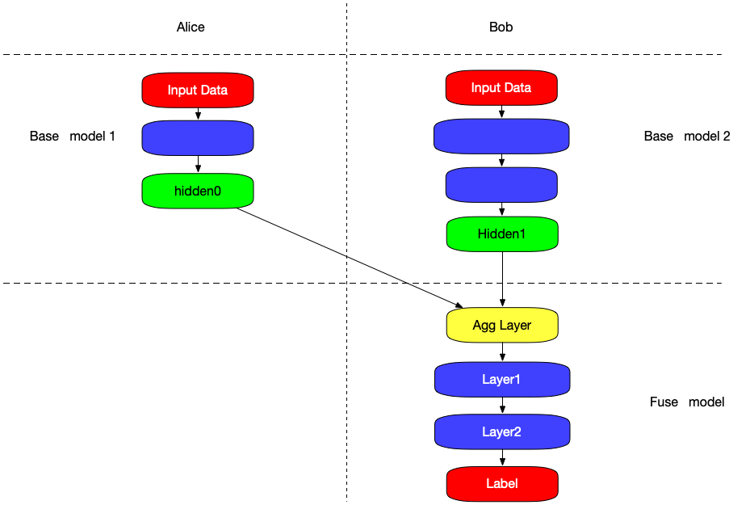

:target{#split-learning}

# Split Learning

:target{#what-is-split-learning}

## What is Split Learning

The core idea of split learning is to split the network structure. Each device (silo) retains only a part of the network structure, and the sub-network structure of all devices is combined together to form a complete network model.
In the training process, different devices (silos) only perform forward or reverse calculation on the local network structure, and transfer the calculation results to the next device. Multiple devices complete the training through joint model until convergence.

A typical example of split learning:

Alice holds its own data and base model.
Bob holds its own data, base model and fuse model.

1. Alice uses its data to get <code>hidden0</code> through its base model and send it to Bob.
2. Bob gets <code>hidden1</code> with its data through its base model.
3. <code>hidden\_0</code> and <code>hidden\_1</code> are input to the <code>Agg Layer</code> for aggregation, and the aggregated hidden\_merge is the output.
4. Bob input hidden\_merge to model\_fuse, get the gradient with label and send it back.
5. The gradient is split into two parts g\_0, g\_1 through <code>AggLayer</code>, which are sent to Alice and Bob respectively.
6. Then Alice and Bob update their local base net with g\_0 or g\_1.

:target{#split-learning-model}

## Split Learning Model

SecretFlow provides <code>SLModel</code> to define a split learning model.
You can check the tutorial to have a try.

:target{#tutorial}

### Tutorial

- [Split Learning—Bank Marketing](../../../tutorial/Split_Learning_for_bank_marketing.mdx)
- [Split Learning for Graph Neural Network](../../../tutorial/split_learning_gnn.mdx)
