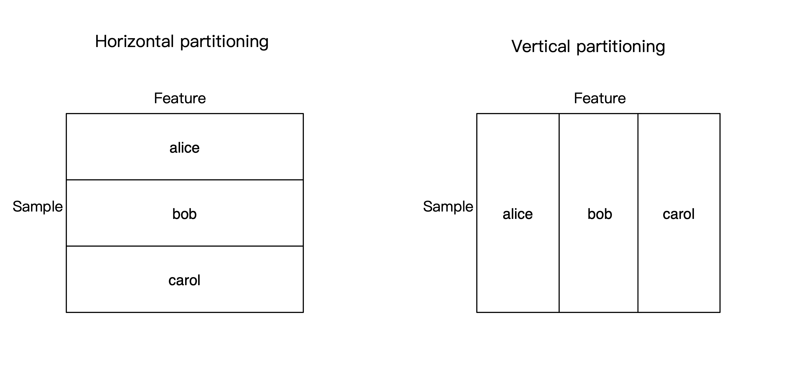

:target{#DataFrame}

# DataFrame

> The following codes are demos only. It’s <strong>NOT for production</strong> due to system security concerns, please <strong>DO NOT</strong> use it directly in production.

It is recommended to use [jupyter](https://jupyter.org/) to run this tutorial.

Secretflow provides federated data encapsulation in the form of DataFrame. DataFrame is composed of data blocks of multiple parties and supports horizontal or vertical partitioned data.



Currently secretflow\.DataFrame provides a subset of pandas operations, which are basically the same as pandas. During the calculation process, the original data is kept in the data holder and will not go out of the domain.

The following will demonstrate how to use a DataFrame.

:target{#Preparation}

## Preparation

Initialize secretflow and create three parties alice, bob and carol.

<Notebook.Cell>
  <Notebook.CodeArea prompt="[1]:" stderr={false} type="input">
    ```python
    import secretflow as sf

    # In case you have a running secretflow runtime already.
    sf.shutdown()

    sf.init(['alice', 'bob', 'carol'], address='local')
    alice, bob, carol = sf.PYU('alice'), sf.PYU('bob'), sf.PYU('carol')
    ```
  </Notebook.CodeArea>
</Notebook.Cell>

:target{#Data-preparation}

## Data preparation

Here we use [iris](https://scikit-learn.org/stable/modules/generated/sklearn.datasets.load_iris.html) as example data.

<Notebook.Cell>
  <Notebook.CodeArea prompt="[2]:" stderr={false} type="input">
    ```python
    import pandas as pd
    from sklearn.datasets import load_iris

    iris = load_iris(as_frame=True)
    data = pd.concat([iris.data, iris.target], axis=1)
    data
    ```
  </Notebook.CodeArea>

  <Notebook.FancyOutput prompt="[2]:" type="output">
    <div>
      <style scoped={true}>
        {"\n    .dataframe tbody tr th:only-of-type {\n        vertical-align: middle;\n    }\n\n    .dataframe tbody tr th {\n        vertical-align: top;\n    }\n\n    .dataframe thead th {\n        text-align: right;\n    }\n"}
      </style>

      <table border={1} className="dataframe">
        <thead>
          <tr style={{"textAlign":"right"}}>
            <th /><th>{"sepal length (cm)"}</th><th>{"sepal width (cm)"}</th><th>{"petal length (cm)"}</th><th>{"petal width (cm)"}</th><th>{"target"}</th>
          </tr>
        </thead>

        <tbody>
          <tr>
            <th>{"0"}</th><td>{"5.1"}</td><td>{"3.5"}</td><td>{"1.4"}</td><td>{"0.2"}</td><td>{"0"}</td>
          </tr>

          <tr>
            <th>{"1"}</th><td>{"4.9"}</td><td>{"3.0"}</td><td>{"1.4"}</td><td>{"0.2"}</td><td>{"0"}</td>
          </tr>

          <tr>
            <th>{"2"}</th><td>{"4.7"}</td><td>{"3.2"}</td><td>{"1.3"}</td><td>{"0.2"}</td><td>{"0"}</td>
          </tr>

          <tr>
            <th>{"3"}</th><td>{"4.6"}</td><td>{"3.1"}</td><td>{"1.5"}</td><td>{"0.2"}</td><td>{"0"}</td>
          </tr>

          <tr>
            <th>{"4"}</th><td>{"5.0"}</td><td>{"3.6"}</td><td>{"1.4"}</td><td>{"0.2"}</td><td>{"0"}</td>
          </tr>

          <tr>
            <th>{"..."}</th><td>{"..."}</td><td>{"..."}</td><td>{"..."}</td><td>{"..."}</td><td>{"..."}</td>
          </tr>

          <tr>
            <th>{"145"}</th><td>{"6.7"}</td><td>{"3.0"}</td><td>{"5.2"}</td><td>{"2.3"}</td><td>{"2"}</td>
          </tr>

          <tr>
            <th>{"146"}</th><td>{"6.3"}</td><td>{"2.5"}</td><td>{"5.0"}</td><td>{"1.9"}</td><td>{"2"}</td>
          </tr>

          <tr>
            <th>{"147"}</th><td>{"6.5"}</td><td>{"3.0"}</td><td>{"5.2"}</td><td>{"2.0"}</td><td>{"2"}</td>
          </tr>

          <tr>
            <th>{"148"}</th><td>{"6.2"}</td><td>{"3.4"}</td><td>{"5.4"}</td><td>{"2.3"}</td><td>{"2"}</td>
          </tr>

          <tr>
            <th>{"149"}</th><td>{"5.9"}</td><td>{"3.0"}</td><td>{"5.1"}</td><td>{"1.8"}</td><td>{"2"}</td>
          </tr>
        </tbody>
      </table>

      <p>{"150 rows × 5 columns"}</p>
    </div>
  </Notebook.FancyOutput>
</Notebook.Cell>

We partition the data according to horizontal (the same features, each holds some samples) and vertical mode (each holds some features) to facilitate subsequent display.

<Notebook.Cell>
  <Notebook.CodeArea prompt="[3]:" stderr={false} type="input">
    ```python
    # Horizontal partitioning.
    h_alice, h_bob, h_carol = data.iloc[:40, :], data.iloc[40:100, :], data.iloc[100:, :]

    # Save to temporary files.
    import tempfile
    import os

    temp_dir = tempfile.mkdtemp()

    h_alice_path = os.path.join(temp_dir, 'h_alice.csv')
    h_bob_path = os.path.join(temp_dir, 'h_bob.csv')
    h_carol_path = os.path.join(temp_dir, 'h_carol.csv')
    h_alice.to_csv(h_alice_path, index=False)
    h_bob.to_csv(h_bob_path, index=False)
    h_carol.to_csv(h_carol_path, index=False)
    ```
  </Notebook.CodeArea>
</Notebook.Cell>

<Notebook.Cell>
  <Notebook.CodeArea prompt="[4]:" stderr={false} type="input">
    ```python
    h_alice.head(), h_bob.head(), h_carol.head()
    ```
  </Notebook.CodeArea>

  <Notebook.CodeArea prompt="[4]:" stderr={false} type="output">
    <pre>
      {"(   sepal length (cm)  sepal width (cm)  petal length (cm)  petal width (cm)  \\\n 0                5.1               3.5                1.4               0.2\n 1                4.9               3.0                1.4               0.2\n 2                4.7               3.2                1.3               0.2\n 3                4.6               3.1                1.5               0.2\n 4                5.0               3.6                1.4               0.2\n\n    target\n 0       0\n 1       0\n 2       0\n 3       0\n 4       0  ,\n     sepal length (cm)  sepal width (cm)  petal length (cm)  petal width (cm)  \\\n 40                5.0               3.5                1.3               0.3\n 41                4.5               2.3                1.3               0.3\n 42                4.4               3.2                1.3               0.2\n 43                5.0               3.5                1.6               0.6\n 44                5.1               3.8                1.9               0.4\n\n     target\n 40       0\n 41       0\n 42       0\n 43       0\n 44       0  ,\n      sepal length (cm)  sepal width (cm)  petal length (cm)  petal width (cm)  \\\n 100                6.3               3.3                6.0               2.5\n 101                5.8               2.7                5.1               1.9\n 102                7.1               3.0                5.9               2.1\n 103                6.3               2.9                5.6               1.8\n 104                6.5               3.0                5.8               2.2\n\n      target\n 100       2\n 101       2\n 102       2\n 103       2\n 104       2  )\n"}
    </pre>
  </Notebook.CodeArea>
</Notebook.Cell>

<Notebook.Cell>
  <Notebook.CodeArea prompt="[5]:" stderr={false} type="input">
    ```python
    # Vertical partitioning.
    v_alice, v_bob, v_carol = data.iloc[:, :2], data.iloc[:, 2:4], data.iloc[:, 4:]

    # Save to temporary files.
    v_alice_path = os.path.join(temp_dir, 'v_alice.csv')
    v_bob_path = os.path.join(temp_dir, 'v_bob.csv')
    v_carol_path = os.path.join(temp_dir, 'v_carol.csv')
    v_alice.to_csv(v_alice_path, index=False)
    v_bob.to_csv(v_bob_path, index=False)
    v_carol.to_csv(v_carol_path, index=False)
    ```
  </Notebook.CodeArea>
</Notebook.Cell>

<Notebook.Cell>
  <Notebook.CodeArea prompt="[6]:" stderr={false} type="input">
    ```python
    v_alice, v_bob, v_carol
    ```
  </Notebook.CodeArea>

  <Notebook.CodeArea prompt="[6]:" stderr={false} type="output">
    <pre>
      {"(     sepal length (cm)  sepal width (cm)\n 0                  5.1               3.5\n 1                  4.9               3.0\n 2                  4.7               3.2\n 3                  4.6               3.1\n 4                  5.0               3.6\n ..                 ...               ...\n 145                6.7               3.0\n 146                6.3               2.5\n 147                6.5               3.0\n 148                6.2               3.4\n 149                5.9               3.0\n\n [150 rows x 2 columns],\n      petal length (cm)  petal width (cm)\n 0                  1.4               0.2\n 1                  1.4               0.2\n 2                  1.3               0.2\n 3                  1.5               0.2\n 4                  1.4               0.2\n ..                 ...               ...\n 145                5.2               2.3\n 146                5.0               1.9\n 147                5.2               2.0\n 148                5.4               2.3\n 149                5.1               1.8\n\n [150 rows x 2 columns],\n      target\n 0         0\n 1         0\n 2         0\n 3         0\n 4         0\n ..      ...\n 145       2\n 146       2\n 147       2\n 148       2\n 149       2\n\n [150 rows x 1 columns])\n"}
    </pre>
  </Notebook.CodeArea>
</Notebook.Cell>

:target{#Creation}

## Creation

:target{#Horitontal-DataFrame}

### Horitontal DataFrame

Create a DataFrame consisting of horizontally partitioned data.

> 💡 The original data is still stored locally in the data holder and is not transmitted out of the domain.

Here, as a simple show case, we choose secure aggregation and spu comparison. You can refer to [Secure Aggregation](../../developer/algorithm/secure_aggregation.mdx) to learn more about secure aggregation solutions and implement appropriate security policies according to your needs.

<Notebook.Cell>
  <Notebook.CodeArea prompt="[7]:" stderr={false} type="input">
    ```python
    from secretflow.data.horizontal import read_csv as h_read_csv
    from secretflow.security.aggregation import SecureAggregator
    from secretflow.security.compare import SPUComparator

    # The aggregator and comparator are respectively used to aggregate
    # or compare data in subsequent data analysis operations.
    aggr = SecureAggregator(device=alice, participants=[alice, bob, carol])

    spu = sf.SPU(sf.utils.testing.cluster_def(parties=['alice', 'bob', 'carol']))
    comp = SPUComparator(spu)
    hdf = h_read_csv({alice: h_alice_path, bob: h_bob_path, carol: h_carol_path},
                     aggregator=aggr,
                     comparator=comp)
    ```
  </Notebook.CodeArea>
</Notebook.Cell>

:target{#Vertical-DataFrame}

### Vertical DataFrame

Create a DataFrame consisting of vertically partitioned data.

> 💡 The original data is still stored locally in the data holder and is not transmitted out of the domain.

<Notebook.Cell>
  <Notebook.CodeArea prompt="[8]:" stderr={false} type="input">
    ```python
    from secretflow.data.vertical import read_csv as v_read_csv

    vdf = v_read_csv({alice: v_alice_path, bob: v_bob_path, carol: v_carol_path})
    ```
  </Notebook.CodeArea>
</Notebook.Cell>

:target{#Data-analysis}

## Data analysis

For data privacy protection purposes, DataFrame does not allow the view of raw data. DataFrame provides an interface similar to pandas for users to analyze data. These interfaces usually support both horizontal and vertical partitioned data.

> 💡 During the following operations, the original data of the DataFrame is still stored locally on the node and is not transmitted out of the domain.

<Notebook.Cell>
  <Notebook.CodeArea prompt="[9]:" stderr={false} type="input">
    ```python
    hdf.columns
    ```
  </Notebook.CodeArea>

  <Notebook.CodeArea prompt="[9]:" stderr={false} type="output">
    <pre>
      {"Index(['sepal length (cm)', 'sepal width (cm)', 'petal length (cm)',\n       'petal width (cm)', 'target'],\n      dtype='object')\n"}
    </pre>
  </Notebook.CodeArea>
</Notebook.Cell>

<Notebook.Cell>
  <Notebook.CodeArea prompt="[10]:" stderr={false} type="input">
    ```python
    vdf.columns
    ```
  </Notebook.CodeArea>

  <Notebook.CodeArea prompt="[10]:" stderr={false} type="output">
    <pre>
      {"Index(['sepal length (cm)', 'sepal width (cm)', 'petal length (cm)',\n       'petal width (cm)', 'target'],\n      dtype='object')\n"}
    </pre>
  </Notebook.CodeArea>
</Notebook.Cell>

Get the minimum value, you can see that it is consistent with the original data.

<Notebook.Cell>
  <Notebook.CodeArea prompt="[11]:" stderr={false} type="input">
    ```python
    print('Horizontal df:\n', hdf.min())
    print('\nVertical df:\n', vdf.min())
    print('\nPandas:\n', data.min())
    ```
  </Notebook.CodeArea>

  <Notebook.CodeArea prompt="" stderr={false} type="output">
    <pre>
      {"Horizontal df:\n sepal length (cm)    4.3\nsepal width (cm)     2.0\npetal length (cm)    1.0\npetal width (cm)     0.1\ntarget               0.0\ndtype: float64\n\nVertical df:\n sepal length (cm)    4.3\nsepal width (cm)     2.0\npetal length (cm)    1.0\npetal width (cm)     0.1\ntarget               0.0\ndtype: float64\n\nPandas:\n sepal length (cm)    4.3\nsepal width (cm)     2.0\npetal length (cm)    1.0\npetal width (cm)     0.1\ntarget               0.0\ndtype: float64\n"}
    </pre>
  </Notebook.CodeArea>
</Notebook.Cell>

You can also view information such as maximum value, mean value, and quantity.

<Notebook.Cell>
  <Notebook.CodeArea prompt="[12]:" stderr={false} type="input">
    ```python
    hdf.max()
    ```
  </Notebook.CodeArea>

  <Notebook.CodeArea prompt="[12]:" stderr={false} type="output">
    <pre>
      {"sepal length (cm)    7.9\nsepal width (cm)     4.4\npetal length (cm)    6.9\npetal width (cm)     2.5\ntarget               2.0\ndtype: float64\n"}
    </pre>
  </Notebook.CodeArea>
</Notebook.Cell>

<Notebook.Cell>
  <Notebook.CodeArea prompt="[13]:" stderr={false} type="input">
    ```python
    vdf.max()
    ```
  </Notebook.CodeArea>

  <Notebook.CodeArea prompt="[13]:" stderr={false} type="output">
    <pre>
      {"sepal length (cm)    7.9\nsepal width (cm)     4.4\npetal length (cm)    6.9\npetal width (cm)     2.5\ntarget               2.0\ndtype: float64\n"}
    </pre>
  </Notebook.CodeArea>
</Notebook.Cell>

<Notebook.Cell>
  <Notebook.CodeArea prompt="[14]:" stderr={false} type="input">
    ```python
    hdf.mean(numeric_only=True)
    ```
  </Notebook.CodeArea>

  <Notebook.CodeArea prompt="[14]:" stderr={false} type="output">
    <pre>
      {"sepal length (cm)    5.843333\nsepal width (cm)     3.057333\npetal length (cm)    3.758000\npetal width (cm)     1.199333\ntarget               1.000000\ndtype: float64\n"}
    </pre>
  </Notebook.CodeArea>
</Notebook.Cell>

<Notebook.Cell>
  <Notebook.CodeArea prompt="[15]:" stderr={false} type="input">
    ```python
    vdf.mean(numeric_only=True)
    ```
  </Notebook.CodeArea>

  <Notebook.CodeArea prompt="[15]:" stderr={false} type="output">
    <pre>
      {"sepal length (cm)    5.843333\nsepal width (cm)     3.057333\npetal length (cm)    3.758000\npetal width (cm)     1.199333\ntarget               1.000000\ndtype: float64\n"}
    </pre>
  </Notebook.CodeArea>
</Notebook.Cell>

<Notebook.Cell>
  <Notebook.CodeArea prompt="[16]:" stderr={false} type="input">
    ```python
    hdf.count()
    ```
  </Notebook.CodeArea>

  <Notebook.CodeArea prompt="[16]:" stderr={false} type="output">
    <pre>
      {"sepal length (cm)    150\nsepal width (cm)     150\npetal length (cm)    150\npetal width (cm)     150\ntarget               150\ndtype: int64\n"}
    </pre>
  </Notebook.CodeArea>
</Notebook.Cell>

<Notebook.Cell>
  <Notebook.CodeArea prompt="[17]:" stderr={false} type="input">
    ```python
    vdf.count()
    ```
  </Notebook.CodeArea>

  <Notebook.CodeArea prompt="[17]:" stderr={false} type="output">
    <pre>
      {"sepal length (cm)    150\nsepal width (cm)     150\npetal length (cm)    150\npetal width (cm)     150\ntarget               150\ndtype: int64\n"}
    </pre>
  </Notebook.CodeArea>
</Notebook.Cell>

:target{#Selection}

### Selection

Get partial columns.

<Notebook.Cell>
  <Notebook.CodeArea prompt="[18]:" stderr={false} type="input">
    ```python
    hdf_part = hdf[['sepal length (cm)', 'target']]
    hdf_part.mean(numeric_only=True)
    ```
  </Notebook.CodeArea>

  <Notebook.CodeArea prompt="[18]:" stderr={false} type="output">
    <pre>
      {"sepal length (cm)    5.843333\ntarget               1.000000\ndtype: float64\n"}
    </pre>
  </Notebook.CodeArea>
</Notebook.Cell>

<Notebook.Cell>
  <Notebook.CodeArea prompt="[19]:" stderr={false} type="input">
    ```python
    vdf_part = hdf[['sepal width (cm)', 'target']]
    vdf_part.mean(numeric_only=True)
    ```
  </Notebook.CodeArea>

  <Notebook.CodeArea prompt="[19]:" stderr={false} type="output">
    <pre>
      {"sepal width (cm)    3.057333\ntarget              1.000000\ndtype: float64\n"}
    </pre>
  </Notebook.CodeArea>
</Notebook.Cell>

:target{#Modification}

### Modification

Horizontal DataFrame

<Notebook.Cell>
  <Notebook.CodeArea prompt="[20]:" stderr={false} type="input">
    ```python
    hdf_copy = hdf.copy()
    print('Min of target: ', hdf_copy['target'].min()[0])
    print('Max of target: ', hdf_copy['target'].max()[0])
    ```
  </Notebook.CodeArea>

  <Notebook.CodeArea prompt="" stderr={false} type="output">
    <pre>
      {"Min of target:  0.0\nMax of target:  2.0\n"}
    </pre>
  </Notebook.CodeArea>
</Notebook.Cell>

<Notebook.Cell>
  <Notebook.CodeArea prompt="[21]:" stderr={false} type="input">
    ```python
    # Set target to 1。
    hdf_copy['target'] = 1

    # You can see that the value of target has become 1.
    print('Min of target: ', hdf_copy['target'].min()[0])
    print('Max of target: ', hdf_copy['target'].max()[0])
    ```
  </Notebook.CodeArea>

  <Notebook.CodeArea prompt="" stderr={false} type="output">
    <pre>
      {"Min of target:  1.0\nMax of target:  1.0\n"}
    </pre>
  </Notebook.CodeArea>
</Notebook.Cell>

Vertical DataFrame.

<Notebook.Cell>
  <Notebook.CodeArea prompt="[22]:" stderr={false} type="input">
    ```python
    vdf_copy = vdf.copy()
    print('Min of sepal width (cm): ', vdf_copy['sepal width (cm)'].min()[0])
    print('Max of sepal width (cm): ', vdf_copy['sepal width (cm)'].max()[0])
    ```
  </Notebook.CodeArea>

  <Notebook.CodeArea prompt="" stderr={false} type="output">
    <pre>
      {"Min of sepal width (cm):  2.0\nMax of sepal width (cm):  4.4\n"}
    </pre>
  </Notebook.CodeArea>
</Notebook.Cell>

<Notebook.Cell>
  <Notebook.CodeArea prompt="[23]:" stderr={false} type="input">
    ```python
    # Set sepal width (cm) to 20。
    vdf_copy['sepal width (cm)'] = 20

    # You can see that the value of sepal width (cm) has become 20.
    print('Min of sepal width (cm): ', vdf_copy['sepal width (cm)'].min()[0])
    print('Max of sepal width (cm): ', vdf_copy['sepal width (cm)'].max()[0])
    ```
  </Notebook.CodeArea>

  <Notebook.CodeArea prompt="" stderr={false} type="output">
    <pre>
      {"Min of sepal width (cm):  20\nMax of sepal width (cm):  20\n"}
    </pre>
  </Notebook.CodeArea>
</Notebook.Cell>

:target{#Ending}

## Ending

<Notebook.Cell>
  <Notebook.CodeArea prompt="[24]:" stderr={false} type="input">
    ```python
    # Clean up temporary files

    import shutil

    shutil.rmtree(temp_dir, ignore_errors=True)
    ```
  </Notebook.CodeArea>
</Notebook.Cell>

:target{id="What's-Next?"}

## What’s Next?

Learn how to do data preprocessing with DataFrame with [this tutorial](../../tutorial/data_preprocessing_with_data_frame.mdx).
