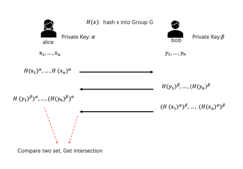
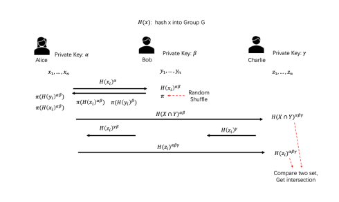
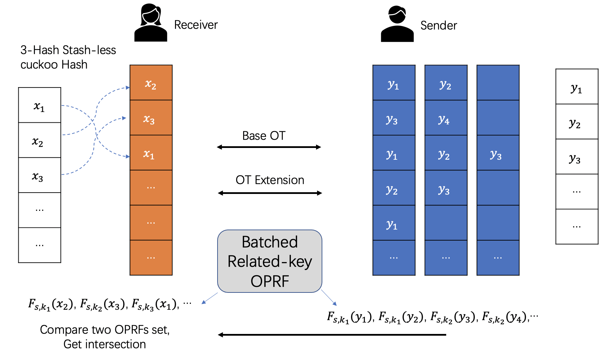

:target{#private-set-intersection-psi}

# Private Set Intersection(PSI)

SecretFlow SPU implements the following PSI protocols,

- Semi-honest ECDH-based two-party PSI protocol :target{#id1}[\[HFH99\]](#hfh99)
- Semi-honest ECDH-based three-party PSI protocol
- Semi-honest OT-based two-party PSI protocol :target{#id2}[\[KKRT16\]](#kkrt16)
- Semi-honest PCG/VOLE-based two-party PSI protocol (with improved communication efficiency) :target{#id3}[\[BC22\]](#bc22)
- Semi-honest EC-OPRF based two-party Unbalanced PSI protocol
- Differentially Private (DP) PSI Protocol :target{#id4}[\[DP-PSI\]](#dp-psi)

As a general rule, OT-based PSI protocols are (significantly) faster but require more communication
than Diffie-Hellman-based PSI protocols.
In some scenarios, communication cost is overwhelmingly more important than computation cost.

:target{#ecdh-psi-2p}

## ECDH-PSI (2P)

The semi-honest DH-PSI protocol is due to Huberman, Franklin, and Hogg :target{#id5}[\[HFH99\]](#hfh99),
but with roots as far back as Meadows :target{#id6}[\[Mea86\]](#mea86). It is a semi-honest protocol that
requires exponentiations in a Diffie-Hellman group proportional to the number of items in the sets.

DH-PSI protocol based on the Decisional Diffie-Hellman assumption:

- Agree on a group G, with a generator g.
- The assumption: for random a,b,c cannot distinguish <InlineMath>$(g^a, g^b, g^{ab})$</InlineMath> from <InlineMath>$(g^a, g^b, g^c)$</InlineMath>

Several candidate groups are widely used, such as subgroups of the multiplication group of a finite
field and elliptic curve groups. In practice, carefully chosen elliptic curves like
Curve25519 :target{#id7}[\[Ber06\]](#ber06) offer a good balance between security and performance.

<figure>
  
</figure>

Note that at the beginning of ECDH-PSI protocol, we assume the input data from both Alice and Bob are
shuffled.

Protocol:

1. For each element <InlineMath>$x_i$</InlineMath> in its set, Alice applies the hash function and then exponentiates it
   using its key <InlineMath>$\alpha$</InlineMath>, thus computing <InlineMath>${H(x_i)}^\alpha$</InlineMath> . Alice sends
   <InlineMath>${\{\,{H(x_i)}^\alpha\}\,}_{i=1}^{n_1}$</InlineMath> to Bob.
2. For each element <InlineMath>${H(x_i)}^\alpha$</InlineMath>  received from Alice in the previous step, Bob exponentiates
   it using its key <InlineMath>$\beta$</InlineMath>, computing <InlineMath>${H(x_i)}^{\alpha\beta}$</InlineMath>.
   Bob sends <InlineMath>${\{\,{H(x_i)}^{\alpha\beta}\}\,}_{i=1}^{n_1}$</InlineMath> to Alice.
3. For each element <InlineMath>$y_i$</InlineMath> in its set, Bob applies the hash function and then exponentiates it
   using its key <InlineMath>$\beta$</InlineMath>, thus computing <InlineMath>${H(y_i)}^\beta$</InlineMath> .
   Bob sends the set <InlineMath>${\,\{\,{H(y_i)}^\beta\}\,}_{i=1}^{n_2}$</InlineMath> to Alice.
4. For each element <InlineMath>${H(y_i)}^\beta$</InlineMath>  received from Bob in the previous step, Alice exponentiates
   it using its key <InlineMath>$\alpha$</InlineMath>, computing <InlineMath>${H(y_i)}^{\beta\alpha}$</InlineMath> .
5. Alice compares two set <InlineMath>${\{\,{H(x_i)}^{\alpha\beta}\}\,}_{i=1}^{n_1}$</InlineMath>
   and <InlineMath>${\{\,{H(y_i)}^{\beta\alpha}\}\,}_{i=1}^{n_2}$</InlineMath> and gets intersection.

The Elliptic Curve groups, supported in secretflow SPU PSI moudule.

<table>
  <thead>
    <tr>
      <td>
        EC group
      </td>

      <td>
        Reference
      </td>

      <td>
        CryptoLib
      </td>
    </tr>
  </thead>

  <tbody>
    <tr>
      <td rowSpan={2}>
        Curve25519
      </td>

      <td rowSpan={2}>
        :target{#id8}[\[Ber06\]](#ber06)
      </td>

      <td>
        [LibSoidum](https://doc.libsodium.org/)
      </td>
    </tr>

    <tr>
      <td>
        :target{#id9}[\[ipp-crypto\]](#ipp-crypto) (Intel® CPU support AVX-512 IFMA)
      </td>
    </tr>

    <tr>
      <td>
        Secp256k1
      </td>

      <td>
        :target{#id10}[\[SEC2-v2\]](#sec2-v2)
      </td>

      <td>
        [OpenSSL](https://www.openssl.org)
      </td>
    </tr>

    <tr>
      <td rowSpan={2}>
        SM2
      </td>

      <td>
        GBT.32918.1-2016
      </td>

      <td rowSpan={2}>
        [OpenSSL](https://www.openssl.org)
      </td>
    </tr>

    <tr>
      <td>
        ISO/IEC 14888-3:2018
      </td>
    </tr>

    <tr>
      <td>
        FourQ
      </td>

      <td>
        :target{#id12}[\[FourQ\]](#fourq)
      </td>

      <td>
        [FourQlib](https://github.com/microsoft/FourQlib)
      </td>
    </tr>
  </tbody>
</table>

:target{#ecdh-psi-3p}

## ECDH-PSI (3P)

We implement our own three-party PSI protocol based on ECDH. Note that our implementation has known
leakage, please use at your own risk.

Assume Alice, Bob, Charlie (receiver) want to perform 3P PSI, in addition to the final output, our
protocol leaks the intersection size of Alice’s data and Bob’s data to Charlie.

<figure>
  
</figure>

Note that at the beginning of ECDH-PSI protocol, we assume the input data from both Alice and Charlie are
shuffled (It’s not necessary to shuffle Bob’s set).

Protocol:

1. For i-th element in its set, Alice calculates <InlineMath>$H(x_i)^\alpha$</InlineMath> and sends to Bob.
2. For i-th element, Bob calculates <InlineMath>$H(x_i)^{\alpha\beta}$</InlineMath> and
   <InlineMath>$H(y_i)^\beta$</InlineMath>, then random shuffles and sends them to Alice.
3. For i-th element, Alice calculates <InlineMath>$H(y_i)^{\alpha\beta}$</InlineMath> and gets the intersection of
   <InlineMath>$H(x_i)^{\alpha\beta} \cap H(y_i)^{\alpha\beta}$</InlineMath> (we denote the intersection as
   <InlineMath>$I^{\alpha\beta}$</InlineMath>), then sends <InlineMath>$I^{\alpha\beta}$</InlineMath> to Charlie.
4. For i-th element, Charlie sends <InlineMath>$H(z_i)^{\gamma}$</InlineMath> to Bob, Bob calculates and sends to
   Alice <InlineMath>$H(z_i)^{\beta\gamma}$</InlineMath>, finally Alice calculates and sends to
   Charlie <InlineMath>$H(z_i)^{\alpha\beta\gamma}$</InlineMath>.
5. Charlie calculates <InlineMath>$I^{\alpha\beta\gamma}$</InlineMath> and compares <InlineMath>$I^{\alpha\beta\gamma}$</InlineMath> with
   <InlineMath>$H(z_i)^{\alpha\beta\gamma}$</InlineMath>.

:target{#kkrt16-psi}

## KKRT16-PSI

:target{#id13}[\[KKRT16\]](#kkrt16) is semi-honest OT-based PSI, based on OT Extension, BaRK-OPRF and CuckooHash.
:target{#id14}[\[KKRT16\]](#kkrt16) is the first PSI protocol requiring only one minute for the case of larger sets
( <InlineMath>$2^{24}$</InlineMath> items each) of long strings (128 bits).

We use 3-way stash-less CuckooHash proposed in :target{#id15}[\[PSZ18\]](#psz18).

<figure>
  
</figure>

Protocol:

1. Sender and Receiver Agree on CuckooHash <InlineMath>$h_1,h_2,h_3: {\{0,1\}\,}^{*} \rightarrow [m]$</InlineMath>
2. Receiver insert each x into bin <InlineMath>$h_1(x)$</InlineMath>, <InlineMath>$h_2(x)$</InlineMath> or <InlineMath>$h_3(x)$</InlineMath>
3. Sender insert each y into bin <InlineMath>$h_1(y)$</InlineMath>, <InlineMath>$h_2(y)$</InlineMath> and <InlineMath>$h_3(y)$</InlineMath>
4. Run BaRK-OPRF, Receiver get <InlineMath>$F_{s,k_i}(x)$</InlineMath>,Sender get <InlineMath>$F_{s,k_i}(y)$</InlineMath>, for <InlineMath>$bin_i$</InlineMath>
5. Sender sends all <InlineMath>${F_{s,k_i}(y)}$</InlineMath> values to Receiver
6. Receiver compares two BaRK-OPRFs sets and gets intersection.

:target{#bc22-pcg-psi}

## BC22 PCG-PSI

Pseudorandom Correlation Generator (PCG), is a primitive introduced in the work of Boyle et
al. :target{#id16}[\[BCG+19b\]](#bcg-19b), :target{#id17}[\[BCGI18\]](#bcgi18), :target{#id18}[\[SGRR19\]](#sgrr19), :target{#id19}[\[BCG+19a\]](#bcg-19a), :target{#id20}[\[CIK+20\]](#cik-20). The goal of PCG is to compress long sources
of correlated randomness without violating security.

Boyle et al. have designed multiple concretely efficient PCGs
for specific correlations, such as vector oblivious linear evaluation (VOLE) or batch oblivious linear
evaluation (BOLE). These primitives are at the heart of modern secure computation protocols with low
communication overhead.The VOLE functionality allows a receiver to learn a secret linear combination
of two vectors held by a sender and it was constructed (with sublinear communication) under variants
of the syndrome decoding assumption.

:target{#id21}[\[BC22\]](#bc22) use PCG speeding up private set intersection protocols, minimizing computation and communication.
We implement semi-honest version psi in :target{#id22}[\[BC22\]](#bc22) and use PCG/VOLE from :target{#id23}[\[WYKW21\]](#wykw21) . :target{#id24}[\[BC22\]](#bc22) PSI protocol
require only 30 seconds for the case of larger sets ( <InlineMath>$2^{24}$</InlineMath> items each) of long strings (128 bits),
and reduce 1/3 communication than :target{#id25}[\[KKRT16\]](#kkrt16).

<figure>
  
</figure>

1. Sender and Receiver agree on <InlineMath>$(3,2)$</InlineMath>-Generalized CuckooHash <InlineMath>$h_1,h_2: {\{0,1\}\,}^{*} \rightarrow [N]$</InlineMath>
2. Receiver insert each x into bin <InlineMath>$h_1(x)$</InlineMath> or <InlineMath>$h_2(x)$</InlineMath>
3. Sender insert each y into bin <InlineMath>$h_1(y)$</InlineMath> and <InlineMath>$h_2(y)$</InlineMath>
4. Run PCG/VOLE from :target{#id26}[\[WYKW21\]](#wykw21), <InlineMath>$w_i = \Delta * u_i + v_i$</InlineMath>,  Sender get <InlineMath>$w_i$</InlineMath> and <InlineMath>$\Delta$</InlineMath>,
   Receiver get <InlineMath>$u_i$</InlineMath> and <InlineMath>$v_i$</InlineMath>, for each <InlineMath>$bin_i$</InlineMath>
5. Receiver send Masked Bin Polynomial Coefficients to Sender, and receive BaRK-OPRF values
6. Sender sends all BaRK-OPRF values for each <InlineMath>${\{y_i\}\,}_{i=1}^{n_2}$</InlineMath> to Receiver
7. Receiver compares two BaRK-OPRFs sets and gets intersection.

:target{#unbalanced-psi}

## Unbalanced PSI

:target{#ecdh-oprf-based-psi}

### Ecdh-OPRF based PSI

:target{#id27}[\[RA18\]](#ra18) section 3 introduce Basic Unbalanced PSI(Ecdh-OPRF based) protocol proposed in :target{#id28}[\[BBCD+11\]](#bbcd-11) that relaxes
the security of the :target{#id29}[\[JL10\]](#jl10) to be secure against semi-honest adversaries. The protocol has two phases, the preprocessing phase and the online phase. The
authors introduced many optimizations to push as much computation and communication cost to
the preprocessing phase as possible

An Oblivious Pseudorandom Function (OPRF) is a two-party protocol between client and server for computing the
output of a Pseudorandom Function (PRF). :target{#id30}[\[draft-irtf-cfrg-voprf-10\]](#draft-irtf-cfrg-voprf-10) specifies OPRF, VOPRF, and POPRF protocols
built upon prime-order groups.

<figure>
  
</figure>

- Offline Phase
  1. For each element <InlineMath>$y_i$</InlineMath> in its set, Bob applies PRF using
     private key <InlineMath>$\beta$</InlineMath>, i.e. computing <InlineMath>$H_2(y_i,{H_1(y_i)}^\beta)$</InlineMath> .
  2. Bob sends <InlineMath>${\,\{H_2(y_i,{H_1(y_i)}^\beta)\}\,}_{i=1}^{n_2}$</InlineMath> to Alice in shuffled order
- Online Phase
  1. For each element <InlineMath>$x_i$</InlineMath> in its set, Alice applies the hash function and then exponentiates
     it using its blind key <InlineMath>$r_i$</InlineMath>, thus computing <InlineMath>${H_1(x_i)}^{r_i}$</InlineMath>. Alice sends
     <InlineMath>${\,\{\,{H_1(x_i)}^{r_i}\,\}\,}_{i=1}^{n_1}$</InlineMath> to Bob.
  2. For each element <InlineMath>$H_1(x_i)^{r_i}$</InlineMath> received from Alice in the previous step, Bob exponentiates
     it using its key <InlineMath>$\beta$</InlineMath>, computing <InlineMath>${H_1(x_i)}^{r_i\beta}$</InlineMath>.
     Bob sends <InlineMath>${\,\{\,{H_1(x_i)}^{\,{r_i}\,\beta}\,\}\,}_{i=1}^{n_1}$</InlineMath> to Alice.
  3. Alice receive <InlineMath>${\,\{\,{H_1(x_i)}^{r_i\beta}\}\,}_{i=1}^{n_1}$</InlineMath> from Bob, and unblind it use <InlineMath>$r_i$</InlineMath>,
     Get <InlineMath>${\,\{\,{H_1(x_i)}^\beta\}\,}_{i=1}^{n_1}$</InlineMath>,
     compute OPRF <InlineMath>${\,\{H_2(x_i,{H_1(x_i)}^\beta)\}\,}_{i=1}^{n_1}$</InlineMath>.
  4. Alice compares two sets <InlineMath>${\,\{H_2(x_i,{H_1(x_i)}^\beta)\}\,}_{i=1}^{n_1}$</InlineMath>
     and <InlineMath>${\,\{H_2(y_i,{H_1(y_i)}^\beta)\}\,}_{i=1}^{n_2}$</InlineMath> and gets intersection.

:target{#differentially-private-psi}

## Differentially Private PSI

We also implement a Differentially Private (DP) Private Set Intersection (PSI)
Protocol. Our implementaion bases on ECDH-PSI, and provides:

- Differentially private PSI results.

This feature is currently under test, please use at your own risk!

Why PSI with differentially private results? If we want a scheme that protects
both the private inputs and output privacy, an ideal way is to use <cite>circuit
PSI</cite>, which is a typical PSI variant that allows secure computation (e.g. MPC or
HE) on the PSI result without revealing it. [PSTY19](https://eprint.iacr.org/2019/241.pdf) However those protocols are expensive
in terms of efficiency.

DP-PSI is a way of utilising the up-sampling and sub-sampling mechanism to add
calibrated noises to the PSI results, without revealing its concise value.

The protocol is listed below, assume Alice has a (hashed and shuffled) set
<InlineMath>$X$</InlineMath> and Bob has a (hashed and shuffled) <InlineMath>$Y$</InlineMath>.

<figure>
  
</figure>

Note that we use encrypt to denote the process of calculating <InlineMath>$y\gets
x^a$</InlineMath>.

Protocol:

1. Alice and Bob first encrypts their own dataset, and gets <InlineMath>$X^a$</InlineMath> and
   <InlineMath>$Y^b$</InlineMath> separately.
2. Alice sends <InlineMath>$X^a$</InlineMath> to Bob.
3. Bob performs random subsampling on <InlineMath>$Y^b$</InlineMath>, gets <InlineMath>$Y_*^b$</InlineMath> and send
   to Alice. In the meantime, on receiving <InlineMath>$X^a$</InlineMath> from Alice, Bob
   reencrypts it with <InlineMath>$b$</InlineMath>, gets <InlineMath>$X^{ab}$</InlineMath>. Then it samples a random
   permutation <InlineMath>$\pi$</InlineMath> to permute Alice’s set, and send permuted
   <InlineMath>$\pi(X^{ab})$</InlineMath> back to Alice.
4. On receving <InlineMath>$Y_*^b$</InlineMath> and <InlineMath>$\pi(X^{ab})$</InlineMath> from Bob, Alice reencrypts
   <InlineMath>$Y_*^b$</InlineMath> and gets <InlineMath>$Y_*^{ab}$</InlineMath>, then calculate the intersection
   <InlineMath>$I_*^{ab}\gets\pi(X^{ab})\cap Y_*^{ab}$</InlineMath>.
5. Alice randomly subsamples the intersection, gets <InlineMath>$I_{**}^{ab}$</InlineMath>, and
   then find-out their corresponding index in <InlineMath>$Y_*^b$</InlineMath>. Then randomly add
   non-intersection index to this set.
6. Alice sends the index set to Bob, then Bob reveal the final results.

In the end, this scheme ensures that the receiver (Bob) only learns the noised
intersection, without the ability of pointing out whether an element is in the
actual set intersection or not.

Note that multiple invocation of DP-PSI inevitably weaken the privacy
protection, therefore, we strongly suggest that user should implement a
protection mechanism to prevent multiple DP-PSI executions on the same input
value.

<table>
  <thead>
    <tr>
      <td>
        Intel(R) Xeon(R) Platinum
      </td>

      <td>
        2^20
      </td>

      <td>
        2^21
      </td>

      <td>
        2^22
      </td>

      <td>
        2^23
      </td>

      <td>
        2^24
      </td>
    </tr>
  </thead>

  <tbody>
    <tr>
      <td>
        DP-PSI
      </td>

      <td>
        9.806s
      </td>

      <td>
        20.134s
      </td>

      <td>
        42.067s
      </td>

      <td>
        86.580s
      </td>

      <td>
        170.359s
      </td>
    </tr>
  </tbody>
</table>

For DP, our default privacy protection strength is <InlineMath>$\epsilon=3$</InlineMath>. For more
details, please refer to the original paper: :target{#id31}[\[DP-PSI\]](#dp-psi)

:target{#tutorial}

## Tutorial

Please check [PSI On SPU](../tutorial/PSI_On_SPU.mdx) for details.

:target{#reference}

## Reference

<Footnote label="BBCD+11" backrefs={["id28"]} id="bbcd-11">
  Baldi, P., Baronio, R., Cristofaro, E.D., Gasti, P., Tsudik, G.: Countering GATTACA:
  Efficient and Secure Testing of Fully-sequenced Human Genomes. In: ACM
  Conference on Computer and Communications Security. pp. 691–702. ACM (2011)
</Footnote>

<Footnote label="BCGI18" backrefs={["id17"]} id="bcgi18">
  E. Boyle, G. Couteau, N. Gilboa, and Y. Ishai. Compressing vector OLE. In ACM CCS 2018,
  pages 896-912. ACM Press, October 2018.
</Footnote>

<Footnote label="BCG+19a" backrefs={["id19"]} id="bcg-19a">
  E. Boyle, G. Couteau, N. Gilboa, Y. Ishai, L. Kohl, P. Rindal, and P. Scholl. Efficient two-round
  OT extension and silent non-interactive secure computation. In ACM CCS 2019, pages 291–308.
  ACM Press, November 2019.
</Footnote>

<Footnote label="BCG+19b" backrefs={["id16"]} id="bcg-19b">
  E. Boyle, G. Couteau, N. Gilboa, Y. Ishai, L. Kohl, P. Rindal, and P. Scholl.
  Efficient two-round OT extension and silent non-interactive secure computation. In ACM CCS 2019,
  pages 291–308. ACM Press, November 2019.
</Footnote>

<Footnote label="BC22" backrefs={["id3", "id21", "id22", "id24"]} id="bc22">
  Private Set Intersection from Pseudorandom Correlation Generators
</Footnote>

<Footnote label="Ber06" backrefs={["id7", "id8"]} id="ber06">
  Daniel J. Bernstein. Curve25519: new diffie-hellman speed records. In In Public
  Key Cryptography (PKC), Springer-Verlag LNCS 3958, page 2006, 2006. (Cited on page 4.)
</Footnote>

<Footnote label="CIK+20" backrefs={["id20"]} id="cik-20">
  G. Couteau, Y. Ishai, L. Kohl, E. Boyle, P. Scholl, and N. Gilboa. Efficient pseudorandom
  correlation generators from ring-lpn. Springer-Verlag, 2020.
</Footnote>

<Footnote label="DP-PSI" backrefs={["id4", "id31"]} id="dp-psi">
  Differentially-Private PSI [https://arxiv.org/pdf/2208.13249.pdf](https://arxiv.org/pdf/2208.13249.pdf)
</Footnote>

<Footnote label="FourQ" backrefs={["id12"]} id="fourq">
  Costello, C., Longa, P.: Fourq: four-dimensional decompositions on a q-curve over the mersenne prime.
  Cryptology ePrint Archive, Report 2015/565 (2015), [https://eprint.iacr.org/2015/565](https://eprint.iacr.org/2015/565)
</Footnote>

<Footnote label="HFH99" backrefs={["id1", "id5"]} id="hfh99">
  Bernardo A. Huberman, Matt Franklin, and Tad Hogg. Enhancing privacy and trust in electronic
  communities. In ACM CONFERENCE ON ELECTRONIC COMMERCE. ACM, 1999.
</Footnote>

<Footnote label="ipp-crypto" backrefs={["id9"]} id="ipp-crypto">
  [https://github.com/intel/ipp-crypto/](https://github.com/intel/ipp-crypto/)
</Footnote>

<Footnote label="JL10" backrefs={["id29"]} id="jl10">
  Jarecki, S., Liu, X.: Fast Secure Computation of Set Intersection. In: SCN. LNCS,
  vol. 6280, pp. 418–435. Springer (2010)
</Footnote>

<Footnote label="KKRT16" backrefs={["id2", "id13", "id14", "id25"]} id="kkrt16">
  V. Kolesnikov, R. Kumaresan, M. Rosulek, and N. Trieu. Efficient batched oblivious PRF with
  applications to private set intersection. In ACM CCS 2016, pages 818-829. ACM Press, October 2016.
</Footnote>

<Footnote label="Mea86" backrefs={["id6"]} id="mea86">
  C. Meadows. A more efficient cryptographic matchmaking protocol for use in the absence of a
  continuously available third party. In 1986 IEEE Symposium on Security and Privacy, pages 134-134, April 1986.
</Footnote>

<Footnote label="PSZ18" backrefs={["id15"]} id="psz18">
  B. Pinkas, T. Schneider, and M. Zohner. Scalable private set intersection based on ot extension.
  ACM Transactions on Privacy and Security (TOPS), 21(2):1-35, 2018.
</Footnote>

<Footnote label="RA18" backrefs={["id27"]} id="ra18">
  Resende, A.C.D., Aranha, D.F.: Faster unbalanced private set intersection. In: Meiklejohn, S.,
  Sako, K. (eds.) FC2018. LNCS, vol. 10957, pp. 203\{221. Springer, Heidelberg (Feb / Mar 2018)
</Footnote>

<Footnote label="SEC2-v2" backrefs={["id10"]} id="sec2-v2">
  Standards for Efficient Cryptography (SEC) \<[http://www.secg.org/sec2-v2.pdf](http://www.secg.org/sec2-v2.pdf)>
</Footnote>

<Footnote label="SGRR19" backrefs={["id18"]} id="sgrr19">
  P. Schoppmann, A. Gascón, L. Reichert, and M. Raykova. Distributed vector-OLE: Improved
  constructions and implementation. In ACM CCS 2019, pages 1055-1072. ACM Press, November 2019.
</Footnote>

<Footnote label="WYKW21" backrefs={["id23", "id26"]} id="wykw21">
  C. Weng, K. Yang, J. Katz, and X. Wang. Wolverine: fast, scalable, and communication-efficient
  zero-knowledge proofs for boolean and arithmetic circuits. In 2021 IEEE Symposium on Security
  and Privacy (SP), pages 1074-1091. IEEE, 2021.
</Footnote>

<Footnote label="draft-irtf-cfrg-voprf-10" backrefs={["id30"]} id="draft-irtf-cfrg-voprf-10">
  Oblivious Pseudorandom Functions (OPRFs) using Prime-Order Groups.
  [https://www.ietf.org/archive/id/draft-irtf-cfrg-voprf-10.html](https://www.ietf.org/archive/id/draft-irtf-cfrg-voprf-10.html)
</Footnote>
