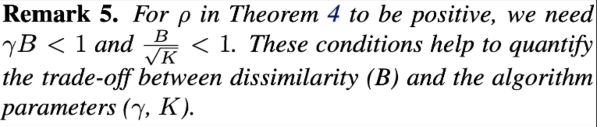

:target{#strategy-fedprox}

# 联邦策略：FedProx

:target{#fedavg-v-s-fedprox}

## FedAvg v.s FedProx

<table>
  <thead>
    <tr>
      <td>
        异构性
      </td>

      <td>
        FedAvg
      </td>

      <td>
        FedProx
      </td>
    </tr>
  </thead>

  <tbody>
    <tr>
      <td>
        数据异构性
      </td>

      <td>
        FedAvg不能对non-iid数据保证拟合
      </td>

      <td>
        FedProx能够对non-iid数据保证拟合速率
      </td>
    </tr>

    <tr>
      <td>
        设备异构性
      </td>

      <td>
        FedAvg没有考虑不同设备的异质性，例如计算力上的不同；对于每个设备来说，会安排相同的workload
      </td>

      <td>
        FedProx支持让每个设备进行不同workload的本地训练：通过在每轮为每个设备设置一个不同的“γ -inexact”参数，调整对每个设备在本地训练的精度要求；
      </td>
    </tr>
  </tbody>
</table>

:target{#fit}

## Fit

在目标函数中增加 Proximal Term

<Math>
  $$

  \mathop{max}\limits_{w} h_k(w;w^t)=F_k(w)+\frac{\mu}{2}||w-w^t||^2

  $$
</Math>

<InlineMath>$F_k(w)$</InlineMath>: 对于一组参数 w，在设备 k 上训练 k 本地数据得到的 loss

<InlineMath>$w^t$</InlineMath>: 在第 t 轮训练中，服务器发送给设备 k 的初始模型参数

<InlineMath>$\mu$</InlineMath>: 一个超参数

<InlineMath>$\mu/2||w - w^t||^2$</InlineMath>: proximal term, 限制优化后的 w 与 <InlineMath>$w^t$</InlineMath> t 轮发布的差异度 让每个设备k更新后的w之间不要差别过大，帮助拟合

:target{#different-training-requirements-for-each-device-inexact}

## 每个设备不同训练要求：γ -inexact

FedAvg 要求每个设备在本地训练时都完整地进行优化 E 个 epochs；而由于设备异质性，FedProx 希望在每一轮 t 中对每一个设备 k 提出不同的优化要求，不需要所有设备都完整地进行优化；

<InlineMath>$\mu_k^t \in [0,1]$</InlineMath>, 值越高代表限制条件越宽松，即对设备k的训练完成度要求越低；反之，当 <InlineMath>$\mu_k^t = 0$</InlineMath> 的时候要求参数训练的更新为 0，要求本地模型完全拟合；

借助 <InlineMath>$\mu_k^t$</InlineMath> 可以按照设备的计算力资源调整每个设备每轮的训练量；

:target{#requirements-for-parameter-selection-in-convergence-analysis}

## Convergence分析中对参数选取的要求

当选取的参数满足下述条件，模型的convergence rate的期望值可以被bound

:target{#parameter-conditions}

### 参数条件

<Math>
  $$

  \rho^t=(\frac{1}{\mu}-\frac{\gamma^tB}{\mu}-\frac{B(1+\gamma^t\sqrt(2))}{ \overline\mu\sqrt(K)}-\frac{LB(1+\gamma^t)}{\overline\mu\mu} - \frac{L(1+\gamma^t)^2B^2} {2\mu^2}-\frac{LB^2(1+\gamma^t)^2}{\mu^2K}(2\sqrt{2K}+2))

  $$
</Math>

要设置参数有三组：K，<InlineMath>$\gamma$</InlineMath>，<InlineMath>$\mu $</InlineMath>；其中 K 是 t 轮中选取的 client 设备数量，<InlineMath>$\gamma^t=max_k(\gamma_k^t)$</InlineMath>，<InlineMath>$\gamma$</InlineMath>，<InlineMath>$\mu$</InlineMath> 是设置 proximal term 的超参数。<strong>B 是用来假设当前参与数据分布差异的上限值，不确定怎么得到</strong>

:target{#fitting-rate}

### 拟合速率

如果参数的设置满足上述要求，则能够证明收敛性

:target{#sufficient-and-non-essential-conditions-for-parameter-selection}

### 参数选取的充分非必要条件

<InlineMath>$\gamma$</InlineMath> 和 <InlineMath>$B$</InlineMath> 之间存在 tradeoff，比如 <InlineMath>$B$</InlineMath> 越大说明数据分布差异性越大，则 <InlineMath>$\gamma$</InlineMath> 必须越小，对每个设备的训练要求越高；

:target{#experiment-1-effectiveness-of-proximal-term-and-inexactness}

## 实验1: proximal term和inexactness的有效性

:target{#summarize}

## 总结

<InlineMath>$\gamma$</InlineMath> 和 <InlineMath>$B$</InlineMath> 的定义和存在还比较理论, 在实践中可以直接按照设备资源确定设备的 workload

:target{#implementation}

## 实现情况

1. 针对数据non-iid的proximal term已实现
2. 针对设备异质性的inexactness待实现

:target{#reference}

## 参考文献

[Federated Optimization in Heterogeneous Networks](https://arxiv.org/pdf/1812.06127.pdf)
