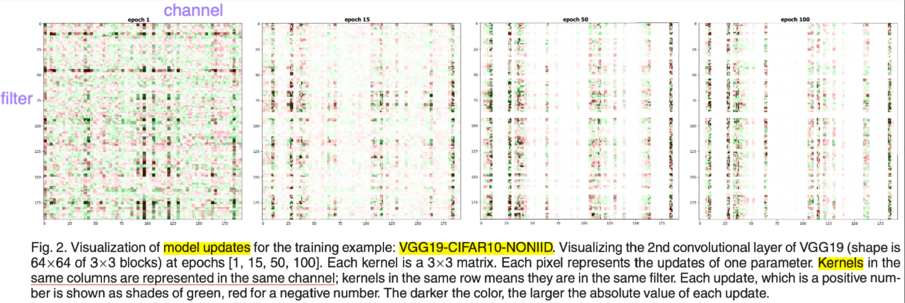
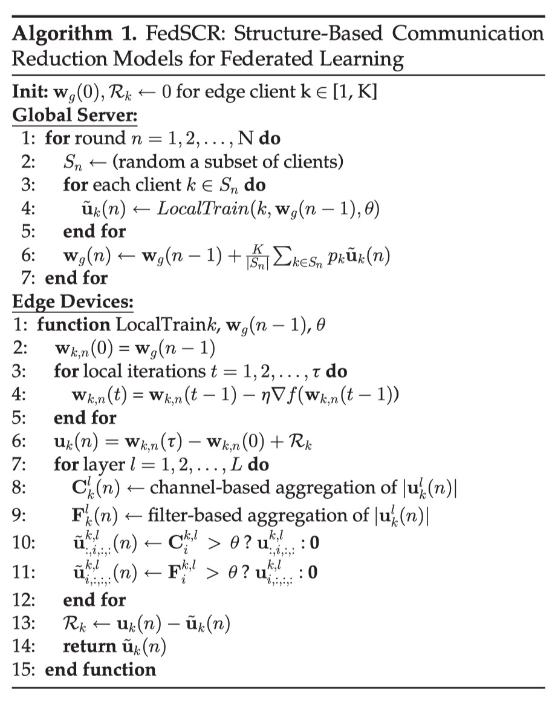
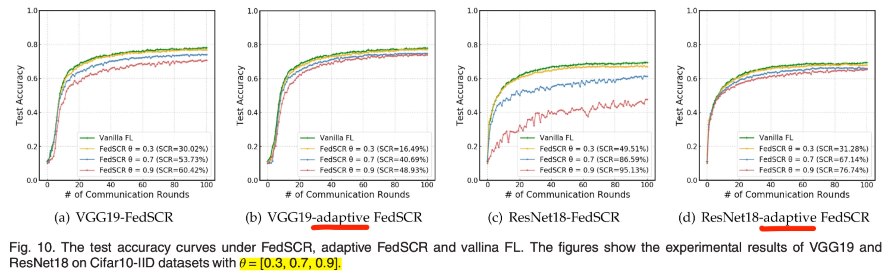
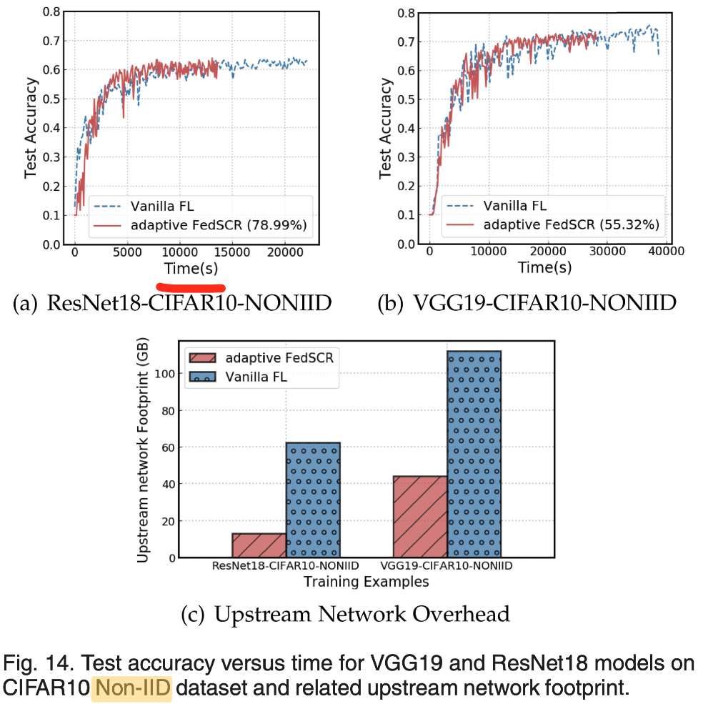

:target{#strategy-fedscr}

# 联邦策略：FedSCR

:target{#overview}

## 概览

<table>
  <thead>
    <tr>
      <td>

      </td>

      <td>
        稀疏方法
      </td>

      <td>
        量化方法
      </td>

      <td>
        残差
      </td>

      <td>
        编码
      </td>

      <td>
        上行
      </td>

      <td>
        下行
      </td>
    </tr>
  </thead>

  <tbody>
    <tr>
      <td>
        FedSCR
      </td>

      <td>
        结构化阈值
      </td>

      <td>
        None
      </td>

      <td>
        Yes
      </td>

      <td>
        None
      </td>

      <td>
        Yes
      </td>

      <td>
        No
      </td>
    </tr>

    <tr>
      <td>

      </td>

      <td>
        处理Non-IID
      </td>

      <td>
        处理 Dropping/Skipping
      </td>

      <td>

      </td>

      <td>
        通用性
      </td>

      <td>

      </td>

      <td>

      </td>
    </tr>

    <tr>
      <td>

      </td>

      <td>
        自适应阈值
      </td>

      <td>
        None
      </td>

      <td>

      </td>

      <td>
        只能应用在Conv Net
      </td>

      <td>

      </td>

      <td>

      </td>
    </tr>
  </tbody>
</table>

FedSCR的主要motivation是选择性地将部分重要更新进行回传，主要贡献如下

1. 对卷积网络中参数更新的pattern进行实证研究，发现“处于同一filter”和“处于同一channel”的参数梯度往往有很强的相关性
2. 按照（1）中的结论，在upstream的时候将选择性地不传输一些“不重要”（绝对值和低于threshold）的filter或channel参数，作为sparsity的方法
3. 针对non-iid的情况提出了adaptive FedSCR，能够按照异质性的情况控制每个client有不同的threshold

:target{#empirical-research}

## 实证研究

It is observed that in the training process of the convolutional neural network, there is a strong correlation between the parameters corresponding to the same channel under the same filter:

观察到在卷积神经网络的训练过程中，同一个filter下的、对应同一个channel的参数之间有很强的相关性：图中是在epoch=1/15/50/100时对于一固定层参数梯度值的可视化：其中每三行对应该层的一个filter，一个filter中每三列对应该层input的一个channel，可以观察到同一行/列的参数之间有很大的相关性

1. 同一filter/channel中weights的更新梯度很相似
2. 当一个参数接近拟合，同一filter/channel中的其他参数有很大概率也接近拟合

:target{#compression-design}

## 压缩设计

:target{#sparsity-method-core-structure-related}

### Sparsity Method（Core, structure-related）

核心思想是在clients上传更新时按filter和channel将“不重要的参数”过滤掉；过滤的方法：将每个filter/channel对应的梯度绝对值相加，如果和小于阈值，则将在这一轮不上传这一filter/channel对应的更新梯度，而是放入Residual中；

:target{#mathematical}

### 数学表达

计算一个 Channel 对应的梯度绝对值之和:

<Math>
  $$

  C^{k,l}_f(n)=\sum_{j=0}^{F_l}|u^{k,l}_{j,i,;,;}(n)|

  $$
</Math>

计算一个Filter对应的梯度绝对值之和:

<Math>
  $$

  F^{k,l}_f(n)=\sum_{j=0}^{C*l}|u^{k,l}*{i,j,;,;}(n)|

  $$
</Math>

如果 C/F \< threshold，则将这一 channel/filter 置0;

:target{#pseudo-code-compression}

### Pseudo Code (Compression)

:target{#adaptive-fedscr}

## Adaptive FedSCR

为了针对non-iid的数据分布，提出了adaptive FedSCR，目的是让每个client根据自身参数更新的情况（Weight Divergence，Significance of Local Updates）以及全局数据分布的情况（Impact of Data Distribution）调整每个client做稀疏化时用的threshold

:target{#convergence-proof}

## 收敛证明

reference:[Structure-Based Communication Reduction for Federated Learning](https://ieeexplore.ieee.org/document/9303442/figures#figures)

:target{#experiment}

## 实验

:target{#on-threshold}

### on threshold

:target{#on-convergence}

### on Convergence

:target{#on-convergence-non-iid-compare-with-fedstc}

### on Convergence (non-iid, compare with FedSTC)

:target{#on-accuracy}

### on accuracy

:target{#reference}

## 参考文献

[Structure-Based Communication Reduction for Federated Learning](https://ieeexplore.ieee.org/document/9303442/)
