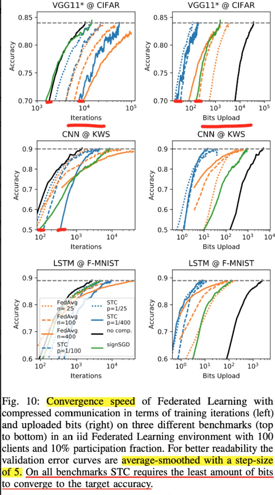

:target{#strategy-fedstc}

# 联邦策略：FedSTC

:target{#overview}

## 概览

<table>
  <thead>
    <tr>
      <td>

      </td>

      <td>
        Sparse method
      </td>

      <td>
        Quant method
      </td>

      <td>
        Residual
      </td>

      <td>
        Encoding
      </td>

      <td>
        Upstream
      </td>

      <td>
        Downstream
      </td>
    </tr>
  </thead>

  <tbody>
    <tr>
      <td>
        FedSTC
      </td>

      <td>
        topk
      </td>

      <td>
        binarization
      </td>

      <td>
        Yes
      </td>

      <td>
        Golomb
      </td>

      <td>
        Yes
      </td>

      <td>
        Yes
      </td>
    </tr>

    <tr>
      <td>

      </td>

      <td>
        Handle Non-IID
      </td>

      <td>
        Handle Dropping/Skipping
      </td>

      <td>

      </td>

      <td>
        Generality
      </td>

      <td>

      </td>

      <td>

      </td>
    </tr>

    <tr>
      <td>

      </td>

      <td>
        Fine //TODO
      </td>

      <td>
        Caching and synchronizing
      </td>

      <td>

      </td>

      <td>
        General
      </td>

      <td>

      </td>

      <td>

      </td>
    </tr>
  </tbody>
</table>

FedSTC的主要motivation是为client和server之间的通讯做压缩，主要的贡献如下

1. 相比之前仅在upstream（client 2 server）上做稀疏化的工作，FedSTC在downstream（server 2 client）上也做了稀疏化
2. 在每一轮只有部分client参与的情况下，在server侧提供了Weight Update Caching的机制，每个client在参加下一轮训练之前必须同步最新的模型，或者是和global weights相比落后的updates；（我理解这样的motivation是如果只更新部分updates，可以让要传输的内容是稀疏的）
3. 在做稀疏化的同时加上了量化，量化的方法是Binarization，最终的矩阵中只会出现3个数字，<InlineMath>$\{-\mu,0,\mu\}$</InlineMath>;
4. 在稀疏+量化后的矩阵上使用了无损的Golomb Encoding

:target{#design}

## 设计

:target{#sparsity-topk}

### Sparsity（topk）

仅有upstream sparse的情况: 加上downstream：  A是上一轮server侧的Residual，状态;

:target{#caching}

### Caching

The server keeps the most recent historical updates:

最新的 global weights 可以表示为：

一个client再次加入训练的时候，必须更新相应的 <InlineMath>$P^{(s)}$</InlineMath> 或 <InlineMath>$W$</InlineMath>；

:target{#binarization-quant-ternary-tensor}

### Binarization (quant -> ternary tensor)

<Math>
  $$

  e' \in {-\mu,0,\mu}, \mu = mean(abs(e))

  $$
</Math>

假设mu是sparse后的matrix中所有元素绝对值之和，matrix中非0的元素都被按照符号二值化为 <InlineMath>$\mu$</InlineMath> 或 <InlineMath>$-\mu$</InlineMath>；

:target{#pseudo-code-on-compression}

### Pseudo Code on Compression

:target{#lossless-encoding}

### Lossless Encoding

Golomb Encoding

:target{#experiment}

## Experiment

在不同的模型+数据集上做实验：

<table>
  <thead>
    <tr>
      <td>
        model
      </td>

      <td>
        dataset
      </td>
    </tr>
  </thead>

  <tbody>
    <tr>
      <td>
        VGG11
      </td>

      <td>
        CIFAR
      </td>
    </tr>

    <tr>
      <td>
        CNN
      </td>

      <td>
        KWS
      </td>
    </tr>

    <tr>
      <td>
        LSTM
      </td>

      <td>
        Fashion-MNIST
      </td>
    </tr>

    <tr>
      <td>
        Logistic R”
      </td>

      <td>
        MNIST
      </td>
    </tr>

    <tr>
      <td>
        FedAvg作为baseline之一，为了和FedSTC在传输成本上横向对比，FedAvg使用delay period，例如对sparse rate = 1/400的FedSTC，delay period为400 iterations；
      </td>

      <td>

      </td>
    </tr>

    <tr>
      <td>
        <strong>实验结论：FedSTC在（a）non-iid的情况下，（b）small batch size的情况下，（c）参与的client数量大但每轮参与度低的情况下明显比FedAvg好</strong>
      </td>

      <td>

      </td>
    </tr>
  </tbody>
</table>

:target{#on-non-iidness}

### on Non-iidness

:target{#outperforms-fedavg}

#### outperforms FedAvg

:target{#on-batch-size}

#### on batch size

:target{#on-drop-rate}

#### on drop rate

:target{#on-data-amount-unbalanced}

#### on data amount unbalanced

:target{#on-convergence}

#### on convergence

:target{#implementation}

## 实现情况

1. upstream和downstream中的sparse+binarization已经实现；
2. caching没有实现;
3. golomb/ encoding没有实现；

:target{#reference}

## 参考文献

[Robust and Communication-Efficient Federated Learning From Non-i.i.d. Data](https://ieeexplore.ieee.org/document/8889996)
