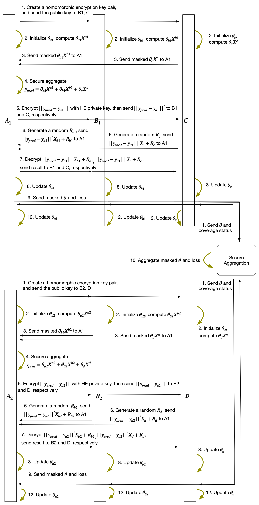

:target{#federated-logistic-regression-with-mix-partitioned-data}

# 混合切分联邦逻辑回归

:target{#what-is-mix-partitioned-data}

## 混合切分的概念

混合切分指的是数据同时包含了水平和垂直切分。混合切分的一个示例如下：A和B拥有相同的样本但是不同的特征，同时C、D、E拥有不同的样本但是特征相同。

:target{#partitioning}

## 切分

数据首先被切分成多个垂直分块。

垂直数据0由A的数据分块0、B的数据分块0、C的数据、标签分块0构成，这些分块对应相同的样本，垂直数据1和2依次类推。

:target{#algorithm}

## 算法

针对混合切分数据，隐语提供了基于随机梯度下降的联邦逻辑回归算法。

算法概览：

1. 对垂直数据的多个数据分块进行垂直联邦逻辑回归。
2. 对多个垂直数据进行水平联邦逻辑回归。

算法详细步骤如下：

（假设A持有标签）

