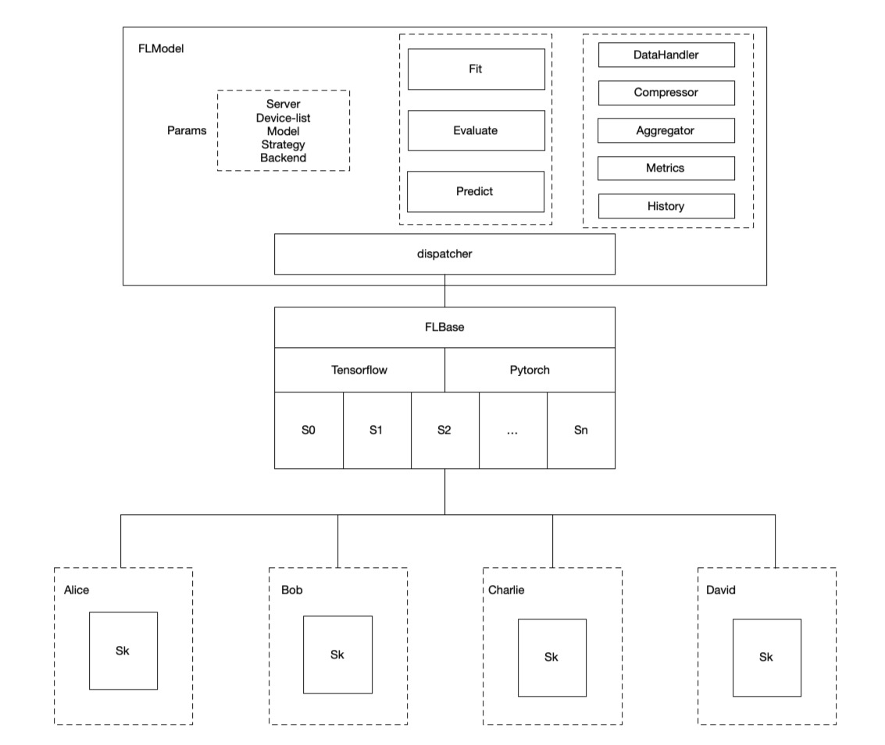
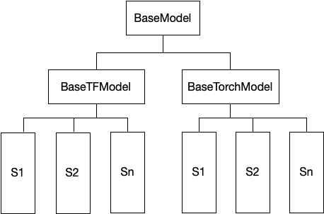

:target{#flmodel-design}

# FLModel设计文档

FLModel是SecretFlow提供的联邦学习的逻辑抽象，也是面向用户的统一接口。FLModel封装了联邦学习框架下需要的各种能力，包括数据处理，训练策略，聚合逻辑等，用户可以通过FLModel接口方便快速的将已有的明文计算模型，通过简单的迁移，快速形成联邦学习能力，低学习成本的联合多方建立联合模型。

:target{#design-principles}

## 设计原则

1. 联邦逻辑层提供隐语的用户API，提供统一的接口，屏蔽掉底层差异，简化用户学习成本
2. 接口使用符合用户习惯，用户仅需迁移已有代码，无需对原有代码进行修改
3. 参数化配置后端，strategy，sampler等联邦模型配置，简化用户体验
4. 支持Torch、Tensorflow多种后端，不同后端的编程体验一致。

:target{#architecture}

## 架构框图

SecretFlow提供了中心化视角下的FLModel模块，联邦整体流程由FLModel来进行编排，由传入FLModel的参数来决定使用那些worker想会被拉起来进行联邦计算。

example：

```python
fed_model = FLModel(
    server=charlie,
    device_list=[alice,bob],
    model=model_def,
    aggregator=secure_aggregator,
    strategy="fed_avg_w",
    backend = "tensorflow")
```

通过参数告诉FLModel，我想使用alice，bob，charlie三方来进行计算，其中charlie用作server，后端使用tensorflow来进行计算，联邦学习策略使用fed\_avg\_w。

架构文档请参考: [strategy document](strategy.mdx)

:target{#model-definition}

## model definition

模型定义方法几乎和原生tf和torch一致，只需要ctrl+c ctrl+v到对应位置即可

```python
def create_conv_model(input_shape, num_classes, name='model'):
    def create_model():
        from tensorflow import keras
        from tensorflow.keras import layers

        # Create model
        model = keras.Sequential(
            [
                keras.Input(shape=input_shape),
                layers.Conv2D(32, kernel_size=(3, 3), activation="relu"),
                layers.MaxPooling2D(pool_size=(2, 2)),
                layers.Conv2D(64, kernel_size=(3, 3), activation="relu"),
                layers.MaxPooling2D(pool_size=(2, 2)),
                layers.Flatten(),
                layers.Dropout(0.5),
                layers.Dense(num_classes, activation="softmax"),
            ]
        )
        # Compile model
        model.compile(
            loss='categorical_crossentropy', optimizer='adam', metrics=["accuracy"]
        )
        return model

    return create_model

num_classes = 10
input_shape = (28, 28, 1)
model_def = create_conv_model(input_shape, num_classes)
```

```python
class ConvNet(BaseModule):
    """Small ConvNet for MNIST."""

    def __init__(self):
        super(ConvNet, self).__init__()
        self.conv1 = nn.Conv2d(1, 3, kernel_size=3)
        self.fc_in_dim = 192
        self.fc = nn.Linear(self.fc_in_dim, 10)

    def forward(self, x):
        x = F.relu(F.max_pool2d(self.conv1(x), 3))
        x = x.view(-1, self.fc_in_dim)
        x = self.fc(x)
        return F.softmax(x, dim=1)
model_def = TorchModel(
            model_fn=ConvNet,
            loss_fn=nn.CrossEntropyLoss,
            optim_fn=optim_wrapper(optim.Adam, lr=5e-3),
            metrics=[
                metric_wrapper(Accuracy, task="multiclass", num_classes=3, average='micro'),
                metric_wrapper(Precision, task="multiclass", num_classes=3, average='micro'),
            ],
        )
```

FLModel会将这些参数发给strategy dispatcher，dispatcher根据这些参数拉起不同的实例，pytorch或者tensorflow只在最底层的实现层会有差别，在用户这一层无需感知。同时FLModel会在逻辑上保证pytorch和tensorflow使用体验上的一致。

:target{#demo}

## Demo

tensorflow backend: [Federated learning for image classification](../../tutorial/Federate_Learning_for_Image_Classification.mdx)<br />pytorch backend: [Federated learning with pytorch backend](../../tutorial/Federated_Learning_with_Pytorch_backend.mdx)

:target{#api}

## API

:target{#fit}

### Fit

fit接口是FLModel的训练接口，支持FedHDataFrame，FedNdarray以及csv路径等方式读取。返回值是一个history对象，里面包含训练过程中的指标细节，和loss变化。同时fl\_model是训练后的结果，可以在这个基础上进行evaluate，predict 等。

:target{#evaluate}

### Evaluate

evaluation是离线评估接口，用户可以传入各方待评估的HDataFrame或者FedNdarray。返回值是两个对象local metrics和global\_metrics。

:target{#predict}

### Predict

Predict是离线预测接口，用户传入各方待预测的HDataFrame或者FedNdarray返回值是一个Dict\<PYU,PYUObject>, 其中PYUObject是每一方的预测结果，只有各方同意后被reveal出来才能看到明文

:target{#load-model}

### Load\_model

load model是模型加载接口model\_path支持str或者Dict，如果是str默认各方存储位置一致，每一方str指向的路径。is\_test：标记是否为单机模拟，如果单机模拟的话，会在model\_path的基础上增加一级device目录，以示区别

:target{#save-model}

### Save\_model

save model是模型存储接口model\_path支持str或者Dict，如果是str默认各方存储位置一致，每一方str指向的路径。is\_test：标记是否为单机模拟，如果单机模拟的话，会在model\_path的基础上增加一级device目录，以示区别

:target{#multiple-backend-support}

## 多后端

- SecretFlow提供了BaseModel的基类，定义了联邦场景下worker所必须的方法集合供FLModel在流程编排的时候使用。
- 具体的TorchModel和TensorFlowModel会使用自己引擎特有的API实现这些方法。
- 再往下的各个strategy会各自实现自己的train step，以及相关其他策略。
- FLModel会借助strategy dispatcher将具体的实例worker拉起来完成计算。


