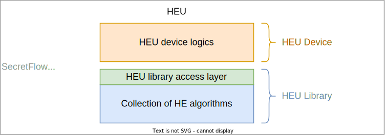
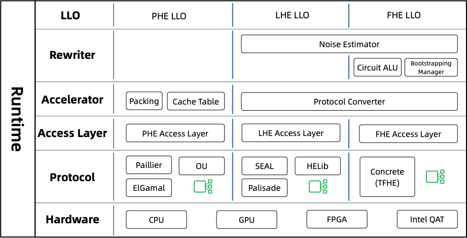

:target{#heu-device}

# HEU 设备

:target{#what-is-heu}

## HEU 是什么

HEU (Homomorphic Encryption processing Unit) 是隐语的一个子项目，它实现了高性能的同态加密算法

HEU 的目的是为了降低同态加密算法的使用门槛，这样用户就可以很容易地构建隐私保护应用程序而无需专业的密码学知识

:target{#the-design-of-heu}

## HEU 设计思想

HEU 包括两层含义，它既是隐语中的一个设备(HE Device)，也是一个可以独立使用的同态加密算法库(He Library)

HEU Library: 你可以把 HEU 看作是一个高性能的同态加密算法库，它实现、集成了业界主流的同态加密算法。同时，HEU 还抽象出了统一接入层（library access layer），它向下屏蔽不同算法的细节，向上提供一致的编程接口。

HEU device: HEU 同时也是隐语中的一个可编程设备，它可以降低隐私保护应用程序的开发门槛。过去，基于一些密码学算法开发隐私保护应用是一件比较难的事，而开发明文程序是相对容易的，HEU 可以自动将明文程序翻译成隐私保护程序，这样用户就可以像写明文程序一样开发隐私保护应用，大大降低了行业准入门槛。相比隐语其它设备，HEU 的特点是可以在本地完成所有密态计算，不依赖网络，这个特性正好与 SPU 是互补的。

:target{#insight-into-heu}

### 深入 HEU

现在让我们详细看一下 HEU Library 的设计。

同态加密算法多种多样，算法间的差异也很大，把世界上所有的算法都抽象成一种接口是几乎不可能的事。鉴于此，HEU 退而求其次，把 HE 算法分成三类，每一类算法对应一种工作模式，同种工作模式下不同的算法遵循相同的接口：

<table id="id1">
  <caption>
    HEU 工作模式
  </caption>

  <thead>
    <tr>
      <td>
        工作模式
      </td>

      <td>
        支持的密态运算类型
      </td>

      <td>
        密态运算次数
      </td>

      <td>
        同态加密算法
      </td>

      <td>
        计算速度
      </td>

      <td>
        密文大小
      </td>
    </tr>
  </thead>

  <tbody>
    <tr>
      <td>
        PHEU
      </td>

      <td>
        加法
      </td>

      <td>
        无限制
      </td>

      <td>
        Paillier
      </td>

      <td>
        快
      </td>

      <td>
        小
      </td>
    </tr>

    <tr>
      <td>
        LHEU
      </td>

      <td>
        加法、乘法
      </td>

      <td>
        有限次
      </td>

      <td>
        BGV, CKKS
      </td>

      <td>
        快（Batch 模式）
      </td>

      <td>
        最小（Batch 模式下的均摊大小）
      </td>
    </tr>

    <tr>
      <td>
        FHEU
      </td>

      <td>
        加法、乘法、比较、多路选择（MUX) 等等
      </td>

      <td>
        无限制
      </td>

      <td>
        TFHE (Bitwise)
      </td>

      <td>
        非常慢
      </td>

      <td>
        最大
      </td>
    </tr>
  </tbody>
</table>

<Container type="note">
  HEU 当前还在快速迭代开发阶段，LHEU 和 FHEU 暂时不可用，仅 PHEU 模式是可用的。
</Container>

由于 HEU 提供三种不同的工作模式，HEU 在架构上也可分为相对独立的三部分。

最左边的部分整合了 PHE 算法，具体包括 Paillier、ElGamal 等等，HEU 深度改进并优化了这些算法的性能，性能通常比第三方库更高，因此，即便您不需要隐语，只把 HEU 单独拿出来当做 PHE lib 使用也是有收益的。

中间部分整合了 LHE 库，包括 SEAL、HELib、Palisade 等等。需要注意的是，BGV/BFV/CKKS 在学术上通常认为是全同态加密算法（FHE），但是因为这些算法的 FHE 特性依赖 Bootstrapping 操作，而 Bootstrapping 性能极低，不俱备实用性，因此这几种算法在 HEU 中被当做 LHE 使用

最右边的部分整合了全同态库，即 [Concrete](https://github.com/zama-ai/concrete)，当前只支持这么一种，他是由 [Zama.ai](https://www.zama.ai/) 公司研发的改进版 TFHE 算法，其特点是只支持单比特加密，因此性能很低，但优点是 Bootstrapping 比 LHE 快的多。举例来说，一个 int64 整数使用 TFHE 加密后会产生64个密文，而为了把两个 int64 整数相加，FHE 方案需要执行一个非常复杂的加法电路才能完成计算，可见效率是非常低的。总之，FHE 模式只适合计算量比较少的场景，但它的比特加密模式可以执行任意电路，也就使得 FHEU 俱备执行任意计算的能力

水平方向 HEU 也可以分为好几层。最上面的是 <code>LLO\`\`（low level operators）层，它是 HEU Library 的入口。HEU Device 首先会将用户代码翻译成 DAG 图，并进一步编译成 LLO 提交给 HEU Library，LLO 定义了一组细粒度的原子操作用于和上层交互。第二层是 \`\`Rewriter</code>，用于转换 LLO code 以适应不同的工作模式。第三层是 <code>Accelerator</code>，用于进一步修改和优化 LLO code。第四层是 <code>Access Layer</code>，这一层对不同的 HE 算法抽象出了统一的接口，方便后续做协议插拔。倒数第二层是 <code>Protocol</code>，这一层集成了市面上主流的同态加密库；最底层是 <code>Hardware</code>，用于实现 HE 的硬件加速，这一层还没完全实现，我们计划首先实现 PHE 的硬件加速（基于 GPU 和 Intel QAT 密码卡），之后再对 LHE 和 FHE 做硬件加速支持。
