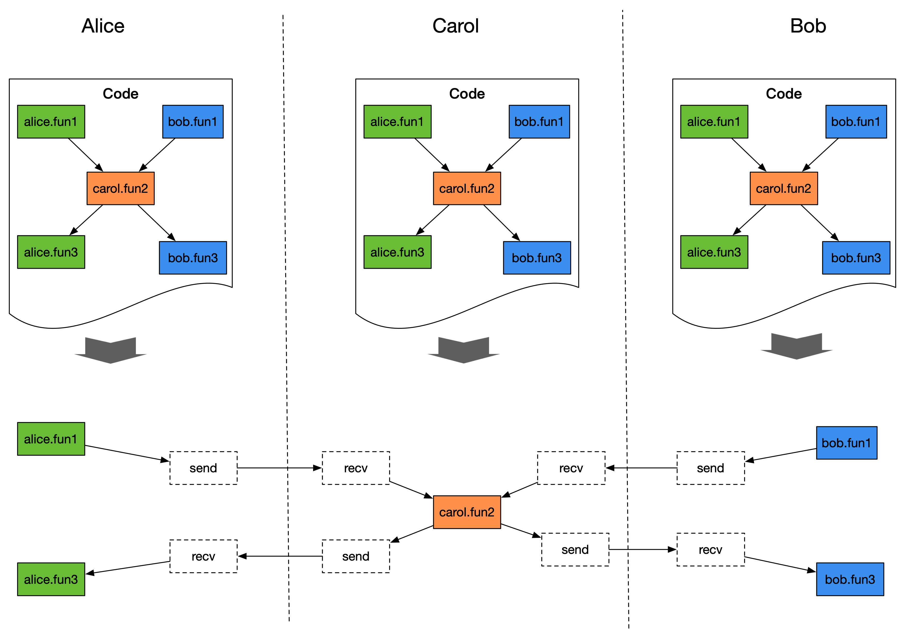
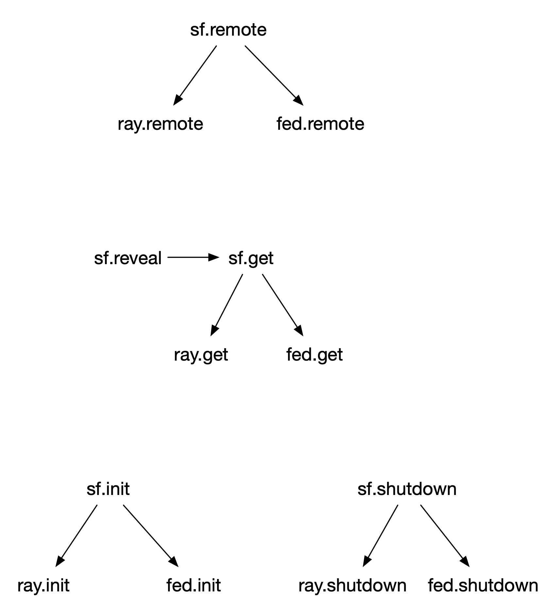

:target{#programming-in-secretflow}

# 隐语的编程思想

:target{#single-controller-vs-multi-controller}

## 单控制器和多控制器模式

隐语旨在提供隐私保护机器学习和数据分析，面临的场景天然是跨机构分布式的。面对跨机构分布式场景，如何提供高效简洁的编程模式是隐语面临的挑战之一。

目前常见的两种分布式编程思路可以主要归为两大类。

- 第一类我们称为多控制器模式。开发者需要为每个参与方分别编写代码，参与方之间通常通过MPI语义（比如 all\_gather, all\_reduce 等）互相通信。每个参与方执行各自的代码来完成合作，比如SPU背后就是这种模式。顺便说一下，多控制器模式也可以把多方代码写在一个代码文件中，前提是多方代码的逻辑基本是一样的（所谓的同构代码）。
- 第二类我们称之为单控制器模式。即开发者拥有全局的视角，每个参与方的代码逻辑写在同一份代码中，实际运行时只需要运行这一份代码，通过任务下发机制（比如ray的remote机制）统一管理各参与方的执行逻辑。典型的如ray，ray提供了driver视角配合remote机制，用户可以在全局视角下编写分布式代码。

两种模式各有优劣，并无绝对的好坏之分。下面是目前我们总结到的一些经验。

多控制器

- 优点
  - 适合代码逻辑同构的场景。
  - 参与方可以审核代码并决定执行与否。
- 缺点
  - 对代码逻辑异构场景不友好：逻辑分散在不同代码块中，缺乏全局视角，可能导致代码理解难度变高。

单控制器

- 优点

  同时适合代码逻辑同构和异构的场景。
- 缺点

  依赖任务下发机制，任务下发机制可能带来安全漏洞，一方面参与方不好审核代码，另一方面恶意代码执行的防范会比较难做到

考虑到隐语是一个明密文混合编程框架，代码同构异构的需求同时存在，受到ray的启发，隐语最开始是直接采用单控制器模式来编写代码。但是如上述，单控制器模式存在安全隐患，且不好解决。所以问题来了，我们是否可以同时兼顾单控制器和多控制器模式，各取其优点？答案是可以的，这就是下面要讲的隐语编程思想——单控制器编程，多控制器执行。

:target{#multi-controller-execution}

## 多控制器执行

:target{#the-principle}

### 原理

多控制器执行的核心思路是每个参与方都运行同一份代码，但是仅执行代码中属于自己的部分。

假如我们把代码逻辑看成一个DAG（有向无环图），DAG的每个节点表示一段属于某个参与方的代码逻辑，边表示不同节点之间的数据流转，则多控制器执行原理可以如图所示。

为了达成此目的，DAG的每一个节点都被标记了参与方（party），代码执行时，通过party属性判断节点的归属方，并决定是否需要执行。

- 情形一

  节点属于自己，则执行该节点；若节点的输入依赖来源于其他方，则插入recv节点等待从其他方接收。
- 情形二

  节点不属于自己，则判断节点的输入依赖是否来源于自身；若来源于自身，则插入send节点发送给节点归属方。



多控制器执行原则上要求代码的控制流是确定性的，每一方执行同样代码时，理应生成一模一样的DAG。这是多控制器模式能够正确执行的前提。

为了确保这一点，对编程带来了一些要求，后文会详细提及。

:target{#cross-silo-communication}

### 跨机构通信

目前跨机构通信的实现中，DAG的每一个节点都会被顺序标注序号，send/recv会根据节点的序号来确保数据的收发正确性。这么设计主要是为了简化跨架构通信，同时也引入了一些限制，比如控制流中本身不能多线程（否则跨机构分布式的序号生成会出错）。

:target{#implementation}

### 实现

欢迎访问[rayfed](https://github.com/ray-project/rayfed)阅读相关代码。

:target{#instructions}

### 使用方法

多控制器执行模式使用方法比较简单，只需要在secretflow\.init的时候提供每个机构通信的地址，并指定当前参与方。

<strong>示例</strong>

对于参与方alice，启动方式如下。

```python
import secretflow as sf

cluster_config = {
    'parties': {
        'alice': {
            'address': '127.0.0.1:20001',
        }
        'bob': {
            'address': '127.0.0.1:20002',
        }
    },
    'self_party': 'alice'
}
sf.init(cluster_config=cluster_config)
```

对应的，参与方bob启动方式如下。

```python
import secretflow as sf

cluster_config = {
    'parties': {
        'alice': {
            'address': '127.0.0.1:20001',
        }
        'bob': {
            'address': '127.0.0.1:20002',
        }
    },
    'self_party': 'bob'
}
sf.init(cluster_config=cluster_config)
```

:target{#programming-notes}

### 编程注意事项

多控制器执行模式隐式的要求了每一方执行的DAG是相同的，这带来了一些编程上的要求。

1. 避免控制流中出现不确定性，即控制流无论在何时何地执行，其生成的执行图应该是一致的。
   - 不能在控制流中直接生成随机数，或者依赖某个环境因素（比如某个文件是否存在），我们需要确保控制流代码是确定性的。比如FLModel的控制流中有生成随机数当种子的做法。一种替代的方式是让某一个参与方生成随机数，然后广播给其他参与方。
2. 单测

   单测中遇到的情况会比较复杂。目前单测中使用多进程模拟多个参与方，但是由于代码是在同一台机器上执行，所以会遇到更多corner case。
   - driver生成临时文件，然后删除。多进程模拟时可能出现冲突 -> 解决办法：让PYU生成/删除文件。
   - driver生成随机ndarray -> 解决办法：让PYU生成然后返回。
   - SecretFlow内置了一些数据集，下载的时候会写入本地缓存文件。多进程模拟时会出现写冲突 -> 解决办法：引入跨进程的文件锁。
   - 某些单测会构造异常case，然后assertRaiseException。假如alice执行抛异常了，则alice后续的节点不会执行，bob可能捕获不到异常。-> <strong>待解决，rayfed暂时还不具有异常广播能力。</strong> 目前临时把这类case注释掉了（个位数）
   - spu提供了reset方法，会停掉已有的spu actor，然后重新拉起，主要用于某些testcase会构造spu出错，需要清理spu的状态。由于多进程模拟执行，可能某一方的spu actor停止重启后，另一方的spu actor可能还没重启，新旧spu actor连上了。 -> <strong>待解决</strong> （case数量小于5）
3. `sf.remote` 暂不支持装饰器模式，后续会支持。目前可以使用 `sf.proxy` 对class进行装饰。

:target{#single-controller-execution}

## 单控制器执行

多控制器执行需要启动多个ray集群，debug也比单控制器模式难。为了方便用户仿真，隐语仍然支持单控制器执行模式，即用户仍然可以使用一个ray集群来模拟多参与方。

<strong>单控制器执行和原来没有变化，代码无需任何修改。</strong>

单控制器执行使用方式很简单，只需要在secretflow\.init的时候，提供 `parties` 参数，具体使用方法可以参考 [sf.init](../../source/secretflow.device.mdx#secretflow.device.driver.init)。

SF底层封装了ray和rayfed两套原语，向上统一成一种原语。


